# Sapphire Rapids：Golden Cove 进入服务器之后

> **文章来源**
>
> - 文章：*Sapphire Rapids: Golden Cove Hits Servers*
> - 撰文：Chester Lam
> - 首发：Chips and Cheese
> - 发布：2023 年 3 月 12 日
> - 链接：https://chipsandcheese.com/p/a-peek-at-sapphire-rapids

Golden Cove 让 Intel Client 重回竞争，Server 却已被 AMD Rome/Milan 逐步侵蚀，TOP500 新增系统也大量采用 EPYC。Sapphire Rapids（SPR）把 Golden Cove 带进 Xeon：更高 Core Count、改造 Cache、2×512-bit FMA、AMX，以及 Crypto/Compression Accelerator。

测试来自 Intel Developer Cloud 免费 Xeon Platinum 8480 Instance（只开放少数 Core）与 Google Cloud Preview，另有多种 Cloud CPU 对照。没有 Bare Metal 权限，Memory Configuration、Mesh/NUMA Policy 与 Neighbor Load 不完全可知；部分多核结果只到 32 Core，之后是 Projection。

## Clock：DevCloud 的 Boost 慢得异常

SPR Idle 800 MHz，35 ms 后约 2 GHz，超过 1.6 s 才短暂到 3.1 GHz 约 8 ms，随后 3.8 GHz。

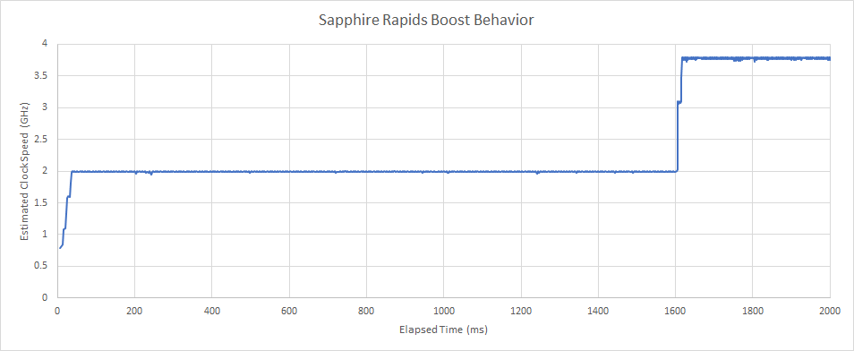

*图 1：这很可能是 DevCloud Policy，不代表 SPR Hardware 的固有 Boost Speed，却给微基准带来很大干扰。GCP 又把 Core 锁在 3 GHz，跨 Cloud 不能只比 Architecture。*

## Vector：两套 512-bit FMA 与混合宽度 RF

没有 Hybrid ISA 不一致顾虑，Server 开启 AVX-512。Port 0/1 的两个 256-bit FMA 可合成一个 512-bit FMA，Port 5 再加一个 Server-only 512-bit FMA。Scheduler 出现 512-bit FMA 时，Port 0/1 在 2×256 或 1×512 Mode 间配置；混合 256/512 FMA 不会比只跑 512 获得更高 IPC。

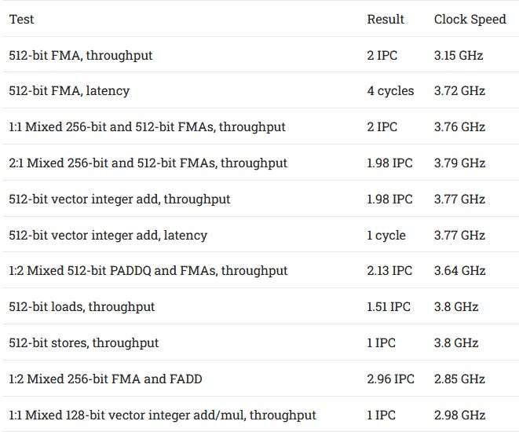

*图 2：共享 Server 上 Turbo 活跃，Clock 与 Instruction Mix 没有清晰相关；512-bit Vector 可见最高 3.8 GHz，说明不存在固定不变的 AVX-512 Offset，但不能推出任何负载都无降频。*

AVX-512 Mask Register 可见约 144 Rename，加 8 个 Architectural State，推得总约 152 Entry，与 Sunny Cove 相同。Vector RF 更复杂：与 Client Golden Cove 一样，只有部分 Entry 支持 512 bit，以较低 Area 为 Scalar/AVX2 增加 Rename Capacity。

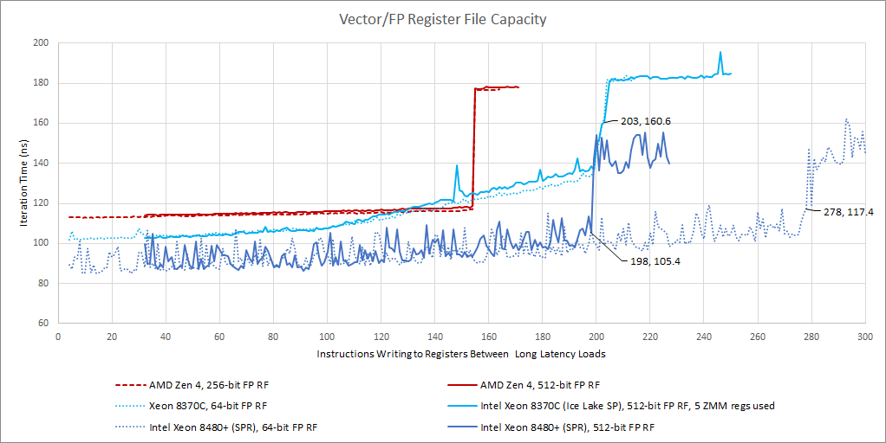

*图 3：SPR 测得容量略低于 Client Golden Cove，但 512-bit Rename 仍显著多于 Zen 4。它是阻塞微基准反推，不是均匀阵列的官方行数。*

### 体系结构视角：混合宽度 RF 是面积与 ISA 覆盖的折中

若全部 Entry 512-bit，容量、Port、Wakeup/Bypass 功耗很高；若全 256-bit，ZMM 需占两项并减少 Window。混合池让常见 Scalar/AVX2 获得更多 Entry，AVX-512 仍有足够 Rename。混合 Instruction 可能产生碎片或某池先满，因此必须用不同 Width 组合测 Dispatch Stall。

## Cache：2 MB L2 很快，Unified L3 很慢

L2 从 Client Golden Cove 1280 KB 增到 2 MB，Raptor Lake Client 后来也类似。Raptor Lake/SPR 都为 16-cycle，比 Golden Cove 多一拍、Ice Lake SP 多两拍；Zen 3 是 512 KB/12-cycle。Intel 用 Latency 换容量，以喂 Vector，并隔离强调容量而非速度的 L3。

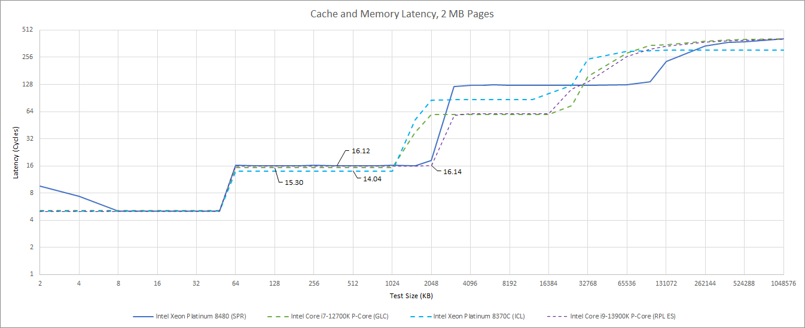

*图 4：SPR Clock 较高仍不足以完全抵消更深 L2 Pipeline。*

L3 约 33 ns，比 Ice Lake SP 回退约 33%。DevCloud 把四 Tile 暴露为 Monolithic Entity，单一大 L3 横跨 56 Core/56 Slice；Memory Controller、Accelerator 和 I/O 也挂 Mesh，且跨 EMIB。

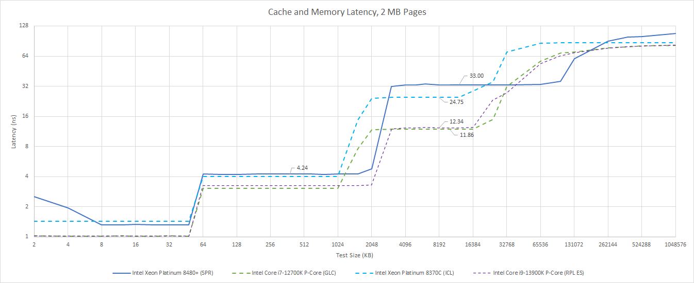

*图 5：高容量统一 L3 的端到端代价很高。*

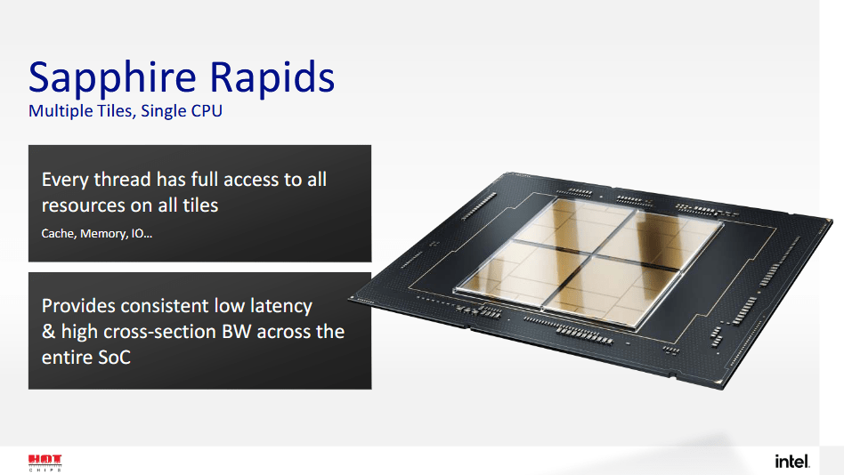

*图 6：正式图注说明来自 Hot Chips。每 Slice 从 Ice Lake SP 1.25 MB 增到 1.875 MB；Mesh 更大、Agent 更多、EMIB Stop Bandwidth 高一个量级，集成难度巨大。*

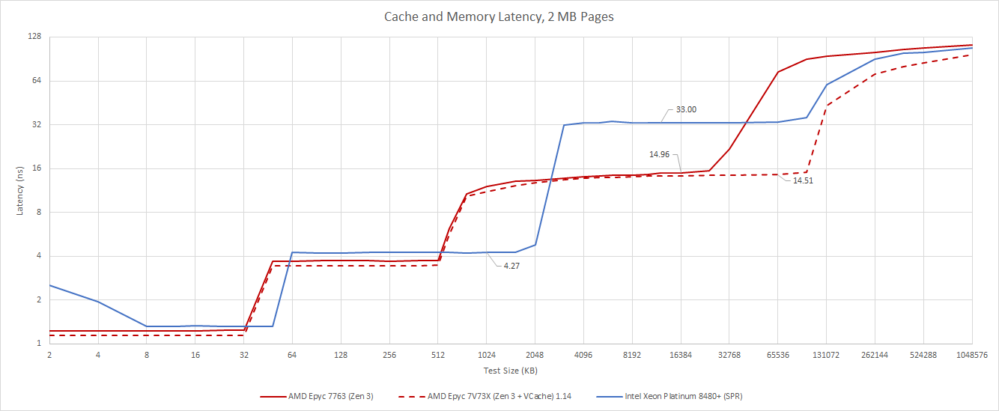

*图 7：Latency 接近 Ampere Altra/Graviton 3，却提供数倍容量。AMD 则让每 CCD 八 Core/八 Slice 管自己的 L3，避免巨型统一互连；标准 SKU 单 Cluster 容量小，V-Cache 以 3D Stack 加 64 MB。*

DRAM 1 GB Array/2 MB Page：SPR 略高于 107 ns；EPYC 7763 为 112.34、7V73X 96.57，Graviton 3 约 118。均为 Memory 配置未知的 Cloud，只作量级。

GCP 似乎把 SPR 分成小 Cluster，容量较小、Latency 较好，Clock 也仅 3 GHz。

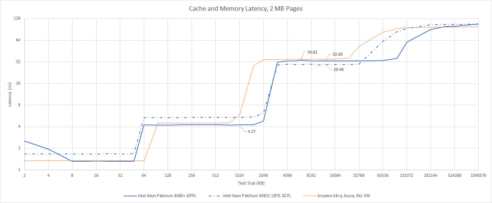

*图 8：较低 Core Clock 会压缩以 ns 表示的差距。*

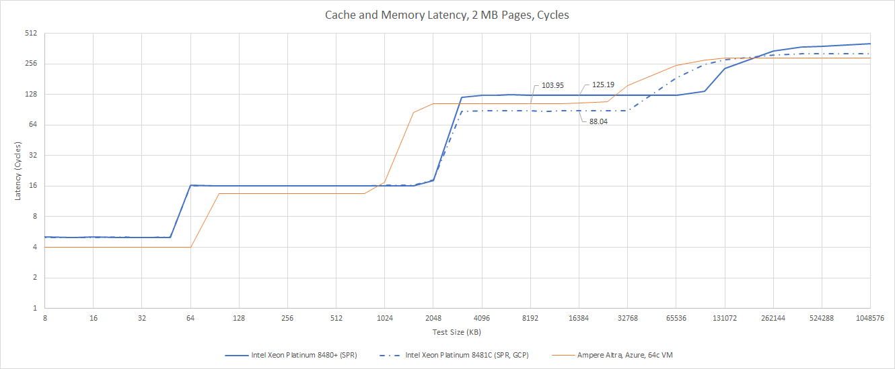

*图 9：125→88 cycle 更明显，但不能全归因于 Cluster；若 Mesh Clock 相似，GCP 更低 Core Clock 也会降低换算 Cycle。Zen 3 L3 随 Core Clock 约 47 cycle、V-Cache 约 50，即使少跨 EMIB 的 SPR 仍更慢。*

4 KB Page 下，L2 TLB Hit 额外 7 cycle。慢 L3 叠加 Translation 后，在 L2 TLB Coverage 内 Effective 约 39 ns，溢出后 48.5 ns。

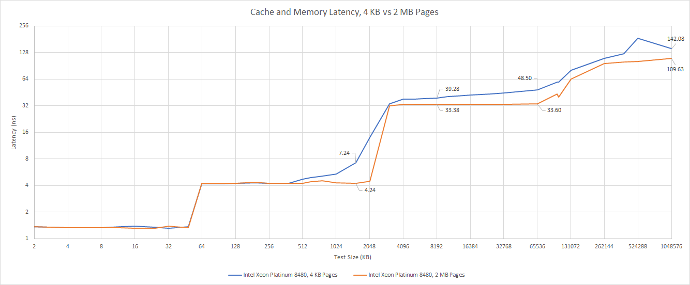

*图 10：2 MB Huge Page 能隔离 Cache 本体，真实 4 KB Workload 还会遇到 TLB/Page Walk。*

### 体系结构视角：统一 L3 与分区 L3 优化不同共享模式

统一 L3 允许单线程用全部容量、Shared Data 只存一份、一致性延迟更均匀；分区 L3 把每个 Interconnect 问题缩小，低 Latency/高 Bandwidth，却可能复制 Shared Line，跨 Cluster 又要更慢 Path。不存在“容量总和相同就等价”。

## Bandwidth：L2 内强，L3 后掉速

L1D 每周期两次 512-bit Load，L2→L1 64 B/cycle。AVX-512 Working Set 在 L2 内时，SPR 明显领先 AMD。

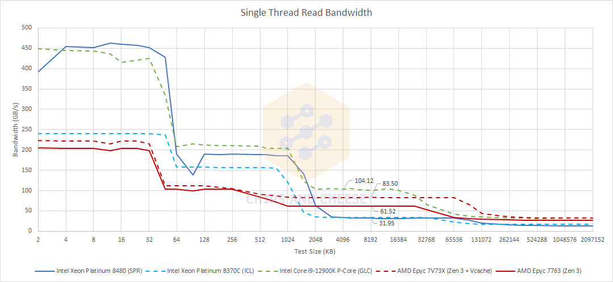

*图 11：3.8 GHz SPR 与 >5 GHz i9-12900K 接近，因为 Client 关闭 AVX-512；Alder Lake 非官方开启时 L1D 可超 600 GB/s，不属于官方支持能力。*

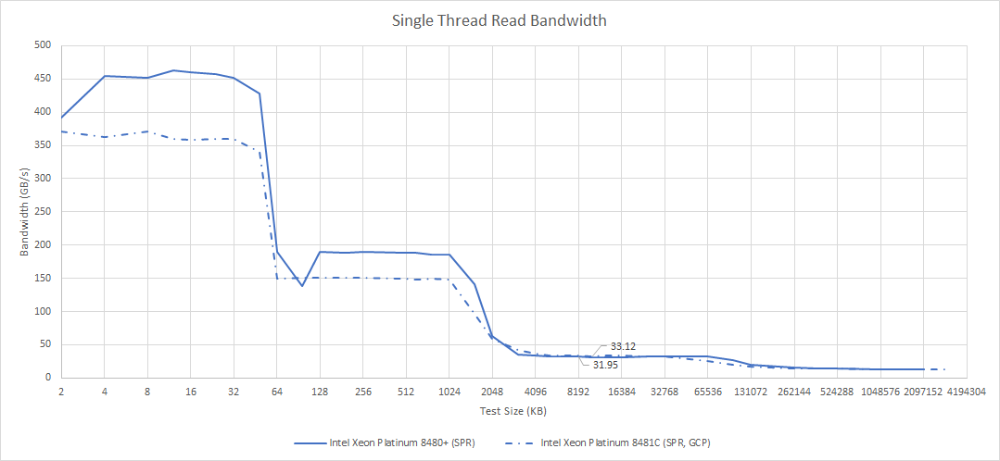

*图 12：超过 L2 后 AMD 领先；SPR Per-core L3 约等于 Ice Lake SP，可能被 Latency 限制。*

GCP 小 Cluster 单核 L3 稍好，也支持 Latency-limited 解释。Little’s Law 下，稳态 Throughput 约为 Queue Capacity/Latency；GCP 锁 3 GHz 又降低 L1/L2 Absolute Bandwidth。Cloud 为一致 Performance 固定最坏可持续 Clock，避免 Neighbor 影响。

32 Core 加载时，Non-inclusive L3 的 Cacheable Working Set 约等于 L2+L3 总容量。

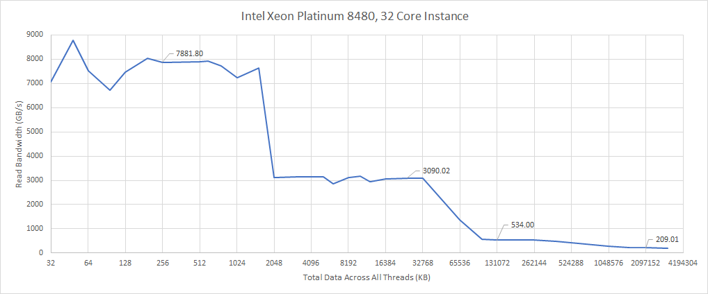

*图 13：32 Core 约 534 GB/s。继续线性扩展到 1 TB/s 只是很不可能实现的 Projection；同 Core Count Milan V-Cache Instance 已超 2 TB/s。*

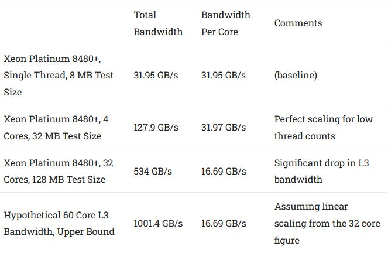

*图 14：DRAM-sized Region 略超 200 GB/s；更多 Core 可能接近 DDR5 理论值，但本次无 Bare Metal 全核验证。*

## Instruction Frontend：L2 Miss 后跌得异常重

8-byte NOP 从 L2 时各 Core 都约 16 B/cycle，SPR 已低于 Client Golden Cove/Ice Lake SP。

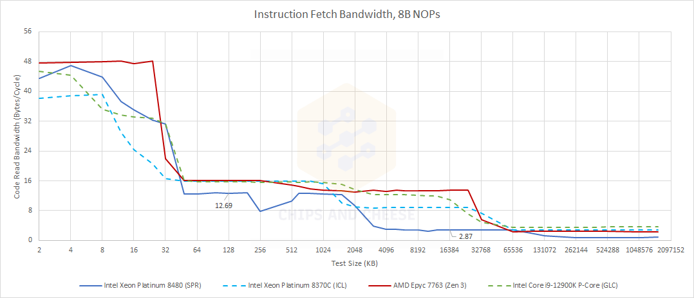

*图 15：L1I Miss 后立刻受限，L2 Miss 后更陡；一两拍 Cache Latency 不足以单独解释。*

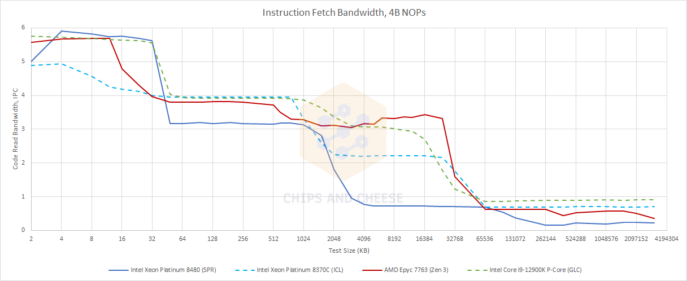

*图 16：Client Golden Cove/Zen 3 从 L3 仍高 IPC，Ice Lake SP 也超 2；SPR 从 L3 不到 1 IPC，其他 CPU 通常到 DRAM 才如此，可能显著影响大 Code Footprint。*

### 体系结构视角：数据 L3 与指令 L3 可能有不同并发瓶颈

平均 L3 Latency 只是一部分。Instruction Fetch 还依赖 I-cache Miss Buffer、Prefetch、Sequential Fill 与 Redirect；Queue 不足或 Prefetch 不够远，会让同一 L3 在 Code Stream 中更糟。应结合 L1I/L2I Miss、Outstanding Fill 和 Frontend Starvation，不以 Data Pointer-chase 代替。

## Load/Store：Scalar Forward 很强，Vector 更挑剔

Scalar Exact Address 可 Zero-latency Forward，并可持续两 Load+两 Store/cycle。仅 Store 跨 64 B、地址匹配时为 2-cycle；双方 Misaligned 为 8～9。

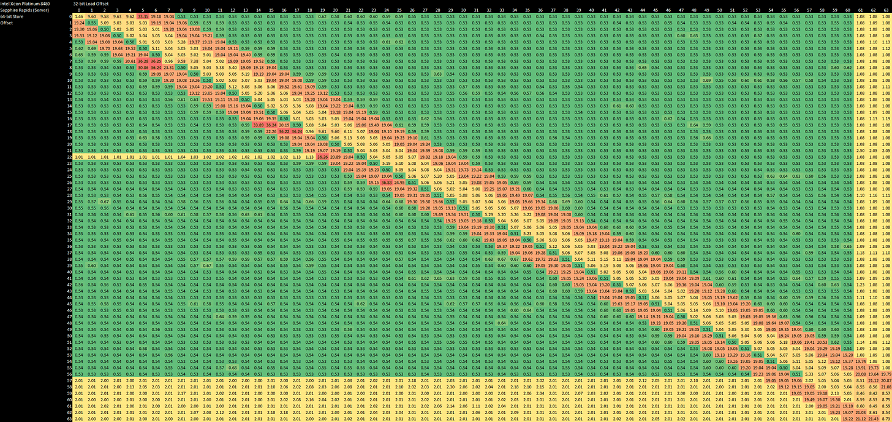

*图 17：正式图注为 64-bit Store/32-bit Load。Load 包含在 Store 内为 5-cycle，与 Independent Load 无额外罚；Partial Overlap 失败约 19。*

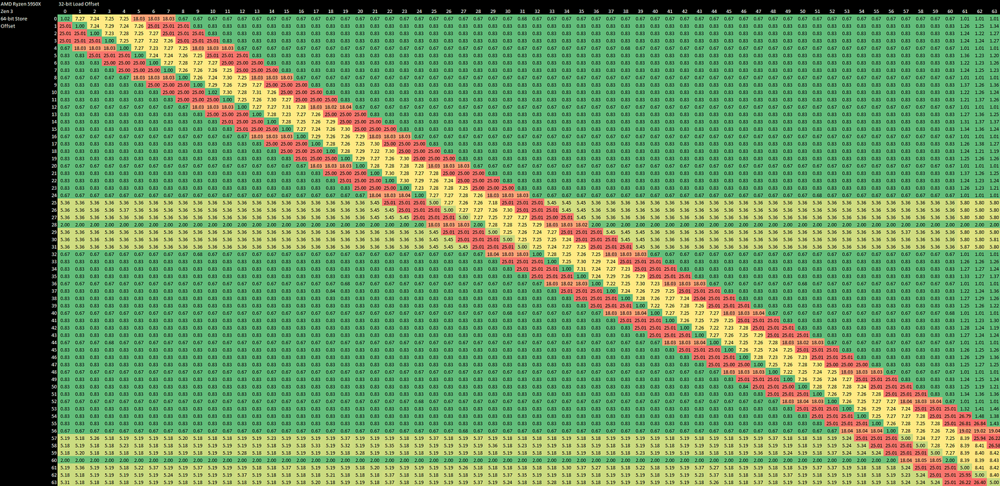

*图 18：Zen 3 非同 Start 的包含关系为 7～8 cycle，跨 Line Exact Address 不超过 5；各有优劣。*

Vector 只支持把 128-bit Store 的任一 Half 转到 64-bit Load，其他“Load 完全包含”也不能 Forward；Latency 6～7，失败 20～22。

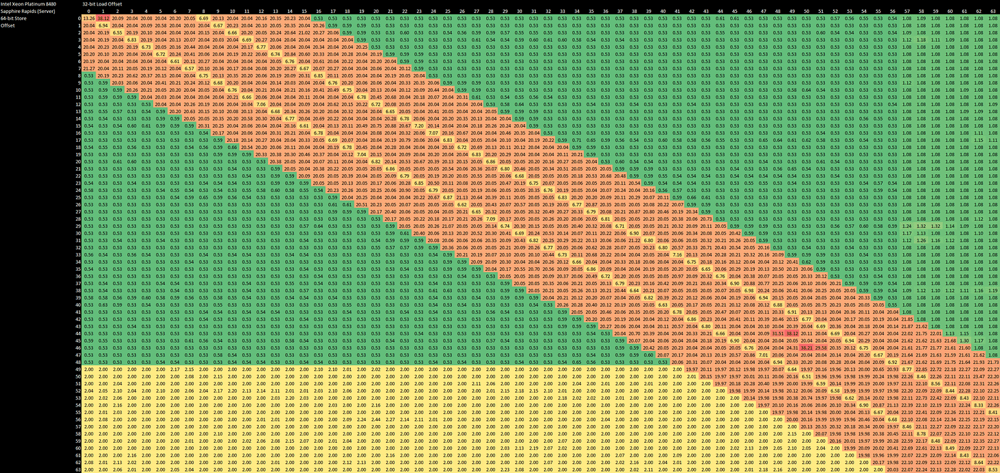

*图 19：正式图注采用 Henry Wong 方法扩展到 XMM/64-bit Half。*

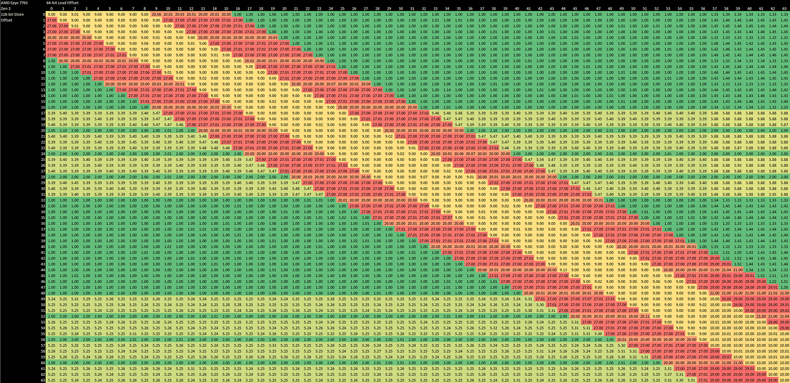

*图 20：Zen 3 约 9-cycle，但所有 Load 数据完全位于 Store 内都可处理；Partial Overlap 为 20 cycle（Store 4 B Aligned）或 27。*

Zen 3 L1D 按 32 B Chunk，对 32 B Boundary 更敏感，并有 4 B Granularity Check。跨 4 KB Page 时，SPR Load +3 cycle、Store +24；Zen 3 Load 无罚，Store +25～27（4 B Aligned 为 25）。

### 体系结构视角：Forwarding “支持范围”与“快路延迟”需要分开

Intel Scalar Fast Path 极快，Vector Coverage 窄；AMD Vector Coverage 广，Hit Latency 稍高。Compiler/Data Layout 若能保证 Exact Start，前者占优；Packed/Partial Extraction 更依赖后者。只报最小 Cycle 会漏掉失败 Replay 与 Cross-page Tail。

## Minecraft：启动快，Chunk Generation 不突出

三项 GCP Test 由 TitanicFreak 执行：Fresh Vanilla Server Boot（先重 Memory Bandwidth、后重 Instruction Throughput）、Paper Boot（单核 Load Data）、Fabric-modified World Generation。Arm 无 8-vCPU Instance，用 4 vCPU；其他主要为 8 vCPU。

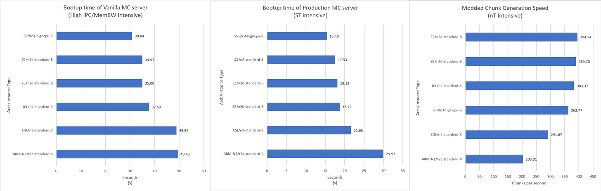

*图 21：SPR 启动时间很好，且 GCP 仅 3 GHz；Zen 2/3 为 3.22 GHz，Cascade/Ice Lake 为 3.4。Chunk Generation 却输给部分 Intel/AMD 前代。*

Chunk Generation 2.6 IPC，L2 Miss Load 仅 0.33/1000 Instruction；Zen 3 为 1.03，但含 Speculative Access。两者 Op Cache Hit >91%。没有明显 Memory/Frontend 大问题，可能受有限 ILP 与 Execution/L1/L2 Absolute Latency；SPR Clock 低，不能以更高 IPC 抵消时间。

## 最后的评价：雄心勃勃，但优势范围偏窄

SPR 延续 Skylake-X 路线：统一 Server System、强 Vector、扩大 Core Count。四 Tile 上的巨大 Mesh+EMIB、AMX、Accelerator、HBM 带来巨大工程经验，代价是 L3 高延迟、中等带宽；All-core、低 L2 Hit 的 Scaling 可能受限。

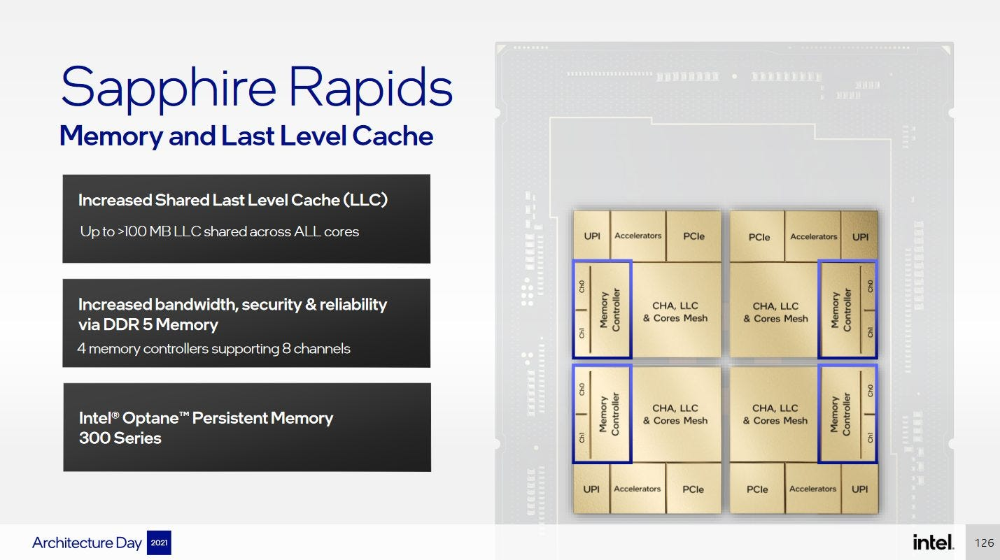

*图 22：它也是下一代跨 Die Fabric、异构 Agent、HBM/Accelerator 的学习平台。*

统一 L3 灵活、一份 Shared Data、一致性较一致，但测试中 Contested Atomic 比去 DRAM 的 L3 Miss 少一个数量级，尚未找到真正依赖该优势的应用。AMD 用 CCD 避开巨型 Interconnect，Core Count 可从 32→64→96，L3 更快；Genoa 即使无 AMX/双 512 FMA，Core 多且 Cache 强。

SPR 可能更适合 Workstation：比 Desktop Ryzen 16 核扩得更高，又有较强低线程；当时 AMD 16-core Ryzen 约 700 美元与 24-core Threadripper Pro 5965WX 超 2000 美元之间存在产品空档。它不太可能立刻恢复 Intel Server 统治，却能积累下一代所需 Block/Packaging 经验。

### 体系结构视角：从 Sapphire Rapids 可以归纳出的七点认识

第一，强 Vector 必须由 Private Cache 喂养。2×512-bit FMA 的理想工作区在 L1/L2，跨入慢 L3 后优势迅速缩小。

第二，统一容量与访问性能存在结构张力。56 Slice 让任意 Thread 用大 L3，却把每次 Hit 带进巨大 Mesh。

第三，Chiplet 本身不是问题，跨 Tile 仍装成统一拓扑才是难题。EMIB 增加物理可实现性，没有消除全局 Hash/Route。

第四，Cloud Policy 会重写微架构表现。3 GHz Lock、Cluster Mode 和未知 DRAM 足以改变 ns、Bandwidth 与 Benchmark。

第五，Little’s Law 解释了慢 Cache 的带宽困境：Queue 不变、Latency 增加，Steady-state Throughput 必降。

第六，ISA 峰值不是普适优势。AMX/AVX-512 针对 HPC/Matrix，Minecraft Chunk 仍由 ILP 与 Absolute Latency 决定。

第七，失败代价也能转化为工程资产。跨 Die Mesh、HBM、Accelerator 和 AMX 会影响后续 Server Roadmap。

## 参考资料

- Chips and Cheese：[*Sapphire Rapids: Golden Cove Hits Servers*](https://chipsandcheese.com/p/a-peek-at-sapphire-rapids)
- Intel Developer Cloud、Google Cloud Preview、Hot Chips Sapphire Rapids Slides
- Henry Wong Store-forwarding Methodology；TitanicFreak Minecraft Tests（正文援引）

网页末尾提供 Patreon、PayPal 与 Discord 支持入口。
