# 桌面版 Skymont：当 Atom 接上 36 MB L3 和 4.6 GHz

> **文章来源**
>
> - 文章：*Skymont in Desktop Form: Atom Unleashed*
> - 撰文：Chester Lam
> - 首发：Chips and Cheese
> - 发布：2024 年 12 月 20 日
> - 链接：https://chipsandcheese.com/p/skymont-in-desktop-form-atom-unleashed

同一颗 Skymont 核心，在 Lunar Lake 和 Arrow Lake 上呈现出完全不同的性能。Lunar Lake 为低功耗岛移除 L3，依赖 4 MB L2 和 8 MB Memory-side Cache；Arrow Lake 把 Skymont Cluster 接回高速 Ring，并共享 36 MB L3，再把频率推到 4.6 GHz。核心没变，系统供给变了，SPEC CPU2017 整数和浮点成绩分别提高 51% 与 63%。

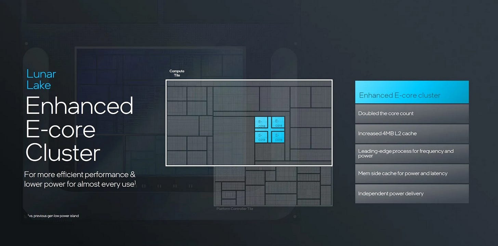

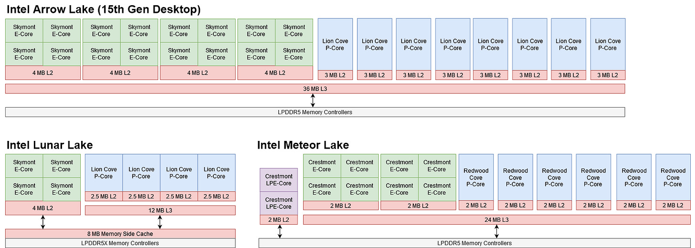

*图 1、2：8 MB Memory-side Cache 更偏向帮助 NPU、Display 等没有大私有 Cache 的模块；对已有 4 MB L2 的 CPU，它既更小也比传统 L3 延迟更高。*

## 一、Arrow Lake 给 E-Core 一套面向性能的 Cache

Arrow Lake 的 Skymont 与 P-Core 同处 Ring Bus，共享 36 MB L3。L3 Load-to-use 接近 69 周期，仍明显慢于 AMD；但与 Meteor Lake Crestmont 的约 69 周期相近，Arrow Lake 更高频率使纳秒延迟更低，容量又增加 50%。

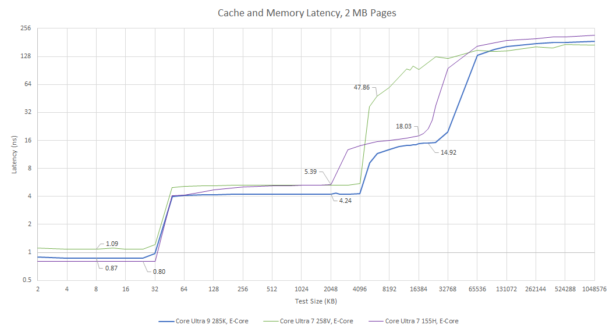

L1D 从 Crestmont 的三周期退回四周期。Lunar Lake 频率接近时，实际延迟增加超过 25%；Arrow Lake 频率更高，纳秒差距缩到约 8%。3 MB/4 MB 级 L2 也同时提供较低延迟和足够容量。

### L3 带宽，更准确地说是 L2 Miss 带宽

四颗 E-Core 共享一个 L2，所有 Miss 都要经过 Cluster 对外接口。Arrow Lake 接 Ring，Lunar Lake 接 Scalable Fabric。测试选择能落在 L3 的工作集；Lunar Lake 没有 L3，于是用 10 MB，假设 4 MB L2 与 8 MB Memory-side Cache 非 Inclusive。严格说，这组图测的是 L2 Miss Bandwidth。

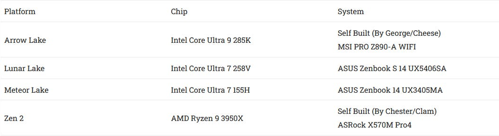

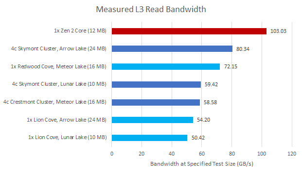

*图 5：Meteor Lake、Lunar Lake，甚至更早 Alder Lake 都约 60 GB/s；Arrow Lake 超过 80 GB/s，增幅约 37%。更大的 L2 Miss 跟踪队列是合理解释，但没有公开结构确认。*

一个 Lion Cove P-Core 在 Arrow Lake 只能从 L3 读约 54.2 GB/s，Skymont Cluster 却超过 80 GB/s；Meteor Lake 刚好相反，Redwood Cove 为 72.2 GB/s、Crestmont Cluster 约 59 GB/s。

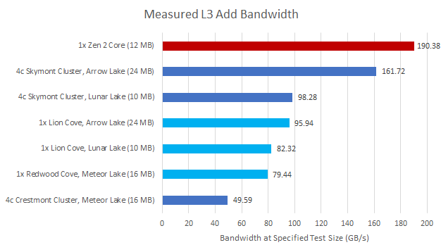

读改写测试显示 Arrow Lake Skymont 的 L2/L3 接口有较独立的读写资源，混合流量接近纯读的两倍；Meteor Lake Crestmont 的读写更像争用同一资源。285K Ring 约 3.8 GHz，155H 约 3.3 GHz，Arrow Lake 的提升同时来自频率和每 Ring 周期带宽。

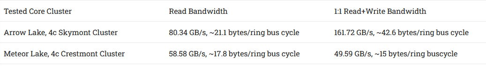

### 体系结构视角：核心外接口也属于“微架构性能”

ROB 和 Scheduler 能产生多少并发 Miss，最终仍要穿过 Cluster Interface。若接口只允许约 60 GB/s，再加执行端口也无法提高 L3 流量。Arrow Lake 没改 Skymont Core，却通过 Ring、Queue 和 Cache 容量兑现了核心内部的 MLP。

## 二、SPEC CPU2017：从接近 Crestmont 到靠近 Zen 4

测试运行 SPEC CPU2017 Rate 单 Copy。Arrow Lake Skymont 比 Lunar Lake 同核心在整数、浮点分别高 51% 与 63%。Zen 4 总体仍领先 19.4% 和 16.96%，但 `525.x264` 只领先 8.25%，`500.perlbench` 只领先 5.88%。

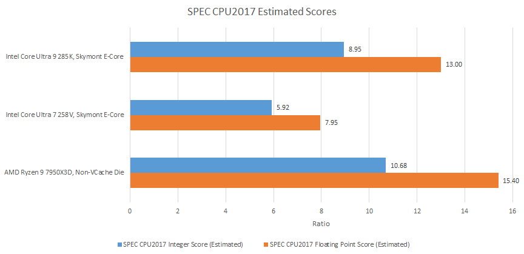

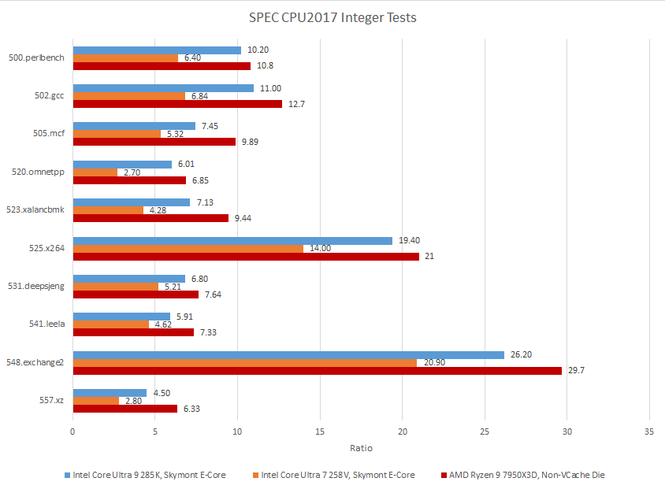

Zen 4 在 `557.xz` 领先 40.67%，`505.mcf` 领先 32.75%；浮点子项波动更大，`521.wrf` 领先 70%，但 `538.imagick` 反而让 Skymont 领先 15%。Lunar Lake 的 `507.cactuBSSN` 表现尤其差。

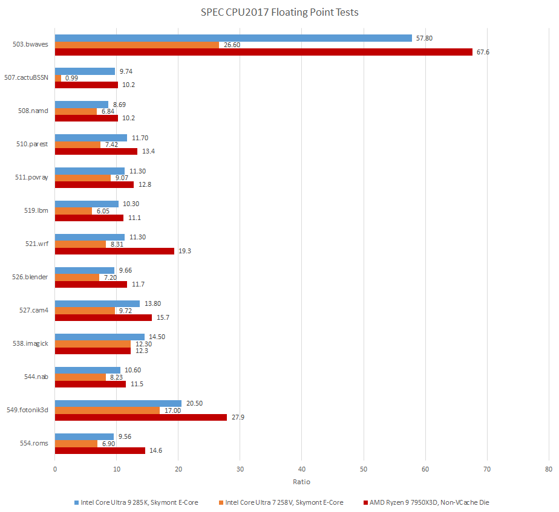

高 IPC 是 Skymont 的舒适区。`x264`、`exchange2`、`perlbench` 都能给宽核心足够并行性，`imagick` 甚至超过 5 IPC。

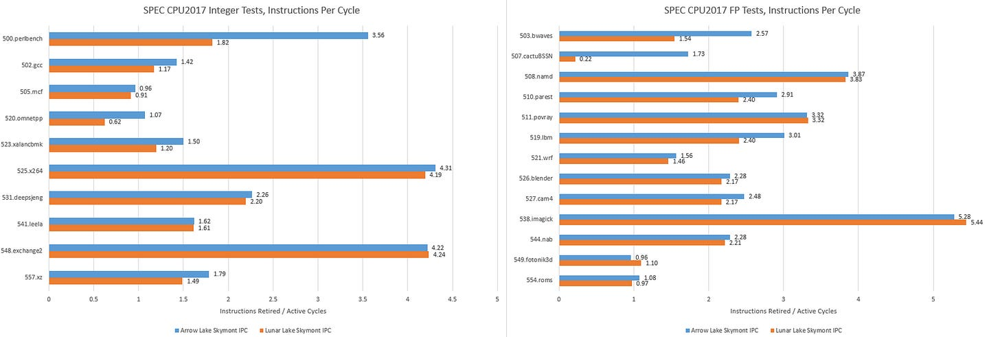

`perlbench` 工作集超出 4 MB L2 后，Lunar Lake 的 8 MB Memory-side Cache 只接住约 34% 的 L2 Miss；Arrow Lake 的 36 MB L3 命中约 97%，延迟也更低。416 项 ROB 有时足以容忍 Arrow Lake 偏高的 L3 延迟，却无法容忍 Lunar Lake 的 SLC/LPDDR5X 路径。

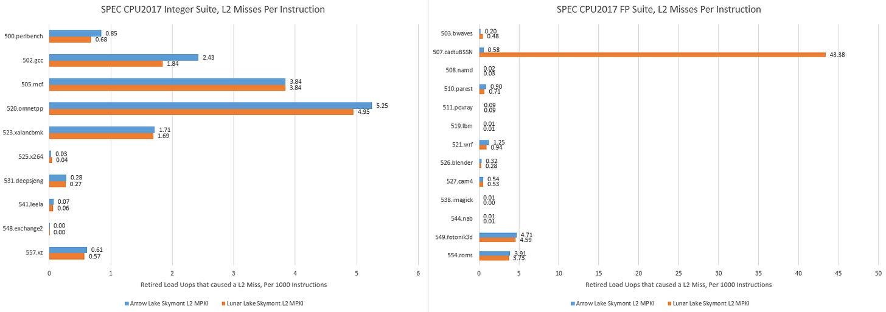

低 IPC 负载往往同时有分支或 Cache 问题。`xalancbmk` 在两种平台都后端内存受限；Arrow Lake 的 L3 已接住大部分 Miss，IPC 增益仍只有 25.23%，说明命中更大 Cache 也不自动解决 L3 本身的延迟。

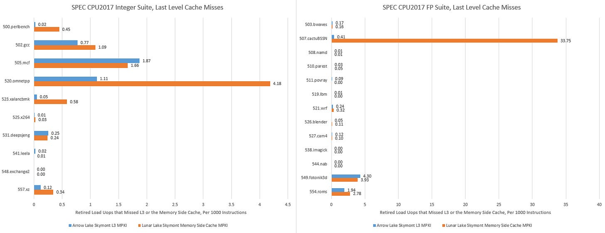

`mcf` 同时受内存延迟和 Bad Speculation 影响；`xz` 在 Zen 4 上接近 2 IPC，Skymont 却因误预测损失大量槽位。相反，只要数据留在最快 Cache、ILP 足够，`imagick` 就能让 Skymont 全速发挥。

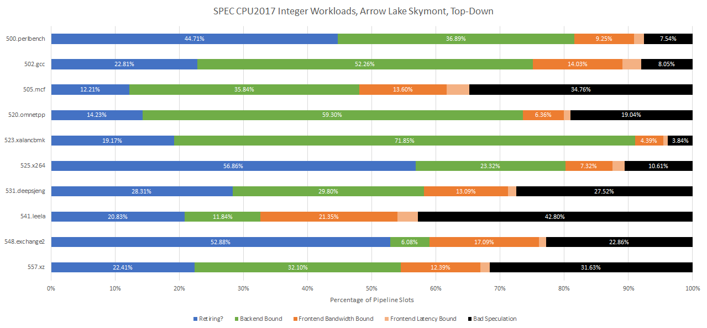

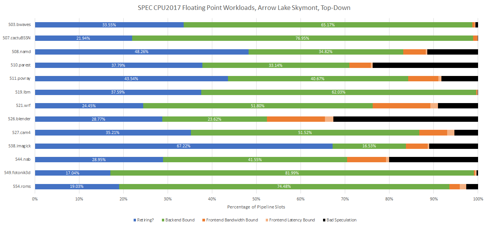

## 三、416 项 ROB 为什么仍会被更小结构卡住

Skymont ROB 为 416 项，Crestmont 256，Zen 4 320。但 Top-down 数据显示，整数负载中经常先满的是分布式 Scheduler；`perlbench`、`gcc`、`mcf`、`omnetpp` 还会填满 Load/Store Queue。Allocation Restriction 表明当周期可用队列端口不足，也会浪费 Rename 槽位。

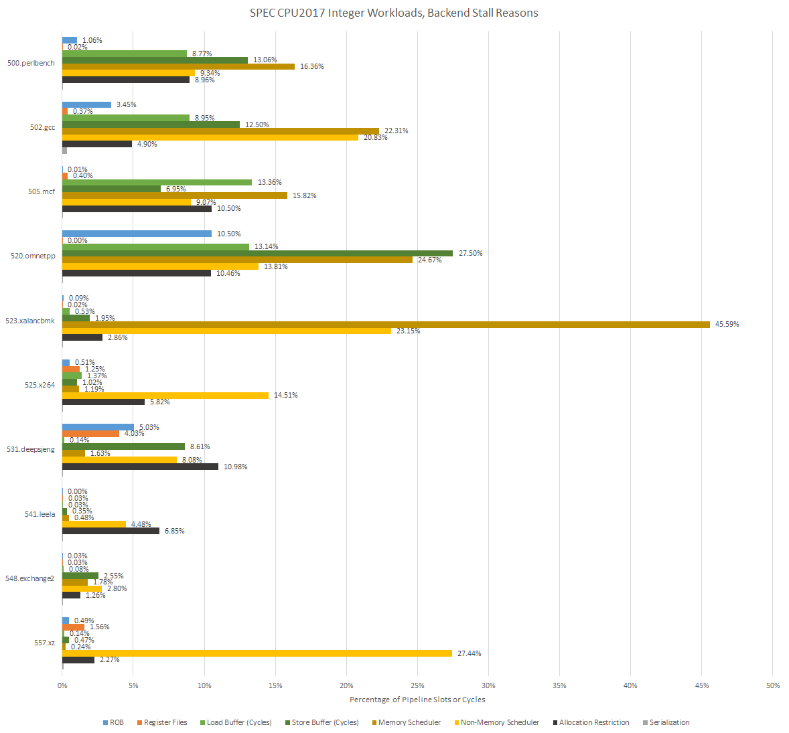

浮点负载有时能用满 ROB；在 `roms`、`fotonik3d` 等低 IPC、长延迟负载中，Scheduler 布局与 Load Buffer 又成为主限制。Load Queue 从 80 增至 114 项，增幅没有 ROB 从 256 到 416 那么大。

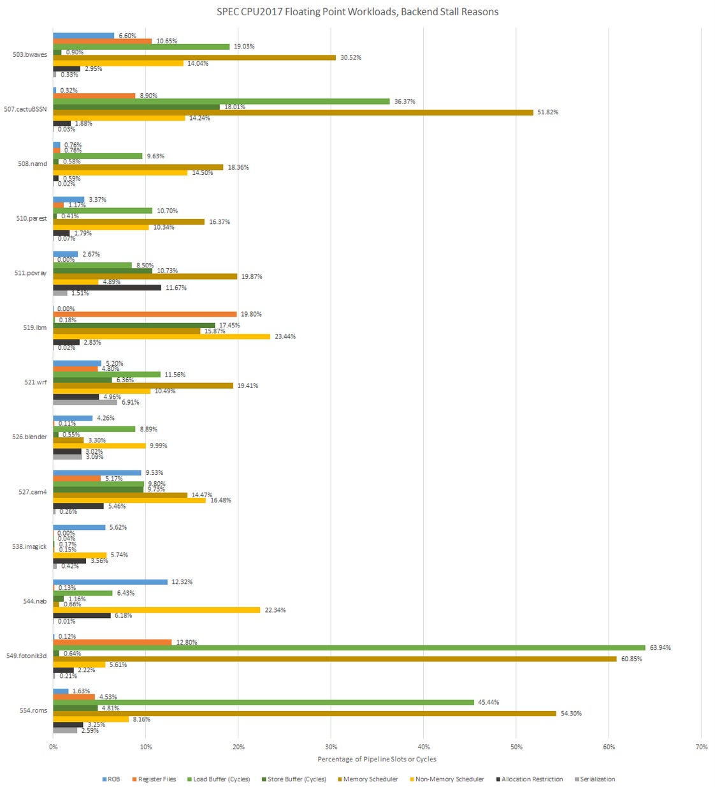

### 体系结构视角：乱序窗口是多种资源的交集

ROB 给出理论上限；物理寄存器、Load Queue 和某一类 Scheduler 才决定特定指令混合能走多远。分布式 Scheduler 总项数很多，也可能因端口绑定而局部满。正确诊断应看哪一种 Full 事件最先伴随 Rename Stall 上升。

## 四、向量负载：Atom 的短板改善了，但没有消失

libx264 有手写多 ISA 路径。每个物理核一线程时，Skymont 同时维持更高频率和 IPC，总体比四核 Zen 2 快约 10%。但 Zen 2 开 SMT 后性能提高约 30%，凭线程级并行和低延迟 Cache 反超。

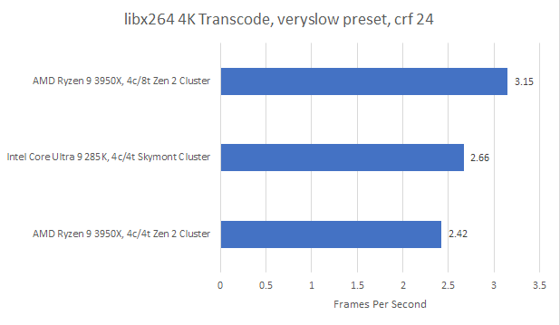

Y-Cruncher 计算 25 亿位圆周率，Skymont 与 Zen 2 都使用 AVX2。这里 Skymont 即使线程数相同也未追上 Zen 2；宽向量保持为较少微操作，更能高效使用乱序窗口，Y-Cruncher 比 libx264 更依赖这一点。

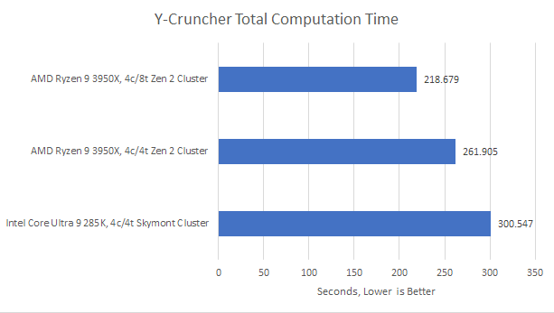

## 五、最接近高性能核的一代 Atom

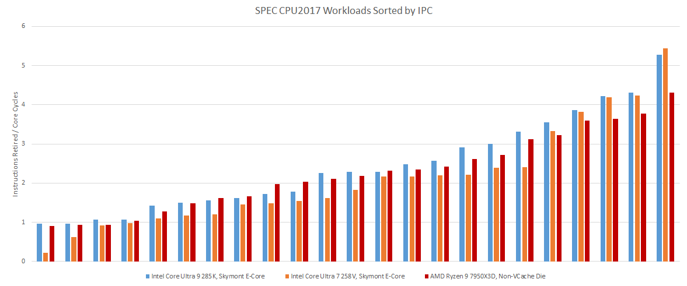

*图 20：Arrow Lake Skymont 已能在部分适合宽核心的负载中击败 Zen 4，但 SPEC 总体和部分向量负载仍落后。*

Skymont 有极宽入口、深窗口和大量执行端口，却仍受面积约束：分支预测器不可能无限接近 Zen 4 的规模，Scheduler 与 Load Queue 也难按 ROB 同比例增长，原生宽向量更昂贵。Arrow Lake 的较高 L3/DRAM 延迟又要求核心拥有更多重排序资源，形成互相拉扯。

因此它还不能替代 Lion Cove，也不能稳定挑战当代 Zen 5。它的优势仍是数量和密度；但接上更好的系统后，它已经非常接近上一代高性能核心。这一差异也说明，评价一个核心 IP 时，必须把它所在 SoC 的 Cache、互连、内存和功耗预算一并写入结论。

## 参考资料

- Chester Lam，*Skymont in Desktop Form: Atom Unleashed*：https://chipsandcheese.com/p/skymont-in-desktop-form-atom-unleashed
- SPEC CPU2017 benchmark suite
