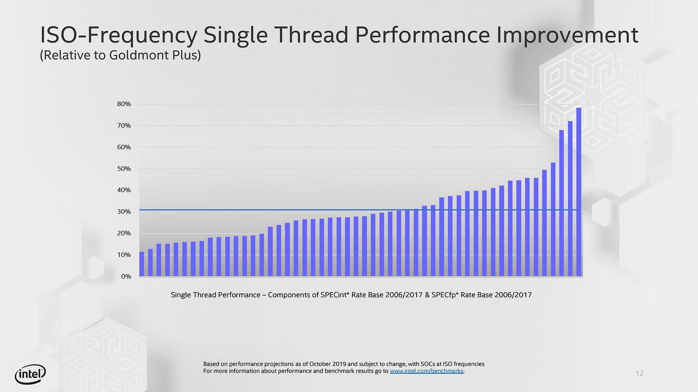
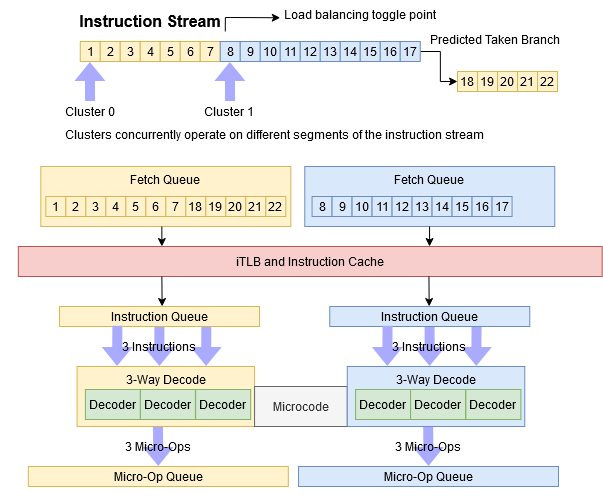
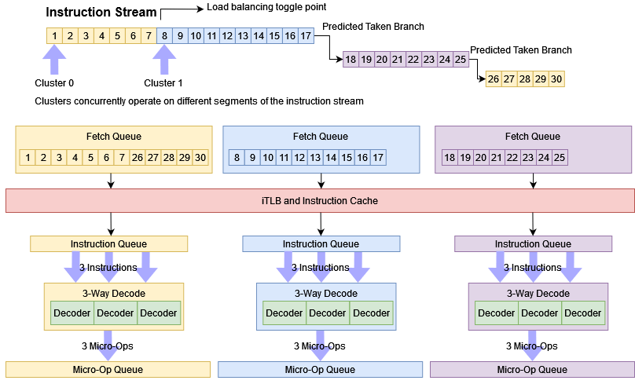
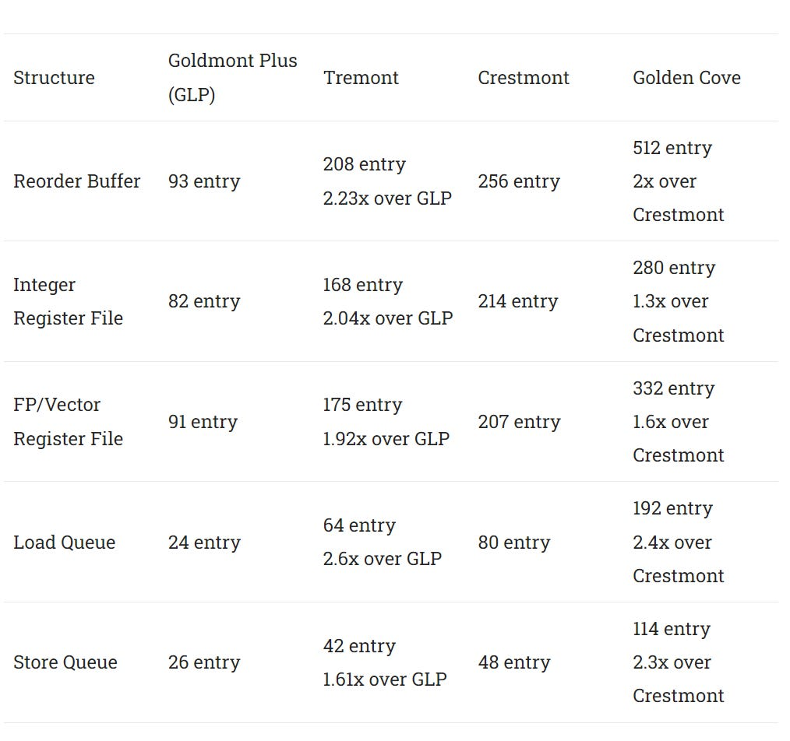
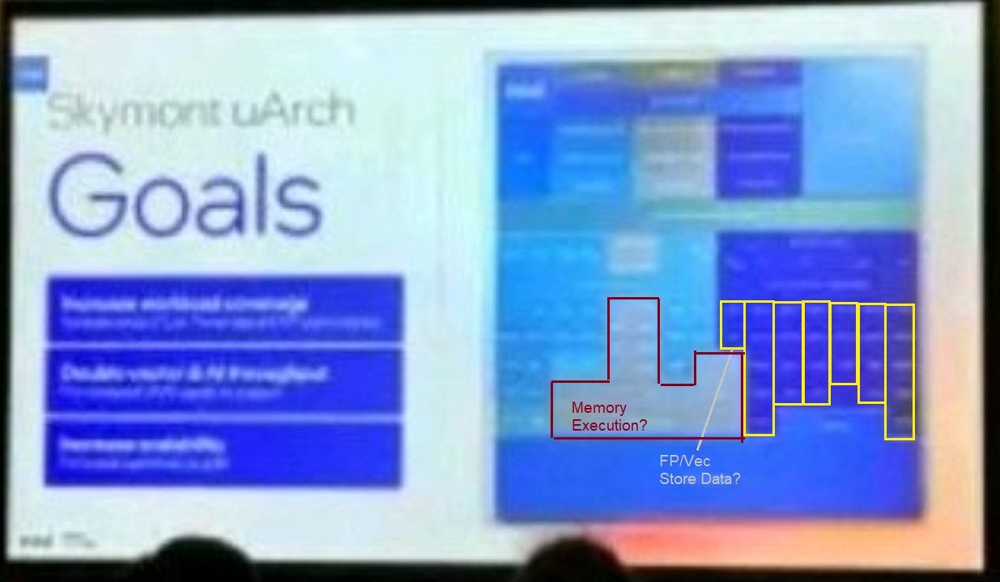

# 从早期幻灯片预览 Skymont：Intel E-Core 的又一次扩张

> **文章来源**
>
> - 文章：*Thoughts on Skymont Slides*
> - 撰文：Chester Lam
> - 首发：Chips and Cheese
> - 发布：2024 年 5 月 30 日
> - 链接：https://chipsandcheese.com/p/thoughts-on-skymont-slides

这篇文章写于 Intel 正式公开 Skymont 演讲之前，依据一组没有 Embargo 或保密标记、但当时尚无法验证真伪的低清幻灯片。大量彼此一致的细节让资料看起来可信，但所有模糊文字与结构判断都只能视作当时的预判。后来正式资料证实了不少主线，也纠正了部分猜测；阅读价值正在于观察如何从有限证据建立、并保留可证伪的架构假设。

## 一、38%～68% IPC 提升意味着什么

幻灯片宣称 Skymont IPC 提升 38%～68%。较高的 68% 很可能对应 FP/向量，因为 Crestmont 及更早 Atom 的这部分长期较弱；若 38% 适用于更广工作负载，则可能重现 Tremont 相比 Goldmont Plus 超过 30% 的跃升。

*图 2：Tremont 让 ROB 容量翻倍以上，并同步扩大其他结构。新工艺把面积和功耗控制在可接受范围，是 IPC 大增的重要条件。*

当时还不知道 Skymont 的具体工艺。如果节点红利足够，扩宽可以少付面积/功耗代价；若工艺改善有限，大幅 IPC 往往要用更大核心、更高功耗或更低频率交换。单看百分比无法判断产品收益。

幻灯片还暗示 Skymont 同时进入移动与桌面 Compute Tile。桌面散热允许更多 E-Core 发挥多线程吞吐；Chiplet 也可能带来类似 AMD 的复用弹性，并有机会改善 Intel 桌面平台的待机功耗。

## 二、三组 3-wide 前端的早期轮廓

Crestmont 使用两组 3-wide Fetch/Decode Cluster，由预测器分配基本块。Skymont 看起来增加第三组，形成 9-wide 峰值，规模接近 Zen 4 从 Op Cache 交付九个 Macro-op。幻灯片还提到更大的微操作队列，让前端在后端之前跑得更远。

*图 4：当时推测三集群共享 Microcode ROM。正式演讲后来表明，常用复杂指令的 Nanocode 会复制到各集群，罕见指令才继续依赖共享路径。*

Crestmont 已把 Branch Prediction Scan 扩到 128 B/cycle，Skymont 又以未公开方式提速。9-wide 前端要求 L1I 最多同时服务三路、合计 96 B/cycle；若预测器、乱序后端或指令 Cache Miss 跟不上，名义宽度不会变成有效 IPC。

### 体系结构视角：泄露资料要建立“结论梯度”

清晰可读的数字可以记为资料声称；由像素颜色猜测的模块只能是候选解释；与既有架构规律一致，只能提高可信度，不能替代正式确认。后续资料出现时，应逐项把“预测”升级、修正或否定，而不是把早期文章悄悄改写成事后全知。

## 三、8-wide Rename 与更深乱序窗口

幻灯片可辨认出每周期八条 Rename/Allocate，因此核心后端入口为 8-wide。Dependency Breaking 细节不清，可能延续 Move Elimination 和 Zero Idiom Recognition。

更大的 Scheduler、物理寄存器文件与其他在飞资源是利用宽前端的必要条件。微基准汇总图显示，Tremont 已比 Goldmont Plus 大幅扩容；若 Skymont 再做类似跃升，资源规模会接近 Golden Cove。

幻灯片还有一个模糊的“16-wide”，当时猜测可能是执行端口数量，或只是不同统计口径。正式资料后来确认 Skymont 有 26 个执行端口、16-wide Retire，说明低清文本确实不宜强行定义。

*图 6：深蓝区域当时被推测为 FP/向量侧，文字似乎写有双倍 Vector/FP 或 Vector/AI 吞吐。正式资料后来确认常用操作为 4×128-bit，但这张图本身不足以证明。*

## 四、这篇“预览”的准确边界

从后来结果看，Skymont 的确是 Atom 路线又一次规模跃升：更宽前端、更深乱序窗口和更强向量执行，把性能/周期推近 P-Core。但早期文章同时保留了一个重要问题——如果靠扩张提高 IPC，面积、功耗和频率将如何变化？

这也是处理所有架构泄露时最值得保留的阅读方法：数字只是设计空间的一面。只有工艺、频率、面积、功耗、Cache 层级和真实负载一起出现，才能判断一颗“更宽的核心”是否成为更好的产品。

## 参考资料

- Chester Lam，*Thoughts on Skymont Slides*：https://chipsandcheese.com/p/thoughts-on-skymont-slides
- Intel，后续正式公开的 Skymont Architecture Presentation
