# Skymont：Intel E-Core 直上云霄，Cache 却决定了落点

> **文章来源**
>
> - 文章：*Skymont: Intel’s E-Cores reach for the Sky*
> - 撰文：Chester Lam
> - 首发：Chips and Cheese
> - 发布：2024 年 10 月 3 日
> - 链接：https://chipsandcheese.com/p/skymont-intels-e-cores-reach-for-the-sky

进入 2020 年代，Intel Atom 这条产品线的地位发生了根本变化。它不再只是主流处理器旁边的低功耗补充，而是以效率核（Efficiency Core，E-Core）的身份，直接参与 Intel 高性能客户端处理器的多线程供给。Lunar Lake 又让高性能核（Performance Core，P-Core）放弃了同时多线程（Simultaneous Multithreading，SMT），E-Core 因而承担了更明显的多线程责任；在笔记本市场竞争加剧的背景下，它还必须帮助整颗 SoC 控制功耗。

Skymont 是这一阶段的新一代 E-Core，接替 Meteor Lake 中的 Crestmont。它本身变得更宽、更深，也拥有远大于前代的乱序窗口和更强的执行资源。但 Lunar Lake 同时改变了 E-Core 所处的 Cache 与内存层次，结果形成了一个很有教学价值的案例：核心内部几乎全面增强，并不保证每一种应用都能获得同等幅度的性能收益。

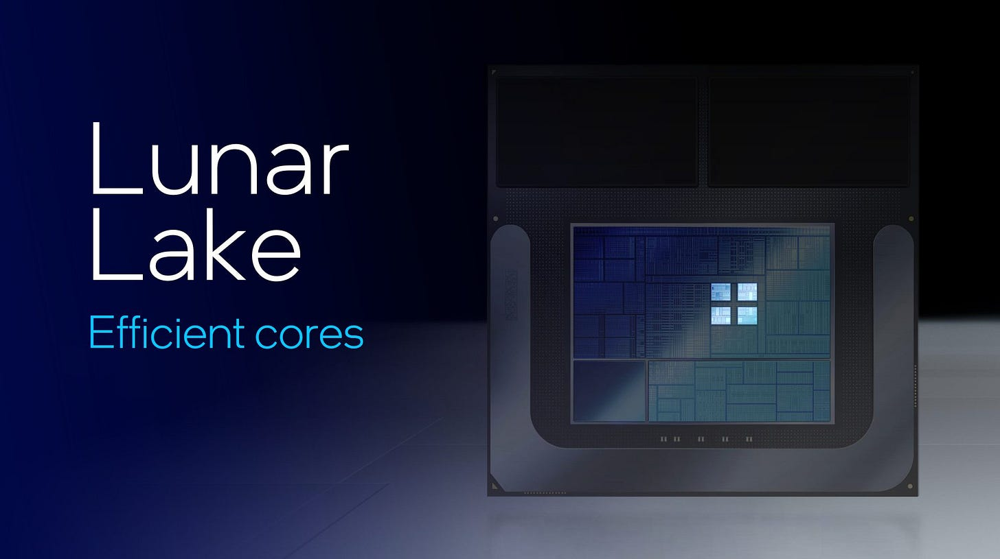

*图 1：Intel 将 Skymont 同时用于低功耗后台任务和多线程性能补充。它不是简单缩小的 P-Core，而是一条以密度和能效为目标、但微架构复杂度已经相当高的独立路线。*

## 一套核心承担两种职责

Meteor Lake 采用了两级 E-Core：连接环形总线与 24 MB L3 的 Crestmont 负责多线程吞吐，另有两个低功耗 Crestmont 位于 Low Power Island，用于承接后台任务，让高性能核心尽量保持休眠。Lunar Lake 把这两种角色合并到一个四核 Skymont 集群中。

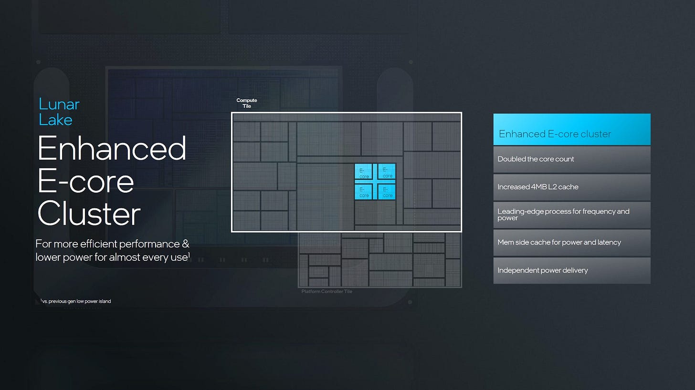

*图 2：Lunar Lake 的四核 Skymont 集群位于低功耗岛，但与 Lion Cove P-Core 同样使用台积电 N3B，并获得比 Meteor Lake 低功耗 E-Core 更好的 Cache 层次。Intel 没有继续增加第三种核心层级，而是让同一套 Skymont 兼顾后台负载与多线程计算。*

这项选择让 Skymont 面临一组互相牵制的目标。低强度任务看重低唤醒成本和低静态功耗，多线程计算则希望有更大的共享 Cache、更低的访存延迟和更多核心。Lunar Lake 只放入四颗 Skymont，也意味着它不打算用 E-Core 数量去正面对抗 Meteor Lake 的八颗标准 Crestmont，或 Strix Point 的八颗 Zen 5c。

### 测试平台与结论边界

核心测试来自 Intel Core Ultra 7 258V，也就是 Lunar Lake 上的 Skymont；主要前代对照是 Core Ultra 7 155H 中位于 Compute Tile、连接 24 MB L3 的标准 Crestmont，同时还出现该芯片低功耗岛中的 Low Power Crestmont。Zen 5c 对照来自 AMD Ryzen AI 9 HX 370。不同核心的制程、频率、Cache、内存控制器和整机功耗策略都不相同，因此图表适合观察结构与平台共同形成的结果，不能单独当作同频 IPC 或能效排名。

SPEC CPU2017 图中明确标注 GCC 14.2，并以 Rate-1 Estimated Score 表示单份拷贝的估算分数；网页没有进一步给出完整编译参数、输入规模、运行次数和误差。文中把 0.68% 与 1.5% 这类小差距直接视为误差范围内，也正是因为这些条件不足以支持过细的排名。

除公开演讲材料外，许多容量和端口数据来自微基准反推。测试没有提供 Skymont RTL，所以下文的 ROB、队列和 BTB 数字应理解为特定探测方法看到的可用容量，而不是 Intel 对内部实现的逐项确认。

## 核心总览：一颗八宽乱序 E-Core

从高层看，Skymont 是一颗八宽乱序核心。在很多结构上，它已经接近近年的 Intel P-Core 或 AMD Zen，而不是传统印象中的窄小 Atom。它仍无法达到高性能核心的频率和绝对性能，但展示了先进工艺下，面向密度优化的核心可以做到多复杂。

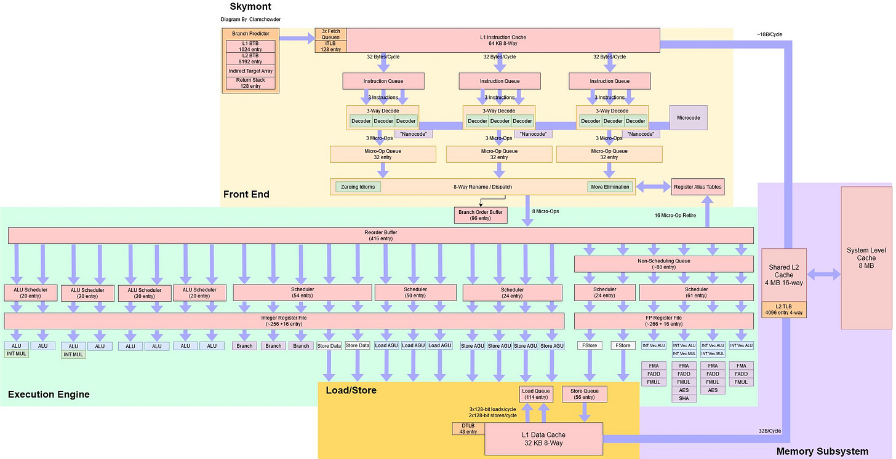

*图 3：英文正式图注提醒，这类框图是近似复原；分布式调度器的端口关系尤其难以准确反推。图中可见三组 3-wide 译码集群、8-wide 重命名、约 416 项 ROB、四组整数调度器、四管线 FP/向量单元、三条 Load AGU 与四条 Store AGU，以及每个四核集群共享的 4 MB L2。*

Skymont 依然保留了 Crestmont 的家族特征：多端口分布式调度、跳跃式工作的多译码集群，以及 128-bit 宽的向量执行路径。不过改动幅度非常大，绝不是在前代上小修小补。

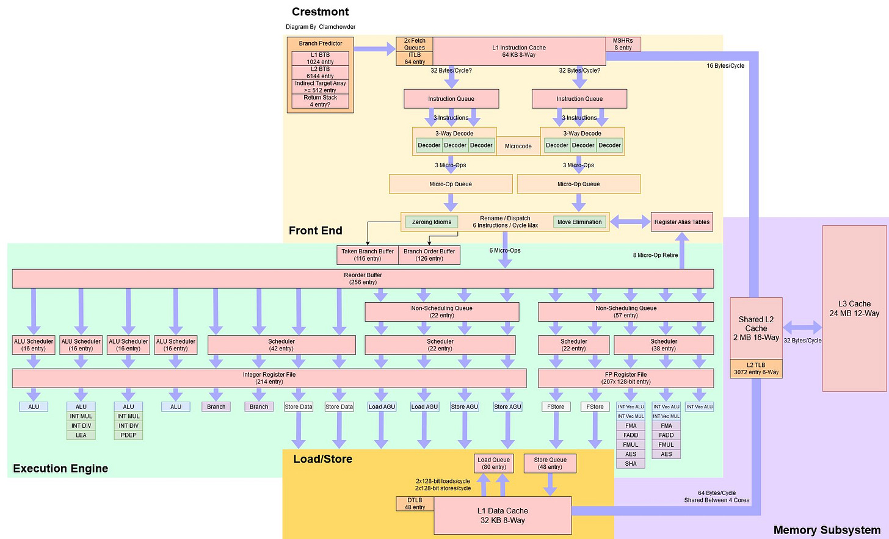

*图 4：Crestmont 同样采用分布式调度和双译码集群，但总资源明显更少：两组 3-wide 译码、约 256 项 ROB、四个单端口整数调度器、较窄的 FP/向量后端，以及两条 Load AGU、两条 Store AGU。Skymont 的变化几乎覆盖整条流水线。*

Lion Cove 与 Skymont 在同一代同时大改，反映了 Intel 在移动市场上的投入强度。但判断 Skymont，不能只数“宽度”和“条目数”，还要看它们是否被前端和存储系统有效利用。

### 体系结构视角：所谓八宽，是一条端到端供给约束

Skymont 的 8-wide 指的是重命名/分配阶段可持续向后端送入的峰值，而不是任意程序都能达到 8 IPC。前端虽然有九个译码槽，但下一阶段只有八宽；后端又要受到真实依赖、分支、端口冲突、Load 延迟和退休带宽约束。

大 ROB 可以把较长的停顿与后续独立工作隔开，却不能制造不存在的并行性。若某条 Load 的依赖链是整个程序的临界路径，再大的窗口也只能寻找别处的工作；若 Cache miss 延迟很高、分支恢复慢或调度器的特定队列拥塞，八宽入口很快就会被反压。评价宽核心，应该同时观察 `instructions/cycle`、前端供给不足、后端受限周期、ROB/调度器/Load Queue 满，以及未完成 miss 数量，而不是只引用入口宽度。

## 前端第一关：预测方向，也要及时给出目标

分支预测错误既浪费性能，也浪费能量。错误路径上的取指、译码、重命名和执行最终都要被丢弃。面对很长的随机重复模式，Skymont 仍不如当代高性能大核，但已经明显超过 Crestmont。

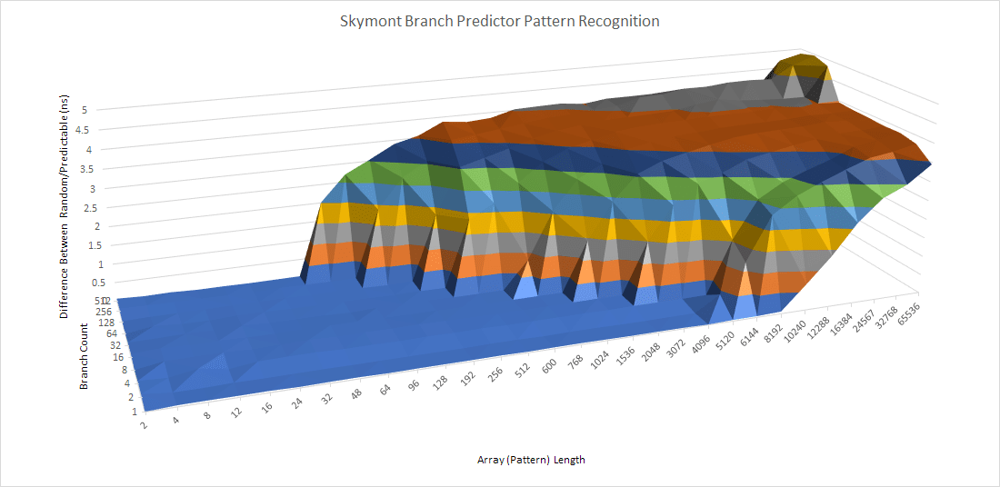

*图 5：横轴改变随机模式长度和参与分支数量，纵轴观察预测成功程度。曲面说明较短模式可以被稳定学习，超过历史与表容量后准确率迅速坍塌。拐点同时可能受到历史长度、索引冲突和训练容量影响，不能据此唯一确定预测器算法。*

当同时存在的分支较少时，Skymont 能处理更长的重复随机模式。若让 512 个静态分支各自执行不同随机模式，模式长度超过 48 后预测开始崩溃；Crestmont 的对应界线约为 16。这支持 Skymont 为分支历史提供了更多有效存储或更强索引能力，但不能直接推出具体历史寄存器位数。

*图 6：Skymont 在长模式区域比 Crestmont 维持得更久，随后分级跌落。测试同时增加模式长度与静态分支压力，因而衡量的是整个方向预测组织的有效能力，而非单一全局历史长度。*

方向正确只是第一步。预测器还必须提前告诉取指单元“下一段代码在哪里”。现代前端会让分支预测跑在取指之前，提前排队 I-Cache miss，以存储级并行隐藏 L2 或更低层级的延迟。分支目标缓冲区（Branch Target Buffer，BTB）正是这条链路的关键。

Skymont 的末级 BTB 可缓存约 8K 个目标，高于 Crestmont 的 6K。它仍小于 Golden Cove 的 12K 和 Zen 5 的 24K，但已经超过 Sunny Cove、Zen 2 等较早的高性能核心。

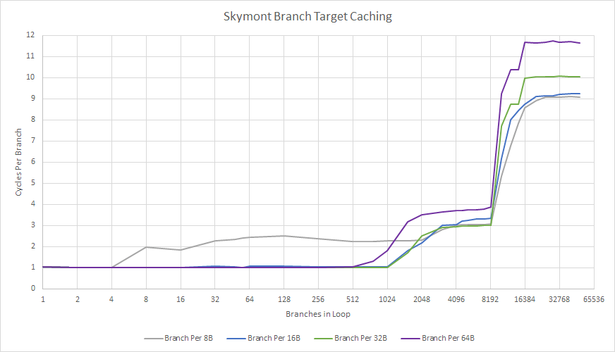

*图 7：随着静态 Taken 分支数量增长，曲线出现多个延迟平台。前一级约 1024 项可实现无空泡 Taken 分支，落入后一级后延迟增至约 3～4 个周期；接近 8K 后再次明显恶化，据此得到末级 BTB 容量判断。*

*图 8：Crestmont 也有约 1024 项快速 BTB，但末级容量约 6K。两代快速层都能做到单周期 Taken 分支，却都不能像最新 Intel、AMD 大核那样每周期处理两个 Taken 分支。*

函数返回通常由返回地址栈（Return Address Stack，RAS）预测。Skymont 继承了 Crestmont 很深的约 128 项 RAS；测试中 Call 与 Return 必须至少隔开一个 Cache line 才能充分利用这一级结构，虽然增加了探测难度，对典型代码通常不是限制。

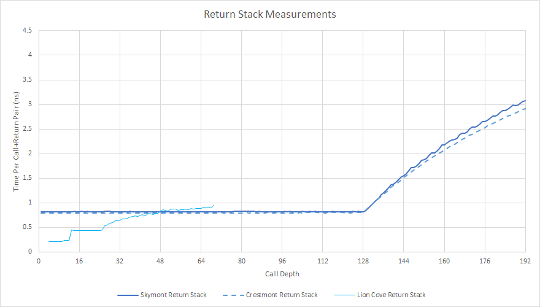

*图 9：嵌套深度在约 128 之前保持低延迟，越过后错误恢复代价连续上升。作为对照，Zen 5 为两个 SMT 线程各配约 52 项，Lion Cove 则约为 24 项。深 RAS 对密集调用、递归和复杂语言运行时更友好。*

SPEC CPU2017 中，Skymont 的分支预测几何平均准确率从 Crestmont 的 98.09% 提高到 98.21%。绝对值看似只增加 0.12 个百分点，但许多子项本来已经接近 100%。在困难项目上，541.leela、505.mcf 和 526.blender 的分支 MPKI 分别下降 4.83%、5% 和 13.58%。

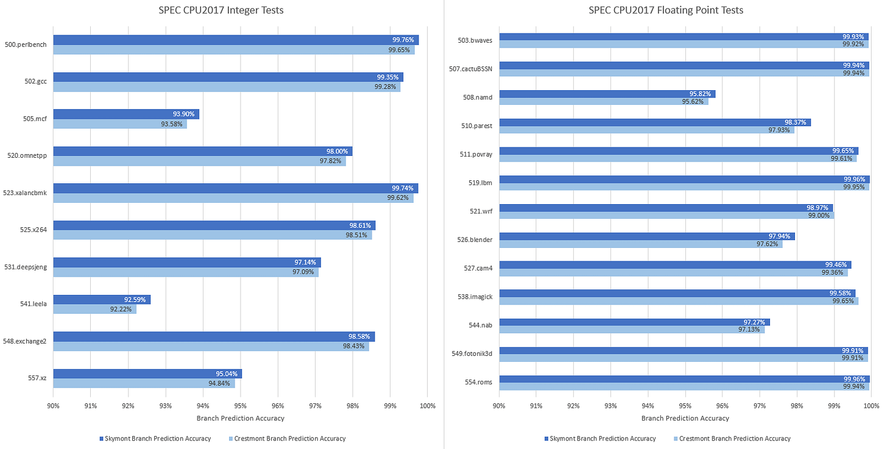

*图 10：左侧是整数子项，右侧是浮点子项。Skymont 在 541.leela 为 92.59%，Crestmont 为 92.22%；505.mcf 为 93.90% 对 93.58%；526.blender 为 97.94% 对 97.62%。易预测项目中的百分点变化很小，因此 MPKI 的相对下降更能表达困难分支的改善。*

### 体系结构视角：预测器的价值要用“空泡成本”衡量

准确率不能独立评价。一次方向错误会清空错误路径，目标 BTB miss 则可能让方向虽然正确，取指仍不知道跳到哪里；快速层容量不足还会把 Taken 分支变成 3～4 周期空泡。真实损失近似等于错误频率、恢复延迟和错误发生时后端可利用并行性的乘积。

因此，更完整的前端验证应同时观察 branch MPKI、BTB miss、RAS miss、重定向周期、I-Cache miss 和前端缺货周期。若准确率提高而 IPC 没有改善，可能是目标供给、I-Cache 或后端成为了新瓶颈；若功耗下降而性能近似不变，也可能是错误路径工作减少后的能效收益。

## 三组译码器，但没有微操作 Cache

从 Tremont 开始，Intel E-Core 的辨识度很大程度来自“交替跳跃”的取指与译码集群。Skymont 再增加一组，形成三组各三宽、合计九槽的译码前端。与 AMD Zen 和 Intel P-Core 不同，它没有微操作 Cache，也没有 Loop Buffer；所有指令都必须经过主取指与译码路径。

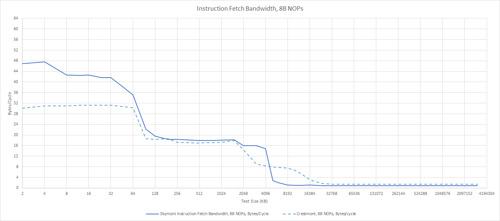

*图 11：Intel 演讲图给出 9-wide（3×3）译码、50% 更高的译码吞吐，以及三组 32 项微操作队列，合计 96 项。所谓 Nanocode 用于处理复杂指令，但不会改变常规路径必须持续取指和译码的事实。*

使用 8-byte NOP 测试字节供给时，Skymont 最高达到 48 B/cycle，明显高于 Crestmont。奇怪的是，每个集群看起来只有约 16 B/cycle，而不是公开框图中 32 B/cycle 取指能力；在这项测试里，三个译码槽只需要 24 B/cycle。Lion Cove 和 Zen 5 可以借助微操作 Cache 达到 64 B/cycle。

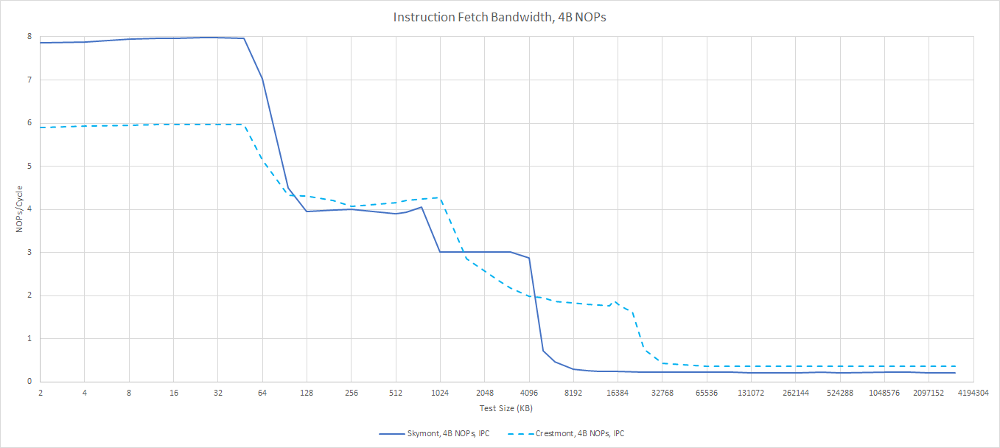

*图 12：代码规模越过前端不同容量后，Skymont 从约 48 B/cycle 逐级下降；Crestmont 的峰值更低。测试展示的是特定 NOP 序列下的有效供给，尚不足以确定每个内部 fetch bank 的真实位宽。*

4-byte NOP 更接近整数代码的平均指令长度，瓶颈也更容易落到译码器。尽管前端有九个译码槽，Skymont 的持续吞吐仍被下一阶段限制在 8 instructions/cycle。代码规模扩大到从 L2 供给时，Skymont 与 Crestmont 都略低于 20 B/cycle；对 4-byte 指令约等于 4 IPC，而很多真实代码会更早被访存或依赖限制。

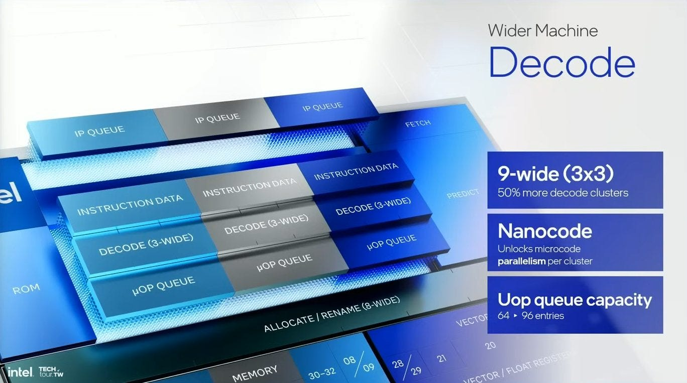

*图 13：L1I 命中区域体现 Skymont 的八宽重命名上限，越过 L1I 后则落入接近 20 B/cycle 的 L2 供给区。图中的台阶是整条前端路径的合成结果，不等同于单独的 I-Cache SRAM 带宽。*

每组译码器后都有自己的微操作队列，用于吸收短时供给抖动。Crestmont 的两组 32 项合计 64 项，Skymont 三组达到 96 项。它仍少于 Lion Cove 的 192 项和 Zen 4 的 144 项，但已经能给重命名阶段提供更深的前端缓冲。

## 重命名：八宽合流与依赖消除

重命名/分配阶段同时读取三组微操作队列，把指令流重新按程序顺序汇合，再为 ROB、物理寄存器、调度器和 Load/Store 队列分配资源。除了消除寄存器名引起的伪依赖，Skymont 还会在这里完成一部分简单优化。

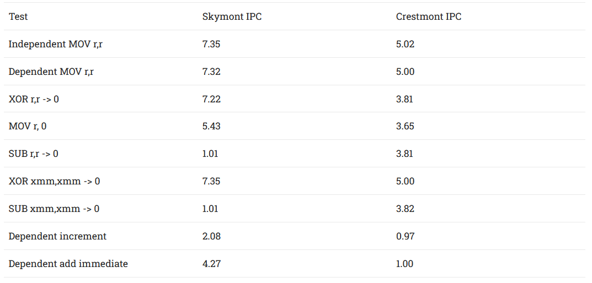

*图 14：测试覆盖独立和依赖的 MOV、XOR、SUB 以及立即数 ADD。Skymont 的独立/依赖 MOV 分别达到 7.35/7.32 IPC，`XOR r,r` 为 7.22 IPC；`SUB r,r` 和 `SUB xmm,xmm` 却都只有约 1.01 IPC。依赖 increment 为 2.08 IPC，依赖 add-immediate 为 4.27 IPC，显示简单运算能在重命名附近化解部分依赖。*

Skymont 从 Golden Cove 获得了在重命名阶段处理简单运算的能力。依赖的整数立即数加法可超过每周期一条，虽然不及 Golden Cove 每周期六个依赖递增/立即数加法那么夸张，仍可能加快短循环中的迭代变量链。

### 体系结构视角：重命名优化省下的不只是一个 ALU 周期

MOV elimination 或 zero idiom recognition 的收益不只是少做一次计算。被消除的微操作不再占用执行端口，结果可以更早进入依赖者，也能缓解调度队列和回写网络压力。若循环计数器在重命名阶段被处理，下一轮地址计算可能更早变为 ready。

但这类优化通常有适用边界：源/目的寄存器类别、零扩展规则、标志位语义和异常行为都会决定是否安全。图 14 中 SUB 自身没有继续按清零惯用法消除，正说明“数学结果相同”不代表微结构必然走同一路径。可以用长依赖链比较 latency，并配合已执行微操作数与端口利用率，区分真正消除和仅仅执行得很快。

## 416 项 ROB：E-Core 的窗口已经很大

Skymont 最醒目的变化之一，是可见重排序缓冲区（Reorder Buffer，ROB）从 Crestmont 的约 256 项扩大到约 416 项。ROB 按程序顺序记录在途微操作，并维持精确异常和按序退休，因此给出了核心可容纳在途工作的上界。它比 Sunny Cove、Zen 4 更大，距离 Golden Cove 的约 512 项并不远。

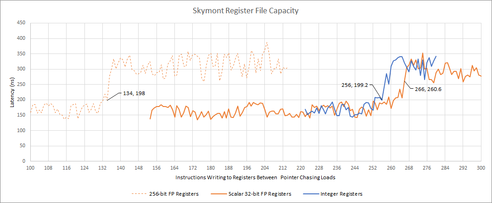

*图 15：Skymont 约 416 项，Crestmont 约 256 项；与面向高性能的旧大核相比，Skymont 的在途窗口已经非常可观。这里的条目数来自阻塞退休类微基准，不能直接等同于可同时隐藏多少周期的 DRAM 延迟。*

分配是按序进行的，只要遇到一条无法取得所需资源的指令，后面的指令也不能越过它。因此寄存器文件、Store Queue 和调度器必须与 ROB 扩容相匹配。Skymont 的这些结构都变大了，但幅度没有 ROB 那么高。

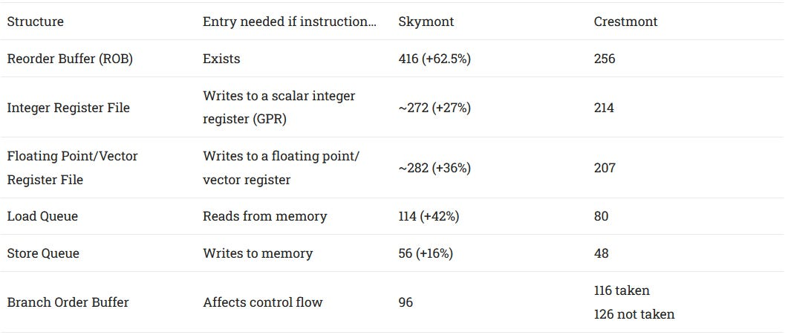

*图 16：Skymont/Crestmont 的可见容量依次为：ROB 416/256、整数寄存器约 272/214、FP/向量寄存器约 282/207、Load Queue 114/80、Store Queue 56/48。Branch Order Buffer 则是 Skymont 96 项，Crestmont 约 116 项 Taken 或 126 项 Not-Taken。Crestmont 的寄存器可以覆盖 ROB 中更高比例；Skymont 更偏向扩大总重排序视野。*

Crestmont 的寄存器文件相对慷慨，足以覆盖 ROB 的大部分条目。Skymont 可能认为这种配比过于昂贵，于是把晶体管更多投向总窗口，形成更有效率的资源再平衡。

一个值得注意的反例是分支重排序容量：Skymont 的 Branch Order Buffer 约 96 项，反而低于 Crestmont。它只能覆盖 416 项 ROB 的约 23%。少数 SPEC CPU2017 整数负载的分支频率可能高于这个比例，因此存在先被分支资源卡住的可能；但 Intel 的设计依据显然不止 SPEC，这里只能保留为配比疑问。

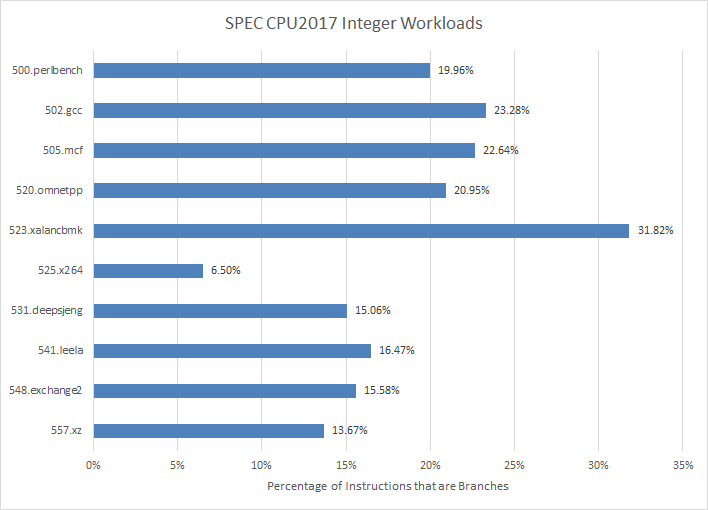

*图 17：96 项 Branch Order Buffer 与 416 项 ROB 的比例约为 23%。柱状图展示 SPEC CPU2017 整数子项的分支占比，其中个别工作负载接近或超过这一线；这不等于应用必然耗尽该结构，因为真实窗口中还受依赖和其他资源限制。*

### 体系结构视角：大 ROB 的收益取决于“旁边有没有短板”

扩大 ROB 能看见更远的独立指令，但有效窗口会被最先耗尽的资源截断。例如，一个分支密集区可能先用完 96 项分支跟踪资源；大量写寄存器的代码可能先碰到物理寄存器；存储密集循环则可能先塞满 Load/Store Queue。ROB 容量是上界，不是所有程序都能使用的固定窗口。

遇到 Cache miss 时，大窗口要发挥作用，还需要足够的 MSHR、Load Queue、地址生成器和内存依赖预测能力，让后续独立 miss 真正发出去。验证“窗口有没有用”，应观察长延迟 Load 之后还能发出多少独立操作、退休停顿期间各队列的 full 周期，以及并行未命中数量，而不能只看 ROB 条目。

## 整数执行：四个队列，每个接两条 ALU 路径

Skymont 保留四个整数调度器，每个从 16 项增到 20 项，并从单端口变为双端口。基本整数加法吞吐因此相对 Crestmont 翻倍。

分布式调度的弱点是负载不均：若多个就绪操作恰好落在同一队列，它们即使面对其他空闲 ALU，也可能排队等待。每个队列连接两条 ALU，能把同一队列突然出现的三个就绪操作从三周期缩短到两周期，是一种不必全面改成统一调度器的缓解方式。

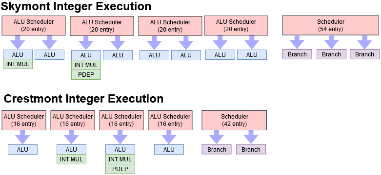

*图 18：Skymont 四个 20 项整数调度器各连接两条基础 ALU 路径，其中两组还能到达整数乘法器，一组到达 `PDEP`；另有约 54 项分支调度器连接三条分支路径。Crestmont 的四个 16 项队列各只有一条主要 ALU，约 42 项分支调度器连接两条分支路径。图是基于测试的近似端口关系，不代表 Intel 的物理版图。*

不常用的乘法器、移位器并未按比例扩张，因此这些操作的吞吐与 Crestmont 接近。64-bit 整数乘法延迟则从 5 周期降到 4 周期，仍慢于 Zen 5 的 3 周期。Skymont 还多了一条分支端口，可每周期处理三条 Not-Taken 分支；Taken 分支仍受前端目标供给限制，只能每周期一条。

## FP/向量：四管线，但仍以 128-bit 为基本粒度

浮点与向量过去一直不是 E-Core 强项。Skymont 把 FPU 扩到四条管线，四条都能处理基础浮点和整数向量操作，组织方式让人联想到 Cortex-X2 或 Qualcomm Oryon。调度队列与非调度队列也比 Crestmont 明显扩大。

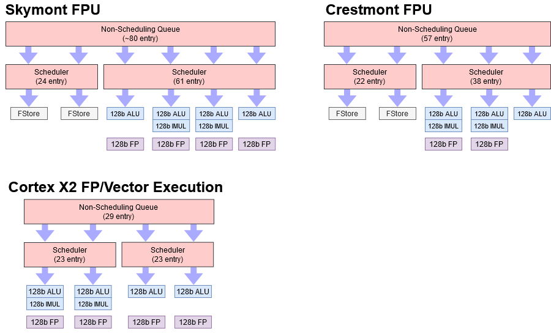

*图 19：Skymont 有约 80 项非调度队列，以及 24 项 FP Store、61 项计算调度器；后者可送往四条 128-bit ALU/FP 路径，其中两条还带 128-bit integer multiply。Crestmont 的对应容量约为 57、22、38，计算路径只有三条；Cortex-X2 以 29 项非调度队列和两组 23 项调度器作为另一种四管线参照。*

物理执行宽度仍是 128-bit。256-bit 指令会拆为两个微操作，256-bit 结果也占用两个 128-bit 向量寄存器条目。因此，表面上的队列条目数不能直接换算成相同数量的 256-bit 指令在途容量。

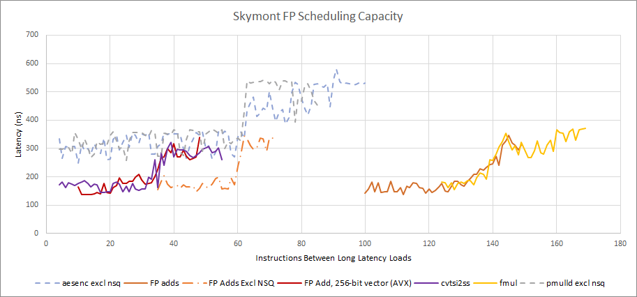

*图 20：英文正式图注说明，这些测试采用 Henry Wong 方法的变体，以两条长延迟 Load 之间插入不同数量指令来反推结构。不同曲线在约 40、60、80、140 条附近出现阻塞台阶，显示 FP add、256-bit `vaddps`、`cvtsi2ss`、AES、整数向量乘和 FP multiply 可进入的队列并不相同。*

`vaddps` 的两个微操作似乎不能像标量 `addss` 那样进入非调度队列，所以 256-bit packed FP add 的有效在途数量只有调度容量的一半。Crestmont 可测得约 23 条 `vaddps` 在途，暗示它利用了部分非调度队列，但没有完全用满。

最初可以怀疑这是“两微操作指令不能进入非调度队列”，但单微操作的 `cvtsi2ss` 在两代核心上同样无法使用该队列。因此，更合理的结论只是：Intel 的非调度队列对某些操作类别存在尚未确定的准入限制，不能从微操作数量给出唯一解释。

Skymont 还改善了次正规数（subnormal）结果的处理。正常浮点输入产生次正规结果时没有额外惩罚，而 Lion Cove 在同类角落条件下会出现超过 100 周期的慢路。软件可用 Flush-to-Zero（FTZ）和 Denormals-Are-Zero（DAZ）规避，但一颗 E-Core 在这里反而比同代 P-Core 更稳健，仍很有意思。

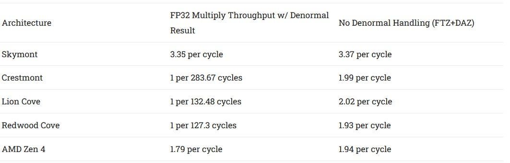

*图 21：Skymont 的归一化乘法与产生 subnormal 的乘法延迟一致；Lion Cove 后一种情况出现超过 100 周期的尖峰。图只证明特定操作和 MXCSR 设置下的行为，不能外推到所有异常浮点输入。*

浮点执行延迟整体下降，128-bit 与 256-bit 向量之间没有额外 latency；Crestmont 某些 256-bit 整数向量操作曾有额外延迟，Skymont 则可让向量整数加法达到单周期依赖延迟。

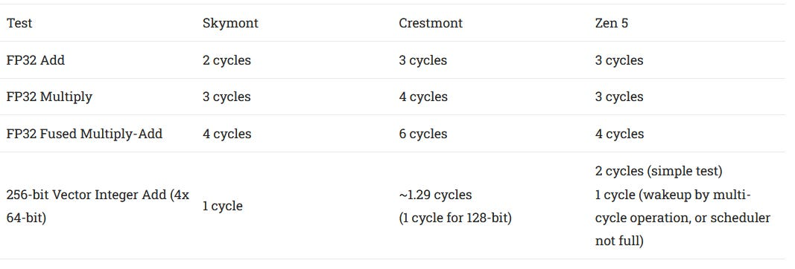

*图 22：FP32 add 的依赖延迟为 Skymont 2、Crestmont 3、Zen 5 3 cycles；FP32 multiply 为 3/4/3，FMA 为 4/6/4。256-bit、4×64-bit 向量整数加法在 Skymont 为 1 cycle，Crestmont 平均约 1.29，Zen 5 简单测试为 2、在特定唤醒条件下可为 1。延迟、吞吐和资源占用仍需分开计算。*

浮点除法不是流水化单元，Skymont 平均约每 2.5 周期处理一次，达到 Zen 5 水平，并明显好于 Crestmont 的约 5 周期。

### 体系结构视角：向量“宽度”至少有四种含义

讨论 256-bit 支持时，要区分 ISA 可见宽度、物理执行宽度、单条指令拆分的微操作数量和结果占用的寄存器条目。Skymont 能执行 256-bit AVX2，不代表内部存在 256-bit 数据通路；两条 128-bit 微操作也不意味着依赖延迟必然翻倍。

真正影响性能的是四者的组合：一条 256-bit 指令占几个调度项、能否进入非调度队列、需要几个物理寄存器条目、每周期可以启动多少半宽微操作，以及两半结果何时共同对依赖者可见。图 20 的负面测试非常重要，因为它揭示了“表面容量很大、某类指令却用不上”的端口和队列约束。

## Load/Store：七条 AGU 与仍显粗糙的转发边界

Skymont 配置了七条地址生成单元（Address Generation Unit，AGU）：三条 Load AGU、四条 Store AGU，两个方向都比 Crestmont 大幅增强。

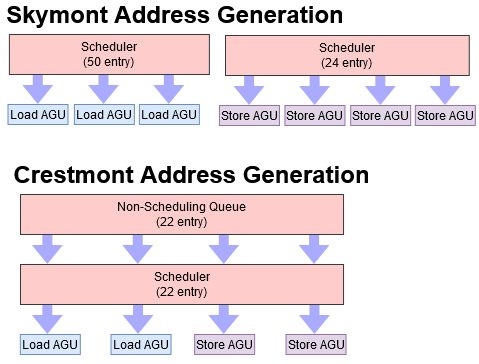

*图 23：Skymont 的 Load 调度器约 50 项、Store 调度器约 24 项，分别连接三条和四条 AGU；Crestmont 由一组约 22 项调度结构连接两条 Load 与两条 Store AGU。容量和连接关系来自微基准反推。*

四条 Store AGU 看似超过 L1D 每周期两次 Store 的实际写入能力，但 AGU 还能更早计算地址、发现 Load/Store 依赖。地址生成吞吐、队列容量和 Cache 数据端口不是同一个指标。

Skymont 与 Crestmont 都似乎以 4 B 粒度检查内存依赖。64-bit Store 的任一半可以转发给依赖的 32-bit Load。Crestmont 只有在 Load/Store 地址完全相同且 64 B 对齐时才能零延迟转发；Skymont 把零延迟范围扩展到更多组合，但矩阵没有呈现一个清晰、可概括的规则。不能走零延迟快路时，Skymont 常见约 2 周期，仍快于 Crestmont 的 3～7 周期。

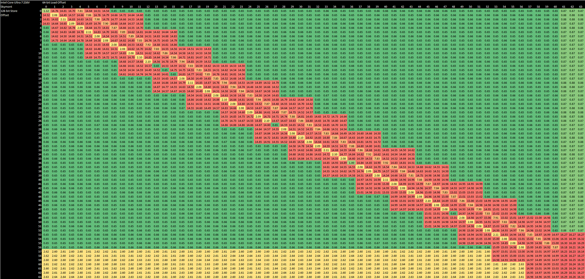

*图 24：横纵轴遍历 Store 与 Load 的地址偏移，颜色区分零延迟/低延迟转发、较慢上半部转发、失败重放和无依赖区域。密集边界表明重叠关系、4 B 检查粒度和 Cache line 边界会共同改变路径。*

把 64-bit Store 的上半部转给 32-bit Load 需要 7～8 周期，比 Crestmont 的 6～7 周期略慢。其他部分重叠会让转发失败，产生 14～15 周期惩罚，也比 Crestmont 的 11～12 周期更糟。只要 Load 和 Store 落在同一 4 B 对齐区间，即便字节实际上不重叠，也可能产生这种伪依赖。Intel、AMD 的高性能核心通常没有这一限制。

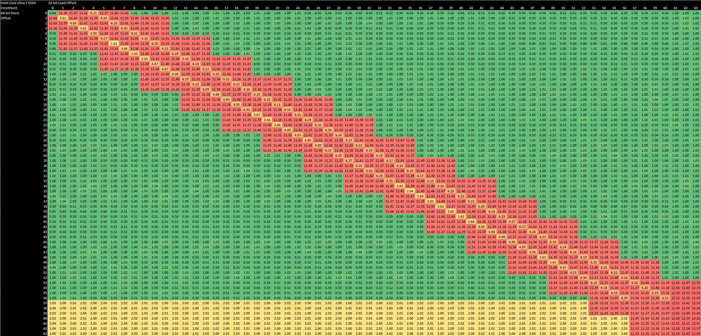

*图 25：前代的快路范围更窄，但某些失败路径惩罚反而稍低。对照两张矩阵可以看出，Skymont 并不是所有 LSU 角落情况都优于 Crestmont。*

Lion Cove 和 Zen 5 可以跨 Cache line 进行 Store forwarding。即使没有依赖，Zen 5 对未对齐访问也更稳健：未对齐 Store 在 Skymont、Crestmont 和 Lion Cove 上需要两个周期，Zen 5 则可以单周期完成。

### 体系结构视角：多 AGU 解决的是“早点知道”，数据端口才决定“每拍搬多少”

AGU 先算出虚拟地址，随后还要经过 TLB、内存依赖判断、Store forwarding、Cache tag/data bank 和提交规则。四条 Store AGU 可以提前发现依赖，却不能把只有两条 Store 数据通路的 L1D 变成每周期四次写入。

Store forwarding 失败通常会触发 replay：年轻 Load 先按错误假设执行，发现与旧 Store 重叠后取消依赖结果并重发。它增加的是依赖链延迟和调度压力，不一定降低无依赖流的峰值带宽。可用地址偏移矩阵、跨 4 B/64 B 边界组合和性能计数器中的机器清除、重放或内存排序事件去区分快路、伪依赖和真正的 Cache miss。

## 地址翻译：容量优先于命中速度

虚拟地址必须翻译为物理地址。操作系统维护多级页表，真正访问页表的 Page Walk 很昂贵，因此处理器会用地址转换后备缓冲区（Translation Lookaside Buffer，TLB）缓存近期映射。

Skymont 的 L1 DTLB 仍只有 48 项；L2 TLB 从 Crestmont 的 3072 项增加到 4096 项，为 4 路组相联。L2 TLB 命中会额外增加约 9 周期，与 Crestmont 相近。这一取舍更像是优先减少昂贵 Page Walk，而不是追求第二级 TLB 的低命中延迟。

作为对照，Zen 5 的 L2 TLB 同样约 4096 项，但为 16 路，冲突 miss 理论上更少；Lion Cove 只有约 2048 项。所有数字仍受页大小和测试方法影响，网页也没有给出完整的 TLB 微基准配置。

### 体系结构视角：TLB 要看 Reach、相联度和 Walk 并发度

4096 项若缓存 4 KB 页面，理论覆盖范围约 16 MB；使用 2 MB 大页则可大幅增加 TLB reach。但相联度会决定某些地址布局是否提前冲突，Page Walk Cache 与并行 walker 数量又决定 miss 之后能否重叠处理。

因此，容量测试应改变页面数量、页大小、stride 和虚拟地址着色；延迟测试要区分 L1 命中、L2 命中和完整 Page Walk。若只看到 9 周期台阶，可以确认第二级翻译代价，却不能知道 miss 后的页表层级、walker 数量或操作系统页表是否已经驻留 Cache。

## Cache 与内存：核心变强，数据却离得更远

Skymont 的 L1D 命中延迟从 Crestmont 的 3 周期退回到 4 周期。L2 更有吸引力：每个四核 E-Core 集群共享 4 MB，相对 Crestmont 的 2 MB 容量翻倍，延迟还从 20 周期降到 19 周期。

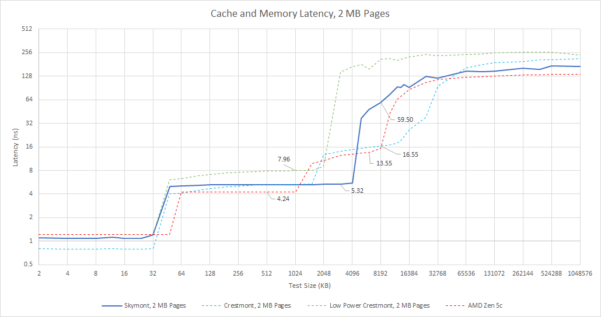

*图 26：使用 2 MB pages 的工作集扫描显示 L1、4 MB L2、Memory Side Cache 和 DRAM 的层级台阶。跨平台曲线包含频率与系统实现差异，cycle 与 ns 的比较不能混为一谈。*

L2 miss 会进入 8 MB Memory Side Cache（MSC）。它的精确延迟不容易测，因为 8 MB 数组中的一部分访问仍可能命中 4 MB L2；在非严格 LRU 替换下，混合比例也不固定。8 MB 工作集测得约 59.5 ns、即约 214 cycles。L2 命中只会把平均值向下拉，所以从 Skymont 集群访问 MSC 的真实延迟至少在这个量级。

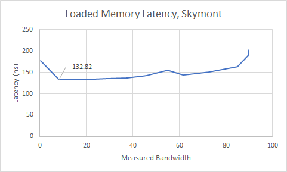

*图 27：四颗 Skymont 共享 4 MB L2，L2 之外是靠近内存侧的 8 MB MSC，再到片上 LPDDR5X。MSC 的位置和高延迟使它更像内存侧缓冲，而不是 Meteor Lake 24 MB L3 的等价替代品。*

59.5 ns 已接近旧平台的 DRAM。例如 AMD FX-8350 在 1 GB 工作集、2 MB pages 下约为 61.7 ns。也就是说，Lunar Lake 的 MSC 在“离核心多近”这件事上，确实更接近 Memory，而不是普通低延迟 LLC。

DRAM 延迟还会受到控制器低功耗状态影响。简单的 1 GB 延迟测试约为 170 ns；让另一颗核心制造略高于 8 GB/s 的带宽，把控制器唤醒后，延迟降到约 133 ns。这优于 Meteor Lake 低功耗和标准 Crestmont 的约 175 ns、153 ns，却远不如桌面 DDR5。

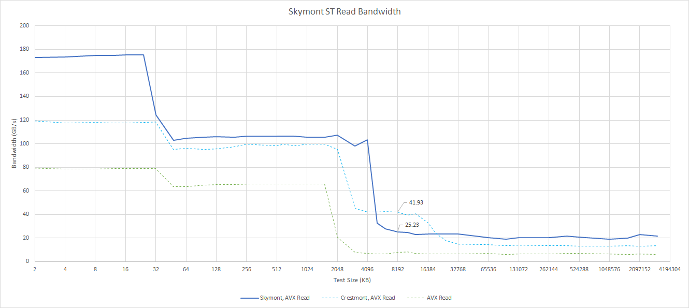

*图 28：横轴增加另一核心制造的带宽，DRAM 延迟从低流量状态的高值降到约 132.82 ns，说明功耗状态转换本身进入了单次访问结果。测试反映的是整颗 Lunar Lake 的控制器、封装内存和电源管理，而不是 Skymont 核心固定延迟。*

单核 L1 带宽受益于新增的 128-bit Load 端口。L2 中，Skymont 可持续约 28～29 B/cycle，略高于 Crestmont 的 25～26 B/cycle。工作集继续扩大后，Meteor Lake 的 24 MB L3 开始帮助 Crestmont，而 Lunar Lake 的 8 MB MSC 对单核帮助不大；单核外层带宽往往受 latency 限制，这再次印证 MSC 延迟很高。

四核并行时，Skymont 的 L2 带宽优势更清楚。Crestmont 集群的 2 MB L2 只有约 64 B/cycle，四核共享；Skymont 的 4 MB L2 提高到约 128 B/cycle，等于把每核可用带宽翻倍。

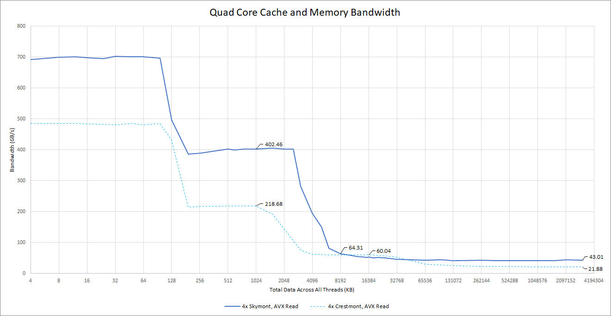

*图 29：在四核并发读流量下，Skymont 的 4 MB L2 平台约为 128 B/cycle，Crestmont 的 2 MB L2 约为 64 B/cycle。离开集群后，Meteor Lake L3 与 Lunar Lake MSC 都更多受到延迟限制；进入 DRAM 后，Skymont 明显高于 Crestmont，但 Strix Point 的 Zen 5c 集群可达约 61 GB/s。*

低功耗 Crestmont 则完全处于另一个档位：频率低、没有 L3，再叠加 Meteor Lake 的高内存延迟，性能明显落后。

### 体系结构视角：LLC 的容量、位置与延迟缺一不可

“多了 8 MB Cache”并不能说明核心得到一块有效 LLC。若它位于内存侧、往返接近 60 ns，单核 Load 依赖链很难从中受益；它更可能服务于降低 DRAM 流量、共享数据或系统能效。相反，靠近核心的 24 MB L3 即使峰值带宽不突出，也能通过较低 latency 帮助串行依赖和中等工作集。

多核带宽还要区分 B/cycle 与 GB/s。前者更接近接口每拍能力，后者同时乘入频率；四线程曲线又混入共享 L2 bank、fabric、MSC、内存控制器和 DRAM。只有在 L2 miss、MSHR 占用、fabric 排队和 DRAM 活跃状态一起观察时，才能定位到底是 Cache 容量、延迟还是外部带宽限制 IPC。

## 性能结果：对低功耗 Crestmont 是碾压，对标准 Crestmont 却很复杂

Intel 更喜欢把 Lunar Lake Skymont 与 Meteor Lake Low Power Crestmont 对比。这有合理性：两者都位于低功耗岛，目标都是承接后台任务，让 P-Core 休眠。

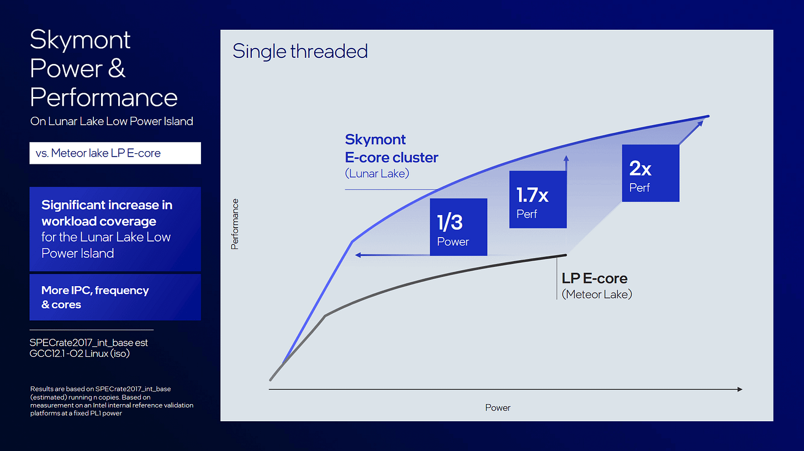

*图 30：Intel 幻灯片把 Skymont 描述为在相同功耗下约 2 倍性能、三分之一功耗下同等性能、相同频率下约 1.7 倍性能。它是厂商展示口径，测试条件与下文第三方 SPEC 数据不同，不能直接拼接。*

相对 Low Power Crestmont，Skymont 受益于更好的 Cache 和 N3B 带来的更高频率，在 SPEC CPU2017 整数套件领先 78.3%，浮点套件领先 83.8%。

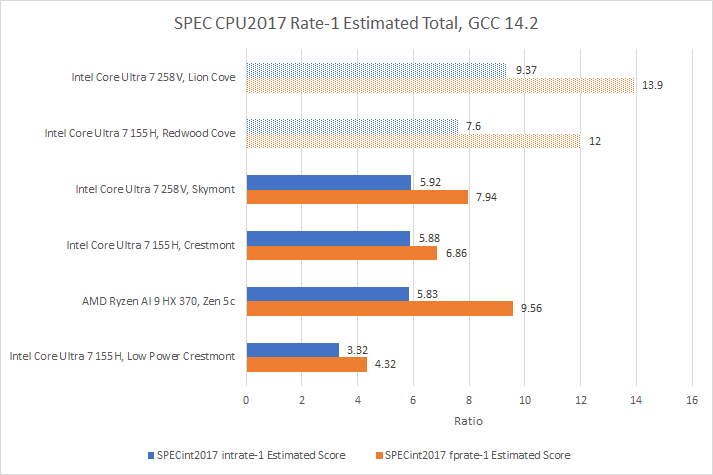

*图 31：GCC 14.2 下，Skymont 的整数/浮点估算分为 5.92/7.94，Low Power Crestmont 为 3.32/4.32。图中还列出 Compute Tile Crestmont 的 5.88/6.86、Zen 5c 的 5.83/9.56，以及 Lion Cove、Redwood Cove。不同平台的频率和 Cache 不一致。*

不过，与负责多线程性能的标准 Crestmont 对比，结论完全不同。Skymont 的 SPEC 整数只领先 0.68%，可视为误差范围；浮点领先 15.7%，但对于如此大规模的核心改造，整数和浮点都达到两位数提升会更令人满意。一个合理推测是：若 Cache 层次相同，Skymont 会表现得更好；现实中 Crestmont 多出 24 MB L3，还有 100 MHz 频率优势，足以抵消相当一部分核心升级。

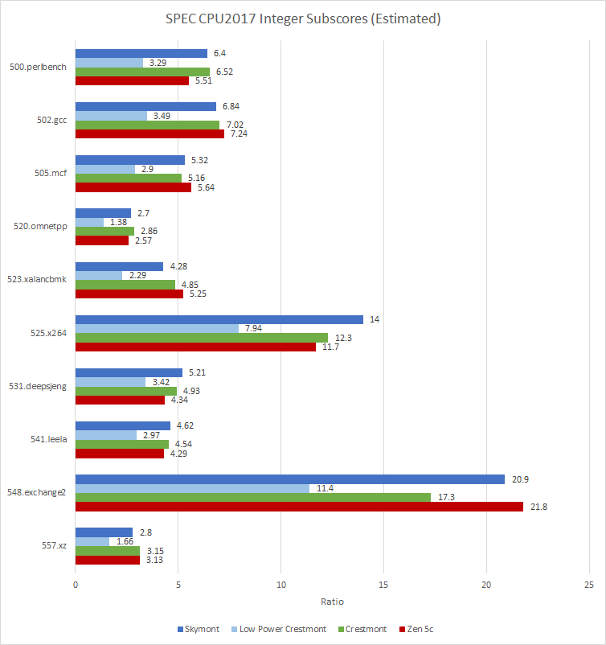

*图 32：Skymont 在 548.exchange2 达到 20.9，明显高于标准 Crestmont 的 17.3；在 520.omnetpp 则为 2.7，低于 Crestmont 的 2.86。子项差异表明高 IPC、小工作集更容易受益于宽核心，而 Cache 敏感负载可能被 Lunar Lake 外层延迟抵消。*

Zen 5c 也是合适参照，因为 Ryzen AI 9 HX 370 用八颗 Zen 5c 增强多线程能力。Skymont 的 SPEC 整数仅领先 1.5%，同样应视为误差范围；浮点则由 Zen 5c 领先 20.4%，很大一部分来自 503.bwaves 和 549.fotonik3d。

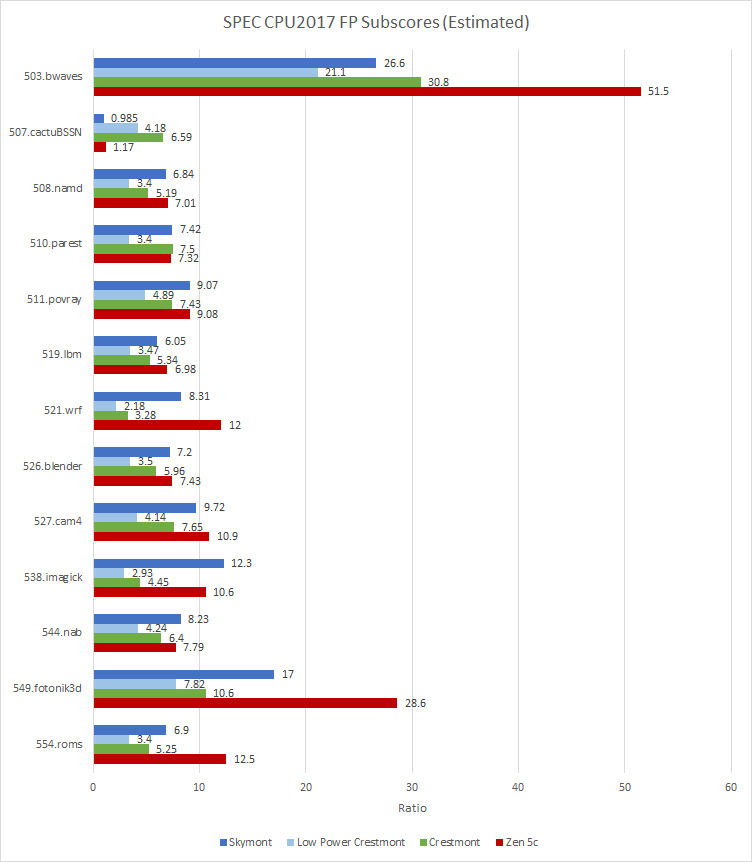

*图 33：Zen 5c 在 503.bwaves 为 51.5、549.fotonik3d 为 28.6，显著高于 Skymont 的 26.6 和 17。Skymont 在 538.imagick 等子项又有不同表现。不能用套件总分替代对访存、向量化和编译代码生成的逐项分析。*

SPEC 高度依赖编译器生成代码，并不能覆盖所有手写向量优化。`libx264` 会使用 intrinsics 或汇编，软件视频编码以更高计算量换取比硬件编码更好的质量，是观察真实向量路径的另一个案例。

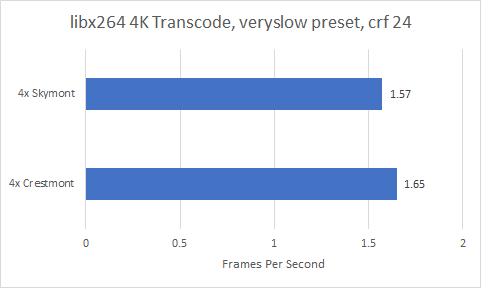

*图 34：veryslow preset、CRF 24 下，四核 Skymont 为 1.57 fps，四核标准 Crestmont 为 1.65 fps，后者快约 5%。网页没有给出 x264 版本、输入视频细节、线程参数和重复误差。*

计数器给出的 IPC 差距更大：Crestmont 为 1.46，Skymont 为 1.35，前代约高 8.1%。Skymont 的分支预测仍更准，97.52% 对 97.35%，但不足以把总体性能推到前面。

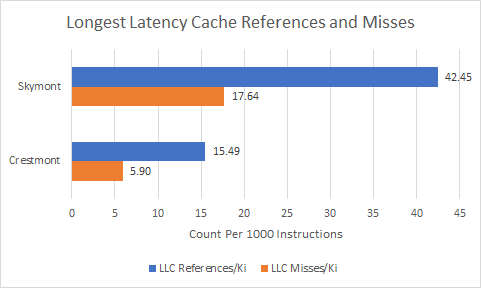

*图 35：英文正式图注给出事件 `0x2E`，unit mask 为 `0x4F/0x41`。每 2000 条指令中，Skymont 记录约 42.45 次 LLC reference、17.64 次 miss，Crestmont 为 15.49/5.89。这里“LLC”按各平台 architectural event 的映射而定：Skymont 指 4 MB L2，Crestmont 则有 24 MB L3，不能把事件名理解为相同物理层级。*

Intel 尚未公开 Skymont、Lion Cove 的完整专用 PMU 文档，但从 Core Duo/Solo 起提供了一组保证后续可用的 architectural events，其中包括 longest-latency cache reference/miss。测试显示 Skymont 把 4 MB L2 视作该事件中的 longest-latency cache；其 miss 明显多于拥有 24 MB L3 的 Crestmont，这为 x264 差距提供了直接线索。

`y-cruncher` 是高度向量化的圆周率计算程序。Skymont 在 25 亿位测试中用时约 380，Crestmont 约 593，得到 1.56 倍加速；每活跃核心周期平均 IPC 也从 1.22 提高到 1.81。

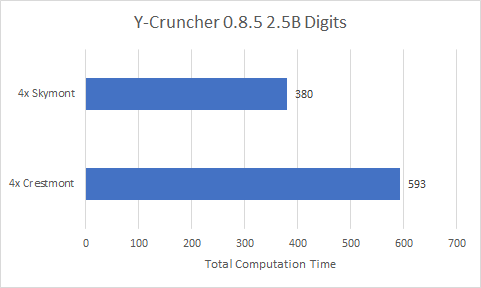

*图 36：英文正式图注注明使用 Broadwell binary。横轴是总计算时间，越低越好。该二进制和 25 亿位输入说明了测试版本的一部分，但线程绑定、内存状态和误差未列出。*

总体看，Skymont 最擅长高 IPC、小 Cache footprint 的工作。例如 548.exchange2 的 SPEC 分数相对 Crestmont 提高 20.8%，IPC 从 3.39 增到 4.21。反过来，520.omnetpp 在 Zen 4 的 1 MB L2 上有 10.38 MPKI、32 MB L3 上仍有 1.42 MPKI，显示出明显 Cache 压力；Skymont 在该项只有 0.54 IPC，Crestmont 则为 0.62。

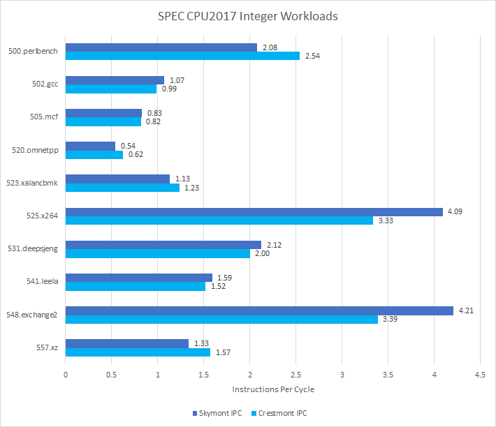

*图 37：英文正式图注强调，高 IPC 工作通常更能受益于宽核心；低 IPC 工作更依赖能否缓解其主要瓶颈，常见的是后端内存或前端延迟。Skymont 在 x264、exchange2 更高，在 omnetpp、xz 等项目则落后。*

若工作集极端不友好，Skymont 更高的 DRAM 带宽又可能重新发挥作用。`y-cruncher` 与 549.fotonik3d 在其他架构上都明显受带宽限制，Skymont 在这些测试中的大幅提升很可能与此有关。

### 体系结构视角：单核性能是“核心 × 平台”，不是两张独立成绩单

Skymont 同时提供更宽前端、更大 ROB、更多 ALU/AGU 和更强向量能力，但这些资源需要足够低延迟的数据才能运转。小工作集留在 L1/L2 时，宽度提升转化为 4.21 IPC；工作集需要频繁穿过高延迟 MSC 时，ROB 中会堆满等待数据的依赖链，再多端口也可能空闲。

这也解释了为什么同一核心可以在一个测试只与前代持平，在另一个测试快 1.56 倍。性能不是“核心提升百分比”这一维参数，而是分支可预测性、指令供给、可提取并行度、工作集、Cache 命中率、外层 latency 和带宽的函数。跨平台比较时，最重要的不是强行把这些因素折成一个排名，而是找出每项负载落在哪一段瓶颈链上。

## 总结：一次巨大的核心升级，一次更复杂的平台落地

Skymont 相对 Crestmont 是一次巨大跃迁：方向预测更强，末级 BTB 从约 6K 增到 8K，前端扩为三译码集群，重命名达到八宽，ROB 从约 256 增到 416，整数端口、FP/向量资源和 AGU 几乎全面扩张。经历 Alder Lake 到 Meteor Lake 的小步变化后，Intel 的 P-Core 与 E-Core 在这一代终于同时大幅前进。

但 Skymont 的性能故事比 Lion Cove 复杂。它可以轻松击败 Low Power Crestmont；面对连接 24 MB L3 的标准 Crestmont，结果却取决于工作负载。Lunar Lake 的 Cache 层次让一颗大幅增强的核心仍可能被数据供给拖住，这也说明 LPDDR5X 的高 latency 会怎样影响低核心数负载。

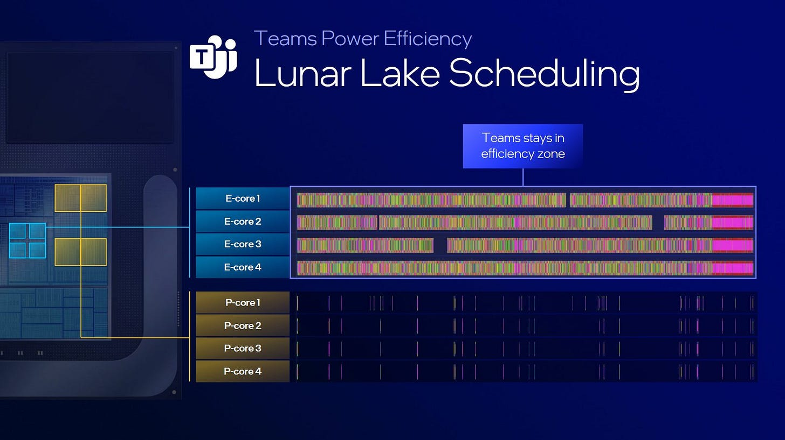

*图 38：英文正式图注指出，Intel 的 Hot Chips 2024 幻灯片展示 Teams 工作主要被 Skymont 集群承接。Lunar Lake 的目标首先是长时间、低强度任务中的能效，而不是让四颗 E-Core 在总吞吐上击败更多核心的配置。*

四颗 Skymont 不会在多线程峰值上战胜 Meteor Lake 的八颗标准 Crestmont 或 Strix Point 的八颗 Zen 5c，但它们更有机会把视频会议这类“低功耗 Crestmont 略显吃力”的负载留在低功耗岛内。多线程性能补充可能是第二目标，接近标准 Crestmont 的单核水平已经足够。

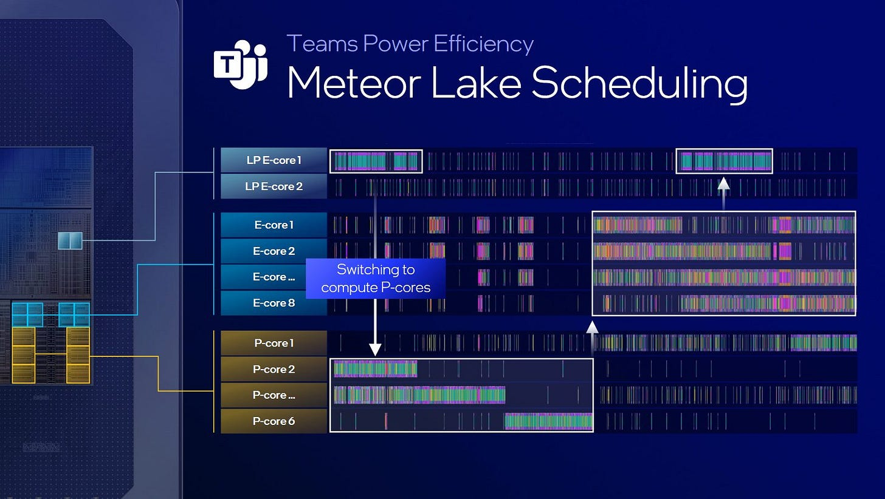

*图 39：英文正式图注将它与上一图对照：Meteor Lake 的低功耗 Crestmont 集群只能承担较少的 Teams 工作，更多任务会唤醒其他核心。图展示的是调度和功耗目标，不是统一条件的应用性能测试。*

真正需要高性能时，Lion Cove 会接管，并且相对 Redwood Cove 给出正常的代际提升。Lunar Lake 因此可能在一批消费级应用中提高性能，同时在长时间低强度任务中提高能效。Intel 的产品选择与这些目标是相符的；只是如果想单独判断 Skymont 巨大微架构改造的上限，Lunar Lake 并不是最干净的实验平台。

## 体系结构视角：从 Skymont 可以看到的六件事

第一，**高性能与高密度不再对应两套截然不同的复杂度等级**。416 项 ROB、八宽重命名、四管线 FPU 和七条 AGU 表明，现代效率核也会投入大量控制逻辑；差异更多落在频率目标、执行位宽、Cache 配置和每单位面积的吞吐。

第二，**前端扩宽不一定需要微操作 Cache**。Skymont 用三个译码集群达到九槽译码，再由八宽重命名合流。这减少了微操作 Cache 的面积与一致性复杂度，但要求 I-Cache、预解码、分支目标和三组队列长期稳定供给。

第三，**大 ROB 必须与专用资源共同阅读**。96 项分支跟踪只覆盖约 23% ROB，某些代码可能先被它限制；向量操作又因拆分和非调度队列准入规则而无法使用纸面全部容量。单一“窗口大小”无法概括有效并行度。

第四，**端口数量与操作稳健性是两回事**。Skymont 有七条 AGU，却仍在部分 Store forwarding、4 B 粒度伪依赖和未对齐访问上落后于高性能核心。峰值吞吐变高，并不会自动修复少见但昂贵的慢路径。

第五，**Cache 的拓扑位置与命中延迟和容量同样重要**。8 MB MSC 从系统角度可能节省 DRAM 流量，但从 E-Core 看至少约 59.5 ns，无法像近核 L3 那样支撑单线程依赖。把两者都称为“缓存”会掩盖最关键的物理距离。

第六，**处理器 IP 的评价不能脱离它的落地目标**。Lunar Lake 的 Skymont 首先服务于低功耗岛和负载 containment；用它评价 Skymont 的纯微架构上限，会把核心能力与四核数量、4 MB L2、MSC、LPDDR5X 和电源管理混在一起。反过来，这些系统条件正是产品是否成功的一部分。

## 参考资料

- Chester Lam，*Skymont: Intel’s E-Cores reach for the Sky*，Chips and Cheese，2024-10-03： https://chipsandcheese.com/p/skymont-intels-e-cores-reach-for-the-sky
- Intel，Lunar Lake / Skymont 公开演讲与 Hot Chips 2024 幻灯片，相关图示由文章引用。
- SPEC CPU2017：本文保留网页中的 GCC 14.2、Rate-1 Estimated Score 口径；未披露的编译参数、输入和误差不作补充假设。

Chips and Cheese 的 Patreon、PayPal 与 Discord 入口可从英文文章末尾进入，用于支持其持续开展微架构测试与讨论。
