# Sunny Cove：被制程耽误的 Intel 大改一代

> **文章来源**
>
> - 文章：*Sunny Cove: Intel’s Lost Generation*
> - 撰文：Chester Lam
> - 首发：Chips and Cheese
> - 发布：2022 年 6 月 7 日
> - 链接：https://chipsandcheese.com/p/sunny-cove-intels-lost-generation

Sunny Cove 名义上接替 Skylake，却从未在全产品线完成接班，就被 Golden Cove 替代。2018 Architecture Day 公布后，10 nm 困境让它到 2019 年末才以超低功耗形态上市，2020 年末才进大型 Laptop；Desktop 直到 2021 年把核心 Backport 到 14 nm 的 Rocket Lake，功耗巨大、最多八核，又很快被 Alder Lake 结束旗舰生涯。

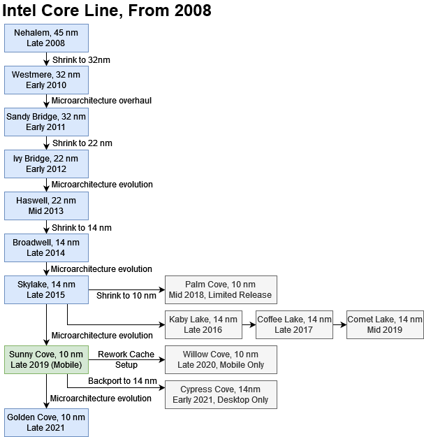

*图 1：正式图注说明，为简洁起见统称 Sunny Cove，因为核心 Microarchitecture 相同；Ice Lake、Tiger Lake、Rocket Lake/Cypress Cove 的 Cache、制程与产品条件并不相同。*

这并不是 Intel 懈怠的一代。几乎每段 Pipeline 都大改，而且 Architecture 定型通常需数年，工作很可能早于 2017 年 Zen 1。问题是 PPA 目标建立在 10 nm 能按期成熟的假设上。

## 总览：Intel 十多年后首次加宽

Sunny Cove 最窄处为 5-wide，是 Merom 2006 年从三宽到四宽后，Intel 首次提高核心宽度；同时大幅增加 OoO 资源。

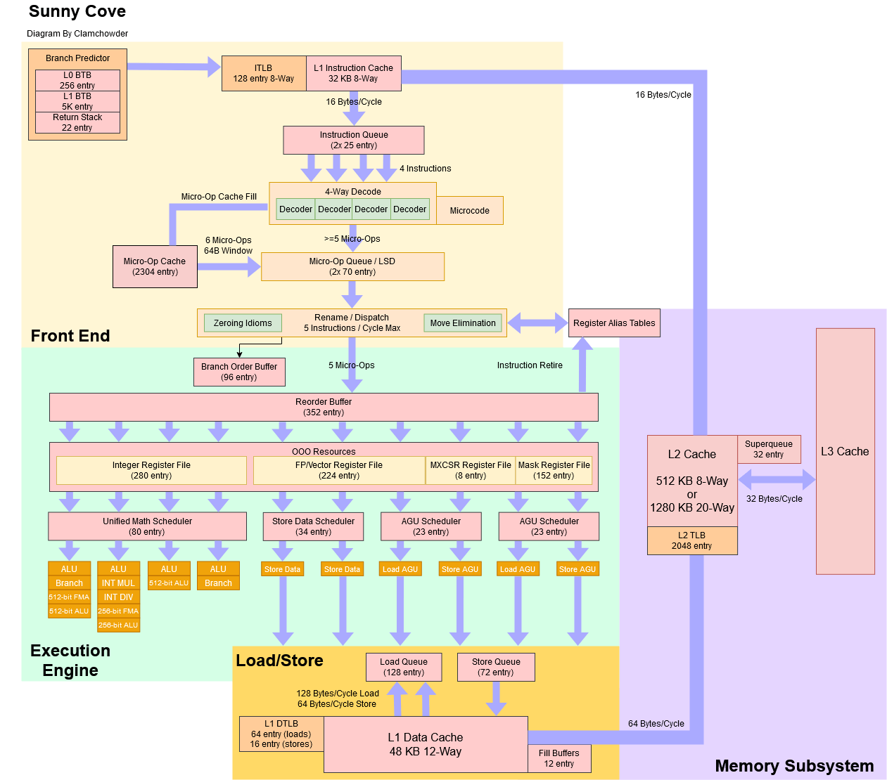

*图 2：Predictor、Rename、ROB/RF、Scheduler、AGU、TLB 和 Cache 几乎全线扩张。*

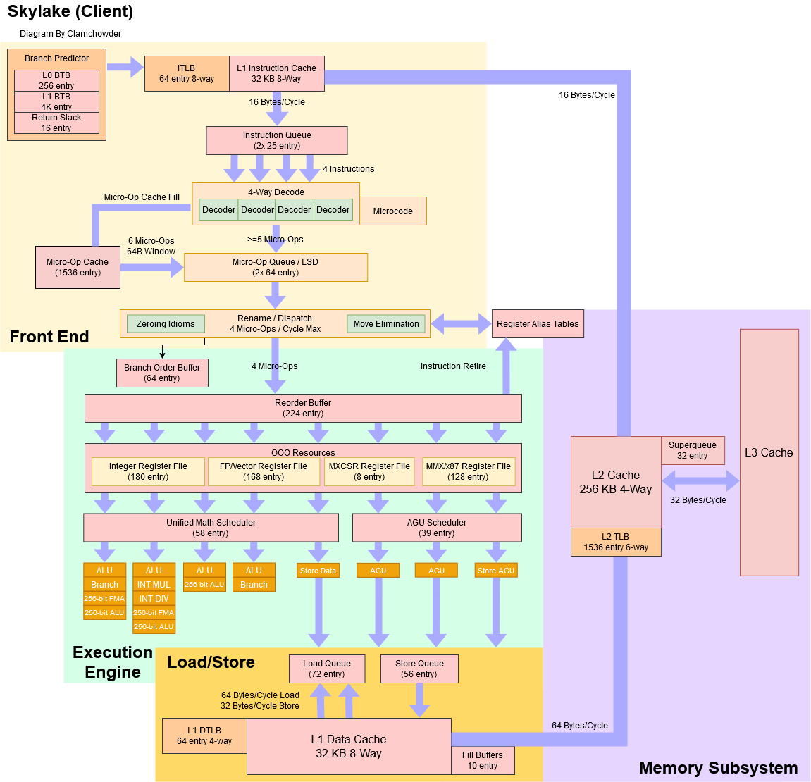

*图 3：Skylake 更小，却有高 Clock 和强 ILP Extraction。图内容量均为公开资料与测试汇总，不是 RTL。*

## Branch Prediction：长历史、5K BTB 与两 Taken/cycle 小循环

测试数据在不同时间由多人贡献，撰文者并不直接拥有 Sunny Cove CPU；系统、内存与平台差异必须随图保留。

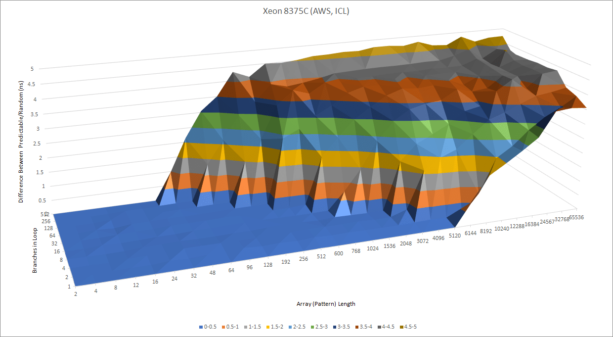

*图 4：英文正式图注明确数据批次与硬件归属。*

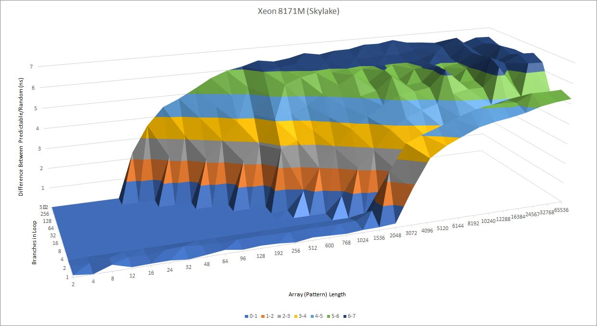

*图 5：Sunny Cove 相比 Skylake 能在更多 Branch 同时存在时减少 Aliasing。*

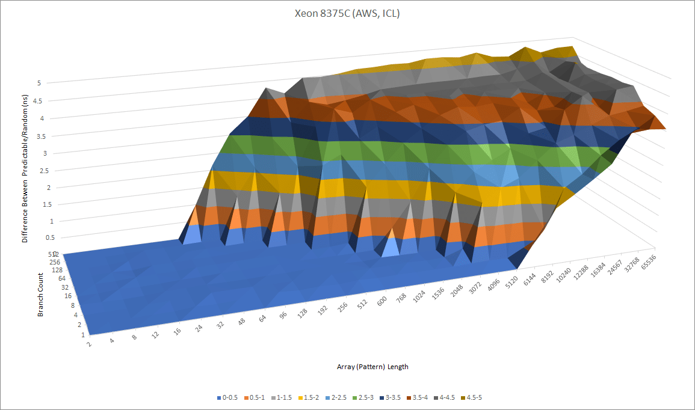

*图 6：正式图注说明 Z Axis Absolute Value 不重要，关注 Predictor 忘记 Random Pattern 前能记住多长。*

*图 7：少量难 Branch 下，Sunny Cove 与 Zen 2 可识别相近历史长度；大量 Branch 下 Zen 2 更强，可能有更多 History Storage。*

Zen 2 似乎采用 Fast Predictor 后接慢而准的 Override Level，难 Branch 会增加延迟；Sunny Cove 没出现同类 Penalty，支持“Direction Logic 集中在一个快速 Predictor”的解释，但不是实现确认。

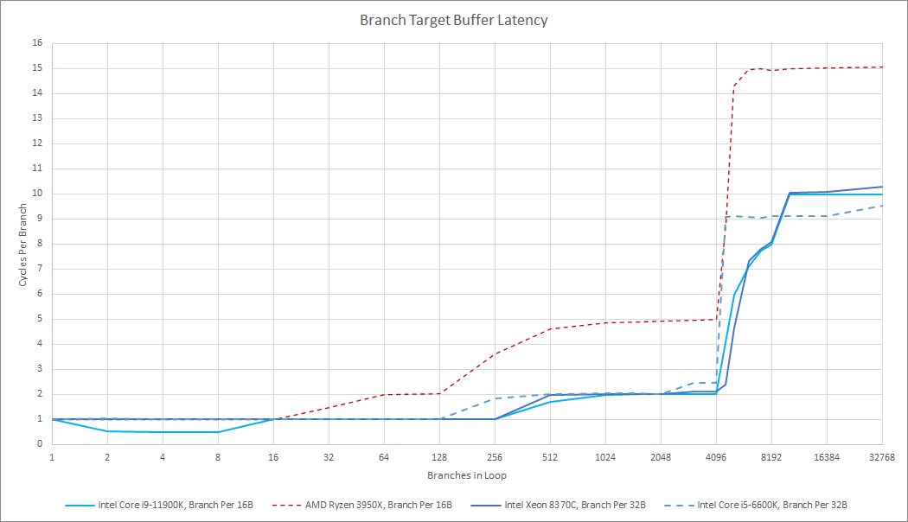

*图 8：Main BTB 从 Skylake 4K 增至约 5K，仍为 2-cycle；这是 Sandy Bridge 从 2K→4K 后 Intel 首次扩容。无 Bubble 的 Taken Footprint 从 128 翻到 256。*

Micro-op Queue 还能在小 Loop 内 Unroll，像 Tiny Trace Cache，每周期完成两个 Taken Branch。Zen 2 仅 16 Target 无 Penalty，覆盖约 50% Branch；数千 Branch 时下降到约 5 cycle/branch，而 Intel 仍约 2 cycle/branch。

### 体系结构视角：预测器不仅减少错误，也缩短正确分支的空洞

长 History 解决 Direction Correlation，BTB 容量解决 Target Coverage，Loop Unroll 解决密集 Taken Throughput。即使 Mispredict 数不变，Target 晚到也会饿死 Fetch。应分别测 Accuracy、BTB Level Hit、Taken Spacing 和 Override Cycle。

## Fetch/Rename：2.3K Op Cache，核心真正变成五宽

Op Cache 从 Sandy Bridge 以来首次扩容，由 1.5K 到 2.3K。

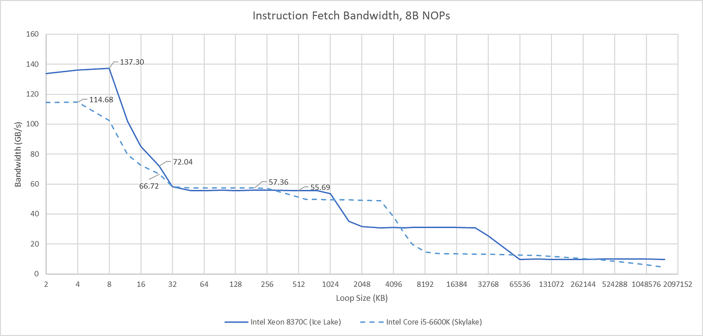

*图 9：正式图注说明测试跳入 8-byte NOP Array，末尾 Return。更大 Op Cache 扩展高速区。*

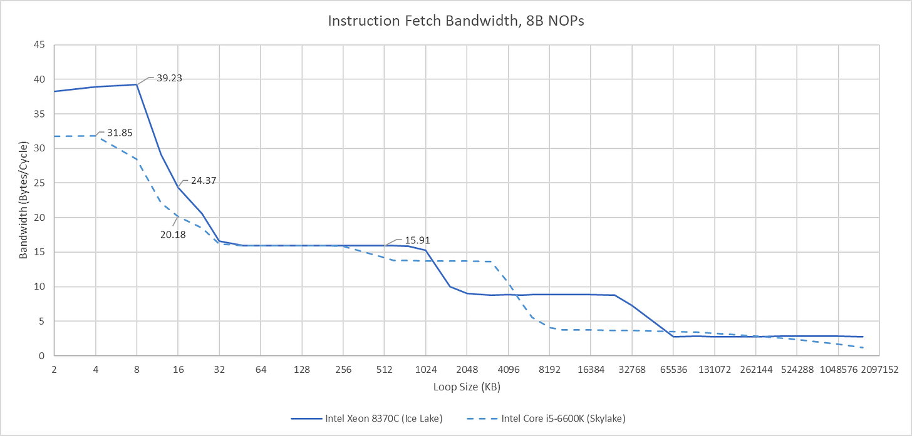

*图 10：Op-cache Region 有效超过 32 x86 B/cycle，但测试也受后续 Rename Width 限制，因此不等同于纯 Cache Read Port。*

L2 Instruction Prefetch 仍强，4-byte NOP 在 L2 内接近 4 IPC；Ice Lake SP 的 Mesh L3 延迟/带宽差让 L3 区跌得更快。

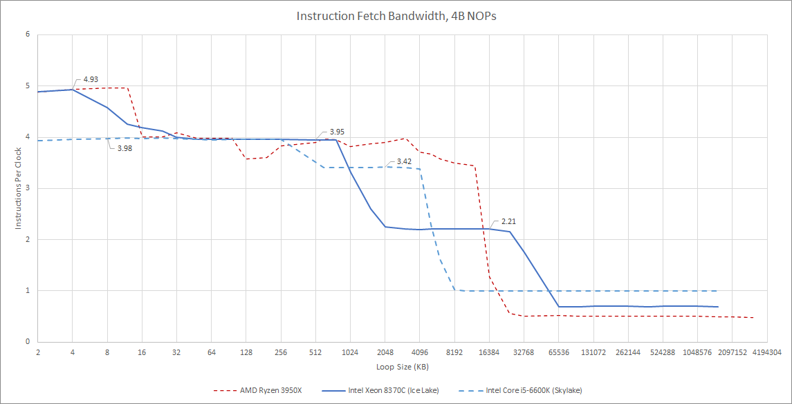

*图 11：正式图注指出 Decoder 仍四宽，Op Cache 才能到 5 Instruction/cycle。Zen 2 Op Cache 更大，且 L3 更快，大 Footprint 可能占优。*

Renamer 从四宽增至五宽，终于把整条 Pipeline 的 Narrowest Point 加宽。Move Elimination 也可在 Dependent MOV Chain 上达到五条/cycle，补上 Ivy Bridge 以来候选过多便失败的问题。

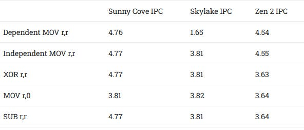

*图 12：`SUB r,r`/`XOR r,r` 被完全消除，可五条/cycle，超过四 ALU；`MOV r,0` 只识别独立性、不消除，仍受 ALU Port 限制。*

## OoO Backend：关键资源常增加 50% 以上

大 Window 允许核心跨过长 Latency 寻找独立工作，但每种 Structure 成本不同。

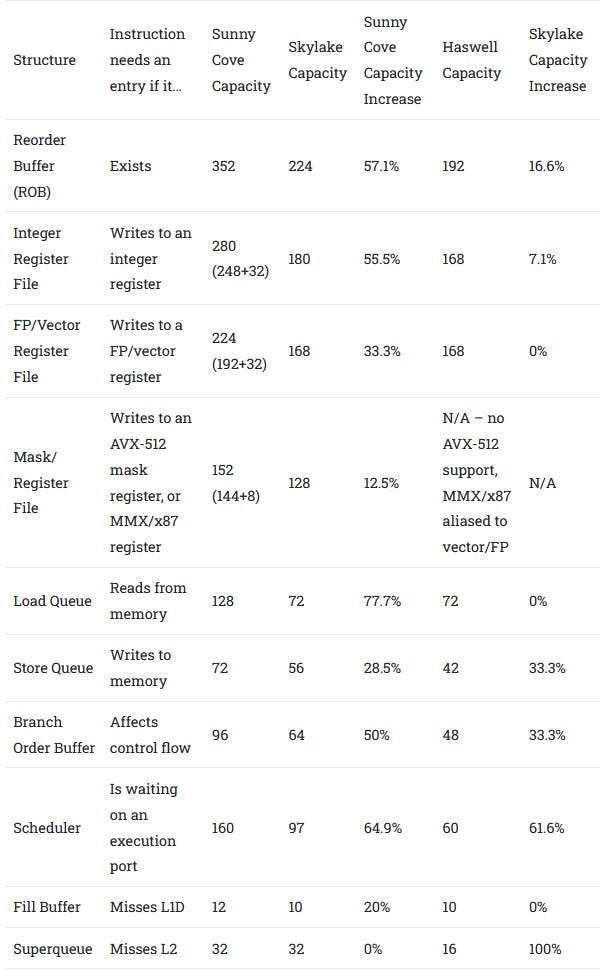

*图 13：ROB、RF、Scheduler 等全面扩大，Store Queue/FP RF Entry 增幅较小，但要承载 512-bit Data，Entry Count 不能单独比较能力。*

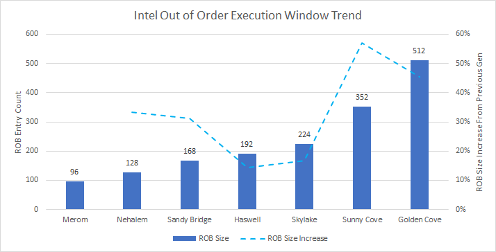

*图 14：正式图注用 ROB 粗略代表 Window Depth。真实 Reordering Capacity 也会被 RF、Scheduler、Branch Order Buffer、LQ/SQ 先满所限制；Sunny Cove 多数资源同步扩大。*

### Scheduler 与 Execution

Intel 从 Haswell 起逐步离开 P6 式大型 Unified Scheduler，Skylake 已把 Math 与 AGU 分开；Sunny Cove 更分布式，总 Entry 增加 65%，也容纳更多 Port。

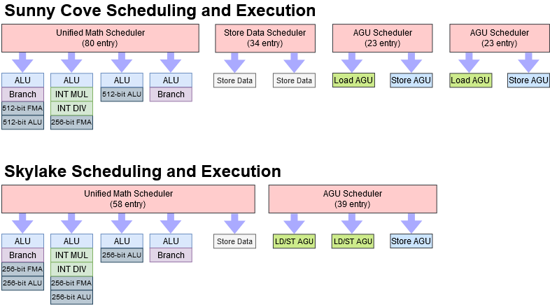

*图 15：Load 与 Store 各有两条 Dedicated AGU，取代 Sandy Bridge 以来两条 General-purpose AGU 的方式。*

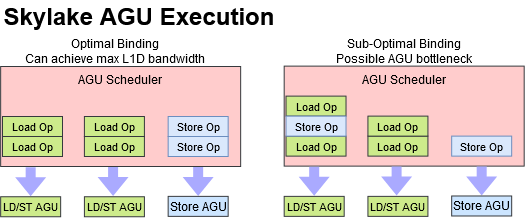

*图 16：正式图注展示峰值 L1D Bandwidth 时 Store 若绑定 General AGU，会挤压 Load；甚至手工 Reorder Instruction 能提高 OoO Core 吞吐。Dedicated AGU 让调度更直接，并改善 Copy。*

Sunny Cove 把 AVX-512 下放 Client，但不采用 Server Skylake 的 2×512-bit 巨型 FPU；仍能让 Vector Integer 达到 2×512-bit Execution。若铺货成功，廉价 Client 可成为开发平台，并用 ISA 加速缓解 AMD Core-count 压力。

### Store Forwarding

Sandy Bridge 至 Skylake 可能先按 4-byte 粗比较，相邻但不重叠的 Access 也会进入慢检查，使 Latency Matrix 呈锯齿。

*图 17：正式图注采用 Henry Wong 方法，Haswell 类似，Sandy Bridge 跨 Cache Line 惩罚更高。*

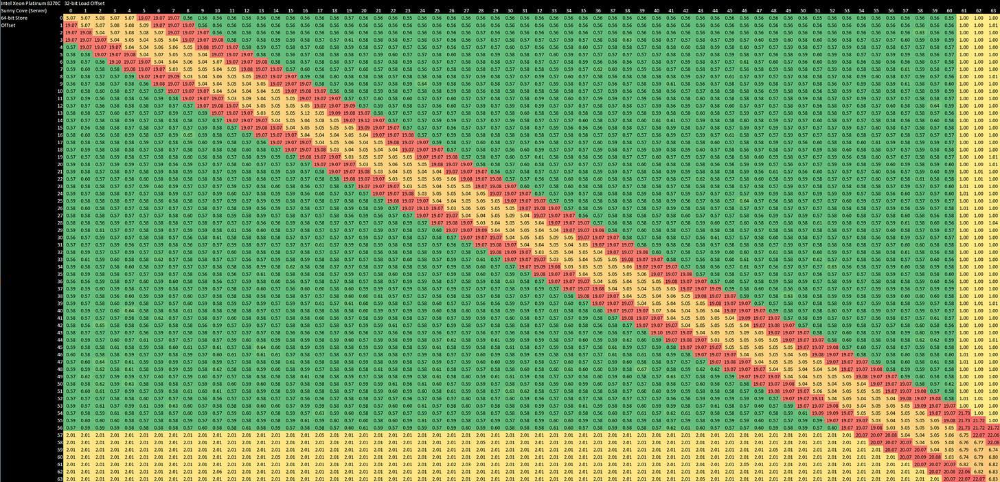

*图 18：Ice Lake SP 测试。Sunny Cove 去掉两级比较，却保持成功 Forward 5-cycle，暗示更复杂 Logic；Partial Overlap 失败惩罚反而更高。*

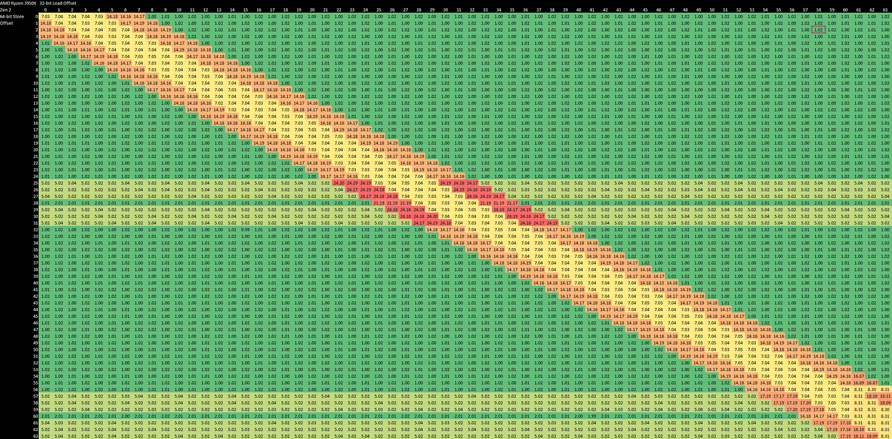

*图 19：Zen 2 整体接近；AMD L1D 原生按 32-byte Block 工作，稍更易受 Misalignment。*

### 体系结构视角：大 Window 需要执行与数据路径同步扩容

ROB 单独变大只会把阻塞推到 RF/Scheduler/LSQ。Sunny Cove 的 50%+ 扩容、更多 AGU 和 512-bit 路径是一整套工程；资源满会从 Scheduler/Allocate 反压 Rename，Mispredict/Exception 又要恢复更大在途状态。面积、Wakeup Energy 和 Bypass Complexity 都同步增长。

## Cache/TLB：第一次大改十年惯例

Sunny Cove 把 32 KB L1D 增至 48 KB，代价是多 1 cycle；同时有两种 Client L2：Rocket Lake/早期 Ice Lake 约 512 KB，Tiger Lake 为 1280 KB。

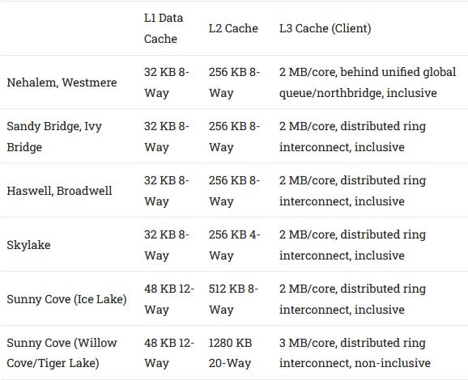

*图 20：同一 Core 世代存在不同 Cache Policy/Capacity，比较前必须明确 SKU。*

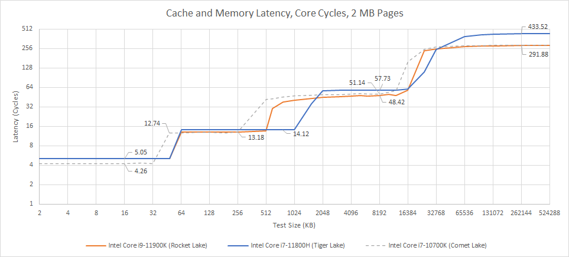

*图 21：正式图注怀疑 i7-10700K 未到 5.1 GHz，导致 Cycle Count 略高。Skylake Simple Address 可 4-cycle、复杂地址 5-cycle；Sunny Cove 48 KB 一致付出 5-cycle。*

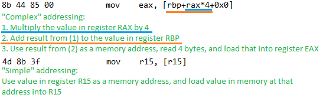

*图 22：正式图注给出示例。7-Zip 约 23% Memory Op 使用 Indexed Address 或 32-bit Offset，因此不能把 Skylake 简化为“所有访问四拍”。*

Rocket Lake 512 KB L2 相比 Skylake 256 KB 基本免费：两者相对 L1 Hit 都额外 8 cycle。Tiger Lake 1280 KB/20-way 则为 14-cycle；加上较低 Clock，Load-to-use 时间约高 22.3%。

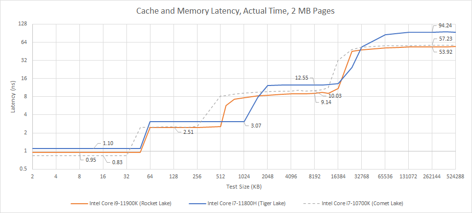

*图 23：Cache Size 与 Clock/制程共同决定 ns，不能只比 Cycle。*

Tiger Lake 每 Slice 3 MB、总 L3 24 MB，并改 Non-inclusive；10 MB 总 L2 若由 Inclusive L3 重复，会占其容量 40% 以上。Non-inclusive 需要独立 Probe Filter 追踪 Private Copy，代价约多 9 L3 Cycle。更大 L2 用来隔离慢 L3 和 LPDDR4X Latency，也能缓解 Core/Uncore Clock Gap。

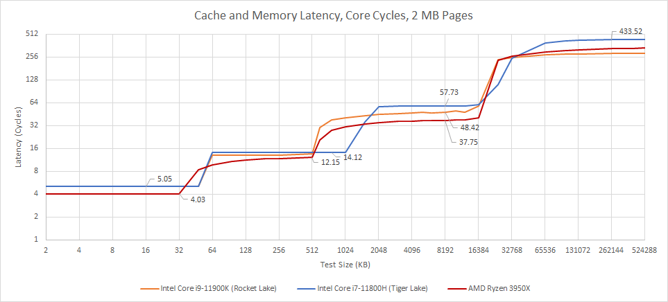

*图 24：Rocket Lake 保留 Ring L3、Latency 较好，却没得到 Tiger Lake 的大 L2/Non-inclusive 24 MB L3；高频 Variant 没能组合两边优点。*

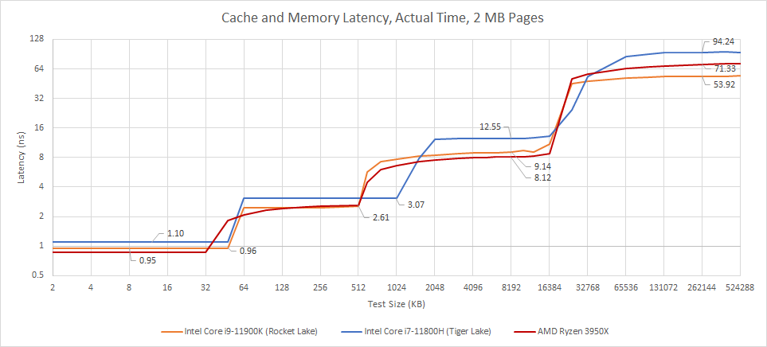

*图 25：Zen 2 各级 Cycle 更少且 Clock 不低，Absolute Latency 多数更好；Rocket Lake L2 是例外。DRAM 端 Rocket Lake 低延迟，Zen 2 Chiplet 增加路径。*

L2 TLB 更大且更快，表面参数接近 Zen 2、高于 Skylake。

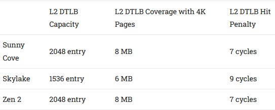

*图 26：2 MB Page 测 Cache 可绕开部分 Translation Penalty，真实应用多用 4 KB，TLB Reach/Page Walk 不能忽略。*

### Bandwidth

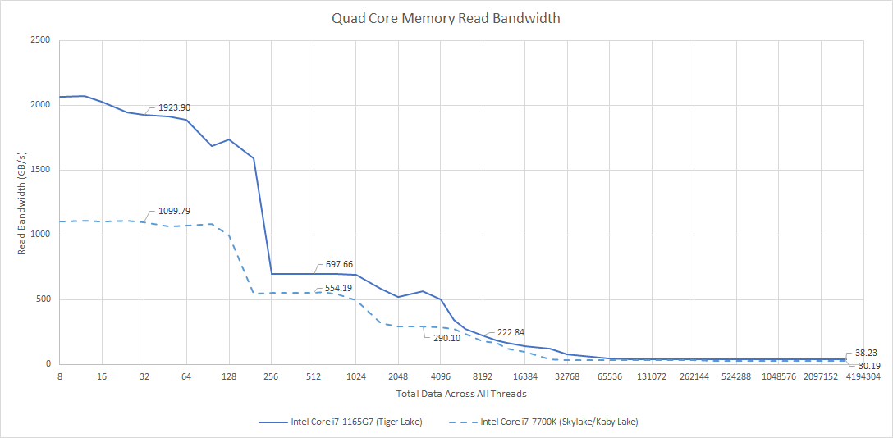

*图 27：正式图注指出 Tiger Lake 受益 AVX-512 和更快 Main Memory；L1 优势最大，到 L2/L3 后 256-bit Load 已能触及其他瓶颈。*

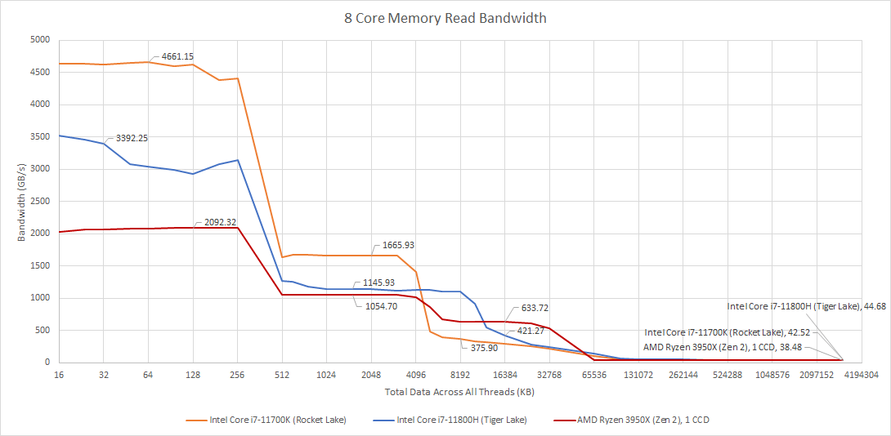

*图 28：Zen 2 L1/L2 256-bit Path 不敌 512-bit，但 Core-clock L3 极强，在 L2 外可反超。Tiger Lake 因 Clock 较低，L1/L2 Absolute Bandwidth 甚至低于 Rocket Lake；L3 以更高容量/带宽换更高延迟。*

### 体系结构视角：Cache 是制程、Clock Domain 与 Inclusivity 的共同选择

48 KB L1D 用一拍换 Hit Rate；1280 KB L2 用容量隔离慢 Uncore；Non-inclusive L3 避免重复数据，却需 Probe Filter。相同 Core 放到 10/14 nm、Ring/Mesh、DDR/LPDDR 后表现会完全不同。不能把 Sunny Cove 写成单一固定 Cache Hierarchy。

## Sunny Cove 对 Zen 2：纸面上的强敌，市场上的错位

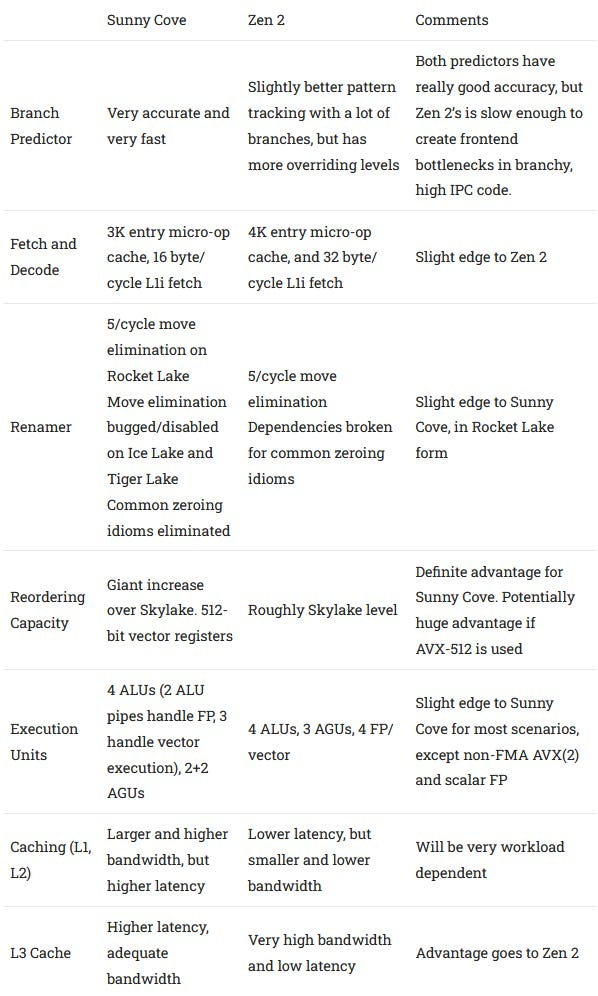

*图 29：Sunny Cove 多数资源更大，同时算法能力并不差；若 2019 年能全线上市，Zen 2 面临的 Per-core 压力会大很多。*

Intel 宣称平均 IPC 提升 18%，前提是新制程可保持 Skylake Clock 并控制功耗。现实是 2019 年只出最高 4.1 GHz 四核、28 W 以内；Desktop 仍靠 5.3 GHz、十核 Comet Lake 对抗 16-core Zen 2，后者还借 TSMC 7 nm 获得低功耗。

2021 Cypress Cove Backport 到 14 nm 达 5.3 GHz，但原本在 10 nm 上平衡的复杂结构没有增加 Pipeline Stage，回到 14 nm 后 Area/Power 失控，Rocket Lake 只到八核，又直接面对 Zen 3。

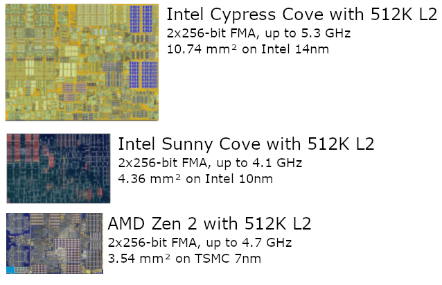

*图 30：正式图注给出 Approximate Size；跨 Node 面积不能简单代表设计效率，却直观展示 Backport 成本。*

若 10 nm 按期成熟，2019 年的 5+ GHz、8～10 Core Sunny Cove 很可能在 Thread-limited 场景强压 Zen 2，AMD 16 核仍赢多线程，但差距会缩小。这是基于架构/制程的反事实推演，不是发生过的产品事实。

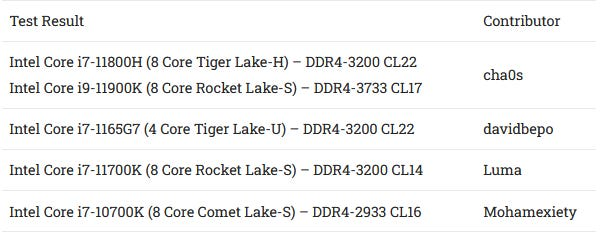

*图 31：很多对照依赖贡献者数据，Banner 来自 Fritzchens Fritz。网页修订还明确更正 Tiger Lake L2 为 1280 KB，旧文曾误写 2 MB，并补充 Memory Specification。*

### 体系结构视角：从 Sunny Cove 可以归纳出的六点认识

第一，Architecture 与 Process 必须共同收敛。面向 10 nm 的大结构 Backport 到 14 nm，频率回来，面积/功耗却摧毁产品扩展。

第二，宽度增长需要全链路配套。五宽 Rename、50%+ OoO 资源、更多 AGU、AVX-512 与 Cache/TLB 同时增强，才有机会兑现 18% IPC。

第三，低 Cycle 不是唯一目标。48 KB L1D、1.28 MB L2 与 24 MB L3 都主动用延迟换 Hit Rate/Reach。

第四，快速逻辑会推高 Physical Design 难度。更强 Predictor 与单级 Store Compare 没加 Cycle，正是先进 Node 假设失效后最难移植的部分。

第五，产品覆盖决定 ISA 渗透。Client AVX-512 若按期普及，会改变软件生态；少量低频 SKU 无法形成同样激励。

第六，“失落”不代表架构差。Sunny Cove 的问题是没有在合适 Node、频率和 Core Count 上获得完整产品窗口。

## 参考资料

- Chips and Cheese：[*Sunny Cove: Intel’s Lost Generation*](https://chipsandcheese.com/p/sunny-cove-intels-lost-generation)
- Intel Architecture Day、Optimization/Cache Materials 与 Henry Wong Store-forwarding Methodology（正文援引）

网页末尾提供 Patreon、PayPal、Discord 支持入口，并感谢测试数据贡献者。
