# 鲲鹏 920 与泰山 v110：芯粒、动态 L3 与自研 CPU 核心

> **原文信息**
>
> - 原文：*Huawei's Kunpeng 920 and TaiShan v110 CPU Architecture*
> - 副标题：*Investigating Huawei's unique L3 design and their first in-house core*
> - 原作者：Chester Lam
> - 首发平台：Chips and Cheese
> - 原文日期：2025 年 7 月 23 日
> - 原文链接：https://chipsandcheese.com/p/huaweis-kunpeng-920-and-taishan-v110
> - 本地归档：[HTML 原文](../input/huawei_kunpeng_920_taishan_v110_cpu_architecture.html)
> - 内容性质：第三方独立技术分析，非华为或海思官方材料

华为的企业产品横跨服务器、网络设备和无线基础设施，这些产品都需要先进芯片支撑。通过海思，华为能够围绕自身产品定制芯片，并降低供应链中断对业务的影响。鲲鹏 920（Kunpeng 920）正是在这一背景下形成的芯粒式处理器，面向云服务器、AI 加速器和无线基站等多种企业场景。

原作者分析的是一块华为网卡中的 24 核鲲鹏 920 CPU 子系统，并感谢 Brutus 协助搭建远程测试环境。

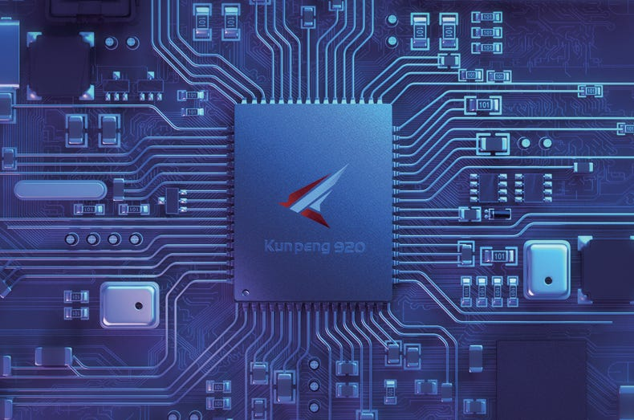

*图 1：华为资料中的鲲鹏 920。它是本文全部微结构和平台测试的对象，但具体测量来自 24 核网卡子系统，而不是所有鲲鹏 920 产品。*

## 测试平台与结论边界

原文明示的测试条件包括：24 个泰山 v110（TaiShan v110）核心、约 2.6 GHz 核心频率、32 GB DDR4-2400，以及只能使用默认 L3 partition 模式的固件环境。DRAM 测试使用这一计算芯粒上的四通道内存控制器；SPEC CPU2017 图表给出的是作者估算的单线程成绩和硬件计数器结果。

文章没有完整披露操作系统与内核、编译器版本和参数、SPEC 二进制构建方式、预热和重复次数，也受远程测试时限影响。因而文中的鲲鹏 920、Goldmont Plus、Neoverse N1、Zen 2、Skymont 和 Centriq 对比适合说明结构趋势，不能视为严格同平台排名。下文始终区分：

- **公开资料**：华为论文、产品图和 BIOS 文档中的配置与设计说明；
- **作者实测**：Chester Lam 在该 24 核系统上的延迟、带宽、分支和 SPEC 数据；
- **作者判断**：作者基于公开资料与测量作出的机制解释或评价。

## 一、系统架构：CoWoS 与多芯粒布局

【公开资料】鲲鹏 920 使用台积电 CoWoS 封装实现海思所称的“LEGO-based production”。多个等高裸片并排放置：中间是负责计算的 Super CPU Cluster（SCCL）裸片，两侧是 I/O 裸片。SCCL 采用台积电 7 nm 工艺，最多集成 32 个泰山 v110 核心和 L3 Cache；DDR4 控制器位于计算裸片上下边缘，使边缘区域尽可能用于片外连接。I/O 裸片采用 16 nm 工艺，连接 PCIe、SATA 等较低速接口；所有裸片位于 65 nm 硅中介层之上。

公开论文称，裸片间能够在保持一致性的同时提供最高 400 GB/s 带宽。这种路线与 Intel 后来的 Sapphire Rapids 有相似之处：用更昂贵、距离约束更严格的先进封装换取高片间带宽，而且较小 SKU 仍能直接使用计算裸片上的内存控制器，无需经其他芯粒转发 DRAM 请求。

区别在于，作者没有找到鲲鹏 920 能把多个 SCCL 的 L3 和 DRAM 资源完全合并成单一软件视图的证据。公开拓扑和 `numactl` 输出反而显示，每个计算裸片作为独立 NUMA 节点暴露给软件。

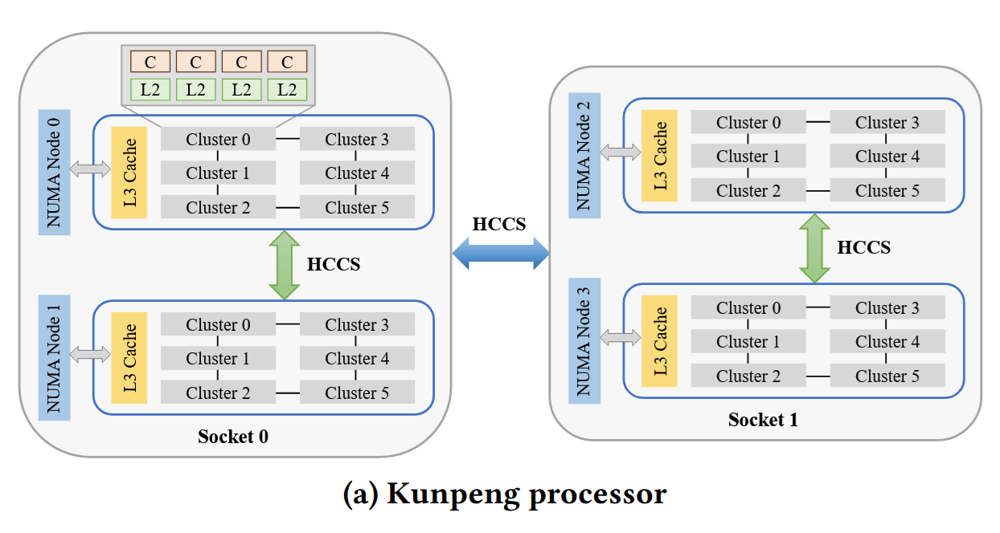

*图 2：每个 NUMA 节点包含若干核心、私有 L2 和本地 L3，并通过 HCCS 连接同插槽或跨插槽节点。体系结构意义在于，400 GB/s 一致性链路并没有消除 NUMA，软件仍需关注数据放置和远端访问。*

鲲鹏 920 还通过名为 Hydra 的链路支持双路和四路系统。同代每插槽核心数相近的 Ampere Altra 与 AMD Zen 2 服务器处理器通常最多支持双路，四路能力使鲲鹏 920 能继续扩展总核心数，但也增加了 NUMA 层级。

### 计算裸片、四核簇与环形互连

一个 SCCL 内的泰山 v110 核心按四核 CPU Cluster（CCL）分组。双向环形总线连接四核簇、L3 数据 bank、内存控制器和其他裸片链路。每个 L3 数据 bank 与一个 CCL 配对，但看起来位于独立 ring stop，而不像部分 Intel、AMD 设计那样与核心簇共用节点。满配的八簇 SCCL 有 21 个 ring stop。作者推测测试中的 24 核型号关闭了两个 CCL 及配套 L3 bank，但无法确认对应 ring stop 是否仍参与转发。

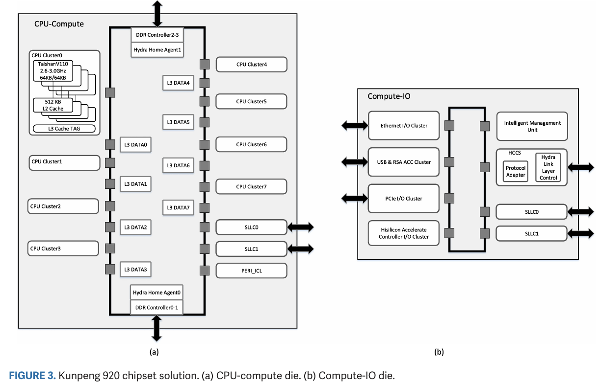

*图 3：左侧计算裸片由 CPU Cluster、L3 DATA、DDR 控制器和片间接口围绕双向环构成，右侧 I/O 裸片承载 PCIe、USB、SAS、以太网和加速器接口。图中分离的计算与 I/O 工艺体现了芯粒复用和成本优化思路。*

## 二、鲲鹏 920 最特别的设计：动态 L3

鲲鹏 920 把 L3 tag 放在 CPU Cluster 一侧，而不是放在 L3 数据 bank 旁。更不寻常的是，L3 支持三种策略：

- **Shared mode**：所有 L3 bank 组成统一共享 Cache，行为接近 AMD、Arm 和 Intel 的常见设计。作者推测物理地址会在多个 bank 间哈希，以分散流量并避免重复副本。
- **Private mode**：每个 L3 bank 只服务最近的 CPU Cluster，以牺牲全局共享能力换取更短路径。
- **Partition mode**：运行时调整每个 CCL 的私有 L3 容量。华为论文还暗示它能在 private 与 shared 行为之间动态切换，以适应不同任务或同一任务的不同阶段。

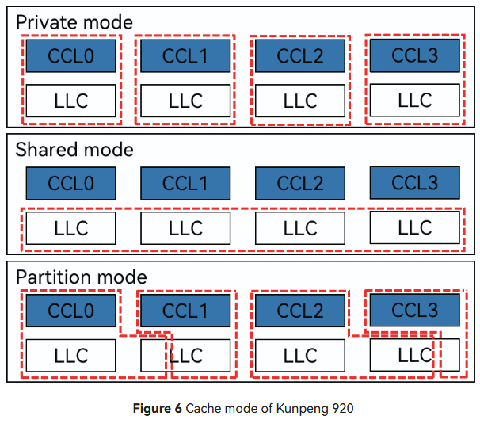

*图 4：Private 模式把 CCL 与 LLC bank 一一绑定，Shared 模式让所有 CCL 使用全部 bank，Partition 模式则动态改变各簇边界。其目标是利用 bank 与核心的物理邻近性，同时保留共享容量。*

Partition 是测试系统的默认模式，也是唯一可用模式。部分鲲鹏 920 服务器可在 BIOS 中选择 shared 或 private，但这套网卡系统没有传统 BIOS 界面，UEFI 变量也未暴露相关控制项。

### 单核私有访问与共享访问

【作者实测】单个核心访问自己的测试数组时，L3 延迟在接近 4 MB 之前约为 36 周期；随着数组变大、私有分区纳入更远的 L3 slice，延迟逐步增加；接近总 L3 容量时超过 90 周期。图中使用 indexed addressing 简化测试，原作者说明若换成简单寻址，延迟应减去约 1.5 周期，即约 0.58 ns。

如果另一个核心也遍历相同数组，整个 L3 容量范围内的延迟都会升高。即使数组只略微超出 512 KB L2，延迟也会进入 90 周期以上，表现更像 shared 模式。令作者意外的是，同一四核簇内的两个核心共享数据也会触发类似变化。作者提出两种可能：Cache line 进入 shared 一致性状态后，L3 改用共享策略；或者簇的私有 L3 分区无法保存 shared 状态的行。原文没有给出硬件信号证明二者中的哪一种成立。

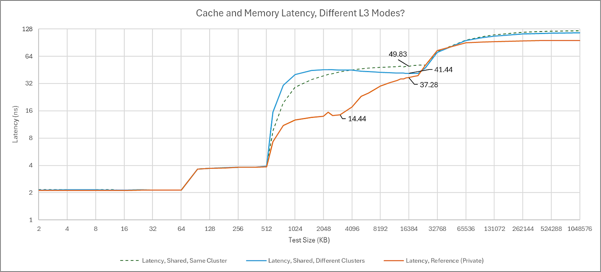

*图 5：橙线是单核私有访问，蓝线和绿线表示同簇或跨簇核心共享数据。共享后，L3 区间从较低的分级延迟变成接近 90 周期以上的高延迟平台，说明数据共享会显著改变动态 L3 行为。*

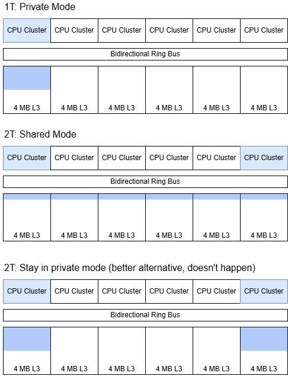

*图 6：作者认为两个核心共享 2 MB 数组时，分别保留副本仍可能比全局 shared 更快，因为此时容量并不紧张。图中第三种“继续私有”是作者给出的更优设想，并非测试系统实际采用的策略。*

### 与 Zen 2 的 L3 延迟对照

【作者判断】从积极角度看，partition 模式能够利用非均匀 L3 的物理局部性；从消极角度看，它也可能是在补偿环形互连过高的延迟。鲲鹏 920 在 shared 模式下，或单核用到大部分 L3 时，延迟甚至高于 Intel Sapphire Rapids。每核又只有 512 KB L2，因此这种长延迟更容易暴露到核心。

作者更倾向于第二种解释。即使只访问最近的私有 L3 slice，鲲鹏 920 的周期延迟也大致相当于 Zen 2 的分布式 L3；Zen 2 则能在整个容量范围内维持较均匀的低延迟，无论访问模式是共享还是私有。

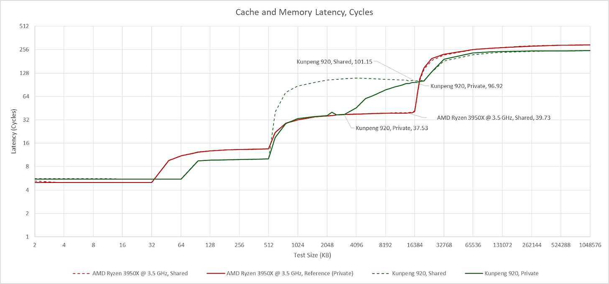

*图 7：图中标注的鲲鹏 920 private L3 约 37.53 周期，分区扩展后约 96.92 周期，shared 约 101.15 周期；Zen 2 共享与私有读都接近 39.73 周期。比较展示的是两套具体平台的层级行为，不等价于同频核心性能排名。*

### L3 带宽与竞争

【作者实测】一个四核 CCL 的 L3 读取带宽约 21.7 GB/s，因此鲲鹏 920 像 Intel E-Core cluster 一样存在簇级带宽收敛点，而且限制更严重。同簇兄弟核心争用带宽时，L3 延迟可超过 80 ns。作者以 Skymont 四核簇作对照：它也会随带宽压力增加延迟，但基础延迟更低、总带宽更高。

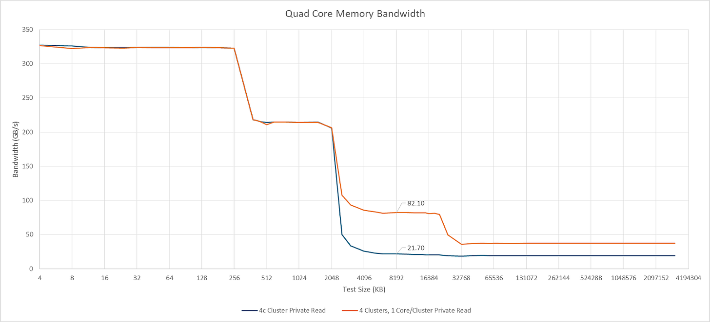

*图 8：小工作集由 L1/L2 提供数百 GB/s，进入 L3 后，同簇私有读约降至 21.7 GB/s；多个簇各读私有数据时可达到约 82.1 GB/s。它揭示了单簇出口，而不是单个 L3 bank 容量，可能先成为吞吐限制。*

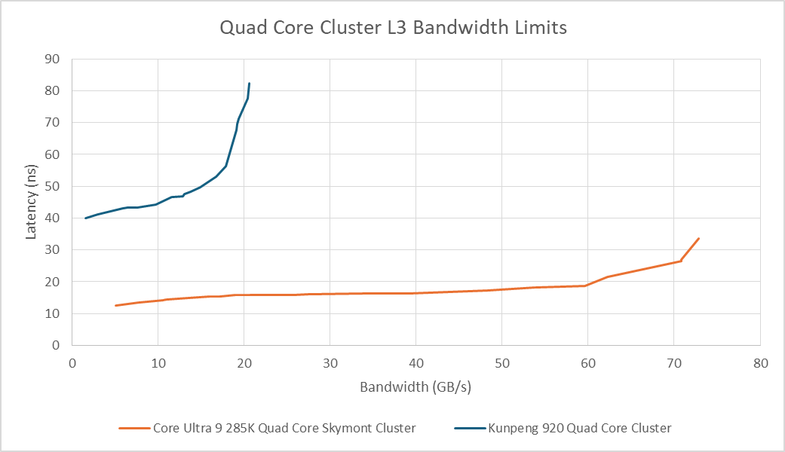

*图 9：鲲鹏 920 在约 20 GB/s 附近延迟急剧升到 80 ns 以上；Skymont 能维持更高带宽，延迟增长也更平缓。架构上，这意味着吞吐接近簇级上限时，排队延迟会放大应用可见的 L3 代价。*

### DRAM 带宽与负载延迟

计算裸片上下两侧各有一组双通道 DDR4 控制器。测试机连接 32 GB DDR4-2400，纯读模式测得约 63 GB/s。空载 DRAM 延迟约 96 ns，对服务器平台而言表现不错；中等带宽压力下很快超过 100 ns，逼近带宽极限时则超过 300 ns。作者认为这并不理想，但仍好于 Qualcomm Centriq 在其测试中接近 600 ns 的峰值排队延迟。

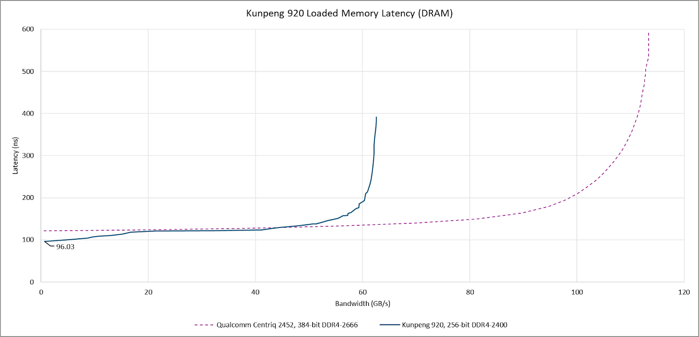

*图 10：蓝线是鲲鹏 920 DDR4-2400，空载约 96.03 ns，在约 60 GB/s 后快速上升；紫色虚线是 Centriq 对照。该图强调内存系统既要看峰值带宽，也要看接近饱和时的排队延迟。*

## 三、核间传输延迟与拓扑

【作者实测】同一四核簇内来回传递 Cache line 的延迟较合理；跨簇传输显著更慢，并可能随共享行的 home 位置不同而变化。24×24 延迟矩阵能够直接显示四核分组和更远拓扑边界。

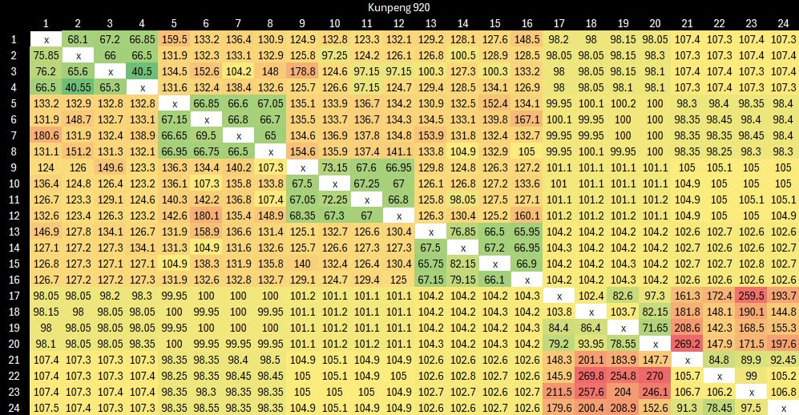

*图 11：绿色区域对应较近的同簇传输，黄色和红色区域代表跨簇或更远路径，部分组合超过 200 ns。矩阵的首要用途是暴露拓扑，而不是把每个格子当作普通应用的常见延迟。*

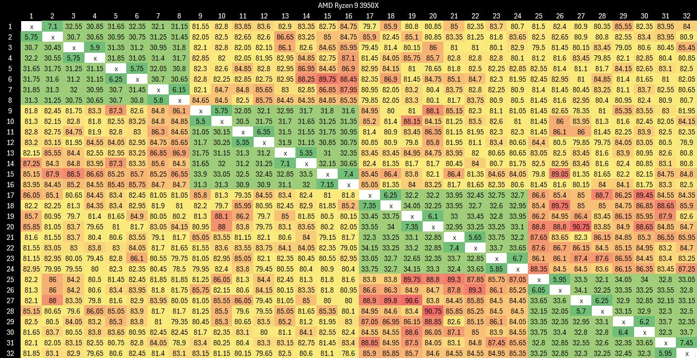

*图 12：AMD Ryzen 9 3950X 的矩阵提供桌面 Zen 2 对照。原作者认为鲲鹏 920 无论同簇还是跨簇延迟都更高，但两者平台、频率和互连目标不同。*

作者说明，Cache-to-cache 传输在实际程序中并不常见。他运行这一测试主要是识别系统拓扑，并从软件可见结果推测一致性路径；它通常不是应用性能的主要决定因素。

## 四、泰山 v110 核心总览

泰山 v110 是 64 位 Arm（AArch64）四宽乱序核心，也是华为首个自研 CPU 核。华为此前在服务器 SoC 中使用过 Arm Cortex-A57 与 A72，但泰山 v110 看不出与这些旧核心有明显继承关系。

它具有中等规模乱序窗口、三个通用整数 ALU、双管线 FPU，以及每周期处理两个内存操作的能力。作者认为它大体可与早几年的 Intel Goldmont Plus 相比：核心稍大，但配有更强的服务器内存子系统。Arm Neoverse N1 则是更直接的制程与目标对照，因为同样是台积电 7 nm、四宽、面向密度优化的 AArch64 核，不过 N1 的乱序引擎更大。

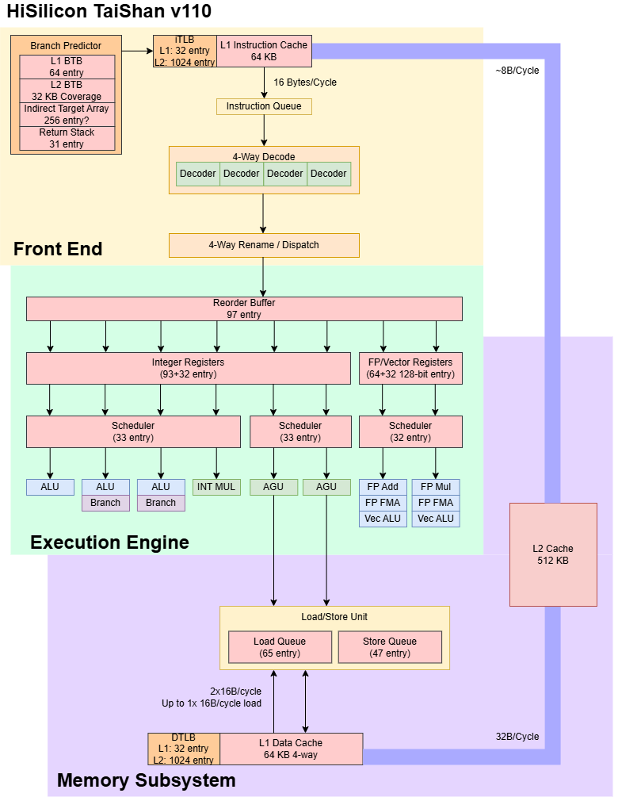

*图 13：作者整理的前端、97 项 ROB、物理寄存器、三个约 33 项调度器、整数/FPU 端口、65 项 LQ、47 项 SQ、64 KB L1 和 512 KB L2。图的体系结构意义是展示一个四宽核心如何在有限面积内平衡预测、乱序、执行和存储资源。*

## 五、分支预测

华为资料称泰山 v110 使用“two-level dynamic branch predictor”。传统 two-level prediction 会组合分支地址和历史分支结果去索引方向表，但到 2010 年代后期，单纯的两级算法已很少用于高性能设计。作者因此保留其他可能：华为或许指两级 BTB，或者一个具有两层覆盖关系的子预测器，而不一定是在精确定义完整方向预测算法。

### 随机模式与条件分支

作者让条件分支按不同长度的随机 taken/not-taken 模式执行。泰山 v110 呈现出与 Arm Cortex-A73 相近的行为：少量分支和较短模式能够预测，分支数或所需历史增加后，随机与可预测模式之间的差距迅速扩大。

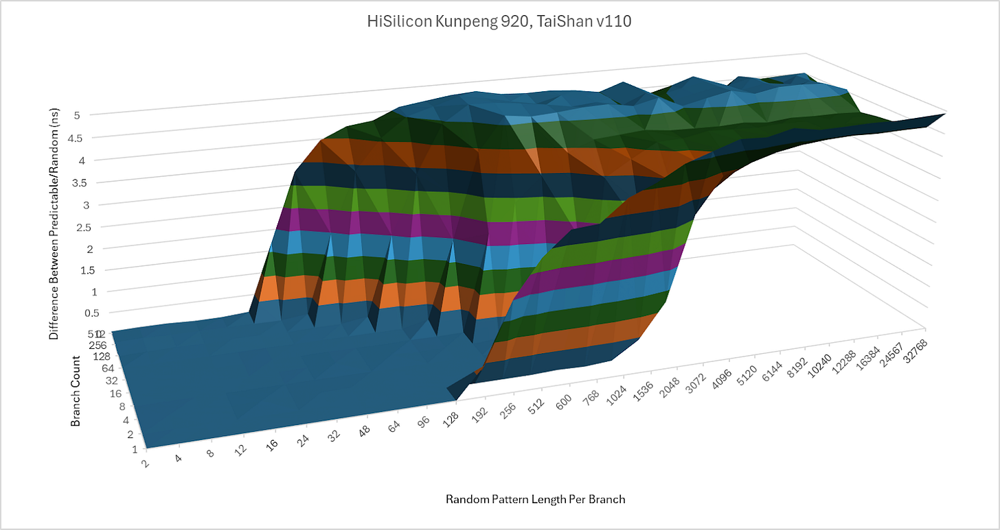

*图 14：横轴是每条分支的随机模式长度，另一轴是循环中的分支数，纵轴为随机与可预测执行时间之差。曲面上升表示预测器无法稳定识别该组合，而不是直接给出准确率百分比。*

### BTB、返回栈与间接分支

一个 64 项快速 BTB 能以 1 周期提供 taken 目标，因此容量内的命中分支可以接近零气泡。超出它以后，只要代码仍在 32 KB 范围内、分支间隔不太密，目标供给约需 3 周期。分支间隔不超过 16 B 时增加约 1 周期；更密集的布局表现明显恶化。

代码溢出 L1 I-Cache 后，taken 分支延迟陡增。每 64 B Cache line 放一个分支时，从下一层取指约需 11–12 周期，更大代码范围可超过 38 周期。原文第二处层级名称与前一句有重复，而图中拐点分别对应 32 KB L1 I-Cache、512 KB L2 和更下层容量，因此这里保留测得延迟，不把层级名称作超出证据的改写。作者认为这一趋势说明预测器无法明显领先普通取指去驱动代码预取。

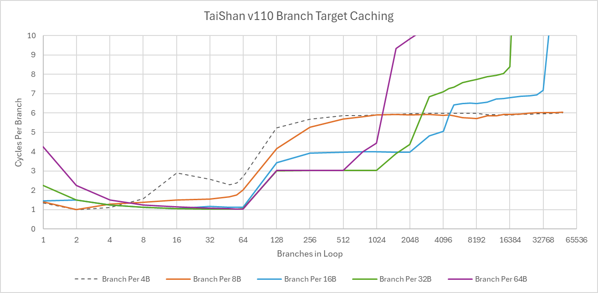

*图 15：不同曲线表示每 4/8/16/32/64 B 放置一条分支。64 项快速容量后延迟升至约 3 周期，代码或目标集合进一步扩大时继续出现台阶；密集分支更早触及限制。*

返回地址由 31 项 Return Stack 处理。更一般的间接分支预测器在显著退化前，可处理每条分支最多约 16 个目标，或合计约 256 个间接目标。

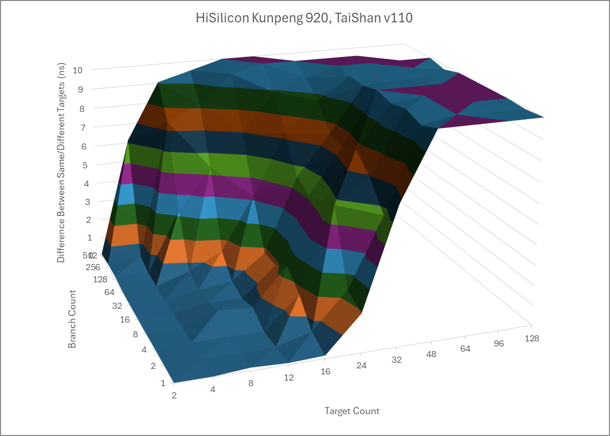

*图 16：两条横轴分别改变分支数量和每条分支的目标数，纵轴是随机目标相对固定目标的额外时间。约 256 个总目标附近出现明显上升，揭示间接目标跟踪容量的数量级。*

### SPEC CPU2017 中的预测准确率

【作者实测】泰山 v110 在 SPEC CPU2017 中的分支准确率整体接近 Goldmont Plus，后者仅略占优势。同期高性能 Zen 2 明显更强，展示了同一 7 nm 工艺上更大预测资源能够达到的水平。

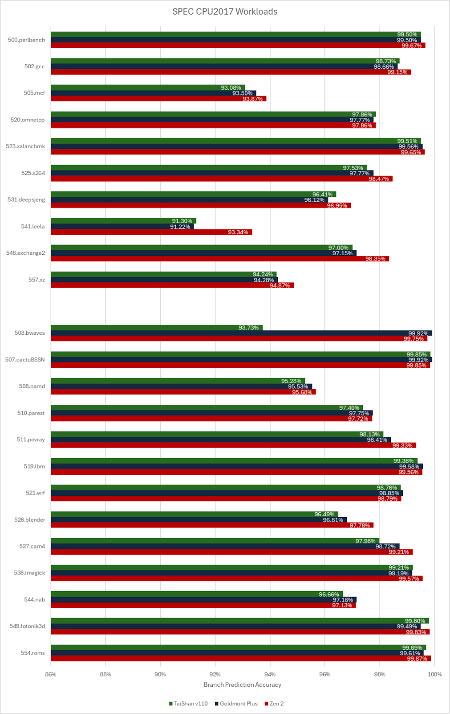

*图 17：逐项比较泰山 v110、Goldmont Plus 与 Zen 2 的预测正确比例。多数子测试接近，但不同程序差异很大，因此几何平均值不能替代 505.mcf、525.x264 等具体分支行为。*

## 六、取指、译码与重命名

泰山 v110 配有 64 KB L1 I-Cache，每周期最多提供四条指令。指令地址转换使用 32 项 iTLB，后方是 1024 项 L2 TLB；作者没有现成测试判断二级 TLB 是否与数据侧共享。

代码溢出 L1 I-Cache 后，平均取指带宽骤降到约 6–7 B/cycle，比 Goldmont Plus 或 Neoverse N1 的 L2 代码带宽更低。从 L3 取代码时表现很差，接近对照处理器从 DRAM 取指的水平。

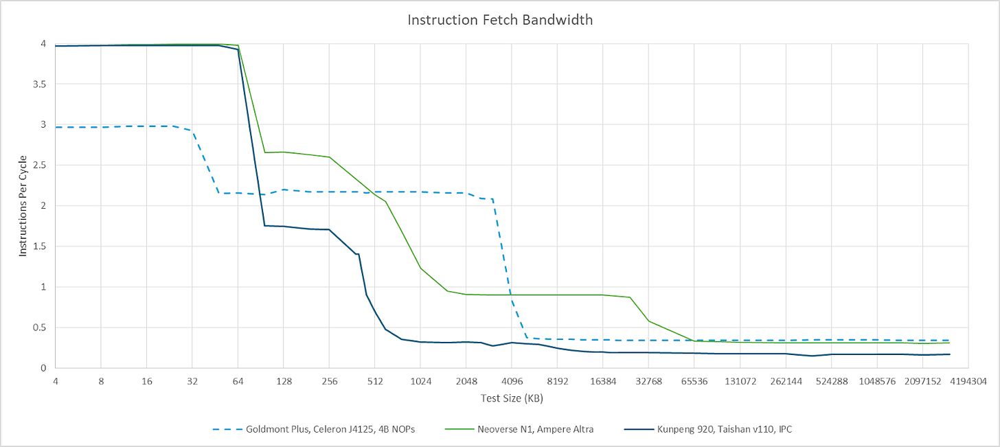

*图 18：泰山 v110 在 64 KB 内接近每周期 4 条指令，越过 L1 I-Cache 后快速跌到约 1.7 IPC，再随 512 KB L2 和 L3 边界继续下降。Neoverse N1 与 Goldmont Plus 的下层供给更平缓，说明泰山前端更依赖代码局部性。*

四宽译码器把 AArch64 指令转换为微操作，随后进行寄存器重命名并分配乱序资源。重命名器支持 move elimination，可在无需执行端口的情况下消除一部分寄存器到寄存器移动。

## 七、乱序执行引擎

泰山 v110 使用基于物理寄存器文件（PRF）的执行方式：数值位于物理寄存器中，ROB 和调度器保存相应索引。它与 Goldmont Plus 的主要容量对照为：

- ROB：泰山 97 项，Goldmont Plus 93 项；
- 整数物理寄存器：泰山约 125 项，其中约 93 项可用于推测状态、32 项保存已退休状态；Goldmont Plus 约 82 项；
- 浮点/向量物理寄存器：泰山约 96 个 128 位寄存器，其中约 64 项可用于重命名；Goldmont Plus 约 91 项；
- Load Queue：泰山 65 项，Goldmont Plus 24 项；
- Store Queue：泰山 47 项，Goldmont Plus 26 项。

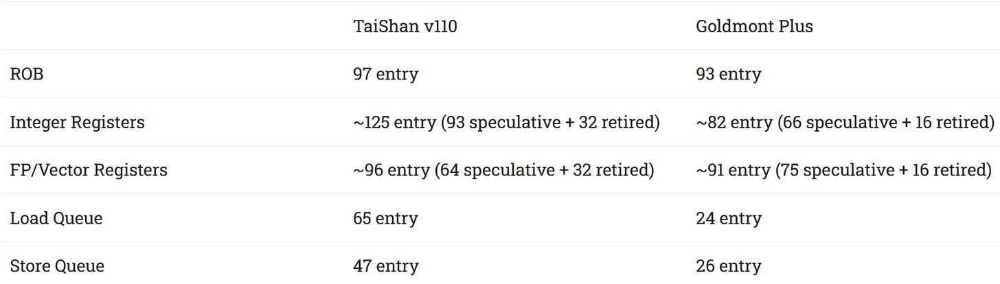

*图 19：两者 ROB 规模接近，但泰山拥有更多整数寄存器和更大的 load/store 队列。较大的访存窗口有利于隐藏服务器内存延迟，不过最终并行度仍受调度器、Cache miss 跟踪和依赖链限制。*

调度器按整数 ALU、内存访问和浮点/向量三类划分，每类使用一个统一调度器，容量都约为 33 项。Goldmont Plus 的整数侧是分布式布局，Neoverse N1 则全部采用分布式调度。

SPEC CPU2017 会频繁给泰山 v110 的调度器施压，这对任何核心都不罕见。整数物理寄存器几乎能覆盖 ROB 容量，因此很少先耗尽。条件码拥有独立重命名文件，约有 31 个可用重命名，通常也不是问题，只有压缩类程序和 505.mcf 等分支密集负载更容易触及。浮点程序则同时挤压 FPU 调度器和向量寄存器。AArch64 定义 32 个 FP/向量架构寄存器，而 x86-64 只有 16 个，因此即使物理总量接近 Goldmont Plus，泰山可用于推测重命名的余量仍更少。

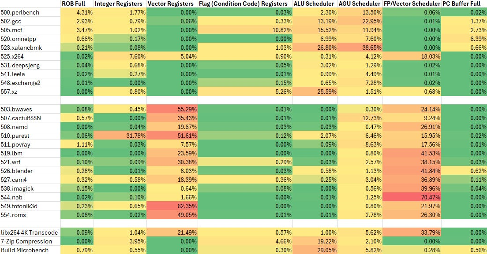

*图 20：列分别统计 ROB、整数/向量/条件码寄存器、ALU/AGU/FP 调度器和 PC buffer 的满阻塞比例。多项测试的 ALU、AGU 或 FP scheduler 比 ROB 更“热”，说明资源配比比单看乱序窗口大小更重要。*

### 整数与浮点执行端口

整数侧有四个端口。三个通用 ALU 处理加法、位运算等常见操作，其中两个能执行分支，但整个核心每周期最多持续处理一条 taken 分支。第四端口负责乘除等多周期操作，整数乘法延迟 4 周期。Goldmont Plus 与 Neoverse N1 也是“3+1”布局，但把分支放到第四端口。作者认为独立分支端口可能更利于吞吐和优先发现误预测；泰山的布局则可能按操作延迟分类，简化调度。

FPU 有两个端口，这是当时低功耗、密度优化核心的常见配置。两个端口都支持 128 位向量长度的 FP32 FMA，FP64 吞吐只有四分之一。FP32 FMA 延迟为 5 周期；虽然 FP32 加法、乘法延迟同样是 5 周期，但二者各自只能使用一个端口。向量整数加法可用两端口，延迟 2 周期；向量整数乘法只有一个端口可执行。

## 八、Load/Store 与 Cache

两个地址生成单元（AGU）负责访存地址。L1 D-Cache 命中时，load-to-use 延迟为 4 周期；使用 indexed addressing 会再增加 1–2 周期。数据侧地址转换由 32 项全相联 dTLB 和 1024 项 L2 TLB 完成，命中 L2 TLB 额外增加 11 周期。作者认为对低频核心来说偏慢，并对照 Zen 2 的 7 周期、Goldmont Plus 的 8 周期；Zen 2 还有 2048 项二级 TLB。

### Store forwarding 与非对齐边界

Load 地址必须与更早的 store 地址比较，以识别内存依赖。泰山 v110 的 store forwarding 延迟为 6–7 周期，即使 store 只覆盖后续 load 的一部分也大致保持。L1 D-Cache 看起来按 16 B 对齐块工作：跨越 16 B 边界时转发增加 1–2 周期；相互独立的 load 和 store 只要都不跨该边界，就可以并行执行。

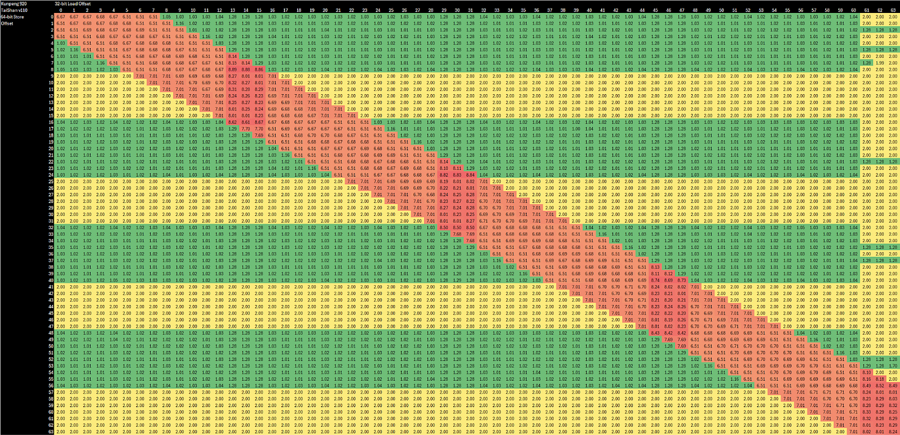

*图 21：横纵轴改变 load/store 的地址偏移；橙色重叠区域约为 6–7 周期，跨 16 B 边界附近升到约 8 周期，绿色和黄色的非重叠基线路径约为 1–2 周期。矩阵说明泰山能处理部分重叠转发，但内部对齐边界仍会增加延迟。*

64 KB L1 D-Cache 为 4 路组相联，每周期可处理两个 128 位访问；两路都可以是 load，其中一路也可以是 store。Goldmont Plus 同样支持两个 128 位访问，但固定为一 load 加一 store。由于常见程序的 load 数通常高于 store，泰山在实际负载中更可能获得带宽优势；较新的 Neoverse N1 具有相近 L1D 吞吐。

### 每核私有 L2

每个泰山 v110 核心有 512 KB 私有 L2，即使核心按四核簇组织，也没有类似 Intel E-Core cluster 的簇级共享 Cache。L2 命中延迟为 10 周期，按周期计低于 Neoverse N1 和 Zen 2。

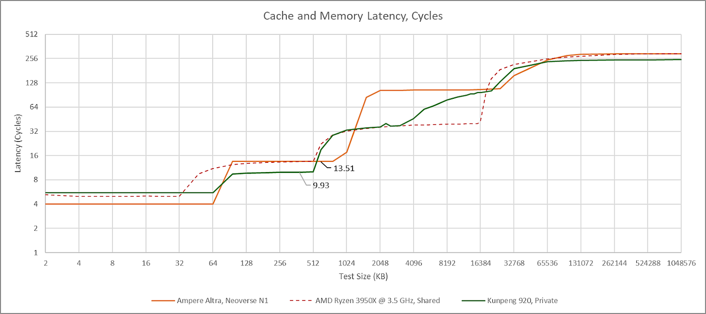

*图 22：鲲鹏 920 的 L2 拐点约 9.93 周期，Neoverse N1 约 13.51 周期；鲲鹏随后进入动态 L3 的多级延迟区间。小而快的私有 L2 有利于命中延迟，但 512 KB 容量更容易把工作集暴露给高延迟 L3。*

L2 平均可提供约 20 B/cycle，作者据此推测 L2 到 L1D 的物理接口可能是 32 B/cycle。Read-modify-write 模式没有提高总带宽，因此该接口很可能不是读写双向各自独立。考虑到核心的 128 位向量宽度和较大的 L1D，这一 L2 带宽仍然充足。

作者认为泰山 L2 选择了性能优先、容量较小的方向；Goldmont Plus 则相反，使用 4 MB 共享 L2，因为它同时承担末级 Cache。华为或许希望动态 L3 分区降低平均 miss 延迟，从而允许每核 L2 更专注于速度。

## 九、SPEC CPU2017 性能

华为选择 SPEC CPU2017 integer 作为泰山 v110 的主要指标，因为目标市场包含大量整数工作负载。作者的单核估算中，泰山 v110 比 Cortex-A72 快 22.5%，比 Goldmont Plus 快 7%。它无疑超过了前代核心，但考虑到 7 nm 工艺、更大的末级 Cache 和更强内存控制器，对 Goldmont Plus 的领先并不大。

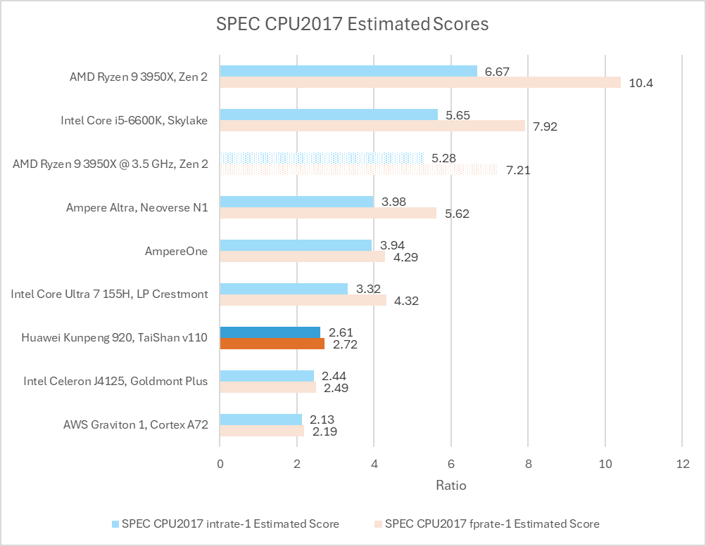

*图 23：泰山 v110 的整数估算分为 2.61，浮点为 2.72；Goldmont Plus 为 2.44/2.49，Cortex-A72 为 2.13/2.19。Neoverse N1 达到 3.98/5.62，Zen 2 更高。成绩来自不同平台，必须结合频率、编译和内存系统理解。*

与同为台积电 7 nm 的处理器相比，差距更明显：Neoverse N1 比泰山 v110 快 52.2%，高性能 Zen 2 的领先幅度更大。这一结果符合两者不同定位，但 N1 与泰山同为密度优化 AArch64 核，因此更能暴露设计配比差异。

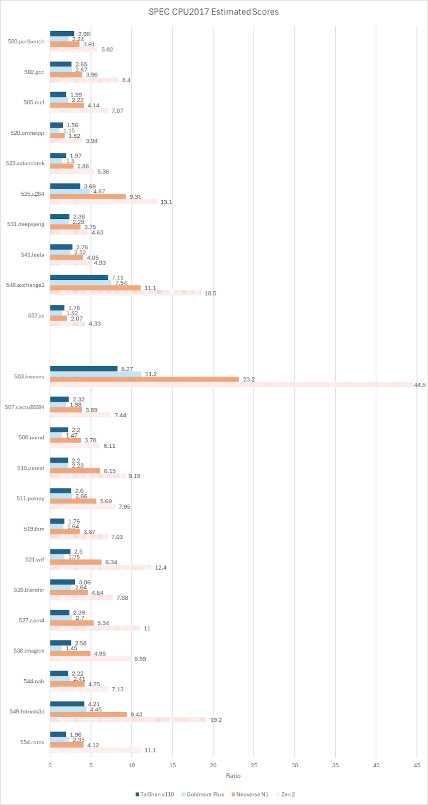

*图 24：按子项目展示泰山 v110、Goldmont Plus 与 Neoverse N1 的估算成绩。整体排名之外，503.bwaves、505.mcf、525.x264 等项目的异常差距提示必须回到分支、访存和具体运行状态分析。*

泰山整体优于 Goldmont Plus，但在 505.mcf、525.x264 和 503.bwaves 落后；这三项中，泰山每条指令发生的误预测更多。即使它在 541.leela 等同样依赖预测器的项目中与 Goldmont Plus 接近，这几个程序仍以不同分支结构击中了它的弱点。

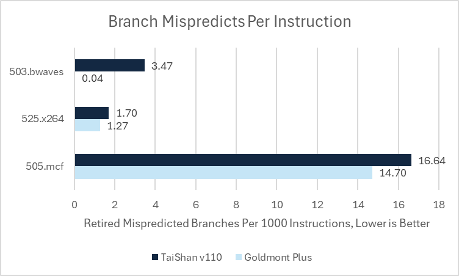

*图 25：泰山 v110 与 Goldmont Plus 在 503.bwaves 为 3.47 对 0.04 MPKI，525.x264 为 1.70 对 1.27，505.mcf 为 16.64 对 14.70。误预测差异能解释部分性能落后，但不能替代对访存瓶颈的分析。*

Neoverse N1 在所有子测试中都领先泰山，最大优势来自 505.mcf 和 525.x264。505.mcf 中 N1 为 15.03 MPKI，泰山为 16.64 MPKI，而且该程序同时受后端内存访问限制。Ampere Altra 的 Cache 配置和更强预测器可能共同带来超过 100% 的领先。

525.x264 的差距更难解释。作者怀疑获取成绩报告时遇到了一次异常运行，因为随后采集的 IPC、实际指令数和频率并不足以支持如此大的差距；受远程测试和时间限制，他无法继续复测。因此这一个子项不应被用来扩大总体结论。

无论 x264 的异常来自哪里，N1 的总体优势都很清晰：它的分支预测几何平均准确率接近 Zen 2，乱序窗口只比泰山略大，但整数调度容量和 FP/向量物理寄存器配比更均衡；内存侧更大的 L2 也抵消了鲲鹏动态 L3 可能带来的优势。

## 十、总结

鲲鹏 920 集合了不少大胆特性：它很早就在服务器领域采用台积电 7 nm，比 Ampere Altra 和 Zen 2 服务器版本更早上市；在 AMD 仍使用普通封装走线、Ampere 仍坚持单片设计时，它已经采用 CoWoS；动态 L3 也明显区别于当时除 IBM 外多数只使用 shared 模式的处理器。

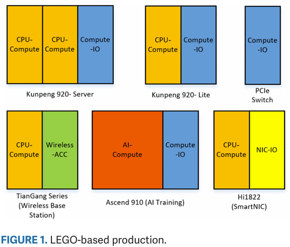

*图 26：相同 CPU、I/O、无线和 AI 裸片可组合成服务器、Lite、PCIe 交换芯片、基站、训练加速器和 SmartNIC。芯粒路线最明确的收益是跨产品复用，而不仅是单颗服务器 CPU 的峰值性能。*

【作者判断】问题在于这些特性没有稳定转化为性能优势。若软件仍看到多个 NUMA 节点，CoWoS 高片间带宽没有像单片系统那样统一资源；partition 模式随共享行为变化，单核使用大部分 L3 或多核共享数据时性能不佳；Zen 2 的均匀低延迟 L3 更稳定，Neoverse N1 用更大的每核 L2 隔离 L3 延迟，在实践中也更有效。芯粒设计真正体现出的优势，可能是用相同裸片覆盖更多产品类别。

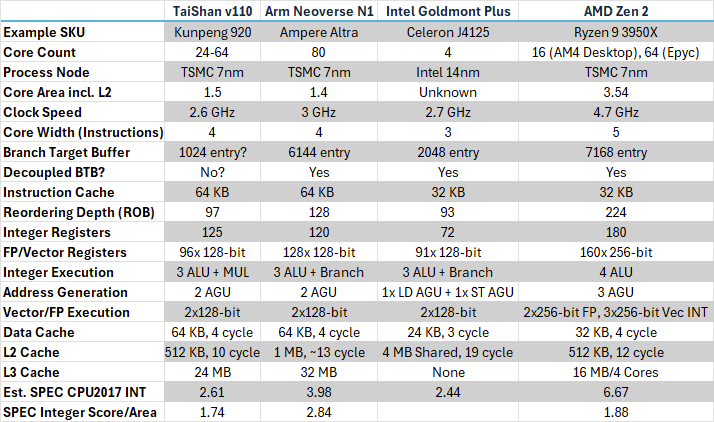

*图 27：泰山 v110 约 1.5 mm²，N1 约 1.4 mm²，但 N1 有 6144 项 BTB、128 项 ROB、1 MB L2，并取得更高 SPEC 估算成绩。Zen 2 的目标和面积不同，只适合说明增加宽度与乱序容量存在收益递减。*

在核心层面，作者认为海思没有充分发挥 7 nm 优势。相似目标、相同工艺的 Neoverse N1 在近似面积内放入更大的 BTB、更大的向量寄存器文件和两倍 L2，并通过更均衡的后端资源减少延迟型负载的阻塞。与 AMD 的比较更困难，因为 Zen 2 面向更高性能和频率，但它在桌面频率下仍实现了有竞争力的面积效率。

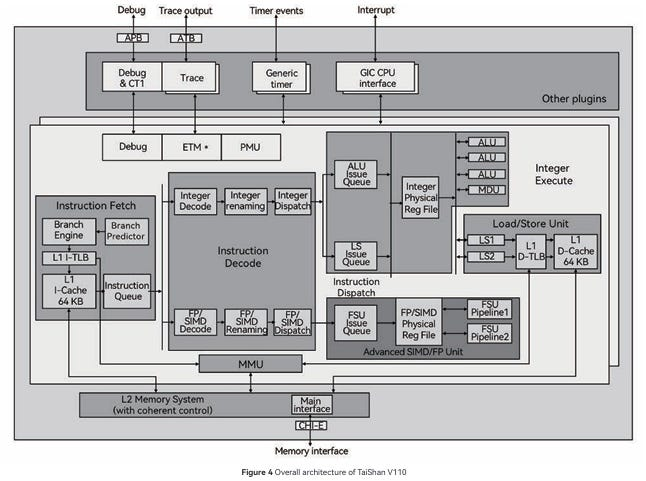

*图 28：官方框图展示 Instruction Fetch、分支预测、三路整数派发、两个 FP/SIMD 队列、Load/Store Unit、64 KB L1 和带一致性控制的 L2。它确认功能模块关系，但不直接给出作者微基准中的全部容量和延迟。*

文章最后给出的评价并非全盘否定：华为不一定需要泰山 v110 正面击败 Neoverse N1 或 Zen 2，而是需要一个足够可靠的核心维持产品与业务。泰山 v110 能完成这一任务。更重要的是，海思很早就采用先进工艺和 CoWoS，并愿意尝试动态 L3，这说明工程团队愿意承担架构探索风险。即使第一代实现只做到“足够好”，它仍能成为后续设计的起点。

## 参考资料

1. 泰山 v110 指令微操作与端口分配：https://github.com/qcjiang/OSACA/blob/feature/tsv110/osaca/data/tsv110.yml
2. 鲲鹏 920 服务器 BIOS 的 L3 shared/private 设置：https://support.huawei.com/enterprise/zh/doc/EDOC1100088653/98b06651
3. Huawei Research 2022 年第 1 期，鲲鹏 920 内容从第 126 页开始：https://www-file.huawei.com/-/media/corp2020/pdf/publications/huawei-research/2022/huawei-research-issue1-en.pdf
4. Shanghao Liu 等，*Efficient Locality-aware Instruction Stream Scheduling for Stencil Computation on ARM Processors*
5. 鲲鹏 920 大型 SKU 的 NUMA 行为说明：https://www.hikunpeng.com/document/detail/en/perftuning/progtuneg/kunpengprogramming_05_0004.html
