# 大型系统核间延迟图谱：从 Pentium 双路到 Sapphire Rapids 与 Genoa-X

> **文章来源**
>
> - 文章：*Core to Core Latency Data on Large Systems*
> - 撰文：Chester Lam
> - 首发：Chips and Cheese
> - 发布：2023 年 11 月 7 日
> - 链接：https://chipsandcheese.com/p/core-to-core-latency-data-on-large-systems

多核必须让各核心看到一致内存。MESI、MESIF、MOESI 等协议结合 Snoop Filter/Directory，减少“问遍所有核心”的 Broadcast。测试让两个 Core 用 Atomic Compare-and-exchange 反复抢同一 Cacheline，测 Ownership Bounce 的时间。

它与 AnandTech Core-to-core Test 测的是同类事情，但实现不同。实际应用的这种流量通常远少于 L3/DRAM 流量，除非数值极端，否则性能影响往往很小。含 SMT 的图按 Windows 风格编号，让 Sibling 相邻；Linux 编号不同。矩阵还受 Cacheline Home Agent/L3 Slice 影响，颜色不是简单物理距离图。

### 体系结构视角：矩阵里同时藏着四层拓扑

同 Core SMT、同 Cluster/CCX、同 Socket 不同 Ring/Mesh、跨 Socket/Node 各有路径；Physical Address 又选择 Home Slice。一次 Ping-pong 可能先到 Home Directory，再找 Owner、转发 Data、回 Acknowledge。正确读图要找分块、周期性和不对称，不能把每个格子都解释成 Core 间直连距离。

## Intel Sapphire Rapids

完整 Sapphire Rapids 由四 Die 通过 EMIB 相连，基于 Golden Cove。Socket 内平均59 ns，跨 Socket 平均138 ns。

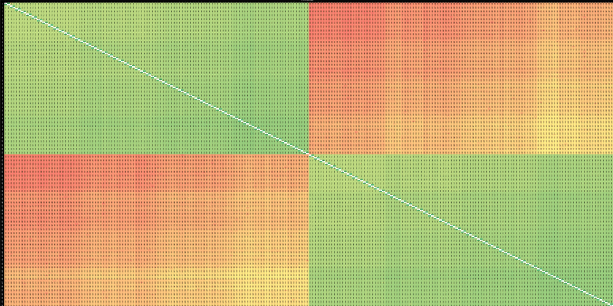

*图 1：Socket、Tile/Die 与核心组形成分块。*

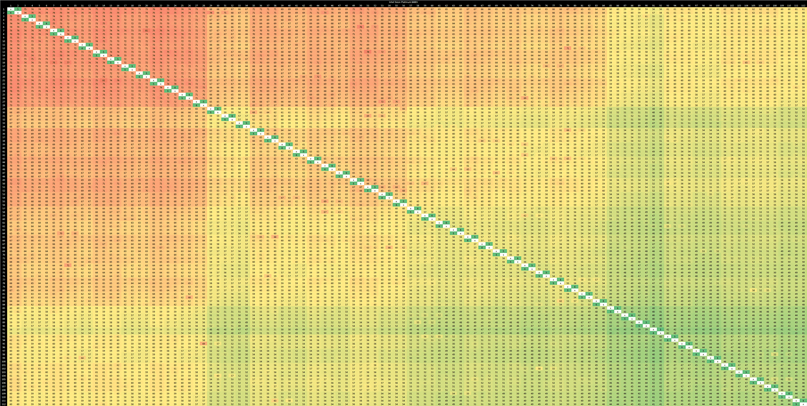

*图 2：四核一组特征相近，Socket 内最坏81 ns。颜色只按该 Socket Scale，不能与图1颜色直接比。*

## AMD Genoa-X

Genoa-X 是 Zen 4 V-Cache Server。Coherence 分 CCX 与系统两层：CCX 可缓存 Home 在远端 Socket 的 Line，并服务本 Cluster Core；跨 CCX 则由拥有 Cacheline 的 Socket 处理。

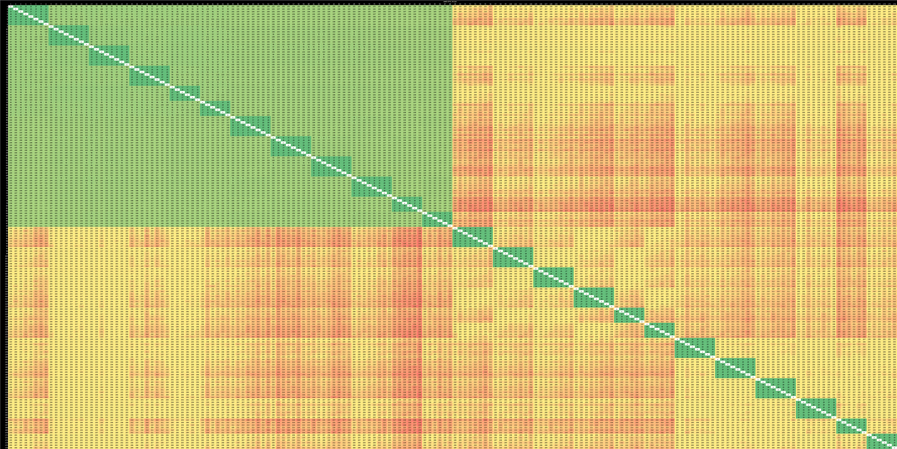

*图 3：CCX 小块与跨 IOD/Socket 路径清晰；本文复用既有测试，详细平台见原专题。*

## Amazon Graviton 3/2

Graviton 3 是单片64颗 Neoverse V1，Memory Controller 位于 Chiplet。

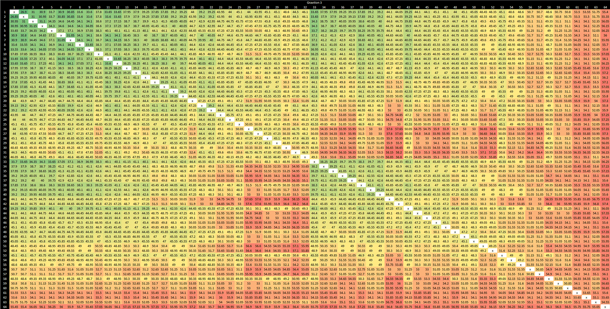

*图 4：平均48 ns、全芯片低于59 ns；不支持跨 Socket Coherence，最大实例64核，用规模边界换统一低延迟。*

Graviton 2 为单片64颗 Neoverse N1，行为近似、平均50.7 ns。

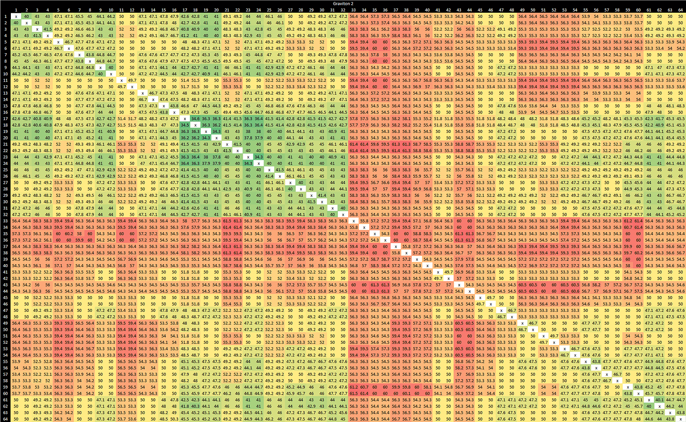

*图 5：单 Socket Monolithic 让矩阵均匀。*

## Intel Skylake Server

Skylake Server 首次用 Mesh。AVX-512 大核在14 nm 面积大，高核数需四 Socket。

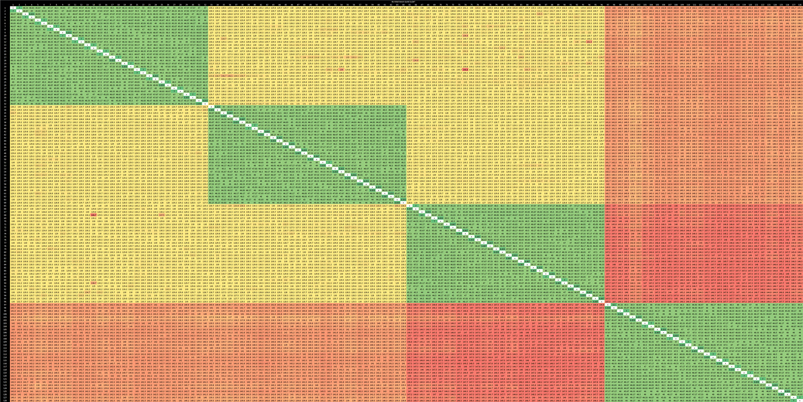

*图 6：第一 Socket 似乎是 Cacheline Home，第四最远；跨 Socket 最坏约150 ns，在四路规模下表现不错。*

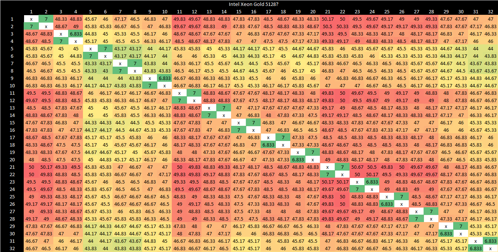

*图 7：平均47 ns，Core Group 有相似特征。*

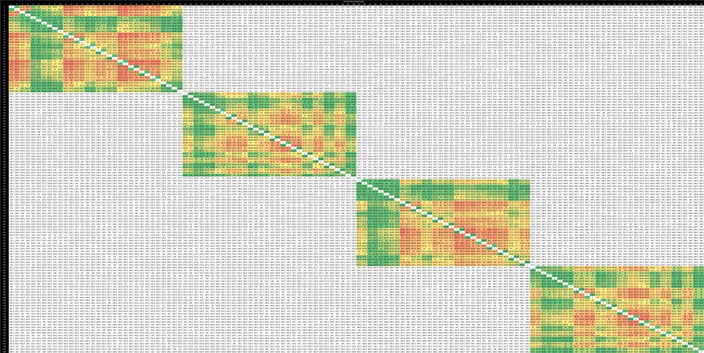

*图 8：Pattern 不同，暗示不同 Chip 的 Core Number 或 Address→L3 Slice Mapping 不同。*

## Intel Broadwell

Broadwell Server 用 Dual Ring，跨 Socket 最坏约130 ns，比 Sandy Bridge 改善。

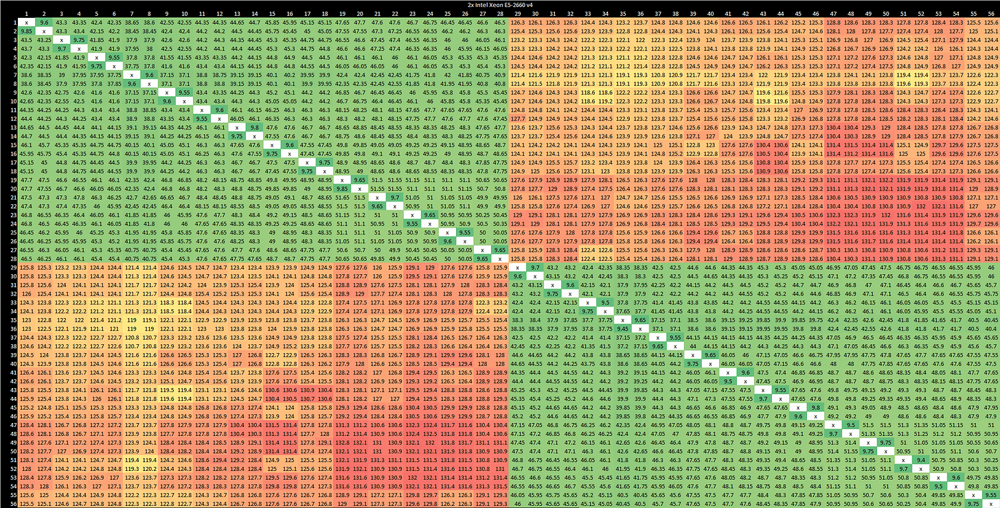

*图 9：Home Slice 由 Address 决定，Core Valid Bit 指示 Owner。Intel 将相邻 Line Striping 到不同 Slice，避免 Partition Camping。*

移动被测 Cacheline 相对 Page Boundary 的 Offset，可切换 Home Slice。

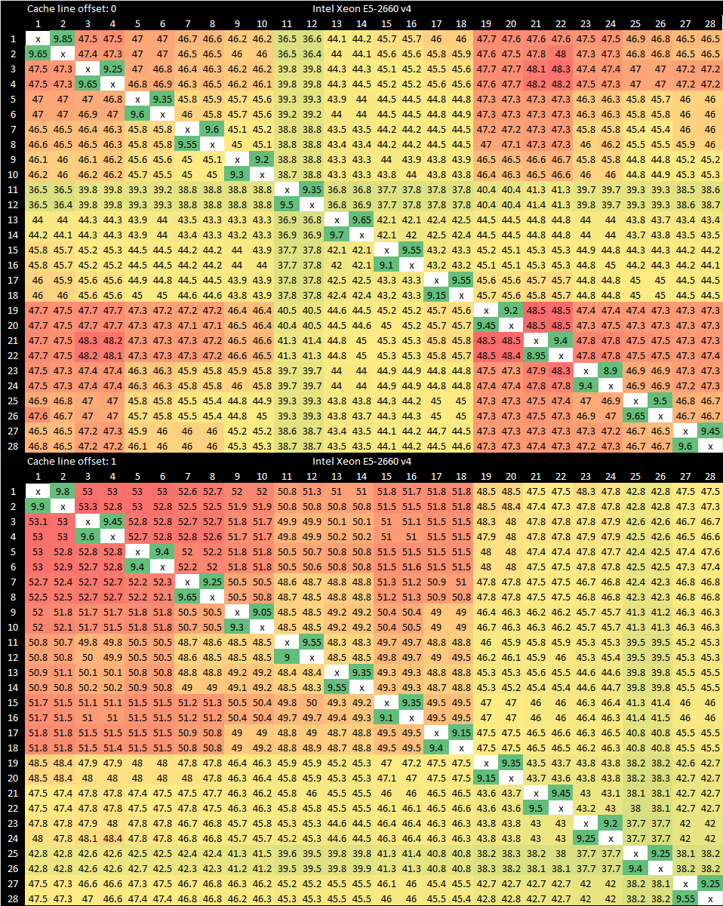

*图 10：同一硬件、不同地址即可改变结果。Dual Ring 的延迟与 Skylake Mesh近似，Best-case 更好、Worst-case 相当。*

Cluster-on-die 把每 Ring 变成 Private L3+Memory Controller NUMA Node。

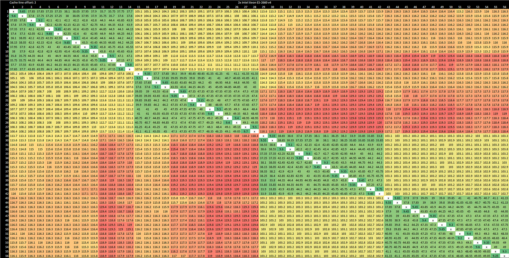

*图 11：同 Cluster <50 ns，同 Socket跨 Cluster略超100 ns，跨 Socket只再多一点，说明主要成本在 Home Agent/Directory，而非物理 Socket Link。*

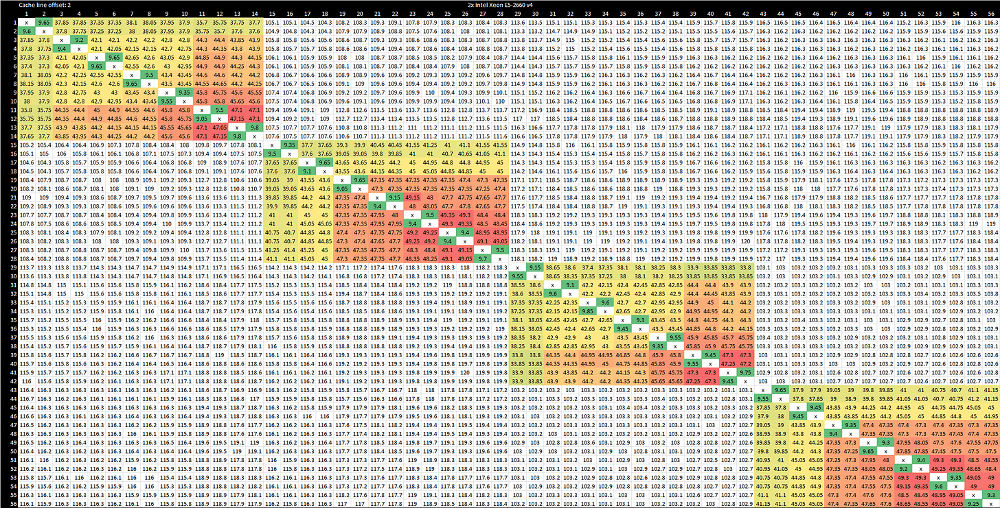

*图 12：两个 Cluster 的 Address→Slice 和 Core Number Pattern 近似相同。*

## Sandy Bridge、Westmere 与 Dunnington

Sandy Bridge 每 Chip 最多八核 Ring，QPI 多路。

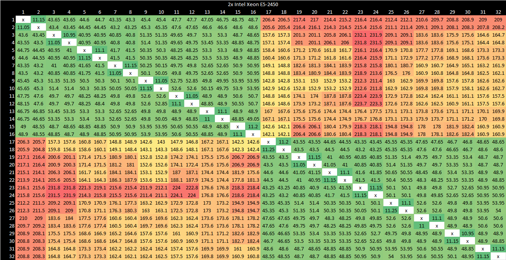

*图 13：跨 Socket 142～232 ns，比 Nehalem 退步，但单 Socket 在更多核心下仍低。*

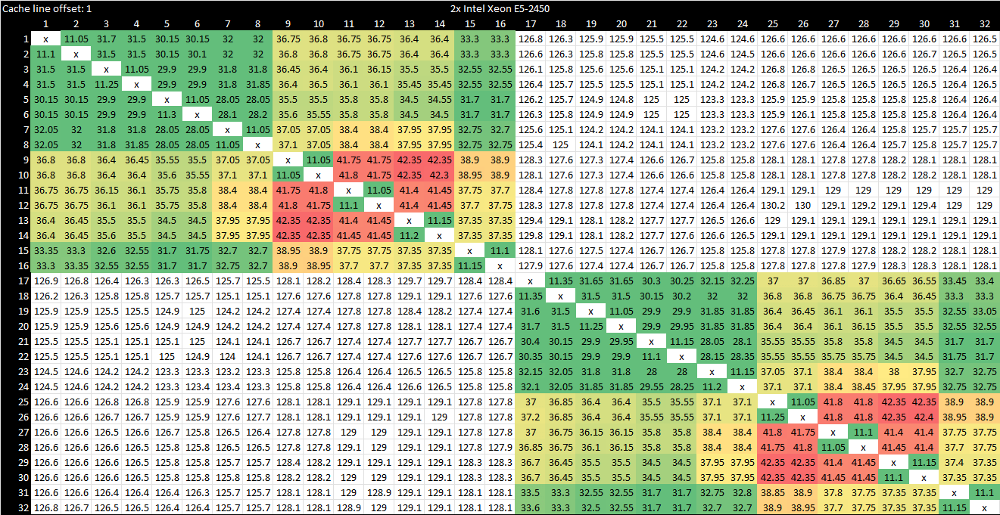

*图 14：两 Socket 的 Address→L3 Slice Mapping 保持一致。*

Westmere 是32 nm Nehalem：用中央 Global Queue Crossbar 取代 FSB，QPI 点对点负责跨 Socket。

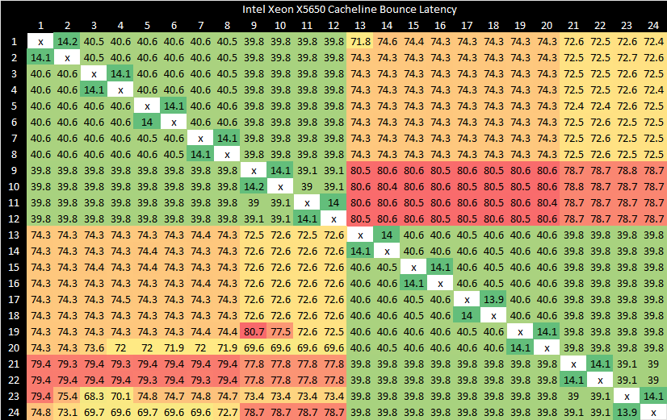

*图 15：跨 Socket 很快，甚至接近 Sapphire Rapids Socket 内 Worst-case；中央化简单路径有利延迟，但扩展性有限。*

Dunnington 是三组双核 Penryn+共享L3，通过 Northbridge 暴露四条 FSB做四路；L3 Core-valid Bit 先做 Socket 内 Coherence，Northbridge Probe Filter 避免全局 Broadcast，但同组共享 L2 没 Probe Filter。

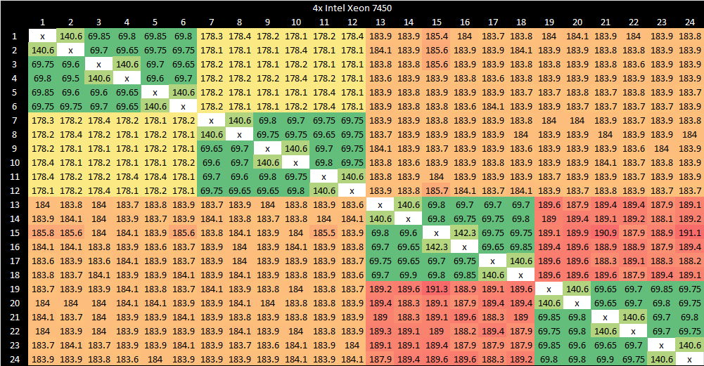

*图 16：把 FSB 推到极限，延迟高、带宽低；随后 QPI 是巨大进步。*

## AMD Magny-Cours 与 Abu Dhabi

Opteron 6180 每 Die 六颗 K10，两 Die/Package；SRI 连接 Core/L3，XBAR 连 Memory Controller/HT。双 Socket 共四 NUMA Node。

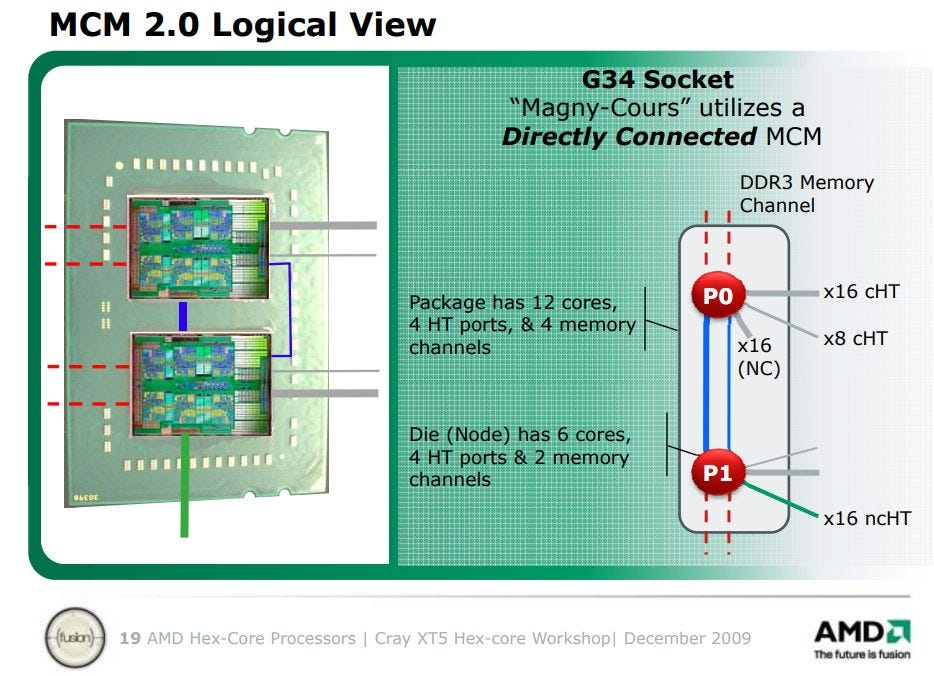

*图 17：来自 AMD 2009 Workshop Slide。*

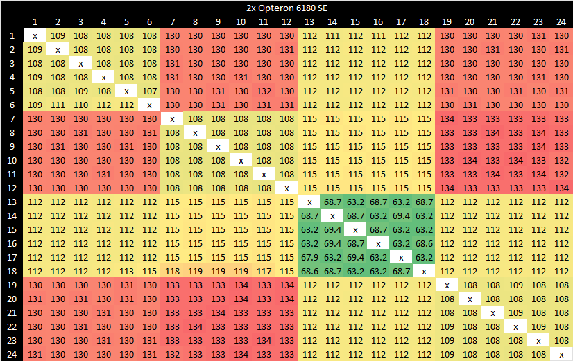

*图 18：Line Home 决定是否绕远，跨 Socket 必须到 Owner Socket Round-trip。数据由 Cha0s 提供。*

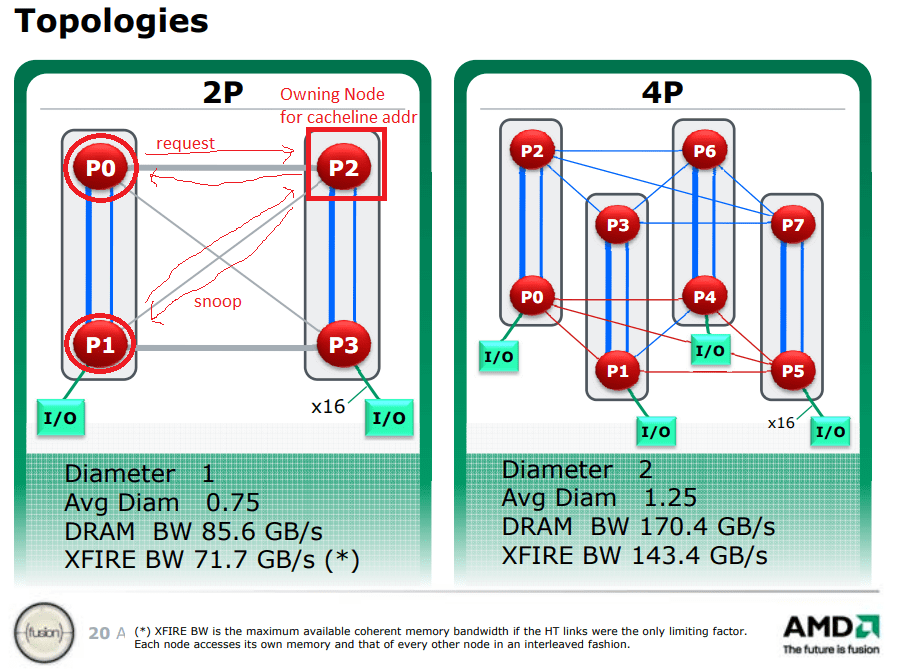

*图 19：可能先跨 Socket 到 Home，再跨回 Owner，穿越两次；这是作者的路径印象，不是协议 Trace。仍优于同核心数 Dunnington，但当时 Intel 已有 Nehalem/QPI。*

Piledriver Server（Abu Dhabi）每 Module 两线程共享 L2/Frontend/FPU，各自私有 Integer/LSU；每 Package 两个 8-thread/4-module Die，HT 跨 Socket。

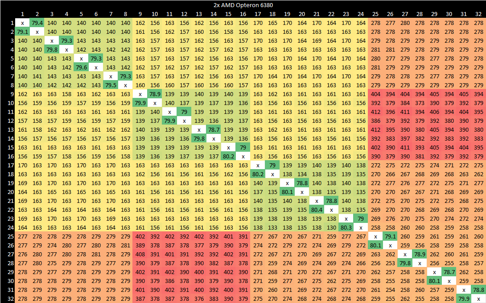

*图 20：Sibling 尚可，跨 Module 慢，跨 Socket再加；第二 Socket 某一 Die 尤其远。数据由0xcats提供。*

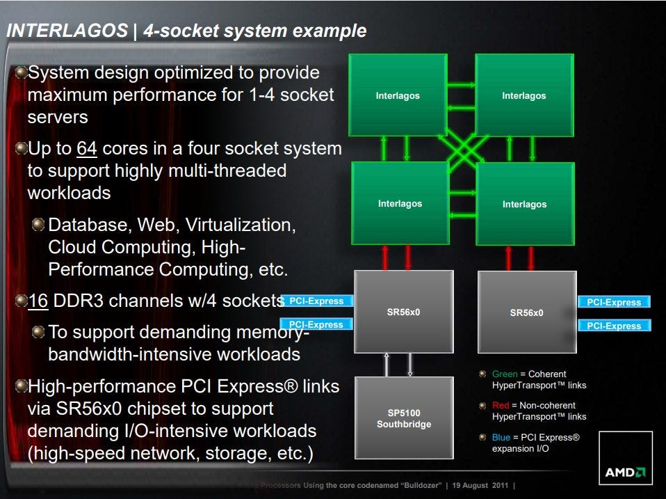

*图 21：Piledriver Server 应近似该 Hot Chips 图。*

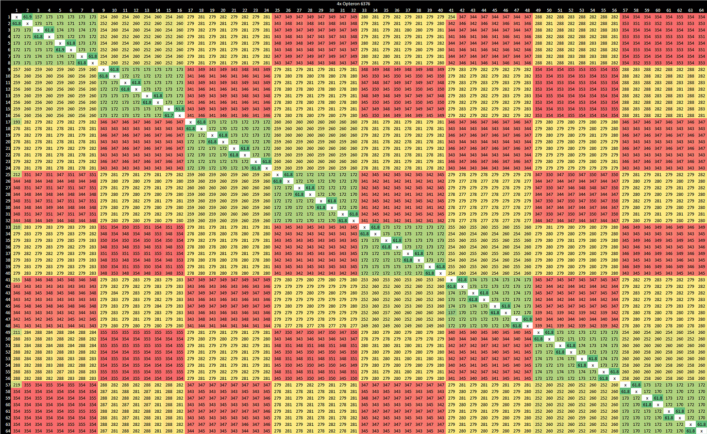

*图 22：同 Die Pattern重复，同 Socket Die 编号相邻；最坏近350 ns，可能经 Sibling Die中转。这里“Core”沿产品线程/模块命名口径。*

## IBM POWER8/POWER9：Cloud Mapping 让结果难解释

POWER8 E880 每 Chip 6～12 Core、每 Core 8-way SMT，还可跨 Server Node Coherent。IBM Cloud 很贵且 Instance Mapping 不透明，数据原样给出。

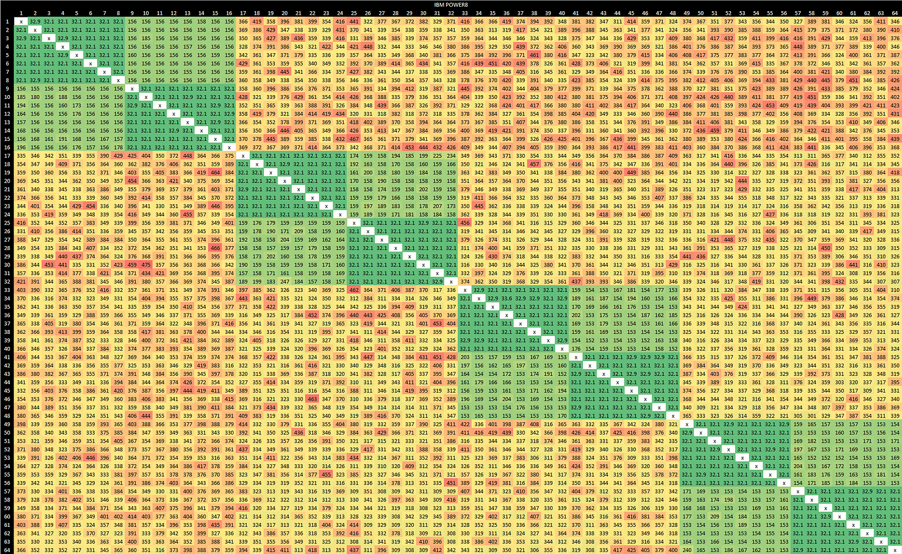

*图 23：同 Core SMT 快；Core 像按 Pair 组织，Pair 内约150～200 ns，跨 Pair 300～400 ns，可能已经跨 Node。*

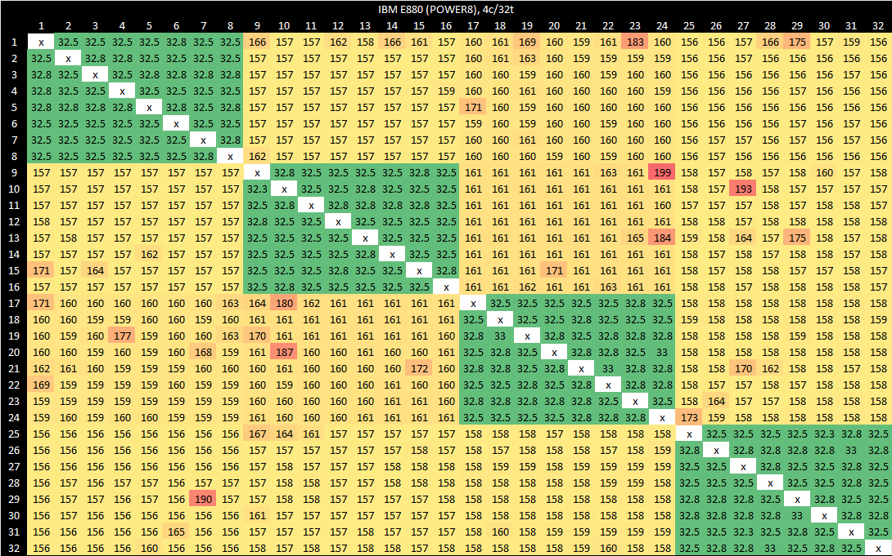

*图 24：不再见 Pair，全部低于200 ns；支持 Cloud Placement 影响，而非芯片固定数值。*

POWER9 可看成一颗8-way SMT Core，或两颗4-way共享10 MB L2的 Core，License 口径不同。

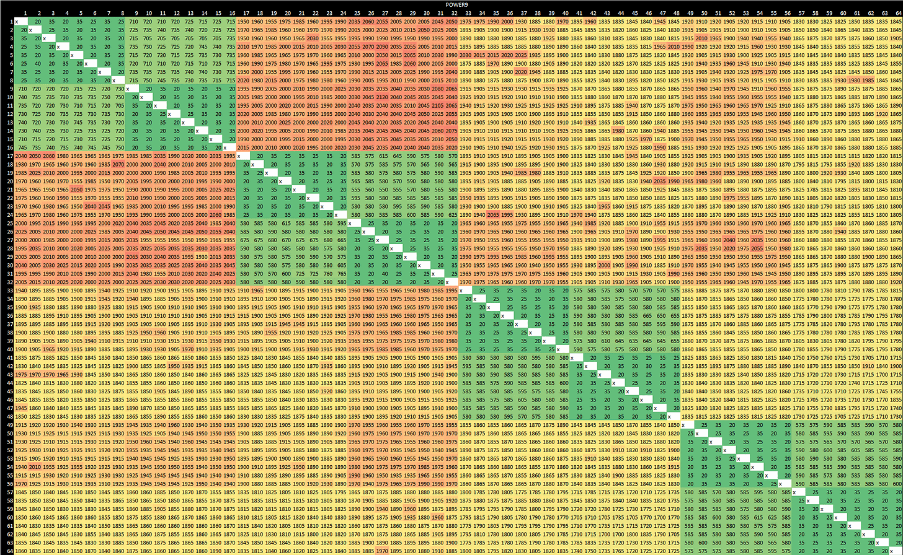

*图 25：同 Core快，Pair 内500～800 ns，Pair间进入微秒；底层未知，文章怀疑跨 Node，不能当作裸芯片延迟。*

## UltraSPARC T1、ThunderX 与 eMAG

Niagara/T1 八核 Crossbar、每核4-way SMT，用 Thread-level Parallelism 隐藏 L2/DRAM而非 OoO。

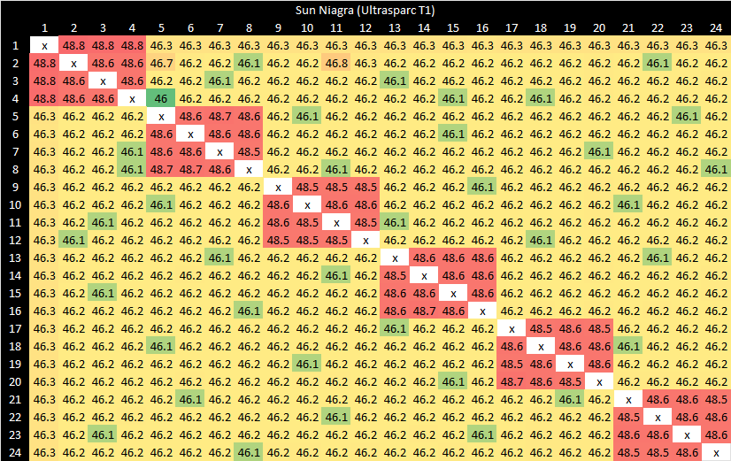

*图 26：约46 ns且均匀；奇怪的是同 Core SMT Sibling 稍慢于跨 Core。*

ThunderX CN8890 每 Socket 48 Core并支持双路。

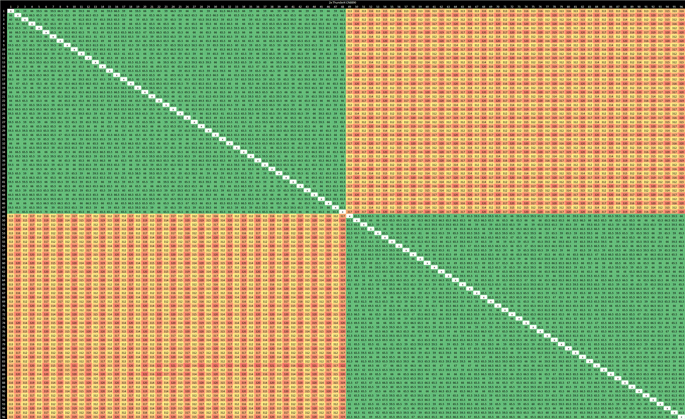

*图 27：Socket 内平均64 ns，跨 Socket平均315 ns。*

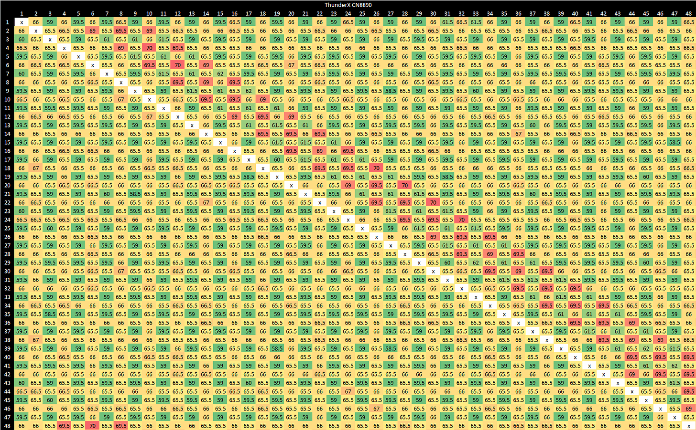

*图 28：整体一致却有未解释 Pattern，保留未知。*

Ampere eMAG 8180 是 Altra 前的32核 Workstation，Core 成 Pair。

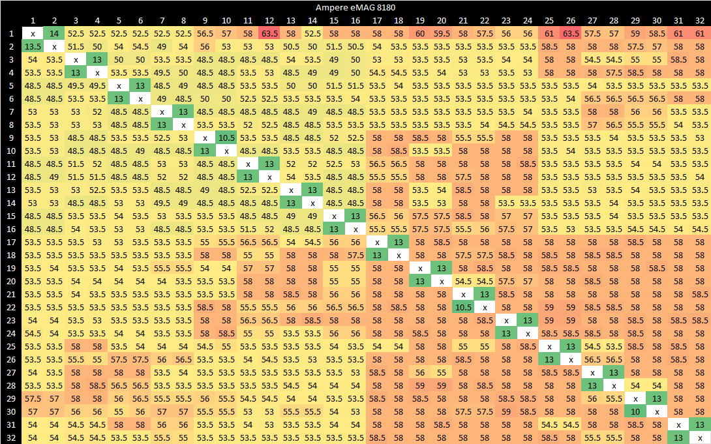

*图 29：Pair 内极低，其他位置符合普通 Mesh 平均延迟。*

## Knights Landing 与原始 Pentium

Knights Landing 最多72颗 Silvermont-derived 小核，每核4-way SMT，却配2×512-bit FMA和大 Mesh；Xeon Phi 7210启用64核。

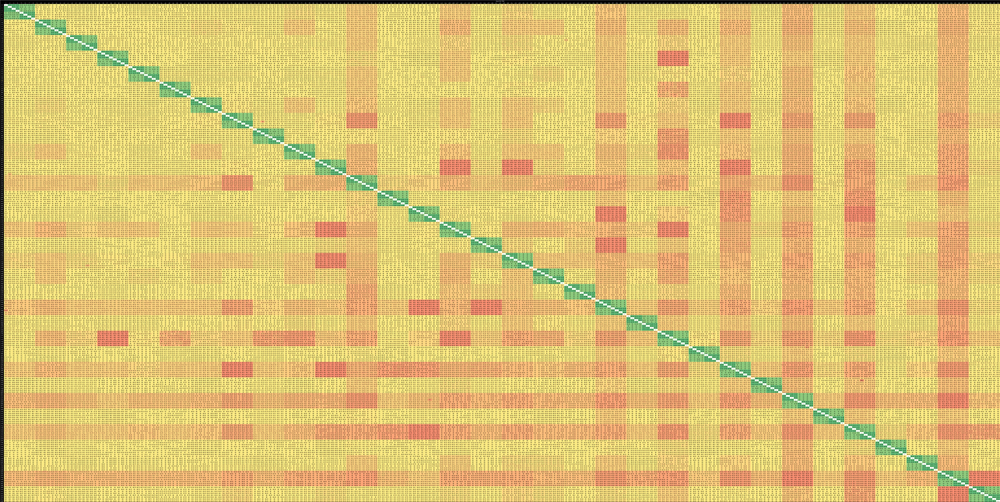

*图 30：256 Thread 让矩阵巨大，Mesh/Tile/SMT 分块可见。*

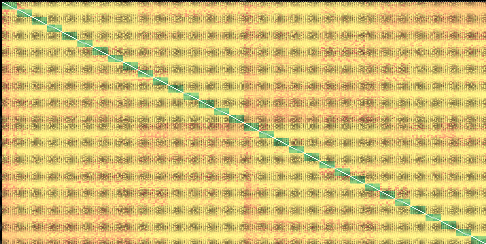

*图 31：Sub-NUMA Clustering 把 Die 分四 Quadrant，Locality 边界更显式。*

最早 Pentium 双路是两颗单核共享 FSB和430NX Chipset，各 CPU Snoop Peer Transaction保持 Coherence。

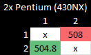

*图 32：0xcats 贡献。507.9 ns 看似巨大，120 MHz 下只有约61周期；若 CPU/FSB 都等比例到3 GHz，约20 ns。这个换算只是展示周期尺度，现实 FSB 不会无成本线性提频。*

## 结语：核心数越多，平均值越不够

多核不是复制 Core：Directory、Home Agent、Snoop Filter、Ring/Mesh/EMIB/QPI/HT 与 NUMA 都决定同步路径。高核数通常分层处理 Coherence，每层 Agent 只负责 Physical Address 的一部分；请求离 Responsible Agent 越远，延迟越高。规模上升使 Worst-case 与 Variation 一起增加。

这些矩阵最适合发现拓扑和验证 Thread/Memory Placement。不能由单次 Atomic Ping-pong 直接预测 Database、Rendering 或 HPC 总性能；真正应用还要统计 Shared-line 频率、Lock Contention、False Sharing 和 Remote NUMA Traffic。

## 参考资料

- Chester Lam, *Core to Core Latency Data on Large Systems*, Chips and Cheese, 2023-11-07
- AnandTech Core-to-core Latency 方法（概念对照）
- 各代 Intel、AMD、Arm、IBM、Sun/Cavium/Ampere 公开互连资料
