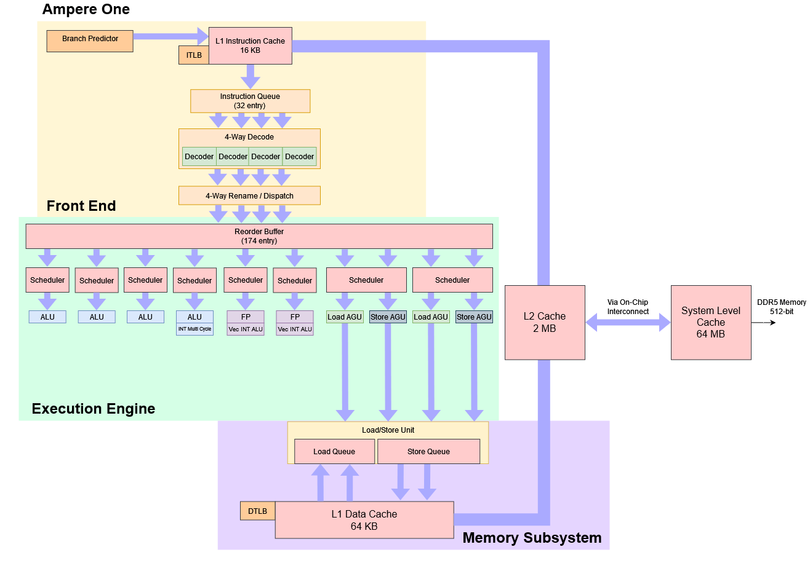
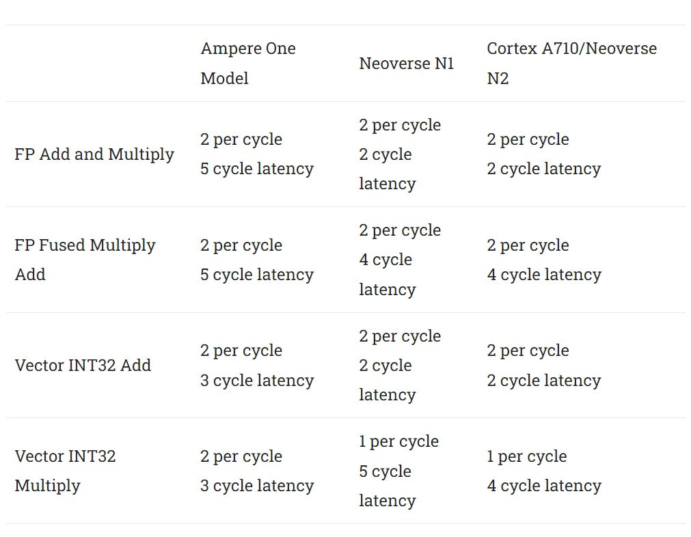
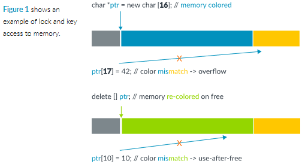
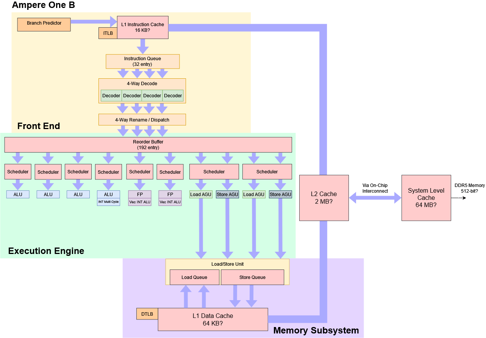
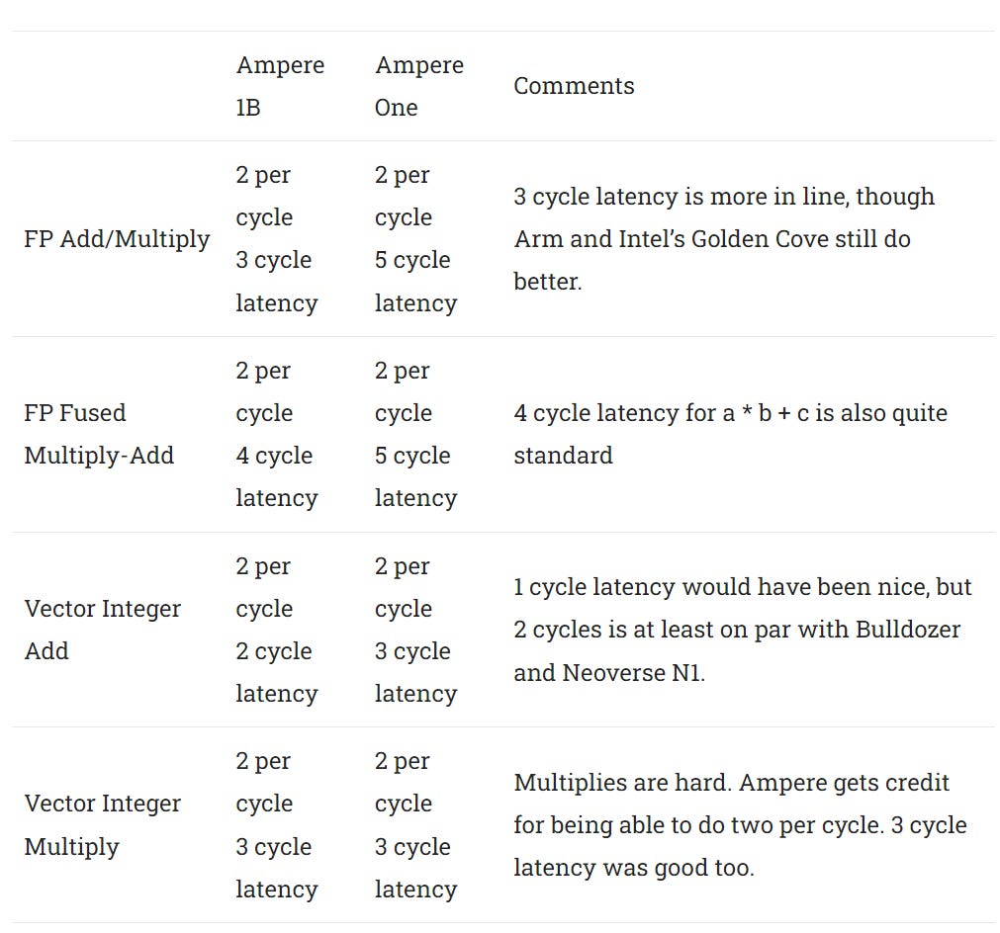
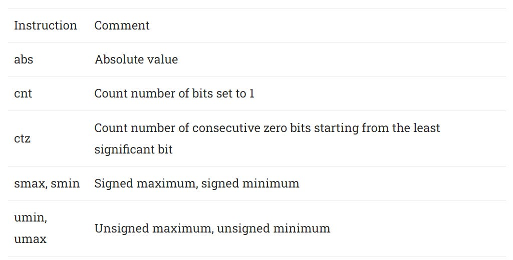
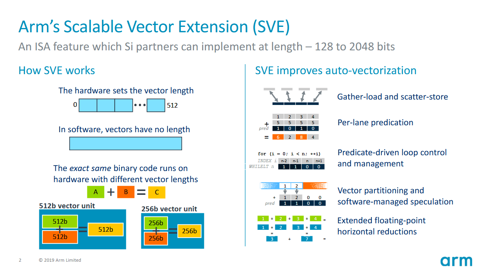
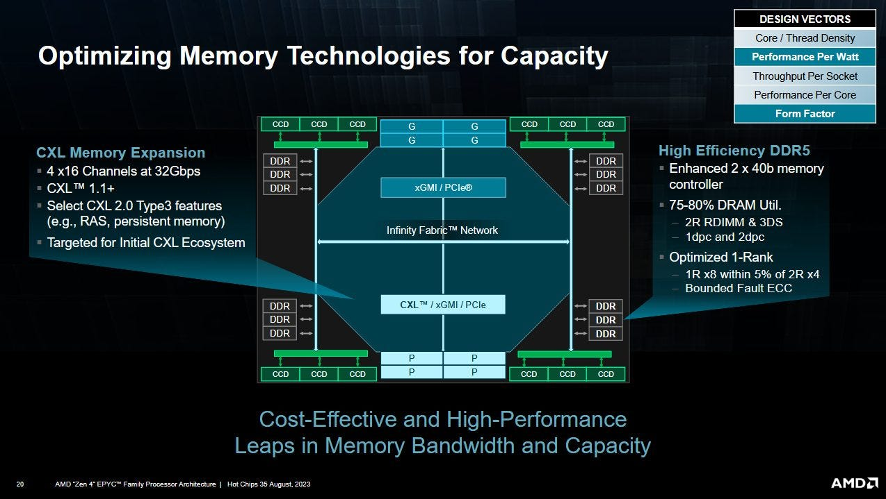

# 从 LLVM 提交看 AmpereOne 1A 与 1B

> 英文标题：LLVM’s Ampere1B Commit
> 撰文：Chester Lam
> 首发：Chips and Cheese，2024 年 2 月 20 日
> 链接：https://chipsandcheese.com/p/llvms-ampere1b-commit

Ampere Altra 使用 Arm Neoverse N1，快速进入 Oracle、Google 和 Microsoft 云；AmpereOne 则转向自研核心，以免核心授权费，并只针对云服务器而不兼顾手机。Google C3A 在文章发布时仍未普遍可用，但 LLVM 已加入 Ampere 1A、1B 的调度模型，为观察演进方向提供了窗口。

LLVM Model 会指导指令选择和排程，却不必与真实硬件一一对应；开发者也可能故意设置与硬件不同的代价来获得更好代码。因此下文是“编译器模型支持的判断”，不是 Die、RTL 或实测确认。

## 基础 AmpereOne：密度优先

模型中的 AmpereOne 是四宽 Armv8.6-A 核心，误预测代价 10 周期，目标频率约 3 GHz。

相对 Neoverse N1，它有更多标量整数 ALU、更强的数据侧访存和更大重排容量，并偏好相邻 Compare+Branch 以做融合。分支融合在 x86 和新 Arm 核心上已经很常见。

FP/Vector 只有两个端口且不支持 SVE，延迟也偏高，反映 Ampere 以较小 FPU 换取核心面积。

常用 FP 约五周期，接近 Bulldozer；Vector Integer Add 等约三周期，而现代 x86 常可一周期。两个内存 Scheduler 各能每拍发一个 Load 与一个 Store；若 L1D 真能服务四请求，某些 memcpy/read-modify-write 会受益。向量上限仍是 2×128 bit Load、1×128 bit Store，因为虽有两个 Store AGU，却只有一个 FP Store Pipe。L1D Load-to-use 四周期。

总体上，AmpereOne 强调标量整数，牺牲 L1I 容量和 FP/Vector。它用四条整数 ALU、较强标量访存和比 N1 更大的重排资源，把一颗芯片扩到 192 核。全配芯片有 384 MB L2 加 64 MB System Level Cache；若各核私有工作集，448 MB 总末级容量接近 96 核 Genoa 的 96 MB L2+384 MB L3。

### 体系结构视角：编译器模型是一份“优化契约”

Latency/Throughput 值的直接作用，是告诉 Scheduler 一条消费者应离生产者多远、同类操作多久发一次。它很适合反推设计重点，却无法给出 Queue 容量、Cache Bank、真实端口冲突或动态降频。最终仍需依赖链、独立指令流和 PMU 对照验证。

## Ampere 1A：融合与 ISA 小修

1A 不单独建立调度模型，主要增加一项融合和扩展支持。

`FeatureFuseAddSub2RegAndConstOne` 表示它可把 Register-to-register Add/Sub 与紧随的 ±1 立即数操作融合，即 `(a+b+1)` 或 `(a-b-1)` 只占一个内部操作。编译器应让第二条紧邻第一条。它类似 Golden Cove 在 Rename 消除小立即数加法的思路，但范围只覆盖 1。

1A 还加入中国标准 SM3 Hash 与 SM4 Block Cipher 的加速指令，意义类似 AES/SHA 指令；若市场要求这些算法，硬件支持会明显提高适配性。

Arm Memory Tagging Extension（MTE）利用 64 bit Pointer 中当前地址空间未使用的高位存 Tag，硬件对 Pointer 与 Memory Tag，不匹配时 Fault，可检测 Use-after-free 等细粒度错误。

LLVM 把带 Pointer Authentication 的 Load（LDRAA）建模为两条微操作、11 周期：一条走 Load Pipe，一条走整数多周期 Pipe。因为后者只有一条，吞吐最多一条/cycle；普通 Load 仅四周期。Cortex-A710 的同类操作也约九周期、一条/cycle。产品资料似乎称基础 AmpereOne 支持 Memory Tagging，但 LLVM 只在 1A/1B 目标生成 MTE 代码，这一资料差异应保留。

## Ampere 1B：可视为一次中期换代

1B 的重排容量增加到 192 微操作，多类延迟下降，ISA 从 Armv8.6-A 到 Armv8.7-A，并额外引入 Armv8.9-A 的 Common Short Sequence Compression（CSSC）。高层方框图变化不大，误预测仍为 10 周期。

FP/Vector 延迟大幅改善，更符合近期核心水平。

它们仍非顶尖，但修复了基础型号最明显的短板。L1D Load 从四周期降到三周期；对于低于 4 GHz 的核心，较短流水可部分补偿频率劣势。带 Pointer Authentication 的 Load 仍需八周期，但已低于 1A 的 11。

CSSC 给标量整数侧加入绝对值等短序列对应操作；NEON 原本可以完成部分功能，却要把标量搬进 Vector Register。文章不确定 “Compression” 是压缩指令序列，还是面向压缩算法，倾向前者。

代码生成还启用两个看似相反、实则配套的选项：尽可能用 Conditional Select，但若分支可预测，则认为 Select 更昂贵。条件选择能消灭难预测分支；可预测分支则允许后续路径提前投机执行，而 10 周期恢复也不算长。因此对现代准确预测器，保留好分支通常优于无条件拉长数据依赖链。

1B 因而不仅是 ISA 小改：192 项重排、更快 FP/Vector、三周期 Load 和扩展支持叠加，应带来可见 IPC 提升，称作 AmpereOne “1.5 代”也合理。

## SVE 的生态困境

Ampere 继续不支持 Scalable Vector Extension（SVE）。SVE 有 Mask，向量宽度可扩到 2048 bit，是 AArch64 的现代化方向。

Arm 把 SVE 纳入 Armv9，并让包括 Cortex-A510 在内的移动核支持，试图通过换机周期形成装机量。但 Ampere 是 Arm Server 的重要力量，Qualcomm 也没有在部分使用 SVE-capable Arm 核的 SoC 上启用它。于是开发者仍会长期以 NEON/ASIMD 为公共基线，形成典型的扩展“鸡生蛋”问题。

## 192 核的系统经济账

更弱但更多的核心受 Amdahl 定律、线程并行度和内存带宽制约。AmpereOne 只有八通道 DDR5，而 96/128 核 Genoa/Bergamo 使用 12 通道，且 Zen 4 每核 Cache 更多。

云端按 Core 切 VM 能缓和问题：核心多就能承载更多客户，前提是单核够快。但每个 VM 都需要独立 OS 和内存。按 Google T2A 的 4 GB/Core 基线，192 核需 768 GB；1DPC 要 128 GB DIMM，文中当时价格约每条 1300 美元，六条约 7800 美元，平衡带宽配置约 10400 美元，接近一颗 128 核 Bergamo 的价格。96 核 Genoa 只需 384 GB，可用便宜得多的 64 GB DIMM。

密度还集中故障域：六台服务器缩成四台后，宕掉一台损失 25% 而非 16.6%。网卡、主板和电源冗余也随服务器数减少。因此“每颗芯片核心更多”不自动等于机架总成本更低。

## 当时尚未回答的产品问题

Google 2023 年 8 月宣布 C3A，但截至 2024 年 2 月仍未 GA，而同期 C3D Genoa 两个月即上线。C3A 又限制到 80 vCPU，远低于 C3D 的 360 和 N2D Milan 的 224。原因可能是 Google 未采购 192 核顶配，或 VM 跨 Socket 有限制；文章没有证据确定。

LLVM 提交揭示的是策略：Ampere 用较小乱序窗口和轻量 FP/Vector 换密度，1B 再修复明显延迟短板。它能否复制 Altra 的成功，最终取决于芯片、云平台上线、内存成本和实际工作负载，而不是调度模型本身。

## 参考资料

- LLVM AmpereOne/Ampere1A/Ampere1B 调度模型提交
- Ampere Computing 产品资料
- Chips and Cheese：LLVM’s Ampere1B Commit
