# 用性能计数器预览龙芯 3A5000：IPC、分支与 Cache

> **文章来源**
>
> - 文章：*Previewing China’s Loongson 3A5000 with Performance Counters*
> - 撰文：Chester Lam
> - 首发：Chips and Cheese
> - 发布：2023 年 1 月 29 日
> - 链接：https://chipsandcheese.com/p/previewing-chinas-loongson-3a5000-with-performance-counters

龙芯 3A5000 集成四颗 2.5 GHz LA464，面向桌面、服务器与嵌入式。它从 MIPS64 转到语义相近、编码不兼容的 LoongArch，并加入 256-bit LSX/LASX。本文不是全面 Review，只运行 7-Zip 与 libx264，再用有限 PMU 观察架构；综合跑分可参考 Phoronix。

对照包括 Ryzen 7 1800X（Zen 1，双通道 DDR4-2400，由 Titanic 提供）和 Oracle Cloud 免费四核 Ampere Altra（Neoverse N1）。跨 ISA、云实例与本地平台的绝对值不能当作严格产品排名，重点是同一工作量的 Instruction Count、IPC、Branch 和 Cache 行为。

## 高层性能：同频尚可，2.5 GHz 拖住结果

7-Zip 不用内置 Benchmark，而压缩一个由 Firefox Compilation Profile 生成的大文件；指定 16 Threads、限制四核。因 Thread 数不同，结果不能与站内旧数据直接比。指令流几乎全是 Scalar Integer。

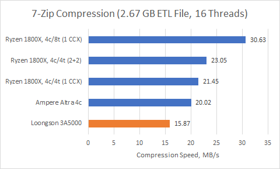

*图 1：3A5000 绝对性能不及 Zen 1；若 Zen 1 每核只开一条 SMT，龙芯 Performance/Clock 有竞争力。绝对结果更接近四核 Altra，却仍明显落后，主因是 2.5 GHz。*

libx264 用 `veryslow` 转码短 Overwatch 片段，依赖手写 SIMD；普通 C 代码通常会慢一个数量级。龙芯分发版通过 Intrinsics 使用 LSX/LASX。

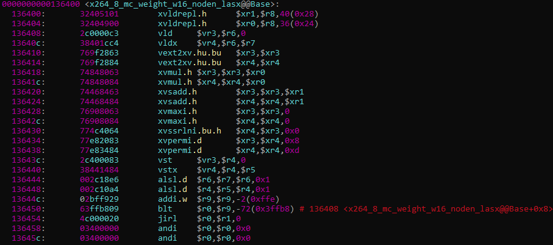

*图 2：反汇编中的 `xr` 为 256-bit LASX；网页把 `vr` 写为 256-bit LSX，但 LSX 实际是 128-bit，保留材料文字差异并以 ISA 定义为准。*

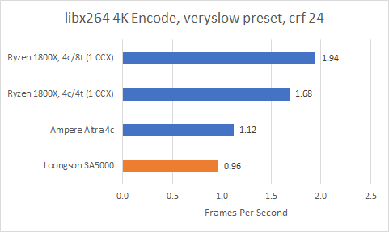

*图 3：3A5000 落后 Zen 1，也未追上只有 128-bit NEON 的四核 N1。Zen 1 的 256-bit AVX2 拆成两个 Uop，N1 Vector 并不强，因此结果说明 LASX 宽度本身不足以保证吞吐。*

## Retired Instructions 与 IPC：跨 ISA 必须两项一起看

Retirement 是乱序核心按序提交结果的时刻。若同一任务需要明显更多指令，ISA 与 Compiler Codegen 可能参与。

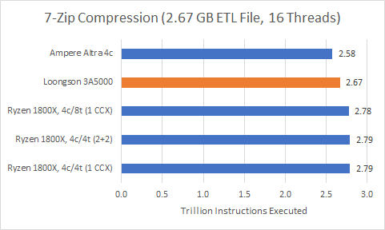

*图 4：差异低于 5%，没有一方因 ISA 多执行大量工作。*

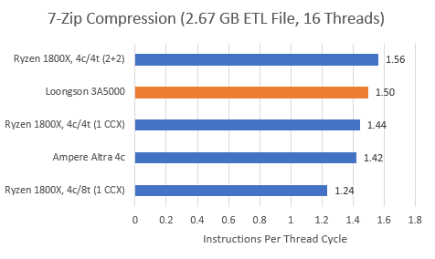

*图 5：3A5000 IPC 不错，因此该负载的 Performance/Clock 也接近；最终仍被低频限制。*

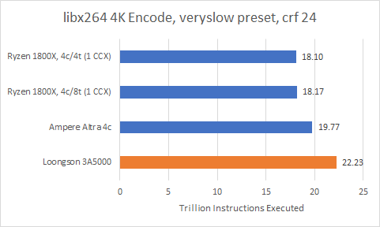

*图 6：即使启用 LASX，3A5000 多执行约 12%～23%。可能缺少 NEON/AVX2 的某些 Specialized Instruction，也可能是 Compiler/Library 实现；当时没有完整 LSX/LASX 列表，不能确定。*

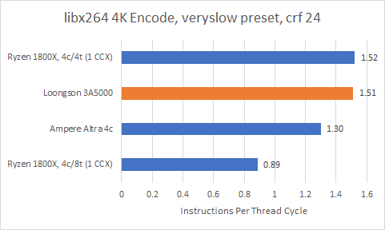

*图 7：IPC 仍体面，但多出的指令让实际 Performance/Clock 低于 Zen。*

### 体系结构视角：IPC 不是跨 ISA 的单位工作性能

`时间≈指令数×CPI/频率`。一颗核心可用很多简单指令得到高 IPC，却未必更快；也可用宽 Vector/Fused Operation 让 IPC 降低而完成更多工作。跨 ISA 应同时记录 Retired Instruction、Uop、频率和 Wall Time，并核对库是否用了同等成熟的手写内核。

## 分支预测：Accuracy 接近，Branch Density 改变 MPKI

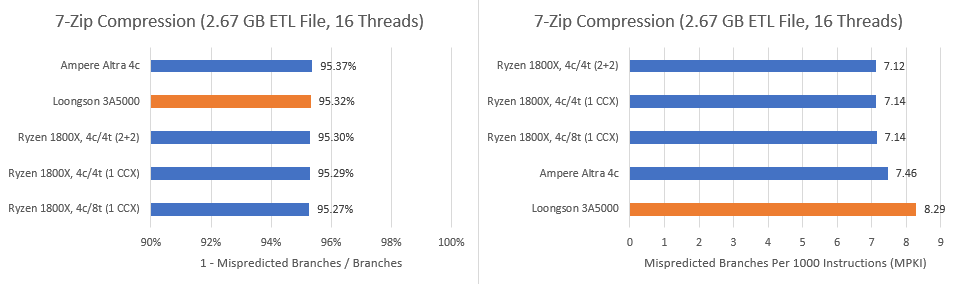

*图 8：三者准确率极接近，Zen 1 开 SMT 也只小幅下降。*

3A5000 的 Mispredict/Instruction 更高，因为 LoongArch 流中 17.7% 是 Branch，x86-64 为 15.1%、AArch64 为 16.1%。

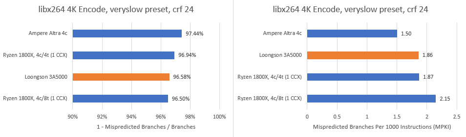

*图 9：3A5000 稍落后 N1/Zen 1；它 MPKI 看似接近 Zen 1，是因为完成任务总共执行更多非 Branch 指令。三者执行 Branch 总数差不到 10%，龙芯约 1.2 万亿，Zen 1 1.1 万亿，Altra 1.16 万亿。*

## 指令侧：64 KB L1I 足够，L2 Fetch 较弱

3A5000、N1、Zen 1 都有 64 KB L1I。7-Zip 热代码很小，Zen 1 甚至超过 85% Uop 来自 Op Cache。

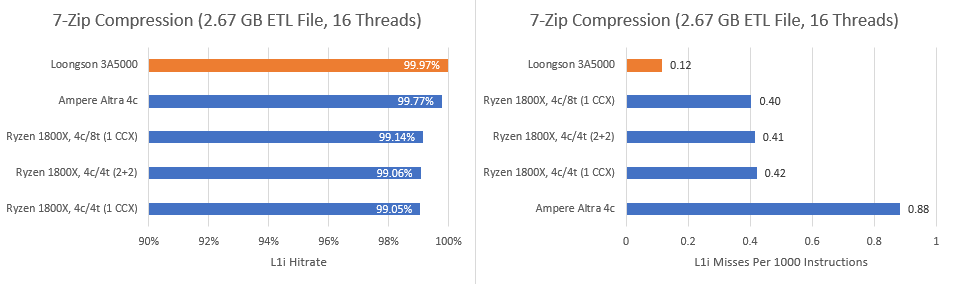

*图 10：三者都低于 1 MPKI，龙芯最低；此时 L2 Code Fetch 差异不重要。*

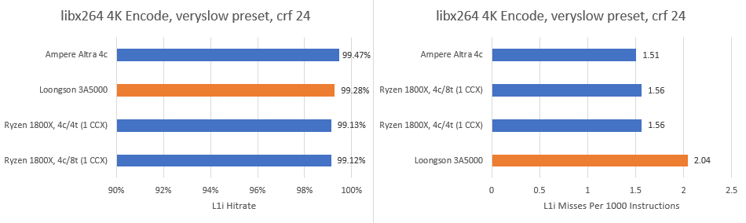

*图 11：工作集变大，龙芯接近 2 MPKI、相对更差，但仍不是极高值。*

## 数据侧：64 KB L1D 几何不错，实际命中却偏低

Zen 1 为 32 KB、8-way L1D；3A5000/N1 为 64 KB、4-way。7-Zip 中龙芯命中率明显低于两者，N1 同样几何却最好。可能是 Replacement Policy 不佳，也可能 Prefetch 太激进驱逐 Useful Line；没有 RTL/事件足以确认。

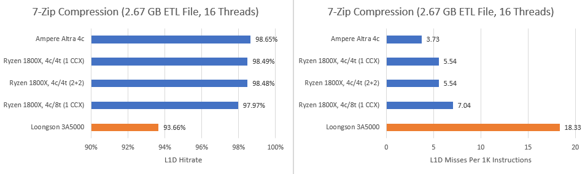

*图 12：Instruction Count 相近，按指令 miss 也呈同样结论。*

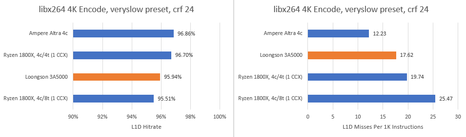

*图 13：龙芯略改善却仍未体现容量优势；按指令 miss 较少，部分只是因为它执行更多计算指令，Memory Operation 占比变低。*

## L2/L3：Hit Rate 高不一定是好消息

3A5000 每核 256 KB L2、全芯片 16 MB L3；Zen 1 每核 512 KB L2、四核 Cluster 8 MB L3；Altra 每核 1 MB L2，80 核共享 32 MB L3。Altra PMU 出现 L3 Refill 多于 Request 的“负命中率”，显然口径/事件有问题，因此不讨论其 L3。

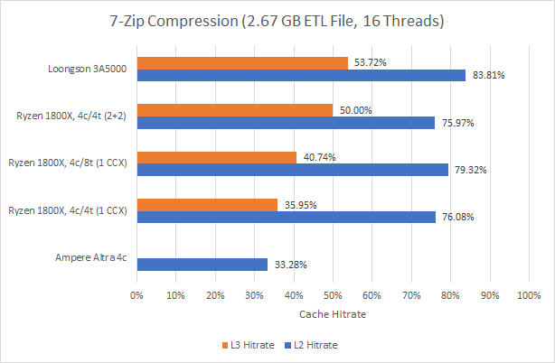

*图 14：龙芯 16 MB L3 命中不错，帮助同频表现；L2 Hit Rate 也高，却部分因为 L1D 制造了过多 miss。*

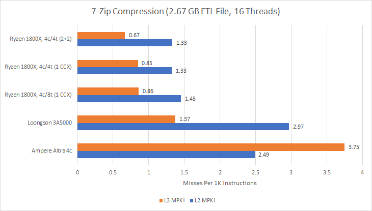

*图 15：256 KB L2 的 MPKI 仍高于 Zen 1 512 KB；龙芯 L3 miss 似乎更多，但 Zen 使用 L1D Demand Fill Event，龙芯用 Linux `LLC-load-misses`，后者是否包含 Prefetch 未文档化。*

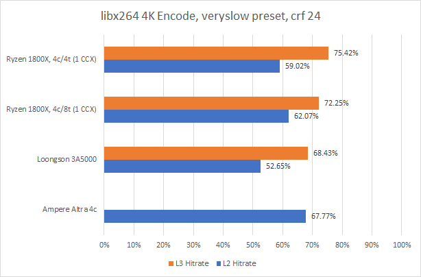

*图 16：更大 Data Footprint 让各级都下降；N1 大 L1D、Zen 1 大 L2分别提供缓冲。*

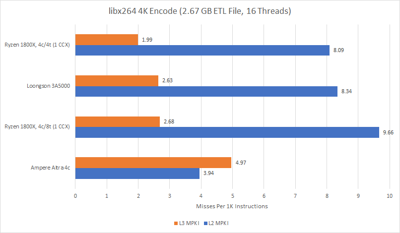

*图 17：龙芯按指令值看似好，绝对 L2 miss 却超过 2440 亿，Zen 1单线程约 1820 亿，Altra 1760 亿；L3差距较小，且事件定义未知。*

## 第一印象与方法边界

3A5000 比 Phytium D2000、Zhaoxin KX-6640MA 更平衡，大 Cache 支撑了 7-Zip，同频表现合理；但 2.5 GHz 让最终性能明显不足。初测还显示 ROB 接近 D2000、其他 OoO Buffer 更合理，完整结论需 Assembly Microbenchmark。

LoongArch64 当时只有这一颗可用测试 CPU，公开细节又少，Assembly 无法先在“已知核心”校验，测试错误概率更高。PMU 也未公开完整 Event，因此所有 Cache 口径都保留限制。软件生态同样是产品的一部分：MIPS 语义让早期移植可复用，但无法直接获得 x86/Arm 的成熟优化。

## 参考资料

- Chester Lam, *Previewing China’s Loongson 3A5000 with Performance Counters*, Chips and Cheese, 2023-01-29
- Phoronix 3A5000 综合测试（网页背景引用）
- Loongnix libx264 LSX/LASX Intrinsics 实现
