# 龙芯 3A5000：LA464 的实力、短板与追赶难题

> **文章来源**
>
> - 文章：*Loongson’s 3A5000: China’s Best Shot?*
> - 撰文：Chester Lam
> - 首发：Chips and Cheese
> - 发布：2023 年 4 月 9 日
> - 链接：https://chipsandcheese.com/p/loongsons-3a5000-chinas-best-shot

Chips and Cheese 此前分析过兆芯 KX-6000 的 x86 Lujiazui 与飞腾 D2000 的 Arm-compatible FTC663。龙芯路线更早：3A5000 的 LA464 可追溯到“十五”863 计划中的 GS464，长期由中科院计算所（ICT）推进，之后转入龙芯中科。它也从 MIPS 转向自有 LoongArch/LoongISA，希望覆盖 PC、Server 与 Embedded。

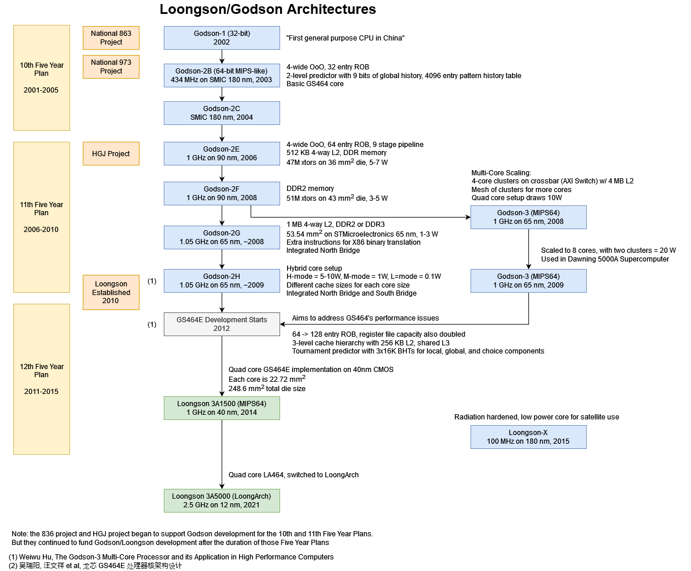

*图 1：核心路线跨多个五年计划与研发主体，LA464 不是突然出现的新设计。*

“十一五”高性能通用 CPU/DSP 目标与核高基项目推动 GS464 大幅扩容；团队人员在机构迁移后仍有延续。

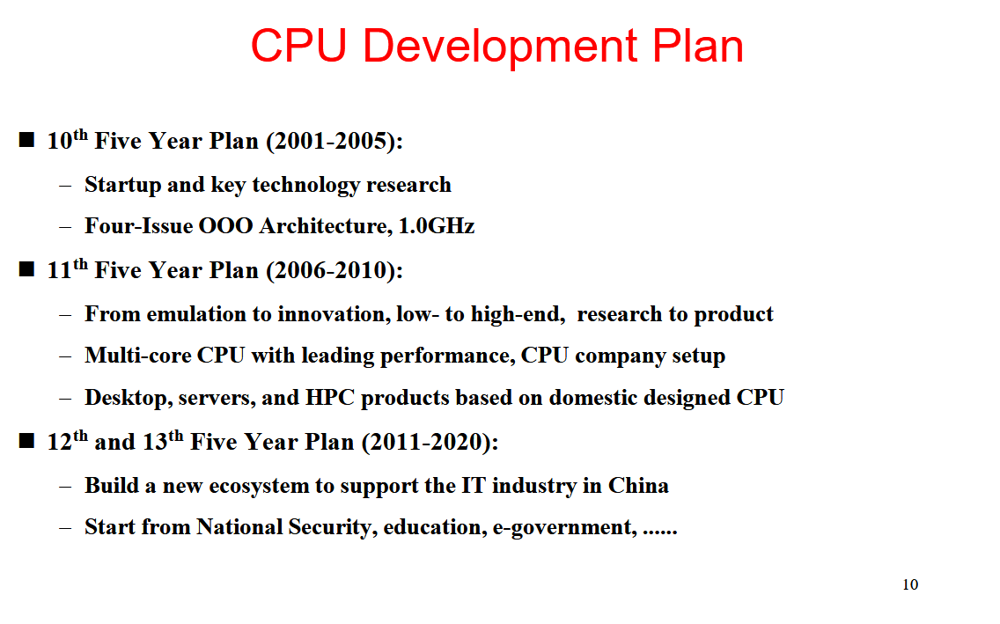

*图 2：正式图注注明来自 GS464V Presentation。后续 GS464E 借鉴 POWER7、Ivy Bridge、Cortex-A9 研究，看来构成 LA464 主要基础。*

这篇分析大量依赖手写 LoongArch64 Assembly。因为只有一颗 LoongArch64 CPU、公开细节少，无法像 x86/Arm 那样在已知核心上交叉验证；测试出错概率更高，所有反推都应保留不确定性。

## 总览：四宽乱序，现代与旧式选择并存

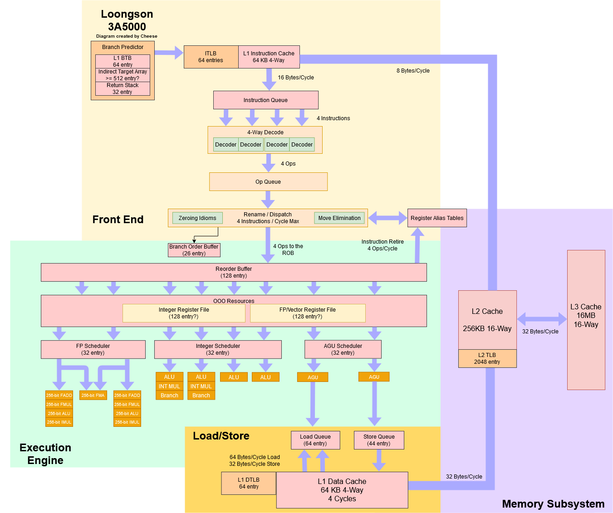

*图 3：LA464 是 4-wide OoO Core、128-entry ROB，有 PRF 和 256-bit Vector，但 Buffer 中等，部分设计保留早期 GS464E 痕迹。图为测试反推/资料汇总，不是 RTL。*

## Branch Prediction：方向尚可，目标供给明显落后

7-Zip Accuracy 能与 Zen 1/Ampere Altra 大致抗衡，libx264 略落后。GS464E 用 Tournament Predictor，由 Meta 在 Local/Global History 之间选择，三张表各 16384 Entry；LA464 可能类似。

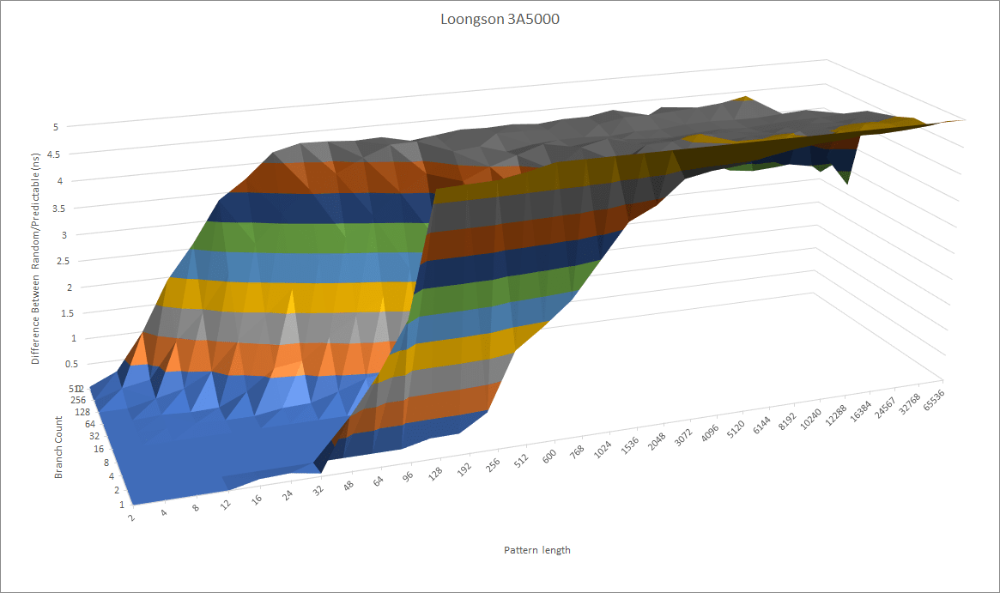

*图 4：长随机模式表现一般，远不及当时 Intel/AMD；TAGE/Perceptron 可用更少存储获得更强 Long-history Correlation。*

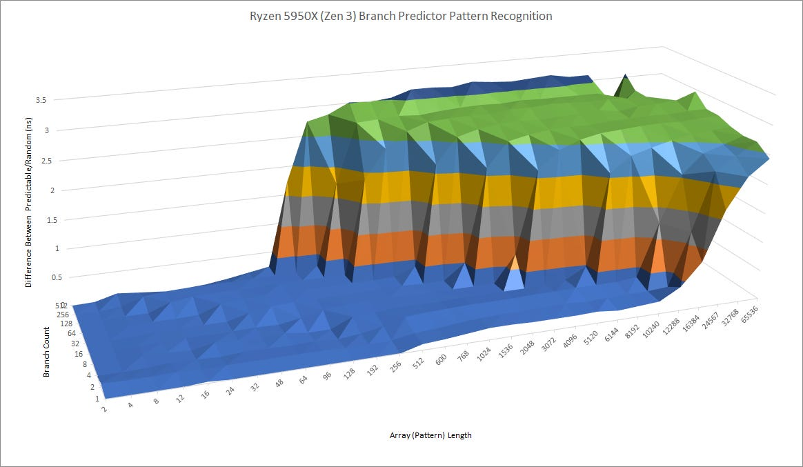

*图 5：128 ROB 时代的 Predictor 可能尚够用，但若继续扩大 Window，错误路径清空会吃掉更多收益。*

Fast Target 只有 64-entry BTB，命中 Taken 无 Bubble。

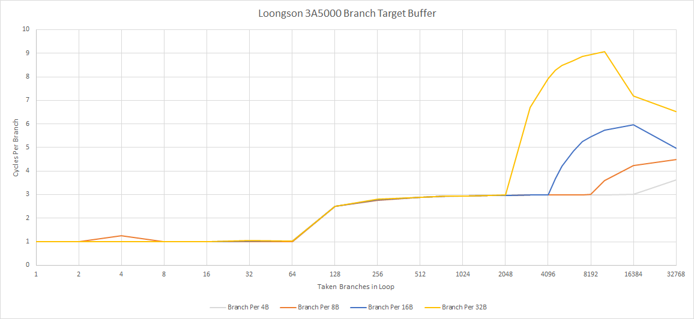

*图 6：Footprint 超 64 后，要等 Branch 从 L1I Fetch 再算 Target，Taken Latency 约等于 3-cycle L1I。*

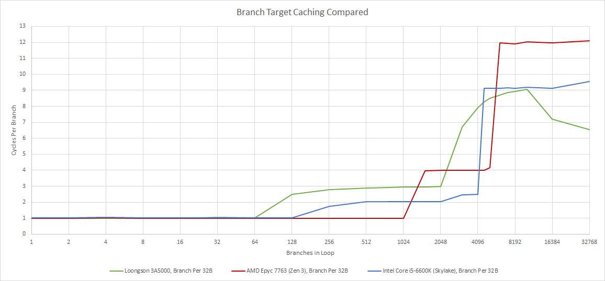

*图 7：现代 Intel/AMD 面对数千 Branch 仍约 1～2 cycle；2.5 GHz 下三拍的 Absolute Time 更高。省去 L2 BTB 节约 Area，却让 Predictor 不能在 L1I Miss 时继续驱动 Instruction Prefetch。*

Indirect：单 Branch 约 24 Target；总计约 512 Target（256 Branch×2）无显著 Penalty。

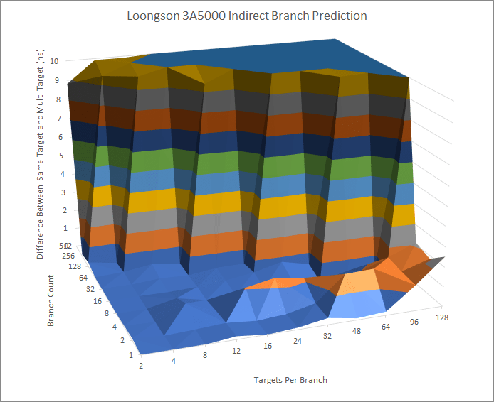

*图 8：对象方法调用等会受益，能力尚可。*

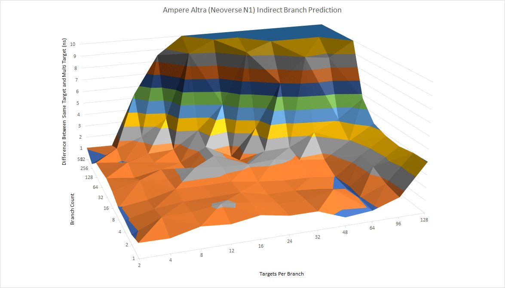

*图 9：Neoverse N1 同属温和性能目标，却接近 Zen 3/Golden Cove，LA464 仍明显落后。*

Return Stack 从 GS464E 16 增至 32。

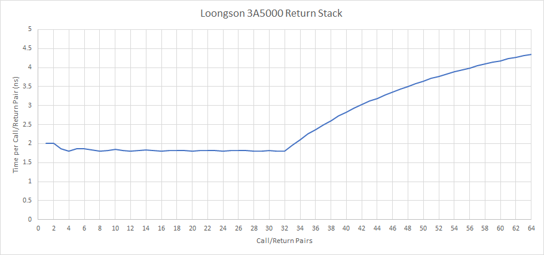

*图 10：多数调用足够；Zen 2 深度近似，实际 Return Accuracy 常超 99%。*

### 体系结构视角：前端短板是“不能提前走远”，不只是 MPKI

Direction 正确但 BTB Miss，Fetch 仍要等 Decode/L1I；L1I Miss 后又缺 Predictor-driven Prefetch。大 Code Footprint 会把 Target Supply 与 Instruction Supply 两个问题叠加，四宽 Backend 可能在没有 Mispredict 时也挨饿。

## Instruction Fetch 与 Rename

64 KB/4-way L1I 大于同时代 AMD/Intel 32 KB。

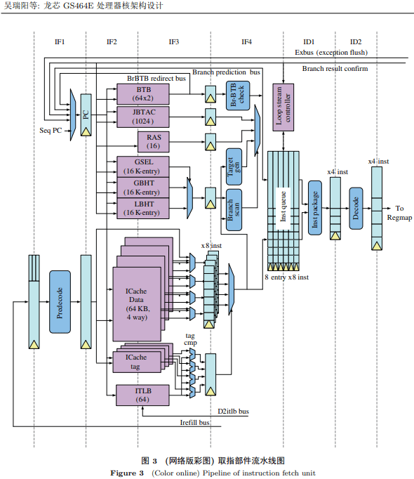

*图 11：正式图注说明 LA464 Fetch 可能相似；不是 LA464 官方图。大 L1I 很可能用来弥补 L2 后 Fetch 弱。*

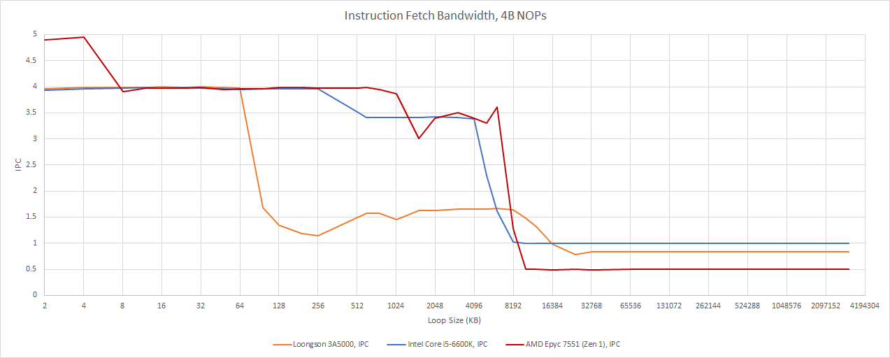

*图 12：Zen 1/Skylake 从 L2 仍可 4 IPC、L3 也强，LA464 大 Footprint 易受 Frontend Bandwidth 限制。奇怪的是 L2 Fetch 反而差于 L3。*

L2 是 Non-inclusive，不能自然当 Snoop Filter。一个候选解释是 Instruction-side L2 Hit 需 Probe L1D 保证 Self-modifying/JIT Code Coherence，而 L3 有独立 Directory 可绕过；这只是推测，不能写成确认协议。

Rename 未观察到 Move Elimination 或 Zeroing Idiom 等优化，只做常规 Register Renaming/Resource Allocation。

## OoO 与 Execution：相对 GS464E 大进步，和现代大核仍有代差

LA464 与 Neoverse N1 都约 128 ROB、RF 规模接近；N1 Scheduler 分布，LA464 更统一但总 Entry 少。相比 GS464E，ROB/RF 不变，Scheduler 扩大。

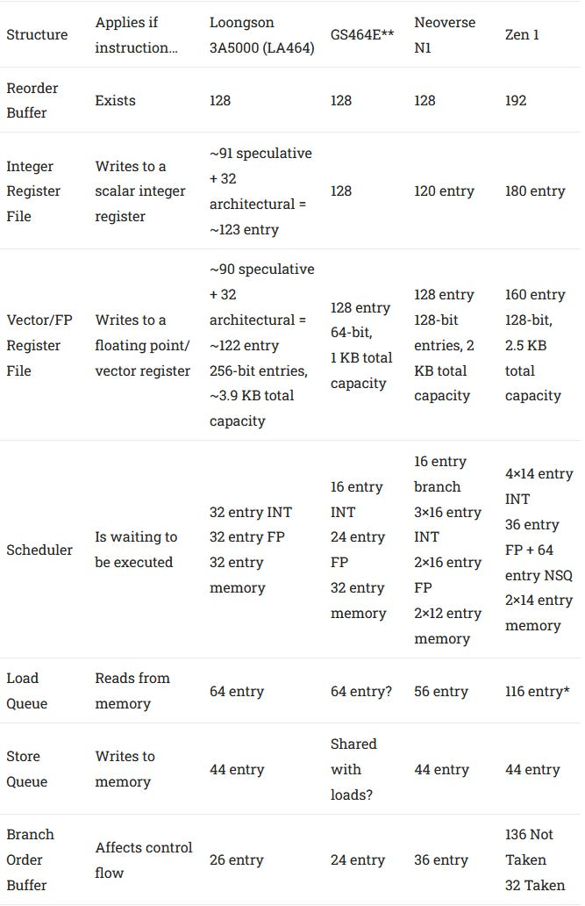

*图 13：正式图注提醒 Zen Manual 写 LQ 44 Entry，但核心可维持 116 Load，在对照中使用实测 116 保持口径。Resource Reclaim 也会影响拐点。*

四条 Integer ALU 是 GS464E 两条的翻倍。

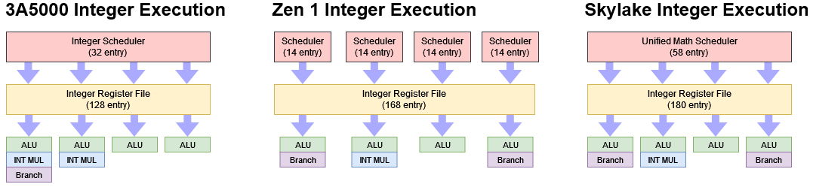

*图 14：四宽配四 ALU 更平衡，但每 Cycle 只能 Resolve 一 Branch；N1/Sandy Bridge 同级，现代 Intel/AMD 常可两条（通常至少一条 Not-taken）。*

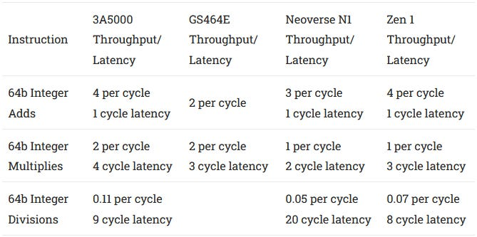

*图 15：正式图注提醒 N1 不支持 256-bit。LA464 可两 Scalar Integer Multiply/cycle，类似 Gracemont；但 Mul Latency 4-cycle，且 2.5 GHz，Absolute 性能落后高频现代核心。*

FP/Vector 两 Port，FP Add/Mul/FMA 不论宽度均 5-cycle；Vector Integer Add 一拍，两次 256-bit Integer Mul/cycle。早期 GS464E 只有 64-bit FP；GS464V 为超级计算做过两条 256-bit Vector Unit，可能是 LA464 Vector 基础。

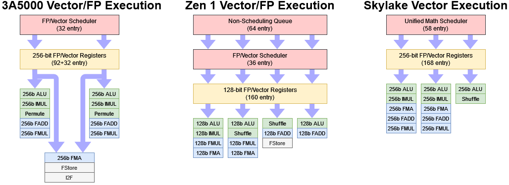

*图 16：四核 Ampere Altra 凭更高 Clock/专用 Instruction 在 libx264 略胜；LA464 的宽执行在低频下难转成 Absolute Throughput。*

### 体系结构视角：同一 Cycle Latency 在低频核心上更昂贵

4-cycle Multiply 在 2.5 GHz 是 1.6 ns；同 Cycle、4 GHz 只有 1 ns。低频设计通常应减少 Pipeline Depth 换 Absolute Latency，但复杂 Logic 又可能限制频率。LA464 同时 Clock 低、部分 Cycle 不短，形成双重劣势。

## AGU/LSU/TLB：两地址、8 B False Dependency、16 KB Page

两 AGU 每周期两 Memory Operation，两者都可 Load、最多一 Store，约等于 N1/Zen 1/Sandy Bridge；Haswell 已可 2 Load+1 Store，Golden Cove 2+2，Zen 4 三次且最多两 Store。

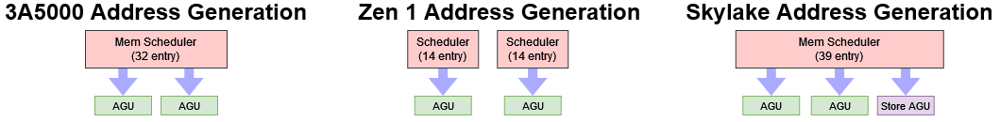

*图 17：GS464E 对标 Ivy Bridge 时两 AGU 合理，后来 Memory Parallelism 扩张使其显旧。*

Load 可 Speculate 越过未知地址 Store。真正依赖时，Load 完全包含于 Store 且不跨 64 B，可 7-cycle Forward。

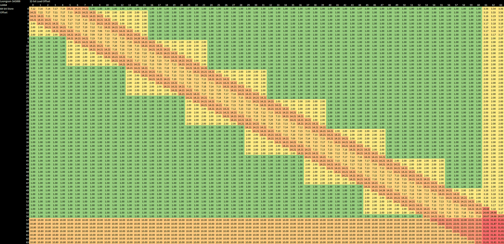

*图 18：按 8 B 粗比较；同一 8-byte Block 即使不真重叠也不能并行。甚至不同 16 KB Page、相同 Page Offset 的同 8 B Block 也出现 False Dependency，暗示早期比较未带完整地址。Partial Overlap 失败 14 cycle。*

Misaligned Load 跨 64 B 用两 Cycle；Store 10。再跨 16 KB Page，Load 仍相同、Store 15；Zen 1 Store 24 cycle，但 4 GHz 下 Absolute Time 接近。

Default Page 为 16 KB。64-entry L1 DTLB 覆盖 1 MB，2048-entry L2 覆盖 32 MB；L2 TLB 额外约 2.3 ns/5～6 cycle，Cycle 优于 Zen 1 7～8，但后者高频使 ns 更短。

### 体系结构视角：Virtual Alias 痕迹会暴露依赖比较分阶段

未知 Physical Address 时，LSU 可先用 Page Offset 检查 Store Queue，因为 Page Offset 在 VA/PA 相同；8 B 粒度节省 Comparator，却让不同 Page 同 Offset 产生 False Match。TLB 完成后才能排除，期间 Load 被保守阻塞。测试不同 Page/同 Offset 正是验证这种 Early Disambiguation 的办法。

## Cache：L1D 宽，L2 慢，L3 容量不错但没跑满理论

64 KB/4-way L1D 配 16 KB Page，可做 VIPT；Hit 4-cycle。LoongArch 像 MIPS，缺 Scaled-index Addressing，Array Index 需额外 Instruction。GCC 生成代码的 Effective Array Load Latency 达 8-cycle；x86-64/AArch64 支持 Scale，最多多 1 cycle。

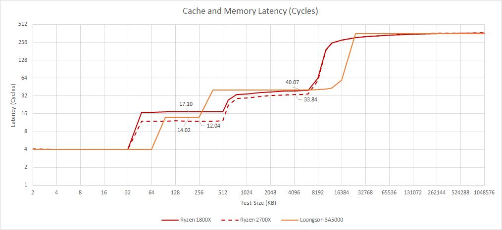

*图 19：单看 4-cycle Cache 会漏掉 ISA Address Generation 对程序依赖链的影响。*

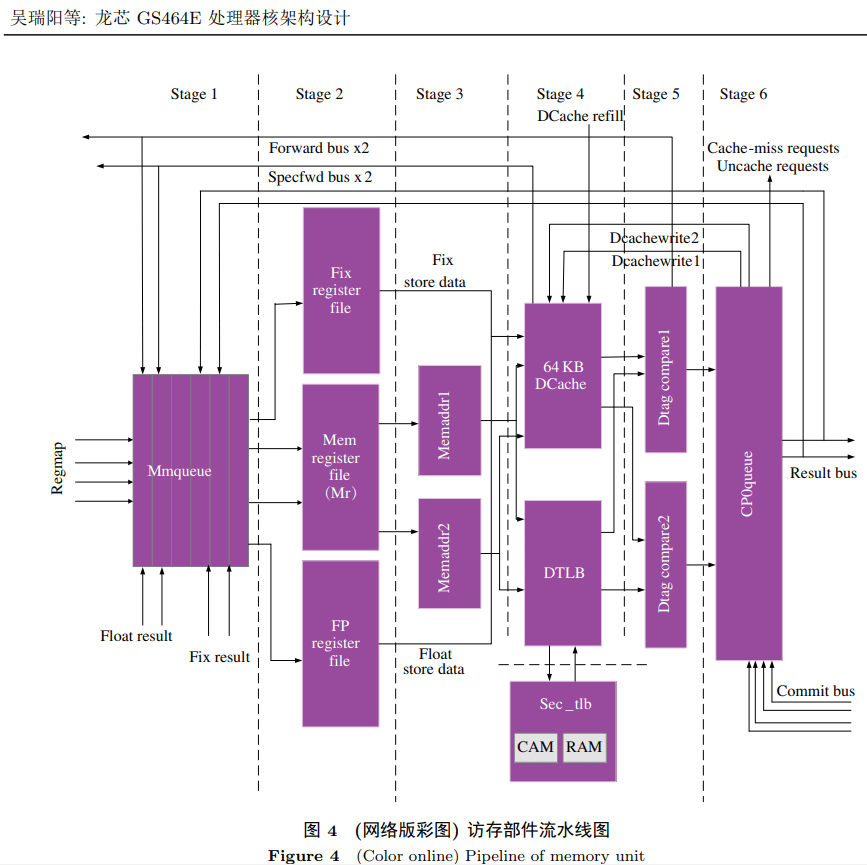

*图 20：正式图注为前代结构。Undocumented LASX 测得 2×256-bit Load 或 1×256 Load+1×256 Store/cycle；L1D Bandwidth 胜 Zen 1，却不及 Skylake。*

L2 为 256 KB/16-way Victim Cache，14-cycle/5.6 ns；FX-8350 4.8 ns，Zen 1 更快且 512 KB。

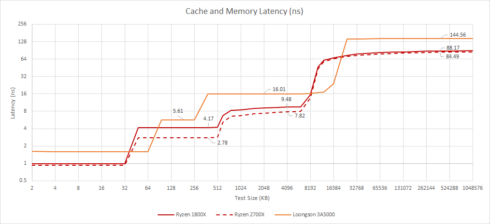

*图 21：容量、相联度和 Victim Policy 没换来足够低的 Absolute Latency。*

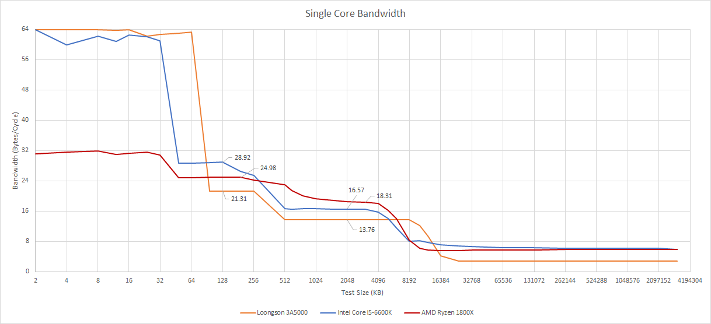

*图 22：21.3 B/cycle，低于 Skylake >28、Zen 1 >24；Clock 差让 GB/s 差距更大。*

L3 是亮点：四核共享 16 MB Victim L3、四 Bank。Manual 描述 5×5 Frequency-division AXI Switch，Core 为 Master、Slice 为 Slave；每 Port Read 32、Write 16 B/cycle。

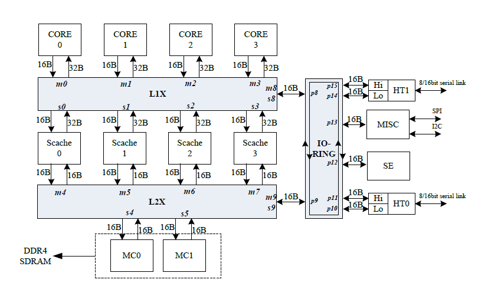

*图 23：正式图注说明来自 Reference Manual。*

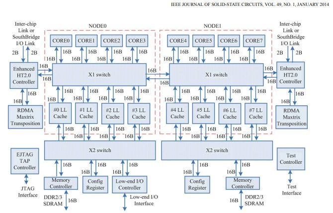

*图 24：正式图注称四核 Cluster 高层结构很像，LA464 每 Slice Read 翻倍。*

四 Slice×32 B×2.5 GHz 理论 320 GB/s，实测远不到。候选原因有 L2 Miss Outstanding 不够、5×5 Switch Contention、L3 Clock 低于 Core；Godson-3B1500 Core 1.25 GHz、LLC 1 GHz。

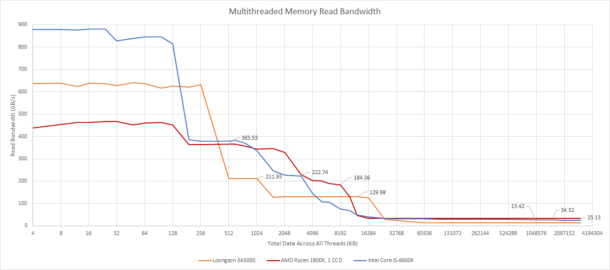

*图 25：AMD/Intel B/cycle 已领先，更高 Clock 再扩大 GB/s；理论口宽不能替代实测。*

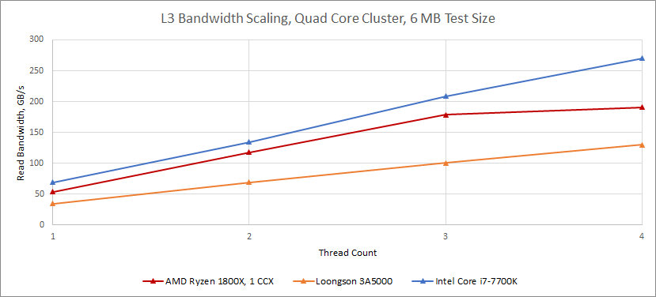

*图 26：随 Thread 近线性，明显好于 Bulldozer；若多 Cluster 各有私有 L3，Bandwidth 理论可像 EPYC 随 Cluster 扩展，但仍需产品验证。*

L3 约 40-cycle，接近 Zen 2 Cycle；2.5 GHz 下却为 16 ns，Client 并不出色。

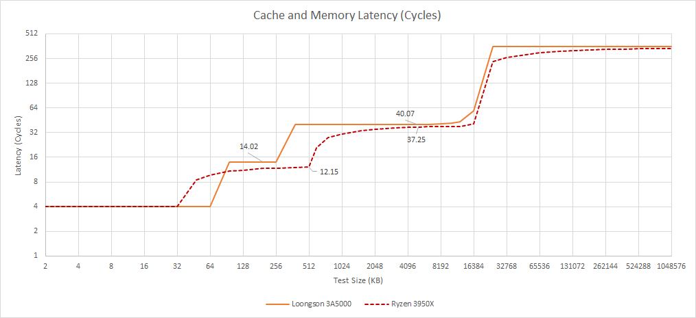

*图 27：Cycle 尚可、Absolute Time 偏高。*

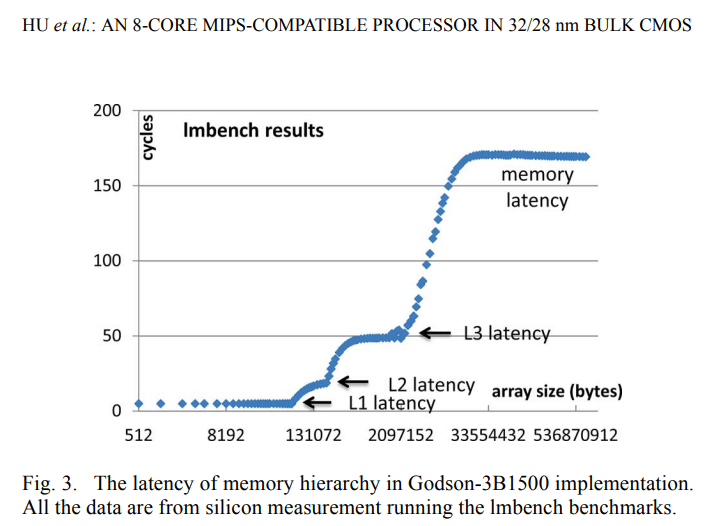

*图 28：正式图注来源 IEEE 2014，1.25 GHz Core/1 GHz LLC；旧 L3 约 50 cycle/40 ns，LA464 16 ns 是巨大进步。*

### DRAM

DDR4-2666 Dual-channel、两 Slot 都插满，Latency 约 144 ns；旧 Dual-channel DDR3-1066 RDIMM Godson-3B1500 128～136 ns。

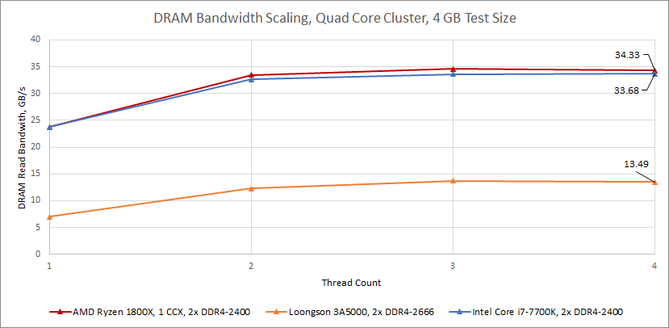

*图 29：单 Core 约 7 GB/s，四核不足 14，每 Core 仅 3.37；i7-4770 Dual DDR3-1333 已略超 19。Web/Office 可能尚可，Server/HPC/Media/Parallel Compile 更易受限。*

144.5 ns 在 2.5 GHz 为 361 cycle，若升至 4 GHz 会是 578；低频反而遮住最坏的 Cycle Cost。提高 Core Count/Clock 前，Memory Controller 是必须解决的系统瓶颈。

## 最后的评价：最有希望，不等于已经接近领先

在这几款被测国产 CPU 中，3A5000 最有希望：比 KX-6640MA、D2000 Core 更宽，Backend/Cache 更平衡。但 LA464 Buffer 小、L2/L3 慢、DDR4 Controller 很弱，2.5 GHz 也远低于当代 Desktop/Laptop，甚至与 3 GHz Neoverse N1 竞争吃力。

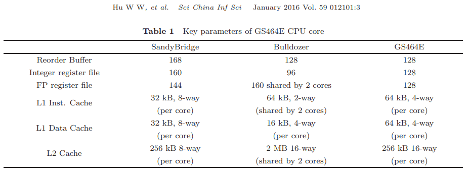

*图 30：正式图注来源 *An Introduction to CPU and DSP Design in China*；列出的 GS464E Key Parameter 与 LA464 相同。微基准看 LA464 更像 GS464E 后一代，而 GS464E 本就以追赶 2010 年代早期 Western Core 同频为目标。*

软件生态同样关键。LoongArch 为解决 MIPS Application/Toolchain 弱而新建不兼容 ISA，却仍大量复用 MIPS Toolchain；Old World Commercial 与 New World Community ABI 一度不兼容。文中引用 x86-64 Binary Translation 在 Loongnix 上 Geekbench 立即 Segfault，x86 32-bit 可运行；即使能跑，Translation 仍给低性能核心增加开销。该状态是文章发布时点观察，不能外推为今天所有发行版。

### 体系结构视角：从 3A5000 可以归纳出的七点认识

第一，追赶对象在移动。LA464 相比 GS464E 明显进步，但 Intel/AMD 同期继续扩大 Window、BTB、AGU 和 Clock。

第二，宽执行必须有宽供给。256-bit L1D/Vector 不弱，64-entry BTB、大 Footprint Fetch 和低 L2/DRAM Bandwidth 却让它难以持续工作。

第三，低频不能容忍深 Latency。40-cycle L3、4-cycle Mul 在高频 Core 尚可，2.5 GHz 下 ns 直接落后。

第四，ISA 会进入微架构关键路径。缺 Scaled Index 让原本四拍 L1D 在 Array Dependency 上变成八拍。

第五，大 Page 扩大 TLB Reach，也改变 False Dependency 与 OS Memory Tradeoff。16 KB Page 给 64-entry DTLB 1 MB Coverage。

第六，理论接口不能替代 MLP。四 Slice 理论 320 GB/s，若 Miss Queue/Clock/Switch 不匹配，实测仍远低。

第七，General-purpose CPU 是 Hardware+Software System。ABI、Compiler、Binary Translation 和 Application Availability 会决定微架构性能能否被用户得到。

## 参考资料

- Chips and Cheese：[*Loongson’s 3A5000: China’s Best Shot?*](https://chipsandcheese.com/p/loongsons-3a5000-chinas-best-shot)
- Weiwu Hu et al.：*An 8-Core MIPS-Compatible Processor in 32/28 nm Bulk CMOS*，IEEE JSSC 2014
- Weiwu Hu et al.：*Microarchitecture of the Godson-2 Processor*
- Weiwu Hu et al.：*Godson-3: A Scalable Multicore RISC Processor with x86 Emulation*，IEEE Micro 2019
- Weiwu Hu, Yifu Zhang, Jie Fu：*An Introduction to CPU and DSP Design in China*，2015
- x86-on-LoongArch FAQ（正文 Old/New World 引用）

网页末尾提供 Patreon、PayPal 与 Discord 支持入口。
