# 龙芯 3A6000 深度拆解：LA664 六宽乱序、SMT 与内存层次

> **文章来源**
>
> - 文章：*Loongson 3A6000: A Star among Chinese CPUs*
> - 撰文：George Cozma、Chester Lam
> - 首发：Chips and Cheese
> - 发布：2024 年 3 月 14 日
> - 链接：https://chipsandcheese.com/p/loongson-3a6000-a-star-among-chinese-cpus

算力具有明确的战略价值，中国因此持续推动处理器的自主设计与制造。在已经进入市场的国产 CPU 中，龙芯一直是最受关注的路线之一。上一代 3A5000 已经展现出尚可的每时钟性能，但偏低的频率让它很难把微架构能力转换成有竞争力的绝对性能。

3A6000 仍是四核设计，最高频率为 2.5 GHz，却把核心从 LA464 升级到 LA664。两代核心的基本框架相近，LA664 的前后端更宽、乱序窗口更深、执行资源更多，并首次加入双路同步多线程（Simultaneous Multithreading，SMT）。SMT 的面积代价通常低于复制一整颗核心，但要让两个线程共享预测器、寄存器、队列和执行端口而不造成严重互相干扰，设计与验证都很困难。

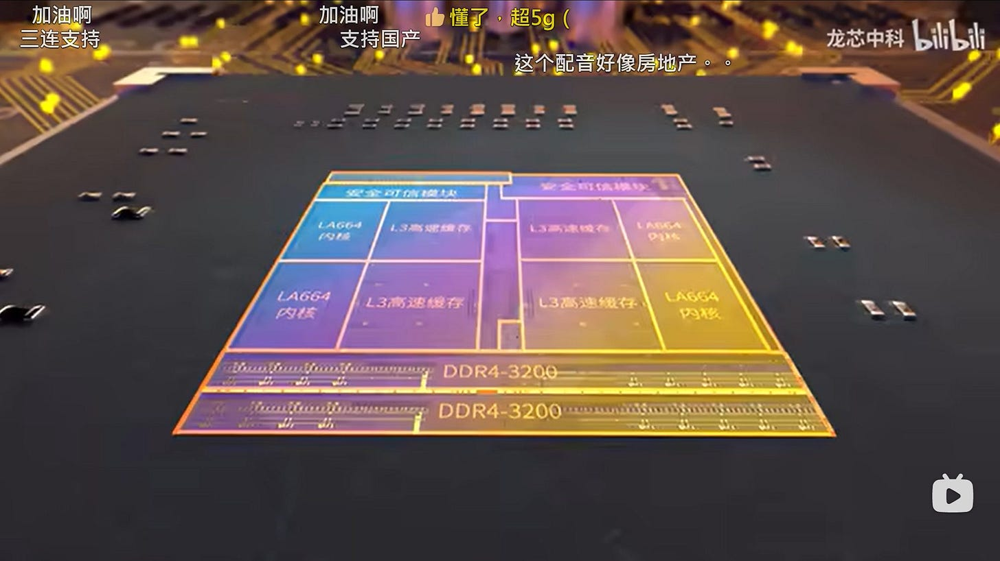

*图 1：龙芯公开视频展示的芯片与模块布局。这张图提供产品背景，不是可据以复原信号、位宽和互连时序的 RTL 框图。*

## 测试口径与结论边界

性能图中的 3A6000 运行 AOSC，配置为 4 核 4 线程或 4 核 8 线程。7-Zip 测试压缩一个 2.67 GB 的 ETL 文件，重点考察标量整数、分支、Cache 和内存行为；libx264 则转码一段 4K《守望先锋》视频，会利用 x86 的 SSE/AVX 系列指令或龙芯的 LSX/LASX 向量扩展。内存测试使用双通道 DDR4-2666；3A6000 虽然标称支持 DDR4-3200，但双通道 3200 在这套被测配置上无法稳定启动。

对照平台包含 Ryzen 1800X、3950X、7950X3D、Ampere Altra、Celeron J4125、兆芯 KX-6640MA、Core i5-6600K 与 EPYC 7763。部分 Ryzen 数据限定在一个 CCX，7950X3D 还限定为不带 V-Cache 的 CCD。不同处理器的 ISA、编译器后端、频率、Cache、内存和操作系统并不相同，因此这些结果适合判断产品级性能和结构量级，不适合把很小的差距全归因于某一个核心模块。

网页没有完整披露主板型号、固件、内核版本、编译器及全部参数、线程绑定、锁频与功耗限制、预热、重复次数和误差范围。微基准曲线可以支持容量或层级判断，却不能唯一反推出预测算法、物理端口连接和恢复逻辑。本文没有可核对的 LA664 RTL；带问号的容量、由曲线得到的队列深度和机制解释都会保留其不确定性。

下文按网页中的 39 张正文图展开。图表数据和测试判断沿用文章的论证顺序；标题为“体系结构视角”的段落用于解释通用机制、阻塞与验证方法，不把教学分析写成 LA664 已确认实现。

## 一、先看产品性能：每时钟能力上来了，频率仍是上限

7-Zip 压缩是一项分支与内存行为都很复杂的标量整数负载。3A6000 的 4 核 4 线程成绩为 22.01 MB/s，比 3A5000 的 15.87 MB/s 高约 38.7%，并略高于 Ryzen 1800X 的 21.45 MB/s。启用 8 个硬件线程后，成绩增至 26.52 MB/s，约提升 20.5%，接近 4 核 4 线程 Ryzen 3950X 的 27.06 MB/s。

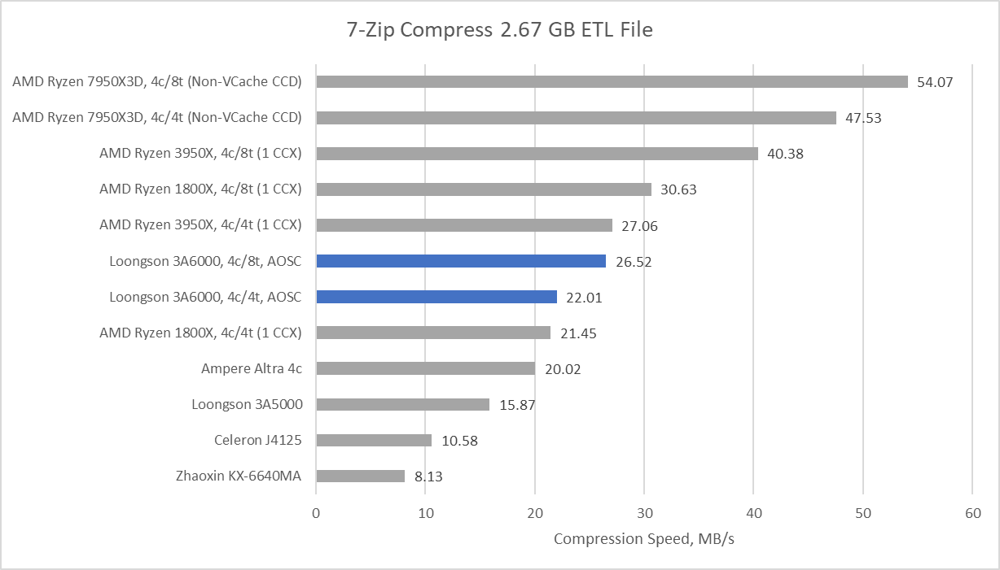

*图 2：横轴为压缩速度，单位 MB/s。3A6000 从 3A5000 的 15.87 提升到 22.01 MB/s，SMT 再把结果推到 26.52 MB/s；Ryzen 1800X 为 21.45/30.63，Ryzen 3950X 为 27.06/40.38，7950X3D 非 V-Cache CCD 为 47.53/54.07。图中的 4c/4t、4c/8t 和 CCX/CCD 限定是比较成立的重要条件。*

四颗 LA664 在每核只运行一个线程时，大体达到四颗 Zen 1 核心的量级，说明其每时钟性能已经相当可观。问题在于 2.5 GHz 远低于后来的 AMD 和 Intel 桌面核心，因而绝对性能仍会被频率压住。SMT 带来的约 20% 增益说明共享策略已经能产生实际收益，但仍低于 Zen 1/Zen 2 常见的 40% 以上增幅；这既可能反映 LA664 的单线程利用率较高，也可能说明两个线程更早碰到静态分区或共享端口的上限。

libx264 提供了另一种压力。3A6000 的 4 核 4 线程成绩为 1.51 FPS，启用 SMT 后达到 1.97 FPS，提升约 30.5%。它与 Ryzen 1800X 的关系随线程配置变化：单线程/核时落后于 1.68 FPS，满线程时略高于 1.94 FPS。Ryzen 3950X 则达到 2.35/3.11 FPS，7950X3D 达到 3.44/4.86 FPS。

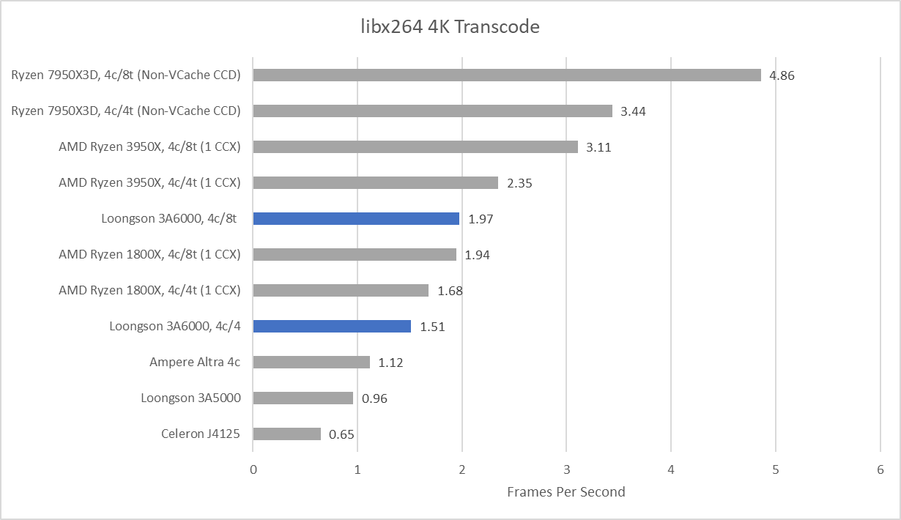

*图 3：横轴为每秒处理帧数。测试转码 4K 游戏视频，x86 与 LoongArch 会使用不同的 SIMD 指令集和编译器后端。3A6000 的 1.51/1.97 FPS 显示 SMT 增益较明显，但跨 ISA 的向量化质量、指令数和库实现都会进入最终成绩。*

Zen 1 的 SMT 增幅在这项负载中不高，可能与它相对较弱的 AVX2 吞吐有关；Zen 2 和 3A6000 都获得 30% 以上提升。Zen 4 仍能凭更强的前端、向量后端和高频率拉开距离。综合两项测试，LA664 是一颗每时钟效率不错的核心，但四核、2.5 GHz 的产品形态让它更接近较早一代 AMD/Intel，而不是当时的主流高性能桌面 CPU。

### 体系结构视角：IPC、频率和线程数必须一起看

单线程性能近似由每周期完成工作量与频率共同决定；多线程吞吐还取决于核心数、SMT 增益和内存系统。更深的 ROB 或更宽的执行端口可以提高 IPC，却无法直接补回接近一倍的频率差。SMT 也不是额外复制一颗核心，而是利用一个线程留下的前端、窗口或端口空隙，因此增益越高不一定代表单线程核心越强。

判断 SMT 收益来自哪里，可以比较两种线程配置下的 fetch/decode 利用率、ROB/寄存器/队列满周期、端口忙周期、Cache miss 并行数和每线程 IPC。如果开启第二线程后后端利用率上升而 miss 延迟没有变，说明它主要在填执行空洞；如果 L1/L2 miss、共享队列拥塞和线程间公平性事件同步恶化，则收益已经受资源竞争约束。

## 二、LA664 总览：从四宽 LA464 扩展到六宽

LA664 是六宽乱序核心。网页根据微基准与公开资料整理的框图给出：六条译码和重命名/分配通路、256 项重排序缓冲区（Reorder Buffer，ROB）、约 192 项整数和 192 项 256-bit FP/向量寄存器，以及各 48 项的整数、FP 和地址生成调度资源。前端使用 64 KB 四路 L1I，数据侧为 64 KB 四路 L1D、256 KB 十六路 L2 和四核共享的 16 MB 十六路 L3。

*图 4：网页整理的 LA664 框图。可见参数包括 64 项 L1 BTB、至少 512 项间接目标阵列、16 项返回栈、约 64 项 ITLB/DTLB、24 B/cycle L1I 供给、六宽译码/分配/退休、256 项 ROB、约 192 项整数和 FP/向量寄存器、三个 48 项调度域、64 B/cycle Load 与 64 B/cycle Store、256 KB L2 和 16 MB L3。图中 ITLB、整数寄存器和 2048 项 L2 TLB 带有问号；Load Queue 标为 75 项、Branch Order Buffer 标为 63 项，又与后续表格的 80/64 项不同，应视作不同测试口径而不是强行统一。*

LA464 的框架清楚地解释了这次扩展从何而来。上一代是四宽译码/分配/退休、128 项 ROB、约 128 项整数与 FP/向量寄存器，三个调度域各 32 项，Load/Store Queue 为 64/44 项；L1 和 L2/L3 容量与 3A6000 接近，但 L1D 为 4 周期，前端和后端带宽更窄。

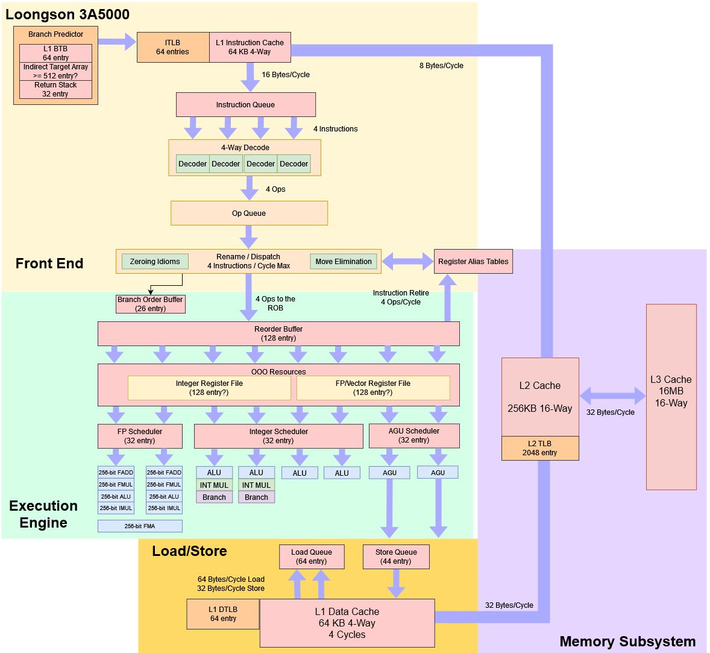

*图 5：LA464 对照框图。前端四宽、ROB 128 项、调度器各 32 项、整数与 256-bit FP/向量寄存器各约 128 项，Load/Store Queue 为 64/44 项。图中返回栈是 32 项，而 LA664 的 16 项体现了资源并非全部单向增大。*

龙芯公开视频中的资源对照大体支持这些结果：ROB 从 128 增到 256，整数和 FP/向量物理寄存器从 128 增到 192，Load Queue 增至 80，Store Queue 增至 64。公开视频与微基准并非每个数字都一致，例如 LA464 Store Queue 在视频中可读作 48 项、微基准表为 44 项；这类差异可能来自统计对象、保留项或图示简化，现有材料无法进一步判定。

六宽并不自动等于六 IPC。预测器要持续给出正确 PC，L1I 要提供足够字节，译码与重命名要有空闲表项，调度器还要找到 ready 操作并匹配执行端口。LA664 的价值正是在多个环节一起扩展，而不是只把某个醒目的数字翻倍。

## 三、分支预测：从明显短板进入 Zen 2 量级

分支预测器决定前端下一步从哪里取指。方向错误会让后端执行一批最终被取消的指令，目标迟到则会让正确方向上也出现取指气泡。LA664 的随机分支模式测试同时改变重复模式长度和循环中的静态分支数，纵轴记录随机模式相对可预测分支增加的时间。

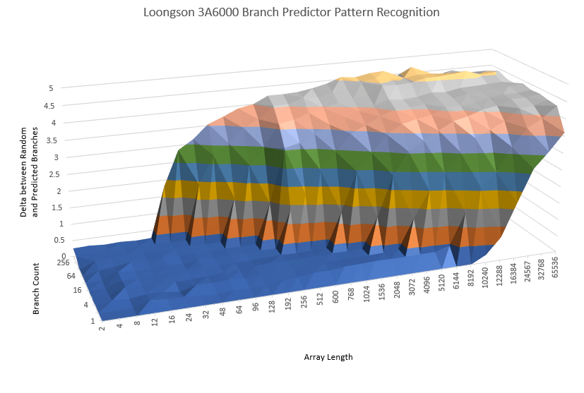

*图 6：横轴为模式长度，另一轴为循环中的分支数 1～256，纵轴为随机分支相对可预测分支增加的纳秒数。较大的平坦低区表示预测器仍能学习该组合；曲面抬升同时受到有效历史长度、表容量、索引和混叠影响，不能据此锁定具体预测算法。*

这是测试过的中国 CPU 中表现最好的一颗，和 3A5000 已不在同一量级，也接近较新的 AMD/Intel 核心。Zen 3 仍能在更大的模式与分支工作集上保持低代价，说明其预测器对长历史和容量压力的覆盖更强。

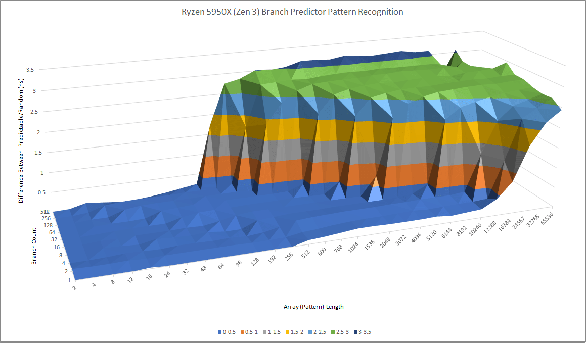

*图 7：Zen 3 对照曲面使用相同测试思路。与图 6 相比，它在更大区域保持较低高度；两张曲面描述的是端到端可观察行为，并不等同于某个全局历史寄存器的精确位数。*

Zen 3 很可能使用速度不同的多层预测：快速层先覆盖简单和常见分支，更慢但更强的层追踪更长历史并在及时到达时修正早期结果。3A5000 的可观察能力更接近 2000 年代中期到 2010 年代早期的高性能核心；LA664 是否采用与 Zen 3 相同的结构没有公开证据，但它一步跃升到接近 Zen 2，足以说明龙芯在预测器上投入了大量工程资源，也是整机性能大增的重要来源。

### BTB 与目标交付

方向预测只回答 Taken/Not-Taken，分支目标缓冲器（Branch Target Buffer，BTB）还要给出 Taken 后的目标地址。LA664 可见的快速 L1 BTB 约为 64 项，在这一范围内，连续 Taken 分支大致可以做到每周期一个而不产生额外气泡。超过 64 项后，曲线升到约 2～3 cycles/branch；结合不同分支间距，网页把下一层估计在 1K～4K 项，并认为它可能与 64 KB L1I 的取指路径结合得很紧。若目标未命中快速表，前端可能要等指令字节到达后再由分支地址计算路径生成目标。

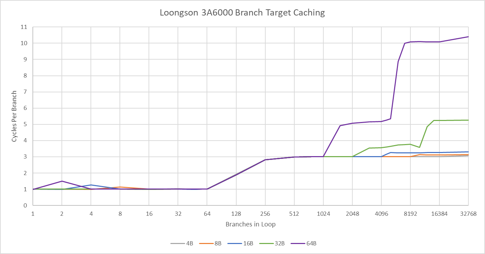

*图 8：横轴为循环中的 Taken 分支数，纵轴为 cycles/branch，五条曲线对应 4～64 B 的分支间距。约 64 项后出现第一处稳定台阶；64 B 间距会更早越过 L1I，并在约 1K、4K 和 8K 附近出现更高代价。曲线同时混入 BTB、I-Cache、预取与分支地址生成，不能把每个台阶都等同于独立 BTB 容量。*

与现代 AMD/Intel 把较大 BTB 和指令 Cache 更充分解耦的做法相比，LA664 在大代码工作集上更依赖 64 KB L1I 与线性指令预取。Zen 4 即使分支工作集越过 L1I，只要还落在大容量 BTB 中，也能维持较低目标交付延迟。LA664 则会在目标元数据或指令字节不足时更快落到较慢路径。

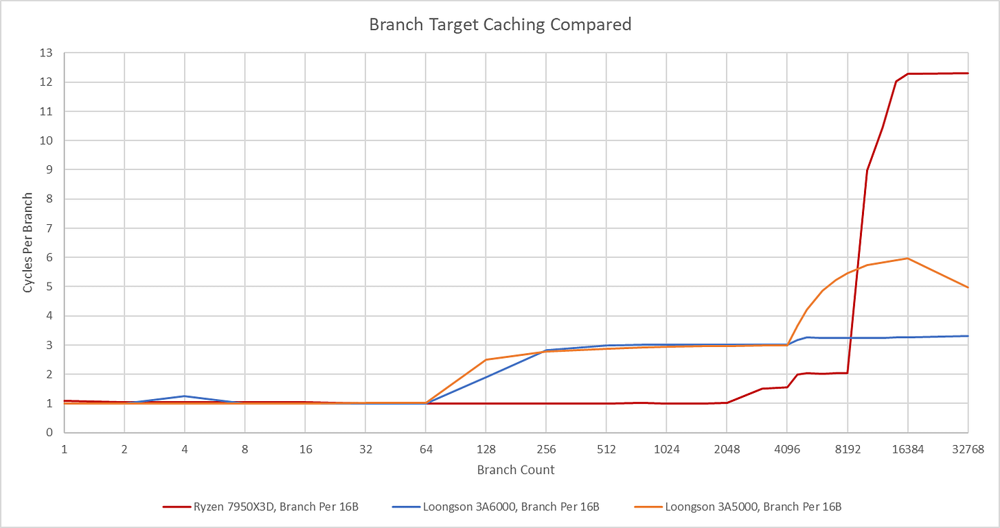

*图 9：固定每 16 B 一个分支时，3A6000 在 64 项后从约 1 升到约 3 cycles/branch，但直到 32K 分支仍较平；3A5000 在 4K 后继续恶化，Zen 4 则到 8K 以上才出现陡增。图例中的 Ryzen 7950X3D 代表 Zen 4。cycles/branch 未计入不同频率造成的绝对时间差。*

一些设计会为此付出更复杂的解耦前端。文章举出 Tachyum Prodigy 的反例：其团队认为大容量目标结构的面积、功耗和标准单元时序代价过高而没有采用。LA664 的 64 KB L1I 和更积极的线性预取在一定程度上补偿了较紧耦合的目标路径。测试让控制流跳到下一个 16 B 对齐块时，龙芯表现出明显的顺序方向预取；AMD 的行为则更像由预测器主导，越过 BTB 覆盖后很快接近普通 L2 延迟。

### 间接跳转与返回预测

间接跳转的同一条静态指令可能指向多个动态目标，普通“PC 对应一个目标”的 BTB 很难处理。LA664 在总计约 1024 个间接目标的压力下仍能保持有效预测，比 3A5000 约翻倍；单个间接分支可以覆盖超过 128 个目标，而 3A5000 大约在 24 个目标附近就明显退化。Zen 2 在总目标数上也约为 1024。

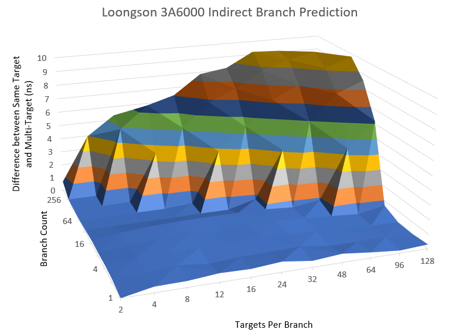

*图 10：横轴为每条间接分支的动态目标数，另一轴为静态分支数，纵轴是“固定单目标”与“多目标”测试的时间差。压力由两个维度共同构成，所以 128 targets/branch 与约 1024 total targets 分别描述单分支多样性和总体容量，不应混为同一个表深度。*

函数返回通常由返回地址栈（Return Address Stack，RAS）预测：call 压入返回地址，return 弹出栈顶。LA664 在单线程时可用容量约为 32 项；两个 SMT 线程同时运行时，每线程约为 16 项，说明这一结构很可能按线程分配。超出容量后的性能下降不算剧烈，支持返回预测失败时还有通用间接目标预测器兜底的判断。这样一来，RAS 更像低功耗、低延迟的常见路径，而不是唯一能正确处理返回的结构。

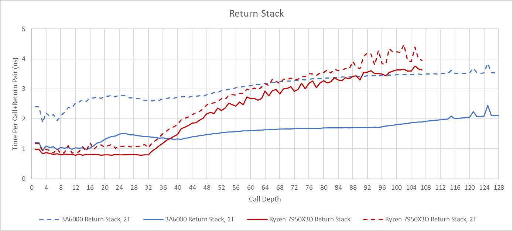

*图 11：横轴为调用深度，纵轴为一对 call+return 的纳秒数。3A6000 的 1T/2T 曲线显示 SMT 会压缩每线程可用 RAS 深度；Zen 4 的单、双线程曲线更接近，支持其返回栈可能按线程复制。曲线溢出后的渐进变化还会受到间接预测、前端重填和绝对频率影响。*

### 实际负载中的误预测

7-Zip 的控制流很难预测。3A6000 在 4c/4t 与 4c/8t 下分别为 7.17 和 7.21 MPKI，正确率为 95.97% 和 95.95%；Ryzen 1800X 约为 7.12～7.14 MPKI、95.27%～95.30%，因此两者按每千条指令误预测数接近，而 3A6000 的方向正确率更高。原因是不同 ISA 和编译结果产生了不同动态指令流：3A6000 完成任务时执行的指令更少，但分支占比更高，于是较高正确率仍可能对应相近 MPKI。

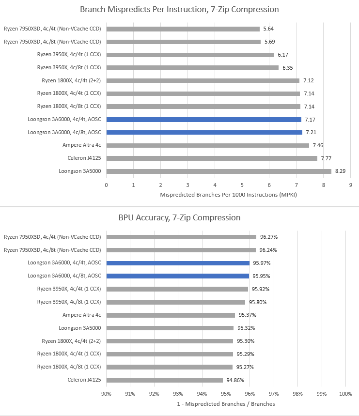

*图 12：上图为每千条指令误预测数（MPKI），下图为 `1 - 误预测分支/全部分支`。3A6000 约为 7.2 MPKI、95.96%，与 Ryzen 1800X 的 MPKI 接近、正确率更高；Zen 2 3950X 约 6.17～6.35 MPKI，Zen 4 7950X3D 约 5.64～5.69。正确率、分支频度和动态指令数必须一起解释。*

libx264 的分支更少、也更容易预测。3A6000 在 4c/4t 下为 1.39 MPKI、97.32%，4c/8t 为 1.51 MPKI、97.11%，总体接近 Zen 2。LoongArch 在这项负载中执行更多非分支指令，较低 MPKI 并不自动代表更强的方向预测器；它也意味着每次误预测之间夹着更多普通操作，因此误预测对总体执行时间的占比可能更小。

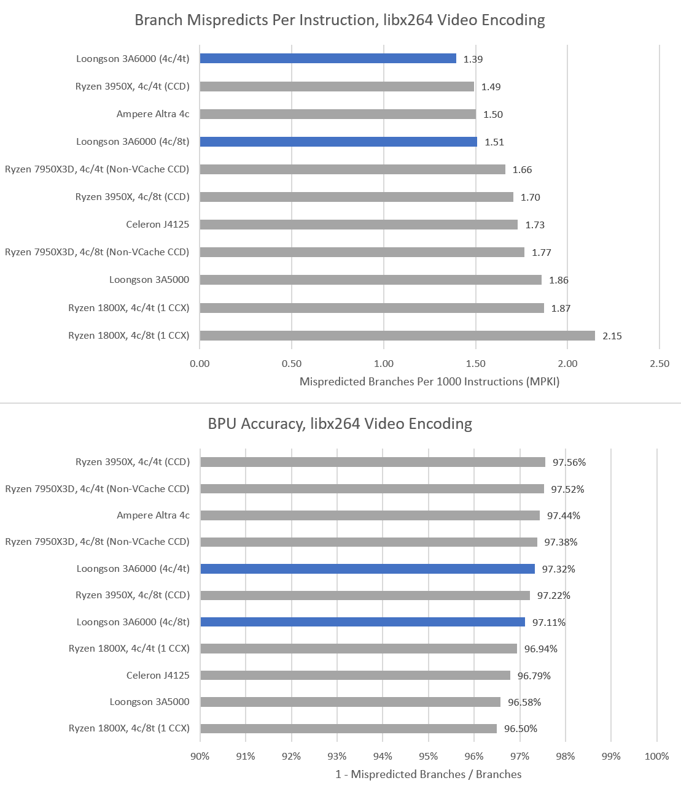

*图 13：3A6000 的 1.39/1.51 MPKI 低于图中的多颗 x86 对照，但正确率 97.32%/97.11%并非最高。3950X 4c/4t 为 1.49 MPKI、97.56%，说明 MPKI 差异中包含分支密度和指令流差异。*

### 体系结构视角：预测器的输出必须“准、快、可恢复”

方向预测、BTB、间接目标阵列和 RAS 分别解决不同问题。快速层能避免常见 Taken 分支出现气泡，较慢强预测器覆盖长历史，间接预测器处理一对多目标，RAS 则用调用栈语义低成本预测返回。任何一级未及时给出结果，前端都可能先按较弱答案前进，再在修正到达时重定向。

错判恢复不仅要改回 PC，还要取消错误路径上的年轻操作，并恢复被推测更新的全局/路径历史、RAS 指针和重命名状态。材料没有公开 LA664 的 checkpoint 数量、更新时机和恢复信号。验证时可以把条件分支 MPKI、BTB miss、间接/返回目标错误、重定向周期、错误路径取指量与取消操作数配合起来；若准确率相近而 IPC 仍低，应继续检查目标交付延迟和恢复气泡，而不是只扩大方向预测表。

## 四、取指与译码：六宽供给在 L1I 内成立

LA664 的 L1I 为 64 KB 四路组相联，容量是常见 32 KB L1I 的两倍。它每周期可向指令队列提供 24 B，正好覆盖六条固定 4 B 的 LoongArch 指令；六个译码器随后向操作队列交付最多六个操作。相较 LA464 的四宽与 16 B/cycle，这是一处直接扩宽。

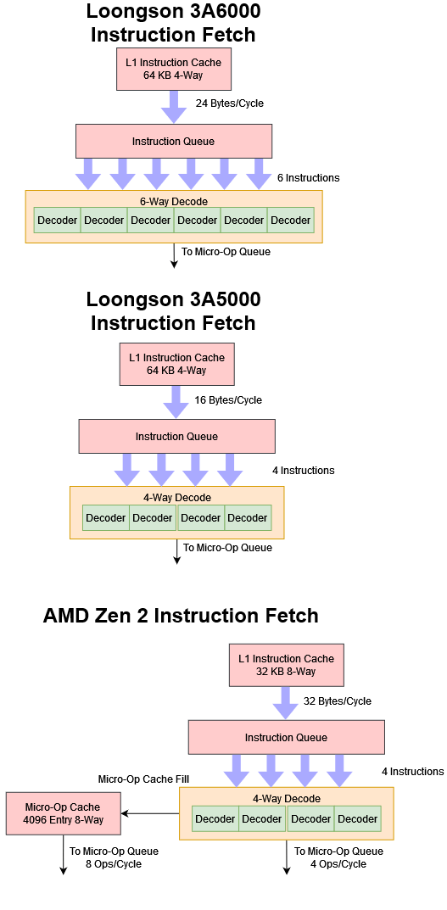

*图 14：LA664 以 64 KB L1I、24 B/cycle 和六宽译码供给后端；LA464 为 64 KB、16 B/cycle、四宽；Zen 2 的 32 KB L1I 与操作缓存分别走常规译码和缓存微操作路径。图中是网页整理的功能关系，不代表内部所有流水级。*

NOP 指令流在小工作集内接近 6 IPC。越过 L1I 后，LA664 仍能从 L2 维持约 3 IPC，明显修复 3A5000 在 L2 区间跌到约 1.2～1.7 IPC 的问题。到共享 L3 区间后，LA664 又降到不足 2 IPC；Zen 3 与 Golden Cove 在类似工作集上仍能超过每周期三条 4 B 指令。

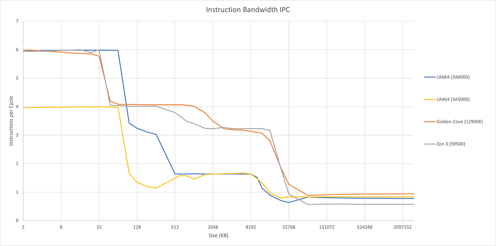

*图 15：横轴是代码规模，纵轴是 instructions/cycle。LA664 在 64 KB 内接近 6，约 128～256 KB 时维持 3 IPC 左右，进入更大层级后约 1.6 IPC；LA464 从 4 IPC 跌到约 1.2～1.7，Zen 3/Golden Cove 在中等工作集保持约 3～4 IPC。曲线会同时受到 I-Cache、ITLB、预取和后端接收能力影响。*

现代 AMD/Intel 高性能核心常用 uOP Cache 把已译码操作直接送往后端，减少重复译码和 L1I 字节压力。Zen 的操作缓存理论上可以每周期交付 8 个 uOP，不过后续重命名/分配宽度会限制持续接收率。LA664 没有在图中显示类似结构，而是依赖大 L1I、六宽译码和更强的线性预取。它在 L2 指令供给上的进步很大，但 L3 仍是明显的前端限速点。

### 体系结构视角：大 L1I 是容量、带宽与访问时间的折中

64 KB L1I 能减少大代码工作集的 miss，也能在目标预测与指令字节较紧耦合时提供缓冲；代价是更大的标签/数据阵列和更困难的单周期访问。LA664 频率只有 2.5 GHz，给大 L1I 留出了比高频核心更宽松的时序预算，但绝对性能仍要求 L2/L3 miss 尽快回填。

取指停顿应沿反压链判断：预测 PC 是否及时、ITLB 是否命中、L1I 是否返回足够字节、指令队列是否有空间、译码是否发满六条。只有 fetch 低且 miss 增多时才应指向 Cache/TLB；若取指有数据却译码或分配不满，则瓶颈已经位于指令边界、复杂指令处理或后端反压。

## 五、重命名与乱序窗口：容量翻倍，但资源要按线程分配

重命名把架构寄存器映射到更大的物理寄存器文件，消除写后写和读后写假依赖；分配阶段还要为 ROB、调度器和 Load/Store Queue 预留位置，使乱序执行最终仍能按程序顺序退休并交付精确异常。LA664 还识别写零惯用法，并尝试消除寄存器到寄存器的 move。依赖 move 只能达到 2.00 IPC，独立 move 为 3.64 IPC，均低于六宽上限；写零 `li.d` 达到 5.35 IPC，说明清零特例更接近全宽处理。现代 AMD/Intel 核心通常能以接近重命名全宽的速度消除 move，Golden Cove 还可消除部分小立即数加法。作为量化对照，Zen 4 的依赖/独立 move 约为 5.71/5.73 IPC，XOR 清零为 5.73 IPC。

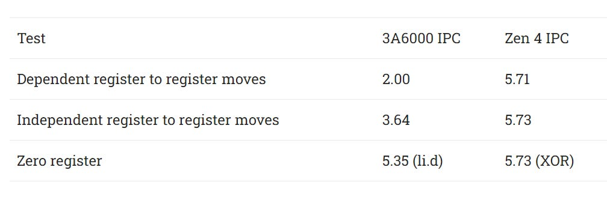

*图 16：依赖 move 的 2 IPC 显示 LA664 可能在别名表中消除一部分 move，却不能覆盖全部六宽槽位；独立 move 3.64 IPC 说明仍有操作落到普通 ALU 路径。写零 5.35 IPC 更接近重命名特例。微基准只显示端到端吞吐，不能确认每周期消除端口数。*

ROB 从 128 项扩大到 256 项，Branch Order Buffer 从约 26 项增到约 64 项，整数和 FP/向量寄存器从 128 项增到 192 项，三个调度域从 32 项增到 48 项。所有主要结构至少增加约 25%，其中上一代偏小的 Branch Order Buffer 增幅尤其大。Load Queue 的两处整理值分别为 75 和 80 项，Store Queue 为 64 项；图表不一致的项目保留两个口径。与 Zen 3 相比，LA664 的 ROB 和整数寄存器规模接近，FP/向量寄存器总位容量更大；Golden Cove 的 512 项 ROB 和更大物理寄存器文件则明显领先。

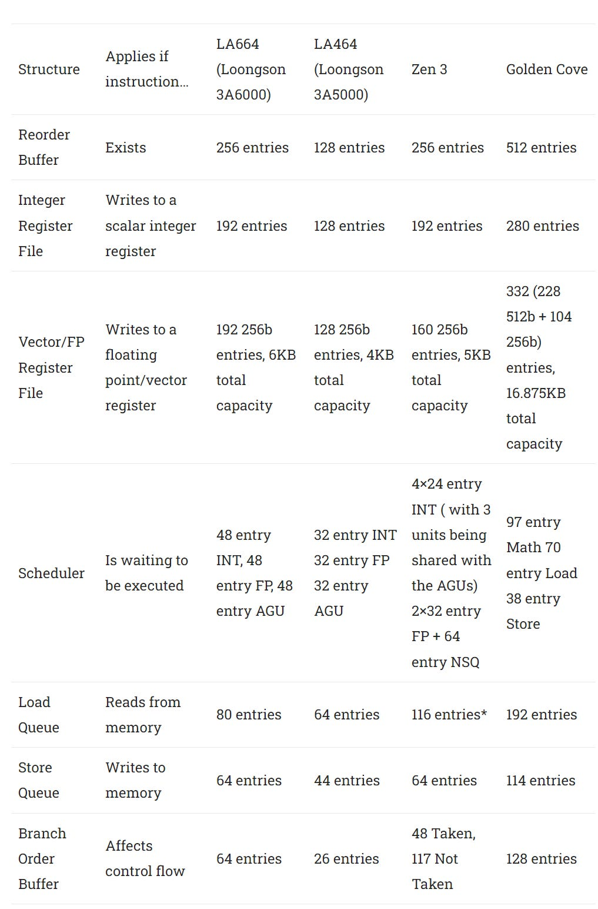

*图 17：LA664 列出 256 项 ROB、192 项整数寄存器、192×256-bit FP/向量寄存器、48 项整数/FP/AGU 调度器、80 项 Load Queue、64 项 Store Queue 和 64 项 Branch Order Buffer。Zen 3 的 Load Queue 使用微基准测得的 116 项，而手册写 72 项，表中以星号保留差异；Golden Cove 为 512 项 ROB、280 项整数寄存器和更大的向量总容量。*

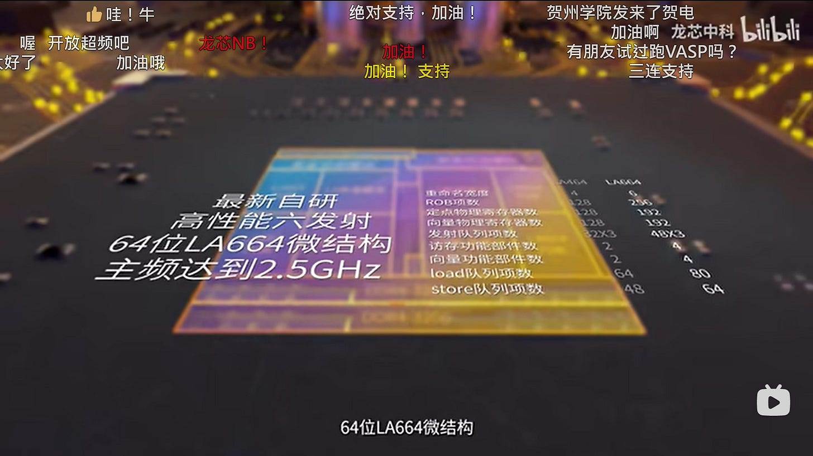

*图 18：公开视频写明 LA664 为六发射、2.5 GHz，并对照两代 ROB、寄存器、队列和功能部件数量。它大体支持微基准得到的 256 项 ROB、192 项物理寄存器、80/64 项 Load/Store Queue；视频截图不是完整规格表，较模糊的字段不用于补造精确参数。*

更深的窗口让核心可以越过长依赖或 Cache miss 寻找独立工作，但容量越大，比较、布线和访问能耗也越高，收益会逐渐递减。实际可见距离由最先耗尽的结构决定：程序若大量写整数寄存器，192 项整数文件可能先满；若有大量 Load，Load Queue 会先形成反压；控制流密集时，Branch Order Buffer 也会限制未决分支数。因此“256 项 ROB”不是所有负载都能用满的统一窗口深度。

### SMT 如何分配这些结构

SMT 让两个线程共享同一核心。资源策略大致可分三类：静态分区为每线程预留固定份额，水位线（watermark）允许线程在不超过上限时共享，竞争式共享则让线程按需求争抢。静态分区最容易保证公平和验证，但一个线程停顿时会留下闲置资源；竞争共享利用率最高，例如一个以 FP 为主的线程可把空闲整数资源留给另一个线程，却也可能让活跃线程挤压另一线程。

LA664 对关键状态采取相对保守的策略。ROB、整数/FP 寄存器、Load Queue 和 Store Queue 大体静态分区；只有另一个线程停止后，单线程才可使用全部资源，切换通常需要排空并重新配置。调度器使用水位线，每线程可占用的数学/整数调度项约为 30，内存调度项约为 36；这让单个线程在兄弟线程活跃时仍能获得接近 3A5000 的调度容量，同时避免完全垄断。

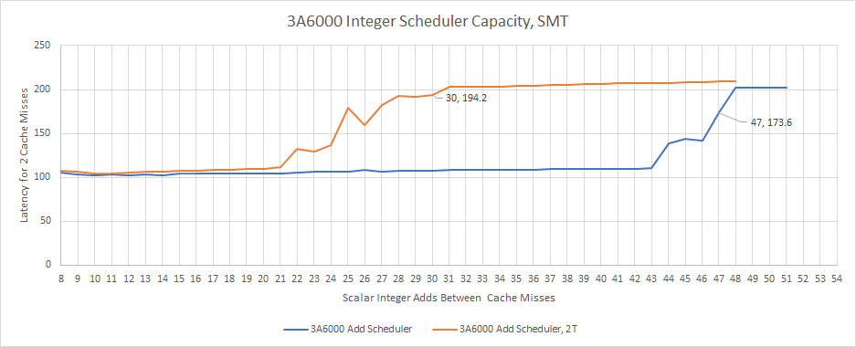

*图 19：横轴为一个线程占用的数学操作数，纵轴为另一个线程还能观察到的容量。曲线在约 30 项附近触及水位线，而调度器总量约为 48 项；这不是简单的 24/24 静态平分。*

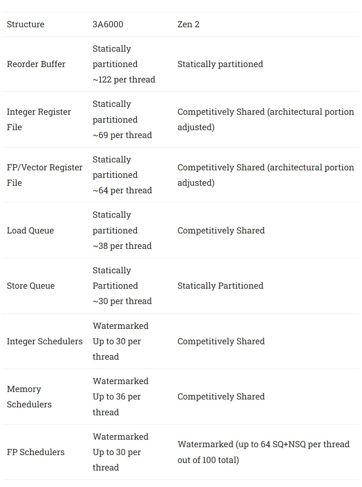

*图 20：3A6000 的 ROB 约每线程 122 项、整数寄存器约 69 项、FP/向量寄存器约 64 项、Load Queue 约 38 项、Store Queue 约 30 项，均表现为静态分区；整数、内存和 FP 调度器分别以约 30、36、30 项为水位上限。Zen 2 同样静态分 ROB/SQ，却对整数寄存器、LQ 和整数调度器采用更积极的竞争共享，FP 调度域则以 100 项总量、每线程最多 64 项的方式受限。*

Zen 2 的 SMT 资源利用更激进：ROB 静态分区，FP 调度器与非调度队列受水位限制，寄存器、Load Queue 和整数调度器更多采用竞争共享。这可能是 Zen 1/Zen 2 在部分负载中获得更高 SMT 增益的原因之一，但也提高了线程间干扰和验证复杂度。LA664 是龙芯第一次实现 SMT，先选择可预测、容易保证公平的分配方式具有合理性。

### 体系结构视角：SMT 的本质是把空洞变成可调度工作

两个线程需要独立的架构状态、异常语境和恢复点，却共享预测、取指、译码、物理寄存器、ROB、调度器、执行端口和 Cache。静态分区解决饥饿和精确恢复边界，代价是容量利用率；水位线在公平与利用率之间折中；竞争共享则要求更强的仲裁和 QoS 控制。

发生分支错判或异常时，只能取消对应线程中更年轻的操作，不能破坏另一线程的可提交状态。验证 SMT 不应只看总吞吐，还要检查每线程进度、资源占用上限、长期饥饿、停线程后的容量重配，以及单线程/双线程下 ROB、LQ、调度器和 RAS 的可见深度。LA664 约 20%～30% 的应用增益说明机制已经有效，但保守分区也留下了继续优化的空间。

## 六、执行后端：整数变化克制，向量与访存明显扩宽

### 整数执行

整数侧延续 LA464 的基本组织：一个统一的 48 项整数调度器连接四条 ALU 路径，其中两条还可处理整数乘法和分支，另外两条负责普通 ALU 操作。相较上一代，调度容量增加 50%，简单 ALU 数量保持四条，分支端口保持两条，整数乘法端口仍有两条。

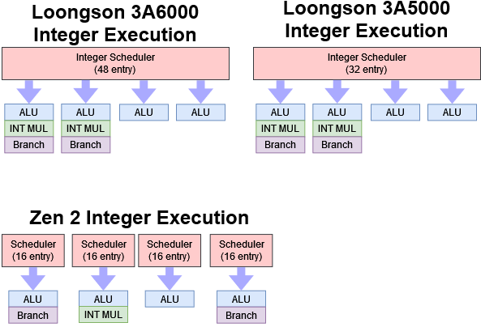

*图 21：LA664 由 48 项统一整数调度器供给四条 ALU，其中两条带整数乘法和分支能力；LA464 的对应调度器为 32 项。Zen 2 使用四个 16 项分布式整数调度器，能力分散到不同端口。统一队列能灵活利用端口，分布式队列则降低全局选择复杂度，各有不同的阻塞模式。*

从端口数量看，LA664 与 Zen 2 大致处于同一量级，并且有两条整数乘法路径，而图中的 Zen 2 只有一条主乘法路径。另一方面，Zen 2 的四个 16 项队列合计容量更大；分布式设计的弱点是某个 16 项队列先填满时，即使其他队列仍有空位，也可能阻塞前端分配。

整数除法得到显著加速：3A5000 约为 0.11 IPC、9 周期，3A6000 提升到 0.25 IPC、4 周期。除法在编译器优化后通常不算高频操作，因此这项投入略显意外；一种可能的工程考虑是 LoongArch 软件生态还不够成熟，改善较难被编译器完全消除的慢操作，可以减少现实程序中偶发的长尾停顿。

### 浮点与向量执行

LA464 已能在两条路径上处理 256-bit LASX 操作，属于相当积极的起点。LA664 把向量/浮点路径扩展到四条：四条都可执行 256-bit 浮点加法，两条提供 256-bit 浮点乘法和基础整数向量能力，另外两条也有更丰富的乘加/整数组合；但 256-bit FMA 的总体吞吐仍只有每周期一次。

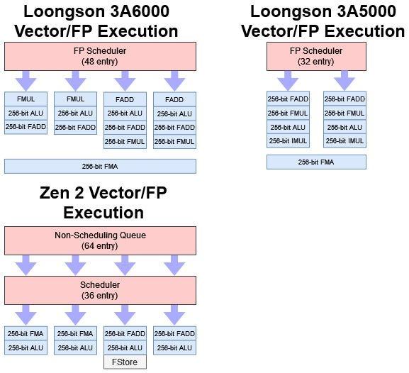

*图 22：LA664 的 48 项 FP 调度器连接四条 256-bit 路径，LA464 的 32 项调度器连接两条，Zen 2 则由 64 项非调度队列、36 项调度器和四条 FP 管线组成。模块框内列出的 FADD、FMUL、ALU、FMA 表示可观察能力分类，并不等同于已确认的物理单元完全独立。*

256-bit 双精度向量加法方面，LA664 达到 4/cycle、3 周期；LA464 为 2/cycle、5 周期，Zen 3 和 Golden Cove 都为 2/cycle、3 周期。向量乘法吞吐为 2/cycle，LA664 延迟 5 周期，Zen 3 为 3、Golden Cove 为 4。FMA 吞吐仍为 1/cycle、延迟 5 周期，只有 Zen 3/Golden Cove 的一半吞吐，延迟也比两者的 4 周期更高。

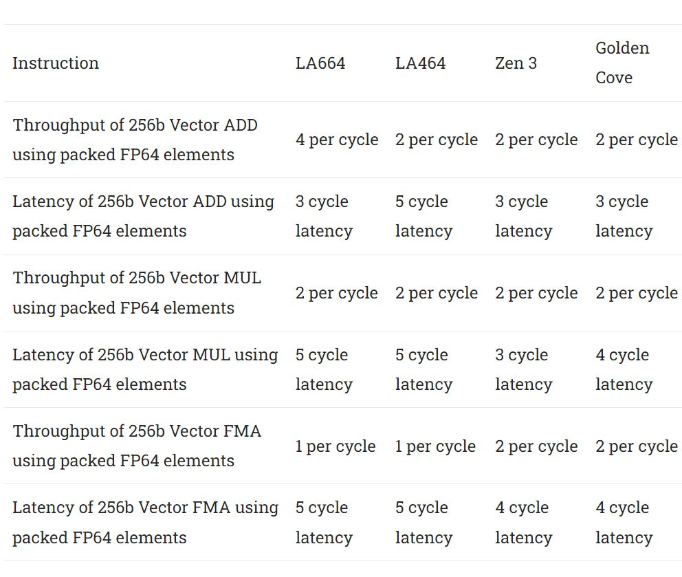

*图 23：表中比较 LA664、LA464、Zen 3 与 Golden Cove。LA664 的 packed FP64 ADD 为 4/cycle、3 cycle，MUL 为 2/cycle、5 cycle，FMA 为 1/cycle、5 cycle。加法吞吐非常强，但乘法和 FMA 并未随四条可见路径等比例扩张，说明不能用“有四条向量管线”概括所有操作。*

标量浮点能力也不完全等同于向量能力。LA664 只能在两条路径上执行标量加法，标量乘法看起来又落在与部分向量操作不同的路径上。网页还指出 LA664 的 FP 加法为 3 周期，与 Zen 3 的表中结果相同；随后又总体评价 Zen 3 与 Golden Cove 仍拥有更低的浮点执行延迟，尤其 Intel 某些操作可到 2 周期。两种说法并不冲突：单一 ADD 延迟相同，不代表 MUL、FMA 或其他标量/向量操作都相同。

FP 调度器从 32 增到 48 项，很可能比增加可见加法端口带来更普遍的收益。更多候选操作能让调度器在依赖链和端口限制之间找到独立工作。Zen 2 的四条 FPU 同样强大，并通过 64 项非调度队列加 36 项调度器扩大可见范围；它能容纳更多在途操作，却不需要让昂贵的 wakeup/select 逻辑同时搜索全部条目。

### 地址生成

地址生成单元（Address Generation Unit，AGU）从两条通用 Load/Store 路径扩展为两条 Load AGU 加两条 Store AGU。标量微基准中，LA664 每周期可处理两个 Load 和两个 Store，总计四个内存操作；LA464 为一个 Load、一个 Store；Zen 3 为三个 Load、两个 Store，但总 AGU 操作数约受限为三个；Golden Cove 可达到三个 Load、两个 Store、总计四个。

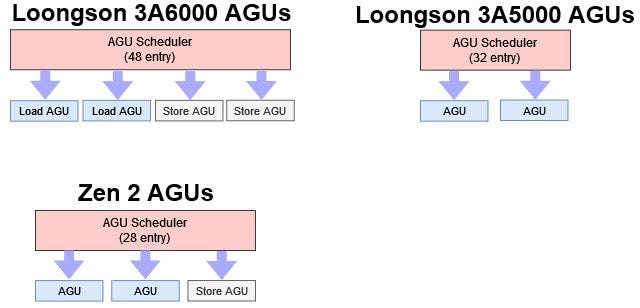

*图 24：LA664 的 48 项 AGU 调度域连接两条 Load 和两条 Store AGU，LA464 只有两条通用 AGU；Zen 2 图中为两条通用 AGU 加一条 Store AGU。专用端口可以简化每条路径，却使 Load/Store 比例决定实际利用率。*

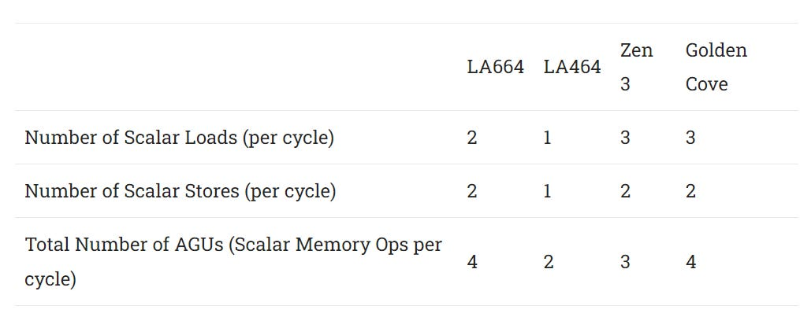

*图 25：LA664 为 2 Load + 2 Store、总计 4 ops/cycle；LA464 为 1+1、总计 2；Zen 3 为 3+2、总计 3；Golden Cove 为 3+2、总计 4。分项峰值不能直接相加，表中“Total AGU ops/cycle”才是混合流的总体限制。*

向量访存则可以完成两个 256-bit 操作，而且 Load/Store 组合较灵活。配合 64 KB L1D，LA664 的前端字节宽度、向量执行和数据通路形成了相对匹配的设计；不过现实程序常有更多 Load，专用 Store AGU 在读密集阶段可能空闲，而 Load AGU 先成为瓶颈。

### 体系结构视角：端口数、调度容量和依赖延迟是三件事

“四条 ALU”只说明特定简单操作的峰值端口数；统一或分布式调度器决定 ready 操作能否及时送到这些端口，指令延迟又决定依赖链多久才能产生下一个 ready 节点。向量加法 4/cycle 与 FMA 1/cycle 同时存在，正说明同一个“向量后端”内部也有功能复用和不同瓶颈。

当调度器里有 ready 操作却发不出去，通常是端口冲突；调度器本身填满但 ready 比例很低，更多是依赖链或 miss 延迟；ROB 还有空间却因某个分布式队列满而停止分配，则是局部结构反压。硬件计数器若能给出 scheduler full、ready-but-not-issued、各端口 busy 和操作类别，就能把三种情况分开。没有端口映射 RTL 时，混合不同操作的冲突微基准比单一峰值更有鉴别力。

## 七、内存顺序与 Store forwarding：常见重叠可用，跨线仍慢

乱序执行允许 Load 越过不相关的旧 Store，但在地址尚未完全确定时必须防止读到旧值。若 Load 与较早 Store 实际重叠，数据可以直接从 Store Queue 转发，而不必等待 Store 写入 L1D；字节掩码、大小、地址对齐和跨 Cache line 情况都会增加匹配难度。

3A6000 的完全包含式 Store-to-Load forwarding 依赖链大约为 7 周期。部分重叠大约为 14 周期，看起来更可能等 Store 接近退休或写入 Cache 后再完成 Load。Zen 2 在对应情况中也约为 7/14 周期，但跨越 64 B Cache line 只增加约 1 周期；LA664 的跨线慢路明显更重。

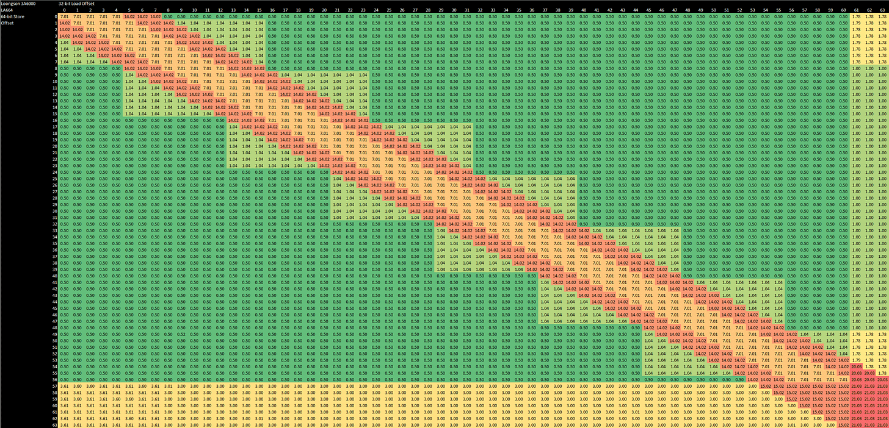

*图 26：测试方法源自 Henry Wong 的 x86 memory disambiguation 微基准，代码由 Chester Lam 改写到 LoongArch。两个轴改变 Store 与后续 Load 的偏移，颜色和数字表示依赖链延迟；完全包含、部分重叠、无重叠和跨 64 B 边界形成不同区域。矩阵显示端到端路径，不足以确认慢请求具体停在 Store Queue、L1D 还是 replay 逻辑。*

*图 27：3A5000 对照矩阵。LA664 延续了上一代的大体模式，未对齐 Store 的附加代价从约 10 周期降到约 3 周期；Zen 2 的类似附加代价约为 2～5 周期。跨 64 B 边界的惩罚则从约 31 降到约 21 周期，虽有改善，仍是显著慢路。*

低频率使“周期数相近”未必等于绝对延迟有利。作为低功耗参照，最高频率约 2 GHz 的 Goldmont Plus 对常见转发约为 5 周期，无法转发时约 10 周期；LA664 的 7/14 周期在真实时间上更长。其改进重点是降低最差对齐组合的额外代价，而不是把基础 forwarding 延迟压到领先水平。

### 体系结构视角：先预测无依赖，错了再 replay

高性能 LSU 通常推测年轻 Load 与地址未决的旧 Store 无关，让它先访问 Cache；若之后发现地址冲突，就取消相关结果并 replay。这个机制提高常见路径吞吐，却要求 Store Queue 保存地址、数据和字节掩码，还要精确找出受污染的年轻操作。部分重叠或跨线请求需要合并多份数据，往往转入较慢路径。

微基准可以分别改变地址是否已知、重叠字节数、对齐和 Cache line 边界，再观察 forwarding 成功、memory-order violation、replay、Store Queue full 与 retirement stall。若越过边界只增加固定几周期，可能是硬件拆分并合并；若延迟接近 Store 退休，则更像无法直接转发。现有矩阵支持 LA664 存在多条路径，却不能唯一确认内部状态机。

## 八、Cache 与内存延迟：周期数改善，绝对时间仍受低频拖累

3A6000 基本继承 3A5000 的层次：每核 64 KB L1I、64 KB L1D、256 KB L2，四核共享 16 MB L3，外接双通道 DDR4。与 Zen 2 的对照中，龙芯 L1 容量更大、L2 更小，两者的四核簇都配 16 MB L3。

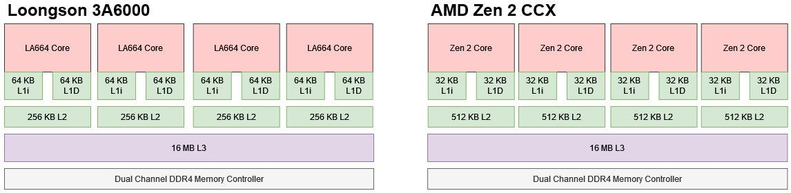

*图 28：LA664 每核为 64 KB L1I/L1D、256 KB L2，四核共享 16 MB L3；Zen 2 每核为 32 KB L1I/L1D、512 KB L2，同样是四核共享 16 MB L3。容量相同不代表延迟、bank、端口和一致性组织相同。*

L1D 从 4 周期降到 3 周期。对于 2.5 GHz 核心，这是一项很有价值的选择：依赖 Load 的绝对延迟约为 1.2 ns，仍不算短，但比四周期减少了 25%。256 KB L2 从 14 降到 12 周期，网页推测如果 L1 对 hit/miss 的判定速度一致，那么 L1→L2 路径可能只减少了一个实际流水级，另一部分变化来自 L1 本身缩短。

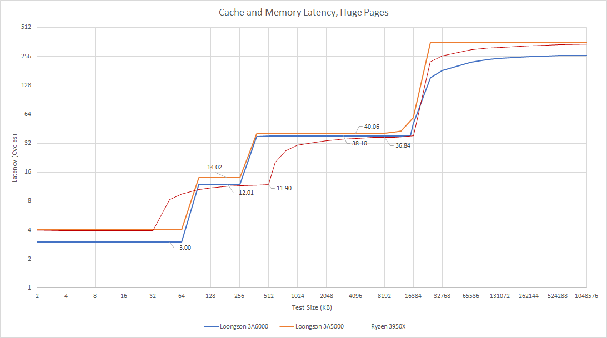

*图 29：横轴为测试规模，纵轴为 latency cycles。3A6000 在 L1、L2、L3 平台约为 3、12、38 周期，3A5000 为 4、14、40 周期；DRAM 区间要结合频率换算，不能只看曲线高度。测试使用大页以尽量降低 TLB 干扰。*

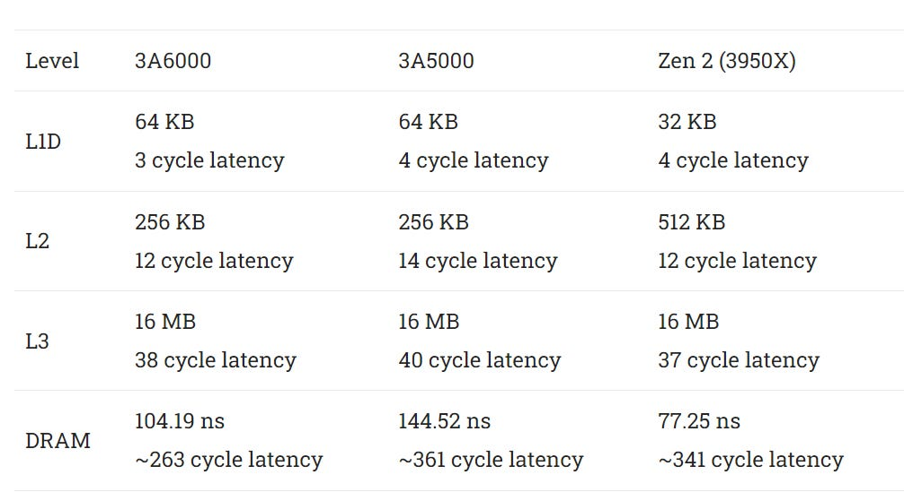

*图 30：3A6000 为 L1D 64 KB/3 cycle、L2 256 KB/12 cycle、L3 16 MB/38 cycle、DRAM 104.19 ns（约 263 cycle）；3A5000 为 4、14、40 cycle 和 144.52 ns（约 361 cycle）；Zen 2 为 32 KB/4 cycle、512 KB/12 cycle、16 MB/37 cycle、77.25 ns（约 341 cycle）。*

L3 容量没有变化，延迟从约 40 降到 38 周期；其中两周期很可能只是 L2 更早确认 miss 后提前进入 L3，而不是 L3 阵列自身发生同幅度变化。3A5000 的 DDR4 控制器表现很差，只因核心频率低，144.52 ns 换算出的周期数没有高到同等惊人，对 IPC 的伤害才被部分掩盖。3A6000 把 DRAM 降到 104.19 ns，说明内存控制器得到实质改进。以周期计算，低频让 104 ns 约为 263 周期，甚至少于高频 3950X 的约 341 周期；但 CPU 等待的是实际时间，不能因为周期数低就忽略 104 ns 在单片双通道 DDR4-2666 平台上仍偏高。

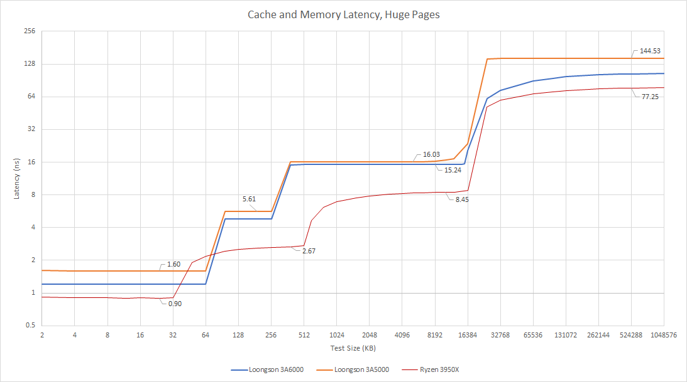

*图 31：换成纳秒后，3A6000 的 L1 约 1.20 ns、L2 约 5 ns、L3 约 15.24 ns、DRAM 约 104.58 ns；3A5000 约 1.60、5.61、16.01、144.58 ns；Ryzen 3950X 约 0.90、2.67、8.45、77.25 ns。LA664 每一级都更慢，这解释了它即使有更大重排序容量和不错 IPC，仍常在绝对性能上落后 Zen 2。*

近年的高性能核心把 L2 作为隔离 L3 高延迟的重要中间层，Zen 4 增到 1 MB，Raptor Lake 甚至达到 2 MB。LA664 仍使用 256 KB L2，虽然 12 周期相当不错，但容量更小会让较多中等工作集提前落入 38 周期 L3。

### 体系结构视角：窗口隐藏的是周期，用户感受到的是时间

ROB 和调度器按周期维持在途工作。低频核心的一个 104 ns DRAM miss 占用约 263 个周期，256 项 ROB 理论上更有机会跨过它寻找独立操作；高频核心面对同样纳秒延迟会消耗更多周期，因此需要更深窗口或更多并发 miss。可隐藏多少延迟还取决于依赖链、Load Queue、MSHR 和内存级并行度，不能把 ROB 条目与 DRAM 周期简单一一对应。

另一方面，依赖 Load 无法靠窗口消除，真实延迟仍由纳秒决定。判断 Cache 瓶颈时，应同时报告 cycle 与 ns，并把 L1/L2/L3 miss、page walk、MSHR full、ROB/LQ full 和平均并发 miss 数串起来。LA664 的三周期 L1D 与更快控制器降低了周期损失，但低频仍让每一级的绝对访问时间落后高频 Zen 2。

## 九、带宽：L1D 很强，L2 普通，DRAM 读写不对称

带宽对向量化和多线程负载尤其重要。LA664 的 L1D 每周期可以完成两个 256-bit 访问，而且可以是任意 Load/Store 组合；换算为总数据宽度就是 64 B/cycle。3A5000 已有与 Skylake/Zen 2 接近的每周期 L1D 能力，3A6000 主要把写带宽翻倍。

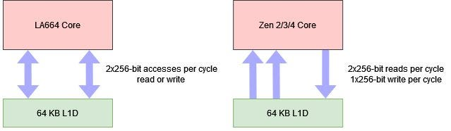

*图 32：LA664 可做两次 256-bit 访问，读写组合灵活；Zen 2/3/4 可做两次 256-bit 读和一次 256-bit 写。前者在 Store 密集流中更灵活，后者在读密集流中具有相同的双读宽度。*

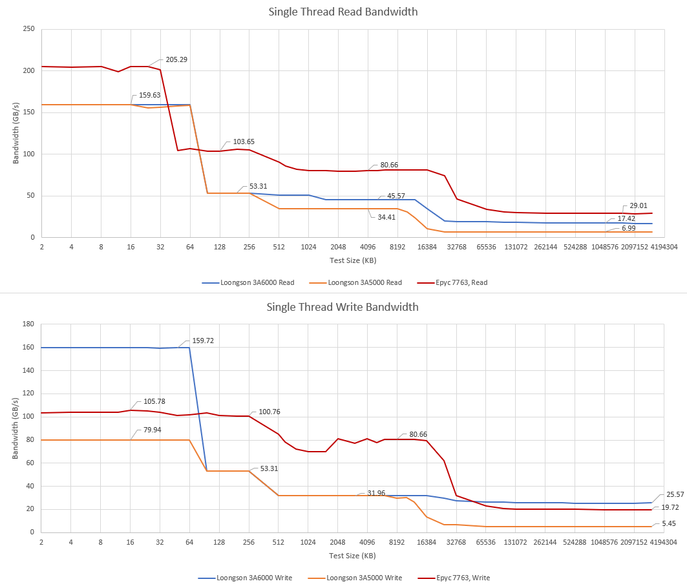

*图 33：上图为读、下图为写，横轴为测试规模，纵轴为 GB/s。3A6000 的 L1D 读写都约 159.6 GB/s，对应 2.5 GHz×64 B/cycle；3A5000 约 79.9 GB/s。图中 EPYC 7763 数据来自测试者手头的 Zen 3 服务器，平台和频率不同，绝对 GB/s 只用于量级参照。*

网页把这项能力写成“每周期 512 bytes 的 Store 带宽”，但两次 256-bit 实际相加为 512 bit，也就是 64 byte。图 32、图 33 和 `2.5 GHz × 64 B/cycle ≈ 160 GB/s` 的换算相互吻合，因此这里更像是正文把 bit 误写成 byte。保留这一处内部口径差异很重要：按 512 B/cycle 解释会比实测高八倍。

L2 没有同幅度扩宽。256 KB L2 的读带宽约 21～22 B/cycle，写带宽与上一代基本相同，低于当时 AMD/Intel 高性能核心；Intel 近代核心可提供约 64 B/cycle 的 L2 路径，差距尤其明显。

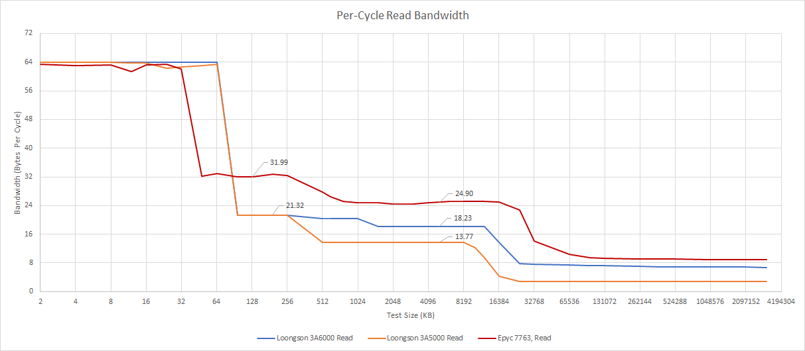

*图 34：纵轴为 bytes/cycle。3A6000 在 L1 约 64 B/cycle，L2 区间约 21.32 B/cycle，L3 区间约 18.23 B/cycle；3A5000 的 L2 约 21.32、L3 约 13.77，EPYC 7763 对应区间约 31.99、24.90。曲线层级边界由工作集推定，不代表每个标注点都只命中单一 Cache。*

L3 单核带宽相较 3A5000 提高约 33%，达到约 18.7 B/cycle，能与较早 Intel 核心相提并论；AMD 强大的 L3 仍然领先。共享 Cache 还必须服务多个客户端。四核、全部硬件线程同时施压时，3A6000 每核仍可获得约 16.55 B/cycle，只比单核略低；3A5000 则从单核约 13.7 降到每核略高于 10 B/cycle，说明旧 L3 复合体存在更强争用。

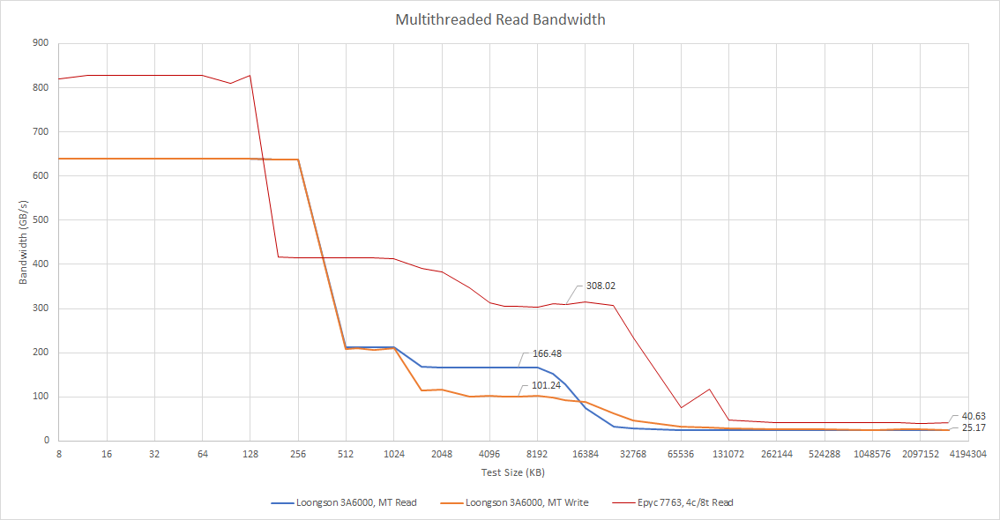

*图 35：横轴为工作集，纵轴为四核聚合 GB/s。3A6000 多线程读取在 L3 区间的标注约为 166.48 GB/s，按四核与 2.5 GHz 换算约为 16.65 B/cycle/core；正文概括为 16.55 B/cycle/core，两者可能来自取点或四舍五入差异。写曲线约 101.24 GB/s，EPYC 7763 四核八线程在对应 Cache 区间约 308.02 GB/s。不同平台频率不同，所以还要结合每核每周期口径。*

DDR4 控制器是上一代最突出的弱点之一。3A6000 的双通道 DDR4-2666 读取达到 23.09 GB/s，接近 Core i5-6600K 的 27.25 GB/s，显著高于 3A5000 的 13.49 GB/s；但 i5-6600K 使用更慢的 DDR4-2133 仍更快，说明龙芯的读取效率仍属普通。标称 DDR4-3200 在这套双通道配置中无法稳定启动，也应算入平台成熟度判断。

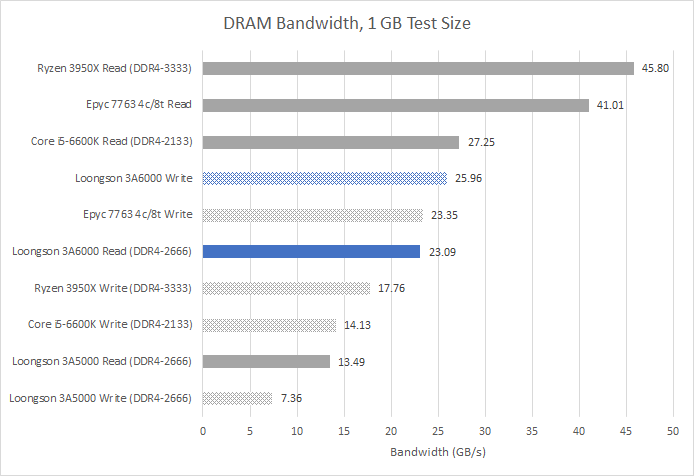

*图 36：3A6000 读取 23.09 GB/s、写入 25.96 GB/s；3A5000 为 13.49/7.36；Core i5-6600K 为 27.25/14.13；Ryzen 3950X 为 45.80/17.76。内存代际、频率、控制器、写策略和测试平台均不同，不能把条形长度直接换成核心 IPC。*

写入 25.96 GB/s 反而高于读取。一种合理解释是：当整条 Cache line 被覆盖且不依赖旧内容时，控制器或 Cache 一致性路径避免了 Read For Ownership（RFO）读取，从而减少总线流量。这个优化只对特定完整覆盖模式明显，现实程序总体又通常读多写少，所以它不能抵消普通读带宽偏弱。

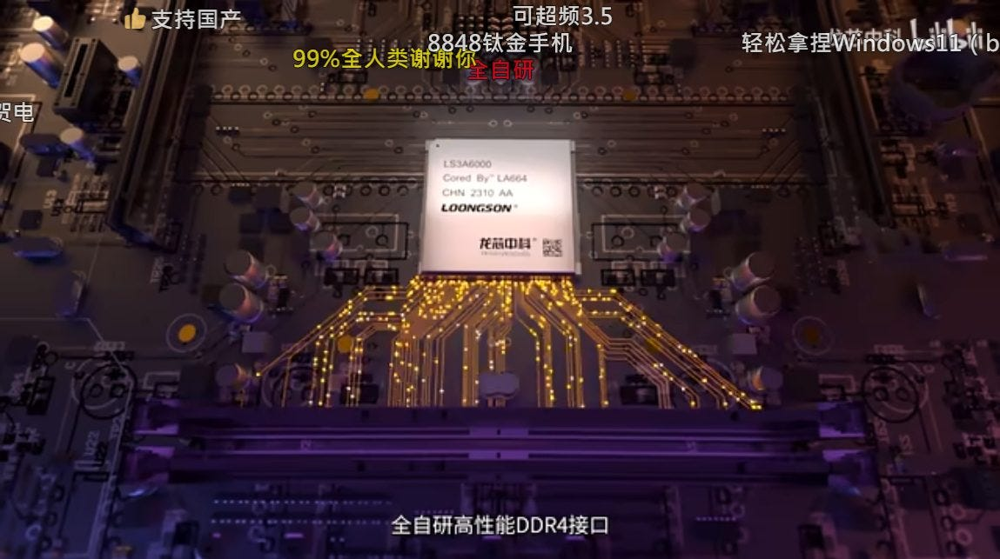

*图 37：公开视频强调“全自研高性能 DDR4 接口”。这能确认龙芯把内存接口作为产品重点，但不提供队列深度、调度算法、bank 策略或 RFO 消除条件；这些实现细节仍只能通过受控访问模式间接观察。*

### 体系结构视角：带宽要沿整条数据通路守恒

执行端口给出理论请求率，L1D bank 与端口决定一级命中吞吐，L2/L3 链路、miss tracking、互连和控制器再决定工作集变大后的持续带宽。LA664 的 64 B/cycle L1D 如果遇到 21～22 B/cycle 的 L2 路径，工作集越过 L1 后就会出现明显台阶；更多 AGU 也无法突破下游链路。

带宽验证应区分读、写、读写混合、单线程、多线程和完整 Cache line 覆盖，并报告 bytes/cycle 与 GB/s。若发射端口未满而 MSHR/refill/fabric 队列满，瓶颈在层次下游；若 Cache 还有带宽却 Load/Store 调度器或 AGU 已满，问题在核心端。图 36 的读写不对称只有在确认访问模式和 RFO 流量后，才能归因到写分配优化。

## 十、核间通信：同簇路径没有异常长尾

核间测试用原子 compare-and-exchange 在核心之间来回传递一个值。矩阵包含 8 个硬件线程：同一物理核的两个 SMT 线程之间约为 11.45～12.05，其余线程组合约为 39.05～39.1。图中没有明确给出单位；结合正文只能确认同核与跨核形成稳定两档，不能自行把数字换算成 cycle 或 ns。

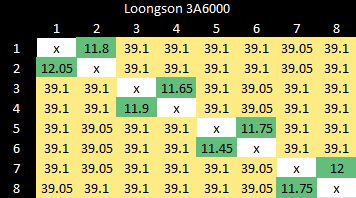

*图 38：对角线为同一线程，绿色格是同一物理核内的 SMT 线程配对，约 11.45～12.05；黄色格是跨物理核，约 39.05～39.1。测试使用原子 compare-and-exchange，包含执行、Cache 一致性和同步协议开销，不是裸互连单程延迟；原图未标单位。*

这组结果没有出现特殊的远端核心或不均匀长尾，是正面信号。它说明四核共享复合体对不同物理核的路径相对均匀，但无法单独分解 L1 所有权转移、L3 tag、snoop、互连排队和原子指令本身各占多少时间。

### 体系结构视角：核间延迟测到的是一致性往返

一个写入方与读取方之间的 cacheline 传递，可能经历所有权请求、目录或 snoop 查询、旧持有者响应、数据转发和确认；这些阶段只有若干会落入当前关键路径，并非机械串行相加。原子 compare-and-exchange 还会加入读改写语义和顺序约束，因此不能把矩阵直接称为 NoC 延迟。

如果要进一步定位，应把只读共享、单向写、写入 ping-pong 和原子 RMW 分开，并改变 line 位置、核心对和并发流量。只有高核间延迟与 probe/retry、fabric queue、L3 lookup 或 cache-to-cache transfer 事件同时上升，才有理由把瓶颈进一步指向某段一致性路径。

## 十一、3A6000 的位置：一次真正的核心代际跃迁

LA664 最值得肯定的并不是某一张表变大，而是几条困难路线同时推进：方向预测接近 Zen 2，间接目标预测大幅扩容，首次 SMT 已能在 7-Zip 和 x264 中带来约 20%～30% 增益，ROB 与调度资源显著扩大，L1D 和 AGU 扩宽，DDR4 控制器也修复了 3A5000 的明显短板。每核单线程时，最终性能大体达到 Zen 1 水平。

对减少外部 CPU 依赖而言，这是很有价值的一步。Zen 1 到今天仍能承担轻量日常任务，3A6000 的可用性也很可能更多受 LoongArch 软件生态、应用移植和编译器质量影响，而不是单纯受微架构性能限制。

但“达到世界一流 CPU 厂商水平”是另一条更高的标尺。Zen 1 当年赢得市场份额，不是因为单核压倒 Skylake，而是因为以合理价格把 6 核、8 核带到消费者平台。3A6000 只有四核，缺少 Zen 1 最重要的产品优势。龙芯公开视频把它与 4 核 8 线程、6 MB Cache、最高 4.3 GHz 的 Core i3-10100 对比；这颗名义上的十代酷睿在核心上更接近 2015 年的 i7-6700K，而同一代 Intel 的中端和高端产品已经是 6、8、10 核并拥有更高加速频率。

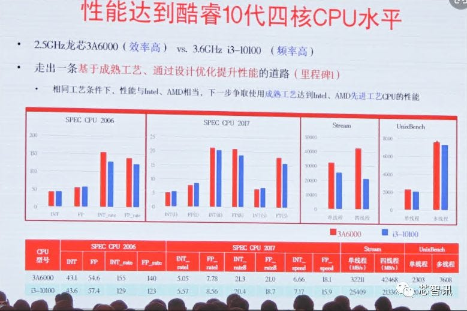

*图 39：龙芯材料以 2.5 GHz 3A6000 对比 3.6 GHz Core i3-10100，列出 SPEC CPU2006、SPEC CPU2017、Stream 和 UnixBench。该图来自公开微信材料，测试配置与本文微基准并不完全相同；它说明龙芯的产品定位，但不能替代统一平台、统一编译参数的独立复测。*

3A6000 很难与 i5-10600K、i7-10700K 或同代 Zen 2 多核产品竞争。前面的核心对核心测试里，3950X 已经明显领先；一旦超过四核，产品差距还会扩大。到 Golden Cove 衍生核心与 Zen 4 所在时代，单核和总核数差距进一步增加，四核也已基本退出 AMD/Intel 主流消费产品线。

即便如此，3A6000 仍是这组材料所观察过的中国 CPU 中最有希望的一款，也比简单沿用 Cortex-A72 的失衡迭代更值得研究。它证明龙芯已经能够完成一颗结构完整、没有单一灾难性短板的宽发射乱序核心；下一步要解决的是频率、核心数、L2/DRAM 数据供给、部分访存慢路和软件生态的系统性问题。

### 体系结构视角：从这代核心可以归纳出的七点认识

1. **预测器升级能释放整颗后端。** LA664 的 ROB、端口和 SMT 都依赖稳定指令流；方向与间接预测从 3A5000 大幅进步，是宽后端真正可用的前提。

2. **六宽的价值取决于层次配平。** L1I 内接近 6 IPC、L1D 达 64 B/cycle 很亮眼，但 L3 指令供给、21～22 B/cycle 的 L2 和普通的 DRAM 读取会在工作集扩大后接管瓶颈。

3. **SMT 首先是公平性与恢复设计。** LA664 用静态分区保护 ROB、寄存器和 Load/Store Queue，再用水位线提高调度器利用率。策略保守，却适合第一代 SMT；未来若改为更积极的竞争共享，性能、QoS 和验证成本会一起上升。

4. **窗口容量不能脱离真实延迟。** 256 项 ROB 和 2.5 GHz 让核心以较少周期跨过一次 DRAM 访问，但用户感受到的仍是 104 ns。低频放大每一级 Cache 的绝对访问时间，深窗口只能隐藏有独立工作的部分。

5. **端口图必须按操作分类阅读。** 四条向量可见路径带来 4/cycle 的 FP64 ADD，却没有把 FMA 提升到 2/cycle；两条 Load、两条 Store AGU 也不等于任意四次 Load。功能复用与指令混合决定持续吞吐。

6. **慢路决定体验下限。** Store forwarding 的常见路径已经可用，跨 64 B 边界仍约多 21 周期；DDR4 写入有优化，普通读取仍偏弱。平均成绩之外，这些边界条件会形成应用长尾。

7. **核心 IP 与产品竞争力之间还有一整层系统工程。** LA664 每时钟能力接近较早的高性能核心，但 2.5 GHz、四核配置、内存控制器、板级稳定性和软件生态共同决定 3A6000 最终能进入哪些场景。微架构进步是真实的，产品代际位置也必须如实保留。

## 参考资料

- Chips and Cheese，*Loongson 3A6000: A Star among Chinese CPUs*：https://chipsandcheese.com/p/loongson-3a6000-a-star-among-chinese-cpus
- Chips and Cheese，3A5000 早期分析：https://chipsandcheese.substack.com/p/loongsons-3a5000-chinas-best-shot
- 龙芯 3A6000 公开视频：https://www.loongson.cn/news/show?id=638
- Henry Wong，*Memory Disambiguation and Store-to-Load Forwarding*：https://blog.stuffedcow.net/2014/01/x86-memory-disambiguation/
- 龙芯公开对比材料：https://mp.weixin.qq.com/s/dMXDPrsCS4rOj7AOPyYOcg
- Chips and Cheese，飞腾 D2000 分析：https://chipsandcheese.substack.com/p/chinas-phytium-d2000-building-on-a72

Chips and Cheese 依靠读者支持持续制作此类微架构测试。可通过 [Patreon](https://www.patreon.com/ChipsandCheese) 或 [PayPal](https://www.paypal.com/donate/?hosted_button_id=4EMPH66SBGVSQ) 支持，也可以加入其 [Discord](https://discord.gg/TwVnRhxgY2) 社区继续讨论。
