# 龙芯能追上西方高性能 CPU 吗：从 Godson-2 到 LA664 的历史回看

> **文章来源**
>
> - 文章：*Can China’s Loongson Catch Western Designs? Probably Not.*
> - 撰文：Chester Lam
> - 首发：Chips and Cheese
> - 发布：2024 年 4 月 29 日
> - 链接：https://chipsandcheese.com/p/can-chinas-loongson-catch-western-designs-probably-not

LA464 与 LA664 是目前看到的中国国产核心中很有希望的设计，每周期性能已经合理；但 3A5000/3A6000 的低频让绝对性能仍落后 Intel、AMD 数代。预测未来很难，这篇文章选择回看龙芯二十年的设计史，判断“不错的 IPC”是否曾真正转化为平衡的产品。

龙芯源自“十五”期间 863/973 项目支持的中科院计算所 CPU 研究。Godson-1 为 32-bit、两宽乱序核心，16 KB L1D/L1I，130 nm、266 MHz；材料没有找到其论文，因此从 Godson-2 展开。

## Godson-2：现代乱序内核，落后的系统层

2003 年 Godson-2 是 64-bit、四宽乱序核心，SMIC 180 nm、434 MHz、41.54 mm²。

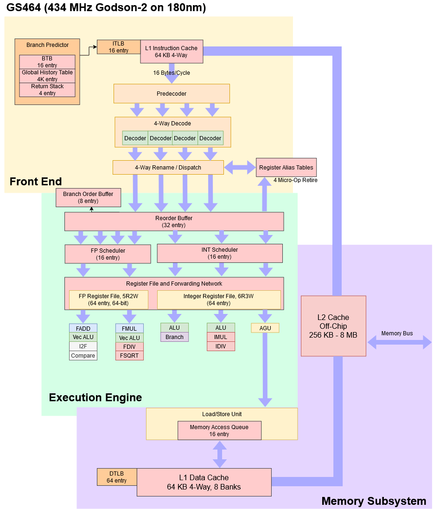

*图 1：根据论文资料绘制，展示四宽前端、乱序执行与 Cache/TLB。*

同期 AMD K8 是三宽 x86-64，130 nm SOI、约 193 mm²，Athlon 64 FX-51 可到 2.2 GHz。

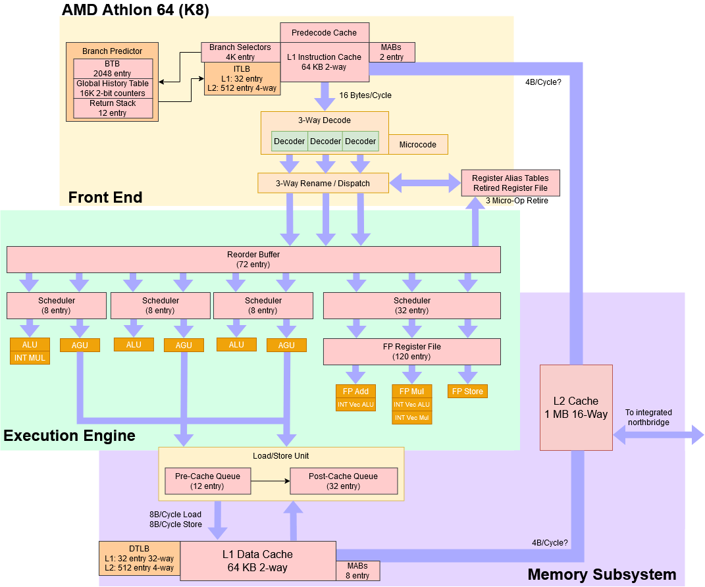

*图 2：K8 L2 容量因实现而异。其乱序窗口更大，吸收延迟更强；即使两者 IPC 接近，五倍左右频率差也决定最终性能。*

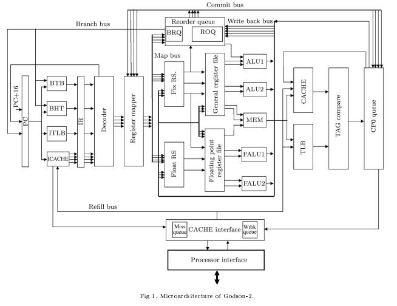

*图 3：两级方向预测与基于物理寄存器文件（PRF）的乱序方案在当时相当现代；但寄存器仅 64-bit，PRF 减少宽数据搬运的优势尚不突出。*

系统侧更落后：L2 在 Die 外，而 Intel/AMD 已转向全速片上 L2；没有 L2 TLB，大工作集还会承受更多 Page Walk。功耗约 2～3 W@400 MHz，作为低功耗设计取舍合理，也证明团队能做宽乱序核心，并清楚下一步需要更准预测、SMT、片上 L2、SMP Coherence 和集成 DDR Controller。

## Godson-2E：更深 Pipeline 换 1 GHz

2006 年 Godson-2E 由“十一五”支持，STMicroelectronics 90 nm、7 Metal、4700 万 Transistor、36 mm²；频率升到 1 GHz，功耗 5～7 W。

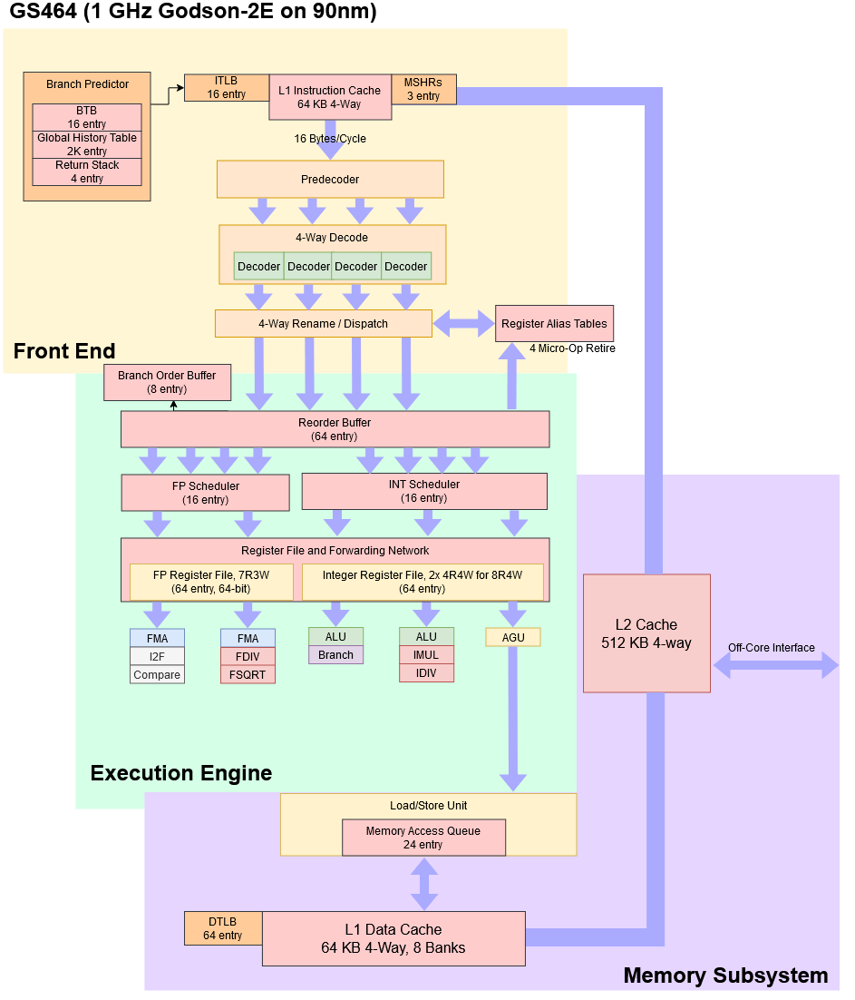

*图 4：相比 Godson-2，目标从 2～3 W/400 MHz 抬高。*

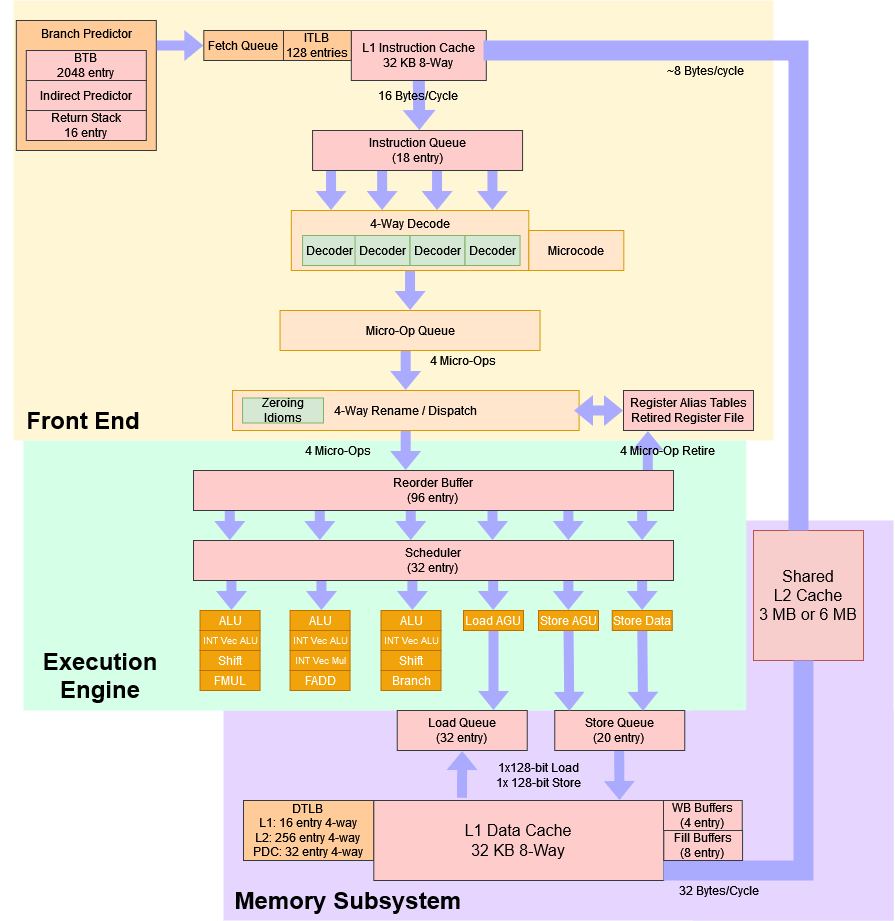

*图 5：2006 年 Intel 用放大的 P6 路线摆脱 Pentium 4 的低效率；AMD K8 则借新制程提升频率并做双核。*

Godson-2E 把七级 Pipeline 加深为九级，在前端多 Predecode、Mid-core 多 Dispatch；Integer RF 做两份副本，以较少 Port 换频率。Bulldozer 后来也使用 RF 复制，说明它不是反常技巧。

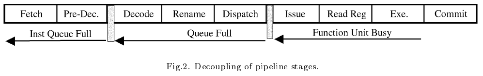

*图 6：更深 Pipeline 提高频率，也会增加 Redirect/Recovery 成本。*

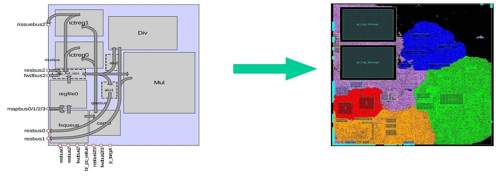

*图 7：物理实现展示寄存器副本与执行簇。*

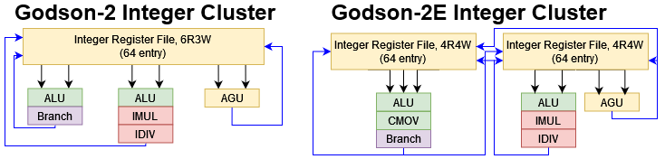

*图 8：用面积换更短 Wire/更少 Port。*

TLB 也改用 Custom RAM Macro，移除通用 Standard-cell 路径中的不必要步骤。

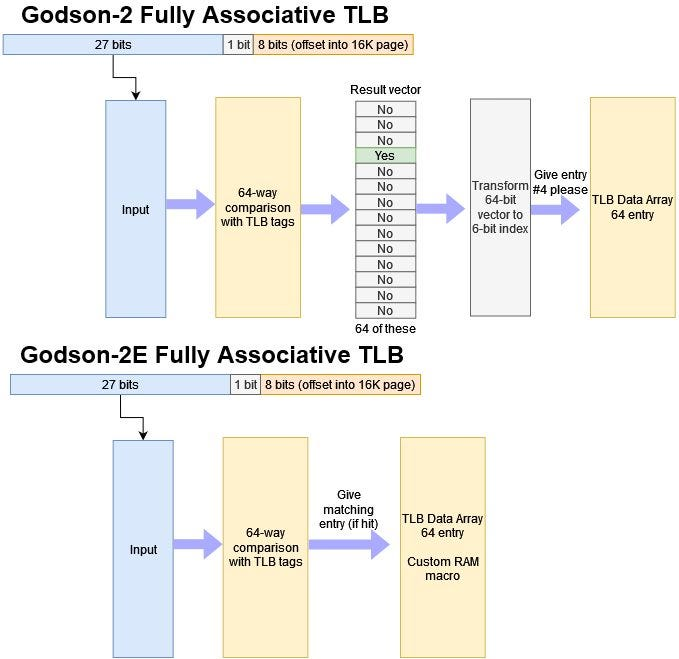

*图 9：频率由最慢路径决定，不能只优化 ALU。*

IPC 侧扩大 ROB，并加入 512 KB、4-way、9-cycle 片上 L2 和 Memory Controller。但 Athlon FX-62 2.8 GHz 的 L2 约 4.6 ns，Godson-2E 约 9 ns；两者 L2 都为 4 B/cycle，绝对带宽分别约 11 与 4 GB/s。

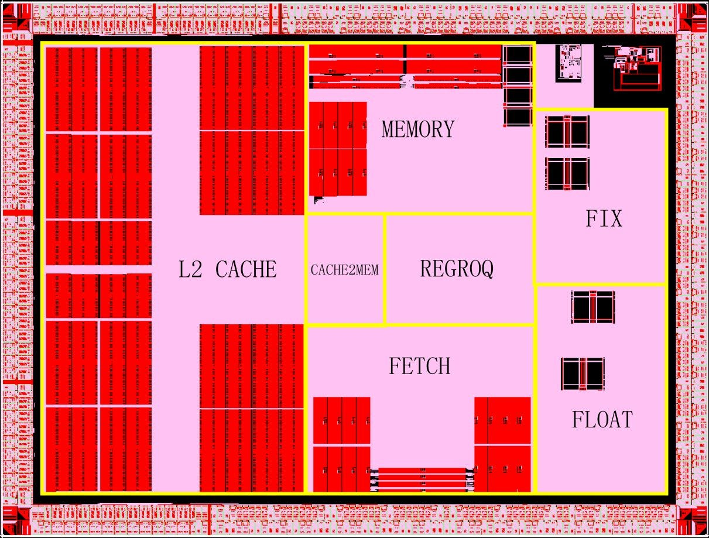

*图 10：片上 L2 是正确方向，但延迟与频率仍落后。*

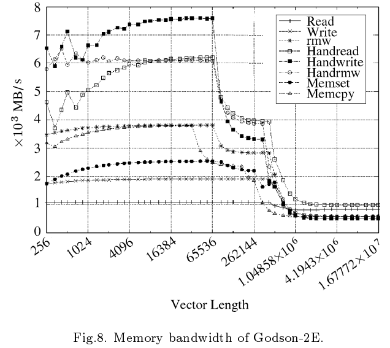

*图 11：L1D 8 B/cycle、L2 4 B/cycle，Memory Controller 仅约 1 GB/s。*

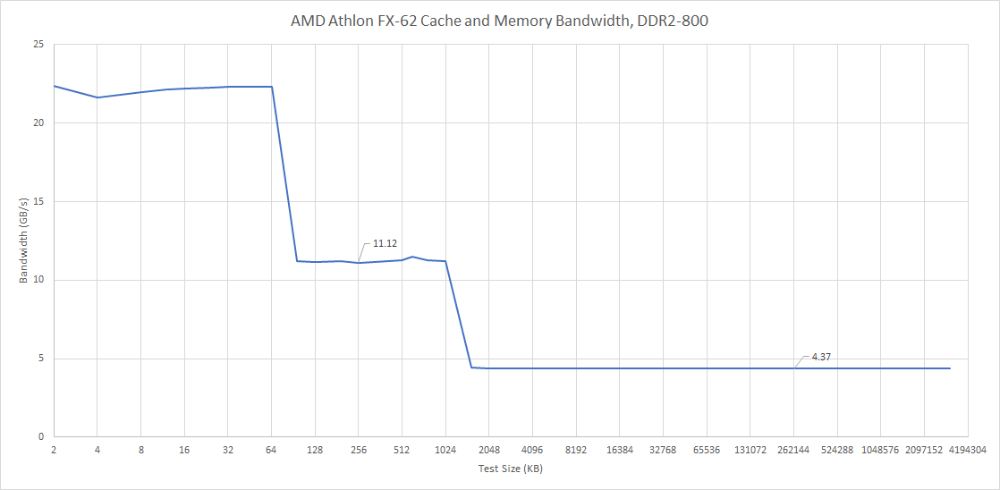

*图 12：AMD 约为四倍；平台不同，图用于说明数量级。*

### 体系结构视角：频率、IPC 与存储系统必须同时闭环

加深 Pipeline、复制 RF、定制 TLB 都能改善 Critical Path；但更深 Pipeline 需要更好的预测，更高频又把 Cache/DRAM 的纳秒延迟换算成更多周期。如果 Memory Controller 只有 1 GB/s，执行宽度和 ROB 很快被数据饿住。真正的高性能核心是时钟、窗口、预测和存储层次共同平衡，而非某一项接近前沿。

## Godson-2G：核心停滞，资源投入二进制翻译

Godson-2G 把 GS464 移到 ST 65 nm，L2 扩为 1 MB、DDR2/3 Controller 略提 IPC，但核心频率和结构没有明显进步，Die 反增到 53.54 mm²。

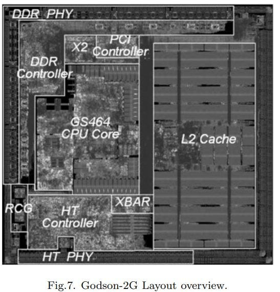

*图 13：面积增长很可能主要来自 L2。*

MIPS64 软件生态弱，团队加入 x86 Flag 辅助指令、2×64 Load/Store，让 `FLD+FMUL+FSTP` 可用八条指令模拟；Decoder 还跟踪 x87 Top-of-stack，并实现 L1D/L1I Coherence，减少动态翻译写代码后的昂贵 I-Cache Flush。

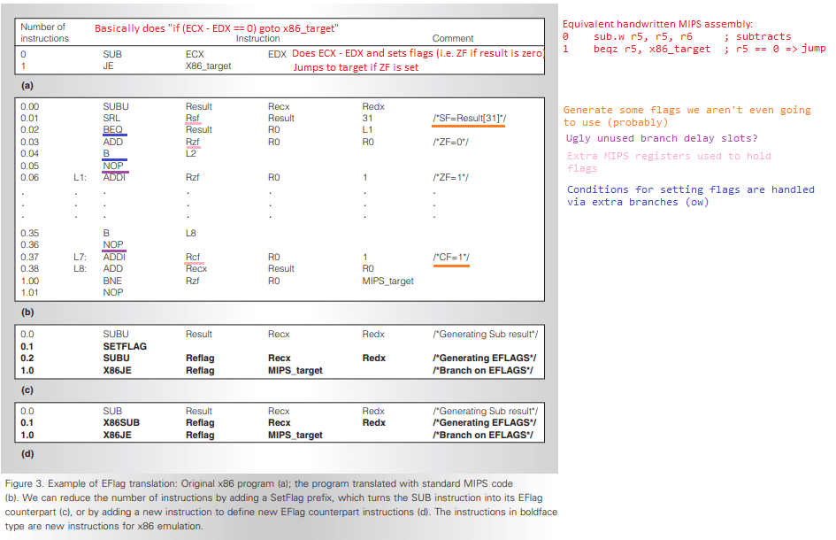

*图 14：彩色标注展示 Flag 等语义如何映射。兼容层投入解释了核心若干年的小步变化；Apple 与后来的 Arm64 迁移同样要付生态成本。*

## Godson-3：四核、共享 L2 与 HyperTransport

2008 年 Godson-3 把四颗 GS464 放在 8×8 AXI Crossbar 上，共享 4 MB L2；ST 65 nm、173.8 mm²、1 GHz、5～10 W，并接入 HyperTransport 以扩到多 Die。

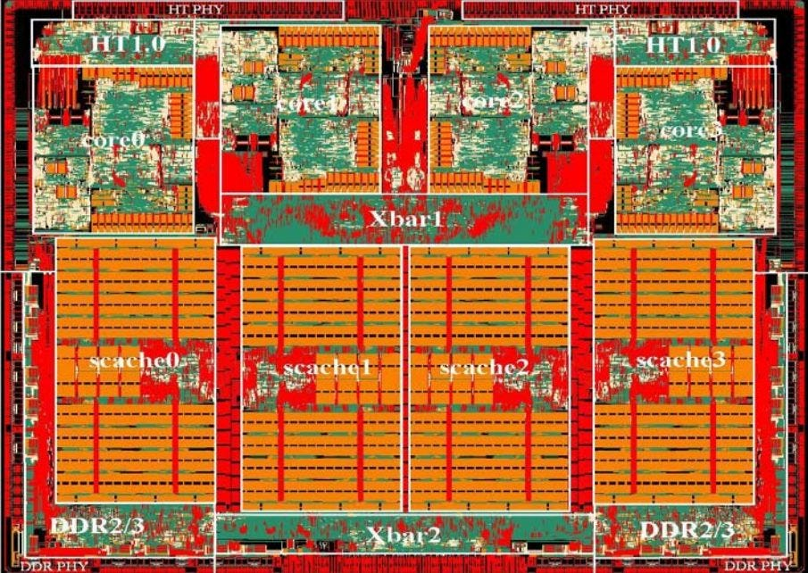

*图 15：从单核进入 Cluster/Interconnect 时代。*

同期 Nehalem 四核以 Global Queue Crossbar 连接共享 8 MB L3，每核另有 256 KB L2；QPI 支持多 Socket。

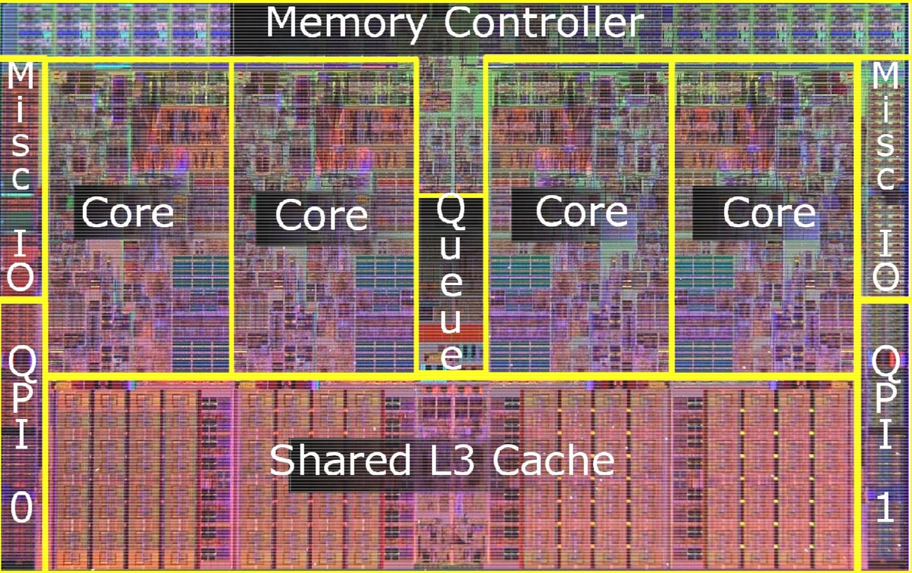

*图 16：三级 Cache 隔离 L3 延迟的组织延续至今。AMD K10 也用 Crossbar + 2 MB L3，但频率从 K8 的 3 GHz 以上回落到约 2.6 GHz。*

## Godson-3B/GS464V：256-bit+FMA，算力仍被频率和供数约束

2011 年 Godson-3B 开始同时署名中科院与龙芯中科。GS464V 加入 256-bit Vector；同期 Sandy Bridge 也有 256-bit，但 GS464V 率先支持 FMA。

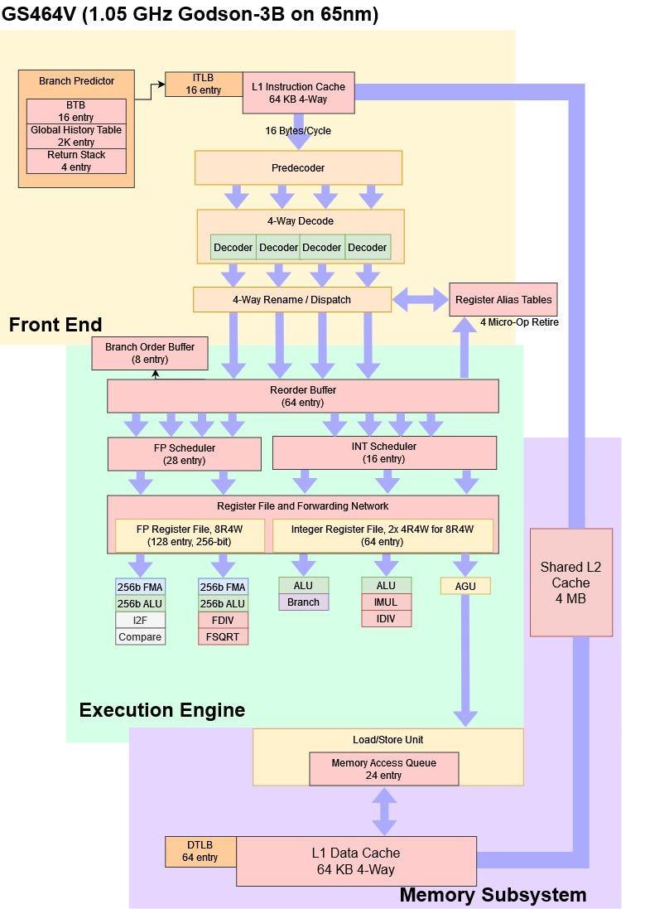

*图 17：八核向 FP Throughput 倾斜。*

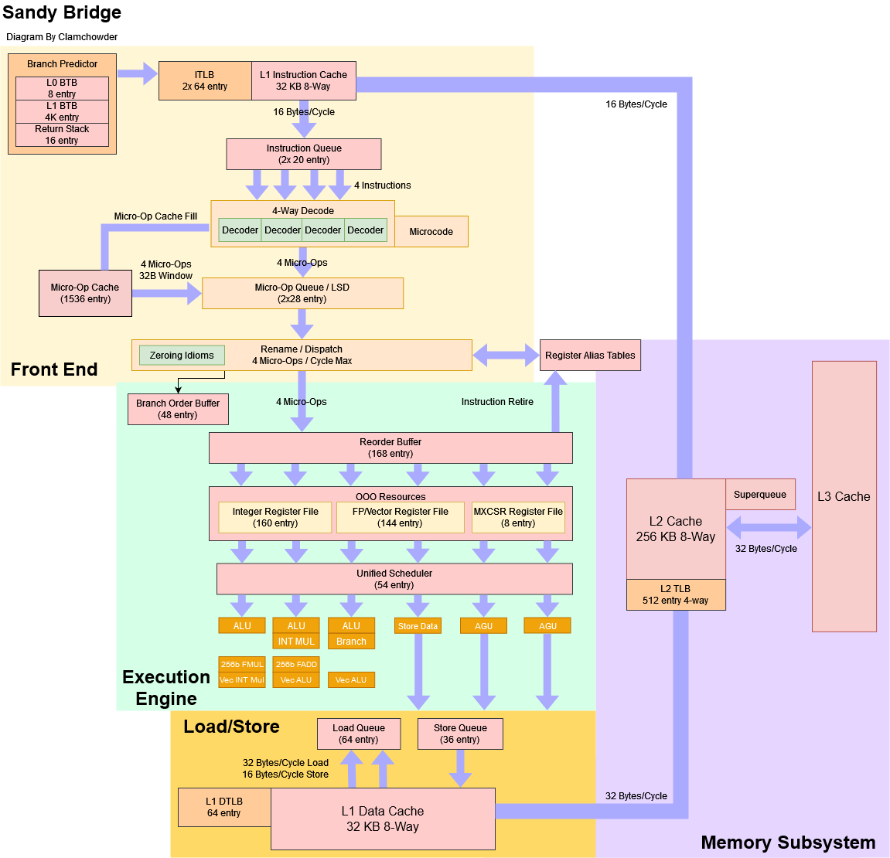

*图 18：Sandy Bridge 频率超过两倍，ROB 又超过两倍，其 Unified Scheduler 也大于 GS464V Integer+Vector Scheduler 总和，抵消理论每周期浮点优势。*

两组四核形成八核，4 MB L2（可能每 Cluster 2 MB），Die 299.8 mm²；双通道 DDR2/DDR3 理论 12.8/25.6 GB/s。

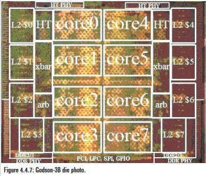

*图 19：Cluster Cache 和 Memory Bandwidth 很难喂满八个宽向量核心。*

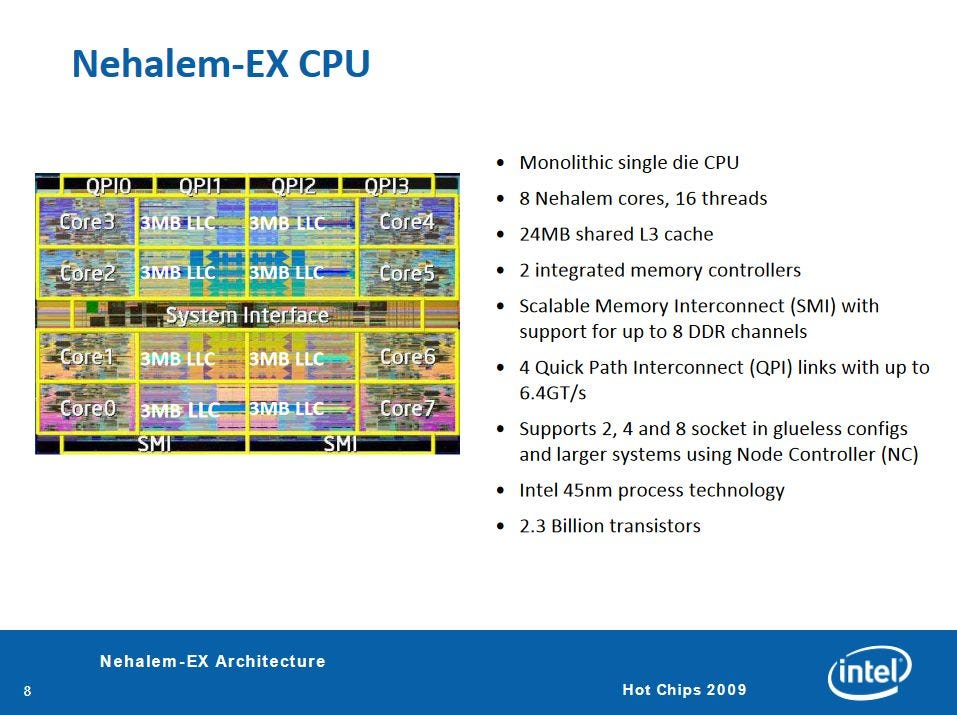

*图 20：Intel 八/十核共享最高 24 MB L3、四通道 DDR3。Godson-3B 理论 FP32 为 256 GFLOPS，高于 2.27 GHz Nehalem-EX 的 145.28 GFLOPS，面积和功耗也更低，但可用性能受 Cache/DRAM 限制。*

## 3B1500：加中层 Cache、换 32/28 nm

ISSCC 2013 的 3B1500 把八核 GS464V 移到 ST 32 nm，LLC 增至 8 MB（可能每 Cluster 4 MB），每核加 128 KB 中层 Cache。1.1 V 时 1.2 GHz、1.3 V 时 1.5 GHz；28 nm 版从 182.5 缩到 140.8 mm²。

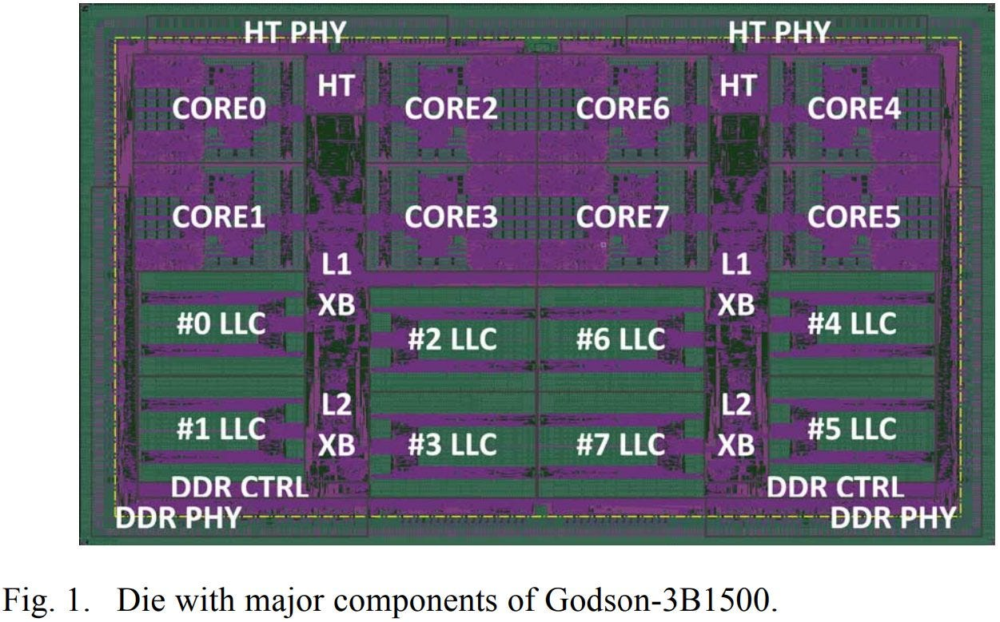

*图 21：论文又给出约 1～1.35 GHz 的实现范围，资料口径需并列保留。*

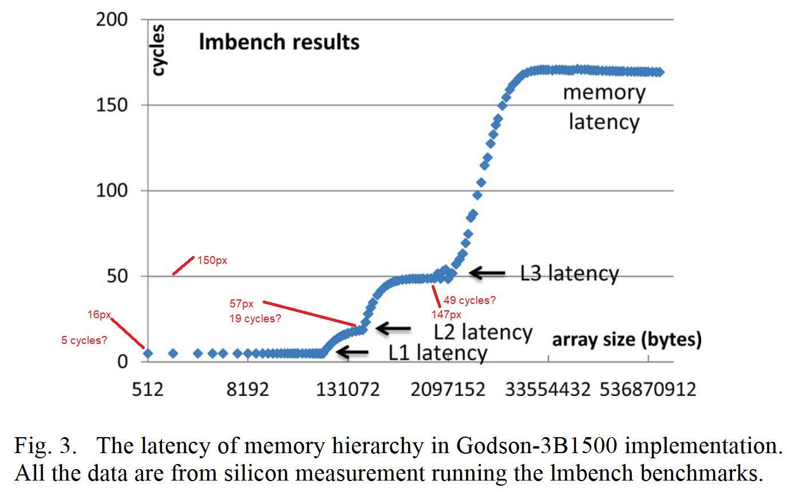

*图 22：1.25 GHz Core、1 GHz L3、DDR3-1066，像素估算 L2 约 19 周期；Haswell 256 KB L2 约 12 周期、容量还大一倍。*

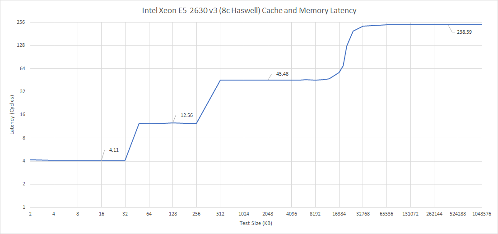

*图 23：L3 独立 1～1.1 GHz，周期延迟与八核 Haswell 近似；低核心频率让 DRAM 以周期计看似更少，不能误解为绝对时间更快。*

## GS464E：窗口终于变大，物理实现却倒退

团队研究 POWER7、Ivy Bridge、Cortex-A9，显著扩大 ROB、Scheduler、Branch Ordering Queue、Memory Access Queue；1024 项 L2 TLB 改善翻译，第二 AGU 让每周期可做两次 Memory Access。

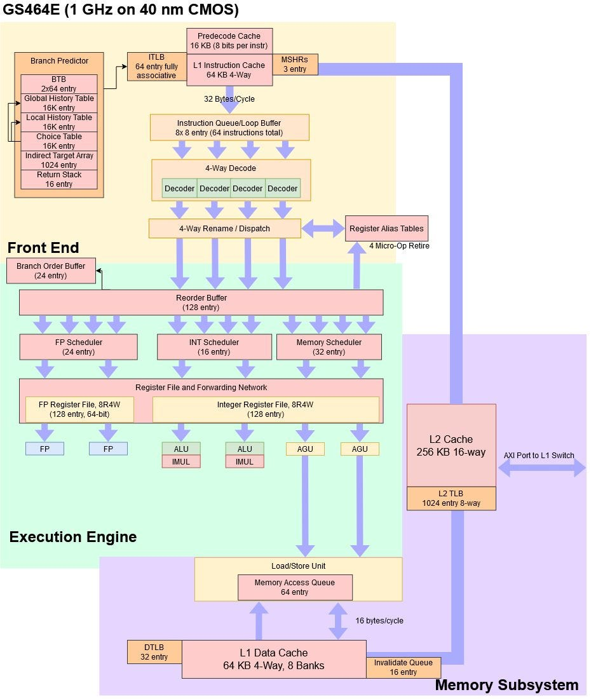

*图 24：容量升级针对 GS464 已过时的窗口。*

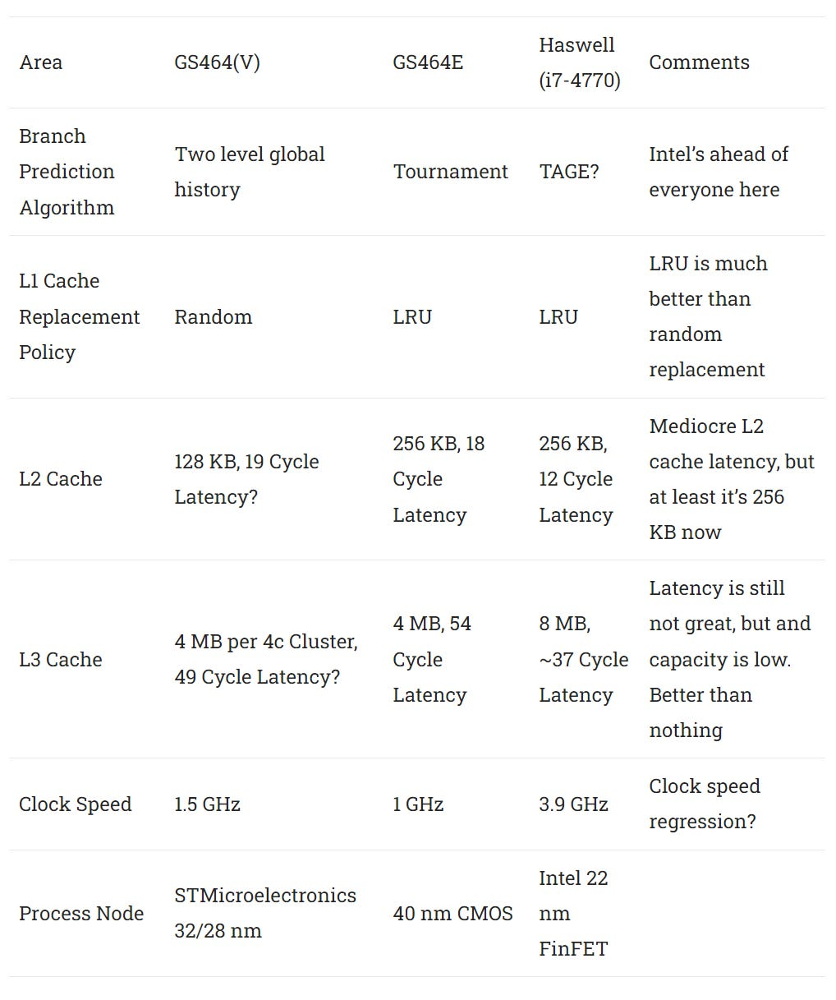

*图 25：执行端大体不变，GS464V 256-bit Vector 被取消，可能因面积/功耗。*

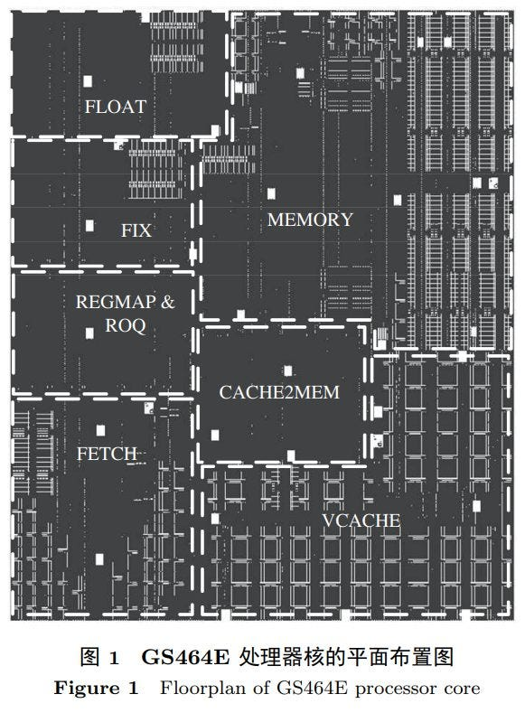

*图 26：每周期能力拉近，但仍落后 Sandy Bridge/Haswell。*

四核 3A1500 在来源未明的 40 nm 上竟达 248.6 mm²，比八核 32 nm 3B1500 的 182.5 mm² 更大、频率还低。论文称相对 1 GHz、65 nm 3A 的 SPEC CPU2000 Integer 分高 54.9%，若频率从 1.5 降到 1 GHz，大半得分增益会消失。可能与国产 40 nm 节点或大结构难收频有关，但材料不能唯一定位。

## LA464、LA664：IPC 快进，2.5 GHz 仍是硬墙

LA464 转向 SMIC 12 nm、2.5 GHz，扩大 Scheduler/Load/Store Queue，并增加两条 ALU Port。

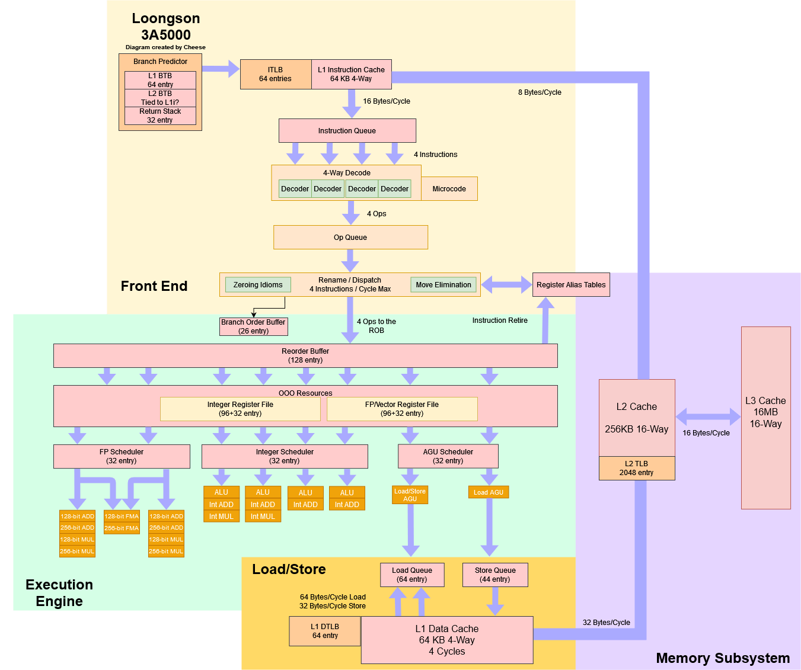

*图 27：每周期能力合理，频率仍不足。*

LA664 是更大的架构更新，在 3A6000 上显著提高 IPC。

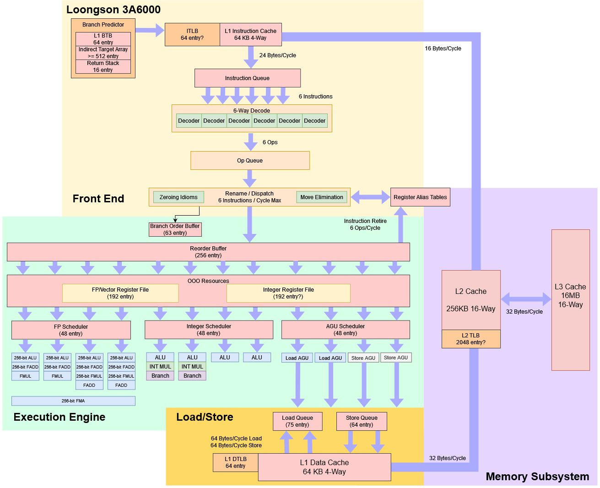

*图 28：单看 3A5000→3A6000 两点会得到过于乐观的趋势线；2003～2006 年 Godson-2 系列也曾快速进步，之后仍长期受频率限制。*

Papworth 对 Pentium Pro 的提醒同样适用：若为同频性能牺牲永远影响频率的 Pipeline，就不是好目标；只追高频却牺牲 CPI 也无意义。Apple 以更宽核心、更大 Window/L1 换取高 IPC，仍需要 3 GHz 以上。龙芯没有同等资源优势，频率还更低。

## 核心数与软件：两条同样艰难的扩展轴

2024 年 3A6000 仍只有四核，同价位市场已普及八核；7950X/14900K 把昔日服务器级多线程带到消费级。多核还需要灵活 Interconnect。旧 HyperTransport 把 Cluster 拼成 NUMA，要求软件感知；AMD/Intel 已能做 16 核 UMA，通用程序更容易扩展。

软件侧，龙芯一度存在两套二进制不兼容的 Linux ABI 生态，应用优化又远少于 x86/Arm。LBrowser v3 基于 Chromium，但 Speedometer 3.0 表现很低。

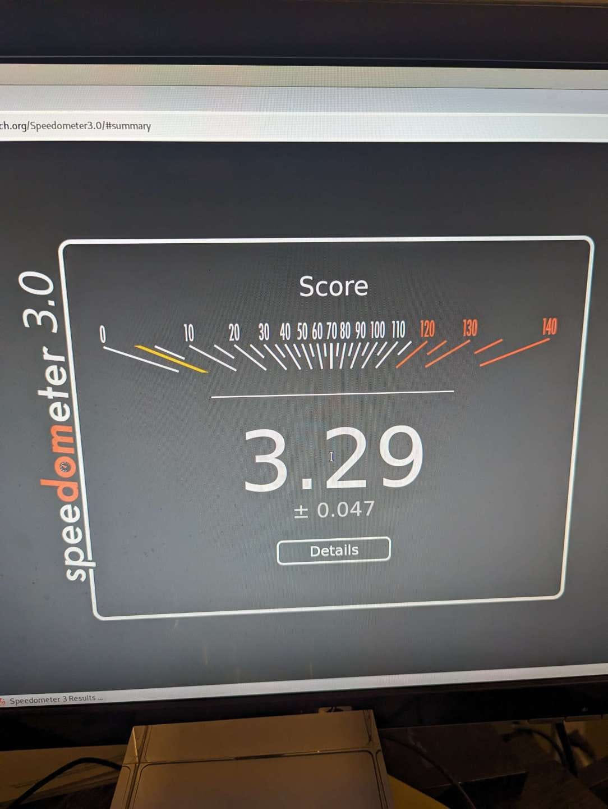

*图 29：Ryzen 3950X+Chrome 得 15.9，差距约 483%；而 libx264 两边都有手写汇编时，Zen 2 只快约 40%。这说明生态优化可能放大硬件差距，但浏览器和版本不同，不能全归因于 CPU。若再用 x86 Binary Translation，原生性能本已落后，余量更小。*

## 结语：文章为何给出悲观判断

文章认为，龙芯长期能做出不错的 IPC，却从未同时解决高频、核心数和软件生态，3A5000/3A6000 仍延续这一模式。先进节点能帮助频率与密度，但“完全国产”的目标限制了工艺选择；连 AMD 依赖 TSMC 5 nm，Intel 也会使用外部 Foundry。全球专业化的收益很难由单一国家在每一环同时复制。

这是基于 2024 年已见产品和历史轨迹的判断，不是技术上证明“永远不可能”。LA664 的 IPC 进步是事实；未来能否改变频率、互连与软件约束仍需看后续产品。评估也不能把政治目标、产业供应链与单个微架构分数混成同一层证据。

## 参考资料

- Chester Lam, *Can China’s Loongson Catch Western Designs? Probably Not.*, Chips and Cheese, 2024-04-29
- Hu 等，Godson-2、Godson-3、Godson-3B/3B1500、GS464E 论文（网页参考列表）
- David B. Papworth, *Tuning the Pentium Pro Microarchitecture*
