# Neoverse N1 对 Zen 2：现实中的 Arm 与 x86

> 英文标题：Neoverse N1 vs Zen 2: ARM in Practice
> 撰文：Chester Lam
> 首发：Chips and Cheese，2021 年 8 月 5 日
> 链接：https://chipsandcheese.com/p/neoverse-n1-vs-zen-2-arm-in-practice

如果假设生态、工艺和设计目标相同，Arm 与 x86 ISA 本身不会给高性能核心带来决定性差异。现实产品却不满足这些假设。本文比较 3 GHz、四核 Ampere Altra 云实例中的 Neoverse N1，与关闭 SMT、仅开四核的 Ryzen 9 3950X Zen 2，并辅以 Skylake 等平台。

两者都在 2019 年发布、使用 TSMC 7 nm，但目标不同：N1 源自手机 Cortex-A76，追求服务器密度；Zen 2 覆盖笔记本、桌面、服务器和超算，核心更深、更宽、频率更高。重点应是各自是否完成设计目标，不是把绝对胜负归因于 ISA。

## RSA-2048：N1 的整数短板

OpenSSL `speed -multi 4 rsa2048` 测四线程签名；Signs/s 可看作 HTTPS 连接公钥阶段的吞吐上界。

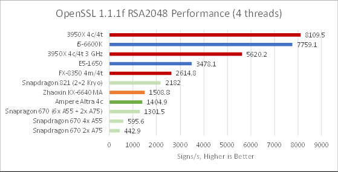

Zen 2 同为 3 GHz 时超过 N1 四倍，Boost 后超过五倍。Cloudflare 曾把部分差距归于 Arm 缺少相应 64 bit Multiply、x86 可每拍执行两条 Add-with-carry；但更老、频率更低的 Snapdragon 821 仍比 Altra 快 55%，说明不只是 ISA。

Sandy Bridge 没有 ADCX/ADOX，三个 Integer Pipe 占用超过 70% 时仍有合理性能；N1 也有三条 ALU，却连双 ALU 的 FX-8350 同频都不如，像是 N1 实现对该依赖模式利用不佳。

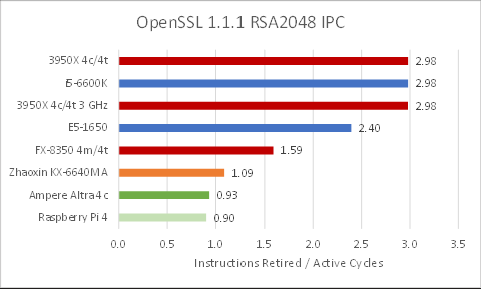

N1 的 IPC 并不高，说明它不是“执行大量简单指令但仍很快”，而是三条 ALU 没被有效喂饱。

## 7-Zip：同频差约一代

7-Zip 默认设置重压缩率、计算密集。

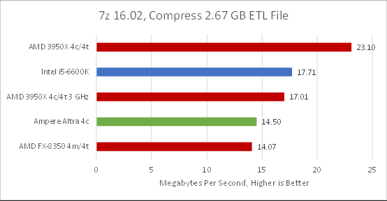

Zen 2 Boost 时快近 60%；锁 3 GHz 后领先 17.3%。按每周期性能看，N1 大致落后一代，与其小核目标相称。

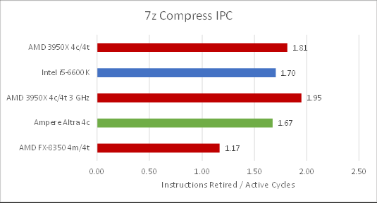

Zen 2 低频时 IPC 高 7.7%，说明内存延迟/带宽占比明显，因为这些延迟不随核心频率缩短。N1 同频 IPC 接近 Skylake，后者较小 L3 可能增加 Miss。

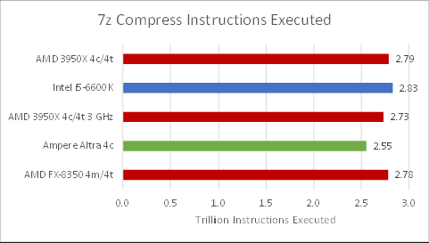

x86 执行指令略多，可能来自 WSL System Call 转换或每秒读取 PMU 的不同开销；差距不大，IPC 仍大致可比。

## 编译 gem5：N1 的强项

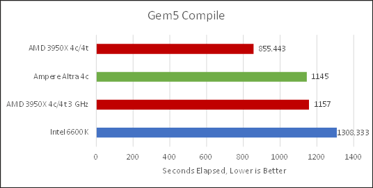

同频下 N1 领先 Zen 2 约 1%，很适合其服务器目标。Zen 2 Boost 后只快 25.2%，远小于其他负载；Skylake 则意外落后。

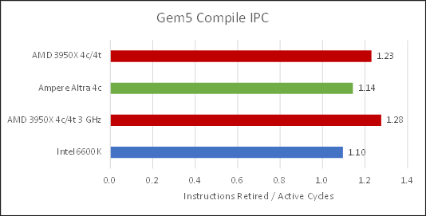

所有核心 IPC 偏低，高频又使 IPC 下降，说明 Cache/Memory 更重要。文章因时间没有进一步定位。

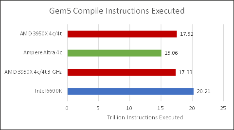

x86 指令数高得更多，Zen 2 与 Skylake 之间的差距也大到不像单纯误差，可能是编译器按目标架构走了不同优化路径。

## x264：成熟优化仍偏向 x86

测试用 ffmpeg 转码 4K Overwatch 片段，`veryslow`、`-crf 25`。libx264 已有 AArch64 手写汇编。

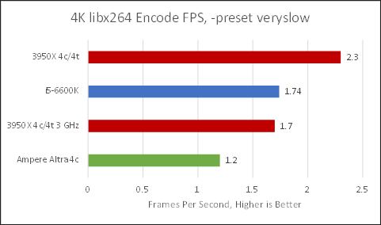

Zen 2 同频快 41.6%，Boost 后快 91.6%。两边输出文件并不完全相同：Arm 文件略大、SSIM 0.985163，x86 为 0.985166，可能说明 Arm 优化更倾向速度；肉眼差异不可见，但比较并非完全相同工作量。

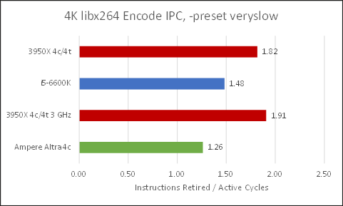

N1 的 1.26 IPC 不差，但 Intel/AMD 更强。

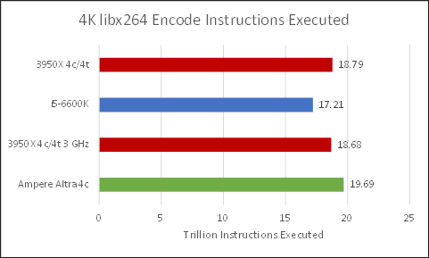

各 ISA 指令数接近，说明 libx264 两边都相当成熟；AVX 并没有让 x86 指令数出现数量级差异。

## x265 与 AV1：软件生态的极端反例

HEVC/x265 可用同质量换约 25%～50% 更小文件。

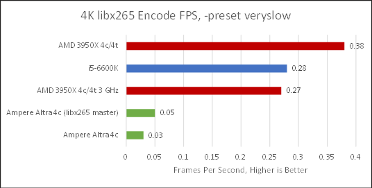

N1 近 15 小时，Zen 2 约 1.5 小时；同频也约快九倍。Ubuntu 20.04 的 ffmpeg 未使用 NEON。换最新源码、启用 2020 年初加入的 AArch64 汇编后，N1 快 66%，但 Zen 2 同频仍快 5.4 倍。

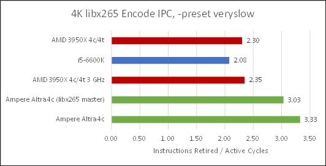

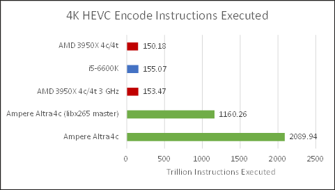

N1 完成任务要执行约一个数量级更多指令，尽管 IPC 很高也追不回。这更多是软件优化覆盖，而不是 N1 硬件单独的错误。移动 Arm 平台通常用固定功能 Video Engine，开发者缺少优化 CPU Encoder 的动力。

libaom-av1 中 Zen 2 约 0.3 FPS，Altra 数日仍未完成；文章未测 SVT-AV1，预计同样受手写汇编生态影响。

### 体系结构视角：同一“Benchmark 名”也可能不是同一执行路径

库会按 ISA、Compiler Flag 和运行时探测选择 Scalar、NEON、AVX2 或手写 Assembly。比较前必须记录版本、构建方式、输出质量和动态指令数。高 IPC 只说明机器忙，不说明完成同样工作所需指令少；x265 正是 IPC 与性能方向相反的例子。

## Blender：回到同一数量级

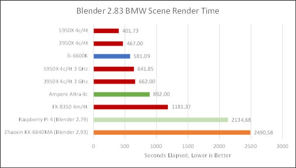

Altra 比 Boost Zen 2 慢 91%，同频差距缩至 34.7%。Arm 在 3D Render 的软件积累也较少，N1 大致落后约两代，却仍在可用范围。

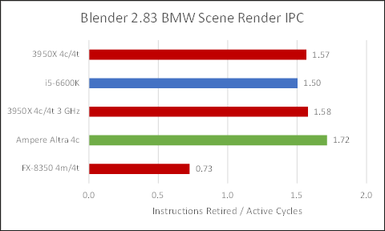

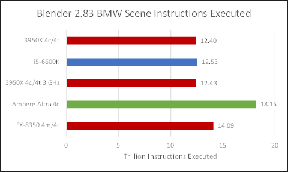

N1 比 x86 多执行约 45%，AVX2 可能提供优势；但不像新 Codec 那样相差数量级，N1 也能更快处理较简单指令。

## Branch Predictor：N1 更快，Zen 2 更准

错误路径既浪费性能也浪费功耗。应用 MPKI 显示 Zen 2 在 Blender 最准，Skylake 次之，N1 胜过 Piledriver 但明显落后现代 AMD/Intel。

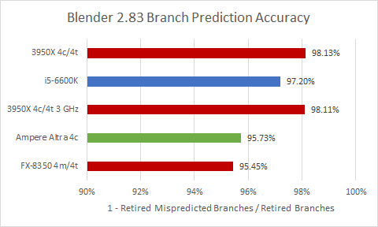

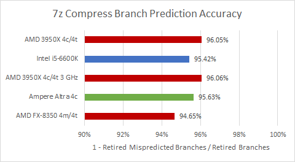

7-Zip 更难预测，Zen 2 仍领先；N1 略胜 Skylake。

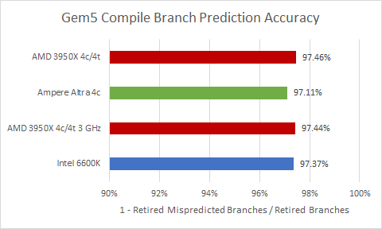

编译中各核心非常接近，可能存在少量所有预测器都难处理的 Rare Branch。

Pattern Test 用随机 0/1 Array 驱动条件 Branch；短 Array 可被历史记住，长度增长后误预测上升。这是团队首次尝试，数据和解释都需谨慎。

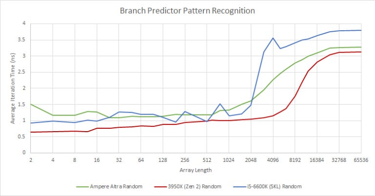

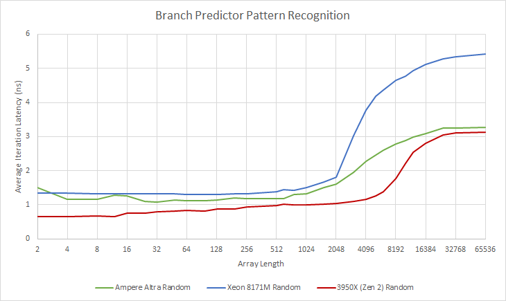

N1 在 Pattern 长度超过 512 后开始变差，2048 后更明显；Skylake 在 2048 后突降，Zen 2 到 4096 后才突降。该现象支持 Zen 2 历史识别更强，但不能仅凭曲线确定预测算法或表容量。

方向准确之外，Target 必须及时返回。Taken Unconditional Branch Test 基本测 BTB 延迟，方向和目标恒定。

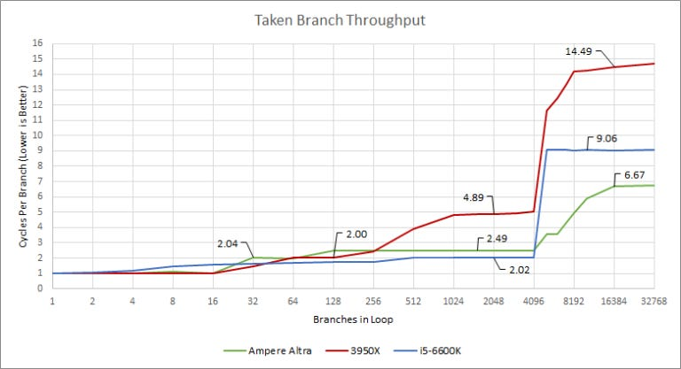

面向 Web 的 N1 有很快的后级 BTB 和 BTB Miss 地址计算。Intel 可能有约 4096 项、只损一周期的大型快 BTB；Zen 2 L2 BTB 容量大但约四周期。AMD 更偏精度，Arm/Intel 更偏目标速度。

## 物理寄存器与功耗

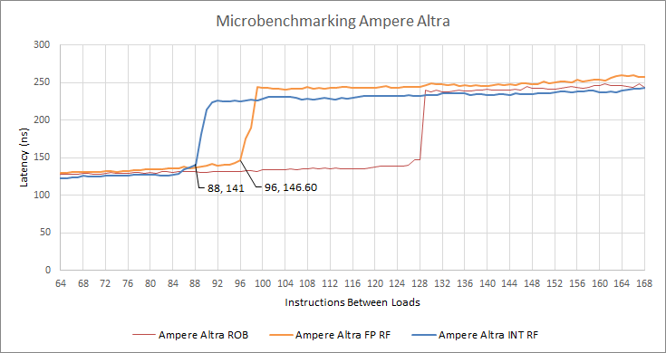

N1 约有 88 个 Integer、96 个 FP/SIMD Rename Register；加上 32 个架构寄存器，物理阵列可能为 120 Integer、128 FP/SIMD。该换算依赖测试模型，仍属反推。

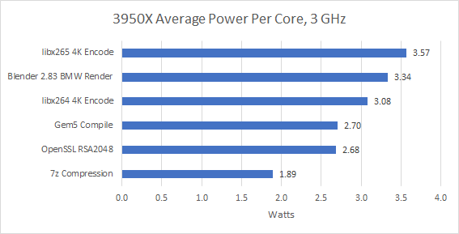

云 VM 无法读取 N1 Power。Arm 声称 N1 在 2.6～3.1 GHz 时每核为 1～1.8 W，3 GHz Altra 可能接近 1.8 W。若接受该数字，3 GHz Zen 2 每核高 48%～98%，AVX2 压力时接近高端；多数同频性能领先小于功耗差，因此 N1 可能赢能效，x265 例外。这里不是同平台功耗实测。

## 测试平台与可比性

3950X 每 CCX 开一个 Core，以满足同 CCD 各 CCX 活跃核数一致，同时保留双 CCD；内存双通道 DDR4-3333 16-18-18-38、匹配 FCLK，DIMM 标称 DDR4-3200。i5-6600K 默认 3.6 GHz All-core Turbo、同频 Ring，DDR4-2133 15-15-15-35；因 XMP 不稳定未与 Zen 2 匹配内存。FX-8350 默认约 4～4.2 GHz，DDR3-1866 10-11-10-30。N1 是云 VM，系统功耗和底层部分配置不可见。

## 结语

N1 在多数非向量负载中与 Zen 2 同一大区间，编译尤其强；RSA 是明显微架构弱点，AVX2 负载扩大 Zen 2 优势，新 Codec 又被软件生态放大到不可用程度。SVE 可带来更宽 Vector，但 N1 不支持，当时也没有通用 Server SVE 产品。

这不是“x86 天生更快”的证据。N1 用较弱单核换低功耗/密度，并通常由清楚自身工作负载、能投入移植优化的云厂商部署。对普通 PC 用户，缺失二进制和翻译开销会更明显。现实比较的结论是：核心目标、SoC、Compiler、Library 和市场装机量共同塑造性能，ISA 只是其中一层。

## 参考资料

- Chips and Cheese：Neoverse N1 vs Zen 2: ARM in Practice
- OpenSSL、7-Zip、gem5、ffmpeg/libx264/libx265 与 Blender
