# 从 CPU 一侧看 NVIDIA GB10：20 核、双簇与共享内存系统

> **文章来源**
>
> - 文章：*Inside Nvidia GB10’s Memory Subsystem, from the CPU Side*
> - 撰文：Chester Lam
> - 首发：Chips and Cheese
> - 发布：2025 年 12 月 31 日
> - 链接：https://chipsandcheese.com/p/inside-nvidia-gb10s-memory-subsystem

GB10 是 NVIDIA 与 MediaTek 合作的 SoC：GPU 侧集成 48 个 Blackwell SM，CPU 侧则放入 10 颗 Cortex-X925 和 10 颗 Cortex-A725。如此多的 CPU/GPU 计算资源共用一套 LPDDR5X，关键问题便不只是峰值带宽，而是 Cache 容量、簇间拓扑、受载延迟以及 CPU 与 GPU 谁先得到服务。

这次测试通过 ZeroOne Technology 的 DGX Spark 远程完成，重点只看 CPU 看到的内存系统。核心内部细节和 GPU 架构不在测试范围内；部分结构由容量台阶和带宽曲线反推，并非 NVIDIA 或 MediaTek 公布的 RTL。

## 一、两个看似相同、实际并不对称的 CPU 簇

GB10 把 20 颗核心分成两个簇。每簇各有 5 颗 A725 和 5 颗 X925；编号先列簇内 A725，再列 X925。所有 A725 运行在 2.8 GHz，簇 0 的 X925 最高 3.9 GHz，簇 1 最高 4.0 GHz。

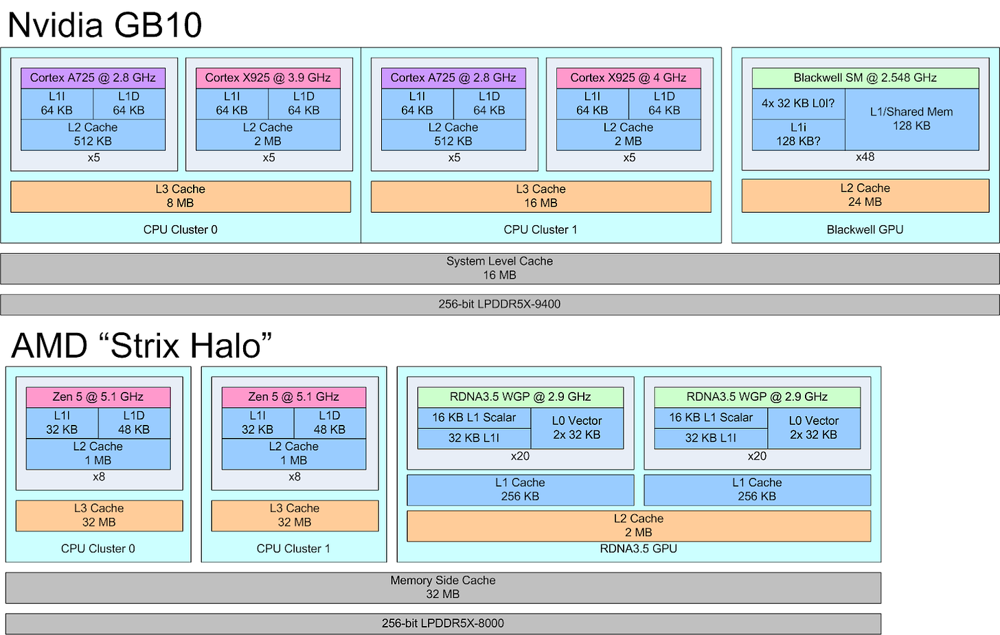

*图 1：GB10 两个簇都采用 5×A725＋5×X925，但簇 0 只有 8 MB L3，簇 1 为 16 MB；后方另有 16 MB SLC。Strix Halo 则用两组 8 核 Zen 5 CCX、各 32 MB L3，并共享 32 MB Infinity Cache。*

A725 与 X925 都采用 64 KB L1I 和 64 KB L1D。A725 的私有 L2 为 512 KB、8 路、9 cycle；X925 为 2 MB、8 路、12 cycle。较小的 A725 L2 有利于节省面积、堆叠核心，却把更多请求推向高延迟 L3。

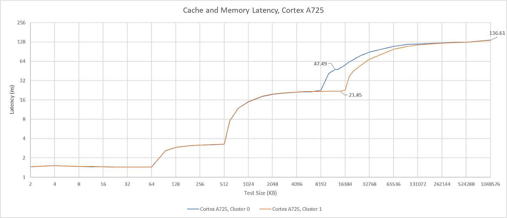

*图 2：A725 的 L2 约 3.2 ns，越过 512 KB 后进入超过 21 ns、60 cycle 以上的 L3 区间。两簇 L3 容量不同，但 A725 看到的 L3 延迟接近。*

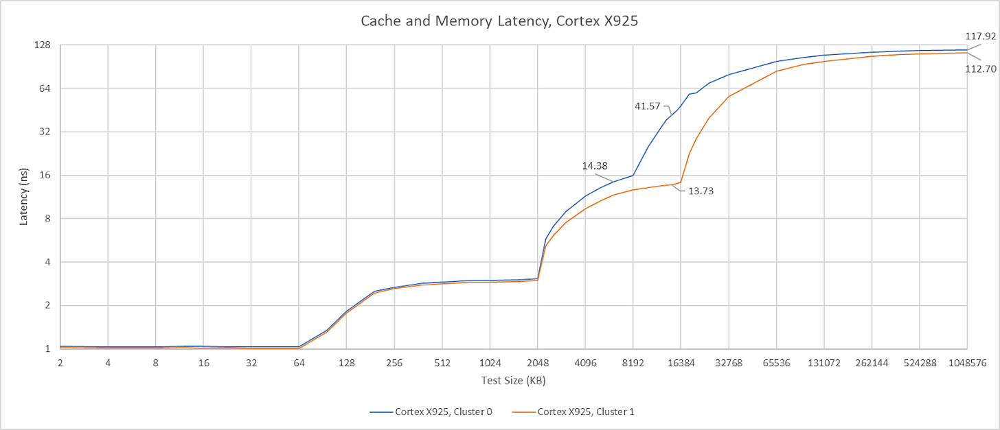

*图 3：X925 的 2 MB L2 约 12 cycle，L3 约 56 cycle、14 ns，比 A725 看到的同一层明显更低。较大 L2 和更短的 L3 路径，让高性能核心一侧更均衡。*

L3 后还有 16 MB 系统级 Cache（System Level Cache，SLC）。从簇 0 曲线估计，X925/A725 访问 SLC 约为 42/47 ns。SLC 离任何单一计算块都较远，速度不如簇内 L3，却能在 CPU、GPU 和其他引擎之间共享数据。NVIDIA 将其描述为用于节能数据共享的结构；作为 CPU 的“L4”只是其中一种作用。

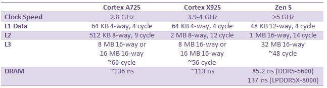

*图 4：表中汇总 A725、X925 与 Zen 5。GB10 的核心私有 Cache 以 cycle 计并不慢，但 Zen 5 频率更高，折算成纳秒后仍更快；AMD 的 32 MB L3 还兼具更低延迟。*

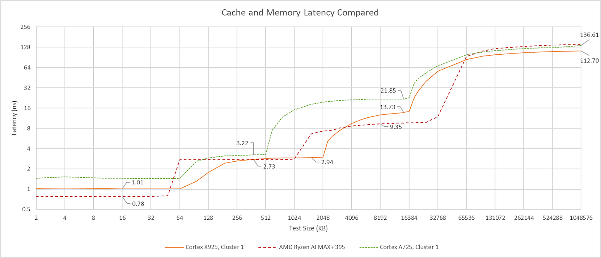

*图 5：容量台阶说明“更大”与“更快”不是同一维度。GB10 用大小核和不同簇容量换取 20 核密度，Strix Halo 则给每个 CCX 更充足的低延迟末级 Cache。*

DRAM 是 GB10 的亮点。CPU 测得约 113 ns；对 LPDDR5X 而言相当优秀，明显低于 Strix Halo 和 Meteor Lake 的 140 ns 以上。Hot Chips 资料称内存最高 9400 MT/s，而 `dmidecode` 在这台系统上报告 8533 MT/s。更高数据率以及 CPU 与控制器同 Die，都可能参与了这个结果。

### 体系结构视角：同一份 L3，为何大小核看到的延迟不同

“共享同一 L3”不意味着每种核心走同样的入口、队列和时钟域。DSU 端口、核心—互连桥接、请求优先级以及测量核心频率都可能改变端到端 cycle 数。若要定位原因，需要把 core cycle、uncore cycle 与纳秒同时记录，并观察请求在 L2 miss queue、DSU 接口和 L3 bank 的排队。现有曲线能证明可见延迟不同，不能唯一确认物理捷径。

## 二、单核带宽与簇级带宽

A725 可从 L1D 读取 48 B/cycle，L2 路径看起来约 32 B/cycle；单核 L3 和 DRAM 读取约 55、26 GB/s。X925 的 L1D 为 64 B/cycle，L2 很可能也是 64 B/cycle，单核 L3 接近 90 GB/s、DRAM 约 38 GB/s。

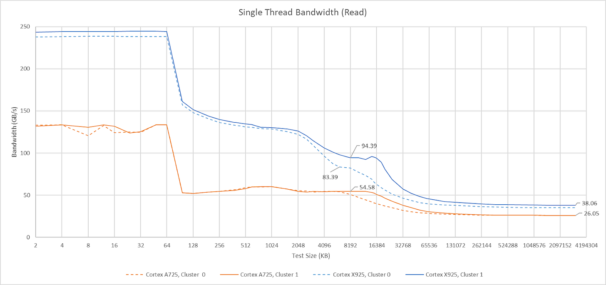

*图 6：X925 在各层都高于 A725，但 AMD Zen 4/5 单核仍可从 L3 获得 100 GB/s 以上、从 DRAM 获得 50 GB/s 以上。低线程应用未必需要如此高带宽，因此这不是直接的应用性能排名。*

多线程测试若让每个线程使用独立数组，可以避免相同地址被合并，也会把每核私有 Cache 容量相加。GB10 每簇共有 15 MB L2，而 L3 只有 8 或 16 MB，因此 L2 与 L3 的容量区间会重叠。

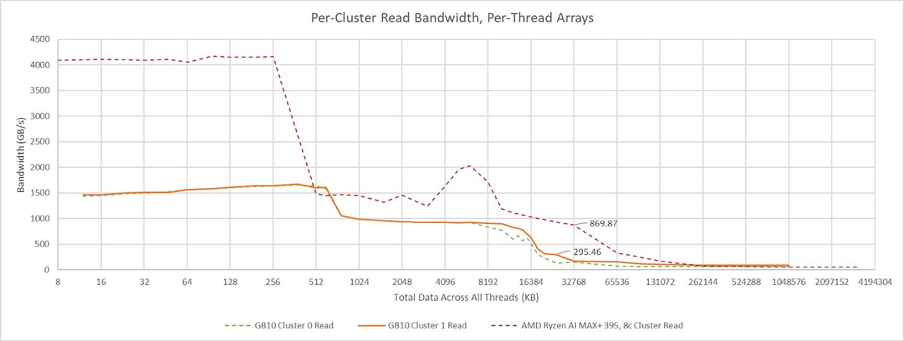

*图 7：工作集跨出私有 L2 后，曲线开始反映 8 MB L3 与簇外接口。每线程独立数组更接近多个互不相同工作集的真实负载。*

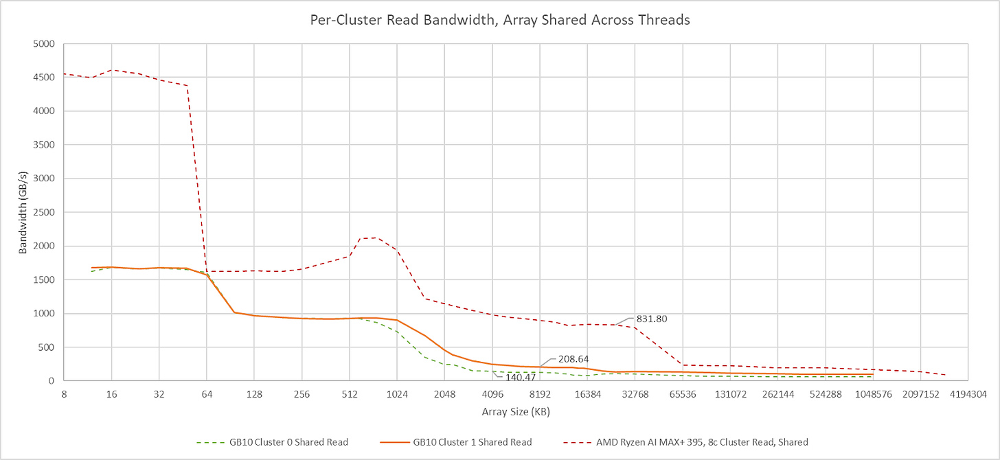

*图 8：簇 1 的 16 MB L3 和更高外部带宽形成不同台阶。曲线不能只按一条“总 Cache 容量”解释，因为 15 MB 私有 L2 分散在十颗核心上。*

让所有线程读取同一数组可能在共享层之后合并请求，从而高估带宽；但这套方法此前已在 Zen 2 和 Skylake 上与 L3 PMU 对照验证。两种方法合看，GB10 L3 总带宽低于 Strix Halo，却仍超过 200 GB/s。

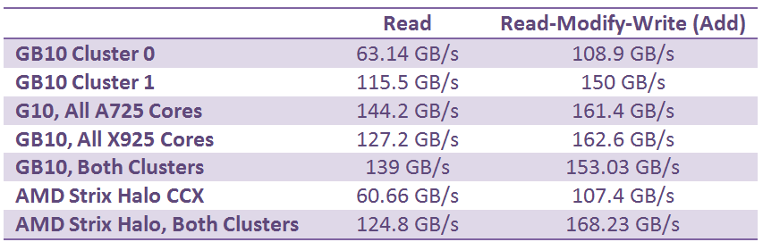

*图 9：纯读时，簇 0、簇 1 和双簇合计分别约为 63.1、115.5 和 139 GB/s；1:1 读写时，三者分别约为 108.9、150 和 153 GB/s。读写混合显著提高总量，支持独立读写路径的解释。*

Arm DSU-120 最多可配置四条 256-bit CHI 接口。簇 1 读取超过 100 GB/s，而簇 0 更窄，可能来自接口数量不同；这仍是基于带宽的推测。奇特之处在于，两个簇却都保留相同的五大五小异构构成。

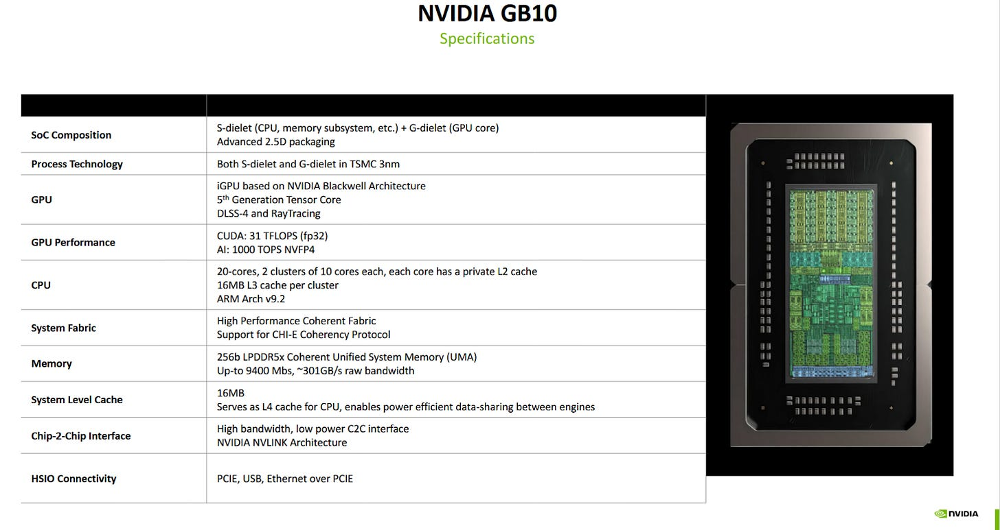

*图 10：`lscpu` 与容量微基准都支持只有第二个簇具备 16 MB L3。若把十颗 A725 集中到密度簇、十颗 X925 集中到性能簇，调度和簇级省电或许更直接；但这是文章提出的设计设想，不是 GB10 当前实现。*

### 体系结构视角：读写混合为何可能比纯读更快

峰值带宽由请求入口、读队列、写回队列、数据返回链路和 DRAM 总线共同决定。纯读可能只打满其中一条返回路径；1:1 读写则同时利用独立方向链路，因此“总字节数”更高。它并不意味着每条 Load 延迟降低，也不能与只读带宽直接相加比较应用性能。

## 三、带宽上升后，延迟由谁控制

受载延迟测试让一颗 X925 运行指针追逐，其他核心持续制造带宽压力。两个簇只用 A725 就能到达最大带宽；继续加入 X925 后，总带宽反而下降、延迟上升。以 X925 优先加压时，四颗 X925 附近最糟；再加入 A725 后，系统似乎启动了更均衡的限流，带宽和延迟反而改善。

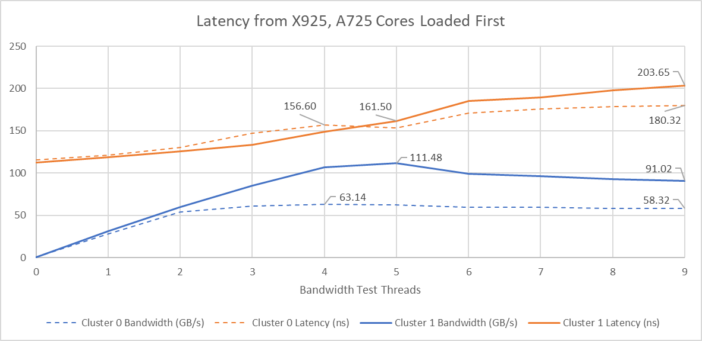

*图 11：横轴是带宽线程数，蓝线为带宽、橙线为延迟。两簇均显示核心类型比单纯线程数更能决定排队行为。*

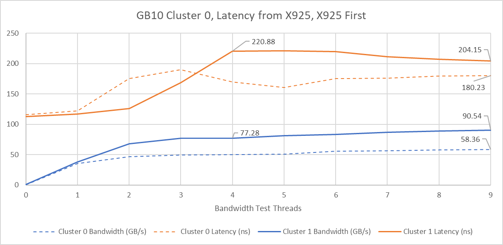

*图 12：簇 1 虽有更高峰值带宽，延迟控制反而更差。它与 AMD GMI-Wide“链路更宽、受载延迟更好”的经验并不一致，说明仲裁策略同样关键。*

跨两个簇加压时，GB10 在可达到的带宽范围内整体延迟低于 Strix Halo，主要得益于更低的 113 ns 基线和簇 1 较宽的外部接口。

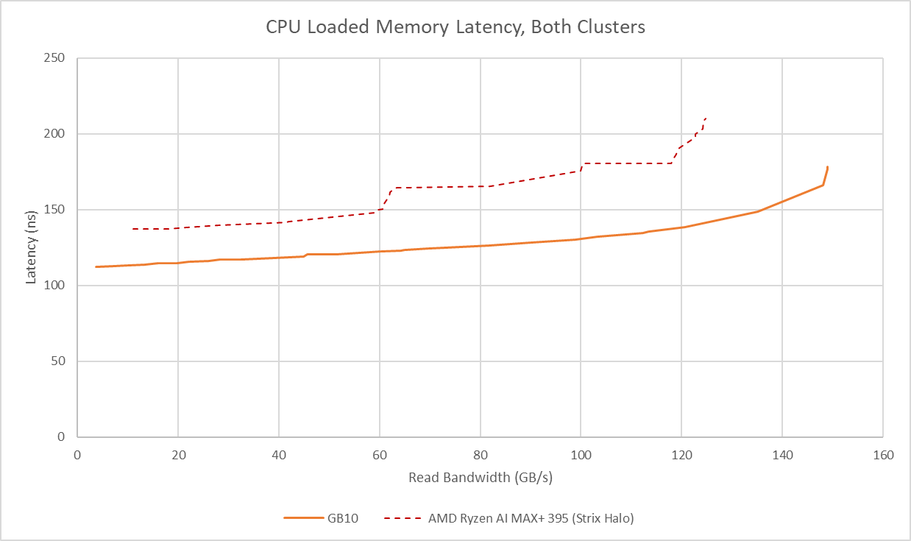

*图 13：曲线比较的是不同系统和可达带宽区间。GB10 的低基线很有价值，但接近极限时仍会因队列堆积而快速抬升。*

GPU 加压会把问题放大。只让 GPU 制造带宽，CPU 延迟在 GPU 达到 231 GB/s 时已超过 351 ns。

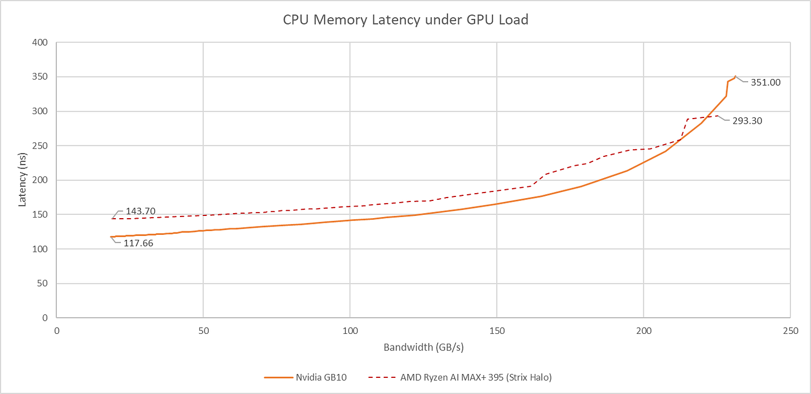

*图 14：GB10 在中低 GPU 带宽下优于 Strix Halo；高负载区两者都出现明显拥塞。共享物理内存消除了显式拷贝，却没有消除服务竞争。*

若再让两颗簇 1 X925 同时争抢带宽，CPU 侧延迟接近 400 ns，GPU 还会挤压 CPU 带宽线程。

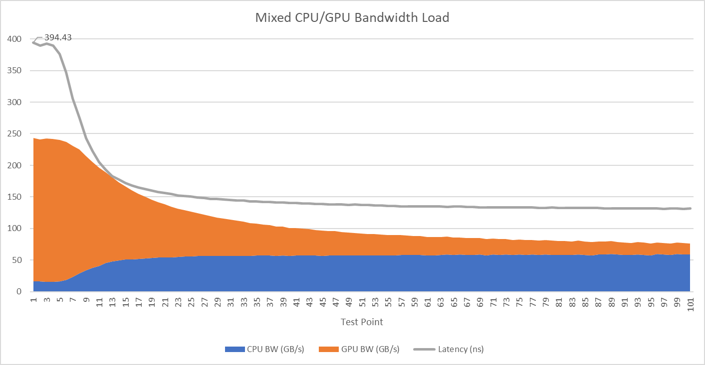

*图 15：堆叠面积分别显示 CPU/GPU 可得带宽，灰线显示延迟。结果说明 256-bit LPDDR5X 主要为 GPU 准备，CPU 端并不能独占全部物理带宽。*

### 体系结构视角：峰值带宽之外，还要看 QoS 曲线

共享内存系统的真正难题是优先级。GPU 吞吐任务可容忍较长延迟，CPU 控制线程往往带宽不大却对单次访问敏感。理想仲裁器会限制高吞吐请求长期占满队列，为延迟敏感流量保留信用或时隙。验证时应把 CPU 延迟、CPU/GPU 各自带宽、控制器队列深度和限流状态放在同一时间轴，而不是只报总 GB/s。

## 四、一致性传输暴露出更明显的簇边界

普通 Cache miss 是沿层次向下访问；核间传递则要找到哪个私有 Cache 持有最新副本。簇内由 DSU-120 的 Snoop Control Unit 与 Snoop Filter 协调，跨簇则交给 NVIDIA/MediaTek 的 High Performance Coherent Fabric。

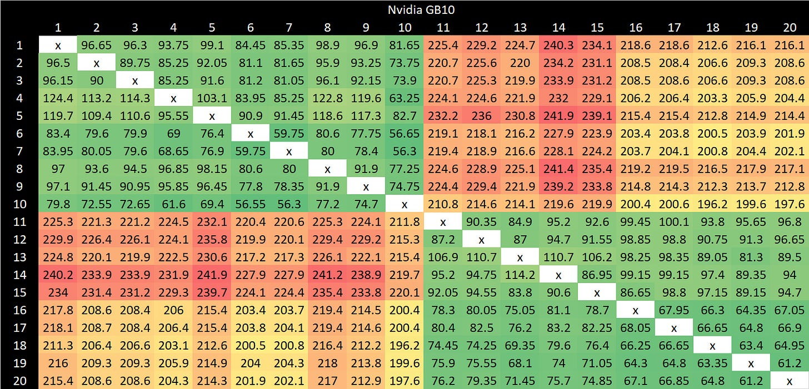

*图 16：对角线附近的绿色块对应簇内传输，跨簇区域明显变成橙红色。矩阵中的大核/小核位置也呈现差别。*

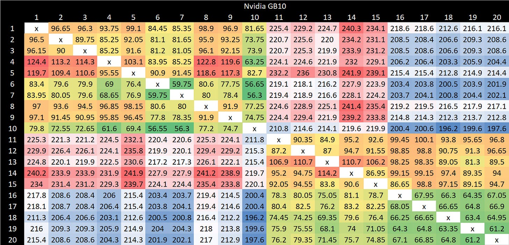

*图 17：最好情况是同簇 X925 之间，最坏情况是跨簇 A725 之间，最高可到约 240 ns。结果同时混入请求核心、持有者核心、Home 位置和互连距离。*

Strix Halo 的跨 CCX 延迟约 100 ns，簇内低于 50 ns；GB10 最好也要 50～60 ns，常见跨簇则约 200 ns。

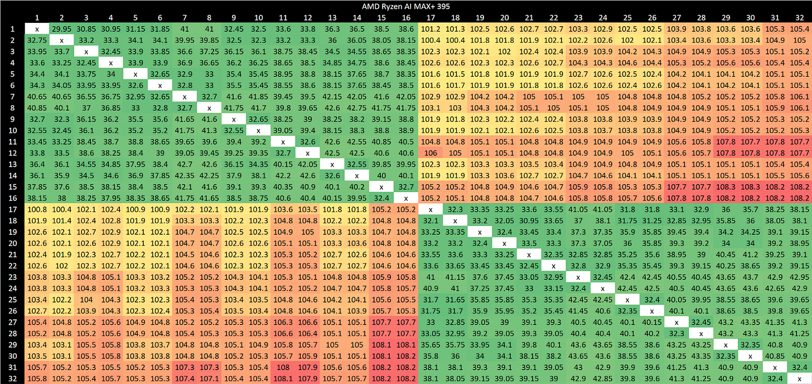

*图 18：GB10 的 CPU 密度和共享内存能力没有自然转化成低一致性延迟。需要频繁交换共享 Cache Line 的锁、队列和细粒度并行算法，可能比只读或分区良好的任务更敏感。*

## 五、从这套内存系统可以得到什么认识

GB10 的设计重心很明确：20 颗异构 CPU 核心提供主机计算，256-bit LPDDR5X 和大量 Infinity Fabric/CHI 接口主要服务 48 个 Blackwell SM。与 Strix Halo 相比，它更偏向核心密度，Cache 更轻；优点是 LPDDR5X 延迟优秀，簇 1 还能提供超过 100 GB/s 的读取带宽。

几条体系结构层面的结论值得保留：

1. 大小核异构只是第一层，簇容量和外部接口也可以异构；操作系统若不知道这些差别，线程放置就可能错过 8/16 MB L3 和带宽差异。
2. SLC 的主要价值可能是跨引擎共享与节能，而不是给 CPU 再加一层高速 Cache。评价它要看 CPU/GPU 数据交换，不只看 CPU 延迟曲线。
3. CPU 无法用满物理 DRAM 总线并不奇怪。GPU 才是带宽目标，CPU 更依赖低延迟与高命中率。
4. 峰值带宽、受载延迟和一致性延迟是三项独立能力。GB10 在第一项局部很强，在 DRAM 基线延迟上也亮眼，跨簇一致性却明显偏高。
5. 统一内存省去了拷贝和显存容量边界，同时把 CPU/GPU QoS 变成不可回避的系统问题。

Chester Lam 的最终判断仍保持开放：若其他条件相同，更倾向于一层 32 MB 快速 Cache，而不是 16 MB L3 加 16 MB 更慢 SLC；但真实性能还需要应用 Benchmark 证明。GB10 与 Strix Halo 都展示了大 iGPU、小体积和大共享内存的吸引力，也共同暴露了高 GPU 带宽需求挤压 CPU 的代价。

## 参考资料

- Chester Lam，*Inside Nvidia GB10’s Memory Subsystem, from the CPU Side*：https://chipsandcheese.com/p/inside-nvidia-gb10s-memory-subsystem
- NVIDIA，DGX Spark / GB10 公开资料
- Arm，DynamIQ Shared Unit 120 技术资料
