# PEZY-SC4s：用低频众核追求 FP64 能效

> 英文标题：PEZY-SC4s at Hot Chips 2025
> 撰文：Chester Lam
> 首发：Chips and Cheese，2025 年 9 月 4 日
> 链接：https://chipsandcheese.com/p/pezy-sc4s-at-hot-chips-2025

日本长期保有自主超级计算机架构能力，PEZY Computing 与富士通、NEC 一样是其中一员。Exascaler-1.4 曾凭 PEZY-SC 在 2015 年 11 月 Green500 登顶，PEZY-SC3 则在 2021 年 11 月位列第 12。Hot Chips 2025 展示的 SC4s 尚无实体产品，下面的性能与功耗主要来自设计披露和模拟。

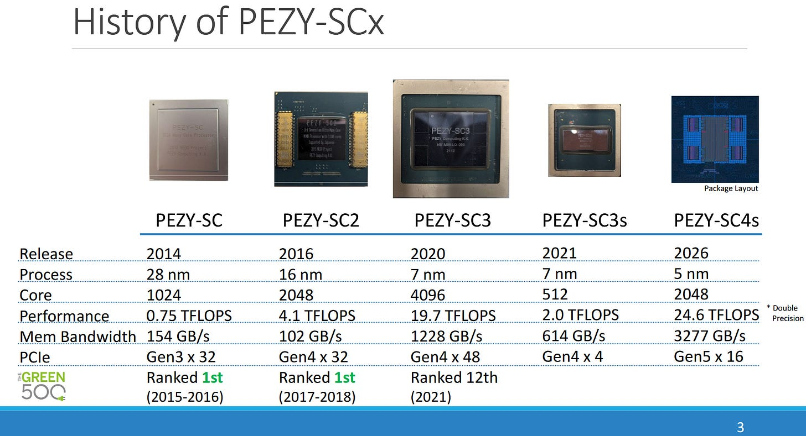

PEZY 通过大量低频、低压执行单元追求 FP64 能效，又以小向量、低分支损失和多级缓存避免 GPU 式“玻璃下巴”。它通过 PCIe 接入主机。后缀 `s` 表示缩小版：上一代 SC3 是 TSMC 7 nm、786 mm²、最高 470 W、4096 个处理单元（PE）；SC3s 则为 109 mm²、80 W、512 PE。

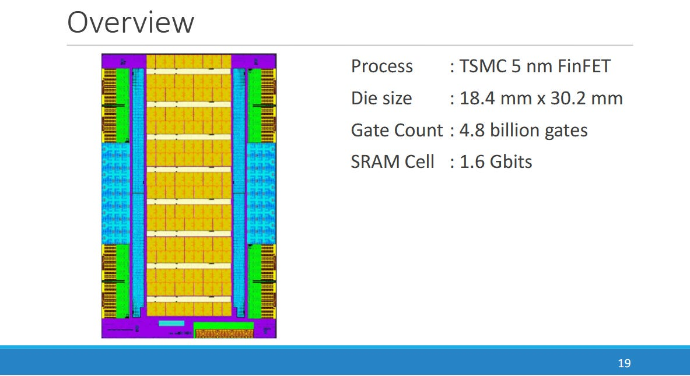

SC4s 虽名为缩小版，每周期吞吐与 SC3 相同，频率从 1.2 提至 1.5 GHz，因此峰值略高于 SC3，并大幅超过 SC3s。

## PE：细粒度与粗粒度多线程结合

一个 PE 类似 GPU 的 SM 子分区或 AMD SIMD：核心很小，通过线程级并行隐藏延迟。SC4s 每个 PE 有八个硬件线程，分成“前/后”两组，每组四线程；任一时刻一组活跃，每周期轮换其中一个线程。

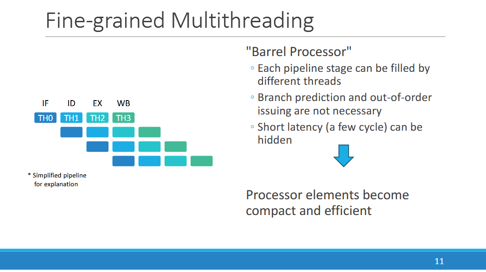

短停顿由细粒度轮换覆盖；长延迟事件可用线程切换指令或 Load 等指令的标志切到另一组，也可启用从 SC2 继承的自动 `chgthread`。

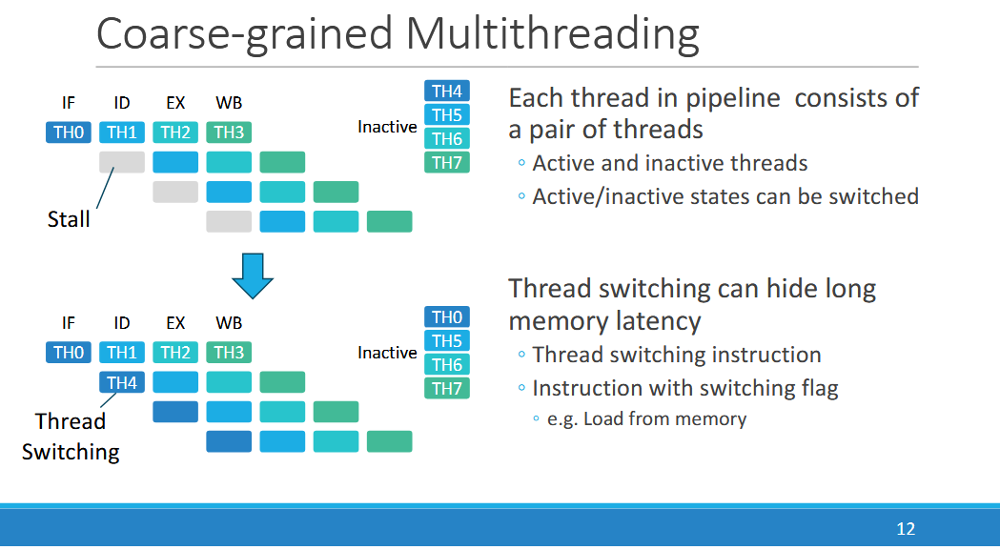

若自动切换足够准确，软件几乎可把它当纯硬件多线程设计；其效果仍需实测，因为错误切换会增加控制开销。

GPU 的一条指令通常覆盖很宽的 warp/wave，线程分支分歧会串行执行不同路径。PEZY 强调 MIMD，并只用 256 bit SIMD：FP64 每周期四路，低精度类型可容纳更多元素。与 GPU 常见的 wave32 约 1024 bit 或 wave64 约 2048 bit 相比，控制流分歧波及的元素更少。

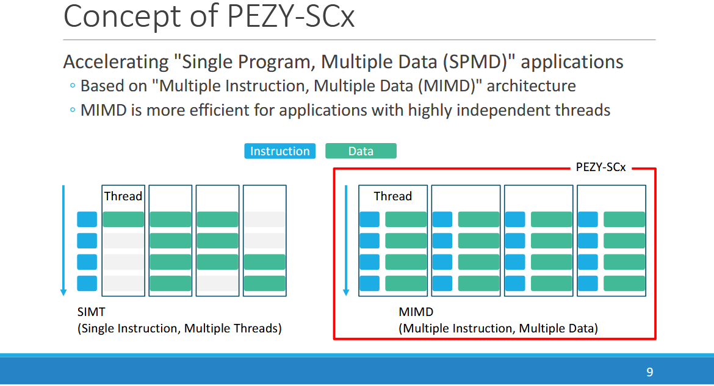

SC3 的 PE 仅双路 FP64，SC4s 扩到四路，减少每份计算的指令控制成本，却也扩大单条向量内发生分歧的范围。它新增 BF16 以覆盖 AI，但没有像 GPU 那样加入专用矩阵单元。

### 体系结构视角：延迟隐藏不是免费的

四线程轮转把 12 周期物理延迟折算为同一线程看到的约三条指令间隔，但也意味着单线程每四拍才能发射一次。只有足够多彼此独立的线程，才能把执行单元填满；线程组切换、寄存器状态和分支分歧共同决定有效利用率。

## 从 4 KB 私有缓存到 64 MB L3

PEZY 以行政区划命名层级：四 PE 为 Village，四 Village 为 City，16 City 为 Prefecture，八 Prefecture 为整颗 State。SC4s 实际每个 Prefecture 布置 18 City，其中两个关闭作冗余，合计 2304 PE。

每 PE 的 L1I 仅 4 KB。若沿用 SC3 的 4 B 指令和 8 B/cycle 取指，可容纳约 1024 条指令；16 PE 共享 32 KB L2I，承担更大代码 footprint。

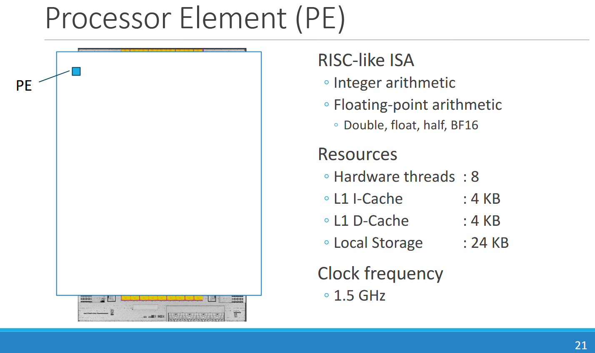

L1D 从 SC3 的 2 KB 增至 4 KB，带宽仍为 16 B/cycle。计算宽度翻倍而 Load 带宽不变，看似更不平衡，但 SC3 的带宽只有每拍都发 Load 才能用尽，增加容量可能比继续堆带宽更划算。L1D Load-to-use 为 12 周期；由于单线程四周期发一次，等效约三条该线程指令。

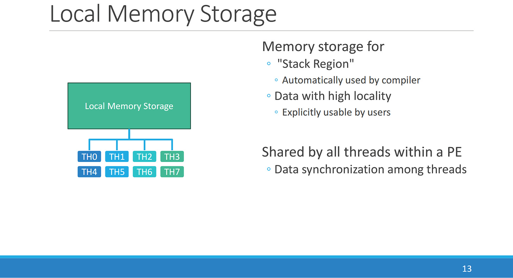

每 PE 另有 24 KB 软件管理本地存储，类似 AMD LDS/Nvidia Shared Memory；可直接寻址，也可给编译器作为栈区处理 Spill 和函数调用。一个 Village 的四 PE 可能共享为 96 KB 池。其 Load-to-use 为四周期，恰好允许同一线程下一次轮到时消费。

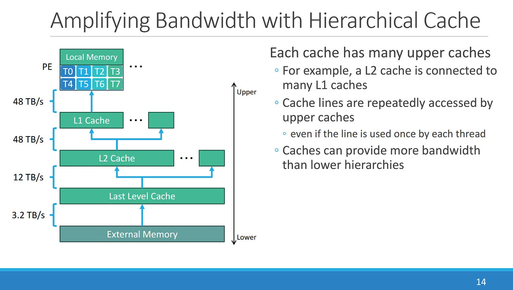

一个 City 的 16 PE 共享 64 KB L2D，延迟 20 周期，每 PE 仍可获 16 B/cycle，总带宽 256 B/cycle。L1D/L2D 带宽相同，说明 L1 更像低延迟 L0，许多 Load 可自然落到 L2。按 1.5 GHz 估算的 20 周期约 13～14 ns，接近 GPU 一级数据缓存。

## L3、HBM 与无硬件一致性

各 City 通过 crossbar 连接 64 MB 分片 L3。披露带宽为读 12 TB/s（1024 B/cycle）、写 6 TB/s（512 B/cycle），延迟 100～160 周期，可能取决于 PE 到 slice 距离。

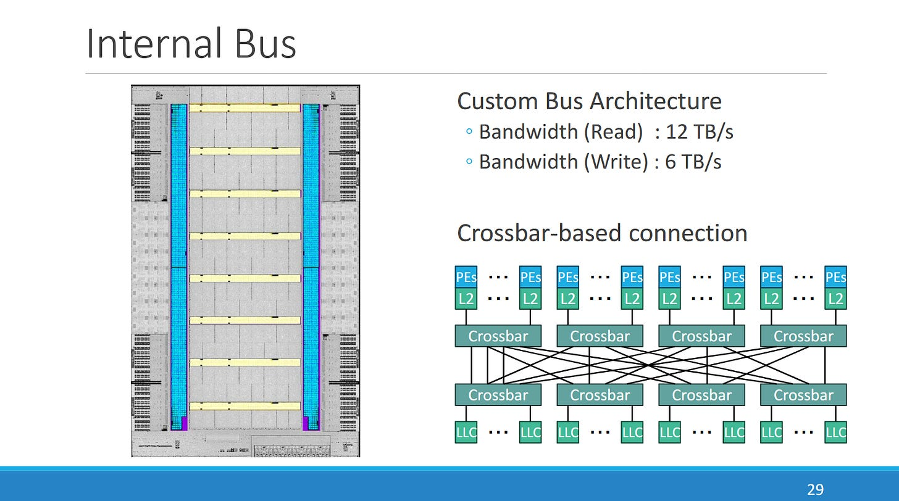

L3 还执行原子操作。PEZY 用显式同步/Flush 指令让各层写入可见，而不是构建 CPU 式硬件缓存一致性，从而简化硬件，但把正确同步责任交给编程模型。

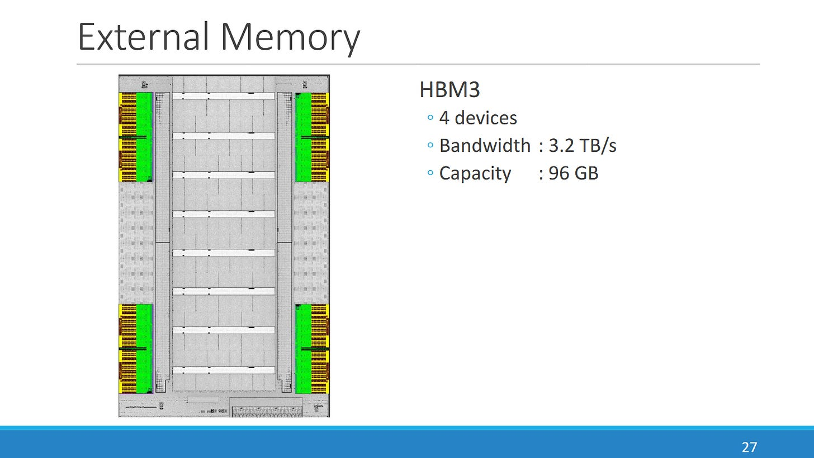

四堆 HBM3 提供 96 GB、3.2 TB/s；若每堆 1024 bit，总数据率约 8 GT/s。SC3 的 HBM2 仅 32 GB、1.23 TB/s，另配双通道 DDR4-3200 补容量；SC4s 的 96 GB HBM3 使 DDR 控制器不再必要。

## 管理核与主机

SC4s 集成四核、1.5 GHz RISC-V 管理处理器，使用开源顺序标量 Rocket Core，负责协调 PE 与 PCIe 等控制任务。

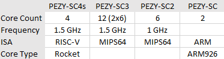

主机接口升级为 PCIe 5.0 x16。计划系统使用 Zen 5 EPYC 9555P、InfiniBand，并让一台主机挂四颗 SC4s；上一代四卡系统使用 Zen 2 EPYC 7702P。

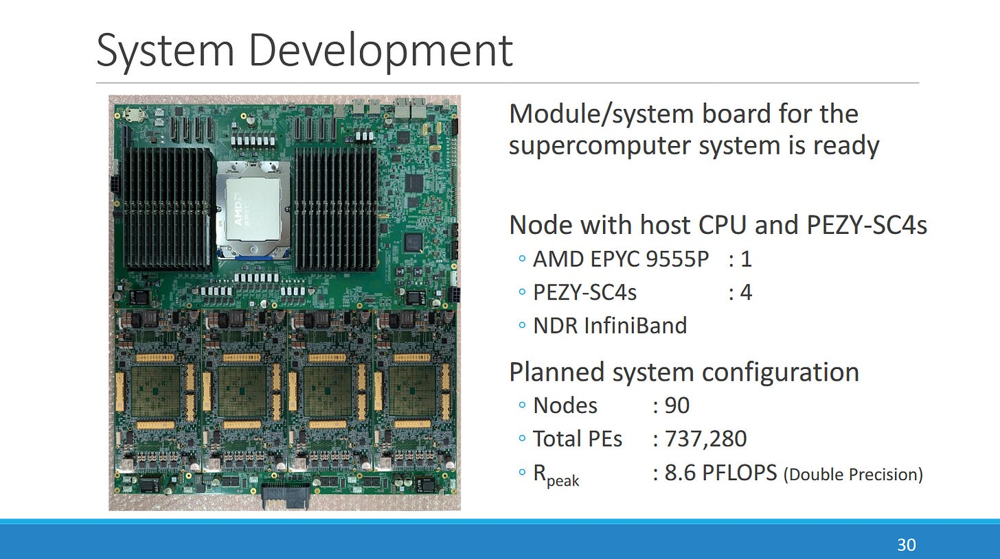

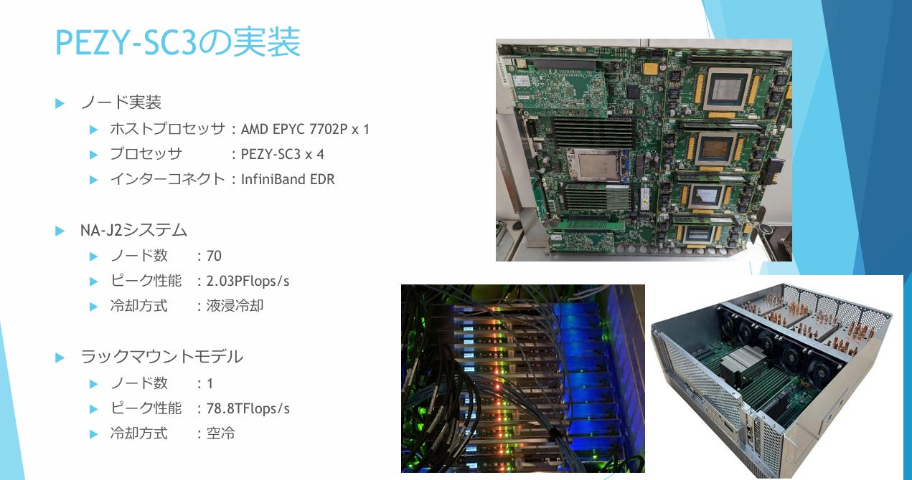

## 能效目标与适用场景

PZCL 编程模型类似 OpenCL，小向量减少分歧损失，多级缓存兼顾容量与速度。

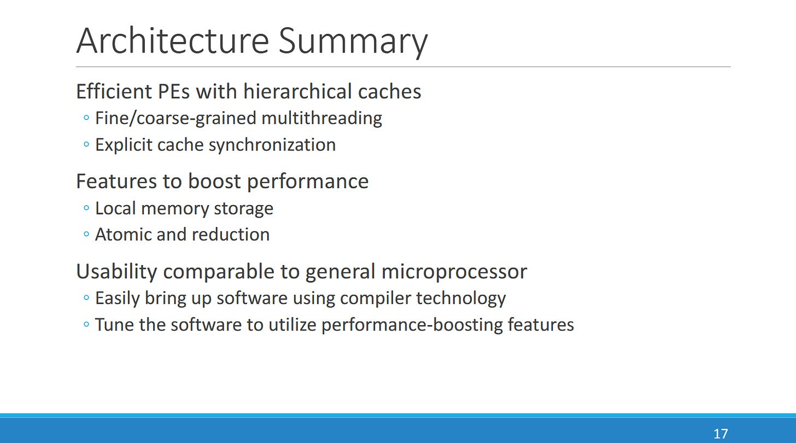

早期资料给出整芯片 270 W、DGEMM 时 PE 部分约 212 W，但 Hot Chips 时尚无硅片，PEZY 没有发布最终功耗。

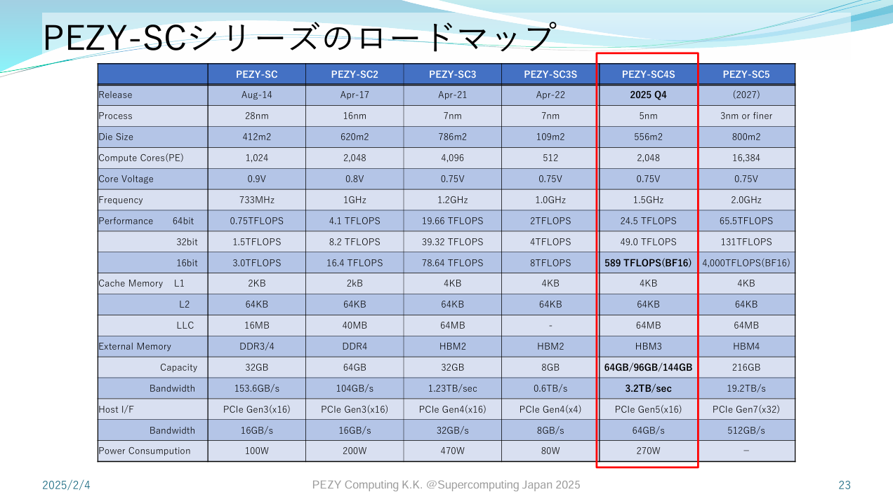

若 SC4s 真能在 270 W 达到峰值，FP64 能效约 91 GFLOP/W；文章以约 49 GFLOP/W 的 Nvidia H200 和约 110 GFLOP/W 的 AMD MI300A 作参照。后者采用昂贵、开发复杂的 3D Chiplet，制造口径不同；最新 AI 加速器又可能主动牺牲 FP64，因此这些峰值对比不能代替应用性能。

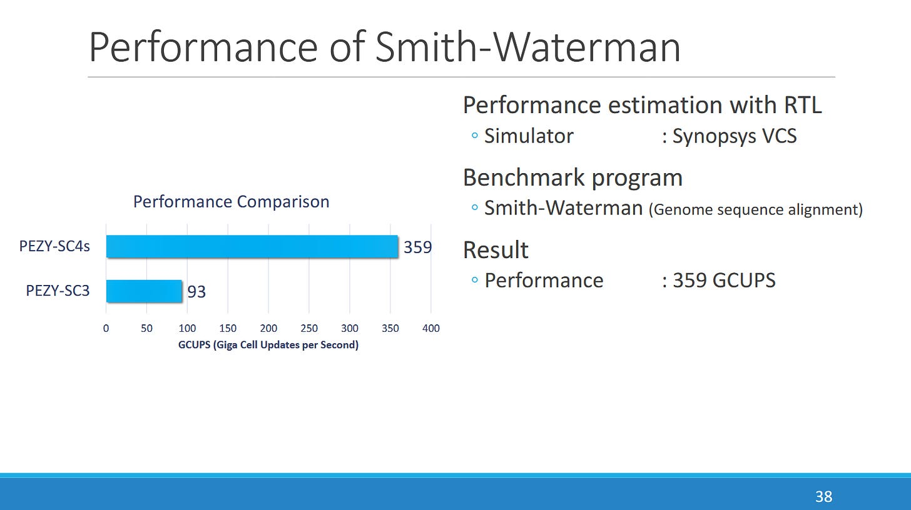

AI 热潮把资源集中到低精度矩阵计算，却仍有模拟等场景需要 FP64 控制累积误差。SC4s 正面向这一空档。

### 体系结构视角：峰值 FLOP/W 必须经工作集验证

要兑现峰值，程序需有足够线程、规则 FP64 向量、良好 Local Memory/Cache 复用，并避免 HBM 或分支分歧瓶颈。应分别报告 DGEMM、稀疏/不规则负载、实际功耗和持续频率；模拟峰值与早期功耗相除，只能说明设计目标。

## 结语

SC4s 不是简单复制 GPU：它用小 SIMD、两级线程切换、低延迟层级和显式一致性，在通用控制流与 FP64 吞吐之间寻找位置。日本持续自研 A64FX、PEZY 这样的专用硬件，成本和风险更高，却能围绕本国超级计算需求优化，并保留独立架构能力。

最终判断仍要等实际硅片、编译器和应用。现在可以确认的是其组织和目标；91 GFLOP/W、低于 300 W 等仍是由模拟与早期数字推导的期望。

## 参考资料

- PEZY Hot Chips 2025 演讲及 Supercomputing Japan 2025 资料
- Chips and Cheese：PEZY-SC4s at Hot Chips 2025
- Nvidia/AMD 产品资料及文章列出的 Wake/功耗参考来源
