# 飞腾 D2000：一颗像 Cortex-A72、却没有完成代际跃迁的八核 CPU

> **文章来源**
>
> - 文章：*China’s Phytium D2000: Building on A72?*
> - 撰文：Chester Lam
> - 首发：Chips and Cheese
> - 发布：2022 年 9 月 28 日
> - 链接：https://chipsandcheese.com/p/chinas-phytium-d2000-building-on-a72

飞腾 D2000 集成八颗 2.3 GHz FTC663 Arm Core，每两核一个 Cluster，面向桌面、笔记本和工业。它不是为正面挑战 AMD/Intel 顶级产品而生，而是中国国产供应能力的一部分；但既然厂商把 Desktop 列入目标，就必须同时看客户端性能与微架构质量。

本文的 Macro Benchmark 都在 Bare-metal Linux 上运行，与站内旧平台不直接可比；页面没有完整列出 Distribution、Compiler 与所有版本/命令。Core i5-6600K 是 2015 年中端 Skylake，四核、全核约 3.6 GHz；另以四核 Ampere Altra（Neoverse N1）、Graviton 1 Cortex-A72 等作机制对照。

## 性能位置：八核仍输给旧四核

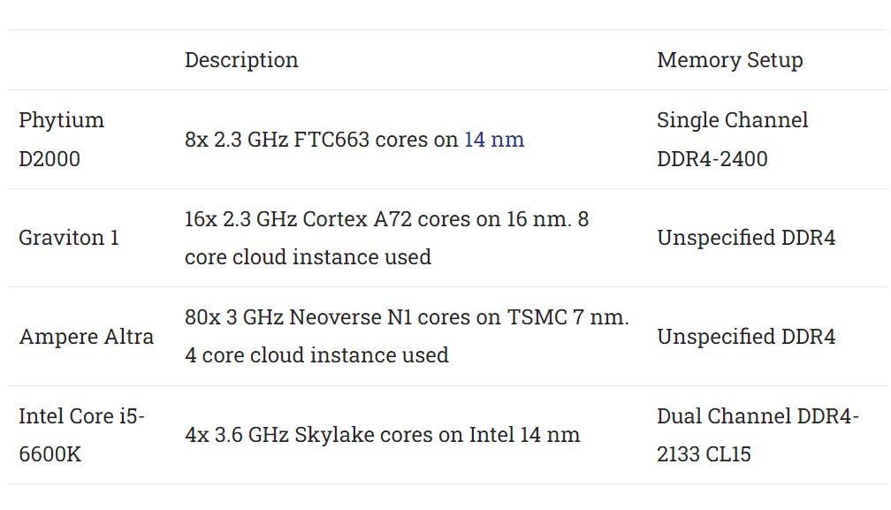

*图 1：图片来源 HKEPC；平台与内存配置共同参与结果。*

7-Zip 压缩单个大文件，不用可无限扩核的内置 Benchmark。该负载 Branch 超过 15%、几乎全 Scalar Integer，Hot Code 可放进多数 L1I/Uop Cache。

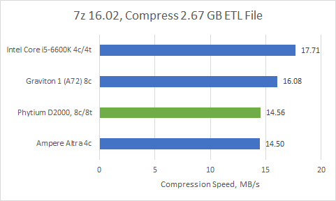

*图 2：D2000 八核明显慢于四核 i5，仅勉强超过四核 Altra。*

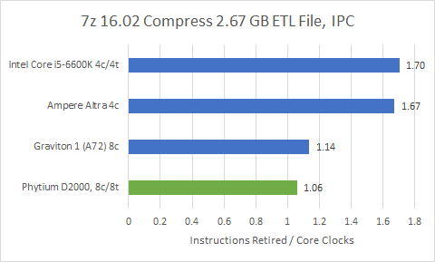

*图 3：FTC663 IPC 最低；2.3 GHz 低频通常会让 DRAM 延迟以周期计更便宜，却也未挽回。*

Gem5 Build 代码大、并行度高，各 CPU 大部分时间 100% Usage。

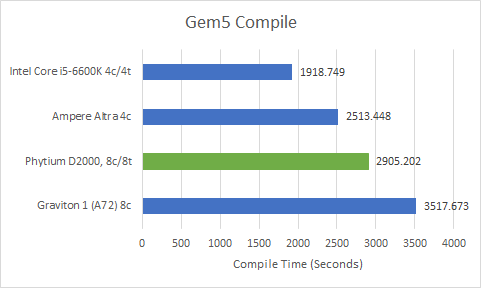

*图 4：八核 D2000 被四核 Skylake/N1 大幅领先，仅明显胜 Graviton 1 A72。*

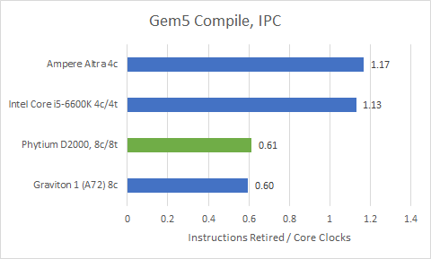

*图 5：FTC663 相比 A72 的 IPC 提升有限；A72/N1 的 Retired Instruction 反而更多，说明差异不只是 ISA 指令数。*

libx264 需要强 Vector 与 Cache Bandwidth；Haswell/Skylake 上超过 40% 指令属于 MMX/SSE/AVX/AVX2，Branch 较少。

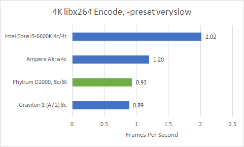

*图 6：虽可良好扩到四核以上，D2000 仍输四核 Skylake/N1。*

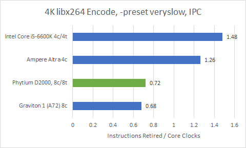

*图 7：Skylake 平均 IPC 超过 D2000 两倍，同时 13.89% 指令处理 256-bit；FTC663 的 Predictor 在低 Branch 负载不再是主问题，弱 Vector Unit 暴露。*

Minecraft Server 从零启动是高 IPC Java 客户端场景。

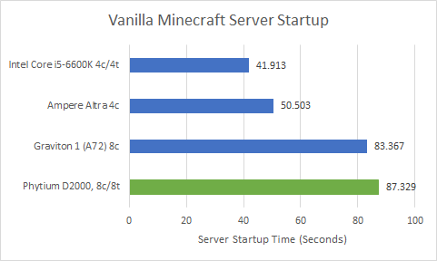

*图 8：i5 用时不到 D2000 一半。*

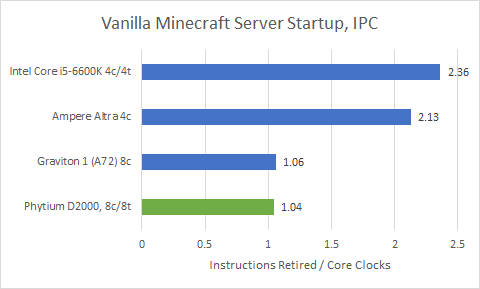

*图 9：N1/Skylake 均超过 2 IPC，FTC663 远未用满三宽。*

OpenSSL RSA2048 Signs/s 是几乎纯 Scalar Integer、压力集中 ALU，不用专用 Symmetric Crypto Instruction。

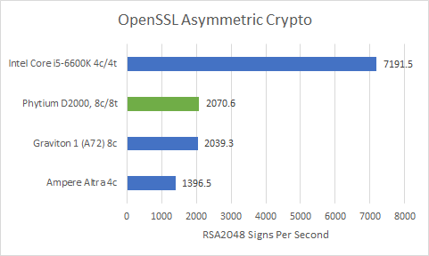

*图 10：D2000 与 A72 可疑地接近；八核终于胜四核 N1，是后者对相关 Integer Operation 的局部瓶颈。Skylake 仍遥遥领先。*

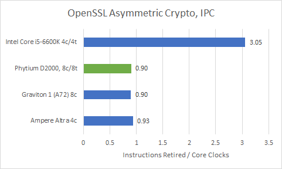

*图 11：计数器再次显示 Skylake 的执行优势。*

因此 D2000 的 Performance Profile 与“高性能桌面通用处理器”相距很远。客户端难以随核心数扩展，Per-core Performance 才关键；二手 i5-6600K 当时不足 50 美元仍更可用，四颗现成 N1 也会更强。

## FTC663 总览：三宽 OoO，与 A72 高度相似

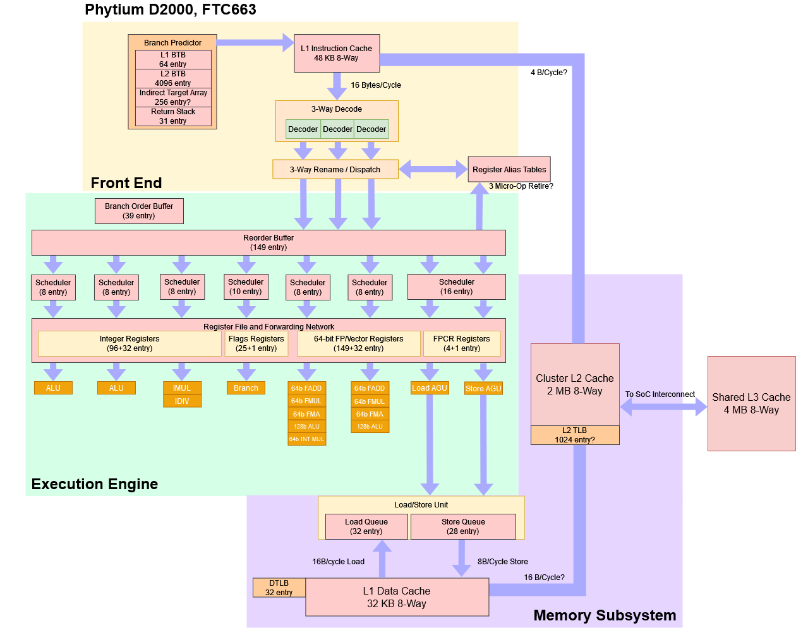

*图 12：三宽、OoO、双 Memory Pipe 与分布式执行。容量来自微基准复原，不是 RTL。*

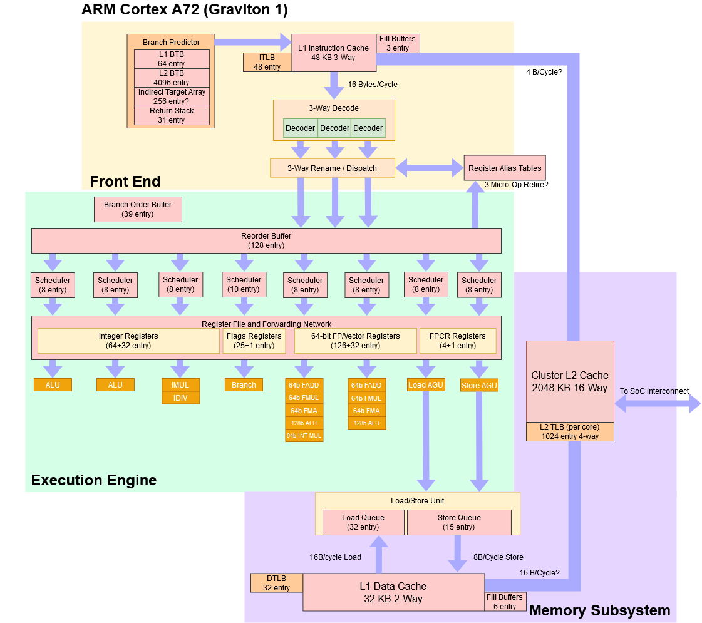

*图 13：两者不是完全相同，却像同一产品线相邻世代。*

## 分支预测：能看长 History，却在多 Branch 时快速退化

飞腾曾称 Xiaomi Core 使用 TAGE；FTC663 很可能是某种变体，因为可识别比 A72 更长的 Pattern。但容量/Hash 似乎不足。

*图 14：FTC663 在少数长相关 Branch 上可能优于 A72。*

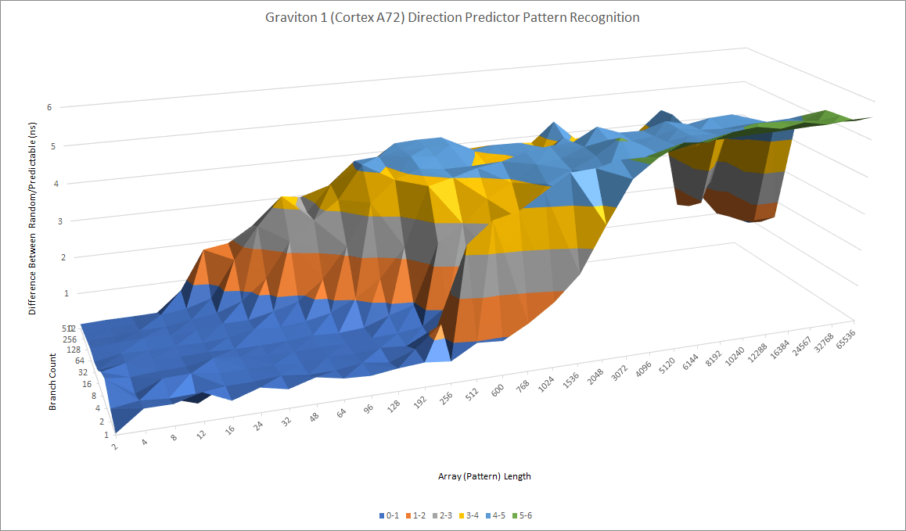

*图 15：更多中等 History Branch 出现后退化更快，候选原因是较少 Storage 或 Index Aliasing，不能由曲线唯一确认。*

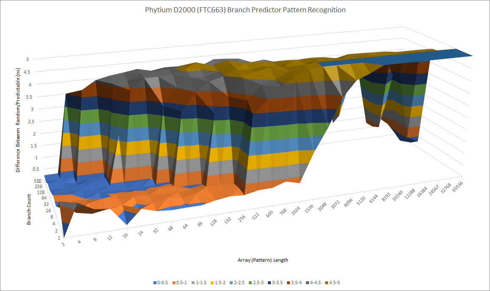

*图 16：可同时容纳更多、识别更长。*

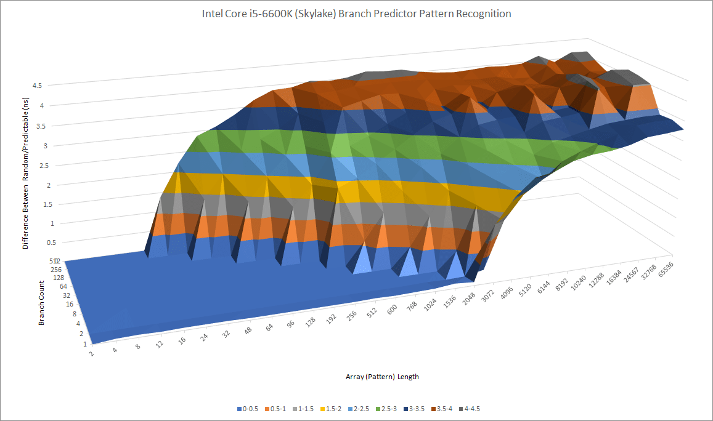

*图 17：N1 同样明显领先。*

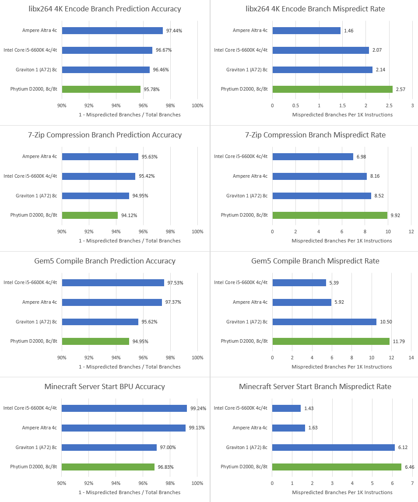

*图 18：FTC663 甚至常输老 A72。Gem5 编译约每千条 11～12 次错误，若每次约十余周期，每千条浪费超过百周期。*

### BTB：64+4096 项，却没有 Zero-bubble

FTC663 很像 A72：64-entry L1 BTB 后接与 I-Cache Coupled 的 4096-entry Main BTB。L1 Target 也要一个 Bubble，Taken Throughput 为每两周期一次；主 BTB 为每三周期一次。Loop Unroll 因而很重要。

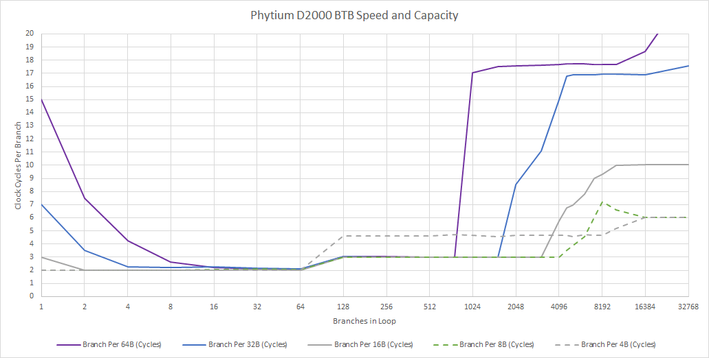

*图 19：容量拐点来自 Branch Chain。*

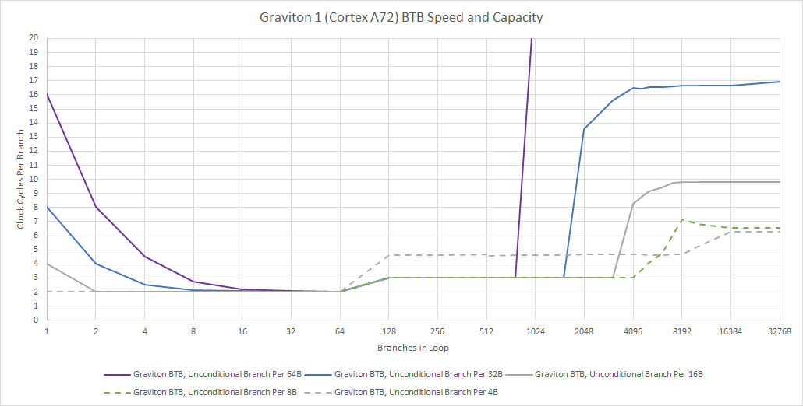

*图 20：与 A72 连相邻 Branch 的异常都相似。A72 手册建议同一 16 B Aligned Quadword 不超过两条 Taken Branch，也可直接指导 FTC663。*

N1/Skylake 的 L1 BTB 可 Zero-bubble，L2 BTB 也和 FTC663 L1 一样快，并能让 Predictor-driven Prefetch 在代码越过 L1I 时继续追 Target。

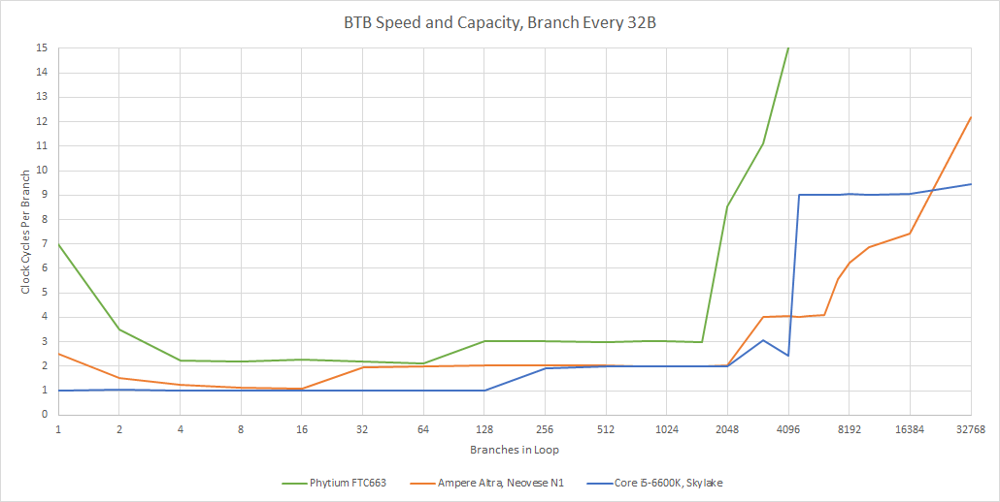

*图 21：Branchy Code 的有效 Decode Bandwidth 因而高得多。*

### Indirect 与 Return

单一 Indirect Branch 在 16 个 Target 间切换时表现合理；128 条 Branch、每条两 Target，合计约 256 Target 仍无显著惩罚。

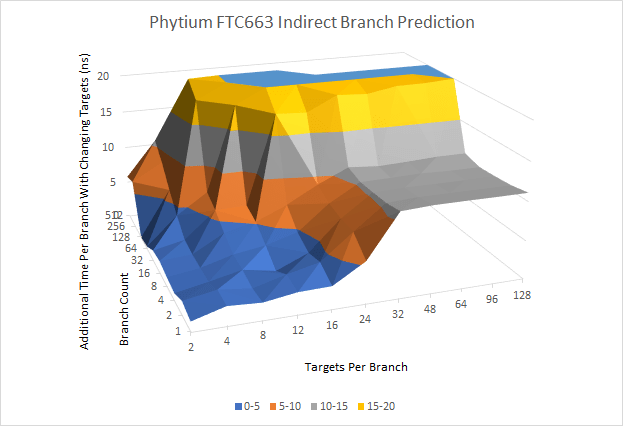

*图 22：只覆盖合成模式。*

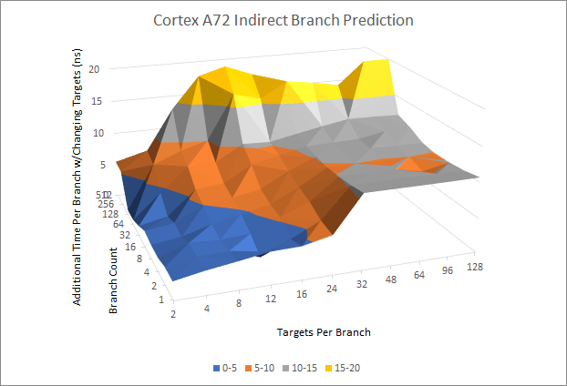

*图 23：A72 的形状再次相似。*

Skylake 单 Branch 至少 128 Target、总计至少 1024；N1 单 Branch 64、总计至少 2048。

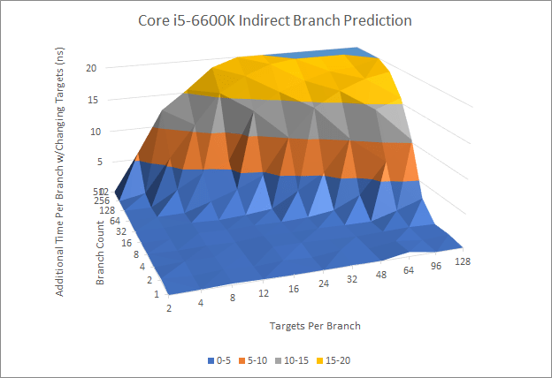

*图 24：更大目标空间。*

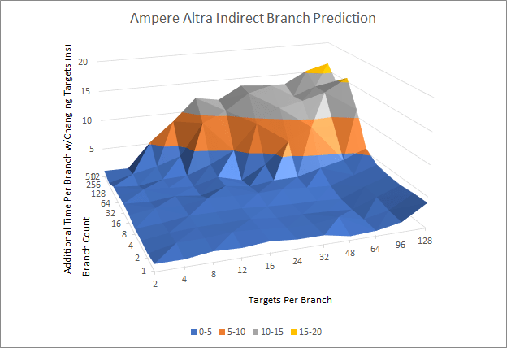

*图 25：512 Branch×4 Target 仍很稳。Return Stack 约31项，与A72/N1相同；Skylake只有16项但 Overflow 可回退到 Indirect Predictor。*

### 体系结构视角：预测“准、快、能覆盖大 Footprint”缺一不可

Direction Accuracy 决定 Squash 次数，BTB Latency 决定每个正确 Taken Branch 是否仍冒泡，Capacity/Decoupled Prefetch 决定大代码能否持续取指。FTC663 似乎把资源放到长 History，却没有同时解决多 Branch Aliasing 与 Target Speed，导致投入难转成应用 IPC。

## Code Fetch 与 Rename：L2 上只剩约 1 IPC

L1I 似乎为 48 KB，三宽 Decoder 却每周期只能 Decode 一条 NOP，因此带宽测试混用 NOP 与 `mov x0,0`。

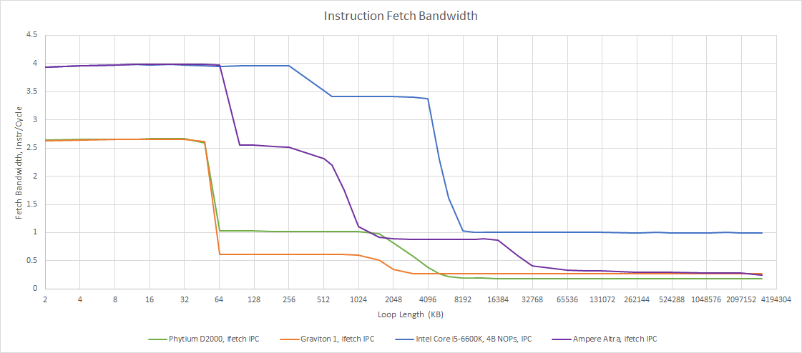

*图 26：FTC663/A72 出 L1I 后陡降；FTC663 从 L2 几乎固定 1 IPC，可能是 Predecode 每周期一条。N1 从 L2 仍接近 FTC663 L1I，Skylake 从 L3 也更高。*

Rename/Allocate 只做基本 Register Renaming，没有 Move Elimination、Zero Idiom Elimination 等；N1/Skylake 可避免向 ALU 发这些 Uop。

*图 27：PMU 证明没有 Uop 发往 ALU；FTC663/A72 无同类优化。*

## 乱序窗口：扩大 ROB/RF，却没有同步扩大每种资源

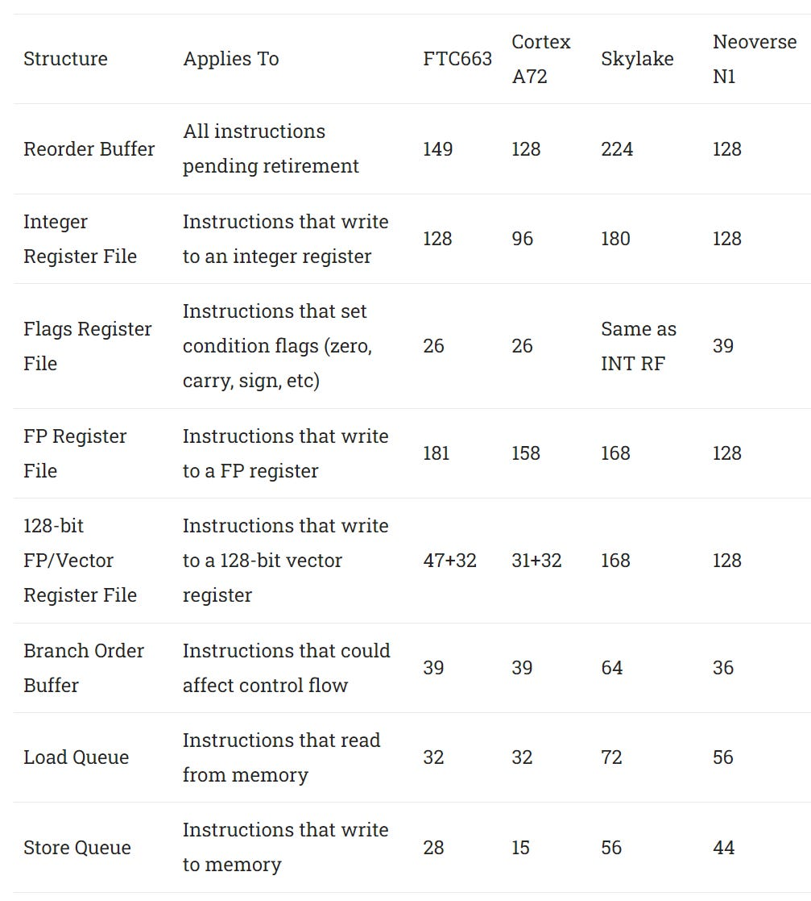

*图 28：FTC663 较 A72 增大 ROB/Register，并把 Store Queue 从 15 增到 28，部分接近 N1，整体低于 Skylake。*

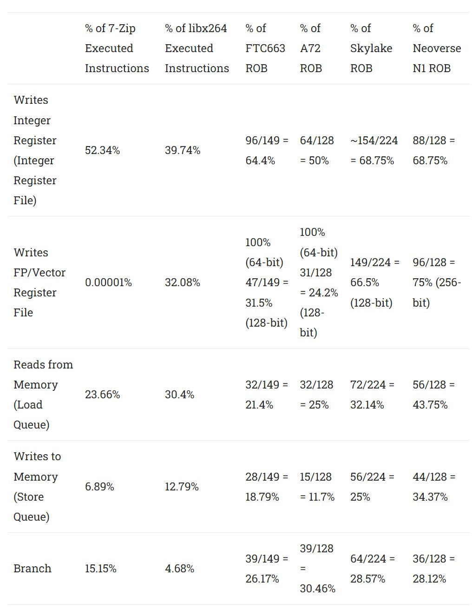

*图 29：Load Queue 没随 ROB 扩大，Flag Rename 也未增加；128-bit NEON 仍低效占用多个64-bit Register，任何一项先满都会阻塞 Rename。N1/Skylake 的资源占 ROB 比例更均衡。*

A72/FTC663 的 FP RF 大到覆盖 ROB，可能是为弥补 128-bit 值低效分配。二者还有罕见的 NOP 限制：只能越过约 38 NOP，尽管可越过百余条 FP；30 NOP 还会让 Integer Register Reorder 从 96 降到约70，说明 NOP 消耗未知 Shared Resource。

## Execution：四条 Specialized Integer Pipe，Vector 多为半宽

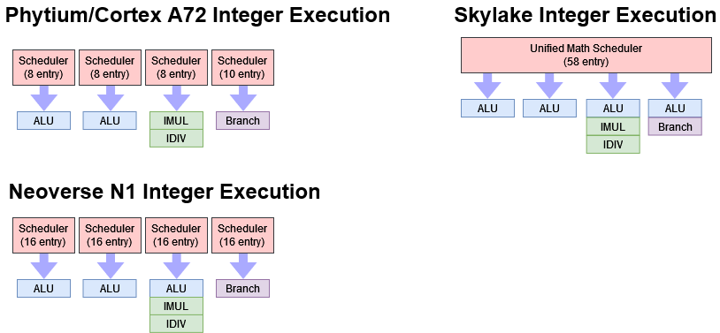

*图 30：两条 Simple ALU、一条 Branch、一条 Complex Integer；能力分布不均，但可简化 Result Bus，避免不同 Latency 指令同周期 Writeback 冲突。*

FP/Vector 与 A72 在所测混合下几乎一致，多数执行单元只有 64-bit，128-bit 指令执行两拍、但只占一个 Scheduler Slot；只有 Integer ALU 是全 128-bit，Latency 对 2.3 GHz 来说偏高。

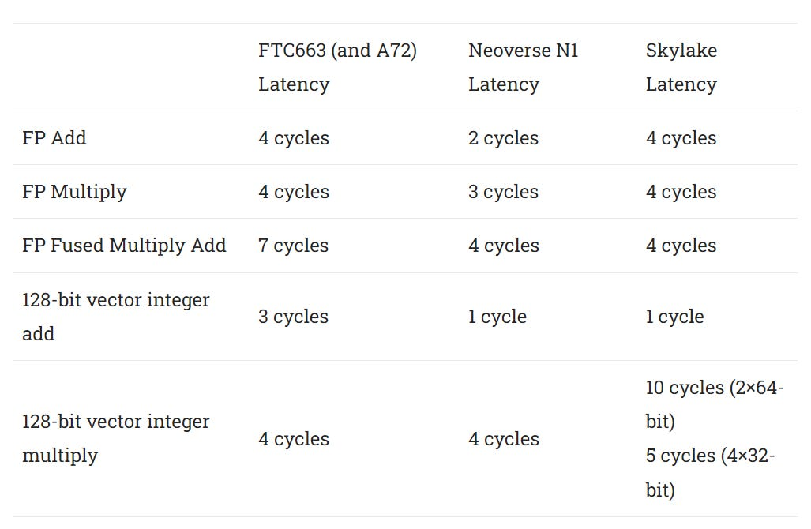

*图 31：弱吞吐解释 libx264。*

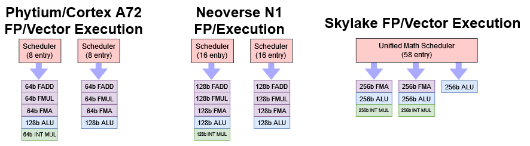

*图 32：N1 两条全宽 128-bit Pipe，多数情况每周期两条；Skylake 用 AVX2 全宽更强。*

## Load/Store：统一 AGU Scheduler 是进步，不做 Memory Dependence Prediction 是停滞

FTC663 有 Load Pipe+Store Pipe，Unified AGU Scheduler 比 A72 分离 Queue 更灵活；但 N1 两条都可 Load/Store，Skylake 每周期两 Load+一 Store。

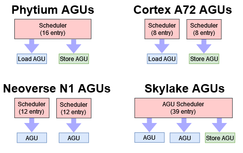

*图 33：单 Load AGU 也会限制普通 Scalar Code。*

LSU 不预测 Load 是否依赖未知地址的老 Store，所以所有先前 Store Address 明确前，年轻 Load 不能 Hoist。Store Forwarding 基础七周期；所有重叠都能转发，没有其他 CPU 常见的昂贵 Partial-overlap Fallback。只有 Load/Store 都跨 64 B 且部分重叠时加三周期，某些跨 16 B Partial Case 加两周期。

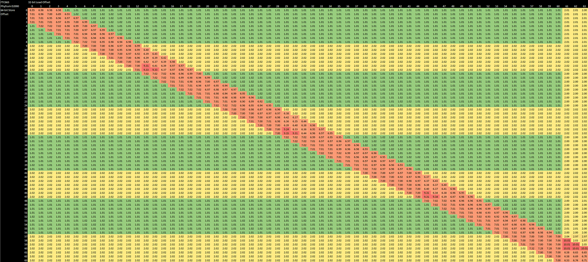

*图 34：采用 Henry Wong 方法移植到 Arm。*

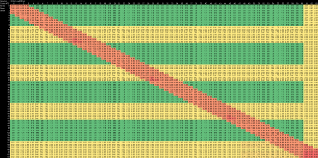

*图 35：总体相似，FTC663 减少部分跨 Line 惩罚。*

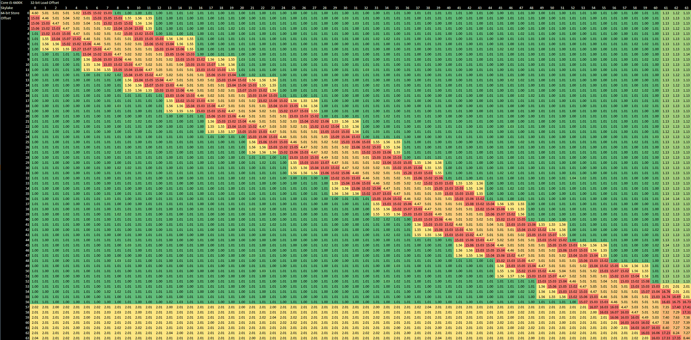

*图 36：N1/Skylake 的 Partial Overlap 某些路径更贵。独立访问方面，FTC663 Store 跨16 B加一周期，Load 跨64 B加一周期；推测 L1D 有16 B Sector、双 Read Port 让跨16 B Load免罚。*

## Cache、TLB 与 Memory：容量尚可，延迟和带宽很差

每核 32 KB L1D、每双核 Cluster 2 MB L2、全芯片共享 4 MB L3；L1D 四周期。

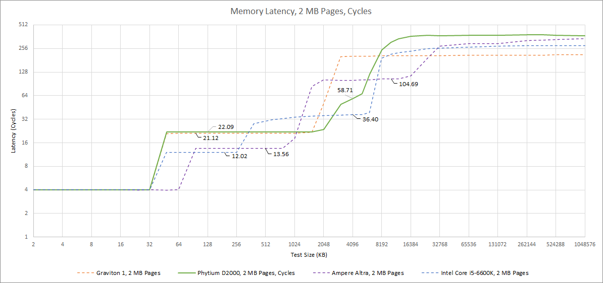

*图 37：L2 22周期，容量不错却接近 Skylake 更大 L3 的真实延迟。*

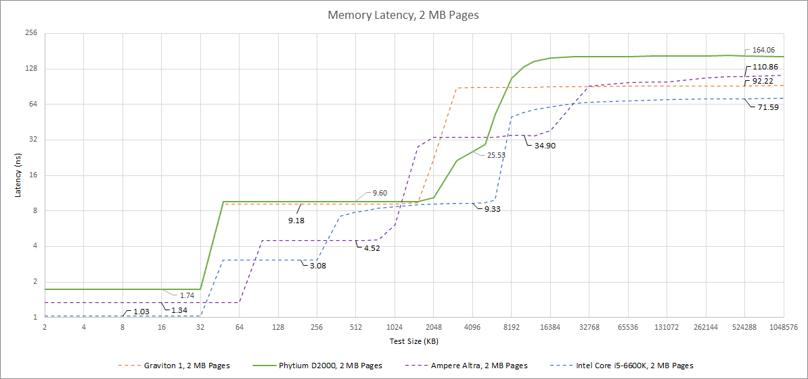

*图 38：L3 超过50周期、20 ns；DRAM 164 ns，比对照 Server 还差，甚至慢于双路 Westmere 访问远端 DDR3 的约120 ns。*

2 MB Page 用于隔离 Cache；普通 Client 多为4 KB。FTC663/A72 L1 DTLB 约32项，4 KB Page 下在 L1D 容量内也出现奇怪延迟升高，2 MB Page 时消失，确定与翻译有关但机制未知。

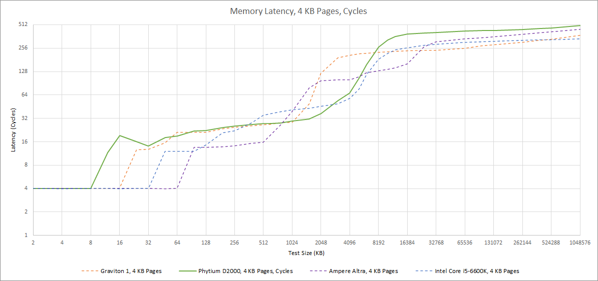

*图 39：L2 TLB 约1024项，Hit 比 L1 TLB 多约7周期。*

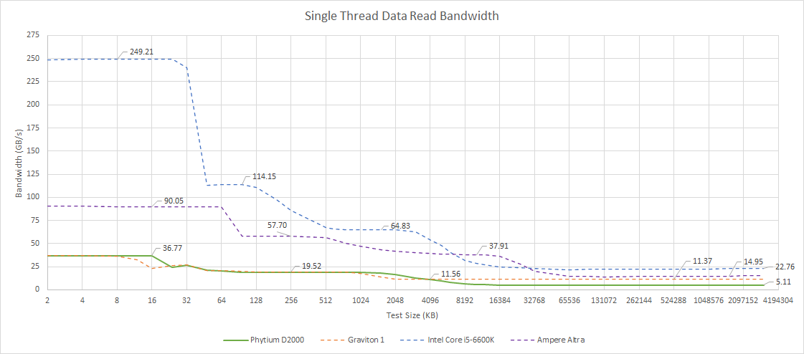

*图 40：左为 GB/s，右为 B/cycle。FTC663/A72 普遍低，单 Load AGU 可能限制 Scalar；N1 仍远高，Skylake 为 Vector 重负载设计。*

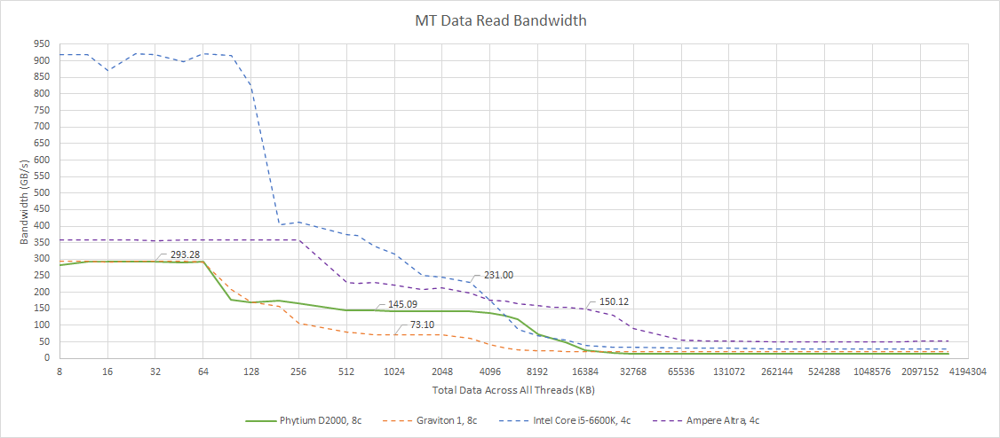

*图 41：D2000 用八核对四核才稍缩差距。*

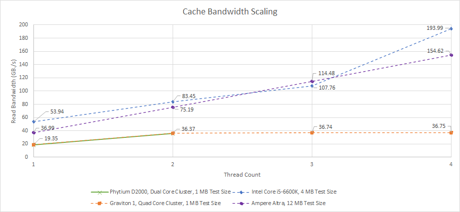

*图 42：A72 四核共享 L2 在两线程后不再扩展；D2000 可能因此选择双核 Cluster、多份 L2，属于基于行为的解释。现代 Ring/Mesh+Distributed Slice 扩展更好。*

## 拓扑：双核内快，跨 Cluster 很慢

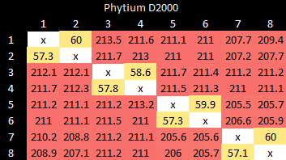

*图 43：两核 Cluster 边界清楚。*

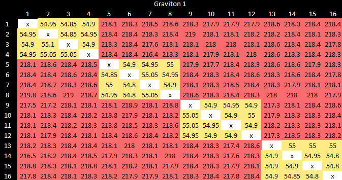

*图 44：延迟形态近似但 Cluster 更大。*

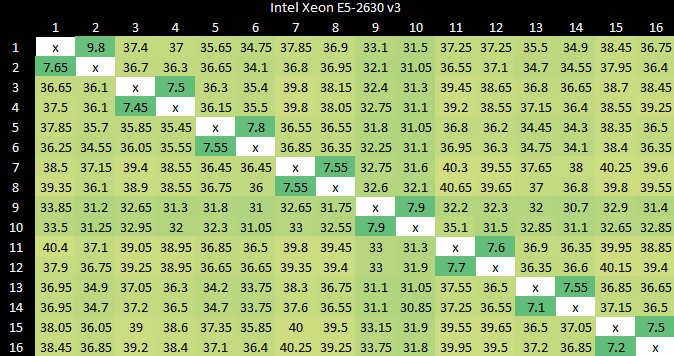

*图 45：Intel 在八核统一 Ring 上显著更低。*

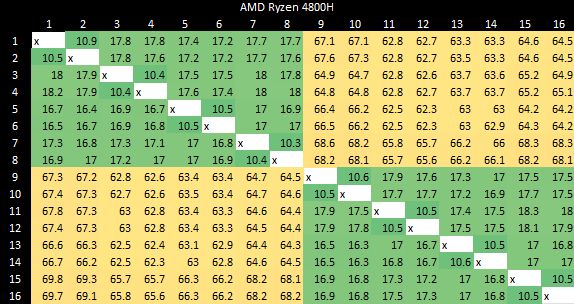

*图 46：Desktop Zen 2 跨 CCX 有额外代价，却仍远低于 D2000。多数应用很少 Ping-pong 同一 Line，因此这项通常不影响性能，除非同步极重。*

## 两层结论：消费者价值与产业判断

作为普通桌面/移动产品，D2000 在良好多线程负载也输七年前四核 i5，测试系统价格超过500美元，同价可组八核 Zen 3；二手 i5 约50美元。D2000 Die 132.08 mm²，还大于 Skylake 122.4 mm²。

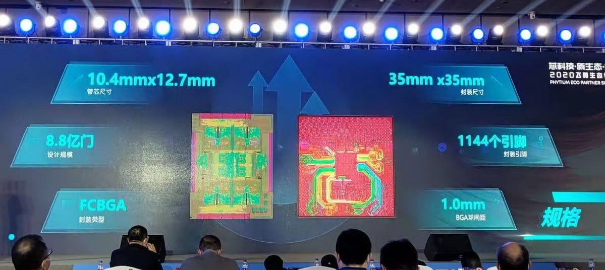

*图 47：来自 HKEPC 飞腾 Slide。价格/二手市场是2022年时点。*

材料随后从产业自立背景评价：短期性能不足，长期可视为建立设计/制造经验的高成本投入。更具争议的判断是，FTC663 并非 Ground-up：它与 A72 不仅大结构相似，连 5-cycle Integer Multiply、Scalar FP Pipe 利用问题、一周期一 NOP、NOP 消耗额外 OoO Resource、128-bit Register 低效分配、48 KB L1I+4096 BTB、4 KB Page 在16 KB后异常等怪癖都相同；L1/L2 Bandwidth、Load Queue、Flag Rename 也匹配。

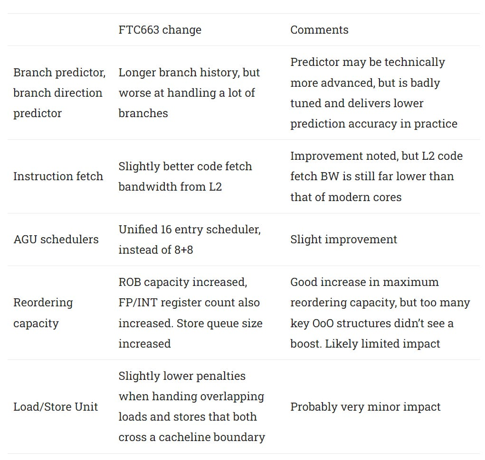

*图 48：更大 ROB/RF、Store Queue与 L2 Fetch 是前进；Load Queue未配套、L2仍慢、Predictor反而退步，额外投机工作常因 Mispredict 被丢弃。结构相似是强证据，但没有 RTL/授权资料，不能升级成代码来源的事实认定。*

N1 展示了更成功的后继方向：准确而快速的 Predictor、BPU-driven Prefetch、低延迟 L2、可让 Load 越过未知 Store、均衡 OoO Resource。文章因此对飞腾长期能力悲观。这是基于一颗 2022 年样品与微基准的评价，不等于对所有后续飞腾产品的事实判决；政治措辞与地缘判断也应保留为文章立场，而非微架构实测结论。

## 参考资料

- Chester Lam, *China’s Phytium D2000: Building on A72?*, Chips and Cheese, 2022-09-28
- Arm Cortex-A72 Software Optimization Guide
- Henry Wong，Store-to-load Forwarding 方法；Agner Fog Instruction Table
- HKEPC 飞腾 D2000 Die/Platform 资料
