# Qualcomm Centriq 2400 与 Falkor：48 核 Arm 服务器往事

> **文章来源**
>
> - 文章：*Qualcomm’s Centriq 2400 and the Falkor Architecture*
> - 撰文：Chester Lam
> - 首发：Chips and Cheese
> - 发布：2025 年 5 月 29 日
> - 链接：https://chipsandcheese.com/p/qualcomms-centriq-2400-and-the-falkor

云计算在 2010 年前后迅速兴起，最初主要由 AMD Opteron 与 Intel Xeon 提供算力。庞大的云服务器市场自然会吸引其他处理器厂商。到 2010 年代中期，Qualcomm 已经在移动 SoC 市场占据重要位置，也积累了多代自研 CPU 核心，因而有理由相信自己能把低功耗设计经验带进数据中心。

服务器芯片拥有很多核心，平均到每核的功耗预算较低。这会削弱 AMD 和 Intel 在高单线程性能上的传统优势，也让 Qualcomm 熟悉的能效与面积优化变得更有价值。大规模移动芯片出货还帮助 Qualcomm 获得 Samsung 10 nm FinFET 工艺，在 Intel 14 nm 面前至少有机会拉平工艺差距，并以更低功耗、更高密度和更低平台成本进入云计算市场。

*图 1：网页正式图注说明图片来自 Qualcomm 2017 年演示，幻灯片日期为 2017 年 11 月 8 日。Centriq 2400 的目标不是消费级桌面，而是以高核心密度进入数据中心。*

不过，云服务器不能靠“堆很多弱核心”解决所有问题。Qualcomm 在 Hot Chips 上强调，吞吐量、线程密度、服务质量和能效之外，每线程性能、每瓦性能与单位成本仍是关键指标；尤其是尾延迟敏感的服务，一颗 Arm 核心即便不必逐核追平 Xeon 或 EPYC，也必须达到可接受的性能底线。

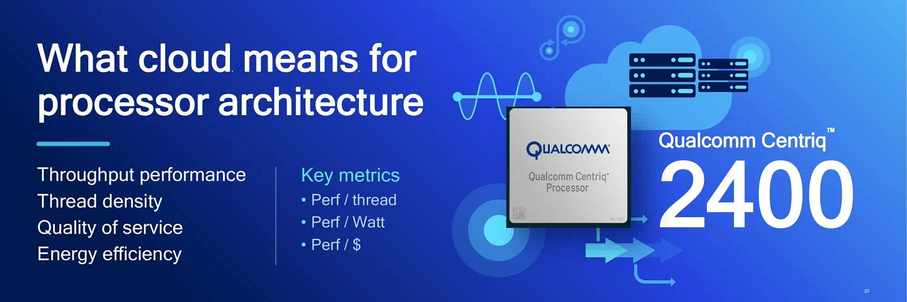

*图 2：Qualcomm 把 Throughput Performance、Thread Density、Quality of Service 与 Energy Efficiency 并列，并用 perf/thread、perf/watt 和 perf/dollar 衡量。它说明 Centriq 的价值主张从一开始就是多目标优化，而不是只追求核心数。*

## 测试平台与结论边界

这次测试使用 Centriq 2452，系统由 Corellium 免费提供，并由 Neggles（Andi）完成搭建和运行。平台识别为 `Qualcomm Centriq 2400 Reference Evaluation Platform CV90-LA115-P23`，配有 96 GB DDR4-2666。

Centriq 2452 为 46 核、57.5 MB L3、2.2 GHz 基准频率和 2.6 GHz 全核峰值频率，TDP 为 120 W。网页中的对照还涉及 Snapdragon 821 Kryo、Amazon Graviton 1 的 Cortex-A72、Core i5-6600K Skylake，以及更晚的 Ampere Altra、AmpereOne 和 Crestmont E-Core。这些处理器跨越移动、云服务器与桌面平台，也跨越不同工艺、频率和软件环境，图中差异不能全部归因于单颗 CPU 核心。

网页没有完整披露操作系统与内核、编译器及参数、SPEC CPU2017 构建方法和输入、微基准源码、线程绑定、锁频、预热、重复次数和误差范围。曲线适合识别容量台阶、吞吐上限与系统拓扑，但很小的数值差不宜离开这些条件作产品排名。

下文按网页中的 37 张正文图展开。Qualcomm 幻灯片属于厂商公开资料；曲线与行为矩阵来自 Chips and Cheese 测试；队列容量、端口关系和内部组织中的问号则是反推。材料不含 Falkor RTL，所以显式标为“体系结构视角”的段落只解释通用机制、阻塞与验证路径，不把教学分析写成 Qualcomm 已确认的内部电路。

## 一、核心总览：为密度而设计的四宽 AArch64 核心

Falkor 以较低功耗和较小面积达到云服务器所需的单线程性能底线。它是一颗四宽 AArch64 核心，执行 64-bit Armv8 指令集，并吸收少量 Armv8.1 特性；由于当时没有庞大的 32-bit Arm 服务器软件存量，它没有保留 AArch32。Falkor 是 Qualcomm 第五代自研 CPU 核心，也是第一颗专门面向云计算的自研核心。

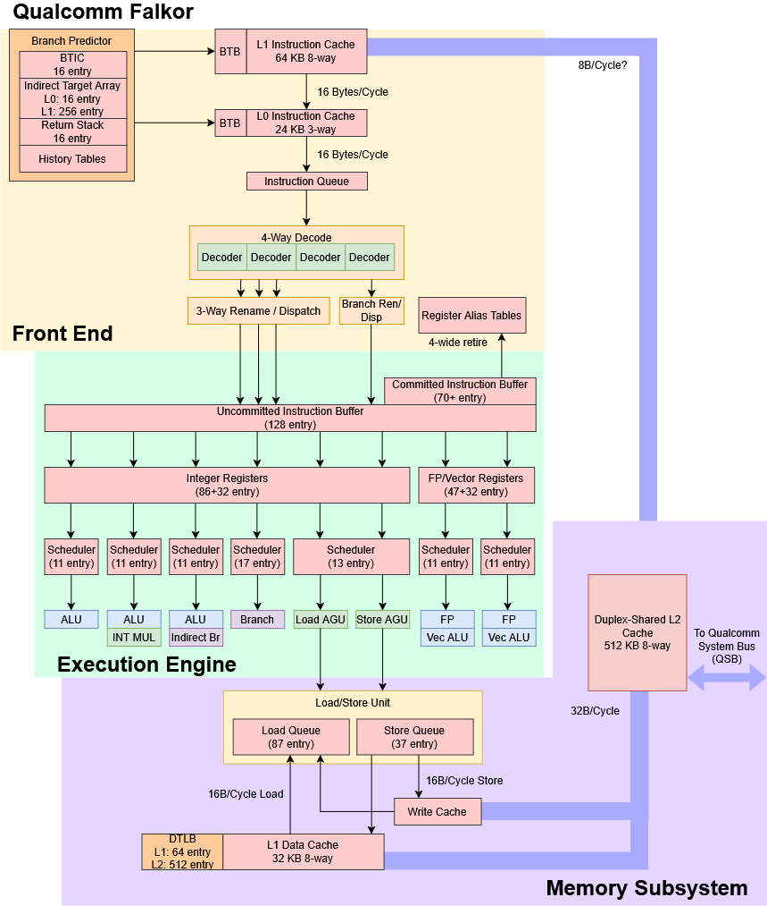

*图 3：Chips and Cheese 依据 Qualcomm 资料与微基准整理的总览。前端有 24 KB、3 路 L0 I-Cache，64 KB、8 路 L1 I-Cache，均为 16 B/cycle，并接四宽译码；图中还标出 L2 到取指侧为 8 B/cycle。重命名常规路径为三宽，第四槽主要留给分支。后端标出 128 项 Uncommitted Instruction Buffer、70＋项 Committed Instruction Buffer、约 118 项整数和约 79 项 FP/向量寄存器、87 项 Load Queue、37 项 Store Queue，以及三个整数 ALU、独立直接分支管线、Load/Store AGU 和两条 FP/向量管线。总览还把二级间接目标阵列画成 256 项，正文却写作 512 项；这一差异无法仅凭现有材料消除。*

Centriq 2400 系列最多集成 48 颗 Falkor，Die 面积约 398 mm²，TDP 120 W。若只按 TDP 上限平均分摊，48 核版本正好是 2.5 W/core；Qualcomm 同时表示，典型全核负载通常低于 120 W，因此实际平均核心功耗可低于这一数字。

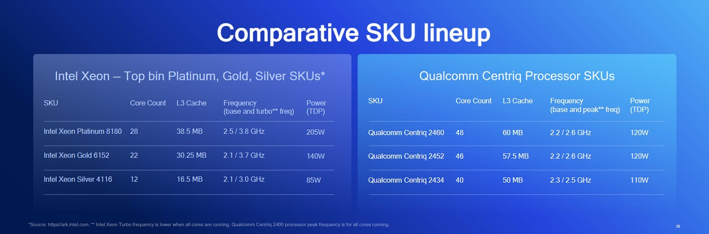

*图 4：网页正式图注称其为 Qualcomm 的 Centriq SKU 幻灯片。Centriq 2460 为 48 核、60 MB L3、2.2/2.6 GHz、120 W；2452 为 46 核、57.5 MB、2.2/2.6 GHz、120 W；2434 为 40 核、50 MB、2.3/2.5 GHz、110 W。对照的 Xeon Platinum 8180、Gold 6152、Silver 4116 分别为 28/22/12 核和 205/140/85 W。厂商 SKU 表只能展示产品取向，不能直接证明性能或整机功耗优势。*

### 体系结构视角：服务器“每核够快”与“整片够密”必须同时成立

48 核/120 W 意味着核心、共享 Cache、互连、内存控制器和 I/O 都要在紧张功耗预算内工作。缩窄向量数据通路、减少执行端口或简化重命名能节省面积和动态功耗，却可能拉长单请求服务时间；单线程越慢，完成同一工作所需的驻留时间越长，反而会增加排队与尾延迟。

判断这种取舍不能只看 TDP/core。更有意义的是同时记录每核 IPC、频率、整片功耗、吞吐随线程数的扩展、P95/P99/P999 延迟，以及共享 L3、环网和 DRAM 的队列占用。只有“每线程达到服务底线”和“增加核心后吞吐近似扩展”同时满足，高密度设计才真正转化为云计算优势。

## 二、前端：双层指令 Cache、耦合式目标缓存与 BTIC

Falkor 延续 Krait 的思路，在常规 L1I 前增加一层 L0 指令 Cache。24 KB、3 路组相联 L0 以较低功耗和较短延迟服务绝大多数取指，64 KB、8 路 L1I 则覆盖更大的代码足迹。L0 保存的仍是 ISA 指令字节，而不是已经译码的微操作；功能定位虽类似其他核心的 Loop Buffer 或 Op Cache，实现对象却不同。

两级 I-Cache 都能以 16 B/cycle 喂饱四宽译码器，而且彼此互斥，因此有效指令容量为 88 KB。为维持互斥关系，Qualcomm 可能采用类似 Victim Cache 的迁移方式：若是这样，外部探测必须同时检查两级，L1 命中还要把被替换 L0 行回拷到 L1，再将新行填入 L0。包含式设计可让 L1 充当 L0 的 Snoop Filter、降低 L1 访问迁移成本，却会损失有效容量。网页没有给出足够证据确认具体交换流程。

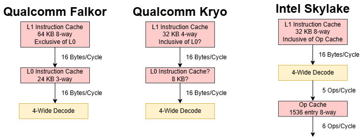

*图 5：Falkor 的 64 KB L1I 与 24 KB L0I 互斥，总计 88 KB，二者均向四宽译码提供 16 B/cycle。Kryo 画作 32 KB L1I 加可能为 8 KB 的 L0I，包含关系带问号；Skylake 则是 32 KB L1I、四宽译码和 1536 项、8 路 Op Cache。三种方案分别在指令字节容量、译码复用和访问延迟之间取舍。*

这种 88 KB 指令容量在当时很突出，直到几年后的 Apple M1 才在这一维度超过 Falkor。大容量也降低了 L2 代码带宽的重要性。不过，代码一旦越过两级 I-Cache，吞吐仍像同期很多 64-bit Arm 核心或 AMD Zen 之前的核心那样明显下降，只是 Falkor 比 Cortex-A72 稍好。

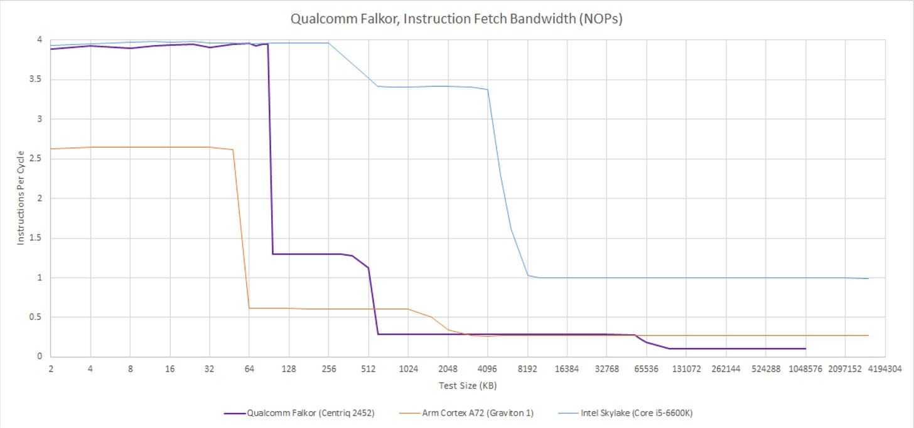

*图 6：纵轴为 Instructions Per Cycle，横轴为 KB 级工作集。Falkor 在约 88 KB 以内接近 4 IPC，随后约为 1.3 IPC，越过约 512 KB 后降至约 0.27 IPC；A72 在较小容量后从约 2.6 降至约 0.6，再落到约 0.25 IPC；Skylake 在 256 KB 以内接近 4 IPC，在数 MB 范围仍约 3.4 IPC，约 8 MB 后才降至 1 IPC。曲线反映完整取指路径，不等于某一条 Cache 总线的裸带宽。*

两级指令 Cache 都用奇偶校验保护。若检测到错误，硬件可将受损行失效并从 L2 重新装入。由于指令副本能从下层恢复，奇偶校验已经足够；不必像保存唯一脏数据的结构那样使用更昂贵的纠错码。

### 分支目标直接随指令 Cache 返回

Falkor 把分支目标与指令字节放在同一 Cache 中，使 L0/L1I 同时承担分支目标缓冲器（Branch Target Buffer，BTB）的作用。一次 Cache 访问即可得到指令与目标，不必另读解耦 BTB；代价是预测器无法越过 L1I miss，沿尚未取回的控制流提前发起更远的指令预取。

L0 命中时，Taken 分支产生一个流水线气泡，即约 2 cycle；来自 L1 的目标最慢约 6 cycle。为了让最小分支工作集实现零气泡，Falkor 还设置 16 项 Branch Target Instruction Cache（BTIC）。BTIC 与只缓存地址的 BTB 不同，它保存分支目的地处的指令，因而可以直接绕开 L0 的访问延迟。

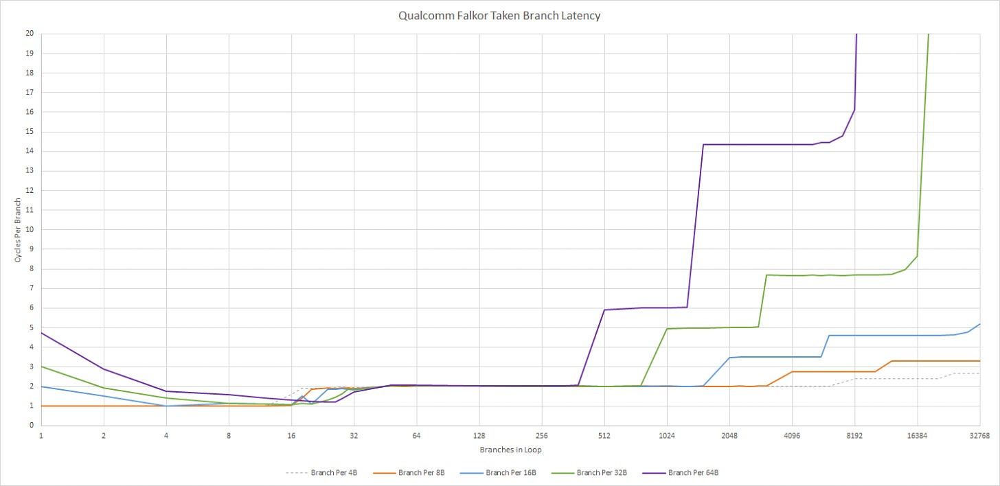

*图 7：横轴为循环内分支数，纵轴为 cycles/branch，曲线对应每 4/8/16/32/64 B 一个分支。很小工作集受 16 项 BTIC 影响；随后大体进入约 2 cycle 的 L0 区间，代码跨过 24 KB 与 64 KB 层次后逐级升到约 6、14 cycle 乃至更高。拐点随分支间距移动，说明代码字节工作集和目标条目数共同作用。*

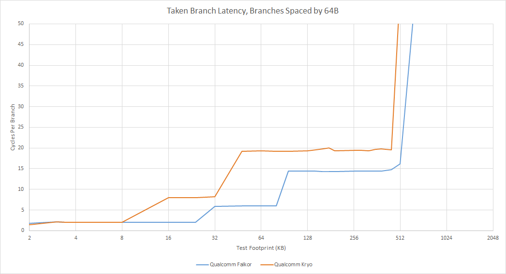

*图 8：Falkor 在较大代码范围内维持约 2 cycle，随后约为 6 cycle 和 14 cycle；Kryo 的低延迟覆盖范围更小，较早进入约 8 cycle 与 19 cycle 区间。两条曲线说明 Falkor 用更大指令缓存改善目标覆盖，但耦合式组织仍会在 Cache 边界处形成明显台阶。*

### 方向、间接目标与返回

方向预测使用多张不同历史长度的表，并为每条分支跟踪哪种历史长度、哪张表最有效。Qualcomm 描述的思想与 Tagged Geometric History Length（TAGE）预测器相似：都让不同分支选择更合适的历史尺度，并避免为每条分支保存完整长历史。但 Falkor 不一定是经典 TAGE，例如历史长度未必按几何级数递增，现有资料也没有给出索引、Tag 或替换细节。

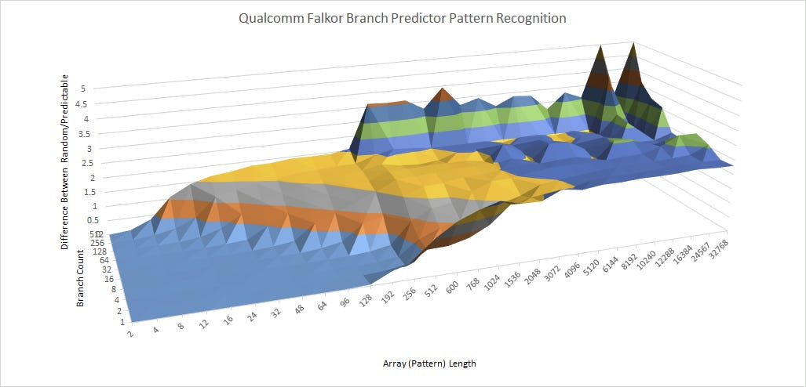

*图 9：横轴增加重复模式长度，侧轴增加静态分支数量，纵轴为随机与可预测模式的时间差。Falkor 在较多分支并存时仍维持更大的低代价区域；曲面抬升同时受历史有效长度、表容量、索引冲突和别名影响，不能据此唯一识别预测算法。*

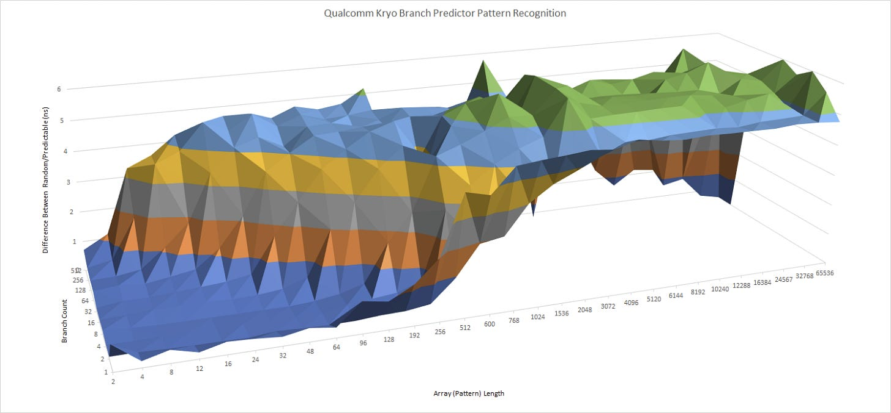

*图 10：与 Falkor 使用相同测试思路。少量静态分支时，两者能处理的最长重复模式接近；分支数量增大后，Falkor 的表现略好，说明服务器核心在工作集容量或冲突控制上有所加强。*

间接分支从寄存器读取目标，同一条静态指令可能去往多个地址。Falkor 为此使用两级间接目标阵列：正文给出的一级为 16 项、二级为 512 项；图 3 总览却标成 16＋256 项。这是一处材料内部口径差异，应保留为未确定项。

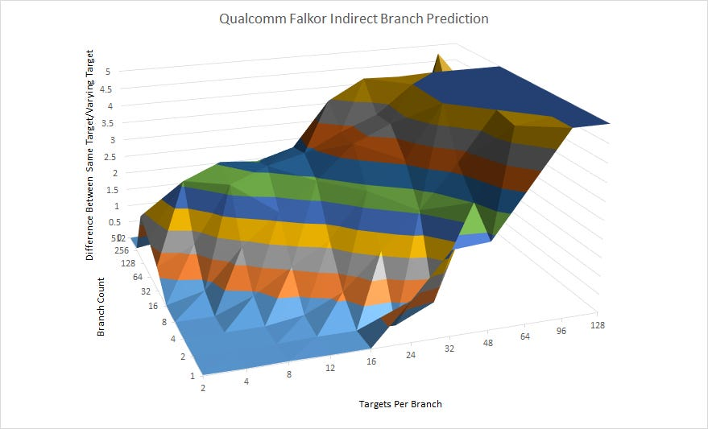

*图 11：横轴为每条间接分支的动态目标数，侧轴为静态分支数，纵轴为固定目标与变化目标之间的时间差。只要所有间接分支的目标总数不超过约 16，多个目标几乎没有额外代价；既可以是一条分支轮换 16 个目标，也可以是八条分支各轮换两个目标。超过快速层容量后，曲面明显抬升。*

函数返回是间接分支的特殊形式，因为目标通常就是最近一次调用的返回地址。Falkor 与 Kryo 都表现出约 16 项返回地址栈（Return Address Stack，RAS），Cortex-A72 则约为 31 项。三者在栈容量以内，一对 call/return 约需 4 cycle，平均到每条带链接分支约为 2 cycle。

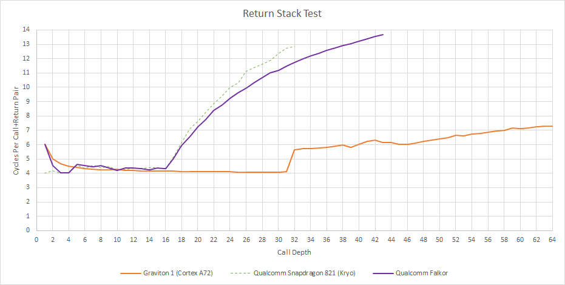

*图 12：Falkor 和 Kryo 在调用深度 16 以内约为 4 cycles/pair，随后持续升高；A72 在约 31 层前保持约 4 cycle，之后升到约 5.5 cycle 并缓慢增加。容量来自端到端拐点估计，不能替代 RAS 阵列、投机指针与恢复逻辑的 RTL 证据。*

四个译码器每周期最多把四条 AArch64 指令转成微操作。多数常见指令力求保持单微操作，128-bit 向量运算是重要例外，后文会看到它们通常拆成两条。

### 体系结构视角：把目标放进 I-Cache，节能与前瞻能力会互换

目标与指令同取可以减少一次独立 SRAM 访问，BTIC 又让最常见的小循环绕开 L0 延迟，适合功耗敏感设计。可一旦 L1I miss，目标流也被同一缺失截断，取指器难以在代码返回前继续沿预测路径预取。大容量 L0/L1I 能降低这种情况的发生率，却不能消除大代码足迹的长延迟。

验证这类组织应把方向 MPKI、BTIC/目标命中、L0/L1I miss、redirect 周期、取指字节和译码微操作放在一起。RTL 中还要核对投机历史、间接目标、RAS 指针和 BTIC 内容在误预测、异常及上下文切换后的恢复。如果方向正确而 fetch PC 仍在 Cache 边界周期性断流，瓶颈更可能来自目标交付与指令层次，而不是方向表本身。

## 三、重命名与乱序执行：名为四宽，常规路径更接近三宽

译码后的微操作需要在后端分配寄存器、完成跟踪和调度资源。Falkor 每周期最多处理四条，但第四槽只能接受直接分支，以及 NOP、已识别的立即数清零等少数特殊情况。`cbz/cbnz` 把 ALU 比较与条件分支合在一条指令内，也不能进入第四槽。因此，它更准确的形态是“三条普通指令＋一条受限分支槽”，并非所有组合都能四宽重命名。

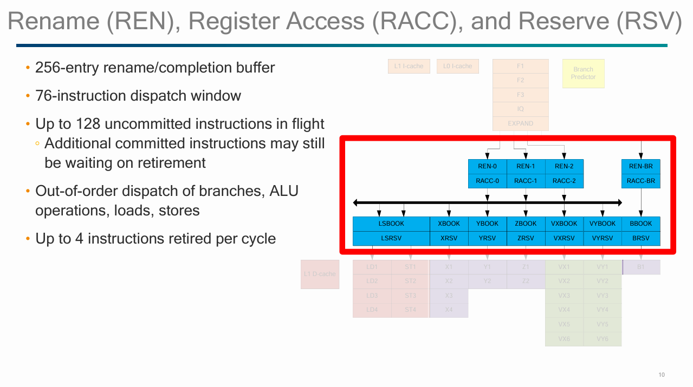

*图 13：网页正式图注说明它来自 Qualcomm Hot Chips 演讲。幻灯片给出 256 项 Rename/Completion Buffer、76 指令 Dispatch Window、最多 128 条未提交指令、额外已提交但等待退休的指令，以及每周期最多退休四条。右侧结构图明确画出 REN-0/1/2 和独立 REN-BR，支持“3＋1”重命名路径。*

重命名器能识别“把立即数 0 写入寄存器”的专门清零形式，但没有观察到常见的 Move Elimination，也不能识别寄存器与自身 XOR 或相减必然得到零。这意味着这些指令仍需分配结果寄存器，并占用执行与退休资源。

Falkor 没有一张传统意义上的 ROB，而是用多种结构共同支持乱序执行，并保证最终结果仍按程序顺序可见。Qualcomm 给出 256 项 Rename/Completion Buffer、128 条未提交指令，以及 70＋条已经提交但尚待退休的指令；总计可有约 190 条在途。网页正文有一句把后 70＋条也写成“uncommitted”，与官方幻灯片的“committed instructions may still be waiting on retirement”不一致。结合图 3 和图 13，下文保留“128 未提交＋70＋已提交待退休”这一图示口径，同时指出文字差异。

Falkor 与 Cortex-A73 的端到端行为相似：一条长延迟 Load 阻塞时，核心仍能在它之后释放物理寄存器和 Load/Store Queue 条目，因此用 Load 单独阻塞退休看不到固定窗口上限，测试距离甚至可越过 256 条。换成一条尚未解析的分支后，乱序释放会被阻挡，才显出约 127～128 条未提交指令的拐点；这可能正对应 Qualcomm 所说的 uncommitted instructions。

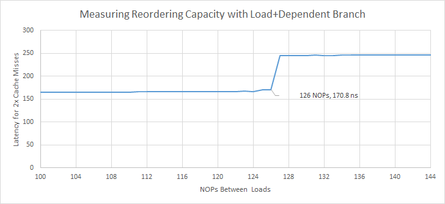

*图 14：横轴是在两次 Load 之间插入的 NOP 数，纵轴为两次 Cache miss 的端到端延迟。曲线在约 127 条附近由约 165 跃升至约 244 ns，图中标注“126 NOPs, 170.8 ns”。这个端到端边界与 128 条官方口径接近，但不能简单称作 128 项传统 ROB。*

从这类“未提交指令”视角看，Falkor 与 Kryo 的重排序容量接近；资源配比却明显改变。Falkor 的寄存器略多，更关键的是 Load/Store Queue 大幅加深，设计目标从 Kryo 的高核心峰值吞吐转向非向量服务器代码的持续供给。

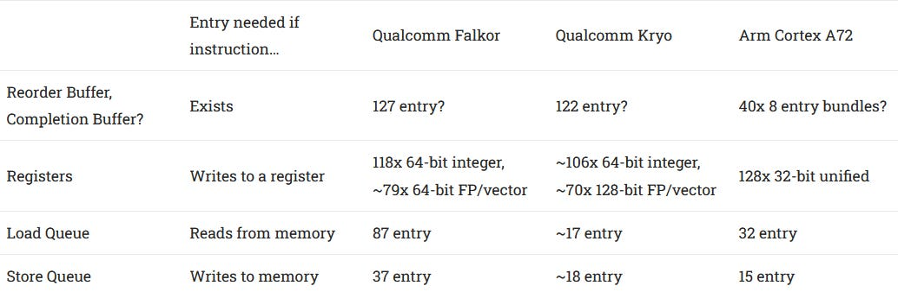

*图 15：微基准估计 Falkor 约有 127 项完成跟踪、118 个 64-bit 整数寄存器、约 79 个 64-bit FP/向量寄存器、87 项 Load Queue 和 37 项 Store Queue；Kryo 约为 122、106、128、17、18；Cortex-A72 画作 40×8 项 bundle、128×32-bit 统一寄存器、32 项 Load Queue 和 15 项 Store Queue。问号与不同计数单位说明这些数字只能在各自语境中比较。*

### 执行端口：整数专用化，向量数据路只有 64 bit/cycle

整数侧有三条 ALU 管线和一条专门处理直接分支的第四管线，间接分支则占用某条 ALU。一个 ALU 端口带整数乘法器，64-bit 乘法延迟 5 cycle、吞吐每周期一条。三条 ALU 各由约 11 项小型调度队列供给，直接分支调度容量在总览图中约为 17 项。

FP/向量侧有两条大体对称的管线，也分别搭配约 11 项调度器。两条都能处理 FP add、multiply、FMA，以及向量整数加法与乘法；AES 等专用操作只在其中一条可执行。标量 FP 延迟与吞吐接近 Kryo，但每条 FP/向量管线的数据吞吐只有 64 bit/cycle，128-bit 运算会拆成两条微操作，同时消耗两个调度槽、两个寄存器槽和两个完成跟踪条目。

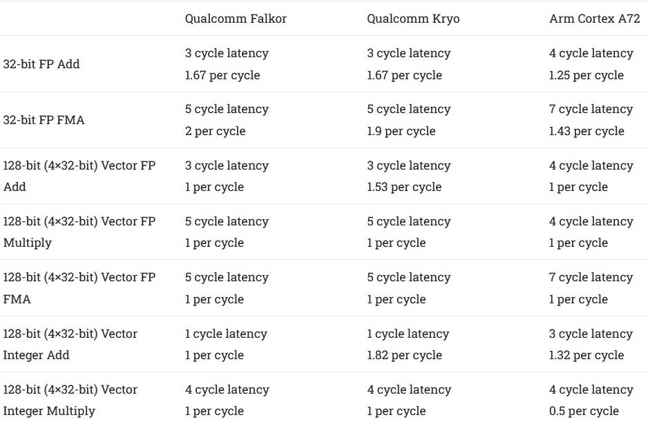

*图 16：Falkor/Kryo/A72 的 32-bit FP add 分别为 3 cycle、1.67/cycle；3 cycle、1.67/cycle；4 cycle、1.25/cycle。32-bit FMA 为 5 cycle、2/cycle；5 cycle、1.9/cycle；7 cycle、1.43/cycle。128-bit FP add 为 3 cycle、1/cycle；3 cycle、1.53/cycle；4 cycle、1/cycle；128-bit FP multiply 为 5 cycle、1/cycle；5 cycle、1/cycle；4 cycle、1/cycle；128-bit FMA 为 5 cycle、1/cycle；5 cycle、1/cycle；7 cycle、1/cycle。128-bit 整数 add 为 1 cycle、1/cycle；1 cycle、1.82/cycle；3 cycle、1.32/cycle；128-bit 整数 multiply 为 4 cycle、1/cycle；4 cycle、1/cycle；4 cycle、0.5/cycle。*

### 体系结构视角：乱序资源能提前释放，窗口就不再等于一张 ROB

传统直觉把“未退休”与“资源仍被占用”绑定在一起；Falkor 的行为说明二者可以分离。更年轻指令虽然尚不能按架构顺序退休，却可能已经完成，并释放物理寄存器或 LSQ 资源。这样能继续接受新工作，降低长延迟 Load 对吞吐的影响，但完成跟踪、异常状态和架构顺序必须由其他结构继续保存。

异常或误预测发生时，核心仍要精确恢复。验证不能只数一张缓冲区深度，而要分别构造长延迟 Load、未解析分支、寄存器压力和 LSQ 压力，观察 rename stall、各资源 free count、完成/提交/退休指针和恢复 checkpoint。若 Load 后能继续释放资源、分支后却出现固定台阶，就支持“不同阻塞类型控制不同资源生命周期”的解释。

## 四、Load/Store：双 Tag L1D 与一块“类写回”侧边结构

Falkor 的 Load/Store 子系统以每周期一条 Load 和一条 Store 为设计目标。Load AGU 与 Store AGU 各自负责一种操作，由约 13 项统一调度器供给。L1D 命中时 Load-to-use 延迟为 3 cycle，Load AGU 还能无额外代价处理 indexed addressing。

32 KB、8 路 L1D 的访问宽度为 16 B/cycle。Qualcomm Hot Chips 幻灯片写作“每周期 128-bit Load 和 128-bit Store”，但微基准只观察到以下组合：单次 128-bit Load、单次 128-bit Store，或同周期一条 64-bit Load 加一条 64-bit Store；混合 128-bit Load 与 128-bit Store 也未超过合计 128 bit/cycle。公开宣称与端到端测试之间存在差异，可能涉及端口、数据路径、地址组合或测试覆盖，现有材料无法唯一解释。

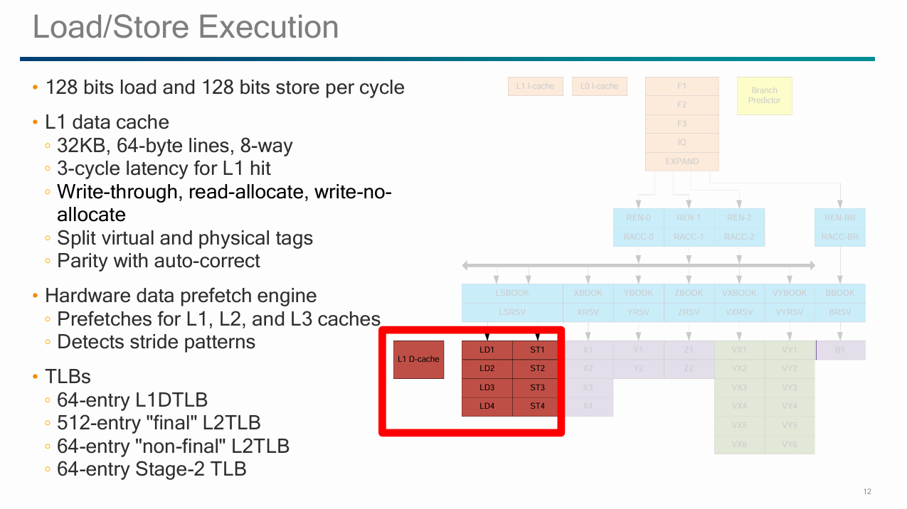

*图 17：Hot Chips 幻灯片给出 32 KB、64 B Cache Line、8 路 L1D，3 cycle 命中，Write-through、Read-allocate、Write-no-allocate，虚拟与物理 Tag 分离，奇偶校验自动恢复；硬件数据预取器可为 L1/L2/L3 识别 stride。TLB 包括 64 项 L1 DTLB、512 项 final L2 TLB、64 项 non-final TLB 和 64 项 Stage-2 TLB。图中 128-bit Load＋128-bit Store/cycle 与微基准可见的合计 128-bit/cycle 不一致。*

### 虚拟 Tag 让部分 Load 不必等待地址翻译

普通 Virtually Indexed, Physically Tagged（VIPT）Cache 可以用虚拟地址选择 Set，却仍要等物理地址回来后比较 Tag。Qualcomm 的设计让 L1D 每个位置同时关联虚拟与物理 Tag。Hot Chips 的解释是：如果某类 Load 可以跳过 TLB 查询，就能更早取出并返回数据；在确认无需物理 Tag 的情况下，命中路径可以进一步缩短。

这是一种很有辨识度的组织，也留下了别名问题：不同虚拟地址可能映射到同一物理地址。网页没有给出 Falkor 如何检测、合并或失效这些 synonym，也没有说明哪些 Load 能完全跳过物理 Tag 检查，因此不能把“部分 Load 可跳过翻译”扩展为所有 L1D 命中都不需要 TLB。

Store 路径甚至不在初始阶段检查 Tag。Falkor 的 L1D 是 Write-through，旁边另有一块未命名结构；Qualcomm 把它描述成 Store Buffer、Load Fill Buffer 和来自 L2 的 Snoop Filter Buffer 的组合，像一块侧置的 Write-back Cache，既保留写回式的性能和功耗收益，又无需让 L1D 本身真正写回。

为了便于讨论，Chips and Cheese 借用 Bulldozer 的名称，把这块结构称为 Write Coalescing Cache（WCC）；这不是 Qualcomm 正式模块名。对同一 128 B Cache Line 的多次写会在 WCC 合并，减少 L2 访问。Store 到达 WCC 以后才访问 L1D 物理 Tag 以保证一致性，因此合并也减少了物理 Tag 检查次数和功耗。

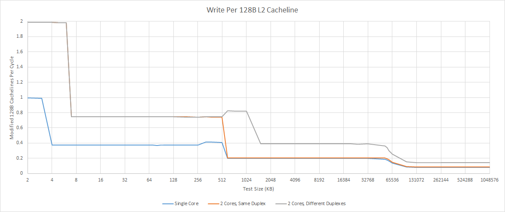

*图 18：测试对每条 128 B L2 Cache Line 只做一次写。单核曲线在约 3～4 KB 后从接近 1 行/cycle 降到约 0.36 行/cycle，支持每核约 3 KB WCC 的估计；稳定区约等于每 2～3 cycle 向 L2 写回一条 128 B Line。两核位于同一或不同 Duplex 时，小工作集可接近 2 行/cycle，随后分别受共享结构和各自 WCC/L2 路径限制。实际软件通常不会以这种最不利方式触发结构容量。*

Falkor 每核最多写 16 B/cycle，而 L2 推测具备更高写入吞吐，因此这套结构在实际代码中足以表现得接近 Write-back L1D。与 Pentium 4、Bulldozer 等 Write-through L1D 核心相比，Store Forwarding 虽不出色，却也没有严重失控。

正文把“Store 内、且满足 32-bit 对齐”的依赖 Load 写作约 8 cycle，并猜测可能由 Store 4 cycle 加 Load 4 cycle 构成。图 19 的相应重叠格则大多显示约 9.0，而无依赖基线约为 1.0；若按相对增加量读取，恰好也是约 8 cycle。两个数字描述的口径不同，不能静默把图内总时间改写成 8 cycle。

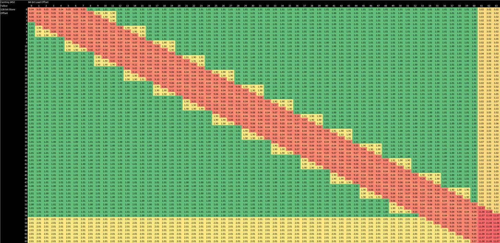

*图 19：行是 128-bit Store Offset，列是 64-bit Load Offset。绿色独立组合约为 1.00～1.01 cycle；Load 位于其依赖 Store 内且满足 32-bit 对齐时，矩阵多为约 9.0，按独立基线看增加约 8 cycle；部分重叠只再多约 1 cycle。跨越 Cache Line 的最后若干行/列会进入约 11 cycle。它说明困难重叠没有退化成漫长的等待提交再读 Cache，但不能仅凭矩阵确认具体 Forwarding 网络。*

一种可能是 Qualcomm 为 Falkor 做了更灵活的 Forwarding，避免 Load 必须等 Store 提交后再从 WCC 或 L1D 读取。L1D 与指令 Cache 一样使用奇偶校验；错误行可以从带 ECC 的下级 Cache 重新装入。由于 L1D 本身 Write-through，不保存系统中唯一的脏副本，使用 parity 而非 ECC 更容易成立。

### 体系结构视角：双 Tag 和 WCC 都是在关键路径外搬工作

双 Tag 试图让常见 Load 先按虚拟信息快速命中，再在需要时补做物理确认；WCC 则把 Store 合并、Fill 与 Snoop 跟踪移到 L1D 旁边，避免每次 Store 都让主阵列承担写回与物理 Tag 成本。它们共同解决延迟与功耗，却把别名、一致性、探测和异常顺序变得更复杂。

验证时应覆盖同一物理页的多重虚拟映射、跨核 Snoop、Store 合并、Load 命中未提交 Store、部分重叠、Cache Line 跨界与 TLB shootdown。计数器可观察 load replay、store-forward success/fail、L1 parity reload、L2 refill 和 snoop；RTL 则要核对虚拟/物理 Tag 选择、WCC entry 合并、探测命中、失效及异常清除，确保快速返回的数据最终与物理地址和内存顺序一致。

## 五、地址翻译：服务器虚拟化需要多种 TLB 分工

移动核心面对的地址空间通常较小，服务器却要运行大工作集和虚拟机。虚拟化环境中，程序虚拟地址（VA）先通过 Guest OS 页表变成虚拟机可见的物理地址，再经 Hypervisor 的 Stage-2 页表变成 Host PA。一次 TLB miss 可能触发两套页表遍历，让一条 Load 在后台变成十多次内存访问。

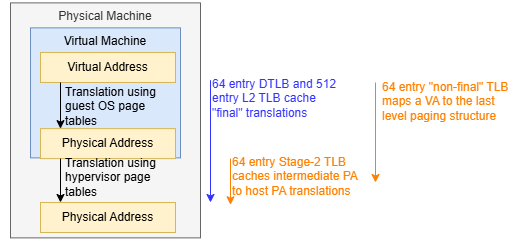

*图 20：64 项 L1 DTLB 与 512 项 L2 TLB 缓存从程序 VA 直达 Host PA 的 final translation；64 项 non-final TLB 缓存指向最后一级页表的中间结果；另有 64 项 Stage-2 TLB 缓存 Guest/VM PA 到 Host PA 的映射。不同结构分别减少完整遍历、末级遍历和第二阶段翻译。*

Kryo 看起来只有单级 192 项 TLB，显然难以满足服务器虚拟化。Falkor 改为 64 项 L1 DTLB 加 512 项 L2 TLB，L2 命中只比 L1 多约 2 cycle。两级都保存 final translation；non-final TLB 则跳过前几级 Guest 页表遍历，Stage-2 TLB 复用 Hypervisor 翻译。

### 体系结构视角：TLB 容量之外，还要看 Page Walk 的并行度

Final TLB 减少的是完整翻译次数，non-final 与 Stage-2 TLB 减少的是一次 miss 内部要走的层级。即使总 entry 数相同，缓存哪一阶段、支持哪些页大小、多少个 Walker 能并发、Page Walk Cache 是否命中，都会改变 VM 尾延迟。

可以分别用裸机与虚拟机、4 KB 与大页、单流与多流随机访问测量 DTLB miss 代价，并统计 L1/L2 TLB hit、Stage-2 miss、walk cycles、并发 walk 与页表访问的 Cache miss。RTL 中还要检查 ASID/VMID、权限、异常、TLB 失效和两阶段 fault 的精确归属，不能只凭一个总 miss 周期推断所有翻译都走同一路径。

## 六、Duplex 与 L2：两颗核心构成最小扩展单元

服务器芯片不仅需要高核心数，还要高 I/O 与一致性带宽。Qualcomm 把两颗 Falkor 与共享 L2 组成 Duplex，再用 Duplex 作为 Centriq 的基本构建块。Kryo 也采用双核共享 L2，因此这种组织并非完全陌生，只是 Centriq 要把它扩展到最多 24 组。

每组 Duplex 共享 512 KB、8 路、128 B Cache Line 的统一 L2，包含 L1D 内容，并作为核心与片上网络之间的中间层。包含关系也使 L2 能为 Duplex 内两颗核心承担 L1D Snoop Filter 的作用。网页此处写成“snoop filter for the L2 caches”，但 L2 本身就是正在讨论的结构，结合上下文更可能是对 L1D 的探测过滤。它使用 SEC-DED ECC，因为其中可能保存尚未写回其他位置的修改数据。Qualcomm 给出最低 15 cycle 命中；指针追踪微基准测得约 16～17 cycle，两种口径接近但不完全相同。

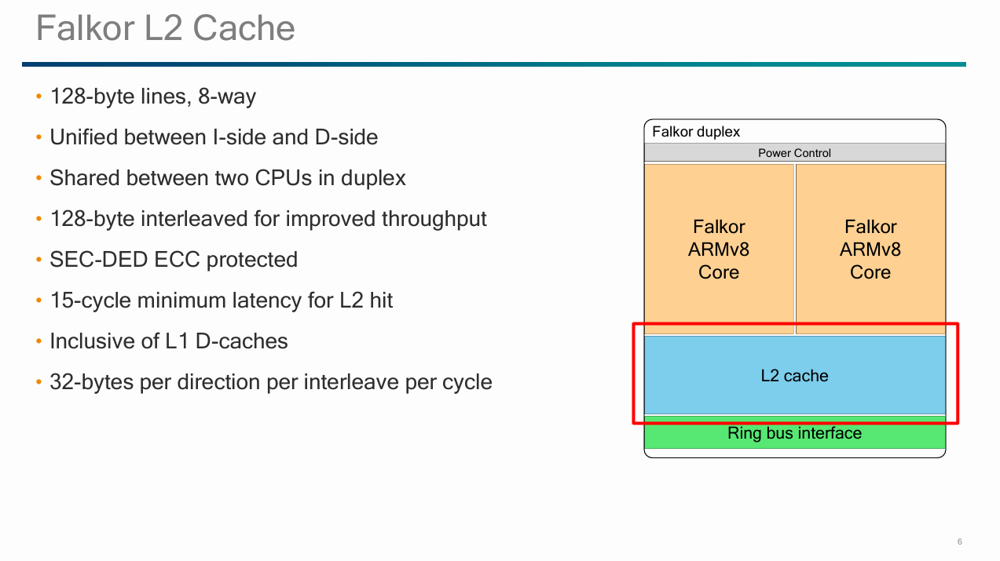

*图 21：官方幻灯片给出 128 B Line、8 路、指令/数据统一、双核共享、128 B interleaving、SEC-DED ECC、最低 15 cycle、包含 L1 D-Cache，以及每个 interleave 每方向每周期 32 B。L2 下方直接连接 Ring Bus Interface。*

512 KB L2 把“低延迟服务 L1 miss”和“大容量隔离 DRAM”拆成两级问题，明显好于把 L2 直接当末级 Cache 的 Kryo 和 Cortex-A72。A72 的 4 MB L2 约 21 cycle；Kryo 则同时受容量小与 20＋cycle 延迟拖累。Falkor 的微基准 L2 平台约 16.60 cycle，A72 约 21.11 cycle。

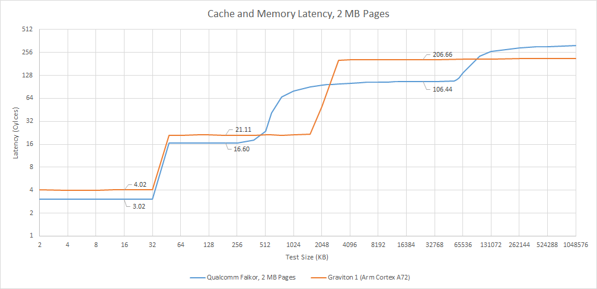

*图 22：使用 2 MB 页时，Falkor 的 L1、L2、L3 平台约为 3.02、16.60、106.44 cycle；Graviton 1 的 L1/L2 约为 4.02/21.11 cycle，随后直接进入约 206.66 cycle 的 DRAM 区间。横轴为 KB 工作集。Falkor 的 60 MB L3 降低了访问 DRAM 的频率，却带来超过 100 cycle 的额外层级。*

多个 interleave，也就是多个 Bank，可以提高 L2 带宽。Qualcomm 未公开 Bank 数，却表示每个 interleave 每周期每方向 32 B。测试形状支持 L2 每周期处理一条 128 B Writeback，据此推测至少有四个 interleave。两颗核心合计只有 32 B/cycle 的可见 Load/Store 数据带宽，因而 L2 有足够余量喂饱 Duplex；相比之下，Kryo 和 A72 的 L2 相对各自 L1 更容易成为带宽瓶颈。

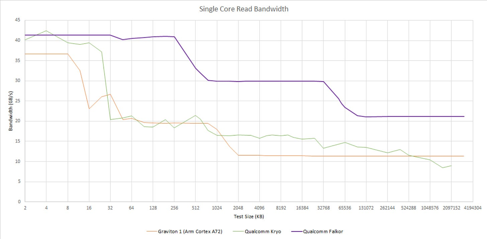

*图 23：Falkor 在 L1 范围约 41 GB/s，L2 范围约 30 GB/s，L3 范围约 21 GB/s；Kryo 的 L1 接近 40 GB/s，越过小容量后约为 20 GB/s 并继续下降；Graviton 1/A72 的 L1 约 36 GB/s，L2 约 19 GB/s，DRAM 约 11 GB/s。频率和平台不同，曲线重点是各层相对跌幅。*

Duplex 通过 Qualcomm System Bus（QSB）接入系统。QSB 是专有一致性协议，功能上可与 Arm ACE、Intel IDI 或 AMD Infinity Fabric 协议类比。每个 128 B interleave、每个方向的接口带宽为 32 B/cycle。

### 体系结构视角：Duplex 用局部共享减少全片一致性流量

两核共享 L2 可以在本地完成共享数据命中和部分一致性操作，不必每次都进入环网；它也让一个核心闲置时，另一个核心享有完整 512 KB 容量。反面是两颗核心竞争同一 Cache、Bank、MSHR 和 QSB 接口，线程放置会影响性能。

验证时可比较一核/两核同 Duplex/两核跨 Duplex，分别运行私有读、共享读、写入转移与带宽压力，并记录 L2 hit、Bank conflict、MSHR full、Snoop、本地与远端响应。若跨 Duplex 增加明显延迟而同 Duplex 只在带宽饱和时下降，就能把共享容量竞争与片上网络代价区分开。

## 七、四条分段环、60 MB L3 与分布式一致性

Centriq 用双向分段环连接 Falkor Duplex、L3 Slice 和 I/O 控制器。数据在两组双向环上按 128 B Cache Line 的奇偶 interleave 分流，因此全片共有四条逻辑环：Even/Odd 各有 Clockwise 与 Counterclockwise 方向。Qualcomm 幻灯片暗示每条环可传 32 B/cycle，合起来相当于每方向 64 B/cycle，并采用最短路径路由和 Read Multicast。

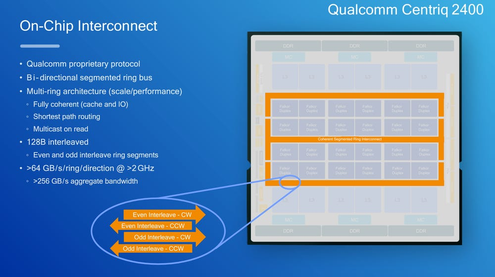

*图 24：官方幻灯片标出专有协议、双向分段 Ring、多环扩展、Cache/IO 全一致、最短路径、Read Multicast 和 128 B 奇偶 interleave。每条环每方向在 2 GHz 以上可超过 64 GB/s，厂商给出的全片聚合带宽超过 256 GB/s；这是接口能力口径，不是任意工作负载都能获得的有效数据带宽。*

一个双核 Duplex 在简单带宽测试中可从 L3 读取略低于 64 GB/s，明显强于 Cortex-A72，接近 Core i5-6600K 上单颗 Skylake 核心的 L3 带宽。Duplex 的 Ring Stop 面向四条 32 B/cycle 环通道，并通过 QSB 与双核 L2 连接。

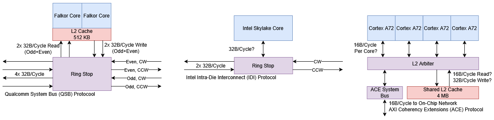

*图 25：Falkor Duplex 的 L2 对奇偶 interleave 各有读写路径，Ring Stop 连接四条 32 B/cycle 通道；Skylake Ring Stop 使用 IDI，并连接顺/逆时针环；四颗 A72 通过 L2 Arbiter、4 MB L2 与 16 B/cycle ACE 路径进入片上网络。图示包含问号，表示部分宽度来自反推。*

环网客户端最多包括 24 个 Duplex、12 个 L3 Slice、六个 DDR4 控制器、六个 PCIe 控制器（合计 32 条 PCIe Gen3），以及多种低速 I/O。L3 每 Slice 为 5 MB、20 路组相联，全片共 60 MB；46 核 Centriq 2452 启用 57.5 MB。Cache way 可以保留给不同应用或请求类型，用于隔离容量并改善服务质量。

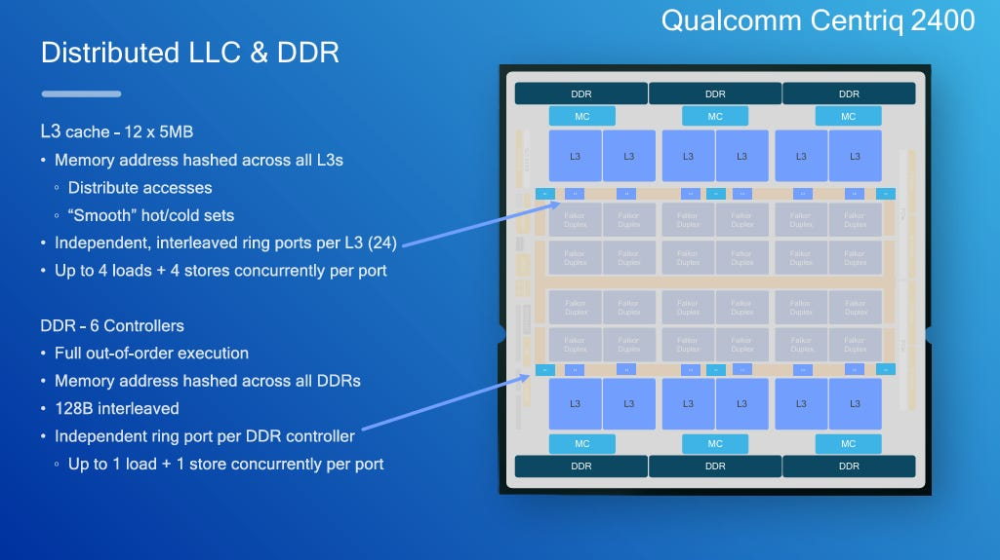

*图 26：Qualcomm 幻灯片画出 12×5 MB L3 和六个 DDR 控制器。内存地址在所有 L3/DDR 间 Hash，以分散热点；每个 L3 有独立的 128 B interleaved 环端口，全片共 24 个端口，幻灯片写作每端口最多并发 4 Load＋4 Store。每个 DDR 控制器也有独立 Ring Port，可并发一条 Load 与一条 Store，并支持乱序服务。*

地址 Hash 让 L3 带宽随 Slice 数量扩展。Centriq 没有像 Intel、AMD 那样让 Slice 数等于核心或核心簇数，但每个 Slice 有两个 Ring Port，因此 12 个 L3 Slice 与 24 个 Duplex 在片上网络侧具有相同数量的端口。

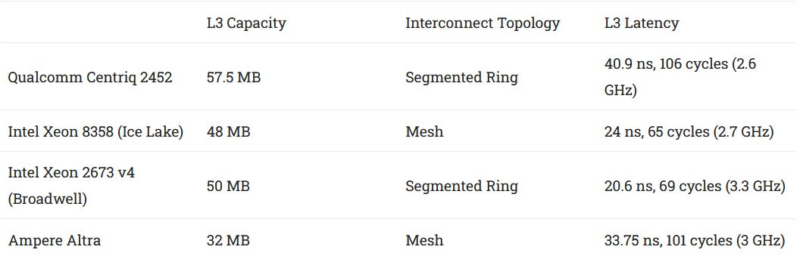

*图 27：Centriq 2452 为 57.5 MB、分段 Ring、40.9 ns/106 cycle（2.6 GHz）；Ice Lake Xeon 8358 为 48 MB、Mesh、24 ns/65 cycle（2.7 GHz）；Broadwell Xeon 2673 v4 为 50 MB、分段 Ring、20.6 ns/69 cycle（3.3 GHz）；Ampere Altra 为 32 MB、Mesh、33.75 ns/101 cycle（3 GHz）。产品年份和工艺不同，表格用于展示 Centriq 的高容量与高延迟，而非同期公平排名。*

Centriq L3 空载超过 40 ns，也就是 100 多 cycle，对只有 512 KB L2 的核心而言相当沉重。全片带宽可以超过 500 GB/s，对大多数非重度向量服务器负载可能已经够用。随着压力升高，延迟先到约 50 ns，接近带宽上限时升到 70～80 ns；若所有 Duplex 同时施压，最高略过 90 ns。

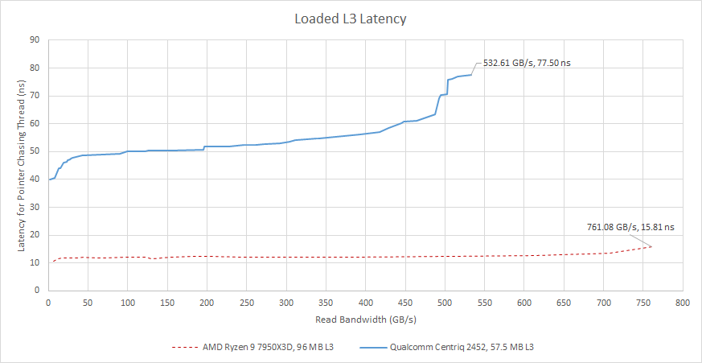

*图 28：Centriq 2452 的蓝线从约 40 ns 起步，在 400 GB/s 以上持续升高，图中标出 532.61 GB/s、77.50 ns；Ryzen 9 7950X3D 的虚线在 761.08 GB/s 时约 15.81 ns。后者是更晚工艺和完全不同平台，仅用于说明现代高带宽低延迟的另一数量级，不能作为 2017 产品的同代能效比较。*

L3 还是全片一致性点。它不包含上层 Cache 数据，却维护 L2 Snoop Filter；这种非包含数据、精确追踪上层 Tag 的方式，与 AMD Zen 和 Intel Skylake Server 的思路相近。每个 L3 Slice 最多跟踪 32 个 outstanding snoop。同一 Duplex 内两核的一致性操作无需经过环网。

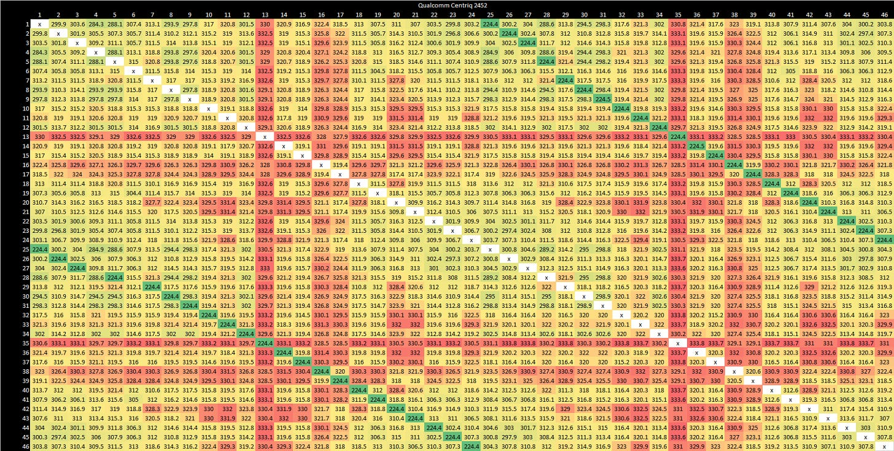

*图 29：46 核矩阵多数核心对约为 280～334，Duplex 配对项约为 224.4，显示本地双核路径更短，但绝对值仍高。矩阵还支持 2452 通过在两组 Duplex 中各关闭一颗核心得到 46 核的判断；剩余单核无需分享 L2 容量与 QSB 接口，性能略有利。图中未明确标注单位和同步协议，不应擅自换算成 ns。*

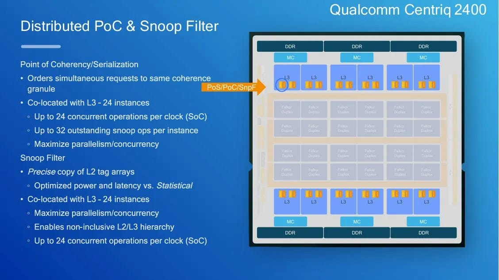

*图 30：Qualcomm 把 Point of Coherency/Serialization 与 L3 共置为 24 个实例，可每周期处理最多 24 个全片一致性操作，每实例跟踪 32 个 outstanding snoop；Snoop Filter 保存 L2 Tag 的精确副本，也有 24 个实例，从而支持非包含式 L2/L3。厂商给出的并发上限是结构能力，不等于任意地址模式都能无冲突达到。*

### 体系结构视角：环网擅长规则扩展，也受距离与热点约束

分段双向环实现和验证相对直接，最短路径可减少平均跳数，奇偶 Cache Line 分流又提高聚合带宽。但核心、L3 与内存控制器越多，最远距离、Ring Stop 排队和热点 Slice 越容易进入关键路径。Hash 能打散连续地址，却不能保证所有应用的共享热点均匀。

验证应改变请求源、目的 Slice、地址 Hash、读写比例和一致性状态，记录每环方向利用率、Ring Stop 队列、重试、L3 Bank/Slice 冲突、Snoop outstanding 与响应跳数。只有核间延迟与某个方向的环占用或 Snoop 队列同步上升，才有理由把瓶颈进一步定位到互连或一致性路径。

## 八、DRAM 与平台边界：带宽充足，重载延迟控制不足

Centriq 支持六通道 DDR4、最大 768 GB，最高 2666 MT/s，理论带宽约 128 GB/s。空载内存延迟约 121.4 ns；高带宽压力下控制较差，使用超过 100 GB/s 时可升到 500 ns 以上。作为对照，图中的 Intel Xeon Platinum 8275CL 在超过 90% 带宽利用率时仍把延迟控制在 200 ns 以下。

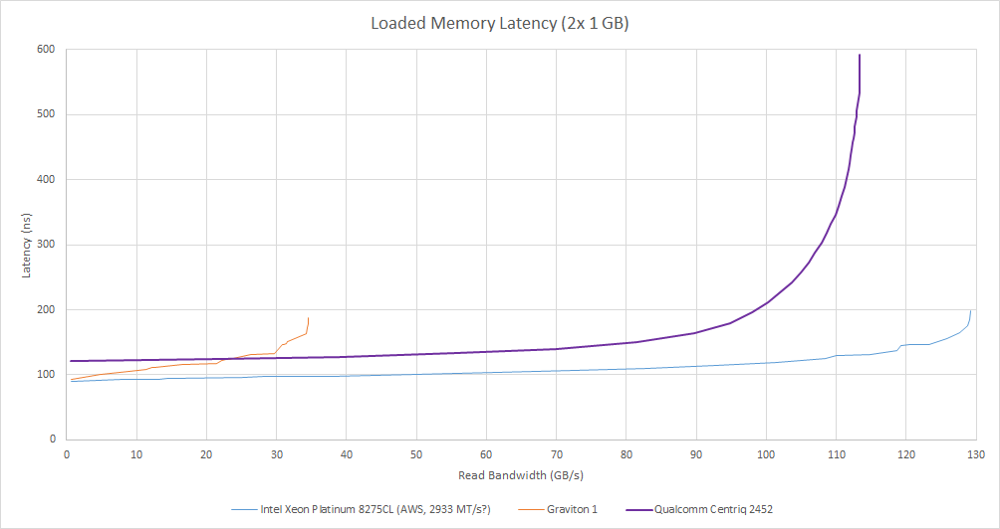

*图 31：Centriq 2452 紫线从约 121 ns 起步，90 GB/s 后明显弯折，超过 100 GB/s 后迅速冲向 500～600 ns；Xeon 8275CL 蓝线能接近 130 GB/s 且保持低于约 200 ns；Graviton 1 橙线在约 35 GB/s 以内。平台、内存配置与年代不同，能直接支持的结论是 Centriq 绝对带宽远强于 Graviton 1，但重载公平性和尾延迟不如 Intel。*

Centriq 不支持多路插槽，单机因而最多 48 核；同期 Zen 1 EPYC 和 Skylake Xeon 可以用多 Socket 扩展更多核心。放弃 Socket 间一致性是合理的范围控制，因为它要求巨大的带宽与额外互连工程，但也排除了需要百核虚拟机和 TB 级内存的专门云负载。32 条 PCIe Gen3 也限制了大量加速卡，甚至少于同期部分高端工作站。

这套系统更适合主流云应用，而不是覆盖 Intel 的全部服务器市场。把 PCIe 控制在 32 条，并集成 USB、SATA 等传统 Southbridge 功能，有助于降低平台成本、避免项目被小众需求拖散。即便互连不如 Intel，Centriq 相对 Graviton 1 仍跨越了很大一步；60 MB L3 也能降低对 DRAM 带宽的需求。

### 体系结构视角：内存控制器不仅要“跑满”，还要守住尾延迟

高带宽流会占据请求队列、DRAM Bank 和读写批处理窗口；若仲裁只追求行命中和总吞吐，依赖链 Load 可能长时间得不到服务。云服务关注 P99/P999 响应，500 ns 以上的受载内存延迟会沿多次 Cache miss 放大成更长请求尾部。

可以固定一条指针追踪流，逐步加入独立带宽线程，并改变读写比例、页策略和核心位置，记录每控制器队列深度、Bank conflict、row hit、读写切换、每源等待时间和延迟分位数。若带宽仍增长、但单源等待突然失控，应优先检查年龄优先级、每源配额与队列预留，而不是简单扩大接口峰值。

## 九、性能：胜过 Cortex-A72，但没有真正达到“四宽”上限

SPEC CPU2017 的单线程估算结果中，Falkor 相对 Graviton 1 的 Cortex-A72，整数领先 21.6%，浮点领先 53.4%；更晚、工艺更先进的 Arm 核心则明显更快。

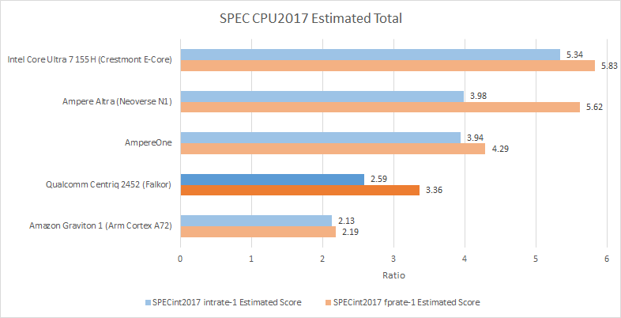

*图 32：Integer/FP Estimated Score 分别为：Crestmont E-Core 5.34/5.83，Ampere Altra Neoverse N1 3.98/5.62，AmpereOne 3.94/4.29，Falkor 2.59/3.36，Graviton 1 Cortex-A72 2.13/2.19。不同处理器跨越年代、工艺和系统，本页又未完整给出编译与运行配置，因此适合看技术演进，不宜用小差距作同代产品结论。*

在整数套件中，Falkor 在 505.mcf、502.gcc 等内存受限项目里表现相对较好。浮点总分则被 503.bwaves、507.cactuBSSN 等少数巨大领先拉高，并不意味着每个 FP 工作负载都有 53.4% 优势。

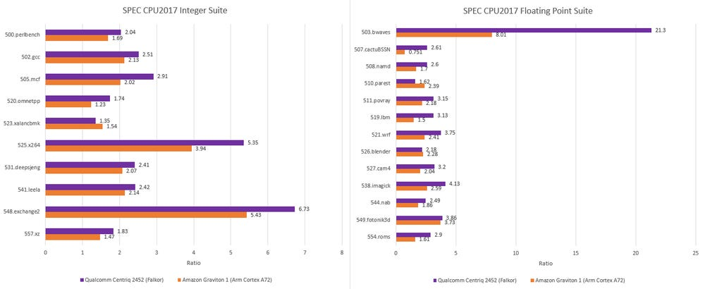

*图 33：整数 Falkor/A72 分别为 perlbench 2.04/1.69，gcc 2.51/2.13，mcf 2.91/2.02，omnetpp 1.74/1.23，xalancbmk 1.35/1.54，x264 5.35/3.94，deepsjeng 2.41/2.07，leela 2.42/2.14，exchange2 6.73/5.43，xz 1.83/1.47。浮点为 bwaves 21.3/8.01，cactuBSSN 2.61/0.751，namd 2.60/1.70，parest 1.62/2.39，povray 3.15/2.18，lbm 3.13/1.50，wrf 3.75/2.41，blender 2.18/2.28，cam4 3.20/2.04，imagick 4.13/2.59，nab 2.49/1.86，fotonik3d 3.86/3.73，roms 2.90/1.61。A72 在 xalancbmk、parest 和 blender 等个别项目仍占优。*

从 IPC 看，Falkor 能在 Cache 友好的 538.imagick 中发挥较大窗口和存储系统；但高 IPC 并不保证对 A72 大幅领先。548.exchange2 与 525.x264 中，A72 只稍慢。原因之一是第四重命名槽限制：Falkor 不能像没有此限制的 Skylake 那样稳定利用四宽，容易负载中 Skylake 可以达到或超过 3 IPC，Falkor 通常达不到。

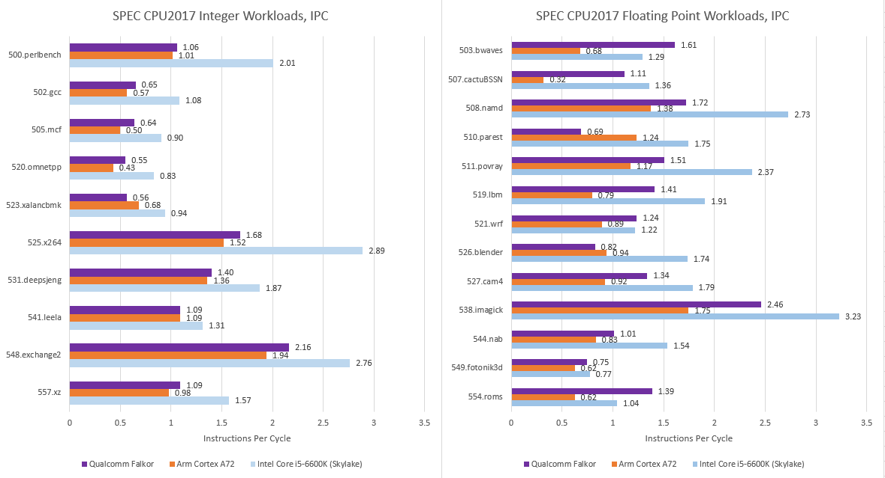

*图 34：整数 Falkor/A72/Skylake 分别为 perlbench 1.06/1.01/2.01，gcc 0.65/0.57/1.08，mcf 0.64/0.50/0.90，omnetpp 0.55/0.43/0.83，xalancbmk 0.56/0.68/0.94，x264 1.68/1.52/2.89，deepsjeng 1.40/1.36/1.87，leela 1.09/1.09/1.31，exchange2 2.16/1.94/2.76，xz 1.09/0.98/1.57。浮点为 bwaves 1.61/0.68/1.29，cactuBSSN 1.11/0.32/1.36，namd 1.72/1.38/2.73，parest 0.69/1.24/1.75，povray 1.51/1.17/2.37，lbm 1.41/0.79/1.91，wrf 1.24/0.89/1.22，blender 0.82/0.94/1.74，cam4 1.34/0.92/1.79，imagick 2.46/1.75/3.23，nab 1.01/0.83/1.54，fotonik3d 0.75/0.62/0.77，roms 1.39/0.62/1.04。Falkor 个别项目 IPC 可高于 Skylake，说明 IPC 还受指令数、ISA 和编译结果影响，不能单独等同于完成同一任务的性能。*

### 四核应用对照

7-Zip 24.08 使用八线程压缩 2.67 GB 文件，并把线程固定到四颗核心。四核分布在四个 Duplex 时为 18.80 MB/s，集中到两个 Duplex 为 18.45 MB/s，额外 L2 容量带来的提升很小；Graviton 1 四核 Cluster 为 13.57 MB/s。

libx264 的 4K `veryslow` 转码具有良好向量化。Falkor 的向量能力不强，A72 同样如此；四个 Duplex 为 0.55 FPS、两个 Duplex 为 0.54 FPS，Graviton 1 为 0.42 FPS，Core i5-6600K 则为 1.97 FPS。增加独享 L2 只有轻微帮助，Falkor 仍能稳定胜过 A72，却远落后于 Skylake。

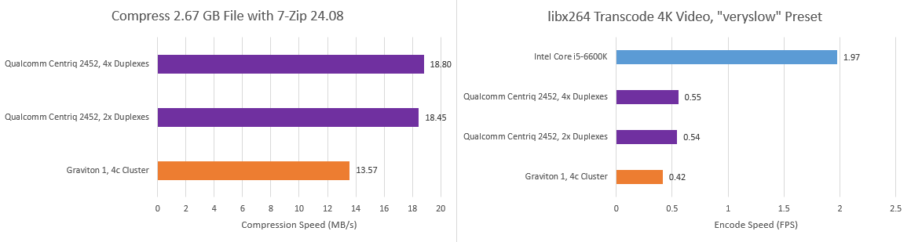

*图 35：左图明确使用 7-Zip 24.08、2.67 GB 文件和八线程；右图为 libx264 4K/`veryslow`。`4× Duplexes` 表示四颗核心分别使用四组 Duplex，`2× Duplexes` 表示每组使用两核。两种放置差异很小，说明这些测试中 512 KB 共享 L2 容量不是首要瓶颈。*

### 体系结构视角：同一总分可能由完全不同的瓶颈构成

Falkor 在 memory-bound 子项占优，与更大的 LSQ、L2/L3 和内存带宽相互呼应；在 128-bit 向量代码中，64-bit/cycle 数据路与双微操作分裂会压低峰值；3＋1 重命名又让部分高 IPC 标量代码无法稳定四宽。总分只是这些瓶颈按套件权重叠加后的投影。

更可靠的分析应保留 benchmark 版本、编译器和 ISA 选项、输入、单副本/多副本、线程绑定、频率与内存配置，再结合 fetch/rename/retire IPC、branch MPKI、端口利用率、L1/L2/L3 MPKI、TLB walk 和 MLP。缺少这些条件时，可以说结果“与某种结构限制一致”，不宜用单个子项证明具体电路。

## 十、回看 Falkor：核心做瘦，存储系统做强

Kryo 移动核心拥有较高执行吞吐，却配了一套相对薄弱的存储系统。Falkor 为服务器做了相反取舍：整数与向量执行资源减少，Load/Store 带宽降低，128-bit 向量处理更差；3＋1 重命名更像用独立分支槽替代 Branch Fusion，而不是一颗完整四宽核心。它能在长延迟之后乱序释放资源，这是实质进步，但原始核心吞吐仍低于 Kryo。

交换条件是一套强得多的存储系统。指令缓存容量超过 Kryo 两倍，Load/Store Queue 能跟踪更多在途访问，Store Forwarding 更快，部分重叠也处理得不错。核心外部，L2 延迟更低，L2 miss 后还有 60 MB L3 和高带宽环网。Qualcomm 没有继续堆端口和核心宽度，而是优先让已有执行资源得到稳定供给。

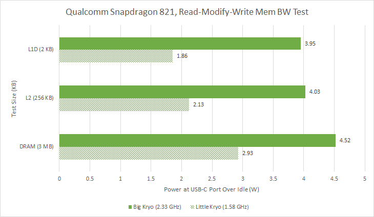

*图 36：这不是 Centriq 功耗实测，而是 Snapdragon 821 的 Read-Modify-Write 测试，用来说明数据搬运成本。横轴是 USB-C 端口功耗相对 Idle 的增量，L1D、L2、DRAM 测试集分别为 2 KB、256 KB、3 MB。Big Kryo 2.33 GHz 的增量约为 3.95/4.03/4.52 W，Little Kryo 1.58 GHz 为 1.86/2.13/2.93 W。结果支持“宽管线和数据传输都会消耗显著功率”的设计背景，不能把这些瓦数归给 Falkor。*

Falkor 更像是在广泛工作负载中提供“足够且稳定”的性能，而不是只在容易的代码上追求极高峰值。把 Kryo 那样偏“胖”的核心放进 48 核/120 W 芯片很可能难以实现；缩减执行宽度和完整 128-bit 向量能力，才换来 2017 年单 Socket 核心数优势。结合更强内存系统，Falkor 能逐核击败 A72，并大幅领先第一代 Graviton。

但击败 Graviton 1 并不足以建立市场。当时 Arm 服务器生态尚不成熟，AMD Seattle、Ampere eMAG 8180、Cavium ThunderX2 等密度型尝试先后淡出；强大的 x86-64 竞争与早期软件生态共同抬高了进入门槛。相较 Skylake-X，Falkor 核心更小，Centriq 的内存系统虽远强于 Kryo/A72，却仍只有较小 L2 和更高 L3 延迟。

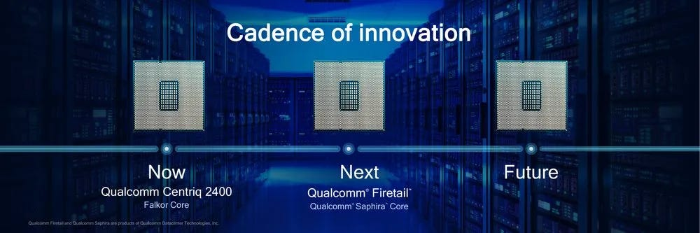

*图 37：2017 年路线图把 Centriq 2400/Falkor 标为 Now，把 Firetail/Saphira 标为 Next，后面还有 Future。Falkor 的后继 Saphira 最终没有已知的量产上市产品，路线图因此也记录了这次服务器尝试的中断。*

Qualcomm Datacenter Technologies 完成的工程仍不应低估：把几十颗核心连起来，让数百 GB/s 数据在 Die 上移动，与移动 SoC 是不同量级的系统问题。真正挑战 Intel 与 AMD，即使只选云计算这一细分市场，也需要核心、平台、软件和长期路线连续投入。Arm 服务器直到 2020 年后 Ampere Altra 出现，才凭更强的 Neoverse N1 与 TSMC 7 nm 真正站稳一块市场，而 Falkor 已被时代甩开。

2025 年，Qualcomm 宣布将向沙特国家支持的 AI 企业 HUMAIN 提供数据中心 CPU 与 AI 方案；NVIDIA 的 NVLink Fusion 合作伙伴名单也把 Qualcomm 列为可通过 NVLink 与 GPU 集成的服务器 CPU 提供方。这是文章写作时对 Qualcomm 重返服务器的最新期待，但并不能证明新产品会复用 Falkor 的具体电路。更值得观察的是，Centriq 在密度、片上互连和共享存储系统上的工程经验，会以何种方式进入下一代服务器设计。

### 体系结构视角：从 Centriq/Falkor 可以看到的七件事

1. **云服务器核心不能只追求“小”。** 高密度能提高整片吞吐，却必须先满足每线程性能和尾延迟底线，否则排队时间会吞掉核心数优势。

2. **前端低功耗路径可以用容量换命中率。** 24 KB L0I＋64 KB L1I 让 Falkor 在 2017 年拥有很大的指令覆盖，但目标与 I-Cache 耦合也限制了越过 miss 的前瞻取指能力。

3. **“四宽”必须说明哪一级、哪些指令。** Falkor 四宽译码、四宽退休，却只有三条通用重命名槽，第四槽受限于直接分支和少数特殊操作；单一宽度标签掩盖不了组合限制。

4. **窗口不是某一张 ROB 的同义词。** 128 条未提交、70＋条已提交待退休、256 项 Rename/Completion Buffer，以及可越过 Load 释放资源的行为，说明乱序能力由多个生命周期不同的结构共同组成。

5. **写穿 L1D 也可以借侧边结构获得写回式收益。** WCC 合并 Store、承担 Fill 与 Snoop 跟踪，降低 L2 流量和 Tag 检查；代价是别名、一致性与转发逻辑更复杂。

6. **高核心数首先考验共享系统。** Duplex 本地化双核通信，四条分段环连接 24 个 Duplex、12 个 L3 Slice 与六个内存控制器；Hash、Snoop Filter 和多端口共同决定扩展性，而不只是核心数。

7. **带宽达标不代表服务质量达标。** Centriq 能获得超过 100 GB/s DRAM 带宽，却在重载下把指针追踪延迟推到 500 ns 以上。云计算更需要同时设计吞吐、公平性和尾延迟。

Centriq 最终没有在市场上延续，并不意味着它没有技术价值。它展示了 Qualcomm 如何把移动时代的能效经验重新组合成一颗服务器芯片：核心管线主动收缩，指令与数据供给、地址翻译、L2/L3、一致性和环网被放到更重要的位置。它也留下一个同样清楚的教训——处理器的长期竞争力不仅来自一代芯片的资源配比，还来自工艺、软件、平台和后继路线是否连续。

## 参考资料与延伸阅读

- Chips and Cheese：[Qualcomm’s Centriq 2400 and the Falkor Architecture](https://chipsandcheese.com/p/qualcomms-centriq-2400-and-the-falkor)
- Chips and Cheese：[Kryo: Qualcomm’s Last In-House Mobile Core](https://chipsandcheese.com/p/kryo-qualcomms-last-in-house-mobile-core)
- Qualcomm：[Qualcomm and HUMAIN to Develop AI Data Centers](https://www.qualcomm.com/news/releases/2025/05/qualcomm-and-humain-to-develop-state-of-the-art-ai-data-centers-)
- NVIDIA：[NVLink Fusion Partner Ecosystem](https://investor.nvidia.com/news/press-release-details/2025/NVIDIA-Unveils-NVLink-Fusion-for-Industry-to-Build-Semi-Custom-AI-Infrastructure-With-NVIDIA-Partner-Ecosystem/default.aspx)

如果希望支持 Chips and Cheese 的独立测试，也可以访问其 [Patreon](https://www.patreon.com/ChipsandCheese)、[PayPal](https://www.paypal.com/donate/?hosted_button_id=4EMPH66SBGVSQ) 或加入 [Discord](https://discord.gg/TwVnRhxgY2)。
