# Qualcomm Oryon：一颗等待多年的自研 CPU 核心

> **文章来源**
>
> - 文章：*Qualcomm’s Oryon Core: A Long Time in the Making*
> - 撰文：George Cozma、Chester Lam
> - 首发：Chips and Cheese
> - 发布：2024 年 7 月 10 日
> - 链接：https://chipsandcheese.com/p/qualcomms-oryon-core-a-long-time-in-the-making

2019 年，Nuvia 结束隐身状态，进入公众视野。它的管理与技术团队中有多位知名芯片架构师，其中还包括前 Apple 设计人员。Apple 后来的 M1 证明，高性能与高能效并非只能二选一；Nuvia 的目标同样激进，希望做出一颗能在能效上站稳脚跟、又能挑战 AMD、Apple、Arm 和 Intel 的 CPU 核心。Qualcomm 于 2021 年收购 Nuvia，并将团队纳入自己的 CPU 研发体系。

Oryon 问世时，距 Nuvia 首次进入公众视野已接近五年，距 Qualcomm 上一次在手机 SoC 中推出自研核心则接近八年。对一直关注 Nuvia 进展的人来说，这的确是一场漫长等待。

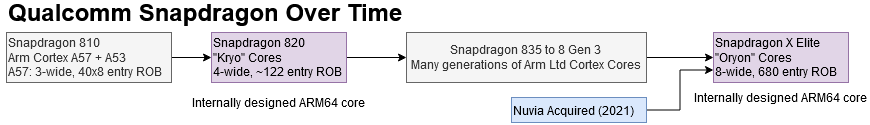

*图 1：从 Snapdragon 810 的 Arm Cortex-A57、Snapdragon 820 的 Kryo，到长期使用 Arm 公版大核，再到 Snapdragon X Elite 的 Oryon。图内把 A57 标为三宽和“40×8 entry ROB”，Kryo 为四宽、约 122 项 ROB，Oryon 则为八宽、约 680 项 ROB；前两者属于历史对照，不能脱离各自微操作口径直接比较。图中还把 Nuvia 被收购标在 2021 年。*

这段漫长等待最终指向 Snapdragon X Elite。Oryon 不是把现有 Arm 公版核心重新包装，而是 Qualcomm 重启自研高性能 CPU 的关键一步。官方把 12 颗新核心作为平台卖点，但核心宽度、预测器、乱序资源、缓存和系统互连是否协调，仍需要从实际行为中逐层观察。

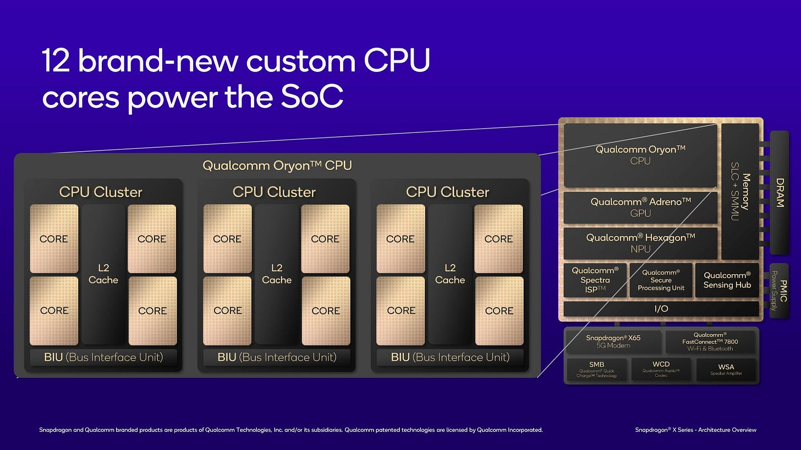

*图 2：Qualcomm 公开演示中的 Snapdragon X Elite。12 颗 Oryon 以三个四核簇组织，同时与 Adreno GPU、Hexagon NPU、视频、图像和连接模块共同组成 SoC。公开幻灯片能确认产品级模块关系，但不能替代核心内部 RTL。*

## 测试平台与结论边界

被测设备是一台 16 英寸 Samsung Galaxy Book4 Edge，处理器为 Snapdragon X1E-80-100，样机由 Chips and Cheese 的 Patreon 与 PayPal 支持者共同资助。由于当时没有适用于这台笔记本、已进入上游的设备树（Device Tree），Linux 桌面系统无法正常安装，大量微基准只能在 Windows Subsystem for Linux（WSL）中运行。

这些条件决定了结果的适用范围。X1E-80-100 的最高频率为 4.0 GHz，不能把它等同于可在两颗核心上达到 4.3 GHz 的顶级 SKU；Windows 电源策略、Samsung 固件、WSL、散热与供电模式也都会影响频率和延迟。Oryon、Zen 4、Redwood Cove、Golden Cove 与 Apple Firestorm 又来自不同 ISA、操作系统和整机，微小差距不宜被解释成单一微结构的绝对优劣。

网页没有系统披露全部微基准源码与版本、编译器及参数、Windows/WSL 内核版本、线程绑定、锁频、预热、重复次数和误差范围。曲线仍适合识别容量台阶和退化形状，但很小的数值差不能脱离这些条件推导成产品总排名。

Qualcomm 幻灯片中明确给出的容量与带宽会注明公开资料来源；曲线中的台阶、队列容量和端口关系则属于微基准观察或据此作出的反推。现有材料不含 Oryon RTL，也没有 Qualcomm 未公开的内部信号，因此不会把“看起来像”“可能”“支持某种解释”改写成已经确认的实现。

下文按网页中的 43 张正文图展开。测试结果、判断、负面结果和未确定项均沿用文章的论证次序；显式标为“体系结构视角”的段落用于补充通用机制、阻塞路径和验证方法，不把教学分析写成 Oryon 的已知电路。

## 一、系统结构：三组四核簇，而不是一座统一大缓存

Snapdragon X1E-80-100 把 12 颗 Oryon 分成三个四核簇，每个簇共享 12 MB L2。Qualcomm 没有采用大小核混合，而是让三个同构核心簇拥有不同的最高频率，以兼顾单线程峰值与多线程吞吐。SoC 还包含约 6 MB 系统级缓存（System Level Cache，SLC），通过片上 Fabric 与 LPDDR5X 内存控制器相连。

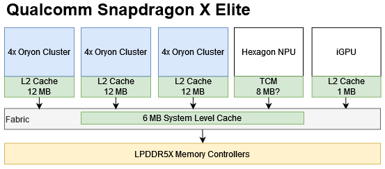

*图 3：三个 Oryon 四核簇各自拥有 12 MB L2，GPU 有 1 MB L2，NPU 旁的 TCM 容量写作“8 MB?”，多个模块共享 6 MB SLC 与 LPDDR5X。问号表明 TCM 数字是图表整理时的未确定项。它解释了为什么同簇和跨簇访问会呈现完全不同的延迟，也提醒读者区分“核心私有资源”“簇共享 L2”和“全 SoC 共享缓存”。*

让一条 Cache Line 在两个核心之间往返，可以观察一致性请求跨越了哪些边界。同一四核簇内部的传递大约落在 40～45 ns；跨簇后则跃升至约 170～210 ns。对一颗只有 12 个消费级大核、且为单片实现的 SoC 来说，这个跨簇代价很高。

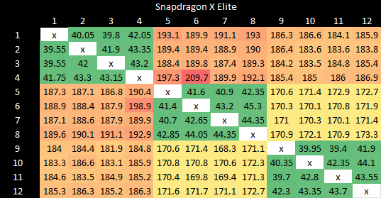

*图 4：绿色块对应簇内核心，约 39.5～45.3 ns；黄色和红色块对应跨簇，约 168～210 ns。矩阵清楚划出 1～4、5～8、9～12 三组核心。测试通过在核心对之间传递 Cache Line 测量端到端延迟，结果包含一致性、互连、仲裁和时钟域等多项成本。*

这种不均匀性比 Qualcomm 上一代笔记本平台更明显。Snapdragon 8cx Gen 3 使用四颗 Cortex-X1 与四颗 Cortex-A78，很可能接在 Arm DynamIQ Shared Unit（DSU）上并共享 L3；矩阵大多处于约 57～69 ns，没有 X Elite 那样清晰而巨大的跨簇台阶。

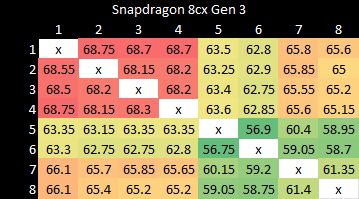

*图 5：8cx Gen 3 的 8 核矩阵整体更均匀，多数核心对落在约 57～69 ns。它不代表旧核心更强，而是说明系统拓扑、共享 Cache 与一致性路径可以显著改变核间通信成本。*

Apple M1 也是按四核簇组织，并使用混合核心：四颗 Firestorm 性能核共享 12 MB L2，四颗 Icestorm 能效核共享 4 MB L2。其簇内核间延迟与 X Elite 接近，跨簇同样明显升高，但绝对值略好，大致为 142～149 ns。这组数据在一台 MacBook Air 上通过 Asahi Linux 测得，因为 macOS 没有可供测试使用的线程亲和性系统调用。

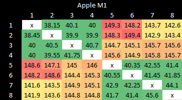

*图 6：Firestorm 与 Icestorm 各形成一个四核块，簇内约 38～46 ns，跨簇约 142～149 ns。测试环境是 Asahi Linux；操作系统、核心类型和频率都与 X Elite 不同，因此这张图适合比较拓扑特征，而不是做几纳秒级的核心排名。*

M1 与 X Elite 都设置了可服务多个 SoC 模块的 SLC。共享范围更广有利于减少 DRAM 流量、支持 GPU/NPU 等设备协同，但其延迟和带宽通常不如专门贴近 CPU 核心的末级缓存。

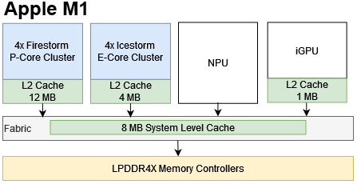

*图 7：M1 的两个 CPU 簇、GPU、NPU 与 8 MB SLC 通过 Fabric 连接 LPDDR4X。与图 3 对照可见，两者都有“簇内共享 L2＋全系统 SLC”，但容量、核心类型和互连实现不同。*

AMD Phoenix 采取另一条路线：八颗 Zen 4 核心位于同一簇，共享 16 MB L3。核间矩阵因此平坦得多，大多数跨物理核心访问约为 17～26 ns，同一物理核的 SMT 线程对约为 7.2～7.4 ns。即使扩展到 16 核桌面 Zen 4 并跨越核心簇，80～90 ns 仍明显低于 X Elite 和 M1 的跨簇结果。

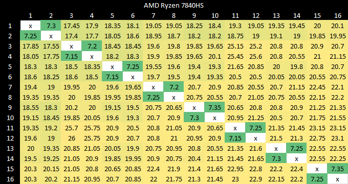

*图 8：16 个逻辑线程来自 8 颗 Zen 4 核心。对角线附近的绿色格代表同一物理核的 SMT 线程，约 7.2 ns；不同核心大多约 17～26 ns。统一 L3 和单簇布局让跨核通信更均匀。*

Intel Meteor Lake 的层次更复杂：六颗 Redwood Cove P-Core、八颗 Crestmont E-Core 和两颗低功耗 Crestmont 核心。P-Core 与常规 E-Core 共享 24 MB L3，低功耗岛只把 2 MB L2 作为自己的末级缓存，并通过可扩展 Fabric 与 CPU Tile 相连。

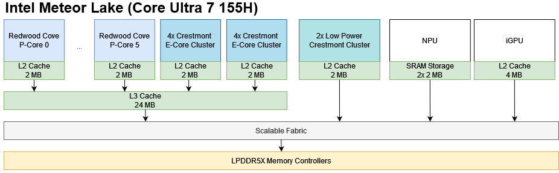

*图 9：P-Core、常规 E-Core、低功耗 E-Core、NPU 与 GPU 分布在不同模块。前两类核心共享 24 MB L3，低功耗簇则隔着 Fabric。混合核心数量看似更高，但核间访问是否快速取决于通信是否留在 CPU Tile 内。*

CPU Tile 内的核心对大致在 40～55 ns；一旦访问低功耗 E-Core，矩阵就升到约 200 ns 以上。这与 X Elite 的结果共同说明，核数不是多线程扩展性的充分条件，线程放置和簇间通信同样重要。

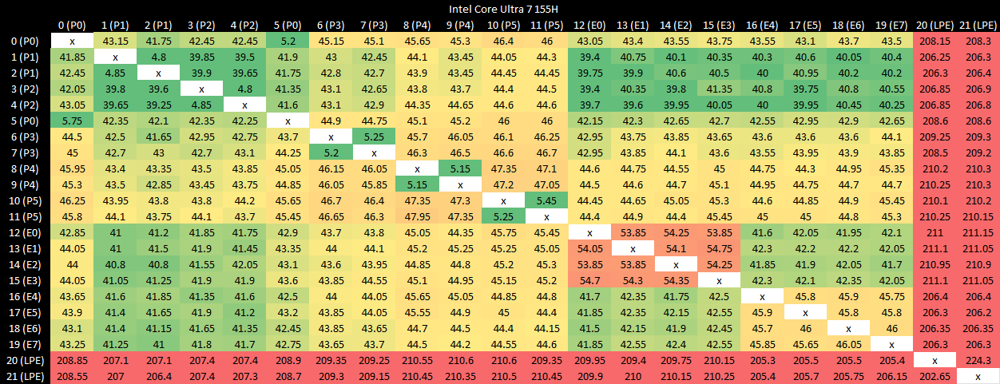

*图 10：逻辑线程 0～19 主要位于 CPU Tile，低功耗核心对应的最后两列/行出现约 200～260 ns 的高延迟。矩阵包含 SMT、P/E 核差异和跨 Tile 路径，不能只按“核心编号远近”解释。*

### 体系结构视角：簇化解决扩展问题，也制造了非一致访问

把四颗核心和一块大 L2 做成可重复的簇，有利于物理实现：本地请求距离短，目录、仲裁和时钟收敛更容易，多个簇也能分别控制频率与功耗。代价是跨簇 Cache Line 必须经过更多一致性与互连阶段，部分阶段还会落入关键路径。若调度器频繁把通信密集线程分散到不同簇，平均延迟和尾延迟都会升高。

这类问题不能仅靠一张矩阵归因。更完整的判断应同时改变读共享、写入转移、原子操作和工作集大小，记录 snoop/probe、retry、互连队列、远端 L2 命中和 SLC 命中事件。只有跨簇延迟与一致性重试、Fabric 排队同步上升，才有理由把瓶颈进一步指向某条共享路径。

## 二、频率响应：接电极快，电池模式明显保守

CPU 在空闲时降低频率和电压，以节省静态与动态功耗；负载到来后再进入高性能状态。这个转换不是瞬时完成的，固件、电源管理策略和操作系统调度都会影响短突发任务的响应。

电池供电时，X Elite 约在负载施加 114 ms 后才达到 4.0 GHz。曲线先从约 1.1 GHz 升至约 2.2 GHz，再升到约 3.4 GHz，最后才进入最高状态。这个分级过程很可能是 Samsung 为避免短暂活动立刻触发高功耗而制定的整机策略，不能直接归因于 Oryon 核心。

接通电源后，Samsung 选择了另一种极端：CPU 空闲时仍保持约 3.4 GHz，负载出现后 1.44 ms 即到 3.98 GHz，响应很好，但机器在空闲时也会明显发热。Ryzen 7840HS 在电池模式下 0.85 ms 即到 4.97 GHz，接电约 2.11 ms 达 5.12 GHz；Core Ultra 7 155H 接电约 4.16 ms 达 4.80 GHz，电池模式却用了约 1708.56 ms 才到 3.19 GHz，而且没有进入最高睿频。

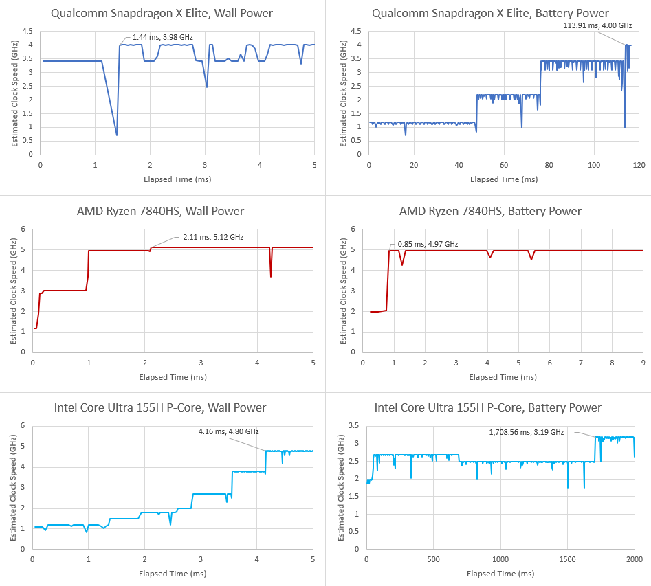

*图 11：六张曲线分别比较接电与电池模式。X Elite 的 1.44 ms/3.98 GHz 和 113.91 ms/4.00 GHz 形成鲜明对比；Ryzen 7840HS 为 2.11 ms/5.12 GHz 与 0.85 ms/4.97 GHz；Core Ultra 7 155H 为 4.16 ms/4.80 GHz 与 1708.56 ms/3.19 GHz。图中测到的是整机策略下的可见频率响应，不是核心 PLL 的固有切换时间。*

### 体系结构视角：短任务看的是“进入性能状态的时间”

对持续数秒的渲染，百毫秒升频可能只影响开头；对网页脚本、界面响应和编译中的大量短阶段，它会直接压低体感性能。反过来，把核心长期维持在 3.4 GHz 可以减少唤醒气泡，却会增加空闲功耗和温度，并可能挤占后续负载的热预算。

分析时应把稳态 IPC、稳态频率和频率爬升曲线分开。可以用不同持续时间和占空比的负载，配合 package/core residency、请求频率、实际频率、温度和整机功耗，判断性能损失来自核心执行、调频政策还是散热约束。

## 三、Oryon 总览：八宽前端与巨大的乱序窗口

Oryon 是一颗八宽核心，并拥有很高的重排序能力。设计取向同时让人联想到 Apple Firestorm 和 Qualcomm 早年的 Kryo：宽前端、大缓存、大窗口，同时又把频率推到 4 GHz 以上。X1E-80-100 的峰值是 4.0 GHz，顶级 X Elite SKU 可在两颗核心上达到 4.3 GHz。

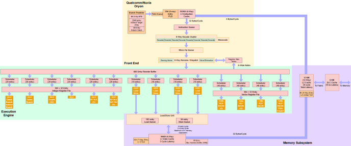

*图 12：Chips and Cheese 根据 Qualcomm 资料和微基准整理的 Oryon 框图。核心具有八宽译码、八宽重命名/分配和八宽退休，约 680 项 ROB；整数侧六个 20 项调度队列，FP/向量侧四个 48 项队列，地址生成侧四个 16 项队列。前端、TLB 和寄存器容量中的微基准反推不是 RTL 确认。*

Zen 4 的面积取向更紧凑：六宽重命名、320 项 ROB 和更小的调度资源，但依靠更高频率、操作缓存和更宽向量指令维持性能。移动 Ryzen 7840HS 可达到 5.1 GHz，仍比被测 Oryon 高出一截。Qualcomm 公开给出的 Oryon 分支误预测代价是 13 cycle，与 Zen 4 的常见路径相同。

*图 13：Zen 4 的框图强调更小的窗口、操作缓存、六宽后端以及 AVX2/AVX-512 数据通路。它与图 12 展示的是两种资源配比：Oryon 用更大的窗口和更多 128-bit 端口覆盖延迟，Zen 4 则把高频率、宽向量与紧凑调度结合起来。*

## 四、分支预测：方向、目标和返回必须同时跟上八宽前端

宽核心在一次错误预测后会取入、重命名并执行更多错误路径操作，浪费的能量与机会成本也更高。因此，分支预测是提高每焦耳性能最有效的投入之一。预测器不仅要判断条件分支是否跳转，还要及时给出 Taken 分支的目标，并为间接跳转和函数返回准备专门路径。

### 方向预测

随机分支微基准同时改变重复模式长度和静态分支数量，纵轴记录随机模式相对可预测分支增加的时间。Oryon 的曲面更像一个主要预测层在承担大部分工作；它对小到中等历史表现良好，整体优于 Golden Cove，但在更长模式和更大分支工作集下不如 Zen 4。

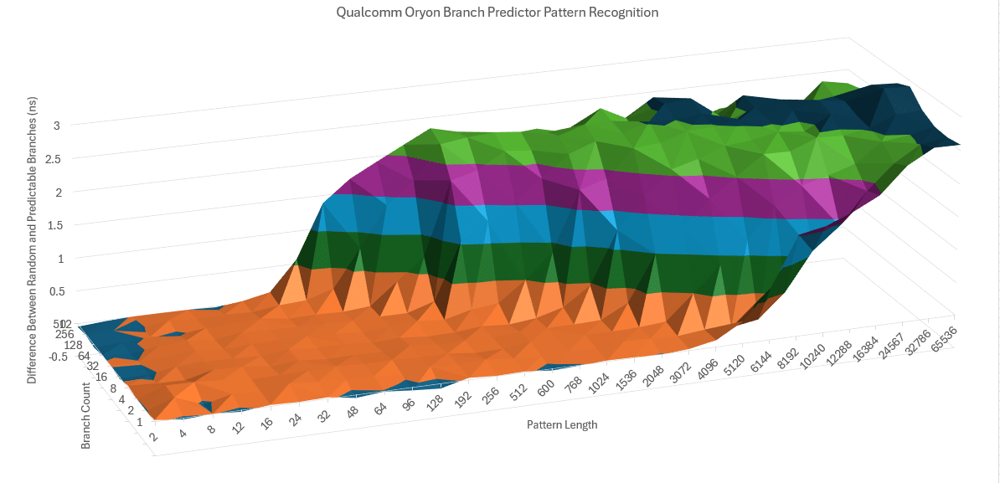

*图 14：横轴为模式长度，侧轴为静态分支数，纵轴为随机模式相对可预测分支增加的纳秒数。低而平坦的区域表示模式仍能被学习；曲面抬升同时受有效历史、容量、索引和混叠影响，不能由此唯一确定预测算法。*

*图 15：Golden Cove 在较短模式后更早出现明显台阶。与图 14 使用相同思路对照，Oryon 覆盖的低代价区域更大；这支持端到端预测能力更强，但不等于两者只存在一个表容量差异。*

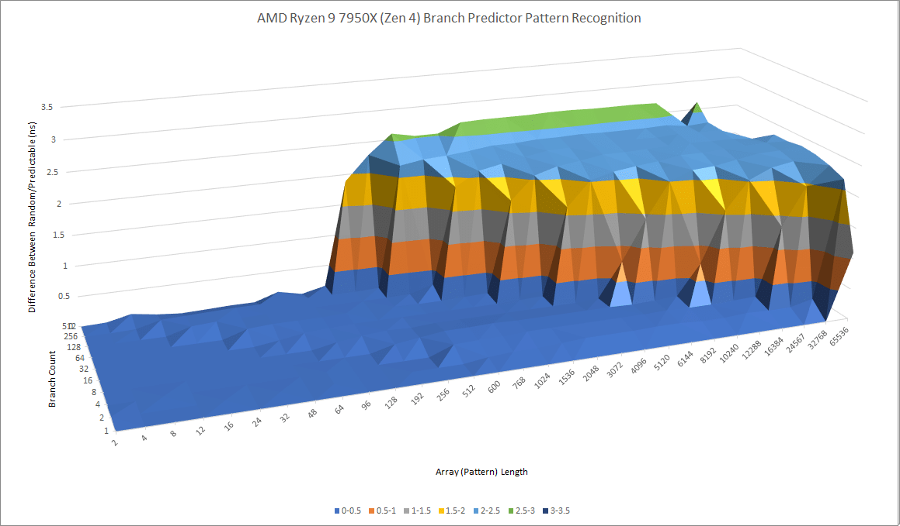

*图 16：Zen 4 在更长模式和更大的静态分支工作集上仍保持较低代价。Oryon 在方向预测上已经很强，但这张曲面显示 Zen 4 仍有优势。频率不同使纳秒差不能直接等同于恢复周期差。*

### 分支目标缓存

方向预测只回答 Taken/Not-Taken；若答案是 Taken，分支目标缓冲器（Branch Target Buffer，BTB）还要尽快给出下一条取指地址。现代核心通常用多级目标结构在低延迟与大容量之间折中。

Oryon 的结果很特别：分支密度会随着代码工作集越过某些范围而改变吞吐。循环代码落在 8 KB 内时，Taken 分支可达到每周期一条，也就是 AMD 所说的“zero-bubble”分支；工作集超过这一范围但仍留在 192 KB L1I 内时，Taken 分支大体变成每三周期一条。分支间距为 32 B 的曲线在约 256 项后先升高，16 B、8 B、4 B 曲线则分别在更高分支数量处升高，台阶更接近代码字节容量而非单纯的分支条目数。

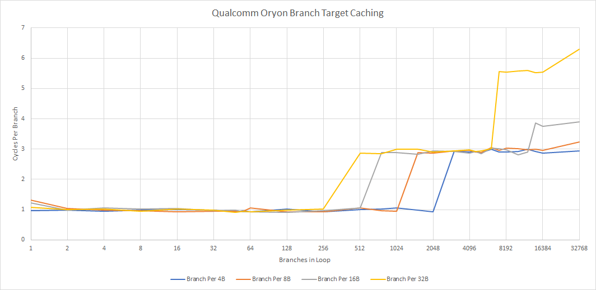

*图 17：横轴为循环中的 Taken 分支数，纵轴为 cycles/branch，四条曲线对应每 4/8/16/32 B 一条分支。8 KB 以内大体保持 1 cycle/branch，之后约为 3 cycles/branch；超过更大指令工作集后，部分曲线再升到 4～6 cycle。分支间距对台阶位置影响很大。*

一种与曲线相符、但尚未由 RTL 证实的解释是：Oryon 在译码前部设置分支地址计算路径，并把快速目标交付与指令 Cache 紧密结合；8 KB 范围可能对应单周期的 L0 指令层次，192 KB L1I 则约需三周期。这个取向与老 Kryo 有相似处，也像 Apple M1：M1 在 4 KB 以内可做到单周期 Taken 分支，越过特定代码工作集后同样升到约三周期。

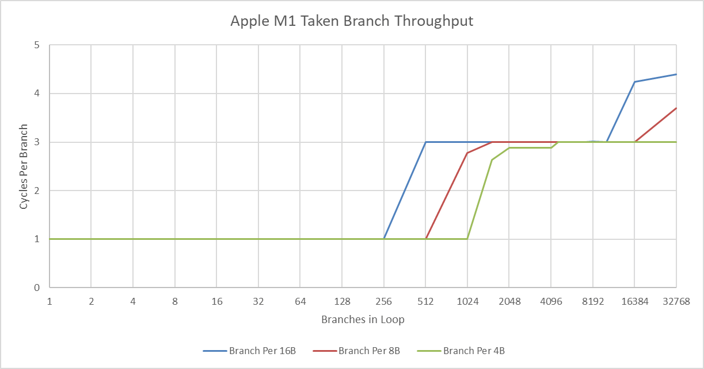

*图 18：M1 的台阶同样受分支间距影响，4 KB 内可以保持约 1 cycle/branch，较大工作集通常落在约 3 cycle/branch。M1 的快速覆盖范围小于 Oryon 的约 8 KB，但两者都表现出目标交付与代码容量相互关联。*

Zen 4、Arm 与 Intel 的近期大核通常把目标缓存与 I-Cache 容量更充分地解耦。固定分支间距时，性能主要随分支数量而变，分支地址之间隔了多少字节不那么关键。

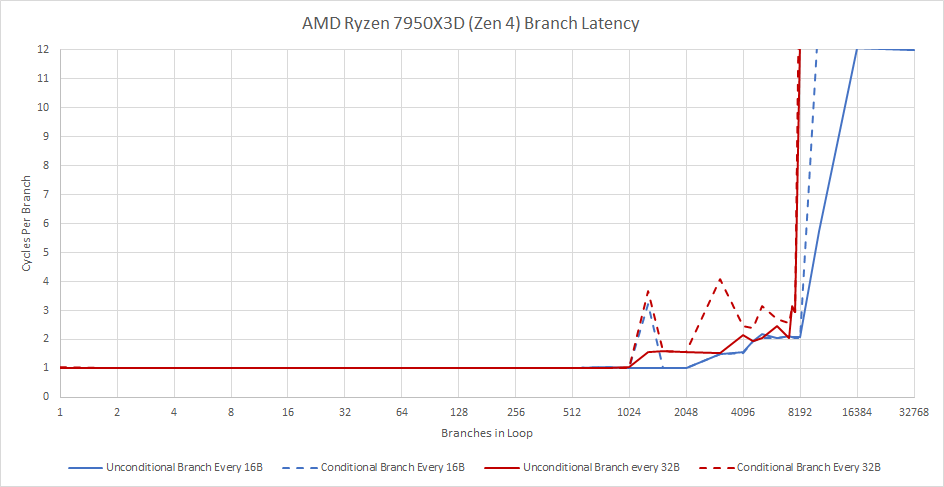

*图 19：不同分支间距的曲线在相近条目数附近出现台阶，更像独立 BTB 层级的容量边界。与图 17 相比，Oryon 的台阶更明显受代码字节工作集控制。两种组织没有简单的绝对优劣：紧耦合路径可减少常见情况延迟，解耦目标表则更适合分支密集的大代码。*

### 间接分支与返回

间接分支的同一条静态指令可能去往多个目标，普通“一个 PC 对一个目标”的 BTB 难以处理。微基准曲面支持 Oryon 具有约 2048 项的间接分支预测资源，但这是端到端可见容量，不应直接当作某一张物理表的确切深度。

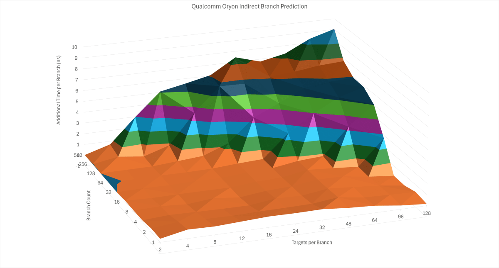

*图 20：横轴为每条间接分支的目标数，侧轴为静态分支数，纵轴为额外纳秒。曲面在总工作集和单分支目标多样性共同增大后抬升，约 2048 项是据可观察边界得到的量级判断。*

Zen 4 的间接预测容量约为 3072 项，能跟踪更多目标，但单个分支超过 32 个目标后会出现缓慢增加的代价。Oryon 没有这段相同形状的缓升，说明它大概没有照搬 Zen 4 的机制。Golden Cove 与 Oryon 的曲面更接近，不过 Oryon 能覆盖更多动态目标。

*图 21：Zen 4 的总体容量更大，但每分支目标数越过约 32 后代价逐步增加。这个“形状”比单一容量数字更有信息量，因为它暗示多目标选择可能经历额外层级或竞争。*

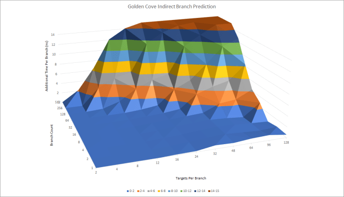

*图 22：Golden Cove 的总体形态与 Oryon 较接近，但可跟踪的目标数更少。三张曲面来自不同平台，适合判断容量和退化方式，不适合从纳秒高度直接反推同一条流水线长度。*

函数返回是间接分支的特殊情况。call 将返回地址压入返回地址栈（Return Address Stack，RAS），return 则取栈顶目标。Oryon 的曲线在调用深度越过约 48 后陡然上升，支持其可见 RAS 深度约为 48 项；Zen 4 约为 32 项，Firestorm 据现有微基准约为 50 项。对绝大多数代码来说，这些容量都已经很深。

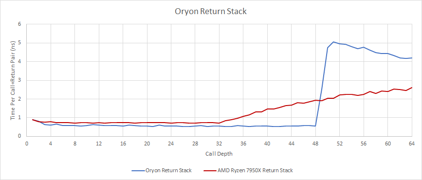

*图 23：横轴为嵌套调用深度，纵轴为一对 call+return 的时间。Oryon 在约 48 层后从低平台跳到约 4～5 ns；按 3.7 GHz 换算约为 15～18 cycle，已经接近一次误预测恢复。曲线支持容量判断，但不能确认栈溢出的内部状态机。*

溢出后的突变不像逐项退化，更像返回栈被清空或进入较重的恢复路径，而不是优雅地保留一部分最近记录。Apple M1 上也观察到类似现象。这是一种据曲线形状作出的解释，公开材料没有给出 RAS 指针、检查点或溢出恢复逻辑。

### 体系结构视角：预测器的价值取决于“准、快、可恢复”

方向预测准确并不代表前端一定没有气泡。BTB 可能晚到，间接目标可能覆盖不足，RAS 可能溢出；强预测器如果需要更多流水级，也可能让早期取指先使用较弱答案。对八宽核心而言，预测时延每增加一拍，潜在空洞都会被放大。

错误预测恢复也不只是改回 PC。通用乱序核心还要取消错误路径上的年轻操作，恢复重命名映射、全局/路径历史和 RAS 指针，并保证已退休状态不被破坏。Oryon 的 checkpoint 数、推测更新时机和恢复信号没有公开。若要验证，应组合观察条件分支 MPKI、BTB/间接/返回错误、重定向周期、错误路径取指量和被取消操作数；准确率相近而 IPC 仍低时，下一步应检查目标交付与恢复气泡，而不是只扩大方向预测表。

## 五、取指与译码：192 KB L1I 喂给八宽前端

预测器给出下一取指地址后，前端还要取得指令字节并译码成微操作。Oryon 与 Apple Firestorm 的取向非常接近：两者都用 192 KB L1I 喂给八宽译码器。Zen 4 在很小的代码工作集上能从操作缓存得到极高带宽，但下游六宽重命名会把持续吞吐限制在约 6 uOP/cycle；测试中的相邻 NOP 还能融合，使操作缓存区间显示出更高的“指令”数字。只有 32 KB L1I 的 Zen 4c 在代码容量上明显吃亏。

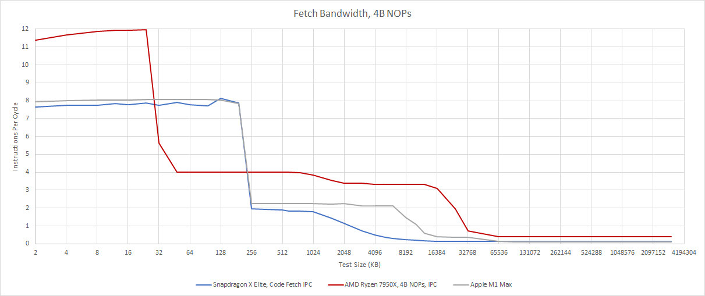

*图 24：横轴是测试代码规模，纵轴是 4 B NOP 的 instructions/cycle。Oryon 与 M1 Max 在 L1I 内约为 7.6～8 IPC，越过约 192 KB 后降到约 2 IPC；Zen 4 小工作集接近 12 IPC，约 32 KB 后降至 4 IPC，并能在更大层级维持 3～4 IPC。M1 Max 数据由 Dougall 提供；Zen 4 的小工作集高值包含相邻 NOP 融合，后端持续接收仍受六宽重命名限制。*

大 L1I 让 Oryon 和 Firestorm 对中等代码工作集很有韧性，但失配后的供给偏弱。Zen 4 即使从 L3 取指，仍能维持超过 12 B/cycle；Oryon 与 M1 越过 L1I 后的代码供给明显更低。这意味着 Oryon 的八宽优势依赖较高的 L1I 命中率，超大二进制、频繁跨模块调用或指令预取不理想时，后端可能先被前端饿住。

## 六、重命名与分配：宽度很高，消除能力并不全面

译码后的微操作需要在后端分配 ROB、物理寄存器、Load/Store Queue 等资源。寄存器重命名通过把同名架构寄存器映射到不同物理位置，消除假写后写（Write After Write，WAW）和写后读（Write After Read，WAR）相关。重命名器还可以直接消除某些操作：寄存器到寄存器的 MOV 不必真正占用 ALU，只需让目的映射引用源物理寄存器；明确产生零的惯用写法也可以直接生成零值映射。

Oryon 确实支持 MOV 消除，但对连续依赖 MOV 的处理远不如 Zen 4 或 Redwood Cove。独立 MOV 可达到 7.4 IPC，依赖链却只有 1.18 IPC；Zen 4 分别为 5.73 和 5.71，Redwood Cove 为 4.77 和 5.25。Oryon 也没有识别 `XOR/EOR r,r` 或 `SUB r,r` 这种清零惯用法，相关依赖链只有约 1 IPC。`MOV r,0` 能打破依赖，但 5.32 IPC 没有超过六条整数执行管线的量级，更像仍然送入 ALU 写零，而不是在重命名处完全消除。

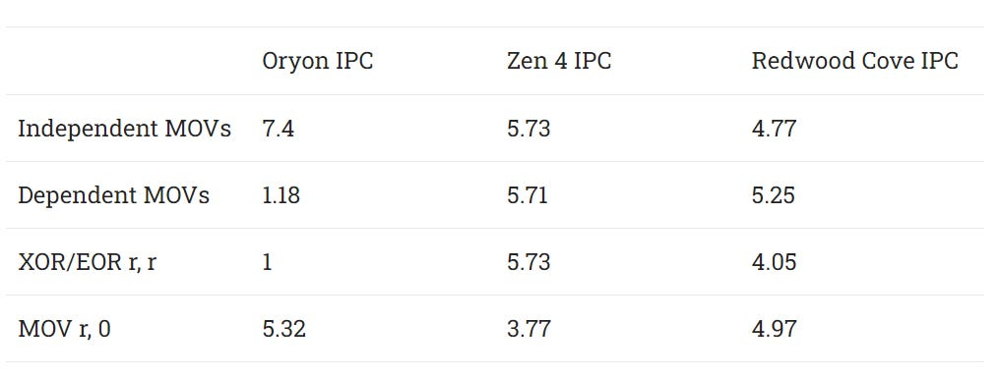

*图 25：独立 MOV、依赖 MOV、寄存器自异或/自减和立即数零 MOV 的 IPC 分别为：Oryon 7.4/1.18/1/5.32，Zen 4 5.73/5.71/5.73/3.77，Redwood Cove 4.77/5.25/4.05/4.97。结果显示 Oryon 的八宽分配路径很强，但依赖链 MOV 消除和清零惯用法识别仍有明显缺口。*

### 体系结构视角：重命名宽度和“零成本操作”是两回事

八宽重命名说明后端每周期可以接纳很多微操作，但只有识别到可消除语义，MOV 或清零才不消耗执行端口。依赖 MOV 的困难在于映射链、引用计数、旧物理寄存器释放和恢复状态都必须正确；若实现只允许有限链深或每周期有限次映射合并，独立 MOV 很快，串行 MOV 仍会退化。

发生分支错判或精确异常时，映射表必须恢复到正确检查点，同时保证被消除操作的物理寄存器生命周期没有提前结束。验证这类机制，可以对独立链、单链、多链、跨分支和接近物理寄存器耗尽的情况分别测 IPC，并结合整数端口 uOP、重命名停顿、物理寄存器空闲项和恢复周期判断：高 IPC 且无执行端口活动才真正支持“在重命名处消除”。

## 七、乱序执行：680 项 ROB 只是“大窗口”的起点

Oryon 最引人注意的部分是巨大的乱序执行引擎。微基准反推出约 680 项重排序缓冲区（Reorder Buffer，ROB），用于在乱序执行后按程序顺序退休结果。整数与 FP/向量物理寄存器文件各有约 384 项可用于推测结果，再加约 32 项保存已确认的架构值，总计各约 416 项。

Qualcomm 的公开幻灯片给出与此相符的量级：整数和向量使用独立的重命名池，每个都超过 400 项；ROB 超过 650 项；最多八条微操作按序退休。执行侧列出六条 64-bit 整数管线、四条 128-bit 向量管线和四条 128-bit Load/Store 管线，并强调分布式调度队列。

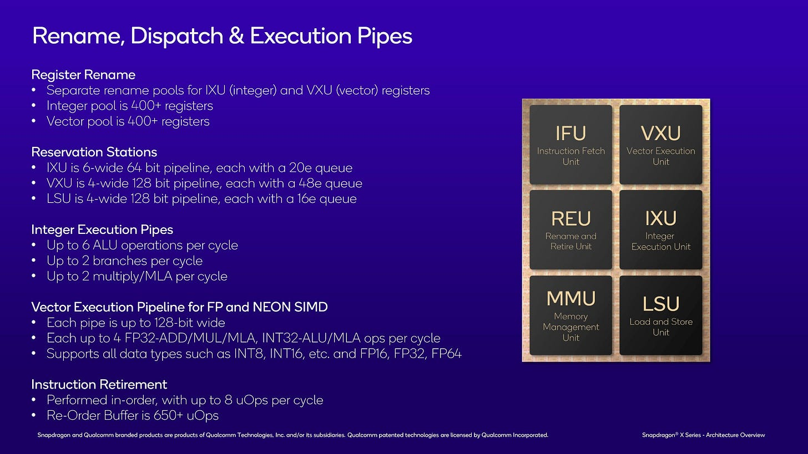

*图 26：公开资料标注整数/向量重命名池均为 400+、ROB 为 650+、退休宽度最多 8 uOP/cycle。六个整数队列各 20 项，四个向量队列各 48 项，四个 Load/Store 队列各 16 项。整数端最多六 ALU、两分支、两乘法/乘加；向量端四条 128-bit 管线；访存端四条 128-bit 管线。公开图给出结构量级，但没有披露物理寄存器端口、旁路和恢复细节。*

访存排序资源相对保守。Load Queue 约 192 项，与 Redwood Cove 微基准可见值相当，也能较好覆盖大 ROB；Store Queue 只有约 56 项，甚至小于 Zen 4 的 64 项，和 Oryon 其他“大而宽”的资源相比显得反常。Redwood Cove 的 Load Queue 还有一处口径差异：微基准约为 192 项，而 Sapphire Rapids 公开幻灯片曾给出 240 项，这里保留两者，不强行统一。

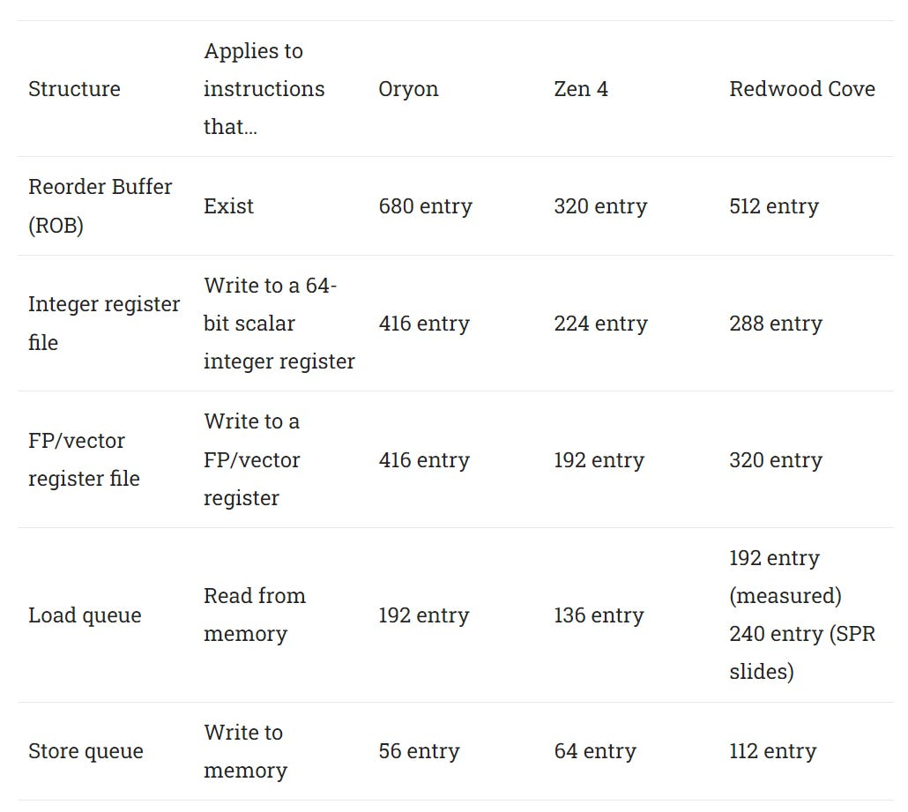

*图 27：Oryon/Zen 4/Redwood Cove 的 ROB 为 680/320/512，整数寄存器为 416/224/288，FP/向量寄存器为 416/192/320，Load Queue 为 192/136/192（Redwood 另有 240 项公开口径），Store Queue 为 56/64/112。所有“项数”必须结合统计对象理解，尤其不能把 ROB、物理寄存器与可并发 miss 数量视为同一种窗口。*

### 整数调度

调度器每周期都要判断哪些操作数已经就绪，还要把刚产生的结果与大量等待项比较。容量越大，比较网络、唤醒广播、线长、面积和功耗越难控制。Oryon 很可能通过“一条队列对应一个执行端口”的分布式方式降低成本，每个队列每周期只需选出一条 ready 微操作。

整数侧有六个 20 项调度器，合计 120 项，连接六条 ALU，其中两条支持整数乘法、两条支持分支。Firestorm 的六个整数队列为 28/28/26/24/16/12 项，合计 134 项；Zen 4 为四个 24 项队列，合计 96 项，而且其中部分容量还与地址生成操作共享；Redwood Cove 约 97 项，并在整数和 FP/向量操作之间共享。

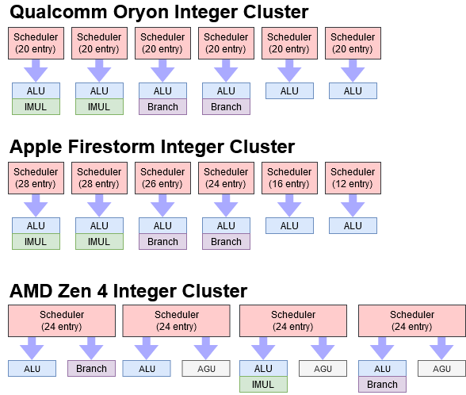

*图 28：Oryon 用六个同为 20 项的队列供给六端口；Firestorm 六队列容量不对称，总计 134 项；Zen 4 四个 24 项队列还混合 AGU。分布式队列减少单个选择器规模，但某个端口队列先满时，其他空队列未必能接收该类操作。Firestorm 的结构依据 Dougall 的微基准整理。*

### FP 与向量调度

Oryon 的 FP/向量侧同样追求大容量：四个 48 项调度器共 192 项，分别供给四条 128-bit 管线，四条管线都能处理基础浮点和向量整数操作。这个取向与 Firestorm 相似，但 Firestorm 使用四个 36 项调度器和一个 12 项非调度队列；它可以先在非调度队列中缓冲刚分配的操作，从而延迟调度器满导致的前端停顿。

传统 Arm 核心主要面向手机和平板，重向量吞吐很难装进有限功耗；PC 用户却往往希望视频、渲染和科学计算等任务直接在本地完成。Oryon 因此没有沿用偏弱的移动端向量后端，而是为四条 128-bit 管线准备了远大于一般 Arm 核心的等待空间。它与 Firestorm 在低频、复杂操作的具体分配上仍有差异，图中的公共端口只反映常用路径。

Zen 4 使用一个很大的 64 项非调度队列，再进入两个 36 项调度器，调度容量只有 72 项。它在未完成 FP/向量操作的直接调度空间上远小于 Oryon，却可以凭 256-bit AVX2、以及部分产品的 512-bit 执行能力，用一条微操作完成更多工作。Redwood Cove 同样受益于宽向量，不过 Meteor Lake 的混合核心配置禁用了 AVX-512。

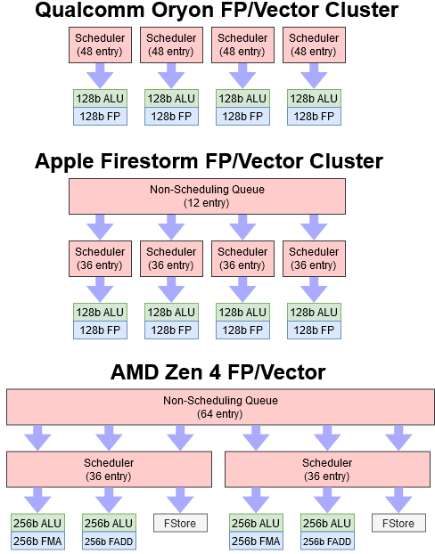

*图 29：Oryon 为四个 48 项队列，共 192 项；Firestorm 为 12 项非调度队列加四个 36 项调度器；Zen 4 为 64 项非调度队列加两个 36 项调度器。Oryon 四端口均能处理 128-bit ALU 与 FP，Zen 4 四个数学端口支持 256-bit ALU/FMA，另有两条浮点 Store 路径。*

在 NEON/ASIMD 这个 128-bit 上限内，Oryon 已经把吞吐推得很高。四条管线都支持 FMA，使其理论浮点吞吐与 Zen 4 接近；对于不使用 128-bit 以上向量的代码，Oryon 甚至可能占优。但它不支持可伸缩向量扩展（Scalable Vector Extension，SVE），无法用更宽向量降低动态指令数。四条三输入 FMA 每周期同时发射还意味着最多需要 12 个 FP 寄存器读端口；在 416 项寄存器文件上实现如此高端口数，面积与功耗都不会便宜。

### 地址生成

地址生成侧有四个 16 项队列，共 64 项，分别连接四个地址生成单元（Address Generation Unit，AGU）。容量低于整数和 FP/向量调度，但仍高于 Firestorm 的 48 项统一调度器加 10 项非调度队列。Zen 4 理论上可以容纳 72 个未完成地址生成操作，不过这些槽位与整数数学操作共享。

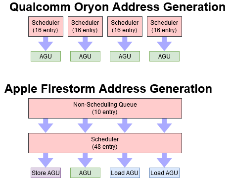

*图 30：Oryon 是四组独立的 16 项调度器与 AGU；Firestorm 先经过 10 项非调度队列，再进入 48 项统一队列，供给一条 Store AGU、一条通用 AGU 和两条 Load AGU。两种结构都可形成四地址/周期的峰值，但容量、操作类型限制和队列满时的反压方式不同。*

### 体系结构视角：窗口深度、并发 miss 与吞吐不能混成一个数字

680 项 ROB 允许核心在很远的未完成指令后继续寻找独立工作，却不意味着能同时发出 680 次访存。Load Queue、Store Queue、AGU、L1D bank、MSHR、L2 事务槽和内存控制器请求队列会逐级收紧并行度。四条 AGU 描述峰值地址生成吞吐，192 项 Load Queue 描述在途 Load 的排序容量，公开资料所说“每核 50+ 个系统请求”才更接近跨越私有缓存后的内存级并行度（Memory-Level Parallelism，MLP）。

阻塞发生时，最老未完成操作会阻止退休，ROB 随之填满；某个端口的分布式调度器、物理寄存器或 Store Queue 也可能更早反压分配。诊断时可以先看 `ROB full`、Load/Store Queue full、各队列 ready-but-not-issued、执行端口忙、L1/L2 miss 与在途请求，再判断是“窗口看不到更远独立操作”，还是“已经看到了，但端口、Cache 或内存没有接收能力”。

精确异常和误预测恢复还要求各类队列以程序顺序边界协同。年轻操作可以在错误路径上执行，却不能留下不允许且不可回滚的架构可见副作用。Oryon 的分布式队列如何保存年龄、如何仲裁跨端口操作、如何按检查点取消，没有公开实现依据。

## 八、地址转换：L1 DTLB 很大，二级层次仍有谜团

程序使用虚拟地址，硬件需要把它们转换成物理地址。旁路转换缓存（Translation Lookaside Buffer，TLB）保存近期页表项，命中可以避免昂贵的页表遍历。Qualcomm 公开的内存管理单元（Memory Management Unit，MMU）支持 4 KB 与 64 KB 转换粒度、多种页大小、虚拟化的两阶段/嵌套转换，以及硬件页表遍历。

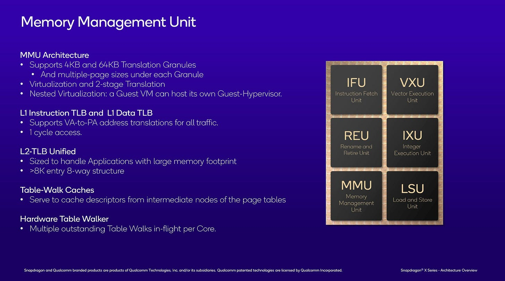

*图 31：公开幻灯片给出 L1 指令/数据 TLB 单周期访问、支持虚拟地址到物理地址转换、L2 统一 TLB 为 8K+ 项八路组相联，并配有 Page Table Walk Cache 和可并发多个遍历的硬件 Walker。它确认了层级和量级，但没有披露替换策略、各页大小的配额与 miss 恢复流水线。*

微基准测得 L1 DTLB 约 224 项、七路组相联，用 4 KB 页时可覆盖 896 KB。这个容量远高于 Zen 4 的 72 项全相联 L1 DTLB，也高于 Firestorm 的约 160 项，并让人想起老 Kryo 的 192 项 L1 DTLB。大一级 TLB 能让更多普通小页在最低延迟路径命中。

L2 TLB 超过 8K 项、八路组相联，命中比 L1 多约 7 cycle。考虑到容量和 4 GHz 以上频率，这个额外代价很有竞争力。Zen 4 的二级 TLB 约 3072 项、24 路，额外约 7～8 cycle；Firestorm 也约 3072 项。

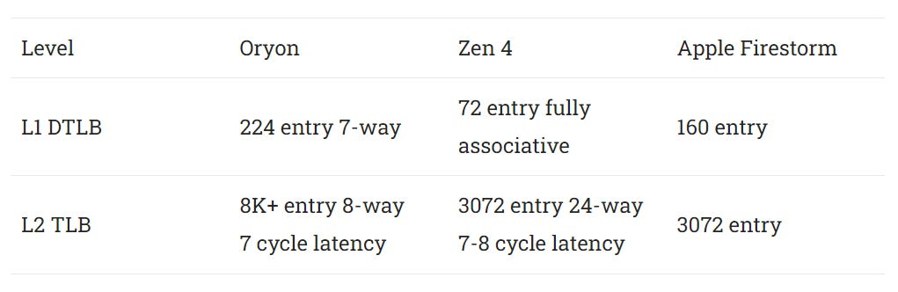

*图 32：Oryon 的 L1 DTLB 为 224 项七路，L2 TLB 为 8K+ 项八路、约 7 cycle；Zen 4 为 72 项全相联和 3072 项 24 路、7～8 cycle；Firestorm 为 160 项和 3072 项。容量、相联度与访问时间共同决定冲突和命中代价，不能只按项数排名。*

4 KB 页的实测却没有呈现简单的 224 项、8K 项两级台阶。约 6 MB 工作集后，地址转换代价已经增加，对应约 1536 个 4 KB 页；这不仅远低于 Oryon 8K 项应覆盖的 32 MB，也低于 Zen 4 的 3072 项二级 TLB 理论上可覆盖的 12 MB。超过约 128 MB 后又出现一次抬升，同样无法与 `8K × 4 KB` 直接对应。使用 Windows 4 KB 页和 2 MB 大页的曲线也不完全一致。

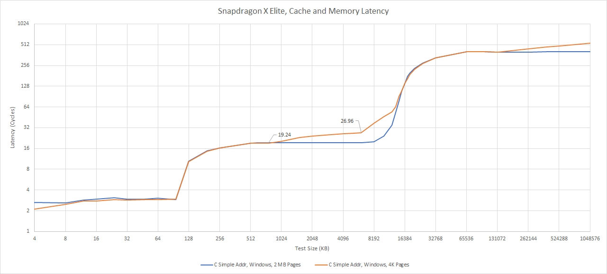

*图 33：蓝线使用 Windows 2 MB 页，橙线使用 4 KB 页。两者在小工作集内约为 2～3 cycle，越过 L1 后逐步进入约 19 cycle 的 L2 区间；4 KB 页在数 MB 工作集后额外升到约 27 cycle。再向上两条线都进入 Cache/SLC/DRAM 长延迟区，超过约 128 MB 后又出现差异。2 MB 大页让每个 TLB 项覆盖更大范围，而常见应用主要使用 4 KB 页；曲线中的转换台阶仍不能与公开的 8K+ 项容量简单一一对应。*

### 体系结构视角：TLB miss 不是一次普通 Cache miss

L1 TLB miss 可以由 L2 TLB 很快接住；L2 也未命中时，硬件 Walker 才会读取多级页表。页表项本身又要经过数据 Cache 和内存层次，虚拟化的嵌套转换还可能把一次客户机遍历放大成更多主机页表访问。因此，TLB 容量、Page Walk Cache、可并发 Walker 数和内存带宽共同决定尾延迟。

图 33 的额外台阶可能来自页大小分区、组冲突、测试访问模式、Page Walk Cache 或 WSL/Windows 映射行为，现有证据不能唯一选定一种解释。验证时应改变页大小、步长、同组地址、进程/地址空间和并发遍历数，结合 L1/L2 TLB miss、walk completed、walk active cycle 与数据 Cache miss，才能区分“TLB 容量不足”和“页表遍历被内存拖慢”。

## 九、Cache 与内存：大 L1、大簇共享 L2，再接一个小 SLC

Oryon 的缓存策略同样带有 Apple 风格：96 KB L1D 比 Zen 4 的 32 KB 和 Redwood Cove 的 48 KB 大得多，簇内直接连接一块延迟约 20 cycle 的 12 MB L2，不再插入每核私有的中间缓存。Firestorm 的 L1D 更大，达到 128 KB。

AMD 则为每颗 Zen 4 核心配置 1 MB 私有 L2，再连接 16 MB 共享 L3。私有中间层能用较低延迟隔离 L3，也更容易逐核扩充容量；不过移动 Zen 4 的 L3 只有 16 MB，工作集越过 1 MB L2 后，Oryon 的 12 MB 簇共享 L2 仍能提供很有竞争力的延迟。Meteor Lake 采用相近的多级思路，容量更大，代价是部分层次延迟更高。

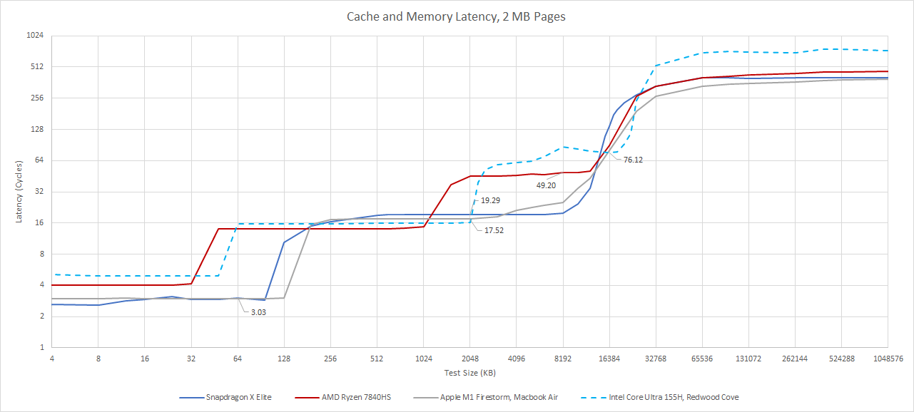

*图 34：大页把 TLB 干扰降到较低水平，便于观察数据层次。Oryon 的大约 96 KB L1 后进入约 20 cycle 的大 L2；Zen 4 和 Redwood Cove 先经过较小 L1、私有中间 Cache，再进入共享层；M1 的 Firestorm 则同样依赖大 L1 和簇共享 L2。横轴是测试规模，平台频率不同，所以 cycle 与绝对纳秒需分别理解。*

Oryon 的 L2 之后还有 6 MB SLC。Qualcomm 给出的 SLC 延迟为 26～29 ns，双向各 135 GB/s；12～18 MB 测试区间大体支持这个延迟，例如使用 2 MB 大页时，14 MB 处约为 25 ns。但准确分离 SLC 很困难，因为即使数组达到 18 MB，仍会有不少访问命中 12 MB L2。SLC 还要服务其他 SoC 模块，其 6 MB 容量又小于一个 CPU 簇的 L2，因此对纯 CPU 代码的作用可能有限。

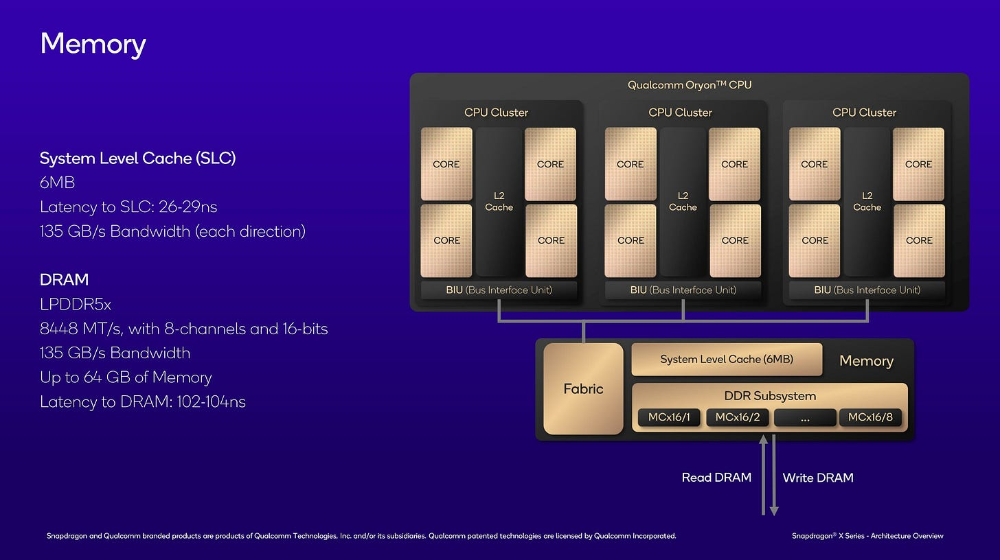

*图 35：Qualcomm 标注 6 MB SLC、26～29 ns、每方向 135 GB/s；LPDDR5X 为 8448 MT/s、8 个 16-bit 通道、理论 135 GB/s，支持最高 64 GB 内存，DRAM 延迟宣称 102～104 ns。图中的 135 GB/s 是公开规格口径，不能直接等同于某个微基准的有效载荷带宽。*

1 GB 数组测得的 DRAM 延迟为 110.9 ns，和 Qualcomm 宣称的 102～104 ns 相距不大。Ryzen 7840HS 为 103.3 ns，可能得益于 DDR5 而非 LPDDR5X；Meteor Lake 超过 140 ns。整机内存时序、控制器策略、频率和页表行为都进入这个端到端结果，因此不能只按内存介质名称解释差异。

### 带宽：把 128-bit NEON 推到很高

x86 高性能核心长期面向重向量负载，Cache 读带宽也随之做得很高。Oryon 不支持 SVE，却把 128-bit NEON/ASIMD 路径推到了接近合理上限：每周期可做四次 128-bit Load，总读宽度 512 bit，等同于 Zen 4 的两次 256-bit Load，但低于 Redwood Cove 的三次 256-bit Load。

单线程曲线中，Oryon 在 L1 内约为 240～247 GB/s，Zen 4 约 287 GB/s，Redwood Cove 可超过 400 GB/s，M1 约 138 GB/s。工作集越过 L1 后，AMD 和 Intel 的每核私有中间 Cache 提供更高带宽；Zen 4 的 L3 对单核也能给出高于 Oryon L2 的读带宽。Firestorm 对重向量吞吐没有同样的强调，因此在这组比较中落后。

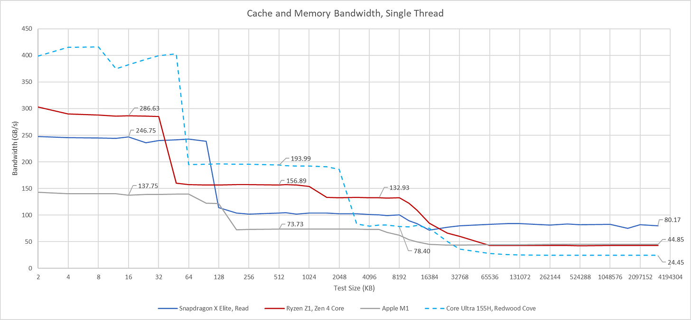

*图 36：横轴为测试规模，纵轴为 GB/s。标注值包括 Oryon L1 约 246.75 GB/s、Zen 4 约 286.63 GB/s、M1 约 137.75 GB/s，Oryon 大 L2 区间约 100 GB/s，最终 DRAM 约 80.17 GB/s；Zen 4 和 M1 的大数组结果约 44.85 GB/s，Redwood Cove 约 24.45 GB/s。不同内存配置和频率使 DRAM 段属于平台比较。*

一个 Oryon 核心从 DRAM 读取时竟能达到约 80 GB/s。Qualcomm 公开资料称，每核可向系统保持 50 个以上在途请求，一个 L2 实例可跟踪 220 个以上内存事务；如此大的请求窗口有助于用并发隐藏 DRAM 延迟，也解释了为何单核能占用很大一部分 LPDDR5X 带宽。

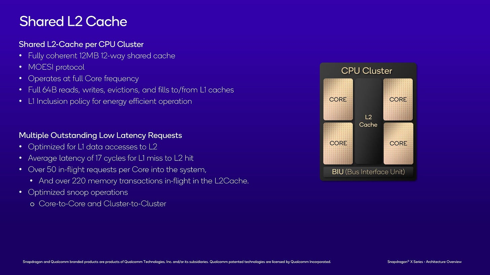

*图 37：每个四核簇拥有 12 MB、12 路、全一致的共享 L2，使用 MOESI，按核心全频运行；L1 与 L2 之间以完整 64 B Line 读写、驱逐和填充。公开资料称 L1 miss、L2 hit 平均 17 cycle，每核 50+ 个系统在途请求，L2 内 220+ 个在途内存事务，并针对核间和簇间 snoop 优化。*

四颗 Oryon 同时读取时，簇共享 L2 仍可提供接近 330 GB/s，约合每核 82 GB/s，只比单核不受争用时的约 100 GB/s 略低。四颗 Zen 4 的私有 L2 合计约 449 GB/s，Redwood Cove 四核更高；进入更大共享层后，Oryon 的表现则重新变得有竞争力。

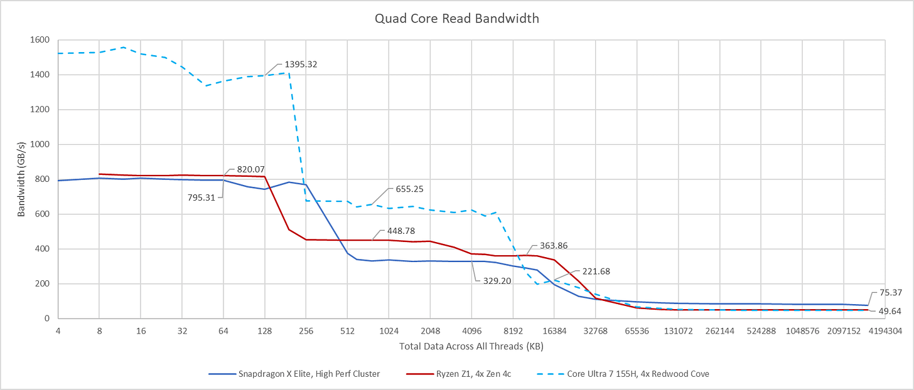

*图 38：Oryon 高性能簇在 L1 区间约 795 GB/s，共享 L2 平台约 329.20 GB/s；四颗 Zen 4 约为 820/448.78 GB/s，四颗 Redwood Cove 约为 1395/655.25 GB/s。更大工作集下，Zen 4 L3 约 363.86 GB/s，图中 Oryon 随工作集越过 12 MB L2 后下降；DRAM 尾部约为 75.37、49.64 GB/s。*

把全部核心/线程拉满后，X Elite 与 Phoenix 会在不同层次交替领先。L1 区间相近，Phoenix 的八颗 Zen 4 频率更高，略占优势；AMD 全核私有 L2 总带宽大约高 25%。Meteor Lake 借更高核心数和 Redwood Cove 的三次 256-bit Load 在 Cache 内领先，但全线程负载会带来降频，低带宽 E-Core 也会稀释优势。

工作集超过 AMD 的私有 L2 总容量后，Qualcomm 的三块 12 MB L2 合计 36 MB，并行提供的带宽比 Phoenix 共享 L3 高约 16%。网页在这里写成“三个 L3 实例”，结合前面的系统结构和 Qualcomm 公开幻灯片，应当指三个簇各自的 12 MB L2；名称虽有出入，“多个共享实例并行提高总带宽”的判断不受影响。进入 DRAM 后，X Elite 的实测读带宽超过 110 GB/s，明显领先 Phoenix 和 Meteor Lake。

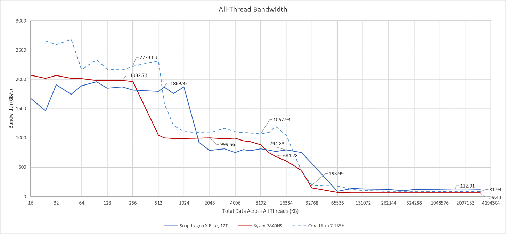

*图 39：X Elite 12 线程、Ryzen 7840HS 16 线程和 Core Ultra 7 155H 全线程对照。标注平台包括 X Elite L1 约 1869.92 GB/s、三块 L2 区间约 794.83 GB/s，Zen 4 私有 L2 约 999.56 GB/s、L3 约 684.28 GB/s，Meteor Lake 中间层约 1067.93 GB/s。大数组端 X Elite 约 112.31 GB/s、Meteor Lake 约 81.94 GB/s、Phoenix 约 59.43 GB/s。*

### 体系结构视角：大队列只能创造并行，不能创造带宽

从核心到 DRAM，请求要依次经过 Load Queue、AGU、L1D bank、miss 状态保持寄存器（Miss Status Holding Register，MSHR）、L2 事务槽、Fabric、SLC、内存控制器和 LPDDR5X。50+ 个系统请求和 220+ 个 L2 事务让 Oryon 有机会把 110 ns 延迟重叠起来，但最终吞吐仍受最窄链路限制。大窗口的作用是“给链路足够多的工作”，并不会让 135 GB/s 的物理接口凭空变宽。

图 36～39 也不能只看最高数字。小数组容易受执行端口和频率限制，中数组考验 Cache bank 与共享层，大数组才接近内存系统；全线程还会引入降频、簇间分配和读流竞争。验证反压链时，应把 Load 退休吞吐、L1/L2 miss、MSHR full、L2 transaction occupancy、Fabric 队列和内存控制器利用率放在同一时间轴上。若请求数已高而带宽不再增加，瓶颈就在更下游；若 ROB/LQ 先满且控制器仍空闲，则核心没有产生足够 MLP。

## 十、Cinebench 2024：核心很多，但功耗和频率决定能否拉开差距

Cinebench 长期用于观察多核渲染吞吐。2024 版提供原生 ARM64 构建，因此 X Elite 不承担 x86 二进制翻译代价。被测三台笔记本都在电池模式运行，图中“Platform Power”取自电池放电功率，包含显示、内存和其他整机组件，不是 CPU 封装功耗。

X1E-80-100 得分 938，Ryzen 7840HS 为 865，Core Ultra 7 155H 为 613。SMT 让八颗 Zen 4 能从两个硬件线程中寻找更多并行工作，但仍不足以抵消 X Elite 的核心数优势。X Elite 比 AMD 高 8.4%，平台功率为 39.72 W，Ryzen 为 38.95 W，仅高约 2%；Intel 为 39.08 W。表面看 Qualcomm 的效率很有竞争力，但 12 颗 Oryon 比 AMD 的八颗 Zen 4 多 50%，核心本身还更大。按纸面资源，它本应拉开更大差距，实际却被整机功耗和散热压住。

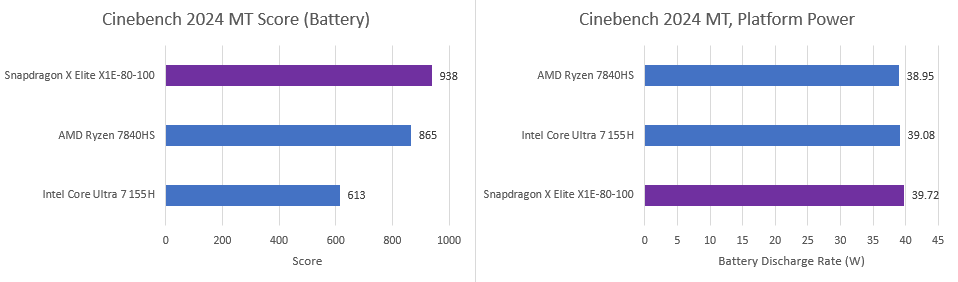

*图 40：X Elite/Ryzen 7840HS/Core Ultra 7 155H 得分为 938/865/613，平台功率为 39.72/38.95/39.08 W。Cinebench 为原生 ARM64，不含翻译损失；功率是电池放电率，测试设备、屏幕、内存、散热和频率均不同，所以它是整机结果。*

Qualcomm 的高功率参考机确实展示了更高成绩：Demo Config A 得 1220，Core i7-13800H 为 996，Ryzen 9 7940HS 为 979，较低功率的 Demo Config B 为 950，Apple M2 为 572。不过 Config A 标注的是含义并不清楚的“80 W Device TDP”，并非可直接与 CPU Package Power 对齐的统一指标。

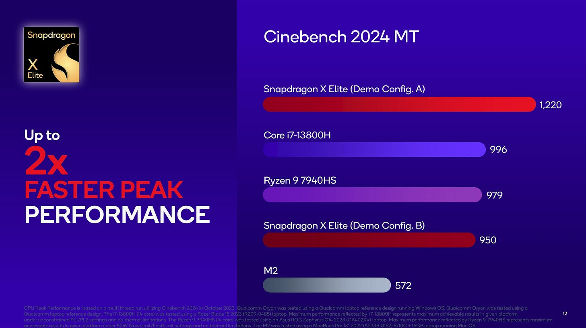

*图 41：Qualcomm 幻灯片给出 Demo Config A/B 的 1220/950，以及 i7-13800H 996、Ryzen 9 7940HS 979、M2 572。脚注说明测试为 2023 年 10 月的 Cinebench 2024 多线程运行：Oryon 使用 Windows 参考设计，Intel 对照为 Razer Blade 15 2023，AMD 对照为 Asus ROG Zephyrus G14 2023，M2 使用 2022 款 13 英寸 MacBook Pro；各平台的功率/热限制并不统一。Config A 的“80 W Device TDP”口径也不清，因此不能与图 40 拼成统一能效排名。*

频率解释了为何较少核心仍能追得很近。Samsung 机型在渲染中平均只有 2.71 GHz，HP ZBook Firefly G10 A 的 Ryzen 7840HS 平均 3.75 GHz。Meteor Lake 虽有 16 核，却在相近平台功率下只略快于 M2：Asus Zenbook 14 OLED 中，Redwood Cove P-Core 平均 2.75 GHz，Crestmont E-Core 平均 2.33 GHz；六颗 P-Core 中有一颗以及两颗低功耗 E-Core 没有承受显著负载。

### 体系结构视角：多核成绩是核心、SoC 与整机共同完成的

多线程吞吐近似取决于有效核心数、每核 IPC、持续频率、并行效率和内存/互连供给。12 颗大核只有在功耗与散热允许时才能展现资源优势；若每核降到 2.71 GHz，再大的 ROB 和调度器也无法补回全部频率差。反过来，较少核心用 SMT 和更高持续频率，也可能逼近大核数量更多的平台。

比较时至少要统一软件版本、原生 ISA、线程数、电源模式、整机功率口径、预热和持续时间。图 40 适合回答“这三台具体笔记本在电池模式下怎样”，图 41 适合说明“更高功率参考设计能把 X Elite 推到哪里”；它们都不足以单独证明某颗核心的绝对每瓦性能。

## 十一、Oryon 已经站上赛道，平台生态才是更陡的坡

Oryon 把 Firestorm 的宽核心、大窗口思路与 Qualcomm 早年 Kryo 的部分取向结合起来，形成一颗相当扎实的架构。Snapdragon X Elite 也是 Qualcomm 多年来进军笔记本市场最有力的一次尝试：12 颗同构大核在纸面上足以正面对抗八核 Zen 4 和 16 核混合配置的 Meteor Lake。

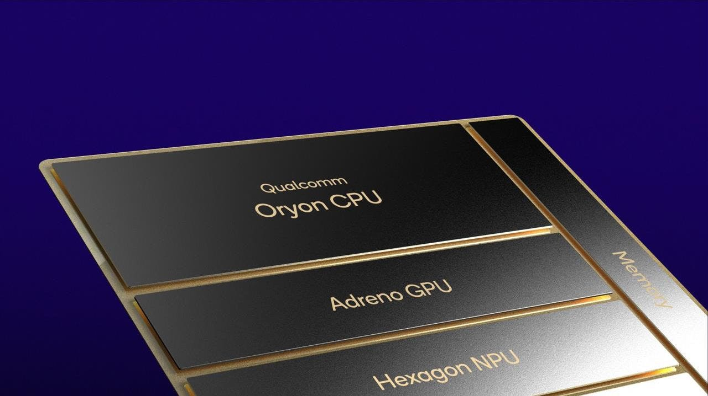

*图 42：Qualcomm 2023 Snapdragon Summit 的宣传渲染，展示 Oryon CPU、Adreno GPU、Hexagon NPU 和内存子系统。这是产品表达，不是可据以确认互连位宽、物理布局或 Cache 包含关系的工程图。*

更完整、控制条件更严格的应用 Benchmark 留给拥有更多样机和对照平台的主流测试机构。从这里的初步结果看，原生应用中的 X Elite 已有竞争力；即使经过二进制翻译，Oryon 也足够快，能提供可用体验。这意味着它已经满足 Apple Firestorm 在 2020 年成功的两个前提：核心本身够快，非原生软件也不至于完全不可用。

但 Windows on Arm 面对的坡比 Apple M1 更陡。Apple Silicon 是既有 Mac 用户唯一的升级方向，而 PC 用户随时可以选择成熟的 AMD 与 Intel 平台。PC 生态的长期优势来自软件和系统兼容性：x86 机器通常可以启动跨越数代的通用 Windows/Linux 镜像，主板厂商不同也不必为每台设备定制整个系统。Arm PC 仍存在严重的平台碎片化；即使都使用 Oryon，操作系统镜像也可能需要按具体笔记本适配。X Elite 运行 x86 软件还要付出翻译性能损失。

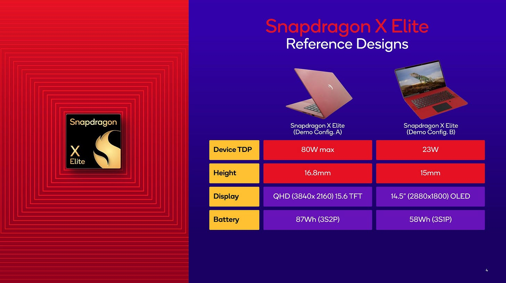

*图 43：Qualcomm 2023 年展示的 Demo Config A/B。A 标注最高 80 W Device TDP、16.8 mm 厚、15.6 英寸 QHD、87 Wh；B 为 23 W、15 mm、14.5 英寸 OLED、58 Wh。它说明同一 SoC 可以落入差异很大的整机功耗与散热边界，也解释了为什么产品成绩不能脱离设备讨论。*

价格同样是现实门槛。文章发布时，X Elite 笔记本往往比 Phoenix 和 Meteor Lake 机型更贵，甚至内存与 SSD 配置还更低。让消费者为更低规格和更多兼容性风险支付溢价并不容易。Qualcomm 需要与 OEM 一起把价格降到有吸引力的范围；设备保有量上升，开发者才更容易获得 ARM64 Windows 机器，原生应用生态也才会随之增长。

Qualcomm 仍有大量工作要做。Oryon 第一代已经证明核心设计本身有实力，下一代还需要在单核频率、簇间通信、前端大工作集、软件支持、平台标准化和产品定价上继续追赶，才能与 AMD、Intel 的下一代产品同步前进。

## 十二、体系结构视角：从 Oryon 可以归纳出的六点认识

结合这组测试与前面的机制分析，还可以得到六点更一般的处理器设计认识。它们是对材料的体系结构归纳，不是 Qualcomm 已公开的实现说明。

### 1. “大核心”不是一个 ROB 数字，而是一条完整供给链

Oryon 的八宽译码、约 680 项 ROB、两个约 416 项物理寄存器池和超大调度容量共同构成深窗口。只放大 ROB，如果预测器、L1I、重命名、寄存器、队列、Cache miss 并行度没有同步扩展，额外条目只会更频繁等待。Oryon 的价值在于多数环节一起做大；它的风险也同样明显——面积、功耗、布线和恢复验证成本都会随之上升。

### 2. 分支预测不只比准确率，还要比目标交付时机

Oryon 的方向预测很强，约 13 cycle 的公开误预测代价也有竞争力，但 Taken 分支吞吐会随代码工作集从一周期变成三周期。对于八宽核心，目标晚两拍就可能失去十几条操作的供给机会。评价前端时，方向 MPKI、BTB/间接/RAS 覆盖、重定向延迟和大代码取指带宽必须放在一起。

### 3. 巨大调度器是在用晶体管购买“等待的自由”

120 项整数、192 项 FP/向量和 64 项 AGU 调度空间让 Oryon 能把大量未就绪操作留在窗口中，并继续寻找独立工作。分布式端口队列降低了单个选择器复杂度，却可能产生局部队列先满和端口绑定问题。真正的工程难点不是把 SRAM 做大，而是完成每周期唤醒、选择、旁路和精确取消，同时守住频率与功耗。

### 4. 缓存拓扑决定多核通信的“地形”

三个四核簇让本地 12 MB L2 拥有很好的容量和带宽，也让 36 MB 总 L2 容易并行供给；代价是跨簇核间延迟接近 170～210 ns。统一 L3、分片末级缓存和簇共享大 L2 各自优化不同目标。操作系统若知道拓扑，可以把通信密集线程留在同簇，把容量型、弱通信任务分散到多个簇；调度错误则会直接暴露最慢路径。

### 5. 大 TLB 和大请求窗口是在为普通小页与高延迟内存兜底

224 项 L1 DTLB、8K+ 项 L2 TLB、每核 50+ 系统请求和 L2 内 220+ 事务，体现了相同设计哲学：用容量与并发覆盖长尾。可是图 33 的台阶没有按公开容量整齐出现，说明地址转换还受组冲突、页大小分区、Walker 和系统映射影响。处理器必须优化常见路径，也要让异常和最坏路径保持可诊断。

### 6. 一颗好核心还需要 SoC、固件、操作系统和价格把能力兑现

同一 Oryon 在接电与电池模式下的升频时间相差近两个数量级；同一 X Elite 在不同功率参考设计中，Cinebench 成绩也可以从约 950 到 1220。核心提供能力上限，电源策略、互连、内存、散热和软件决定用户实际得到多少。对 Windows on Arm 来说，设备树、通用系统镜像、翻译性能、原生应用和定价不是核心之外的“小事”，而是架构能否形成市场闭环的一部分。

## 参考与延伸

- 英文文章：[*Qualcomm’s Oryon Core: A Long Time in the Making*](https://chipsandcheese.com/p/qualcomms-oryon-core-a-long-time-in-the-making)
- Firestorm 微架构资料：[Dougall Johnson：Apple CPU Firestorm](https://dougallj.github.io/applecpu/firestorm.html)
- Oryon 返回栈对照：[Dougall Johnson 关于 Firestorm RAS 的微基准记录](https://twitter.com/dougallj/status/1580826539205496832)
- Chips and Cheese：[Patreon](https://www.patreon.com/ChipsandCheese) / [PayPal](https://www.paypal.com/donate/?hosted_button_id=4EMPH66SBGVSQ) / [Discord](https://discord.gg/TwVnRhxgY2)
