# RISC-V 进展检查：P550 与 C910 实测

> 英文标题：A RISC-V Progress Check: Benchmarking P550 and C910
> 撰文：Chester Lam
> 首发：Chips and Cheese，2025 年 1 月 30 日
> 链接：https://chipsandcheese.com/p/a-risc-v-progress-check-benchmarking

近几年 RISC-V 发展迅速，但多数落地实现仍是面向微控制器的小型顺序核。SiFive Performance P550 和平头哥玄铁 C910 的意义，在于它们都把 RISC-V 带入了乱序执行（Out-of-Order Execution）范围。它们还不是 AMD、Arm、Intel 或 Qualcomm 旗舰核心的对手，却足以用来检查 RISC-V 高性能实现走到了哪里。

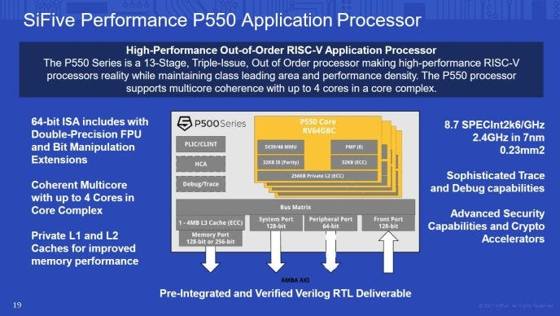

图中给出文章讨论的 RISC-V 发展背景。这里比较的是具体微架构与整机实现，不能把结果简单归因于指令集本身。

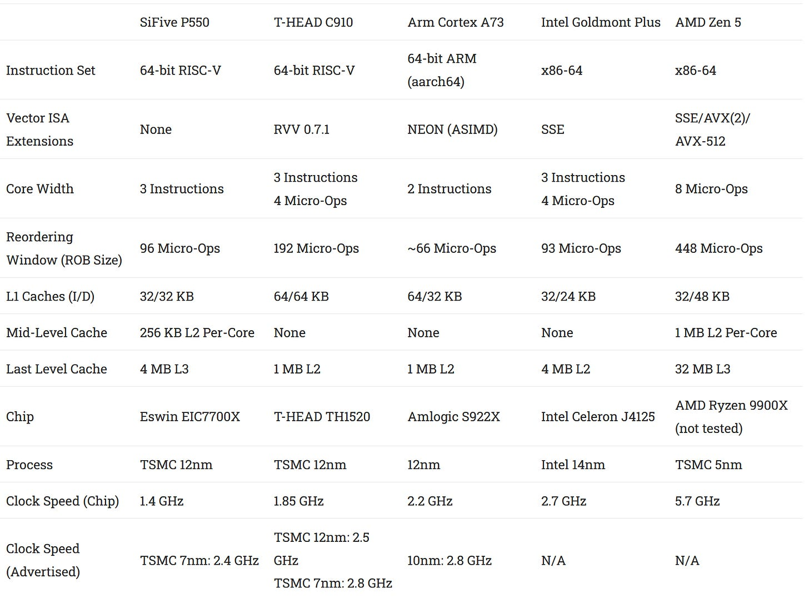

两者都采用三发射级别的乱序设计，但频率、缓存、内存控制器和软件优化共同决定最终性能。公开规格只能说明资源上限，不能代替实测。

为了给结果建立参照，测试还加入 Arm Cortex-A73 和 Intel Goldmont Plus。两者同样拥有规模不算大的乱序执行引擎，因此比拿旗舰大核来比较更有意义；Cortex-A55 和 A53 则代表现代顺序核。

## SPEC CPU2017：频率、IPC 与整机实现

SPEC CPU2017 以源码形式发布，同时考察硬件和编译器。本文所有 RISC-V 项目使用 GCC 14.2.0：P550 的选项为 `-march=rv64imafdc_zicsr_zifencei_zba_zbb -mtune=sifive-p400-series`，C910 为 `-march=rv64imafdc_xtheadvector -mtune=generic-ooo`。GCC 没有针对这两颗核心的专用优化模型，这是比较边界之一。

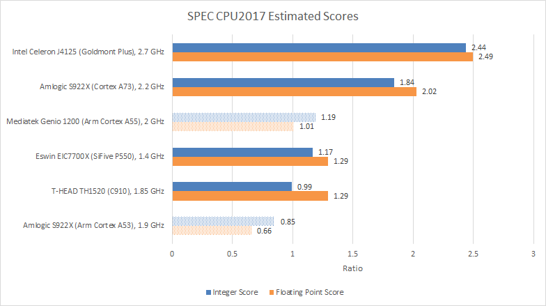

两颗 RISC-V 核心都落后于 Cortex-A73，也明显落后于 Goldmont Plus。频率影响很大：EIC7700X 的 P550 集群仅运行在 1.4 GHz，虽然数据表写有“最高 1.8 GHz”；C910 为 1.85 GHz。即便如此，C910 也没有靠更高频率稳定领先 P550，说明其乱序资源与存储系统的配合可能不够均衡。这是根据性能现象作出的判断，而不是 RTL 确认。

Cortex-A55 提供了另一个重要参照。联发科 Genio 1200 上的 A55 频率更高、DRAM 延迟也更低，因此能在部分项目追上 P550 与 C910。1990 年代 Pentium 以更高频率压过同频更强的 AMD K5，也说明“是否乱序”不是性能排名的唯一轴。A55 并非处处取胜，在 SPEC 浮点套件中仍落后两颗 RISC-V 核心；能力更弱的 A53 即使频率更高也追不上。

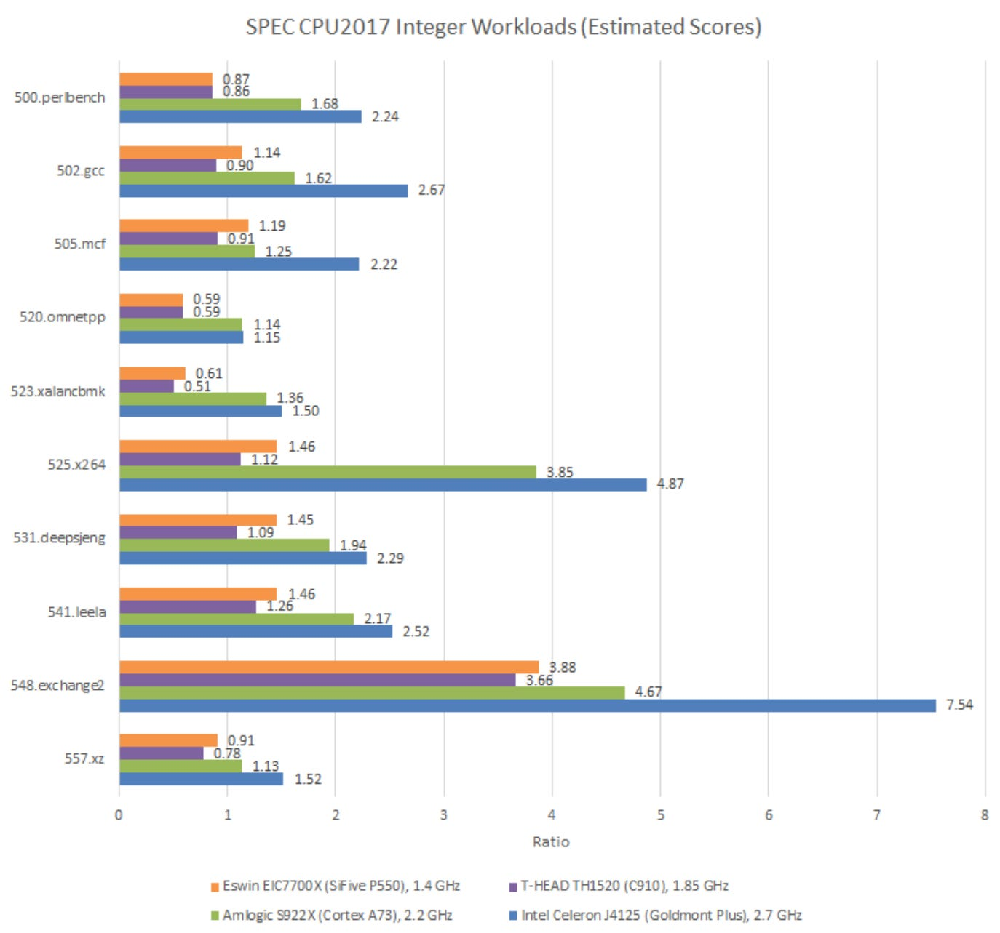

C910 在整数子项中没有一项战胜频率更低的 P550；浮点项目里它能赢下一些子项，却仍未取得总体领先。A73 和 Goldmont Plus 则较好地把频率优势转化为实际成绩。

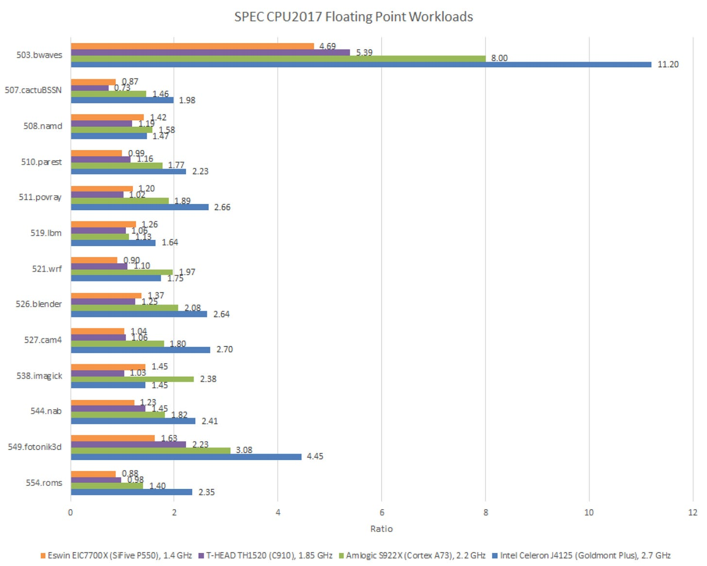

图 4、图 5 应按子项理解，不能从某一个项目外推整颗处理器。编译器、内存延迟以及不同 SoC 的频率策略都进入了结果。

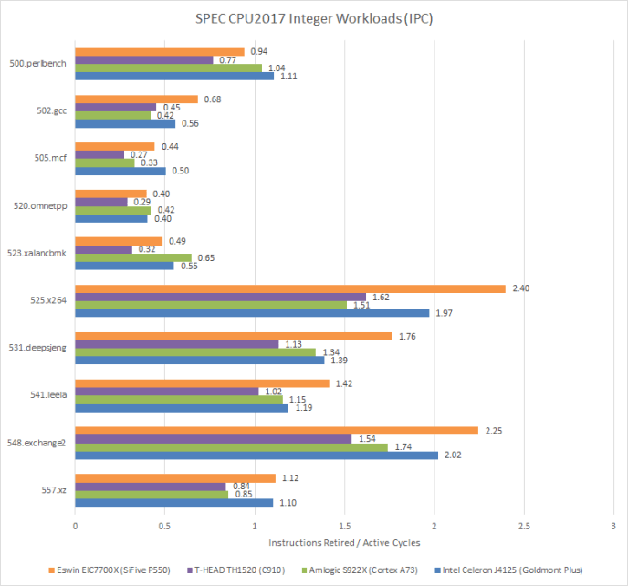

硬件计数器给出的每周期指令数（IPC）可观察流水线宽度是否得到利用。`548.exchange2` 和 `525.x264` 属于高 IPC 工作负载，双宽 A73 容易受到宽度限制，三宽 P550 和 Goldmont Plus 可达到或超过 2 IPC；同为三宽的 C910 却较难把宽度利用起来。

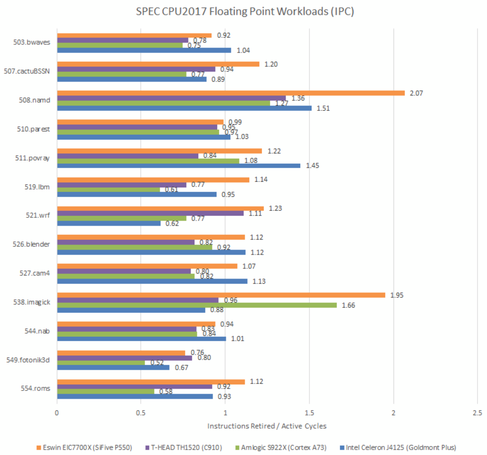

`538.imagick`、`508.namd` 也有较高 IPC。Goldmont Plus 在 imagick 中表现很差，却依靠其他项目和高频率保住总体优势；P550 的 IPC 较好，但 1.4 GHz 的频率劣势很难弥补。

### 体系结构视角：IPC 不是脱离频率和指令数的性能

IPC 接近机器宽度时，译码、重命名、调度或执行端口更可能成为限制；IPC 很低时，分支误预测和存储延迟往往更值得检查。但完成同一任务所需的动态指令数还取决于 ISA、编译器和库优化，性能近似为“有效 IPC × 频率 ÷ 工作量对应的指令数”。因此高 IPC 既可能代表前后端高效，也可能只是执行了更多、粒度更小的指令。

## 7-Zip：四核压缩

测试用 7-Zip 压缩一个 2.67 GB 文件，限定四个核心、四个线程。该负载几乎只使用标量整数指令，浮点和向量能力并不重要。

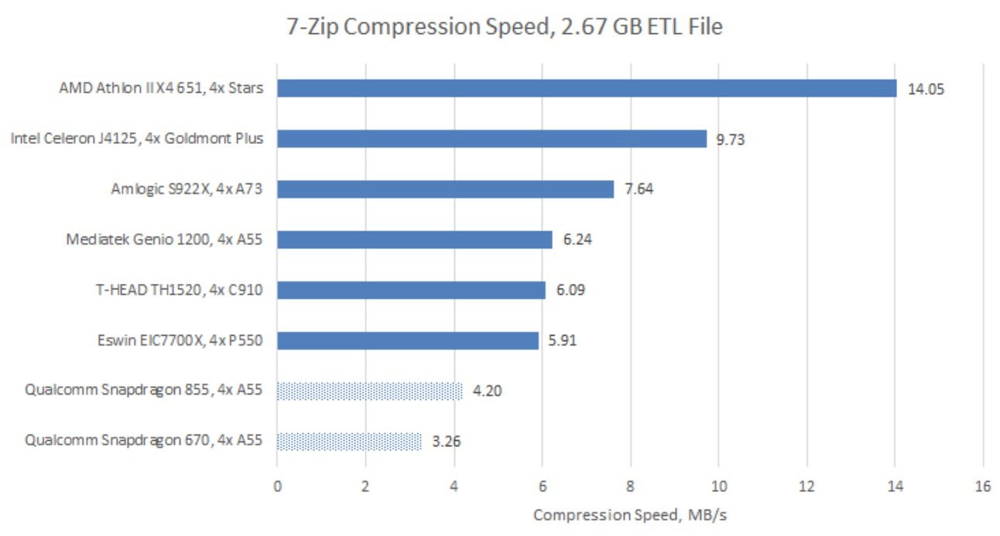

C910 与 P550 成绩接近，并略落后于 Genio 1200 上的 Cortex-A55，再次说明频率和存储系统良好的顺序核仍能很有竞争力。

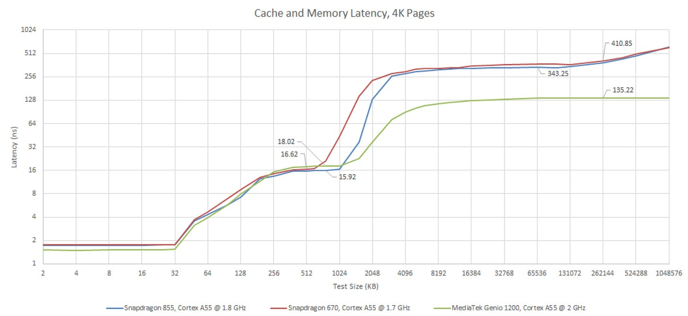

Snapdragon 855 和 670 中的 A55 频率更低、DRAM 延迟更高，因此反而落后于 P550 和 C910。同一核心 IP 在不同芯片中可以有很大的性能差异。

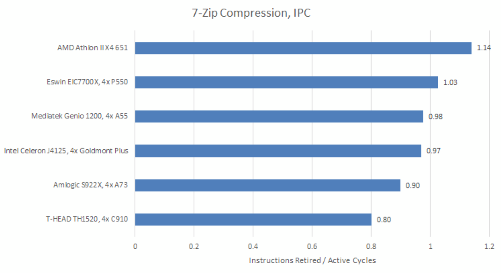

7-Zip 分支和缓存未命中都较多，属于较难获得高 IPC 的负载，P550 仍能较好利用流水线。图中对 A55 计数器可靠性保留疑问：其指令数接近 A73，却更慢；这项不确定性不能被静默忽略。

## SHA-256：顺序核的理想场景

`sha256sum` 处理同一个 2.67 GB 文件。其指令流以算术和按位运算为主，分支与数据访存较少，而且测试没有使用专门的哈希加速指令。

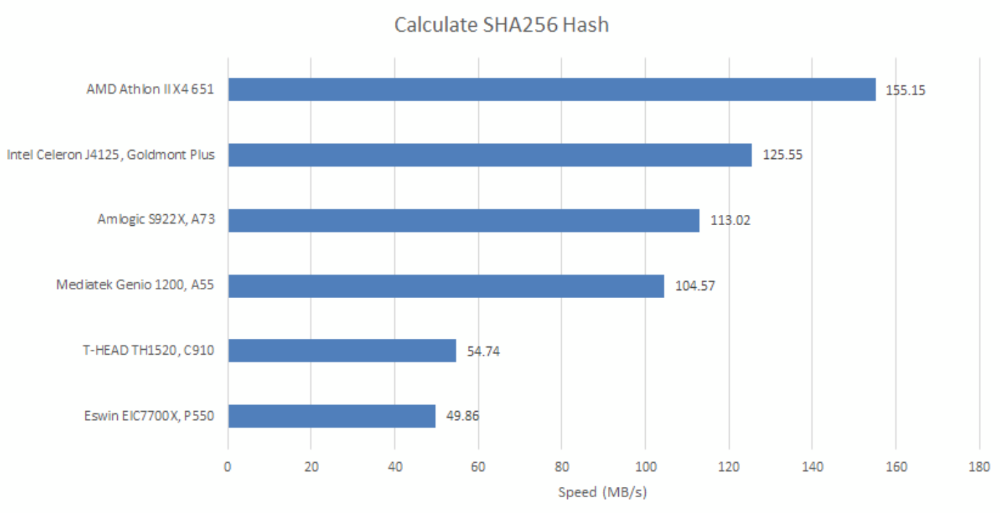

Cortex-A55 意外取得明显领先。这类规则、短依赖且访存压力低的代码很适合顺序流水线，A55 的 IPC 甚至高于 A73。

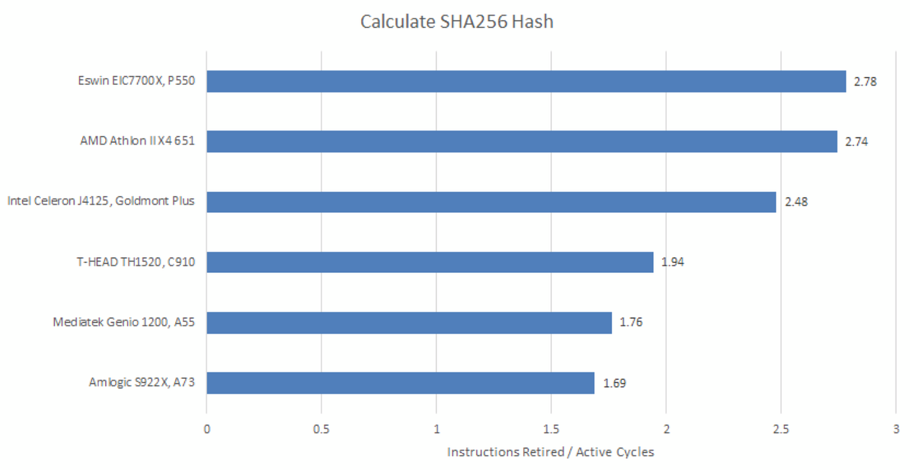

三宽核心也能发挥：P550 和 Goldmont Plus 稳定超过 2 IPC，C910 接近 2 IPC。

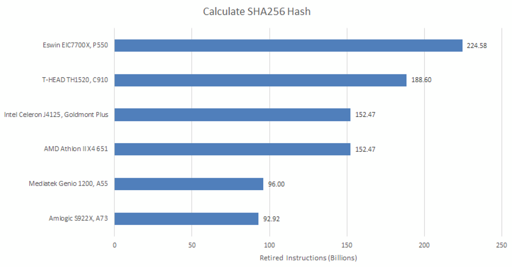

x86-64 用较少指令表达了这项工作，AArch64 的动态指令数更少；两颗 RISC-V 核心需要更多指令。P550 与 C910 之间的计数差距大于预期，原因尚不明确。`perf` 读取计数器会中断目标程序，PMU 本身也不以功能单元那样的严格程度验证，因此这些数据存在测量误差。

## x264：软件生态决定向量能力能否落地

SPEC 的 `525.x264` 为跨 ISA 公平不能包含 ISA 专用汇编；现实中的 libx264 则大量使用手写汇编内核。本次测试让 x264 输出它检测到并能利用的 CPU 能力。

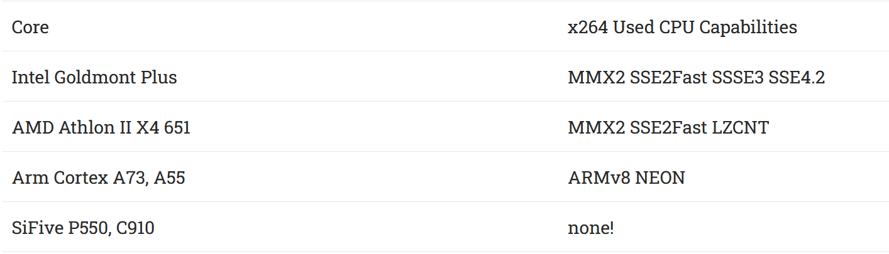

C910 支持 RVV 0.7.1，但 libx264 没有任何 RISC-V 扩展的汇编实现。于是 A73 和 Goldmont Plus 处于完全不同的性能档位，连 A55 也明显领先。

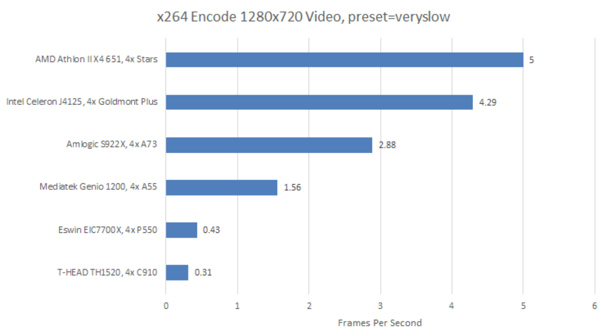

这不是单纯的核心硬件排名，而是硬件、指令集扩展成熟度与软件实现共同作用的结果。

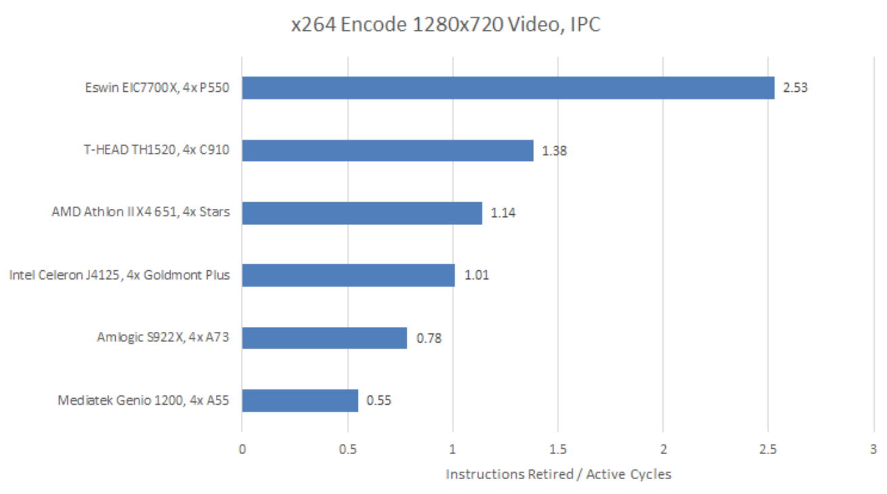

两颗 RISC-V 核心反而位于 IPC 榜首，P550 接近三宽上限，C910 的 1.38 IPC 也不低。

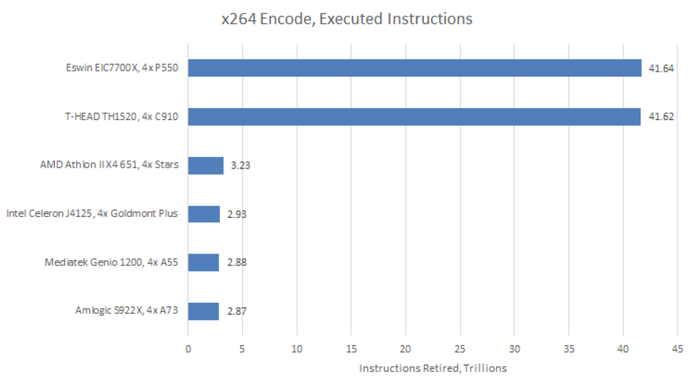

问题在于它们为同一任务执行了远多于 x86-64 和 AArch64 的指令。此时只看 IPC会得出相反结论：高 IPC 并没有变成高吞吐。

### 体系结构视角：ISA 扩展需要软硬件同时跨过门槛

向量硬件只有被编译器自动向量化、通用库或手写内核使用时才产生价值。开发者通常要先看到足够大的装机量和性能回报，才愿意长期维护新后端；而硬件厂商又需要软件展示能力。这种“先有软件还是先有硬件”的循环，是年轻 ISA 进入高性能市场时不亚于微架构本身的难题。

## 结语

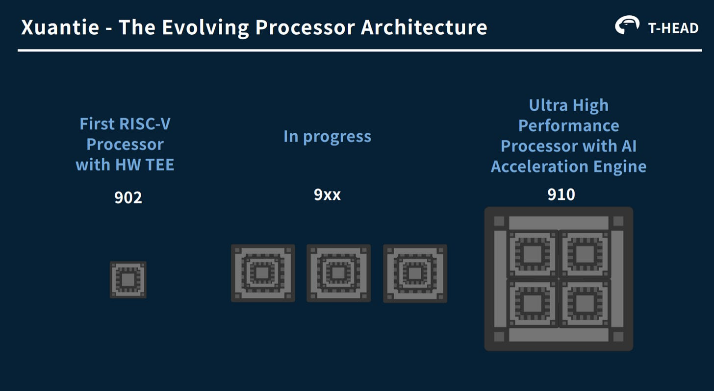

P550 的乱序引擎较为均衡，常以较高 IPC 抵消部分频率劣势，在简单负载中还能接近核心宽度上限；C910 更高的频率经常没有转化为稳定领先。若实现者给 P550 更高频率和更低 DRAM 延迟，它可能还有明显潜力。

不过，本文平台上的 P550 和 C910 距离成熟 Arm 与 x86-64 实现仍有距离。差距既来自低频率和系统实现，也来自编译器、库与向量软件生态。单次测试不能证明 RISC-V ISA 天生较慢，但足以说明：一颗高性能处理器是核心、SoC、工具链和应用优化共同形成的产品。

## 参考资料

- Chips and Cheese：A RISC-V Progress Check: Benchmarking P550 and C910
- SPEC CPU2017、GCC 14.2.0，以及各平台公开规格
