# SiFive P550 深度拆解：三宽乱序、Cache 层次与 SoC 边界

> **文章来源**
>
> - 文章：*Inside SiFive’s P550 Microarchitecture*
> - 撰文：Chester Lam
> - 首发：Chips and Cheese
> - 发布：2025 年 1 月 26 日
> - 链接：https://chipsandcheese.com/p/inside-sifives-p550-microarchitecture

RISC-V 是一套相对年轻、开放的指令集。它已经在微控制器、学术研究和各类片上控制器中站稳脚跟：例如，Nvidia 用 RISC-V 替换了 GPU 内部的 Falcon 微控制器，Berkeley BOOM 等大学项目也以 RISC-V 为基础。但从这些场景走向对单线程性能、系统软件和产品成熟度要求更高的市场，难度会陡然增加。SiFive 在这个过程中承担的角色，近似于 Arm 在 Arm 生态中的角色：提供可授权的处理器 IP，由芯片厂商完成 SoC、内存系统和整机实现。

P550 正是 SiFive 向高性能方向迈进的一步。SiFive 曾以“相对可比的 Cortex-A75，在不到一半面积内提供高 30% 的性能”描述其目标；但这类 PPA 宣称离不开工艺、电压、频率、Cache 配置和工作负载。这组受控条件没有在文章中复现。Chester Lam 选择从 SiFive Premier P550 Dev Board 入手，用一组微基准逐层探测 P550 的前端、乱序后端和存储系统。

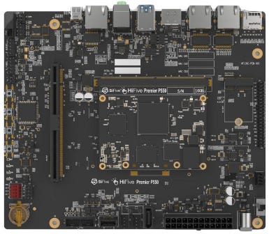

*图 1：英文图注为“数据表中的 P550 开发板渲染图”。被测对象是板上 Eswin EIC7700X SoC 中的 P550 实现，而不是脱离平台的 P550 IP；核心之外的 L3、片上网络、DDR 控制器和板级配置都会进入结果。*

## 先看清这些数字来自哪套系统

这次测试使用 SiFive Premier P550 Dev Board，具体配置如下：

- SoC：Eswin EIC7700X，台积电 12 nm FFC；
- CPU：4 个 SiFive P550 核心，频率 1.4 GHz；
- 共享 Cache：4 MB L3；
- 内存：16 GB LPDDR5-6400；
- 主要对照：Pixel 3a 中的 Qualcomm Snapdragon 670，包含 2 个 2 GHz Cortex-A75；
- 特殊对照：图 15 的 Cache 延迟使用 Amlogic S922X 中的 Cortex-A73，因为 Android 对照机无法以相同方式使用大页；图 17 的四核带宽也使用该 A73 平台，但文章没有交代这项选择的原因。

网页开头曾把 SoC 写成 `EC7700X`，其余正文、图题和资料均写 `EIC7700X`。结合这些上下文，首处差异更像是一处笔误；下文统一采用 `EIC7700X`。

文章没有披露操作系统与内核版本、编译器、优化参数、微基准完整源码、预热和重复次数、误差范围、线程绑核方式、频率策略及预取器状态。除图 17 明确为四线程/四核、图 21～22 明确为核间测试外，其他图的线程条件也没有逐项完整标注。

因此，这批数据适合用来识别容量台阶和结构趋势，不足以构成统一软件栈、统一功耗条件下的产品性能排名。不同图中的 A73 与 A75 也不能合并成一个“Arm 对照平台”。

阅读这些数字时，需要始终分清三层证据：SiFive 和 Eswin 数据表给出的是公开规格；曲线、计数器和延迟来自这块开发板上的微基准；内部容量和组织方式则往往是根据拐点反推。后两类结果都不能自动外推到所有 P550 实现。

材料中也没有 P550 RTL，所以涉及 BTB、队列、端口和恢复逻辑的描述，只能以“约”“可能”或“推测”表述。

下文顺着 23 张图展开：先看开发板上的直接观察，再讨论这些现象在微架构上可能意味着什么。机制分析是对测试现象的体系结构解读，不代表 P550 已经确认采用某种内部实现。只有图 1、15、18 带英文正式图注，其余 20 条中文说明用于帮助读图。

## 一、核心总览：面向面积与功耗约束的三宽乱序核

SiFive 公布的规格显示，P550 是一颗三宽乱序执行核心，流水线为 13 级。乱序执行允许处理器在老指令等待数据时，从更年轻的指令中寻找可执行工作；在 Cache 和内存延迟远高于单个算术操作的现代系统里，这是通用高性能核心的基础能力。

P550 并非 SiFive 第一颗乱序核。更早的 U87 同样采用三宽乱序结构；P550 在其后多年推出，代表 SiFive 对这条路线的进一步工程化。

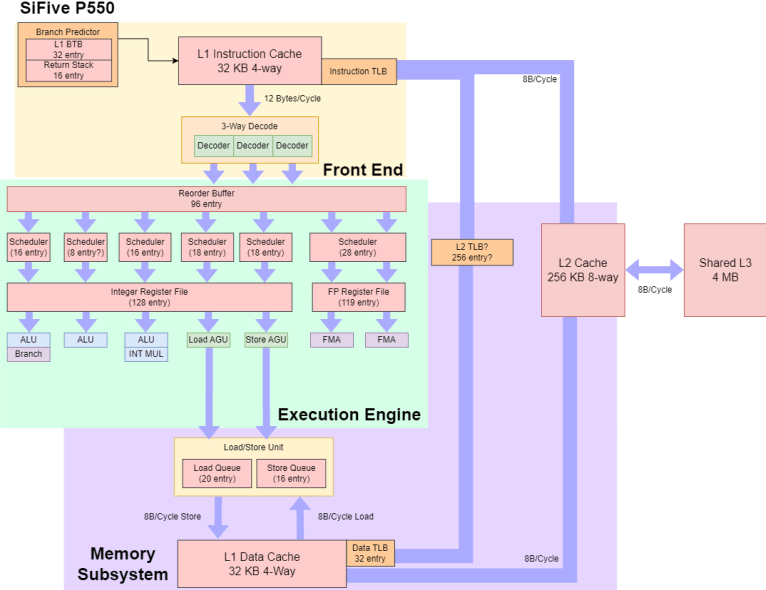

*图 2：这张图把公开信息与微基准反推汇总在一起，包括三宽译码、约 96 项重排序缓冲区、三条整数路径、独立 Load/Store AGU、两条 FP 路径，以及每核私有 L1/L2 和共享 4 MB L3。问号和近似值表明它不是 SiFive 官方模块图；其中 L2 TLB 标为“约 256 项？”，后面的详细测试则给出 512 项。*

图中汇总的主要容量包括：约 96 项重排序缓冲区（Reorder Buffer，ROB）、约 128 项整数寄存器文件、约 119 项浮点寄存器文件、20 项 Load Queue 和 16 项 Store Queue。前端为 32 KB、4 路组相联 L1 指令 Cache，后端连接 32 KB、4 路组相联 L1 数据 Cache 和 256 KB、8 路组相联私有 L2。

Cortex-A75 被选作主要参照，是因为两者同为三宽、面向功耗和面积效率的乱序核心。A75 是 Cortex-A73 的后继者；AnandTech 的资料将其流水线描述为 11～13 级，而框图暗示最短分支误预测代价可能更接近 11 个周期。

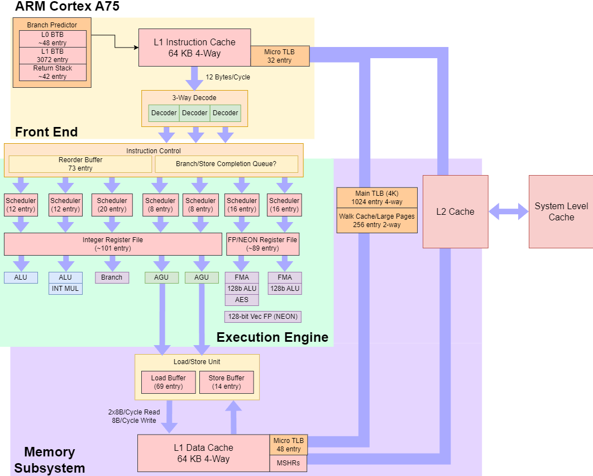

*图 3：Cortex-A75 对照图同样混合了公开资料与反推值，包括三宽译码、约 73 项 ROB、两条通用 AGU、两条 FP/NEON 路径和 64 KB L1。图中将 BTB 画成约 48 项 L0 加 3072 项 L1，后面的文字却称 A75“似乎只有一个小型 BTB 层级”，因此精确层级仍无法确定。*

在 Chester Lam 看来，P550 与 A75 的乱序引擎虽然都远小于当代 Intel、AMD 高性能大核，却不能简单归结为“落后”。两者只是把面积和功耗预算放在目标市场更需要的位置；真正需要考察的，是相邻结构是否匹配，以及不常见的慢路径是否足够成熟。

### 三宽真正考验的是整条供给链

“三宽”不是应用一定能达到 3 IPC 的承诺。P550 公开的译码峰值是每周期三条；若要让应用接近这一吞吐，分支目标、取指字节，以及后续未公开宽度的重命名、调度、执行和退休环节都不能长期落后。任何一段持续供不上或排不出，都会成为整条流水线的实际宽度。

缓冲结构只能吸收短时波动。前端空泡会逐渐饿死后端；ROB、物理寄存器、调度器或 Load/Store Queue 满，则会把反压一路传回取指。若按约 96 项 ROB 和三宽粗略换算，完全停止退休时最多只能容纳约 32 个周期的入口流量；这并不等于能隐藏任意 32 周期延迟。20 项 Load Queue 或未公开数量的未命中状态保持寄存器（Miss Status Holding Register，MSHR）可能更早填满，单 Load AGU 也可能先达到请求生成的吞吐上限。

最终 IPC 相同，原因可能完全不同：取指和译码吞吐也偏低，说明后端“吃不饱”；重命名停顿与 ROB、调度器或 LSU 队列满同步出现，则说明流水线“排不出去”。把各级吞吐和满周期放在一起看，才知道三宽到底卡在哪一段。

## 二、分支预测：方向正确，还要及时交付目标

SiFive 资料给出的分支历史表（Branch History Table，BHT）容量为 9.1 KiB，用历史行为帮助判断条件分支是 Taken 还是 Not Taken。

测试构造了不同静态分支数量、不同随机模式长度的条件分支序列。图中的高度轴是可预测模式与随机模式之间的时间差，曲面的明显转折被用作模式识别边界的经验信号。P550 在静态分支较少时能识别相当长的模式；随着分支数量增加，它与 A75 的差距逐渐缩小。Chester Lam 认为，这样的模式识别能力符合 P550 的产品定位，但与当代高性能大核仍有明显距离。

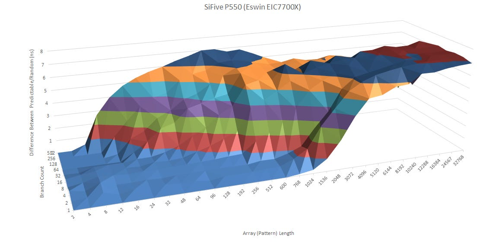

*图 4：横轴为随机 Taken/Not-Taken 模式长度，另一轴为参与测试的静态分支数，高度为可预测与随机模式的时间差。少量分支时，P550 到较长模式才出现明显转折。分支增多后的变化可能同时受到容量与混叠影响，不足以识别 gshare、TAGE 或其他具体算法。*

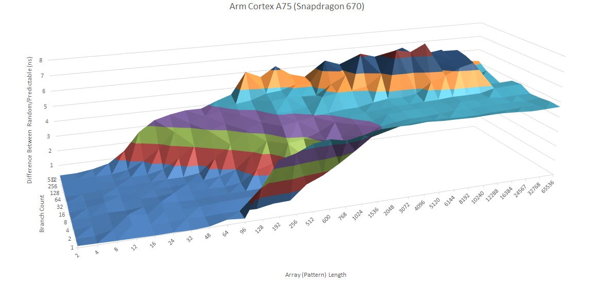

*图 5：同一类测试在 Cortex-A75 上的结果。与 P550 相比，A75 在少量分支下更早遇到长模式边界，但静态分支增多后差距缩小。这里比较的是两块不同 SoC、不同频率和 ISA 下的结构趋势，不是同平台预测准确率排名。*

方向只是第一个问题。即便已经判断分支会跳转，前端还必须及时得到目标地址。始终 Taken 的分支链显示，P550 在大约 32 个分支以内可以保持每周期处理一个 Taken 分支；超过该范围、且代码仍位于 32 KB L1I 内时，吞吐降为约每 3 个周期一个 Taken 分支。

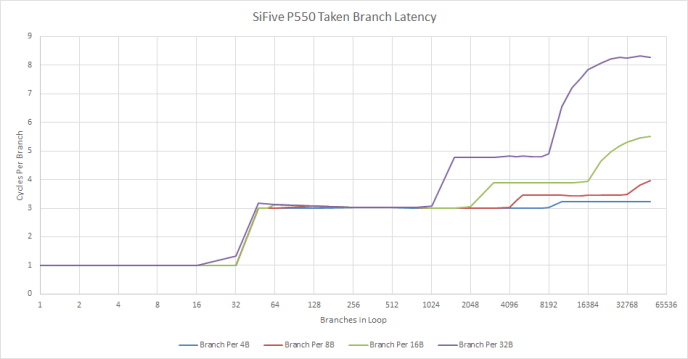

*图 6：横轴为循环中的分支数，不同曲线改变分支间距。约 32 个分支以内延迟接近 1 cycle/branch，之后多数区间稳定在约 3 cycle/branch；更大代码工作集又出现新的台阶。曲线还同时受到代码尺寸、布局和 I-Cache 层级影响。*

一种能够解释这条曲线的结构是：P550 只有约 32 项快速分支目标缓冲区（Branch Target Buffer，BTB），没有更大的解耦二级 BTB；miss 后，前端需要等待分支被识别，再计算 PC 相对目标。约 3 周期的台阶还暗示 L1I 延迟可能也是 3 周期。不过，这仍是一套基于微基准的反推，并非 RTL 结论。

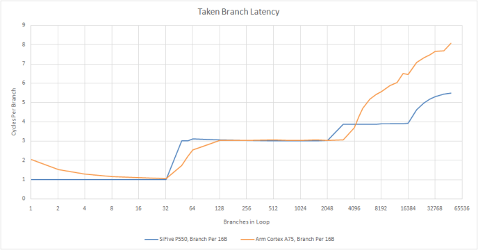

*图 7：在 16 B 分支间距下，P550 和 A75 都先经历约 32 项附近的延迟台阶；更大工作集中的曲线又受取指层级影响。Chester Lam 据此认为，两者都没有现代高性能大核常见的大容量、解耦目标供给结构；但 A75 总览图又画出 3072 项 L1 BTB，精确层级仍属未确定项。*

函数返回是第三种目标问题。同一个 `ret` 指令会因调用者不同而回到不同地址，因此处理器通常用返回地址栈（Return Address Stack，RAS）追踪动态调用嵌套。

调用深度超过 16 后，P550 的延迟陡然上升，支持 16 项 RAS 的判断。A75 的拐点约在 42 项，而且溢出后的增长更平缓。一种可能是，A75 只错掉被挤出的返回项，而 P550 的溢出处理或恢复不够平滑，少量超深嵌套也可能引发连续 return 误预测。

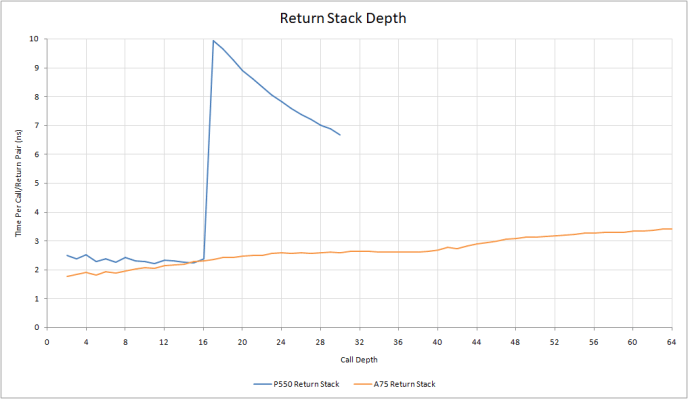

*图 8：横轴为调用深度，纵轴为每组 call/return 的纳秒时间。P550 在深度从 16 增至 17 时从约 2.3 ns 跃升到接近 10 ns；A75 到约 42 项后才缓慢上升。A75 的 2 GHz 频率也进入纳秒结果；常见命中区两者绝对时间接近。P550 曲线约在深度 30 处停止，网页没有说明原因；曲线可能同时受容量与溢出恢复策略影响。*

### 预测器交付的是连续、正确的下一段指令流

方向预测回答“跳不跳”，BTB 回答“Taken 后去哪里”，RAS 专门处理“这次函数返回到哪里”。其中任何一项失败，都会让前端停止供给或沿错误路径工作。方向错判通常需要丢弃年轻指令并重定向取指；若某种实现还会推测更新全局历史、路径历史或 RAS，就必须恢复相应状态，否则一次错误可能继续污染后续预测。现有资料没有公开 P550 保存和恢复这些状态的具体方式。

性能分析因此要把方向 MPKI、BTB miss、返回目标错误和每次重定向丢失周期拆开。13 级流水线也不等于固定 13 周期误预测代价：实际代价取决于分支在哪一级解析、正确目标由谁提供、I-Cache 是否命中以及前后端重新填充速度。没有专用 PMU 事件时，可以用固定方向、变化 PC 数量、间距和嵌套深度的正交微基准分别隔离这些因素。

## 三、取指与译码：12 B/cycle 只代表 L1I 命中快路

公开规格给出的 L1 指令 Cache 为 32 KB、4 路组相联，带奇偶校验保护，可以向下游三宽译码器提供 12 B/cycle。代码位于 L1I 时，指令取数微基准接近这一上限。

工作集超过 L1I 后，取指字节带宽降到约 8 B/cycle；按网页中的解释，这意味着从 L2 仍可维持约 2 IPC。工作集进入 L3 后，约 4 B/cycle 对应约 1 IPC；再向下进入内存，供给接近 1 B/cycle。

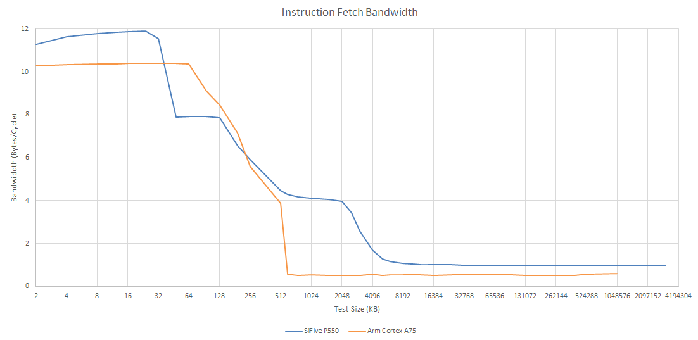

*图 9：横轴为代码测试规模，纵轴为取指字节/周期。P550 在 32 KB 内约为 12 B/cycle，随后经历约 8 B/cycle 和约 4 B/cycle 台阶；A75 的 64 KB L1I 覆盖更大，但离开私有 Cache 后下降更陡。测试没有公开代码布局和控制流，因此曲线只表示这组微基准的字节供给，不等于应用 IPC。*

Cortex-A75 的 L1I 为 64 KB，更大的容量提高了指令访问在一级命中的概率；但 Snapdragon 670 把 1 MB System Level Cache 放在更靠近内存控制器的位置，它并不以单个 CPU 核的低延迟、高带宽为首要目标。EIC7700X 的 4 MB L3 则与 P550 簇更紧密，因此 P550 在 L1I miss 后的曲线反而更平缓。这一差异主要说明 SoC Cache 拓扑，而不能简单归结为核心前端优劣。

取回的指令经译码形成内部微操作，再通过重命名进入乱序后端。现有资料没有给出重命名宽度、前端队列深度、分支 checkpoint 数量或恢复算法。

### 字节供给、指令供给和微操作供给不是同一个量

RISC-V 程序可能混合 16 位压缩指令和 32 位普通指令。12 B/cycle 足以容纳三条 32 位指令，但压缩指令比例更高时，译码宽度会先于字节带宽成为上限；反过来，跨 Cache line、跨页取指、Taken 分支截断、I-TLB miss 和指令对齐都会让可用字节低于物理接口宽度。

L1I miss 时，请求要发起 L2/L3 回填（refill）；I-TLB miss 要查询下一级 TLB，仍 miss 才进行页表遍历。重定向或异常发生后，实现通常还要用世代标签（epoch）或其他等价机制，拒收旧路径上迟到的取指和翻译结果；这里说的是通用正确性要求，不是 P550 的 RTL 信号名。若取指字节已经接近峰值而译码利用率仍低，问题更可能出在指令边界、控制流或译码端；若 I-Cache/TLB miss 与前端空周期同步上升，则瓶颈已经落到存储层次。图 9 的峰值本身并不等于应用吞吐。

## 四、乱序执行：ROB 是视野，最小资源决定可用窗口

可见容量是通过阻塞退休来探测的。探测 A75 时，测试明确采用一条未完成分支与一条未完成 Load 的组合；P550 的具体阻塞序列则没有交代。微基准给出的 P550 ROB 约为 96 项，高于 A75 的约 73 项；但 A75 继承了 A73 的特殊乱序退休行为，某些阻塞构造下可以让缓冲资源利用得更充分。因此，这里测到的是特定条件下的可见容量，不是所有工作负载中的等效窗口。

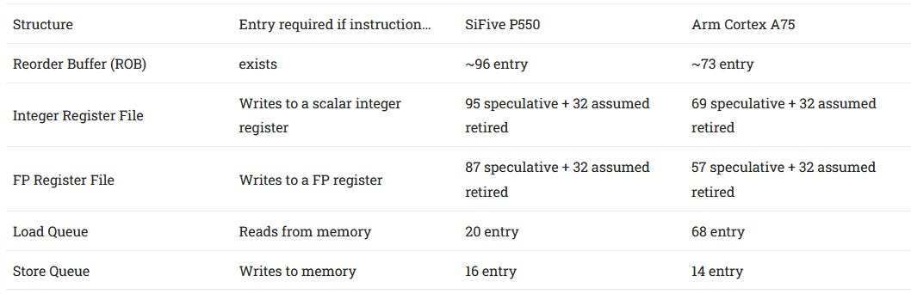

*图 10：P550 的可见容量约为 96 项 ROB、95 个投机整数目的寄存器加 32 个假定已退休寄存器、87+32 个 FP 寄存器、20 项 Load Queue 和 16 项 Store Queue；A75 相应为约 73、69+32、57+32、68 和 14。这些容量均来自微基准反推。A75 总览图把 Load Buffer 写成 69，本表写成 68；物理寄存器很多，也不意味着内存窗口同样宽。*

两颗核心相对各自 ROB 都有较充足的物理寄存器，但内存次序队列偏薄；总体窗口远小于当代 Intel、AMD 大核和更晚的 Cortex-A710，更接近 Core 2 或 Goldmont Plus。即使如此，它们仍比顺序执行更有能力越过短时停顿。

重命名通过把架构寄存器映射到物理寄存器，消除 WAR/WAW 假依赖；ROB 则保持程序顺序、完成状态和异常信息，使乱序完成的指令最终形成精确架构状态。ROB 满、物理寄存器耗尽、调度器或 Load/Store Queue 满，都会停止重命名。分支错判和异常还要求撤销年轻指令占用的资源，并恢复正确的寄存器映射。

现有结果可以确认 P550 存在重命名与乱序执行，但不足以区分逐分支映射 checkpoint、历史缓冲回滚或混合恢复方案。

### 整数、FP 与调度资源

端口冲突测试显示，P550 有三条整数执行路径：第一条可执行 ALU 和分支，第二条为普通 ALU，第三条可执行 ALU 与整数乘法。由容量拐点估计，对应的调度容量约为 16、约 8 和 16 项。Load 与 Store 各自还有约 18 项调度容量；较深的等待队列可以吸收短时读写比例不均，却不能改变每周期只有一条 Load AGU 的峰值。

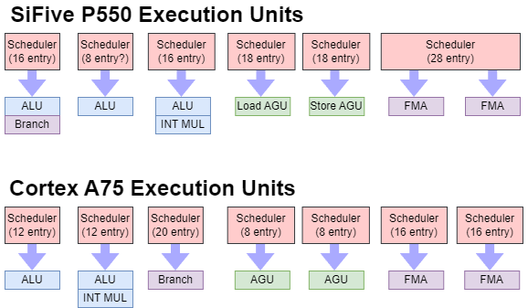

*图 11：P550 用三条较灵活的整数路径和独立 Load/Store AGU，A75 则用两条 ALU、独立分支端口和两条可同时处理 Load/Store 的 AGU。方框中的容量来自微基准；P550 第二整数调度器的 8 项带问号，FP 的 28 项也无法区分统一双端口队列与两个 14 项队列。*

在 Chester Lam 看来，P550 的整数端口可达性更灵活，调度容量也更多；A75 的独立分支端口不需要整数寄存器写回路径，可能以更低成本获得接近的标量整数性能。这是对设计取舍的判断，并非面积测量。

P550 的两条 FP 路径都能处理加法、乘法与融合乘加（Fused Multiply-Add，FMA），这三类操作的实测延迟均为 4 周期。这让复用 FMA 单元成为一种合理猜测：加法可视为乘数为 1 的 FMA，乘法可视为加数为 0 的 FMA。不过，相同延迟也可能来自其他共享或旁路设计，尚不足以锁定物理结构。

A75 的 FP 加法与乘法为 3 周期，FMA 为 5 周期，可能使用分离单元，也可能只是在共享单元中设计了更短旁路。A75 还支持 128 位 NEON 向量执行，而 P550 没有向量能力。微基准测得 A75 约有 31 项 FP 调度容量，与 AnandTech 给出的两个 8 项调度器并不一致；P550 则约为 28 项。

### 窗口大小必须和指令可达端口一起看

ROB 决定核心能“看到”多远，调度器决定哪些已看到的指令能够等待并竞争端口，物理寄存器保存投机结果，Load/Store Queue 则维持内存次序。只扩 ROB 而不扩更早耗尽的队列，并不能得到同等比例的延迟容忍度。

端口数量也不等于吞吐。指令只能进入兼容的调度器和执行路径；操作数未就绪、端口忙、寄存器读或回写冲突都会延后发射。4 周期 FMA 是依赖链延迟，不代表吞吐一定是每 4 周期一条；只有把依赖链测试与多条独立链分开，才能判断管线是否可以逐周期接收新操作。

计数器和 RTL 可以进一步区分这些瓶颈。若 ROB、空闲物理寄存器表（free-list）或 LSQ 的满（full）周期先升高，说明窗口被最早耗尽的资源卡住；若大量指令已经就绪却仍未发射（ready-but-not-issued），问题更可能落在端口可达性或执行资源。分支恢复还必须保证错误路径的物理寄存器和队列项只释放一次，迟到写回也不能污染新映射。

## 五、Load/Store、TLB 与未对齐慢路径

端口冲突测试呈现出两条可区分的地址生成路径（Address Generation Unit，AGU）：一条只处理 Load，另一条只处理 Store；两者后面都约有 18 项调度容量。A75 的两条 AGU 都能处理 Load 或 Store，对以 Load 为主的常见工作负载更灵活。

David B. Papworth 在 *Tuning the Pentium Pro Microarchitecture* 中记录过一个相似取舍：Intel 观察到两条 Load/Store 端口的平均利用率都只有约 20%，改成一条专用 Load 和一条专用 Store 后，性能损失不到 1%。这段历史说明，专用端口可能以很小的平均性能代价节省面积和复杂度；它提供的是设计参照，并不是 SiFive 采用同一分析过程的直接证据。

### 两级 TLB

TLB 微基准呈现出如下组织：一级数据 TLB（DTLB）和指令 TLB（ITLB）各约 32 项、全相联，统一二级 TLB 则约为 512 项、4 路组相联。数据访问在 L2 TLB 命中时，相对 L1 TLB 命中多约 9 周期。

A75 的 DTLB 为 48 项、ITLB 为 32 项。它的 Main TLB 对 4/16/64 KB 页为 1024 项、4 路，对 1/2/16/32/512 MB 与 1 GB 页为 256 项、2 路；命中这一级的附加代价约为 5～6 周期。这些容量和延迟仍是微基准所见，而不是阵列参数披露。

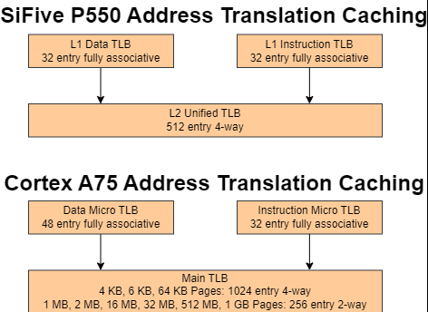

*图 12：P550 的两个 32 项一级 TLB 共享 512 项、4 路 L2 TLB。A75 Main TLB 按页面组分成 1024 项/4 路与 256 项/2 路两种容量。P550 总览图中的“约 256 项？”与本图的 512 项冲突；下文以详细测试的 512 项为主，总览图中的数字仍视作未确定值。*

以 4 KB 页粗略计算，32 项一级 TLB 的覆盖范围只有约 128 KB，512 项 L2 TLB 约覆盖 2 MB；大页可以显著增加 TLB reach。实际命中率还受页大小、ASID、替换、统一 L2 中指令与数据竞争以及页表遍历并发度影响。

### Store forwarding 与非对齐访问

在访问 Cache 之前，年轻 Load 必须与更老的 Store 做地址依赖检查。在这组 Store forwarding 测试中，只有 Load 与 Store 地址完全相同、而且两次访问都自然对齐时，才观察到快速转发。部分重叠、跨自然边界等情况会显著增加复杂度。

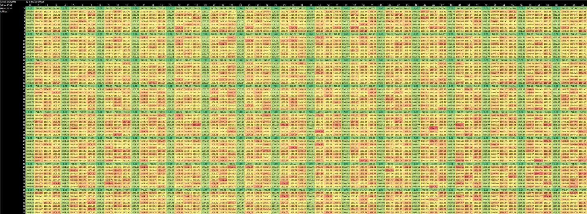

*图 13：列扫描 32-bit Load Offset 0～63，行扫描 64-bit Store Offset 0～63，单元格给出周期数。图中可见约 1～7、约 741、约 1062 和约 1803～1804 的周期性区域；各区域的具体成因仍需结合测试说明理解。*

测试文字给出的结果是：单个未对齐 Load 约需 1062 周期，未对齐 Store 约需 741 周期，两者组合超过 1800 周期，而且几乎不能重叠。硬件计数器还显示，每执行一条未对齐 Load，会产生约 505 条执行指令。

这里有一处无法忽略的图文矛盾：按图 13 的轴标签读取，Store 保持自然对齐而只改变 Load Offset 的区域更接近约 741 周期；Load 对齐而只改变 Store Offset 的区域更接近约 1062 周期，恰好与测试文字对 Load/Store 的 1062/741 归属相反。

网页没有说明问题出在轴标、测试定义还是文字归属，因此不宜强行选择一种口径。两边能够共同确认的是：单侧未对齐分别进入约 741 与 1062 周期慢路，两侧未对齐合计约 1800 周期。

上千周期的代价和额外指令数，让“触发异常、再由操作系统处理程序模拟”成为最符合现象的解释，也意味着 P550 很可能没有硬件未对齐访问快路。不过，内核实现、固件路径和计数器口径都可能影响结果，目前仍没有 RTL 或处理程序路径佐证。

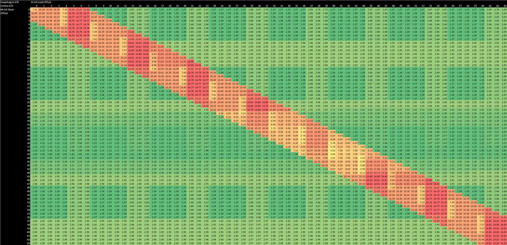

*图 14：Snapdragon 670/Cortex-A75 上的同类测试，同样以列表示 32-bit Load Offset、行表示 64-bit Store Offset，并扫描 0～63。多数快区约为 1～3 周期，较慢条带约为 5～15 周期；测试说明将相依且两侧均未对齐的最差情况归纳为约 15 周期。*

### 慢路径同样定义一颗处理器的成熟度

未对齐访问可以在 LSU 内拆成两个对齐拍（beat）再合并，也可以产生地址未对齐异常（address-misaligned exception），由执行环境保存上下文、读取或写入若干字节、更新目标寄存器和 PC，再返回原程序。后一种方案节省硬件，却把一次普通内存操作变成异常入口、软件模拟和异常返回的串行链。

这类取舍对平均负载可能影响很小，但紧凑布局（packed）数据结构、网络协议解析、JIT 代码或 ABI 使用不当会遭遇数量级退化。跨页 Store 还需要明确测试部分写入与非原子语义：RISC-V 允许执行环境决定未对齐访问的支持方式与异常行为，即使访问成功也未必具有原子性。

只有执行环境或软件模拟明确承诺全有或全无（all-or-nothing）时，处理程序才必须在写入前完成两页验证。因此，慢路径不仅是性能问题，也牵涉精确异常与执行环境契约。

怎样判断这条慢路落在硬件还是软件？最直接的办法是逐一扫描访问宽度、偏移、同页/跨页和依赖距离，再对照 `cycle`、`instret`、陷入（trap）次数与异常原因。

若能观察 RTL，还可以沿对齐检测、异常 `cause/tval` 和 ROB 精确陷入追踪整条路径，确认陷入前没有产生架构不允许且不可回滚的 Store 副作用。Cache 内部请求、所有权获取或分配本身并不等于架构可见写入。P550 没有公开专用 PMU 事件编码，因此从上述体系结构可见计数和异常状态入手更稳妥。

## 六、核心私有 Cache：小窗口更依赖命中延迟

P550 没有向量能力，乱序窗口也不大，其目标负载和单核结构通常不会要求与宽向量大核相同的峰值存储吞吐；但它更难用大量独立工作隐藏 miss，Cache 命中延迟反而格外重要。公开资料显示，数据侧各级 Cache 都有 ECC 保护。

P550 的 32 KB L1D 为 4 路组相联，命中延迟约 3 周期。在没有对齐问题时，它每周期可以服务一条 64 位 Load 和一条 64 位 Store，读写各 8 B/cycle，均衡读写的合计峰值为 16 B/cycle。

私有 L2 为 256 KB、8 路组相联、双 bank，命中延迟约 13 周期，读写带宽都约 8 B/cycle。这个容量与延迟不算激进，但能在相当一部分 L1 miss 到达共享 L3 之前将其截住。

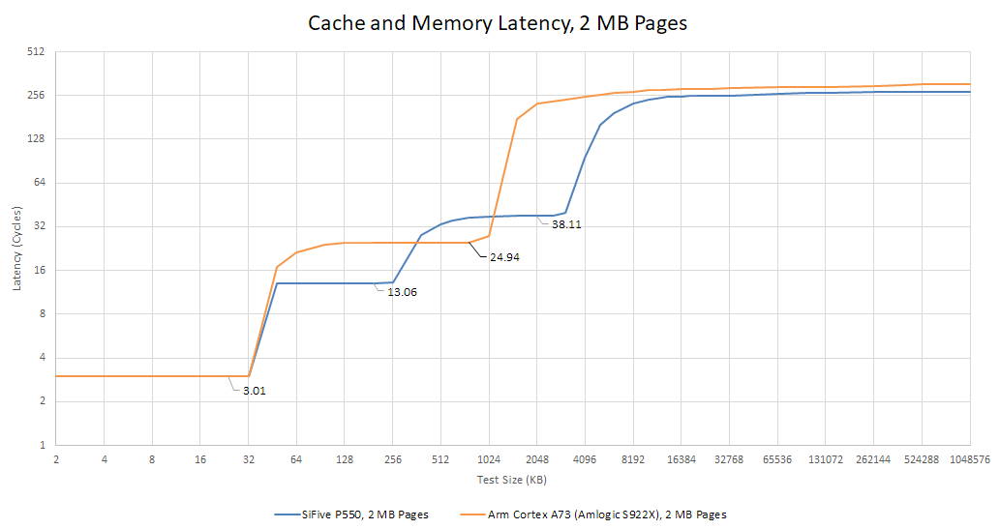

*图 15：英文图注说明“使用 A73 对比，因为我无法在 Android 上使用大页”。测试使用 2 MB 页；P550 的台阶约为 L1D 3.01 cycle、L2 13.06 cycle、L3 38.11 cycle；Amlogic S922X 中 Cortex-A73 的 L1 约 3 cycle、1 MB L2 约 24.94 cycle。*

图 15 还展示一种不同的层次取舍：A73 用 1 MB L2 同时承担 L1 后的低层 Cache 和末级 Cache，容量小于 EIC7700X 的 4 MB L3，但约 25 周期延迟更低；P550 则有 256 KB 私有 L2 加容量更大的共享 L3。

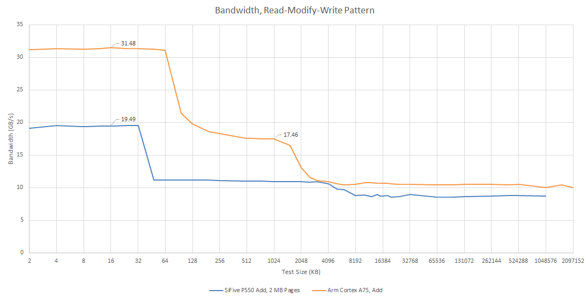

*图 16：纵轴为 GB/s，横轴为工作集。P550 在 L1 区间约 19.49 GB/s，A75 约 31.48 GB/s；A75 的下一层仍可见约 17.46 GB/s，而 P550 进入 L2 后约为 11 GB/s，随后向 L3 带宽收敛。P550 图例明确使用 2 MB 页，A75 图例未标页大小；绝对 GB/s 还同时包含 1.4 与 2.0 GHz 的频率差。*

从这组测试看，A75 在每周期带宽和频率上都更高，因此各级 Cache 的绝对带宽领先 P550。不过，对单 Load AGU、无向量的低频 P550，8 B/cycle L2 仍可能满足目标负载。

### 延迟、带宽与并发 miss 必须一起看

Cache 延迟描述一条依赖链多久拿到数据；带宽描述稳定流量能通过多少；并发 miss 数则决定处理器能否用内存级并行（Memory-Level Parallelism，MLP）把长延迟转化为吞吐。约 96 项可见 ROB 和 20 项 Load Queue 会限制核心能够同时保留的独立内存工作，单 Load AGU 则限制地址请求的生成吞吐；未公开数量的 MSHR 和页表遍历槽位还可能进一步限制实际 MLP。因此，低延迟 L1/L2 对 P550 尤其重要。

资源满时，MSHR、回写队列、bank 或 refill 端口都可能反压 LSU；最老 Load 未完成又会阻塞退休，最终填满 ROB。计数器若显示 MSHR 或 bank 满周期先上升，就能把“Cache 慢”进一步定位为并发槽位或端口冲突。只看峰值 GB/s，看不到依赖负载的停顿，也看不到系统饱和后的排队。

## 七、共享 L3、互连与 DRAM：从核心 IP 走向 SoC 实现

P550 最多以四核组成一个 cluster，多个 cluster 可以接入 Coherent System Fabric。结合 EIC7700X 数据表和微基准曲线，一种可能的组织方式是用 crossbar 连接各端口，并让单个 cluster 共享一个外部接口；这仍是结构反推。

SiFive 提供 1、2、4 和 8 MB 的 L3 配置。最大的 8 MB 版本有 8 个 bank，用于多 cluster 方案；EIC7700X 采用 4 MB、4 bank，bank 数与四个核心一致。

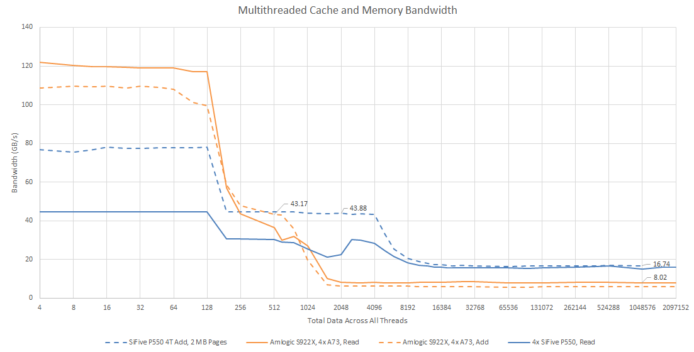

*图 17：该图跨越私有 L1/L2、共享 L3 与 DRAM。四线程 P550 的 Add 曲线在共享 L3 区间标出约 43.88 GB/s，远端 P550 曲线标出 16.74 GB/s；Amlogic S922X 的 A73 read 远端标注约 8.02 GB/s。测试没有定义 Add 带宽是否同时计入读写流量，因此不同访问模式不能直接换算成端口宽度。*

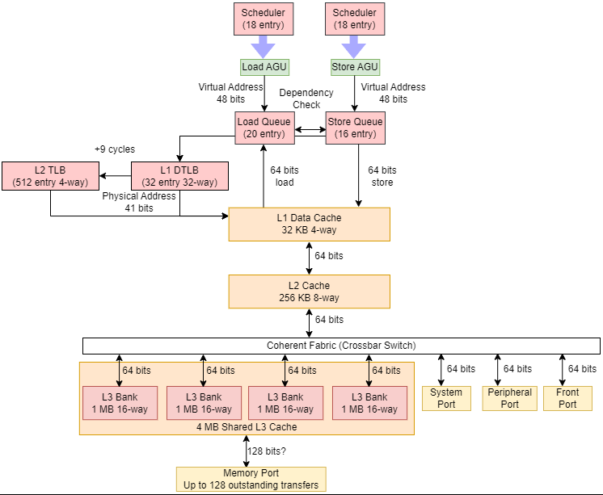

*图 18：英文图注写道“很可能每个 cluster 只有一个 32 B/cycle（256-bit）接口连接 crossbar”。图中还标出 48-bit 虚拟地址、41-bit 物理地址、20/16 项 Load/Store Queue、512 项 L2 TLB、32 KB L1D、256 KB L2、四个 1 MB/16 路 L3 bank 及各类外部端口；128 位 Memory Port 同样带问号。这些位宽与容量来自资料整理和微基准反推，并非 RTL 确认。*

微基准测得单核 L3 带宽约为 8 B/cycle，四核合计约 43.88 GB/s；L3 延迟约为 38 周期，对一套可配置、可共享的缓存来说并不差。

用 1.4 GHz 粗略换算，`4 × 8 B/cycle × 1.4 GHz = 44.8 GB/s`，与图中的 43.88 GB/s 在算术上接近。但 Add 的读写流量口径没有定义，仅凭这个等式还不能确认物理接口已经饱和。

L3 miss 进入 Memory Port。公开资料允许一到两个 128 或 256 位 Memory Port，每个最多跟踪 128 个未完成请求；非 Cache 或 I/O 请求可以进入两个 64 位 System Port 或一个 64 位 Peripheral Port；一到两个 Front Port 则允许其他代理以一致方式接入该复合体。

从 EIC7700X 的框图看，它可能只选择了一个 128 位 Memory Port，并使用两个 System Port。第一个 System Port 覆盖 256 MB PCIe BAR、PCIe 配置空间和 4 MB ROM；第二个可访问 DSP SRAM 等资源。这仍是基于公开连线关系的推测。

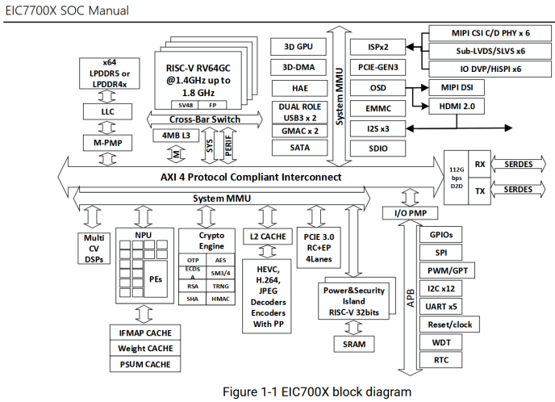

*图 19：手册页眉处于 EIC7700X 语境，图底小字却写作“EIC700X block diagram”。图内展示四核 RV64GC cluster、4 MB L3、crossbar、AXI4 互连，以及 GPU、NPU、DSP、PCIe 和多媒体模块，并标出 CPU 最高可到 1.8 GHz；这次测试的配置为 1.4 GHz。*

这些端口继续连接采用 AXI 协议的片上网络。走到这里，性能已经强烈取决于 SoC 实现者，而不再只由 SiFive 核心 IP 决定。Eswin 配置了两个 DDR 控制器，每个带两个 16 位子通道；开发板连接 16 GB LPDDR5-6400。内存控制器运行在 SDRAM 时钟的四分之一，即约 800 MHz。

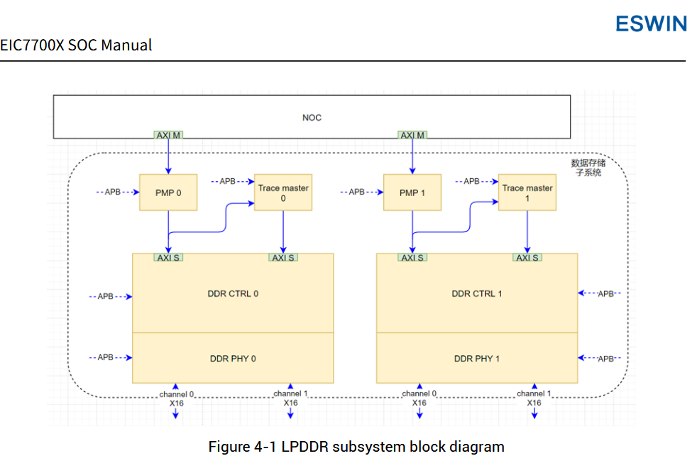

*图 20：EIC7700X 手册显示两个 DDR Controller/PHY，各连接两个 x16 子通道，并通过 NoC 接入。总线拓扑提供了 64 位原始数据宽度，但 inline ECC、控制器调度、NoC 排队和其他主设备竞争都会降低可用带宽。*

开发板的 DRAM load-to-use 延迟约为 194 ns，比 L3 多出约 165 ns。现有测试无法区分其中多少来自片上网络，多少来自内存控制器。Chester Lam 将它与 Meteor Lake 和 AMD Van Gogh（Steam Deck SoC）等 LPDDR5 平台作了定性对照，认为延迟明显偏高；由于方法和配置并不统一，这不是严格的横向排名。

DRAM 实测带宽为 16.74 GB/s，明显低于 64 位 LPDDR5-6400 的理论值。inline ECC 会占用一部分位宽，却不足以解释全部差距。Chester Lam 同时认为，对四个 1.4 GHz、没有向量单元的低功耗核心，这一带宽在许多场景中仍可能够用。

### 可授权核心必须与 SoC 边界一起评价

一次 LLC miss 会穿过 cluster 出口、共享 fabric、Memory Port、NoC、DDR 控制器、PHY 和 DRAM。194 ns 在 1.4 GHz 下约为 272 个周期。对一条真正依赖该 Load 的指令链，乱序窗口并不能消除这段延迟；即使程序中存在独立工作，约 96 项可见窗口也很难覆盖如此长的往返。预取、多个独立 miss 和足够的在途请求槽位可以提高持续吞吐，却不会把单次 load-to-use 延迟本身变短。

因此，“P550 的内存延迟”并不是严谨表述。分支预测、ROB 和执行端口更接近核心属性；L3、DRAM 与核间传输则是 P550 IP、EIC7700X 片上互连、内存控制器、板级布局和软件状态的共同结果。只有在增加 outstanding 请求数时，同时观察到 AXI `valid/ready` 反压、队列占用和 DDR 排队上升，才有理由把瓶颈进一步定位到 SoC 互连或内存控制器。

## 八、核间传输：目录能扩展，不代表单次转移一定快

EIC7700X 数据表称其存储系统包含“基于目录的一致性管理器”。目录记录 Cache line 的共享者或所有者，使请求只向相关核心发送 probe；相对广播，它能在核心数增加时控制探测流量。

Chester Lam 自编了一组 core-to-core latency 测试，用来记录一个核心多久能观察到另一个核心的写入。具体方法没有公开，而且与 AnandTech 等站点的测试并不完全相同，因此两边的结果只能作大致对照。

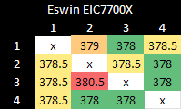

*图 21：四个 P550 核之间的方向性矩阵集中在约 378～380.5，各组合没有明显的近邻/远端层级。图中没有打印单位；结合上下文与对照量级，通常可按 ns 理解，但这只能视作上下文推定。矩阵也不能外推到所有 P550 cluster。*

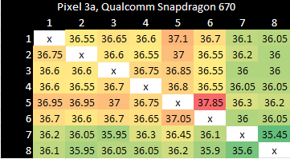

*图 22：Pixel 3a/Snapdragon 670 的八核矩阵约为 35.45～37.85，同样受单位未标注的限制，也没有给出 CPU 编号与 A75/A55 的对应关系。测试分析认为 A75 与 A55 之间的传输也更快；由于方法、频率、Cache 和一致性实现不同，数量级差距无法精确定位到某一级。*

Chester Lam 认为，这样的核间延迟未必会明显影响一般应用，却让 P550 平台显得“不够精致”。

### 核间延迟的影响取决于共享粒度

对相互独立的线程，核间所有权转移（ownership transfer）很少发生，图中约 380 的高延迟可能并不进入关键路径；但锁、无锁队列、任务唤醒、原子操作和伪共享（false sharing）会反复转移同一 Cache line 的所有权。此时，目录查询、一致性探测（probe）、失效、脏数据回传和权限迁移中的若干阶段会落到同步操作的关键路径上，核间往返因而可能直接限制多线程扩展性。

核间延迟是否会变成应用瓶颈，取决于共享方式。若写入往返（ping-pong）的延迟很高，同时伴随 probe、目录 retry 和片上互连排队上升，才有理由把问题指向一致性路径；只读共享、不同 Cache line 或相互独立的线程则可能几乎不受影响。一张核间延迟矩阵无法替代这些区分。

## 九、总结：基础链路已经建立，边角仍显粗糙

Chester Lam 给 P550 的定位很清楚：它要在严格的功耗和面积约束下取得尽可能高的性能，而不是正面对抗 Zen 5、Lion Cove 或 Oryon。它的乱序引擎规模更接近早期 Core 2，频率又显著更低，因此更像一颗低功耗、性能适中的核心，适合承担顺序核略显吃力的轻量管理任务。这是由一系列微基准形成的产品判断，不能据此给适用场景下定论。

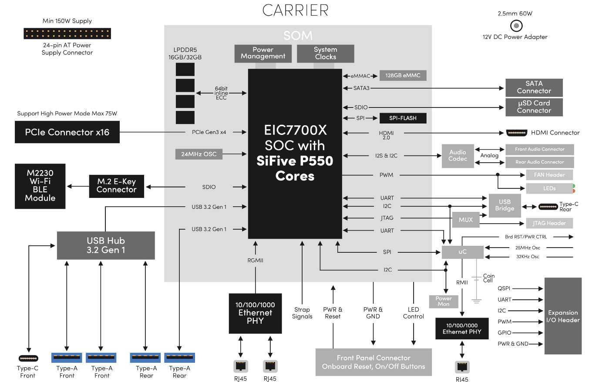

*图 23：开发板数据表中的系统框图列出 16/32 GB LPDDR5 与 64-bit inline ECC；这次测试使用的是 16 GB 配置。PCIe、网络、USB、SATA、音频和扩展接口说明 P550 最终以完整平台交付，但这些系统资源不是 P550 核心内部参数。*

相比横向排名，这篇分析更看重 P550 的演进意义。SiFive 不久前还主要聚焦微控制器所需的小型顺序核，而 P550 已经建立起一套相对均衡的乱序引擎和 Cache 层次。高性能通用处理器很难绕开乱序执行：Intel 与 IBM 都曾因复杂度尝试在 Itanium、POWER6 上走向不同路线，最终仍说明从动态执行中提取指令级并行极其重要。

不过，P550 仍只是中间一步。与 Cortex-A75 相比，它更像 Arm 较早期的 Cortex-A57：时钟较低、未对齐访问代价异常高、缺少向量支持，很多边角路径尚未打磨。A75 推出时，Arm 已积累多年乱序核心经验，因此整体更完整。另一方面，最坏慢路并非所有程序都会触发，不能用这些极端微基准否定全部常见工作负载。

因此，文章最后把 P550 类比为 Intel 的 Pentium Pro。Pentium Pro 在 16 位代码等场景中表现不佳，却让 Intel 建立了继续设计更复杂乱序核心的信心。SiFive 后续已经公布 P870 等更复杂方案；从这个角度看，P550 已经形成较均衡的乱序引擎和称职的 Cache 层次，为后续核心积累了基础。

## 十、从 P550 可以看到的六件事

结合这组测试和前面的机制分析，还可以归纳出六点设计认识。它们不是 Chester Lam 逐条列出的结论；其中带“约”的容量和端口组织，仍以微基准反推为限。

**1. 高性能不会由 ISA 自动产生。** RISC-V 定义软件与硬件的接口；分支目标能否及时交付、错误路径能否可靠恢复、依赖 Load 能否尽早唤醒、Cache 与互连能否持续供数，才决定 P550 的有效 IPC。P550 的进步在于这些基础链路已经形成系统，而不是 ISA 本身天然带来性能。

**2. 均衡比单项数字更重要。** 三宽译码、微基准所见约 96 项 ROB、反推的单 Load/单 Store AGU、约 8 B/cycle L2 和没有向量单元，大体指向同一面积、功耗与标量负载定位。对低频标量负载，这可能比孤立堆大 ROB 或宽 Cache 更合理；判断设计是否均衡，应看最常遇到的瓶颈是否落在预期位置。

**3. 乱序窗口由最先形成约束的资源决定。** 约 96 项可见 ROB 最显眼，但内存密集代码可能先填满 20 项 Load Queue，单 Load AGU 也可能先达到吞吐上限；数量未公开的页表遍历槽位和 MSHR 还可能施加更早的限制。ROB 是可观察距离，不是保证可行动的容量。

**4. 分支前端不只怕方向猜错，也怕目标来不及。** 按 Chester Lam 的评价，P550 的方向模式识别符合其定位；“约 32 项快速目标容量”则是用来解释更大跳转分支工作集出现约三周期台阶的一种结构推断。方向、BTB、RAS、取指块和恢复链必须共同设计；只报一个分支准确率，会漏掉目标气泡和级联恢复代价。

**5. 处理器成熟度往往藏在慢路径里。** 对齐 L1D 可以每周期一读一写，私有 L2 也与小窗口较匹配；未对齐访问却可能落入上千周期的软件模拟。RAS 溢出、部分重叠转发、跨页访问和异常恢复虽然不常见，却可能把一个角落事件放大为系统级停顿。

**6. 核心和 SoC 必须分开评价。** P550 的私有前后端不能直接解释 EIC7700X 的 194 ns DRAM 或核间矩阵约 380 的高值；后两者还包含片上互连、NoC、控制器、板级和软件影响。对可授权 CPU IP，好的核心接口要允许实现者扩展容量和端口，好的 SoC 则要把这些能力转化为可预测的延迟、带宽和一致性行为。

## 参考资料

1. Chester Lam，*Inside SiFive’s P550 Microarchitecture*：https://chipsandcheese.com/p/inside-sifives-p550-microarchitecture
2. SiFive，*Performance P550 Data Sheet*：https://vyvoj.hw.cz/files/p550-8mc-data-sheet-2022.pdf
3. SiFive / Eswin，*EIC7700X Datasheet*：https://www.sifive.com/document-file/eic7700x-datasheet
4. AnandTech，Cortex-A75/A55 架构分析：https://www.anandtech.com/show/11441/dynamiq-and-arms-new-cpus-cortex-a75-a55/3
5. Berkeley Out-of-Order Machine（BOOM）：https://boom-core.org/
6. RISC-V International，*RISC-V Unprivileged ISA Specification*，Load and Store Instructions：https://docs.riscv.org/reference/isa/v20260120/unpriv/rv32.html#_load_and_store_instructions
