# SC23 上的 SW26010-Pro：峰值算力之外，Sunway 被什么卡住

> **文章来源**
>
> - 文章：*China’s New(ish) SW26010-Pro Supercomputer at SC23*
> - 撰文：Chester Lam
> - 首发：Chips and Cheese
> - 发布：2023 年 11 月 20 日
> - 链接：https://chipsandcheese.com/p/chinas-newish-sw26010-pro-supercomputer-at-sc23

计算能力已经成为国家级基础资源：工程仿真、药物筛选、天气与气候预测都依赖它。SC23 展出的 Sunway SW26010-Pro 约在 2020～2021 年成形，是 TaihuLight 中 SW26010 的放大和现代化版本。文章当时称 TaihuLight 位列 TOP500 第 11，新系统有望仅次于美国 Frontier。

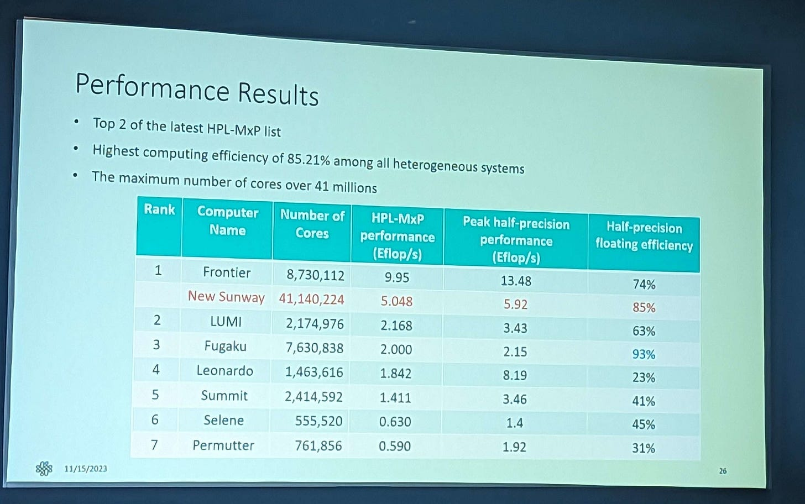

*图 1：排名与系统状态属于 2023 年材料时点，不应当作当前榜单。*

## Chip：六个 Core Group，384 个计算核心

SW26010-Pro 划分为六个 Core Group（CG）。每 CG 有 64 个 Compute Processing Element（CPE），组织为 4×4 Mesh、每个 Mesh Stop 连接四 CPE；一颗 Management Processing Element（MPE）负责通信和启动 CPE Thread。

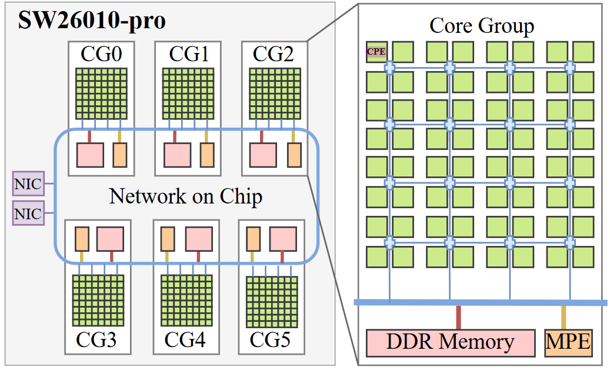

*图 2：来自 Rongfen Lin 等。CPE 与 MPE 是不对称的控制/计算分工。*

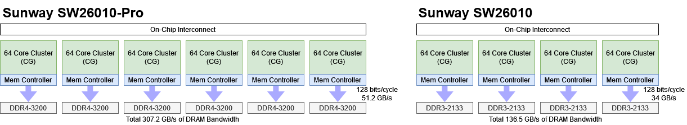

*图 3：相比旧 SW26010 的四组扩大到六组；Cluster 和系统层均无共享 Cache。*

每 CG 独立 DDR4 Controller，依据公开总数推测为双通道 DDR4-3200，六组理论 307.2 GB/s。每组 16 GB、全芯片 96 GB；旧 SW26010 为每组 8 GB DDR3、总计 32 GB。

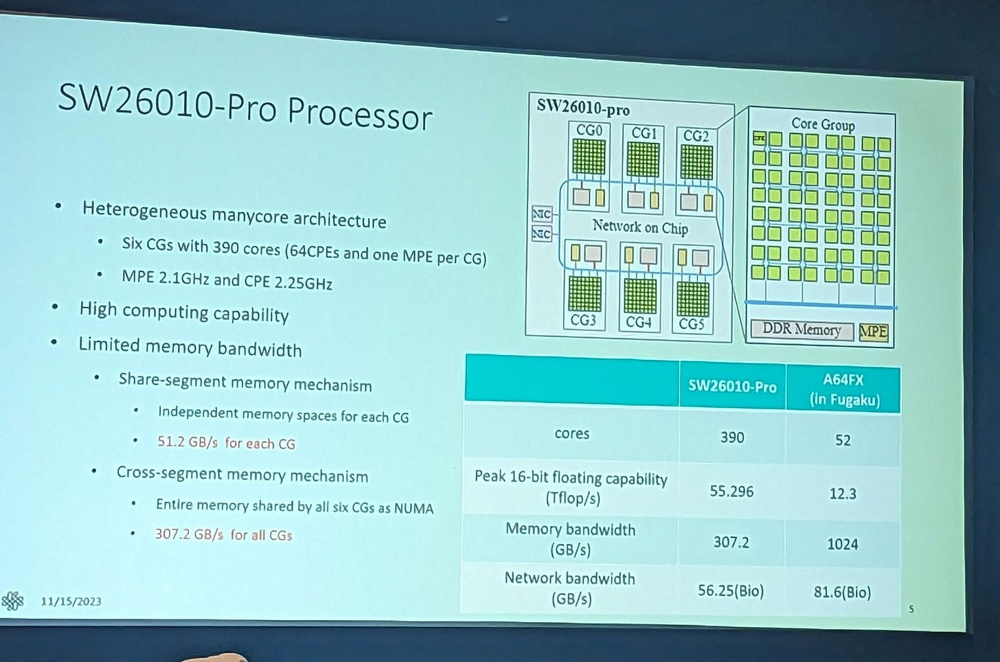

*图 4：双通道 DDR4-3200 是由带宽数字反推，不是本文直接核对的 PHY 配置。*

A64FX 也按 NUMA Cluster 组织并配 Management Core，但每 Cluster 只有较少核心，却共享 8 MB L2；全芯片 L2 可达 3.6 TB/s，HBM2 约 1 TB/s。Frontier/LUMI 使用 MI250X：每 GCD 112 CU 共享 8 MB L2（约 3.7 TB/s），64 GB Pool 一致可见，HBM2E 理论 1.6 TB/s；Zen 3 EPYC+四个 ACE 管理 Wavefront。

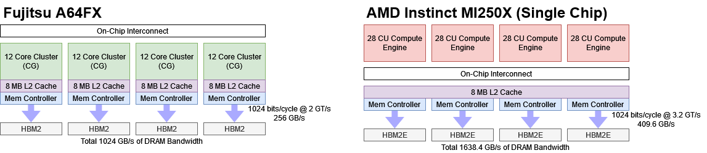

*图 5：对照重点是“执行单元如何被 Cache/HBM 喂饱”，不是 ISA 排名。*

## MPE：用乱序、Cache 与特权态承担不规则控制

旧 CPE 只能 User Mode、无 Interrupt，不能跑 OS；MPE 支持多 Privilege 与 Interrupt，使用 OoO Execution 和基本 Cache，负责 Launch 与 Communication。

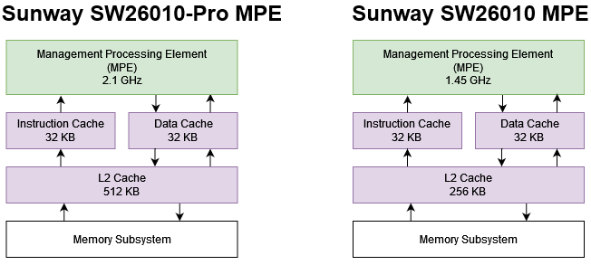

*图 6：Pro 版 MPE 有更大 L2、更高频；是否与 CPE 分 Clock Domain 未确认。旧 MPE 有两条 256-bit FP Pipe，Pro 至少可能相当，但 MPE 只需足够快地分配工作和给 NIC 送数据。*

## CPE：更宽、更快，但依然很难隐藏延迟

旧 CPE 是双 Pipeline、部分乱序：FP 与 Memory 各自 In-order，但两 Pipe 间可相对 OoO；基础 FP Arithmetic 延迟七周期。文章假设 Pro 未改这些参数，需与公开事实分开。

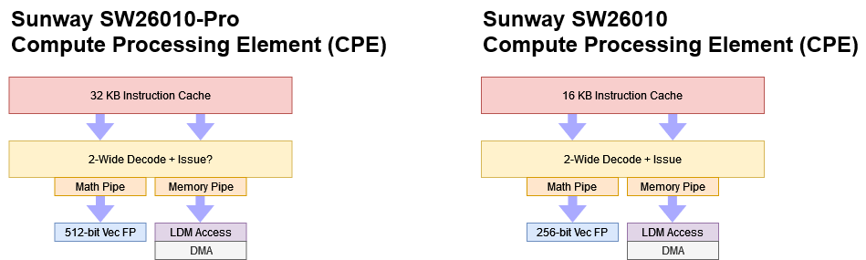

*图 7：Pro 的执行细节并未完整公开。*

Pro 的 I-Cache 从 16 KB 翻到 32 KB。Sunway RISC 指令很可能 16 B，因此旧 16 KB 只够约 1000 条/每迭代，甚至小于现代 x86 Uop Cache 的有效操作容量。

Vector Width 从 256 到 512 bit，频率从 1.45 到 2.25 GHz。

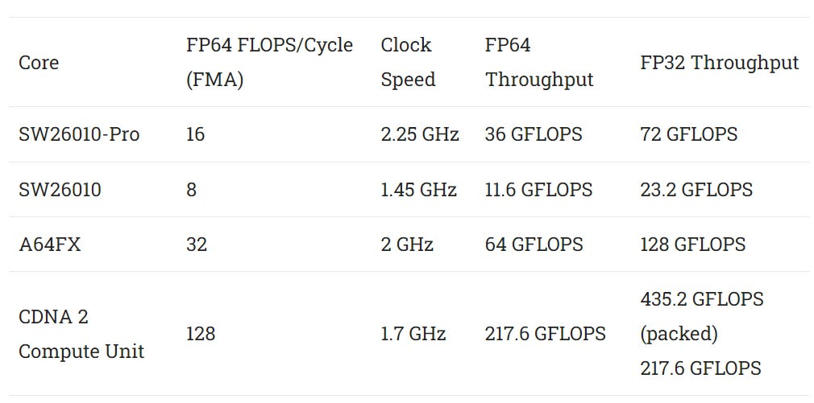

*图 8：更宽与更高频同时提升每核峰值。*

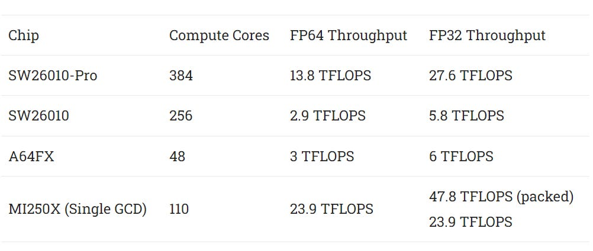

*图 9：核心数、频率、宽度共同使峰值超过四倍；理论上甚至高于 A64FX，关键在供数。*

### 体系结构视角：Roofline 先问每字节有多少 FLOP

Execution Peak 只有在 Arithmetic Intensity 足够高时可达。若 Kernel 每取 1 B 只做少量 FLOP，性能上界是 Memory Bandwidth×FLOP/B；再多 FMA 只让屋顶更高，不改变斜坡。Queue、OoO 与 SMT 可隐藏延迟，却不能创造 DRAM 带宽。

## Scratchpad 256 KB，仍没有真正的 Cache Hierarchy

旧 CPE 无 Data Cache，每核只有 64 KB Software-managed Scratchpad，四周期、32 B/cycle；超出后用 DMA 搬主存，类似 Cell。

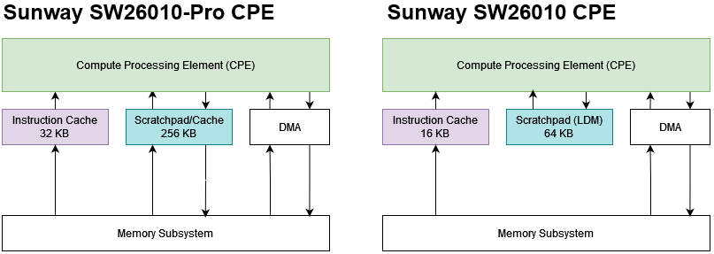

*图 10：软件模拟 Cache 的细节很少，不能按硬件 Cache 的 Hit/Miss 自动机制理解。*

Pro 把 Scratchpad 增到 256 KB，其中最多一半可配为 Cache，类似 Nvidia 可分配 Shared Memory/L1。比 64 KB 好，但 A64FX 的 64 KB Private L1+每组8 MB L2，以及 CDNA2 的 16 KB L1+全 Die 8 MB L2，都能用 Multi-MB Cache 大幅截住 DRAM。

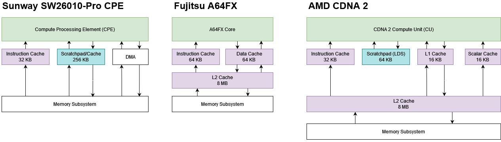

*图 11：Sunway 缺失共享 L2 是系统性差异。*

## DRAM：0.11 B/FP32 FLOP

研究表明多数 HPC Kernel 每访问一字节只做 16 FLOP 或更少，旧 SW26010 已极度 Memory-bound。

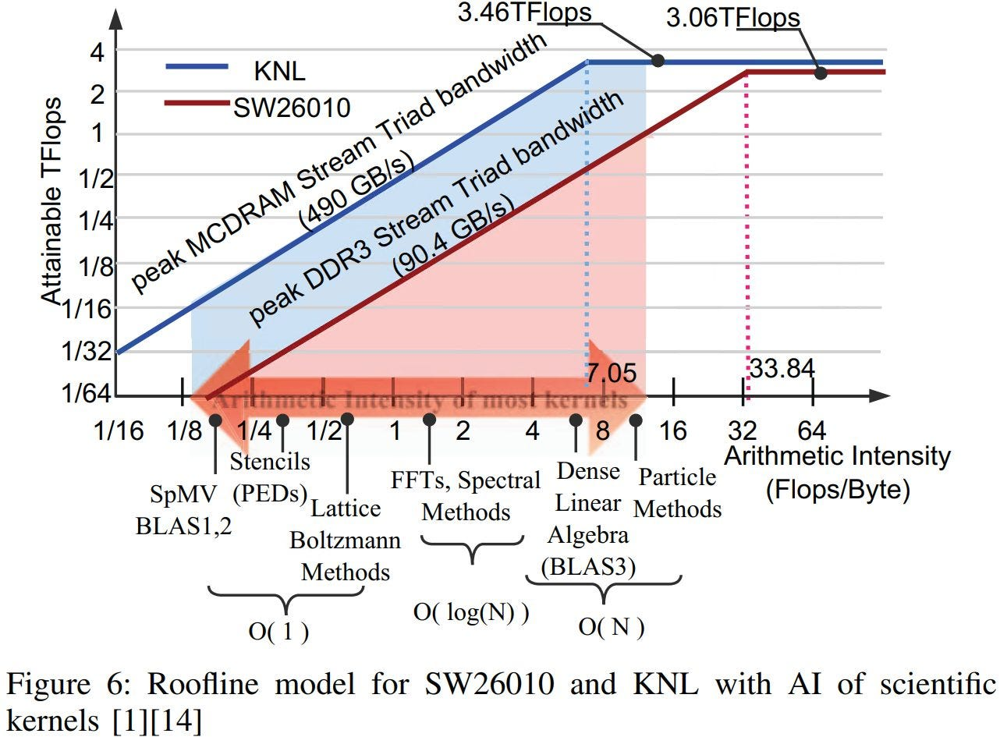

*图 12：来自《Benchmarking SW26010 Many-core Processor》。*

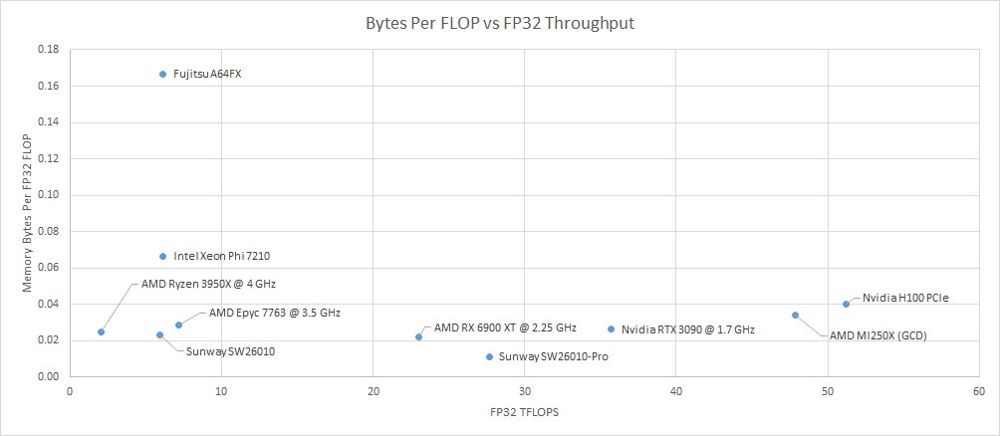

*图 13：3950X/EPYC 7763 按 DDR4-3200、全 Channel 填满估算。旧 Sunway 已弱，Pro 又让算力增长远快于带宽。*

每 CG 从 128-bit DDR3-2133 到 DDR4-3200，最终只有约 0.11 B/FP32 FLOP，是 RX 6900 XT 的一半。后者还是廉价 GDDR 配置的 Consumer GPU，并依靠 128 MB Infinity Cache；Sunway 同等以上算力、较低带宽且无 LLC。每个 64-CPE Cluster 配的 Memory 规格只相当于上一代双通道桌面。

## Network：接口不差，喂 NIC 仍要抢那 51.2 GB/s

普通 Datacenter Ethernet 常为 40/100 Gbps（5/12.5 GB/s），Supercomputer Network 高一个数量级。

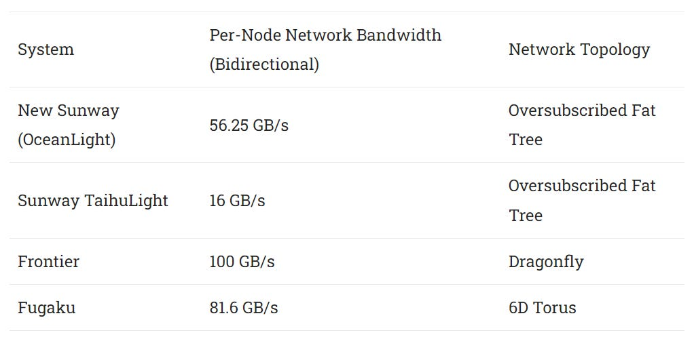

*图 14：SW26010-Pro 纸面接近 Fugaku/Frontier，但本地内存成为喂网络的瓶颈。*

最初 HPL-MxP 每 CG 一 MPI Process，能用 Local Controller；可 Compute 与 Network 必须 Overlap，每 CG 只有 51.2 GB/s，MPE Cache 也不够，双方争抢导致 NIC 利用很差。

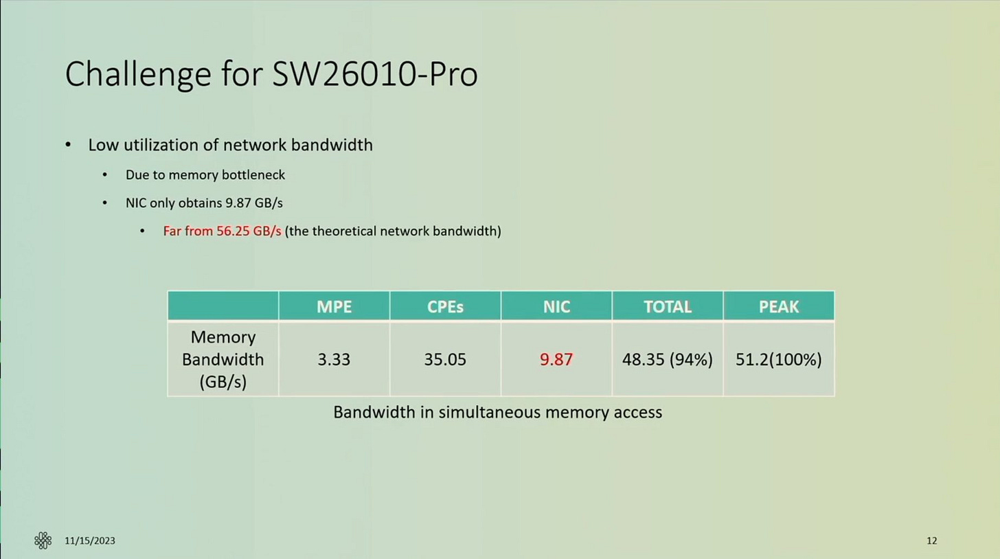

*图 15：Rongfen Lin 等后来改成单 MPI Process，把 Block 切为 512 B Sub-block，跨六 NUMA Node 伪分布，才利用总 307 GB/s并避免 Partition Camping。*

Fugaku 每 Partition 256 GB/s；Frontier 单 MI250X GCD 1.6 TB/s，100 GB/s NIC 只是小比例。Sunway 因而把硬件带宽不足转成额外程序开发成本。

## 107,136 颗芯片如何互连

整机共有 41,140,224 CPE，即 107,136 Chip。

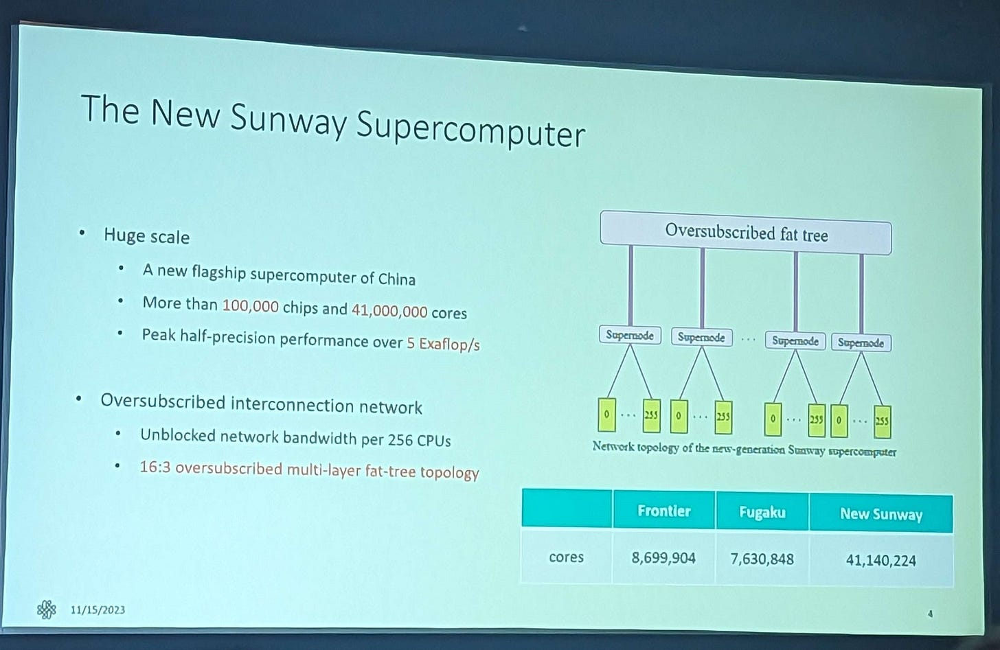

*图 16：每 Chip 是独立 Network Node。*

256 Node 接一个 Fast Switch，组成 Supernode，一级宣称 Unblocked；每 Supernode 再用 48 Port 接全局网络。

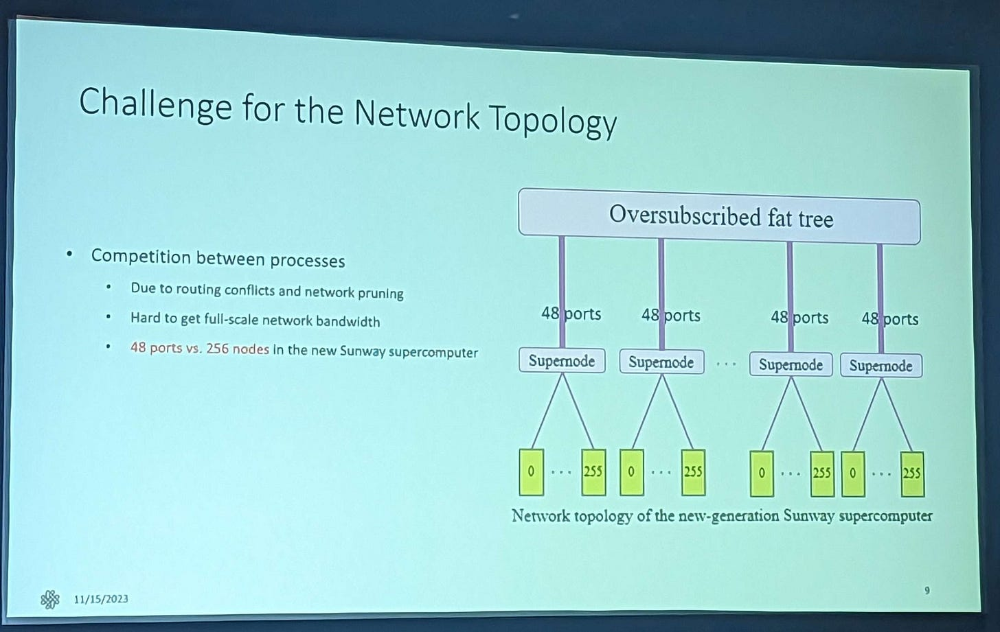

*图 17：局部高带宽、全局收敛。*

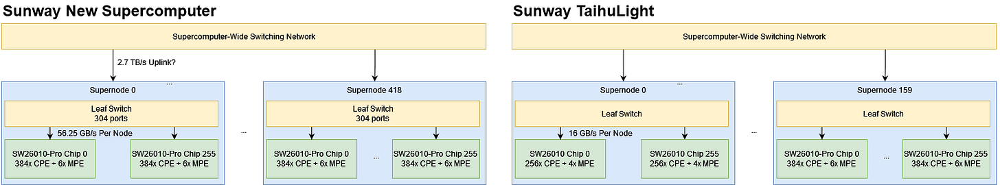

*图 18：若 Leaf Port 都为 56.25 GB/s，Supernode Uplink 为 2.7 TB/s；Link 实际速率与中心拓扑没有公开，属于假设。*

TaihuLight 据称 Bisection 70 TB/s、Diameter 7，说明 Supernode 间并非全等 Unblocked；三层 Tree 类似 Summit。

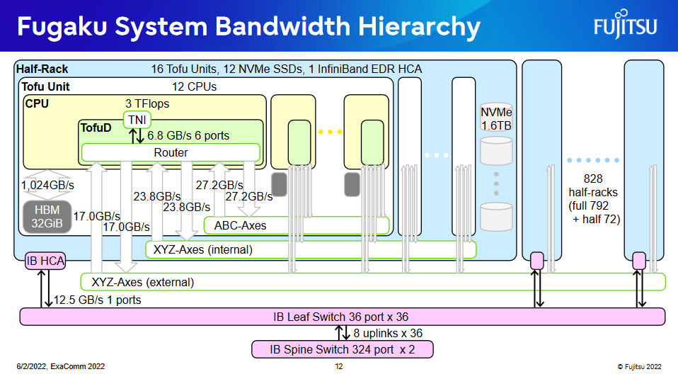

*图 19：大问题应尽量压在少数 Supernode，减少全局瓶颈。*

Fugaku 用 6D Torus，六个 Port 对应不同层级，距离增大时带宽渐降。

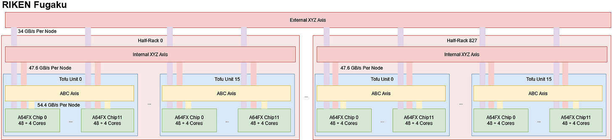

*图 20：每 Node 到最高层轴仍约 34 GB/s；Sunway 若所有 Node 均分全局出口约 10.54 GB/s，不到三分之一。*

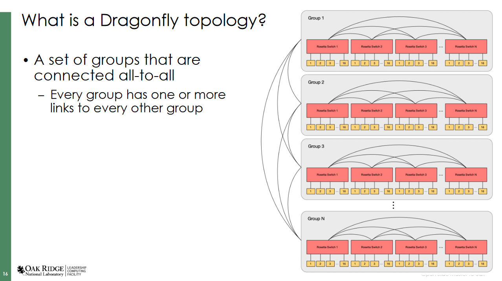

*图 21：三 Hop Dragonfly，各级 Switch Group Fully Connected；文章未找到每 Switch Uplink。*

## 结语：峰值指标与可用计算力

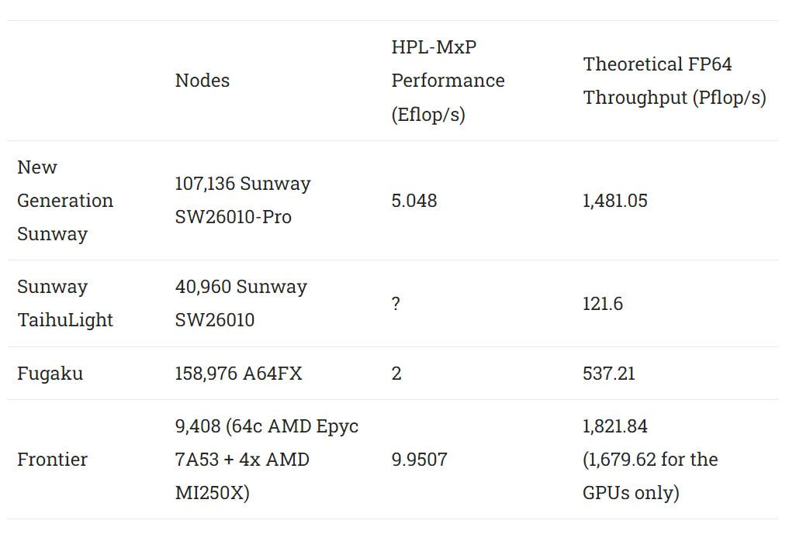

*图 22：Sunway 用更少 Chip 提供很高 FP64 Peak，代价是弱 ILP/TLP、无共享 Cache和低 DRAM/FLOP。*

文章给出强烈批评：每 64 CPE 只有双通道 DDR4-3200不可接受；即使用 DDR5-4800 多 50% 带宽，仍会 Memory-bound，真正平衡应减少执行单元、加入更好 Cache 与 HBM。高 TOP500 Peak/HPL 分数不等于研究者更快解决问题；如果每个 Kernel 都要手工铺 NUMA、安排 DMA 与 Network，人的时间就是 Opportunity Cost。

这部分是材料的观点，不是 Sunway 官方结论。理论 Peak、307.2 GB/s 和拓扑公开数据属于规格；0.11 B/FLOP 是计算；“为榜单设计”和“硬件不好”是价值判断。教学上更一般的结论是，可用性能还取决于 Compiler、Runtime、Memory Hierarchy 与 Programmer Effort，峰值只是上界。

## 参考资料

- Chester Lam, *China’s New(ish) SW26010-Pro Supercomputer at SC23*, Chips and Cheese, 2023-11-20
- Xu、Lin、Matsuoka，*Benchmarking SW26010 Many-core Processor*
- Rongfen Lin 等，*5 ExaFlop/s HPL-MxP Benchmark with Linear Scalability...*
- Jack Dongarra，Sunway TaihuLight 报告；网页所列应用论文
