# Tachyum 重做 Prodigy：更可信，也仍然极其激进

> 英文标题：Tachyum’s Revised Prodigy Architecture
> 撰文：Chester Lam
> 首发：Chips and Cheese，2022 年 8 月 26 日
> 链接：https://chipsandcheese.com/p/tachyums-revised-prodigy-architecture

Tachyum 在 2022 年大幅重做了 2018 年公布的 Prodigy。VLIW Bundle 被传统 ISA 取代，硬件调度和重排序能力增强，缓存层级也重构。新方案宣称最高 128 核、每核 2×1024 bit 向量、5.7 GHz、约 1 TB/s DRAM，顶配功耗 950 W；它比旧版合理得多，但这些目标仍然需要非常强的工程证据。

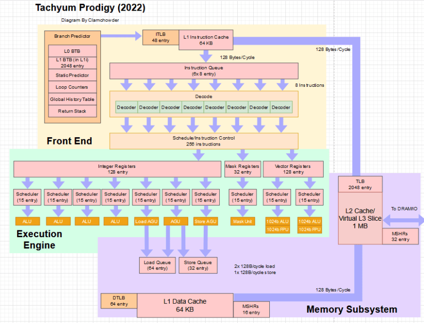

图中出现 12 个调度队列却只有 11 个端口，公开材料本身存在未解释之处。核心数从 64 翻倍到 128，频率目标从 4 提到 5.7 GHz。

## 告别 VLIW Bundle

旧版把硬件实现暴露给 ISA：编译器用 stop bit 标记可并行指令组，从而省掉部分依赖检查。问题是新一代若延迟或端口变化，旧二进制中的 stop bit 就不再合适。客户不能接受每代换 ISA；仅给大型项目增加 Arm 支持就可能耗时 18 个月，Prodigy 更不能重复支付迁移成本。

新版使用 4 B 或 8 B 指令，不再携带 stop bit，改由硬件检查依赖。它仍宣称每周期持续八条指令。Tachyum 表示整数代码从四宽扩到八宽仅提升约 7%～8%，但 AI/HPC 循环可能每轮含两条向量、两条 Load、计数器增量和条件分支，八宽可争取一拍完成一轮。

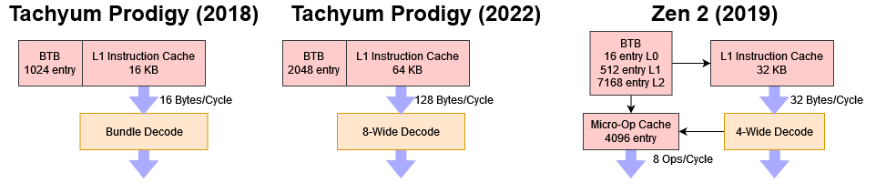

## 128 B/cycle 取指与简化预测

L1I 每周期可取 128 B，远超八条最长 8 B 指令所需的 64 B。可能的目的，是在 taken 分支或 BTB 延迟造成空拍后快速追回带宽；这属于结构解释，不是官方确认。

BTB 从 1024 增至 2048 项，方向算法仍是改进 gshare。相比 Zen 3 的 6656 项主 BTB、Neoverse V1 的 8192 项和 Golden Cove 的 12K 项，容量与算法都偏弱。BTB 又与 L1I 绑定：L1I miss 同时意味着目标信息 miss，预测器无法像解耦前端那样跨越 miss 持续生成精确预取地址。

为减少这种情况，L1I 从 16 KB 扩到 64 KB；Tachyum 称 SPECint2017 的 miss rate 低于 0.5%。

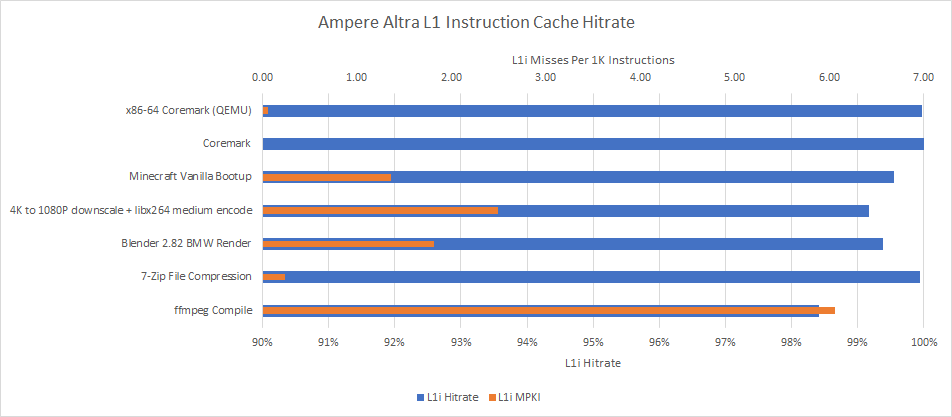

更先进的 TAGE、感知器或局部历史方案被高频目标和 Standard Cell 实现难度排除。八宽还要求每拍多预测，局部历史会增加多端口访问。因此 Prodigy 按八条指令块做全局历史预测。Tachyum 称未来 Custom Cell 可能支持更复杂方案。

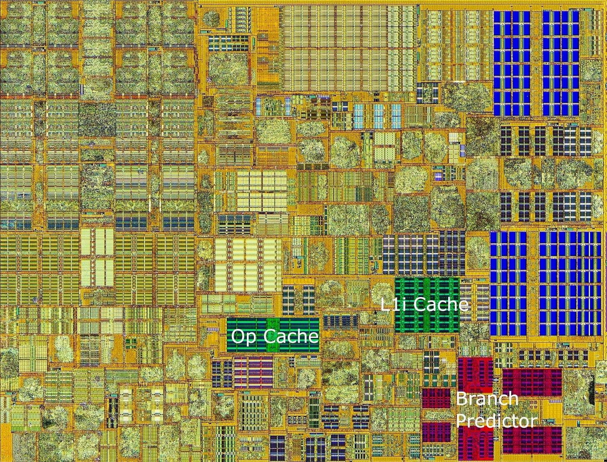

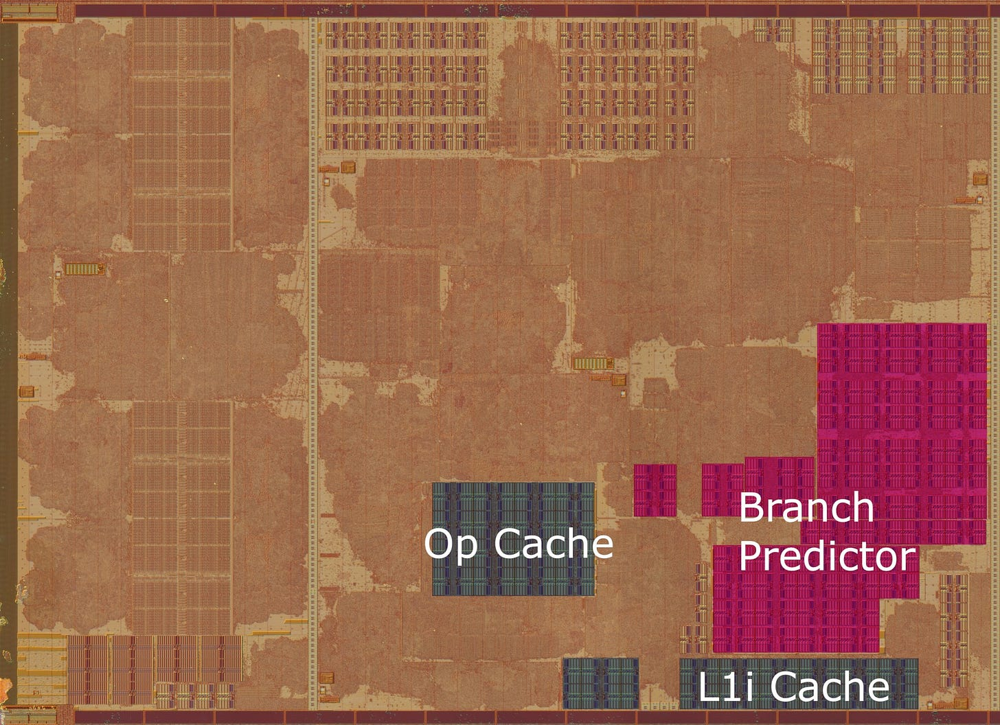

两图用于说明 Intel 可能给预测器使用专门 SRAM，而 AMD 能用较通用单元实现先进预测。它们不是 Prodigy 的版图证据。

### 体系结构视角：追求频率会重新定义“最优预测器”

更准的预测器若拉低全核频率，收益可能被抵消；反过来，简单预测器的 MPKI 又会乘上宽机器每次错误丢弃的工作量。应以应用性能、MPKI、覆盖气泡和频率共同评估，而不是只比较预测算法年代。

## 256 指令窗口与 2×1024 bit 向量

新版可跟踪 256 条在途指令，整数和向量各有 128 个额外重命名资源，并宣称可跨多种依赖乱序。公开描述显示它用多 Checkpoint 保存可能异常指令之前的寄存器状态，以支持精确异常；2018 版只有单个 Checkpoint。其细节不足以判断是否与传统 PRF+ROB 完全等价。

两个 1024 bit 向量单元和同宽寄存器使每核向量吞吐超过当时通用 CPU，Golden Cove 的两条 512 bit 只有一半宽度。

## Cache、MLP 与 Virtual L3

为喂饱向量单元，L1D 数据通路翻倍。若真运行 5.7 GHz，单核 L1D Load 带宽接近 1.5 TB/s；L2 每拍送一条 128 B Cache Line，约 730 GB/s。每周期带宽是当时 Intel 的约两倍，Zen 2/3 的约四倍，再叠加更高频率。

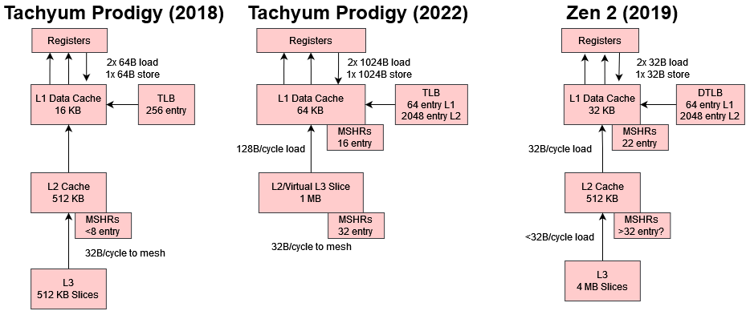

新版同时增加 Memory-Level Parallelism（MLP），以更多未决 miss 隐藏 L3/DRAM 延迟。

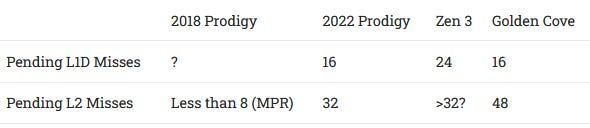

其能力较旧版显著提升，接近 Zen 3/Golden Cove 范围，但公开数据仍不足以确认各种 miss 队列的确切边界。

L1D 从 16 KB 扩至 64 KB。每核 L2/L3 总容量没有同步增加，而是让空闲核的 L2 接受活跃核逐出的数据，形成 Virtual L3。这样低线程负载可借用闲置 SRAM，却要决定同一物理地址放在哪些 slice、如何控制探测流量和距离。其放置与替换策略是决定成败的“Secret Sauce”，公开资料没有说明。

末级 TLB 从 256 增至 2048 项。默认 64 KB 页时覆盖 128 MB，而 4 KB 页只能覆盖 8 MB；另支持 32 MB Huge Page。大页提高 TLB Reach，也增加内部碎片，服务器的大内存环境更容易承受。

## 16 通道 DDR5 与带宽压缩

Tachyum 曾考虑 HBM，但容量不利于通用服务器，芯片边缘也放不下 HBM 与 DDR 两套 PHY，最终选择 16 通道、1024 bit DDR5-7200。

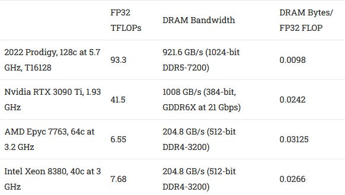

其理论带宽接近 RTX 3090，但 2022 年 DDR5-7200 尚不普及；公司设想 HPC/AI 整机厂筛选高速 DIMM，普通服务器可用低速内存。即便如此，双 1024 bit 向量与高频让 Byte/FLOP 仍低于很多 CPU/GPU。Prodigy 计划用面向 AI/HPC 的内存压缩和更大粒度 ECC 腾出部分传输能力，但未公开可验证的压缩比。

## 新 ISA 的二进制翻译

Prodigy 没有成熟软件生态，计划用 QEMU 执行 x86/Arm 二进制。文章在 Ampere Altra 上观察到 x86 CoreMark 经 QEMU 比原生 AArch64 慢 78%。硬件可切换严格内存序，类似 Apple 为 Rosetta 提供 TSO 支持，减少 x86 语义模拟开销；Tachyum 也修改 QEMU，目标仍可能有 30%～40% 性能损失。首要价值是让必需软件可运行，而不是等同原生性能。

## 2022 版更完整，但 5.7 GHz 存疑

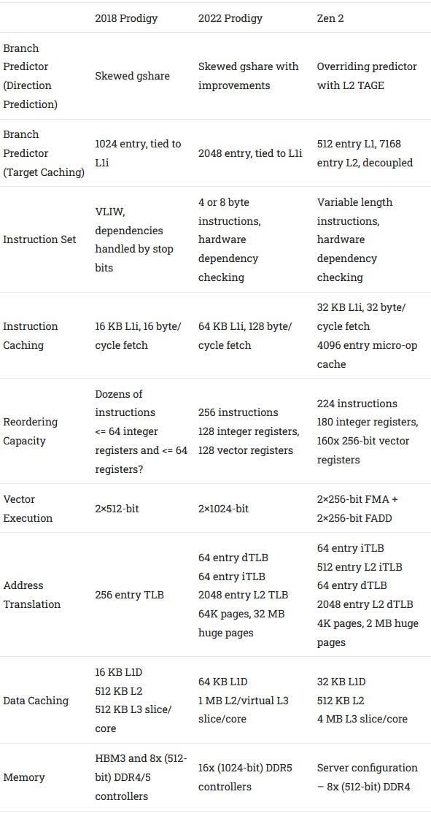

传统 ISA、硬件依赖检查、多 Checkpoint、更大 L1 和更多 MLP 修补了旧版最大缺陷。HPC/AI 即使带宽/计算比偏低，仍有巨大向量吞吐；服务器则受较弱预测器、较少 LLC 和新 ISA 迁移制约。若频率巨大领先，这些弱点可能被掩盖。

但 5.7 GHz 很难令人信服：从 Fetch 到整数 Execute 约十级，远短于频率同档核心。Golden Cove 误预测超过 20 周期，Zen 3 常见 13 周期，Neoverse N1 约 11 级且不超过 3.3 GHz，Phenom 约 12 周期而最高 3.7 GHz。

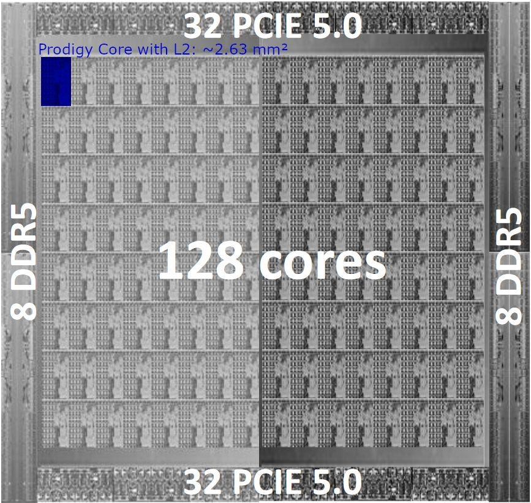

若全芯片不到 500 mm²，每核可能小于 3 mm²，双 1024 bit 单元在 5.7 GHz 会形成极高热点。128 核满载向量时宣称 950 W；连 32 核 3.2 GHz 型号也为 180 W。服务器整数负载可能达不到 TDP，但散热必须按最坏情况设计。

即使只跑 3 GHz，向量峰值仍在 GPU 区间。

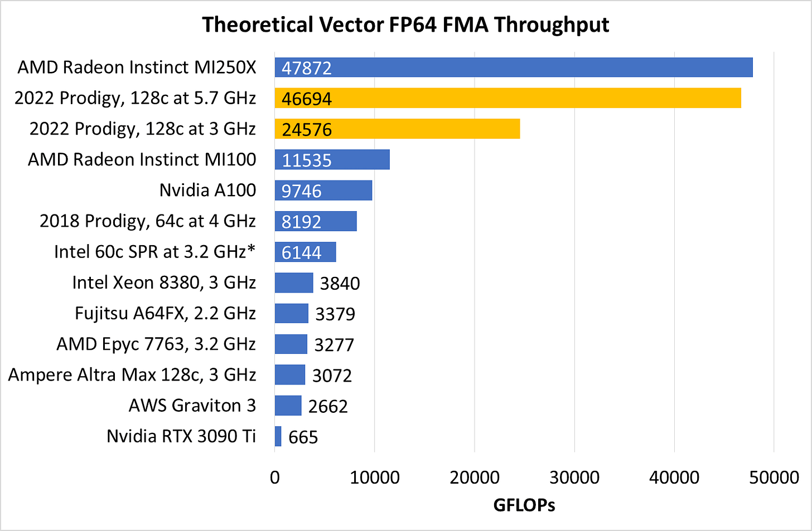

降频还会让计算/带宽比更平衡。其他 CPU 每 FLOP 的带宽更多，往往只是计算吞吐更低；GPU/A64FX 的高带宽则来自容量受限的紧耦合内存。

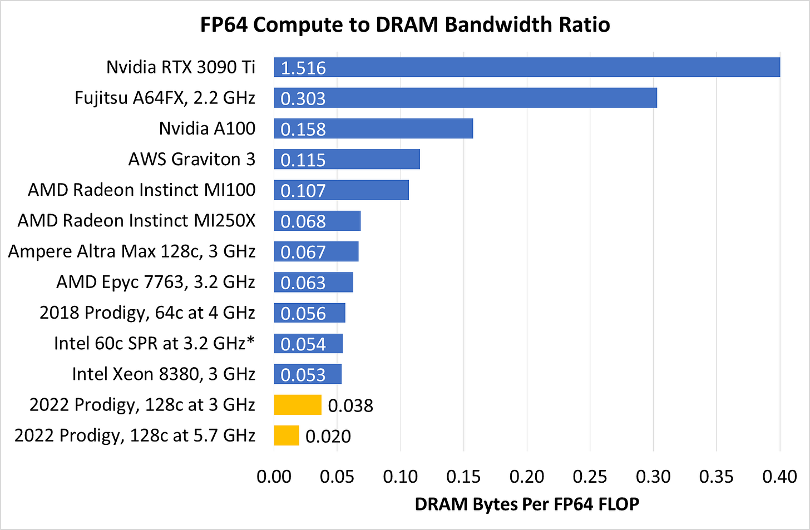

### 体系结构视角：先检查“屋顶线”，再看峰值数字

Roofline 关系由峰值计算、持续内存带宽和应用算术强度共同决定。低算术强度负载先撞带宽屋顶，超宽向量闲置；高复用负载才接近算力屋顶。压缩、Cache 与 Virtual L3 能移动拐点，但不能假定所有数据都可压缩或复用。

## 结语

新版 Prodigy 已不再是 2018 年那颗依赖 VLIW 编译器的处理器，而是试图用通用 CPU 的单线程能力、GPU 级向量吞吐和服务器级大内存覆盖多个市场。它的 HPC/AI 潜力即使降频仍然存在，通用服务器竞争力却高度依赖频率和软件生态。

最需要保持边界的是：文章讨论的是 2022 年披露的目标，不是硅片验证。5.7 GHz、500 mm²、950 W、压缩收益与 Virtual L3 效果必须分别验证；不能因架构比旧版合理，就把全部产品承诺视作已实现。

## 参考资料

- Tachyum 2022 Prodigy 白皮书与访谈
- Chips and Cheese：Tachyum’s Revised Prodigy Architecture
