# VIA 终章：深入 Centaur 最后一代 CPU 核心 CNS

> **文章出处**：Chips and Cheese
>
> **英文标题**：VIA Part 4 – A Deep Dive into Centaur’s Last CPU Core: CNS
>
> **撰文**：George Cozma、Chester Lam
>
> **发布日期**：2022 年 3 月 23 日
>
> **文章链接**：https://chipsandcheese.com/p/via-part-4-a-deep-dive-into-centaurs-last-cpu-core-cns

x86-64 支撑着绝大多数 PC、游戏主机和服务器，但能够设计兼容处理器的厂商始终屈指可数。Intel 与 AMD 争夺性能王座时，VIA 及其曾经拥有的 Centaur 团队长期把重点放在低功耗笔记本和嵌入式市场。VIA Nano、兆芯陆家嘴（LuJiaZui）都出自这条技术脉络；自 1999 年取消新收购的 Cyrix Jalapeno 核心后，VIA 很久没有再正面挑战顶级 x86 设计。

2019 年，方向突然改变。Centaur 公布代号 CNS 的 x86 核心，目标从 Nano 式低功耗设计转向服务器：强调高 IPC，并支持 AVX-512。它既是 VIA 产品策略的一次跃迁，也是第一款实现 AVX-512 的非 Intel 微体系结构。

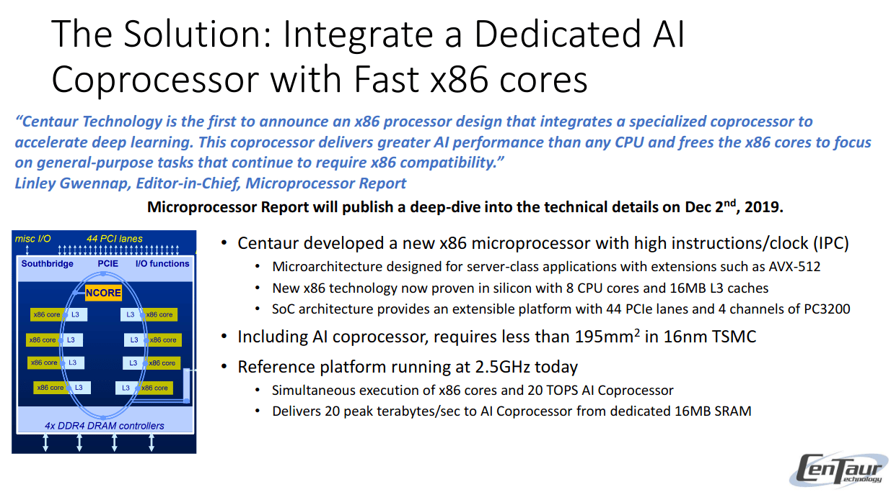

2021 年末，Intel 收购 Centaur 设计团队的消息传出。Centaur 当时是 Intel、AMD 之外仅存的高性能 x86 设计团队，这笔交易很可能让 CNS 的独立产品化戛然而止。

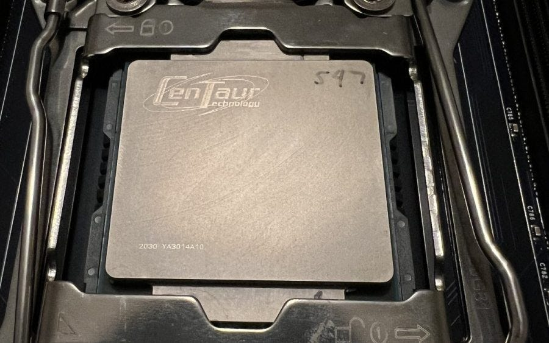

幸运的是，Brutus 在读者和赞助者帮助下拿到了一颗罕见的 CHA 样片。下面的测试因此不是一份量产 CPU 评测，而是对一条未能上市的微体系结构路线进行“技术考古”：它展示了 Centaur 在资源有限的条件下，把 x86 核心推进到了什么程度。

## CHA 与 CNS：一颗为边缘推理设想的服务器芯片

CHA 集成 8 个 CNS 核心和一颗名为 NCore 的机器学习加速器，配有 16 MB 末级缓存（Last-Level Cache，LLC）与四通道 DDR4 控制器。全芯片采用台积电 16 nm 工艺，面积 194 mm²。

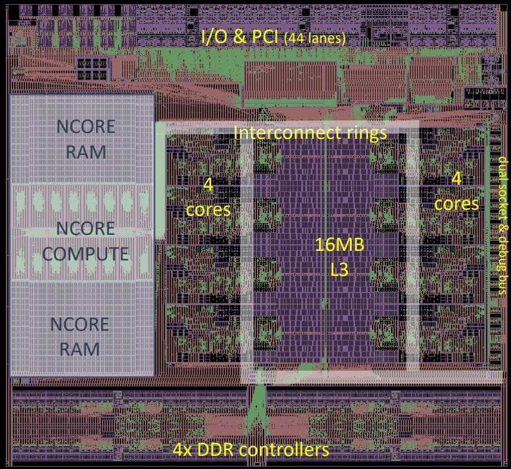

由于公开环境中找不到 NCore 驱动，测试集中在 CNS CPU 核心。图 4 是根据微基准观察整理的结构总览，其中带问号或近似号的容量属于反推，不应理解为官方模块参数。

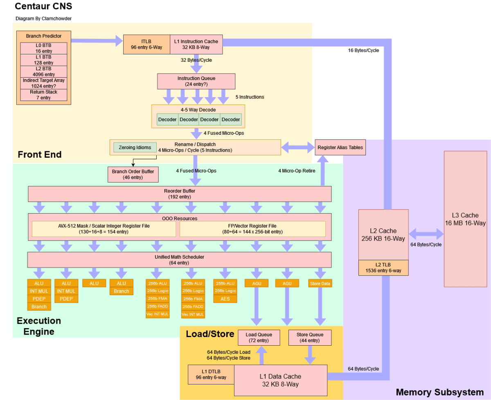

工程样片运行在 2.2 GHz，已经相当接近量产目标的 2.5 GHz；内存配置为四通道 DDR4-3200。主要对照平台是 Azure NC12 实例，其 Xeon E5-2690 v3 关闭了 SMT，频率看起来约为 3 GHz，但内存类型并不明确。两者的频率、平台与内存条件并不统一，因此周期数更适合比较微体系结构，绝对时间和整机带宽只能谨慎对照。

## 分支方向预测：历史容量可观，精度仍落后于 Haswell

Centaur 把 CNS 称为“Haswell-Class”，文章因此以 Haswell 为主要参照。CNS 能识别相当长的重复模式，但总体预测能力仍不及 Haswell。值得注意的是，它似乎为分支历史准备了充足存储：同时存在 512 条分支时，重复历史长度达到 24，预测准确率仍能维持得很好；Haswell 在模式长度超过 16 后反而明显恶化。

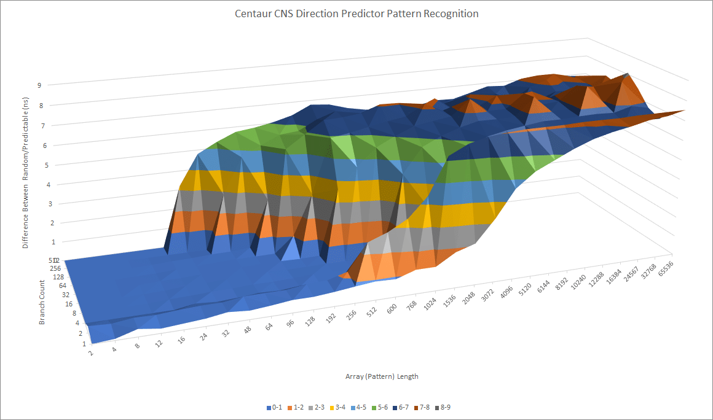

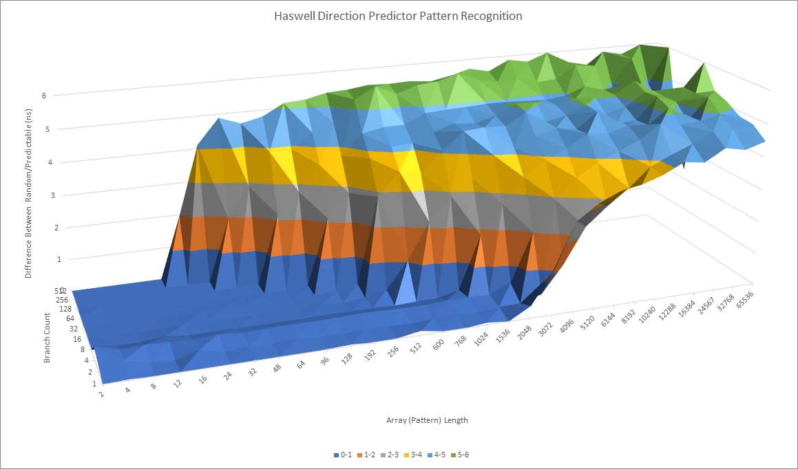

与 VIA Nano 相比，这套方向预测器已经是显著进步。不过，曲线只能说明特定合成模式下的可预测范围，不能唯一确定预测器采用了哪种算法，也不能把“可容纳较长历史”直接等同于真实程序中的更低 MPKI。Intel 多代投入所形成的算法、容量、哈希与恢复设计，仍然给小团队设置了很高门槛。

### 间接分支预测

间接分支可能从同一条指令跳向多个目标。预测器不但要记住目标，还要根据上下文在多个目标之间作选择。这里的微基准只探测可跟踪目标数量，并不等价于完整衡量真实程序中的目标选择精度。

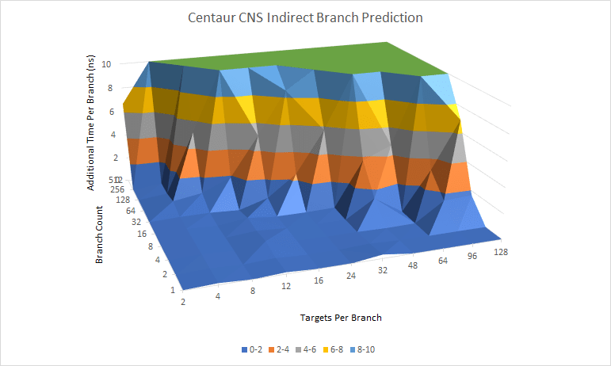

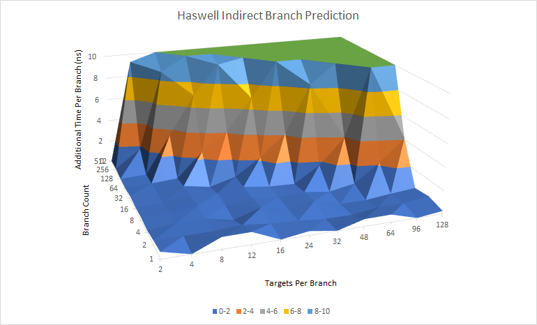

以核心规模而言，CNS 的结果很出色：当 256 条间接分支各有 4 个目标时，总计 1024 个目标仍未造成明显惩罚。Haswell 更擅长“少量分支、每条很多目标”，CNS 则更擅长“大量分支、每条少量目标”。这说明“间接目标容量”并非单一数字，分支 PC 数量和每个 PC 的目标数会以不同方式消耗结构资源。

### Call/Return 预测

函数返回是间接分支的特殊情形，通常返回到对应调用点。CNS 使用 7 项返回地址栈（Return Address Stack，RAS）；Haswell 为 16 项，Zen 为 31 项。较浅的 RAS 会让深层递归或调用嵌套更早回退到普通间接目标预测，带来更高误预测风险。

### 体系结构视角：预测“能记多少”与“多快给出”同样重要

方向表、间接目标结构和 RAS 分别处理不同类型的控制流。它们即使准确率相近，也可能具有完全不同的访问延迟、吞吐和恢复代价。真实前端最终关心的是：每周期能否及时给出下一取指地址；若答案迟到，取指仍会出现气泡。因此下面还要把预测准确率与 BTB 的层级和速度分开讨论。

## 分支目标速度：小循环很快，主 BTB 与 L1I 紧密耦合

CNS 使用复杂的多级分支目标缓存。CNS 和 Haswell 都能在 128 条分支以内维持无取指气泡，分支数量超过约 4096 后也都出现 BTB miss 惩罚；但两者中间层级的组织方式很不一样。

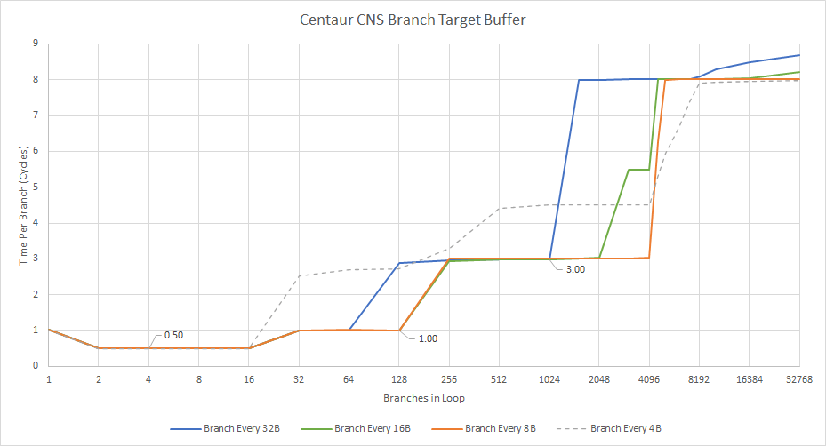

当活动分支少于 16 条时，CNS 每周期可处理两条 taken 分支。能超过每周期一条 taken 分支的核心并不多，文中把它与 Rocket Lake、Golden Cove 放在一起。Intel 很可能通过微操作队列内的循环展开实现这一点，官方称之为 Loop Stream Detector（LSD）；CNS 也可能有相似机制，否则便需要双端口指令 Cache 才容易实现这样的分支吞吐。这里的“相似机制”只是根据曲线作出的解释，并无 RTL 或公开框图确认。

超过 128 条分支、进入主 BTB 覆盖范围后，CNS 看起来把 BTB 与 L1 指令 Cache 绑定在一起：循环代码体超过 32 KB 时，每条分支所需周期突然上升；在 L1I 范围内则约每 3 个周期处理一条分支，相当于 taken 分支后浪费两个取指周期。这可能意味着 L1I 命中延迟约为 3 周期。

Haswell 采用更现代的解耦 BTB，分支间距或 L1I 是否命中不会改变其约 4096 条分支的跟踪能力；它也更快，taken 分支之后只损失一个取指周期。

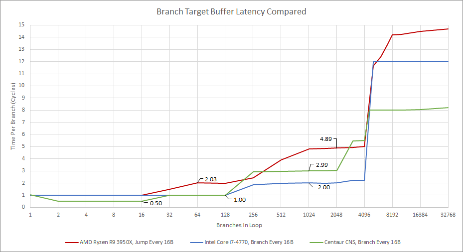

不过，若按相近频率观察，CNS 的表现仍明显好于 Zen 2。Zen 2 的 16 项 L0 BTB 可以做到 taken 分支零气泡，超出后访问更大、更慢的 L1/L2 BTB 会付出陡峭代价。

## 取指与译码：短循环可达 5 IPC

MPR 的资料称 CNS 可从 L1I 每周期取出 32 字节，但测试中只有 2 KB 代码规模达到了这一带宽。结果与 Haswell 有些相似：32 B/cycle 更像来自微操作 Cache 或极小循环，而不是整个 L1I 容量范围都能持续提供。

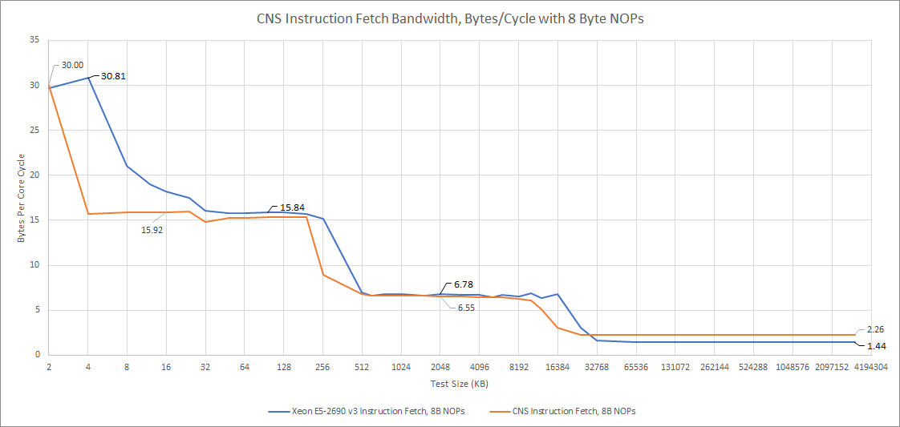

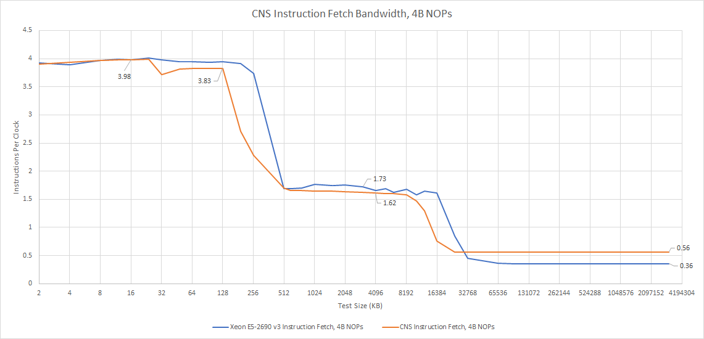

从 L2 取指时，CNS 仍可维持约 16 B/cycle；只要代码不被长向量指令主导，这足以支撑 4 IPC。指令工作集溢出 L2 后吞吐明显下降，但 Haswell 等许多设计也会出现类似现象。

CNS 在不超过 24 条指令的紧凑循环中可达到 5 NOP/cycle。

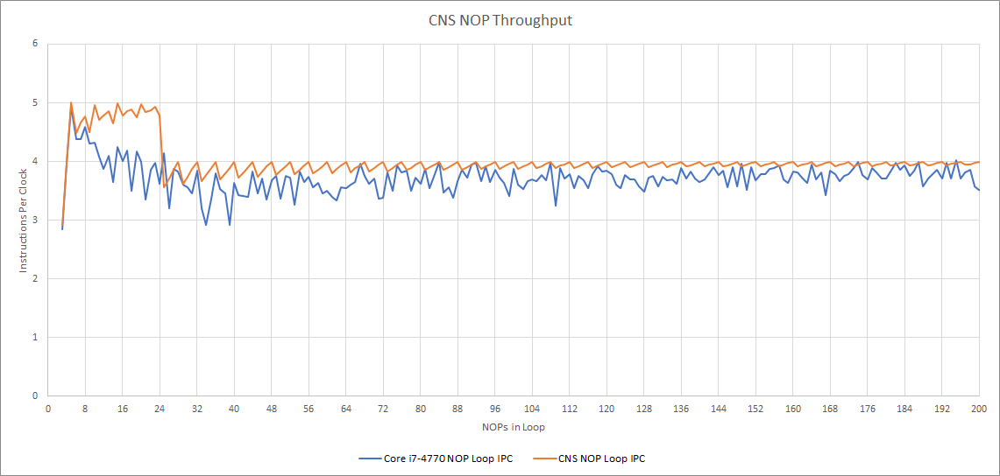

MPR 资料称 CNS 的预译码级每周期处理 4 条指令，之后写入指令队列，再送给 4-wide 主译码器。一种符合曲线的解释是：指令队列约有 24 项并兼任循环缓冲；代码完全落在其中时，可以绕过 4-wide 预译码限制。如果主译码器同时融合一对指令，便可能达到 5 IPC。Haswell 的组织不同：预译码宽度为 6，循环缓冲位于 4-wide 主译码器之后。

和 Haswell 一样，CNS 能把条件跳转与前一条设置标志位的指令融合，包括算术指令。更少见的是，它还能把 NOP 与相邻指令融合；融合后的一对指令在后端只占一个微操作位置。

### 体系结构视角：前端带宽不是一个数字

“32 B/cycle”“4-wide decode”和“5 IPC”并不矛盾，它们对应字节供给、指令边界识别、译码以及融合后的微操作供给等不同环节。短循环可被循环缓冲反复播放，长代码则必须经过 L1I、预译码和主译码。只有同时改变指令长度、代码足迹与融合条件，才能定位瓶颈到底是字节带宽、译码槽位还是循环结构容量。

## 重命名与乱序资源：向 Haswell 看齐的窗口

CNS 的重命名器能识别结果必为零的指令，例如寄存器与自身 XOR 或相减。调度器因而无需等待源操作数就能放行后续依赖，这一点与 Haswell 相当。与之相对，测试没有观察到 move elimination：寄存器到寄存器的依赖 move 链仍以每周期一条执行。

寄存器文件、重排序缓冲区（Reorder Buffer，ROB）、内存顺序队列、调度器和分支顺序缓冲的可见容量，都与 Haswell 大致处在同一量级。这说明 Centaur 确实在追求 Haswell 级的单线程性能，而不只是给旧式低功耗核心增加几个执行单元。

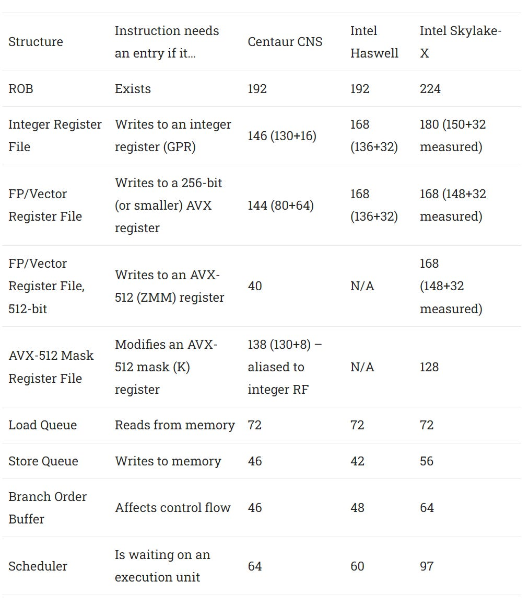

CNS 最醒目的功能是 AVX-512，但实现方式远不如 Skylake-X 完整。核心内部仍使用 256-bit 向量寄存器，一条 512-bit 指令被拆成两个微操作。因此，AVX-512 并不会天然带来更高吞吐或更大的有效乱序容量。

掩码功能同样存在资源代价。CNS 的 AVX-512 mask 寄存器与通用整数寄存器竞争同一个重命名物理寄存器文件，而整数物理寄存器池本就略小于 Haswell。再加上 512-bit 结果要占用两个向量物理寄存器，运行 AVX-512 代码时，可容纳的在途指令数可能比标称 ROB 深度更早触顶。

### 体系结构视角：ISA 功能宽度不等于数据通路宽度

支持 AVX-512 只说明软件可以使用相关编码和语义，并不保证核心拥有 512-bit 执行器、寄存器数据通路或每周期 512-bit 吞吐。拆成两个 256-bit 微操作能够降低面积和布线压力，却会消耗更多重命名、调度、寄存器和提交资源。衡量这种实现时，应同时看指令吞吐、微操作数量以及有效乱序窗口，而不能只看 ISA 特性列表。

## 执行单元：整数与向量很强，地址生成稍弱

### 整数执行

CNS 配置 4 条 ALU 流水线，与 Haswell 数量相同，但专用能力分布得更广。

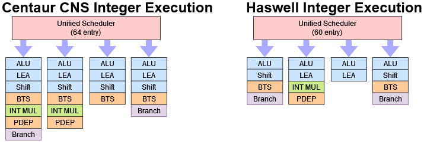

4 条 ALU 管线都能执行 rotate 与 shift，而 Haswell 只有两条。PDEP、PEXT 等复杂位操作可在 CNS 上达到每周期两条，Haswell 只有一条对应管线。两者的整数乘法延迟都是 3 周期，但 CNS 有两个整数乘法器，Haswell 只有一个。表面上同为 4 ALU，CNS 的端口更灵活，使用特殊指令较多的程序可能获得更高吞吐。

### 向量与浮点执行

CNS 的向量侧总体类似 Haswell，但向量执行管线与整数端口分开。向量整数运算分布在 3 条管线上，浮点运算可选择两条管线，同样体现了 Centaur 对专用执行能力的充分复制。

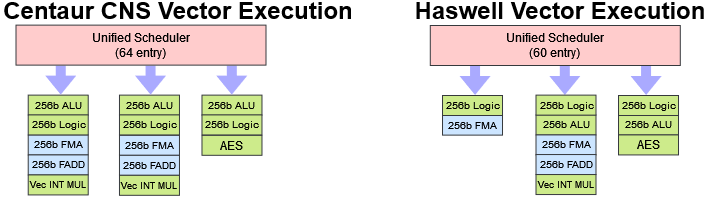

浮点单元每周期可执行两条 256-bit FP 加法或乘法，延迟均为 3 周期。Haswell 的 FP 乘法延迟为 5 周期，3 周期 FP 加法每周期只能一条；若把乘数设为 1，用 FMA 代替加法，可以追平 CNS 的加法吞吐，但延迟更高。两者的融合乘加接近，都是 2×256-bit 吞吐与 5 周期延迟。

向量整数侧也更有弹性：CNS 三条管线都能做向量整数加法，Haswell 只有两条；向量整数乘法器是两个，对照平台为一个。例如 `pmulld` 在 Haswell 上只有约 0.5 条/周期、延迟 10 周期，CNS 则约 1.68 条/周期、延迟 3 周期。

### 地址生成

地址生成单元（Address Generation Unit，AGU）是 CNS 执行端较少见的弱项。两条 AGU 都能处理 Load 或 Store；Haswell 有三条，可在同一周期完成两次 Load 和一次 Store。

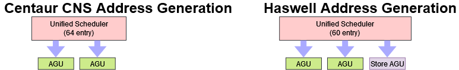

CNS 仍有自己的优势：一条 AVX-512 Store 或两条 256-bit AVX Store 都可写入 64 B/cycle，写带宽是 Haswell 的两倍。以 1:1 读写计算，L1D 理论上可达 128 B/cycle。测试没有跑满，但超过了 90 B/cycle，接近 Haswell 的 96 B/cycle 理论上限。

实际程序往往 Load 多于 Store，Haswell 的第三条专用 Store AGU 能让另外两条通用 AGU 更集中地服务 Load，因此整体可能略占优势，不过差距不会很大。

### 体系结构视角：端口数量要放进指令混合中理解

两个通用 AGU 并不意味着 CNS 的所有内存工作负载都弱，也不能由 128 B/cycle 理论值推出实际程序必然接近该带宽。AGU 吞吐、Load/Store 数据通路、队列容量和 Cache 端口是不同约束。只有当地址生成已经饱和，并且工作负载确实以 Load 为主时，Haswell 的第三条 AGU 才会转化为稳定优势。

## 内存顺序与 Store Forwarding

CNS 的 Load/Store 单元相当成熟。不同于 VIA Nano 和兆芯陆家嘴，它可以把 Load 推测执行到地址尚未确定的旧 Store 之前；如果后来发现地址冲突，核心必须回放受影响的 Load 及其依赖链。

Store Forwarding 同样强大。只要 Load 完全包含在此前 Store 的字节范围内，CNS 都能以 7 周期完成转发。若访问彼此独立且不跨 64 字节 Cache Line，它还可以每周期完成两次 Load 与两次 Store；Intel 和 AMD 直到 Sunny Cove、Zen 3 才出现类似能力。

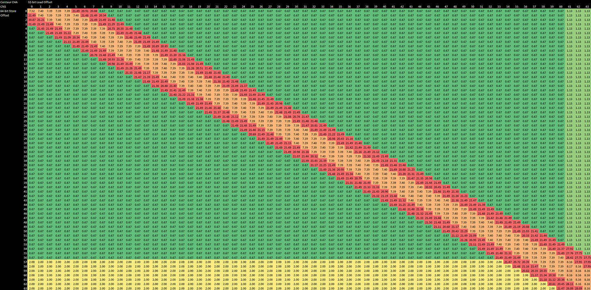

代价在于延迟偏高，尤其是转发失败时。Load 与 Store 仅部分重叠会把延迟推到 21 周期；Load 跨越 64 字节 Cache Line 时，成功转发增加 1 周期；既跨线又转发失败，还会多付出 6 周期。

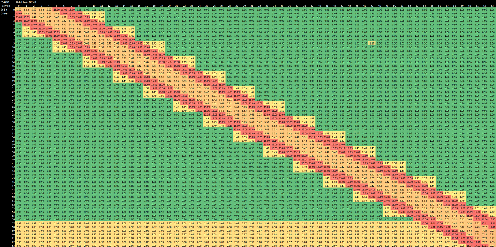

Haswell 看起来先按 4 字节粒度快速判断。Load 与 Store 落在同一个 4 字节对齐区间时，再做更细检查，因此即使并未重叠也会增加半个周期。成功转发约 5.5 周期，失败约 15 周期，都低于 CNS；考虑 Haswell 运行频率更高，这一点尤其突出。跨 Cache Line 会让 Haswell 的成功转发增加 2 周期，失败惩罚增加 1 周期。

### 体系结构视角：失败路径决定 LSU 的韧性

Store Forwarding 的关键不只是成功时能否传值，还包括重叠判断、跨线拆分和失败后的回放范围。快速路径影响常见依赖链延迟，慢路径则可能堵塞 Load Queue、占用调度槽并放大到几十个周期。测试时应把完全覆盖、部分覆盖、地址错位和跨 Cache Line 分开，否则一个平均延迟会掩盖真正的异常路径。

## Cache 与内存访问：L2 带宽亮眼，延迟偏高

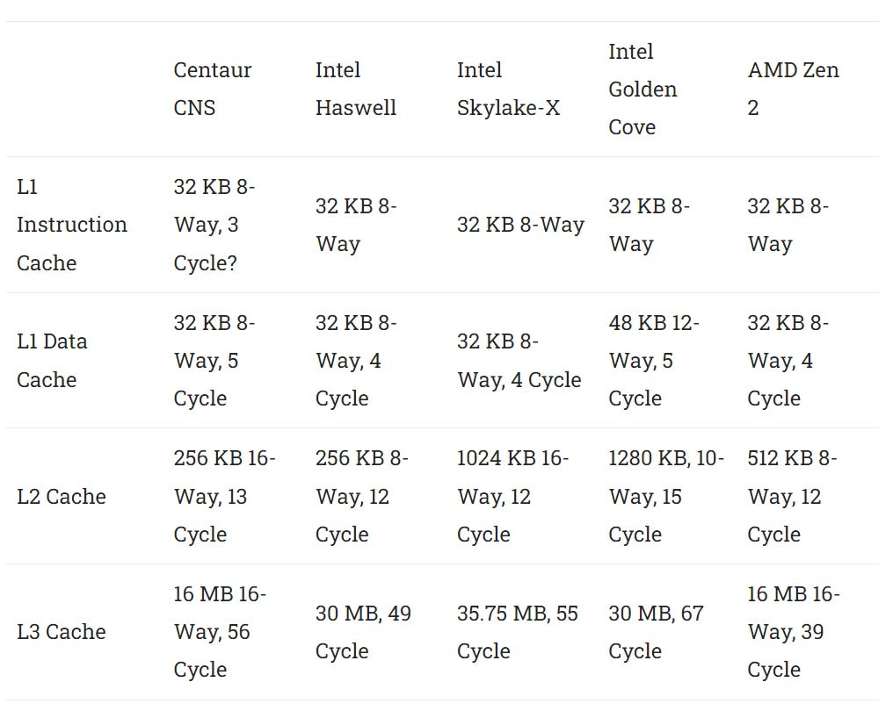

整体上，CNS 的 Cache 延迟高于服务器平台上的 Haswell。频率差异解释了一部分：CNS 为 2.2 GHz，对照 Haswell 约为 3 GHz。

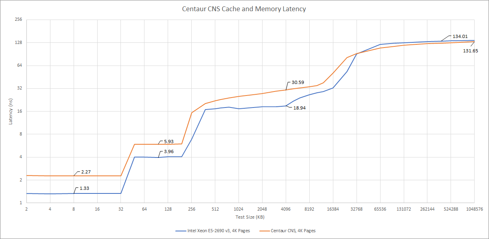

即使换算成周期，CNS 仍落后：L1D 延迟 5 周期，L2 比 Haswell 多 1 周期，L3 无论周期数还是绝对时间都更慢；只有访问 DRAM 时略占优势。

使用 2 MB 大页、尽量排除地址翻译开销后，两颗处理器的延迟都会改善，但总体关系没有改变。一个只服务 8 个核心的环形 L3 仍有约 24 ns 延迟，略显偏高。比较 L3 区间的台阶还能看到，L2 TLB 命中会额外增加约 8 周期。

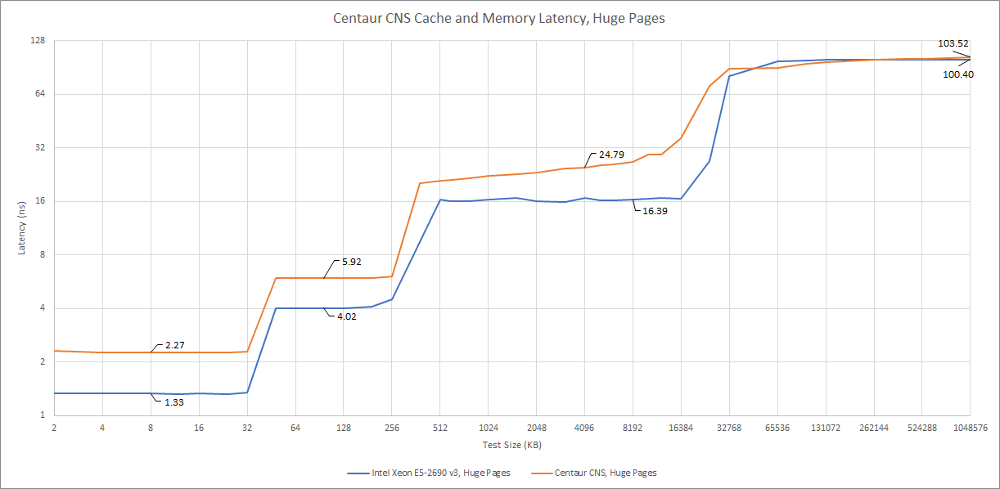

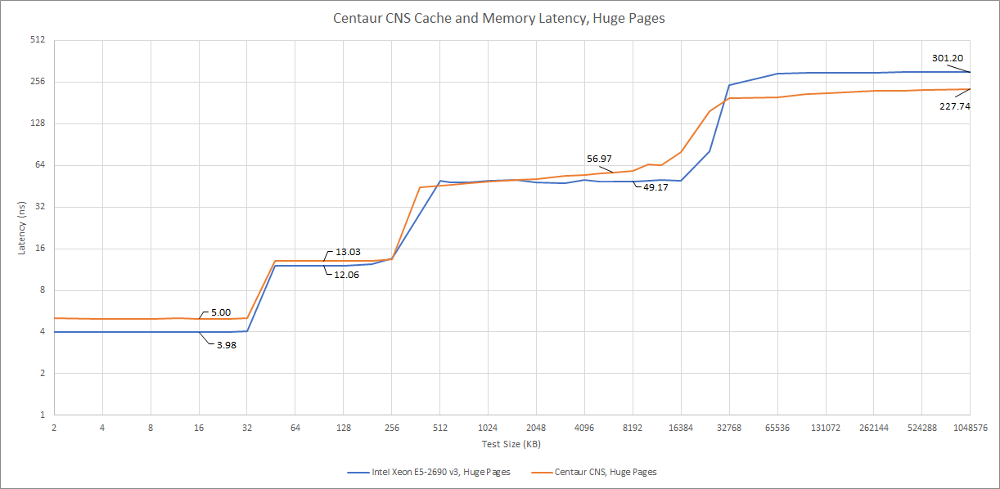

若只看周期，CNS 的 L3 并没有比 Haswell-E 高出太多；但 E5-2690 v3 拥有更多核心、更大 Cache 和更高频率。Intel 在扩大环形互连规模时仍控制住延迟，显示出多年迭代的工程积累。

### 带宽

CNS 的 L1D 理论上每周期可完成 64 字节 Load 和 64 字节 Store。即使用读改写与拷贝这种 1:1 读写模式，测试也未接近 128 B/cycle，但实测至少超过 64 B/cycle。

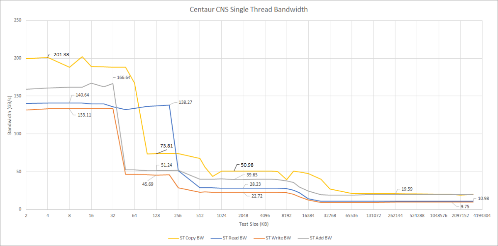

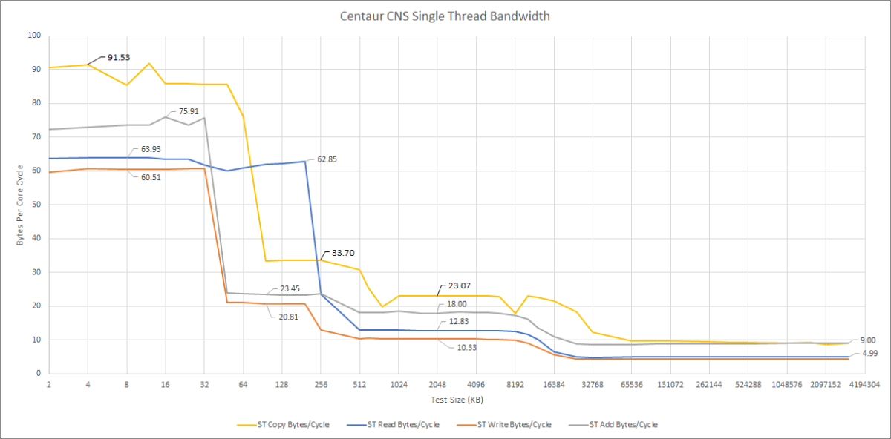

从 L1 到 L2，读带宽几乎不下降，保持在略低于 64 B/cycle。

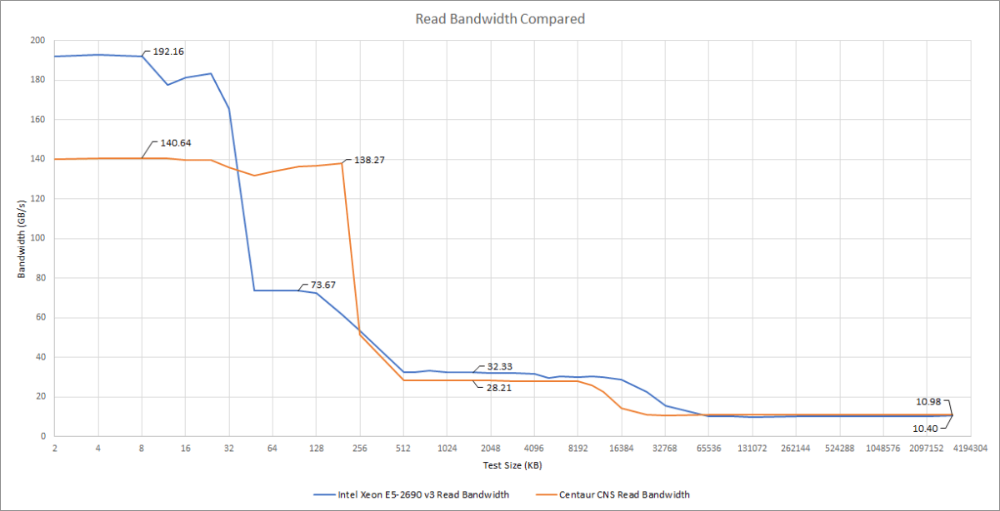

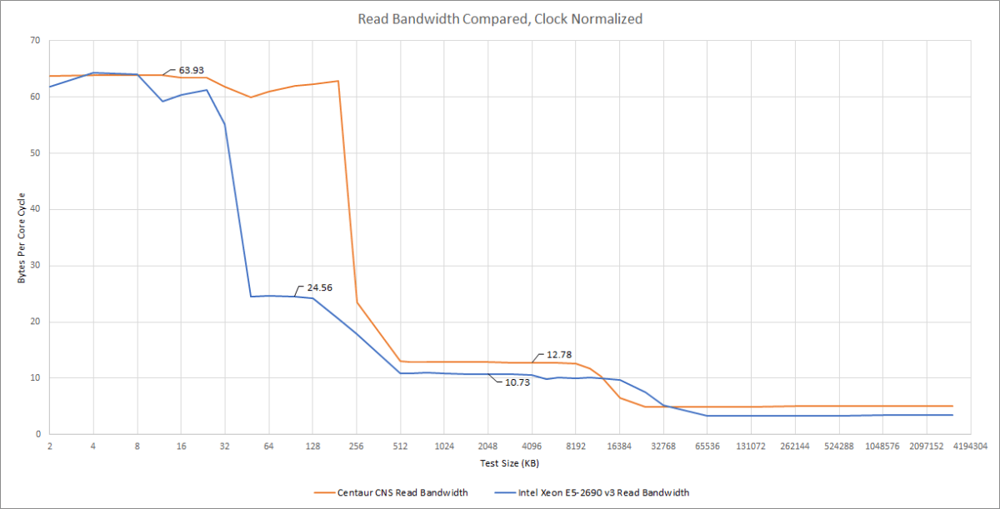

即使 Intel 后续核心也很难持续提供这样的 L2 读取能力，CNS 在这里表现十分抢眼；进入 L3 后，带宽则显著下降。

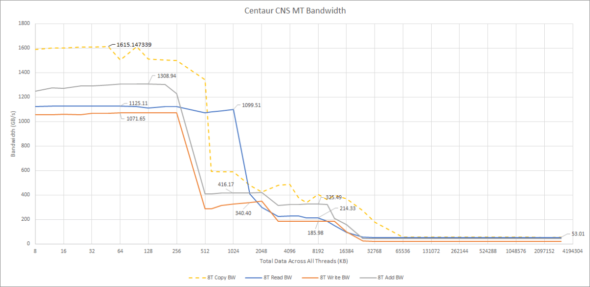

8 核全部加载时，CHA 的 L1D 在内存拷贝模式下合计超过 1.6 TB/s；L2 以读取模式最高，略低于 1.1 TB/s；L3 约为 325 GB/s；DRAM 在拷贝模式下略高于 55 GB/s。这里的多核数字是全芯片聚合吞吐，不能与单核曲线直接相加比较。

### 体系结构视角：延迟与带宽揭示的是两种设计取向

5 周期 L1D 和偏慢 L3 会拉长串行依赖链，低延迟程序很难用更多并发来隐藏；接近 64 B/cycle 的 L2 读取却有利于存在大量独立访问的流式负载。判断性能时，应结合 memory-level parallelism、未命中并发数和依赖深度：同一套 Cache 可以在 pointer chasing 中吃亏，却在高并发读取中表现出色。

## 片上互连与系统结构

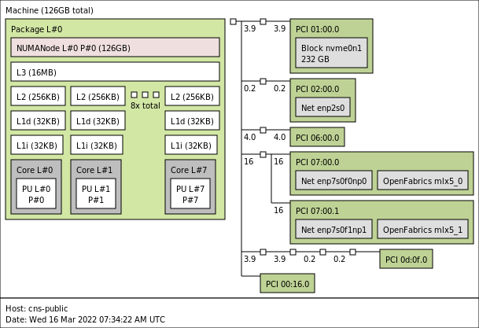

Centaur 用环形互连连接核心、L3 Cache 与片外 I/O。每个 ring stop 在两个方向上都能传输 64 B/cycle，是 Haswell 对应宽度的两倍。

### 带宽扩展

8 核负载下，CNS 平均每周期合计传输 97.4 字节，Haswell-E 为 81.62 字节。更宽的环确实提高了每周期带宽，但仍不足以完全抵消 Intel 的频率优势。

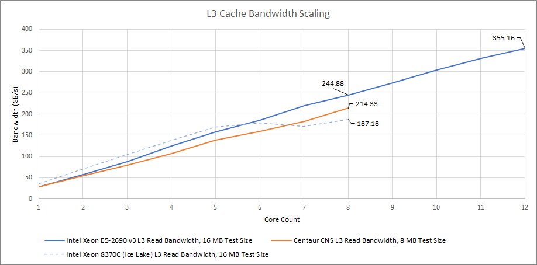

作为另一项对照，CNS 的环形 L3 在重负载下还能提供高于 Ice Lake 网状 Cache 的带宽。Mesh 扩到大量节点更容易，但提高时钟往往需要很高功耗，可能表现为高延迟和低单节点带宽，Ice Lake 也未完全避开这一取舍。

CHA 的四通道控制器支持 DDR4-3200，理论带宽为 102.4 GB/s，实测却只有约 53 GB/s，即约 52%。刷新和读写方向切换本就会损失一部分 DRAM 带宽，但这一利用率仍明显偏低。

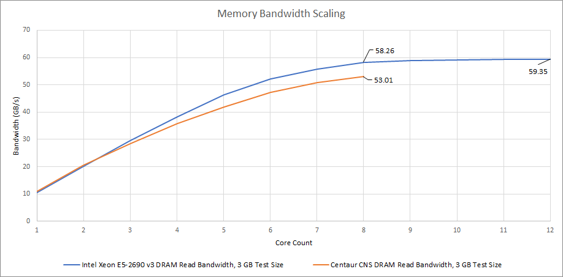

Haswell-E 的第一代 DDR4 控制器也不擅长高频，不过随着核心数增加，它的带宽扩展仍更好。一种可能性是 CHA 并未把 CPU 内存带宽作为唯一优化目标：NCore 占用大量面积，能够提供接近 7 bfloat16 TFLOPS，也会产生很大带宽需求；四通道还允许安装更多 DIMM，用普通容量条获得较大总内存，而无需昂贵的大容量模块。这些解释符合产品定位，但不是控制器内部行为的直接证据。

### 锁与 Cache 一致性

CHA 的一致性机制很可能与 L3 Slice 归属绑定。一个核心看到另一个核心写入所需的时间，会随着两个核心到该 Cache Line 所在 L3 Slice 的距离而变化。

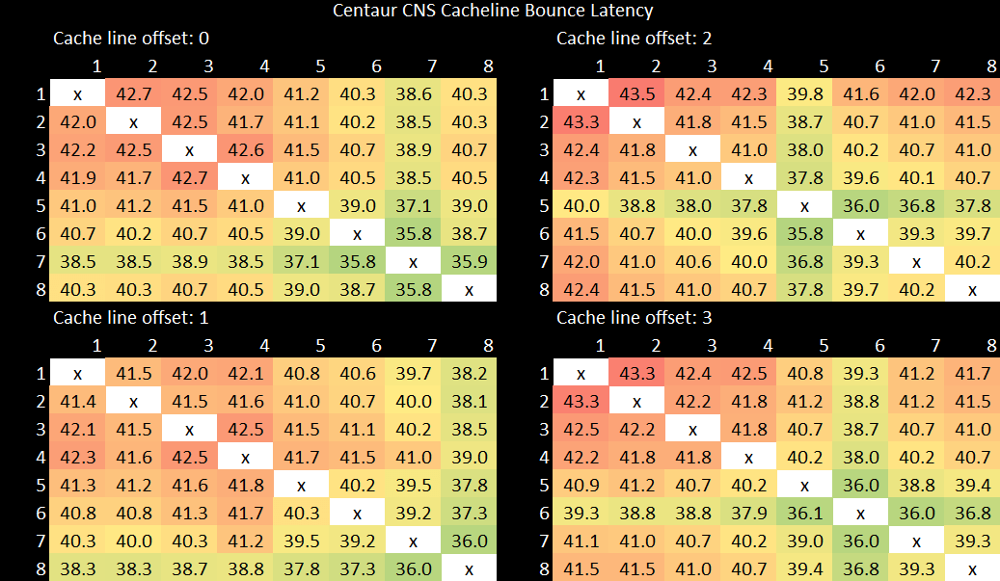

考虑 CNS 的低频，其锁操作延迟并不差，Haswell-E 大致处于同一范围。Intel 一方面受益于更高频率，另一方面为了连接更多核心和 Cache 使用了双环，跨越更多 hop 通常会增加延迟。

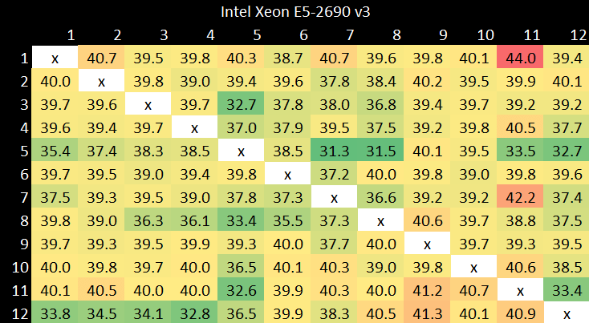

### 体系结构视角：互连必须同时满足局部性、吞吐与一致性

环宽决定理论吞吐，频率决定每秒带宽，节点距离与数据归属又会改变访问延迟。核间共享数据还可能经历探测、所有权转移和队列等待。因此单看“64 B/cycle 双向”无法推出锁延迟，单看一张延迟热图也不能分离 L3 Slice、环路 hop 与一致性状态的贡献；需要地址着色、核心绑定和多种共享模式联合验证。

## 一颗很强的核心，生在不利的时间点

只看微体系结构，CNS 展示了 Centaur 团队取得的巨大进步。它比此前任何 VIA/Centaur 核心都更宽，乱序容量也更大；能把 Load 推到未知地址 Store 之前，Store Forwarding 接近 Sunny Cove 的能力，有大型统一多端口调度器，还有对核心面积而言非常强的向量执行单元。通用寄存器与 AVX-512 mask 共享物理寄存器文件，也体现了以有限面积实现更多功能的思路。

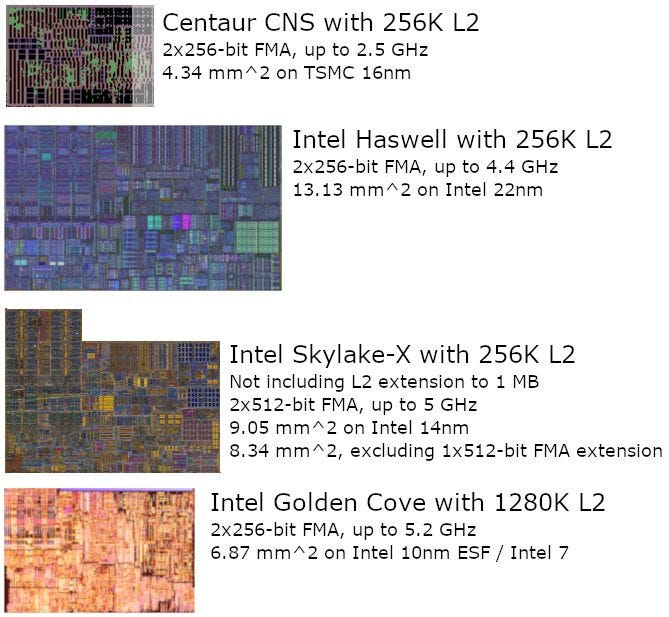

系统层面同样有明显进步：现代环形互连把 8 个核心、共享 L3 与 I/O 连在一起；四通道 DDR4 和 44 条 PCIe Lane 提供了 Centaur 历代产品中最强的片外连接能力。

问题在于，CNS 不可能脱离时代背景单独竞争。Haswell 级 IPC 很不错，但 Haswell 的频率高得多；Intel 又通过多代产品持续打磨环形总线，即使 ring stop 链路更窄，也能支持更多核心并获得更高带宽。若直接交锋，CNS 很难占优。

更严峻的是，CHA 到 2021 年仍未上市，它实际面对的已是 Ice Lake-SP Xeon 和 Zen 3 EPYC。Centaur 规模小、资源有限，工艺还落后一代，纯 CPU 对纯 CPU 没有胜算。

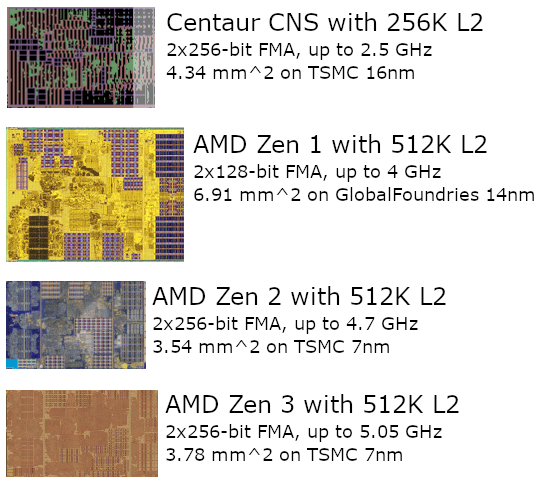

Centaur 显然也理解这一点，NCore 正是差异化方案。它可提供 6.8 万亿次/秒的 bfloat16 运算。CNS 单核无法对抗 Skylake 或 Zen 2，但完全有能力驱动机器学习加速器。作为参照，Intel 的 Snow Ridge 用 2.2 GHz Tremont 核面向 5G 基站，Arm 也以 Neoverse E1 面向边缘场景；尤其在向量化负载中，CNS 足以和这类核心竞争。

把 NCore 放在片上能够降低访问延迟，也把 PCIe Lane 留给网络等 I/O。对于 CPU 需求适中、推理需求较强，又容不下独立加速卡的边缘服务器，CNS 与 NCore 的组合在产品逻辑上说得通。遗憾的是，这个市场没有大到足以挽救 Centaur，或者产品根本没能及时抵达市场。Intel 最终买下了这支擅长用有限资源完成复杂设计的团队，而 CNS 正是其能力证明。

## 未能上市之后：兆芯与 Intel 留下的悬念

即使把上市时间假设为 2017 年，CHA 的系统扩展性也不占优势：CNS 最多两路、合计 16 核；Skylake-X 最多可到 8 路 224 核，第一代 EPYC 两路即可到 64 核。到了计划中的 2020 年，竞争环境更不利。2021 年末，Intel 以 1.25 亿美元收购 Centaur 团队。

收购并不严格等于 CNS 技术彻底消失。兆芯是其中的变量：它已经证明能在 Centaur 既有设计上继续改进陆家嘴核心。兆芯 2018 年曾表示 KX-7000 要追赶当时较新的 Zen 1；CHA 原型板使用 ZX-200 南桥，加之 VIA 在 2020 年 10 月向兆芯转让了包含 CPU 在内的 IP，这些线索让“兆芯原本可能利用 CNS”的猜测具有一定依据。但能否把 CNS 提升到现代桌面竞争所需的 3.5 GHz 以上，本身仍是巨大疑问；即使做到，放到 2022 年也难以追近 Intel、AMD 当时及随后半年即将推出的架构。

Intel 为何收购 Centaur，没有公开答案。可能性包括获得 NCore 等 IP、吸收高效率的工程团队、得到一颗可在台积电节点上用于非顶级性能项目的 x86 核心；最悲观的猜想则是减少一个持有 x86 许可的竞争者，不过据了解 VIA 仍持有 Cyrix 许可。这些都只能作为可能性，不能写成收购动机的确定结论。

## 从 CNS 可以归纳出的六点体系结构认识

以上测试和机制分析还能带来六点更一般的认识，它们用于理解处理器设计，不是对公开参数的追加确认。

第一，**设计均衡比单项峰值更难**。CNS 有强大的整数和向量执行端、惊人的 L2 带宽，却同时面对 5 周期 L1D、偏慢 L3 和只有两条 AGU。应用性能取决于这些环节能否连续供给，而不是哪一张端口图最漂亮。

第二，**同一代际标签掩盖了实现差异**。CNS 可以达到“Haswell-Class”IPC 目标，却通过不同的 BTB、循环结构、向量端口和寄存器复用来实现。相似性能不等于相同微体系结构。

第三，**兼容更宽 ISA 最经济的办法，往往是时间复用较窄硬件**。把 AVX-512 拆成两个 256-bit 微操作降低了物理实现压力，却把成本转移到重命名、调度、寄存器占用和延迟上。ISA 能力与峰值吞吐必须分开阅读。

第四，**失败路径决定处理器在复杂代码中的稳定性**。Store Forwarding 成功时只差几个周期，部分重叠、跨线与回放组合后却能迅速扩大代价；分支、TLB 和 Cache 也有同样规律。平均 IPC 很难呈现这些长尾行为。

第五，**SoC 的目标可能主动牺牲纯 CPU 指标**。CHA 的四通道内存没有为 8 个 CNS 核心提供理想利用率，但它还要服务 NCore、更多 DIMM 和大量 PCIe I/O。若只按 CPU 对 CPU 排名，会忽略这颗芯片真正想解决的系统问题。

第六，**工程能力必须与工艺、频率、软件和上市时机共同兑现**。CNS 证明小团队能够做出复杂而紧凑的高性能核心，却没能跨越产品化和时间窗口。处理器竞争从来不只是画出一个好核心，还要把它按时变成可部署的系统。

## 结语

CNS 没有改变服务器市场，却留下了一份罕见样本：第三家高性能 x86 团队曾经把前端、乱序后端、强向量单元、宽 L2 与服务器级环形互连放进一颗 16 nm 芯片，并试图用片上 AI 加速器寻找差异化位置。

它与当时最强的 Intel、AMD 产品仍有距离，尤其受制于频率、工艺、Cache 延迟、内存效率和系统扩展性。但从 VIA Nano 走到 CNS，Centaur 的进步已经足够说明团队价值。Intel 收购后，相关技术究竟以何种形式延续、兆芯是否吸收过这条路线，公开材料没有给出最终答案。可以确定的是，CNS 很可能标志着 Cyrix、Centaur 所代表的第三条高性能 x86 设计传统告一段落。

## 参考资料

- Chips and Cheese：[VIA Part 4 – A Deep Dive into Centaur’s Last CPU Core: CNS](https://chipsandcheese.com/p/via-part-4-a-deep-dive-into-centaurs-last-cpu-core-cns)
- Linley Gwennap：Centaur Adds AI to Server Processor（文中引用）
- Henry Wong：Store-to-Load Forwarding and Memory Disambiguation in x86 Processors（测试方法来源）
