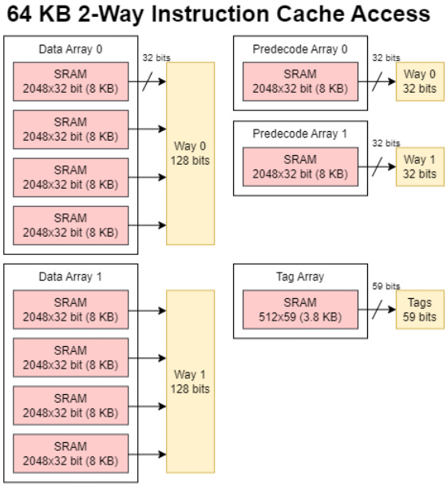
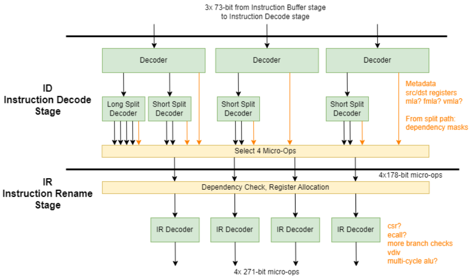
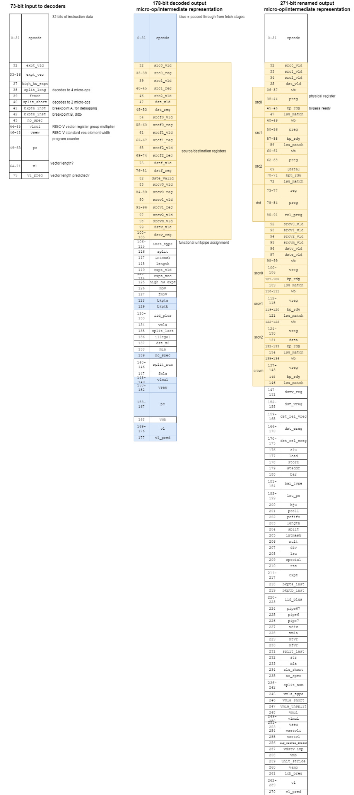
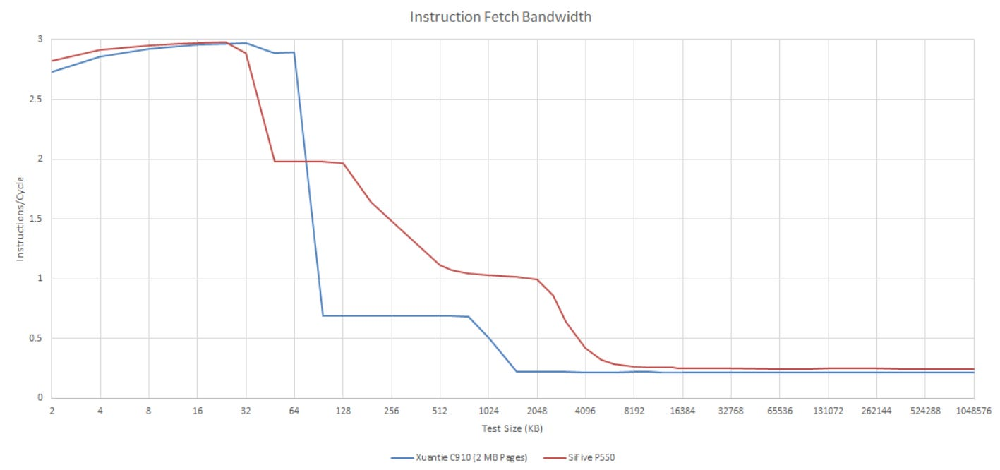
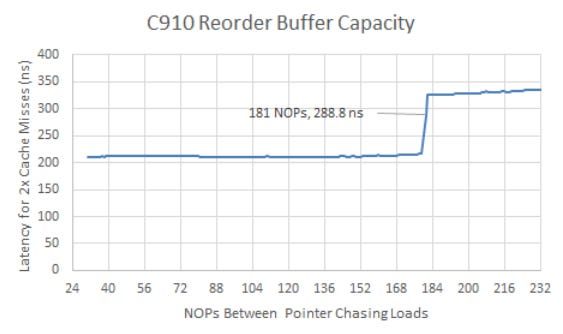
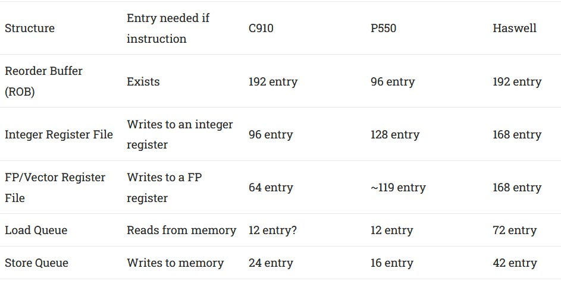
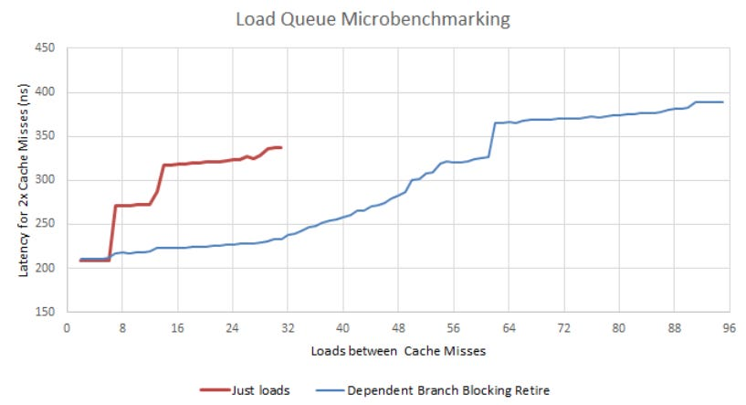
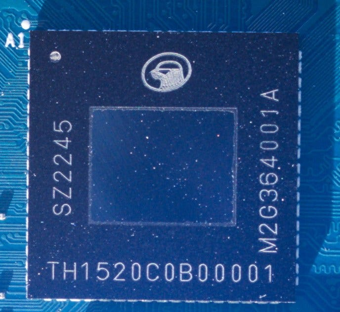

# 从 RTL 到实测：玄铁 C910 微结构深度拆解

> **出处与授权信息**
>
> - 原文：*Alibaba/T-HEAD's Xuantie C910*
> - 原作者：Chester Lam
> - 首发平台：Chips and Cheese
> - 原文日期：2025 年 2 月 4 日
> - 原文链接：https://chipsandcheese.com/p/alibabat-heads-xuantie-c910
> - 中文译注与技术核查：〔发布前填写姓名或公众号署名〕
> - 授权说明：〔发布前填写授权方式与日期；未取得必要授权时不要发布全文〕
> - 内容性质：第三方技术分析的中文译注，非阿里巴巴或平头哥官方材料
> AI 辅助说明：本文使用生成式人工智能协助中文表达整理、移动端排版和静态核对；技术数据、观点归属和最终发布内容应由发布者人工复核。

## 编者导读

玄铁 C910 是较早进入真实芯片的乱序 RISC-V 核之一。Chester Lam 的原文没有停留在“几级流水、几宽发射”的规格表层，而是把公开 RTL、定向微基准和 TH1520 实机测试放在一起，试图回答三个更实际的问题：前端能否持续供给，乱序窗口能否真正利用，存储层次能否跟上执行端的数据需求。

先给出原作者的判断边界：作者肯定 C910 的非对齐访存、向量支持和核间传输延迟；批评则集中在乱序资源配比、TH1520 的共享 L2 延迟与带宽，以及 DRAM 持续读带宽。这里的性能数字来自一块具体的 LicheePi 4A，并不等于所有 C910 IP 配置；“结构失衡导致性能下降”也是需要计数器和单变量实验继续验证的归因，而不是官方定论。

本文保持原文观点、数值和比较对象，不把第三方测试改写成官方事实。标题含“译注”“RTL 核查”或“编者核查”的段落，是为中文读者补充的体系结构解释，不属于 Chester Lam 原文。

## 阅读口径与测试边界

文中证据分为四类：

- **官方资料**：平头哥公开论文或演示中的规格与设计目标；
- **RTL 观察**：从当前公开 OpenC910 Verilog 的数组、位宽和控制逻辑中可以直接核对的实现；
- **作者实测**：Chester Lam 在 TH1520/LicheePi 4A 上运行微基准得到的软件可见行为；
- **作者判断或编者推断**：根据结构与数据作出的解释，需要额外实验建立因果关系。

原文明示的实测平台为 LicheePi 4A：TSMC 12 nm FinFET 工艺的 TH1520、4 个 C910 核、1 MB 共享 L2、核心频率 1.85 GHz、8 GB LPDDR4X-3733。ROB/LQ 容量探测使用相关分支和未完成 load 阻塞退休；DRAM 延迟使用 2 MB 大页和 1 GB 数组；L2 带宽分别报告单核与四核结果。

原文没有完整披露其他微基准的源码版本、操作系统与内核、编译器及优化参数、频率锁定、预热与重复次数、误差范围，也没有逐项注明单核或多核。因此，跨 C910、P550、Goldmont Plus 和 Cortex-A73 的比较只适合观察数量级与结构趋势，不能当作严格同平台排名。

## 一、背景与定位

平头哥是阿里巴巴全资拥有的处理器 IP 公司，并建立了覆盖多个性能层级的 RISC-V 处理器产品线。原文认为，采用 RISC-V 一方面有利于为物联网端点、边缘计算等目标领域构建成本可控的定制芯片，另一方面也有减少对外部处理器 ISA 和 IP 依赖的战略价值。作者特别以 x86-64 和 Arm 背后的美国、英国企业为对照，强调 RISC-V 是不由这些企业控制的开放 ISA，并把平头哥的路线放到中国发展本土芯片能力的背景下理解。后一层属于作者对产业动机的判断，不是微结构事实。

玄铁 C910 位于产品线的“高性能”层级。它既是较早实现为真实芯片的乱序 RISC-V 核之一，也是 RISC-V Vector 0.7.1 的早期采用者，支持掩码和可变向量长度。文章称后继 C920 将向量规范升级到 1.0，而其余部分基本延续 C910；这一产品关系属于文章发表时的概括，分析具体芯片时仍应核对型号和实现配置。

*图 1：平头哥处理器产品线与 C910 架构概览*

C910 面向 AI、边缘服务器、工业控制和高级驾驶辅助系统等场景。它是平头哥第一代乱序核，可以组成最多四核的簇，并在簇内共享 L2。官方资料给出的 12 nm 目标为 2–2.5 GHz、单核约 0.8 mm²；2 GHz 时电压约 0.8 V，2.5 GHz 时约 1.0 V；7 nm 实现达到 2.8 GHz。官方还报告动态功耗约 `100 µW/MHz`，按 2 GHz 线性换算约为 0.2 W，但这个数字不包括静态功耗和核外逻辑。作者据此把 C910 定位为低功耗、小面积设计。

下图是作者在官方版图上增加红色注释后的单核图。图中 PIU 与 PLIC 出现在后面的双核版图中。

*图 2：作者标注后的 C910 单核版图*

*图 3：C910 双核版图*

原文的所有实测均来自上述 TH1520 平台。不能把“TH1520 上的 C910”与“论文中可配置到不同 L2 容量的 C910 IP”完全等同，也不能把实机 Linux 测量值直接当成当前仓库 RTL 仿真的固定参数。

## 二、核心总览

C910 是三指令宽、乱序执行、12 级流水的处理器。官方流水级从取指、指令打包、缓冲、译码和重命名，延伸到分布式发射、寄存器读取、执行、写回与退休。不同执行管线经过的级数并不完全相同，“12 级”描述的是总体组织，不表示每一类指令都固定经历十二个同名寄存级。

*图 4：官方给出的 C910 12 级流水线*

作者指出，C910 与 Arm Cortex-A73 类似，可以在指令最终退休之前较早释放部分乱序资源。为了通过微基准探测容量，作者使用相关分支和未完成 load 阻塞退休，从而避免被测指令很快流出窗口。这个方法的核心是让某种结构先达到稳定占用，再从吞吐或延迟曲线的拐点反推容量；它测到的是软件可观察的有效容量，仍需与 RTL 物理表项数互证。

*图 5：作者整理的 C910 核心高层数据通路*

### 译注｜宽度、级数与窗口是三个不同维度

三发射宽度限制理想情况下每周期可接收多少条 ISA 指令；四微操作译码/重命名宽度限制复杂指令拆分后每周期可送入后端多少个内部操作；12 级流水线影响各机制的基本延迟和误预测恢复代价；ROB、物理寄存器和调度器容量决定处理器能在等待长延迟事件时观察多远。任何一个维度不足都可能压低 IPC，因此不能只凭“3-wide”判断处理器快慢。

## 三、前端：取指与分支预测

### 指令 Cache 与预译码

C910 要同时处理 16 位压缩指令、32 位普通指令和向量指令。其 L1 I-Cache 为 64 KB、2 路组相联、FIFO 替换。除了指令字节，每个可能的 16 位指令起点还保存 4 位预译码信息：其中两位用于初步标识该位置是否为指令起点，另外两位携带分支信息。把数据、tag 和这些预译码位合计，文章估算指令 Cache 使用约 83.7 KB 原始位存储。

*图 6：64 KB、2 路 L1 I-Cache 的存储组成*

一次 L1 I-Cache 访问会同时读取两路的指令字节、预译码数据和 tag。因此 IF 级的临时寄存器一度接收两路共 256 位指令数据和 64 位预译码数据，再由两路 tag 比较确定真正命中的一路。与此同时，IF 级查询一个 16 项全相联 L0 BTB，使少量重复 taken 分支可获得接近单周期的早期目标供给。

两路数据随后进入 IP（Instruction Pack，指令打包）级。RTL 中有两个各 8 路的早期译码块，每个槽对应一个 16 位边界，两路合计检查 16 个候选起点。早期译码只做分类和边界等初步工作；对向量指令还会形成与向量长度配置、所选元素宽度和最大元素数有关的信息。原文把这里概括成“算出 VLEN、VSEW、VLMAX”，其中 VLEN 在 RISC-V 向量术语中通常是实现固定的向量寄存器位宽，并非每条指令动态算出的值；动态状态应重点区分 VL、VSEW、LMUL 与由它们约束的 VLMAX。

这里必须澄清一个容易误读的数字：物理 SRAM 同时读出两路，所以内部暂时出现 `2 × 128 = 256` 位；但组相联 Cache 每次只会有一路命中，错误一路的 8 个候选槽全部丢弃，送往后续级的有效取指窗口仍是命中一路的 128 位。它不是“每周期向后端提供 256 位指令”，更不是“8 字节等于 128 位”。在压缩指令全为 16 位时，一个 128 位窗口最多包含 8 条；若全为 32 位，最多包含 4 条，最终供给还受分支边界和三指令译码宽度限制。

*图 7：作者绘制的简化前端数据流*

### 主分支预测器

C910 的主要预测机制位于 IP 级。条件分支使用 bi-mode 预测器，文章从 RTL 识别出：

- 1024 项选择表；
- 两张各 16384 项、每项 2 位饱和计数器的历史表，分别偏向 taken 和 not-taken；
- 22 位全局历史寄存器；
- 12 项返回地址栈；
- 256 项间接目标数组。

选择表索引由分支地址低位与全局历史哈希形成，历史表还会使用全局历史的更高位进行哈希，选择表输出决定使用 taken 表还是 not-taken 表。文章估算全部主要预测存储约 17.3 KB，并把它视为符合低面积、低功耗目标的小型预测器。原文拿 Qualcomm Oryon 的约 80 KB 条件方向预测存储和约 40 KB 间接预测存储作数量级对照；跨时代、跨目标产品的容量比较只能说明设计预算差异，不能单独证明准确率高低。

*图 8：作者从 RTL 整理的分支预测资源*

作者用不同长度的随机分支模式测试历史识别能力。C910 能处理一定长度的模式，表现与作者测过的其他低功耗核大致相当；当同时存在很多分支时，C910 和 Cortex-A73 都会明显变差，而分支数量较少且所需历史不过长时仍能保持较好准确率。

*图 9：C910 的随机分支模式识别结果*

*图 10：Cortex-A73 的随机分支模式识别结果*

主 BTB 为 1024 项、4 路组相联。由 IP 级重定向会制造一个显式流水空泡，软件观察到的 taken 分支延迟约为 2 周期；当分支集合超出主 BTB 容量但代码仍命中 I-Cache 时，作者测得约 4 周期。这里的“taken 延迟”是特定依赖微基准下的有效代价，不应直接替代完整程序中的误预测恢复周期。

*图 11：taken 分支延迟随分支工作集变化*

### 指令缓冲与循环缓冲

IP 级最多向 IB（Instruction Buffer）级交付 8 个 16 位槽及其早期译码信息。IB 使用 32 项指令队列和独立的 16 项循环缓冲来吸收前端供给波动；两者均以 16 位为一项，所以一条 32 位指令占两个槽。原文把循环缓冲的目标类比为 Pentium 4 trace cache 的一部分作用：在短循环 taken 回跳后补足原本会丢失的前端槽位。两者的组织和规模并不相同，C910 的 16 槽 LBUF 只覆盖很小的循环，也不会增大峰值译码宽度。

向正式译码级供给时，IB 可以从循环缓冲、指令队列或旁路路径选择。每条指令连同早期译码元数据被打包成 73 位格式。旁路用于在无需排队时减少额外延迟，队列用于解耦取指波动与译码消耗。

### 译注｜怎样判断前端是否真的构成瓶颈

“I-Cache 128 位读取”“最多 8 个 16 位候选槽”和“每周期 3 条 ISA 指令”是不同层级的上限。真实有效供给还要依次乘上 I-Cache 命中、正确路选择、分支预测正确、指令边界可用、IB 非空和译码接收等条件。分析完整程序时应联合观察：

1. I-Cache 与 ITLB MPKI；
2. BTB、方向、RAS 和间接分支的分类 MPKI；
3. 每次重定向或误预测造成的恢复周期；
4. IB 空、LBUF 命中、译码零输入和每周期有效译码条数；
5. 代码工作集扩大后 IPC 是否从接近 3 急剧下降。

只有“分支 MPKI 高且恢复周期占比高”才能把主要责任归到预测器；若预测准确而 IB 经常空，应继续检查 I-Cache、ITLB、BTB 目标供给和取指跨行行为。

## 四、前端：译码与重命名

ID（Instruction Decode）级接收三路 73 位输入，由主译码器提取寄存器信息，并在必要时把一条 ISA 指令拆为多个微操作。三个槽都能为简单指令产生 1–2 个微操作，但每周期总输出不超过 4 个微操作；只有第一个译码槽可以处理会展开为 4 个或更多微操作的复杂指令。此类复杂指令会阻止同周期的并行译码。

译码后的微操作为 178 位，直接进入 IR（Instruction Rename）级。C910 在译码和重命名之间没有许多现代核所设的独立微操作队列，因此两级宽度需要直接匹配：重命名为 4 微操作宽，译码总输出也限制为每周期 4 微操作。

*图 12：译码到重命名的数据流*

重命名级检查架构寄存器匹配，建立指令间真依赖，并从整数或浮点物理寄存器池分配空闲寄存器；刚从退休级释放的寄存器也可直接再次分配。该级还继续补充多周期 ALU 类型、可用执行端口等控制信息。经过重命名后，一个微操作的打包宽度达到 271 位。这个位宽包括大量控制和依赖元数据，不表示每条指令都搬运 271 位有效数据。

*图 13：作者对各阶段微操作格式的 RTL 笔记*

图 13 的图内字段可按下面三组理解。位号和信号名保留原图，中文解释说明其职责；原图在 `vl`、`vl_pred` 等名称后带有问号，表示作者当时仍在推测，本文不把问号消去。

- **73 位译码输入**
  - `opcode[31:0]`：32 位原始指令数据
  - `expt_vld`、`expt_vec`、`high_hw_expt`：异常有效、异常向量和高半字异常信息
  - `split_long`、`split_short`：分别提示译码为较多微操作或两个微操作
  - `fence`、`bkpta_inst`、`bkptb_inst`、`no_spec`：屏障、两类断点和禁止推测属性
  - `vlmul`、`vsew`、`pc`、`vl`、`vl_pred`：向量寄存器分组、元素宽度、程序计数器，以及作者标作可能的向量长度/预测信息
- **178 位译码输出**
  - `src0/1/2_vld`、`src0/1/2_reg`、`dst_vld`、`dst_reg`：最多三个源和一个目的架构寄存器的有效位与编号
  - `srcv0/1/2_vld`、`srcv0/1/2_reg`、`dstv_vld`、`dstv_reg`：向量源/目的寄存器信息
  - `inst_type`、`split`、`intmask`、`length`：指令类型、拆分、整数掩码和指令长度等控制
  - `mov`、`fmov`、`iid_plus`、`illegal`、`dst_x0`、`mla` 等：move/FPU move、指令标识增量、非法指令、写 x0、乘加等译码属性
  - `vmla`、`split_last`、`vlmul`、`vsew`、`pc`、`vmb`、`vl`、`vl_pred`：向量乘加/拆分尾项和从取指侧继续传递的向量、PC 信息；原图蓝色表示沿取指级透传
- **271 位重命名输出**
  - `preg`、`vreg`、`rel_preg`：重命名后的标量/向量物理寄存器及待释放物理寄存器
  - `bp_rdy`、`lsu_match`、`data`、`wb`：旁路就绪、LSU 匹配、内联数据和写回控制
  - `srcv*_vld`、`dstv_vreg`、`dst_rel_vreg`、`dst_ereg`：向量源、向量目的、待释放向量寄存器和扩展目的寄存器
  - `alu`、`load`、`store`、`staddr`、`bar`、`bar_type`：ALU、load、store、store 地址和屏障类别
  - `lsu_pc`、`bju`、`pcall`、`pcfifo`、`mult`、`div`、`special`、`rts`、`expt`：LSU PC、分支跳转、调用、PC FIFO、乘除法、特殊操作、返回和异常属性
  - `pipe6/7`、`vdiv`、`vmla`、`mtvr`、`mfvr`、`unit_stride` 等：执行管线选择和向量除法、乘加、标量/向量搬运、单位步长访存等属性

从教学角度看，位宽从 73 增至 178，再增至 271，并不是操作数数据越来越宽，而是指令越接近后端，必须携带的控制、依赖、物理寄存器和端口选择信息越来越多。图中部分字段的精确定义仍应以对应 RTL 信号赋值为准。

作者的软件微基准显示，只要代码完全位于 64 KB L1 I-Cache，C910 前端可持续达到每周期 3 条指令；当代码供给落到 L2，前端吞吐低于 1 IPC。对照的 SiFive P550 在更大代码工作集下更稳定，甚至从 L3 取代码时仍能维持约 1 IPC。该图反映的是特定代码布局与测试平台的取指吞吐，不代表通用 benchmark 的总 IPC。

*图 14：不同代码工作集下的取指吞吐*

## 五、乱序执行引擎

### ROB：64 个物理表项与约 192 条指令容量

C910 使用物理寄存器文件式乱序执行：尚未退休的推测结果和已经提交的架构结果都存放在 ROB 之外的物理寄存器文件，ROB 主要负责顺序、完成和异常状态。`ct_rtu_rob.v` 确实例化 64 个 ROB 表项，而官方论文称最多可容纳 192 条指令，作者的容量微基准也大体支持后一个数字。

*图 15：微基准观察到的 ROB 有效容量*

以上是原文保留的三项观察：RTL 文件中有 64 个表项，官方论文写最多 192 条指令，作者微基准大体接近 192。原文没有进一步解释 64 与 192 如何对应，也没有在此处使用“折叠 ROB”这一术语。

### RTL 核查｜当前仓库如何解释 64 与 192

本文另行核查当前仓库 RTL 后发现，一个物理 ROB 表项可以聚合最多三条满足条件的顺序指令，并以完成计数等字段跟踪组内状态。因此，物理索引空间是 64 项，而理想情况下最多可代表约 `64 × 3 = 192` 条 ISA 指令。真实程序能否接近 192 取决于指令类型、聚合条件、异常与控制信息，以及其他资源是否先满。

这一段是本文基于当前仓库 RTL 作出的解释，不是 Chester Lam 原文的结论，也不应反向改写官方论文的“最多 192 条指令”口径。把它简单写成“192 个物理 ROB 表项”会误解实现，把它简单写成“最多 64 条在途指令”也不准确。

文章认为这一理论指令窗口与 2013 年 Intel Haswell 的 192 项 ROB 容量相当，并大于 P550 或 Goldmont Plus，但 C910 的物理寄存器和调度器没有按同等比例扩大。这个比较的重点不是说两者具有相同乱序能力，而是说明 ROB 指令容量只有在其他结构同步匹配时才有价值。

C910 有 96 项整数物理寄存器和 64 项浮点/向量物理寄存器。RISC-V 各有 32 个架构整数和浮点寄存器；按作者的简化估计，保留已提交状态后，留给在途结果的大约是 64 个整数和 32 个浮点寄存器。精确可分配数量还受零寄存器、重命名规则和实现保留项影响，但“物理寄存器可能早于文章所称的 ROB 指令容量耗尽”符合原文的判断方向。

*图 16：C910、P550 与 Haswell 的关键乱序结构容量对照*

图中的全部容量转录如下。`entry`、问号和约数均按原图保留；特别是原图把 C910 写成 `192 entry`，这与上文从 RTL 看到的 64 个物理表项不是同一种表述，本文不替作者重写该表。

- **ROB**
  - 何时需要分配：所有进入乱序窗口的指令
  - C910：192 entry（原图原词）
  - P550：96 entry
  - Haswell：192 entry
- **整数物理寄存器**
  - 何时需要分配：写整数寄存器
  - C910：96 项
  - P550：128 项
  - Haswell：168 项
- **浮点/向量物理寄存器**
  - 何时需要分配：写浮点寄存器
  - C910：64 项
  - P550：约 119 项
  - Haswell：168 项
- **Load Queue**
  - 何时需要分配：从内存读取
  - C910：约 12 项，原图带问号
  - P550：12 项
  - Haswell：72 项
- **Store Queue**
  - 何时需要分配：向内存写入
  - C910：24 项
  - P550：16 项
  - Haswell：42 项

### 执行端口与整数调度

文章按后端功能统计出 8 个执行端口。标量整数侧有两个端口处理常见 ALU 运算，另一个端口专用于分支。整数物理寄存器文件有 10 个读端口，为包含三条存储相关管线在内的五条执行管线供数。C910 使用分布式调度器；每个调度项除操作码和寄存器匹配信息外，还包含 7 位年龄向量，用于让仲裁优先选择较老的就绪操作。

常用 ALU 调度容量只有 16 项。原文对照 P550 的 3 个 ALU 端口共享约 40 项调度容量，以及 Goldmont Plus 的约 30 项。不同处理器的“scheduler entry”分组方式和可接受操作类型并不完全一致，因此这些数值适合做结构预算对比，不适合直接换算性能。

*图 17：整数调度器与执行端口*

### 浮点与向量执行

FPU 采用两条执行管线，两条都能处理常见加法、乘法、融合乘加和 128 位向量操作。一个 FMA 需要读取三个源操作数，带掩码的向量操作还可能需要第四个源。与 AVX-512 和 SVE 的独立掩码寄存器不同，RVV 的掩码占用向量寄存器，因此这些输入都来自浮点/向量物理寄存器文件。虽然浮点/向量端口数量少于整数侧，寄存器文件仍需提供接近整数侧数量的读端口。

*图 18：浮点/向量调度器与执行端口*

作者测得常见浮点运算延迟约为 3–5 周期：加法 3 周期、乘法 4 周期、FMA 5 周期；图中 P550 为 4/4/4，Cortex-A73 为 3/3/5。原文指出 Cortex-X2、Golden Cove、Zen 5 等更新的大核可达到 2 周期浮点加法，但认为不应对低功耗 C910 提出同样目标。

*图 19：常见浮点操作延迟对照*

### 译注｜为何“大 ROB、小调度器”会失衡

ROB 决定处理器最多能保留多远的程序顺序，但只有进入调度器且源操作数就绪的微操作才可能利用执行端口。如果常用 ALU 调度器先满，重命名端即使还有 ROB 空间也会被反压；如果物理寄存器先耗尽，新的写寄存器指令不能重命名；如果 LQ、SQ 或 miss 缓冲先满，访存链也无法继续向前。因此必须同时看 ROB、各类 IQ、PRF 空闲表、LQ/SQ 和 LFB 的占用与满阻塞周期。

“结构容量不平衡”在这里是一个待验证的归因。要证明它是某个 benchmark 的主瓶颈，需要看到：ROB 尚有空闲时，某个小结构频繁满；扩容该结构后阻塞周期下降；IPC 或总周期随之改善；时序、面积和功耗代价仍可接受。只看容量表不能完成因果闭环。

## 六、存储子系统

### 地址生成、TLB 与存储队列

C910 有两个地址生成单元：一个处理 load，一个处理 store。LSU 大体分为 load 和 store 两条管线，目标是每周期最多完成一次 load 地址和一次 store 地址处理。与许多乱序核一样，一条 store 会拆成地址微操作和数据微操作，使地址可以在 store 数据尚未就绪时提前解析。

*图 20：官方 LSU 流水线*

数据访问使用 39 位虚拟地址并形成 40 位物理地址。数据侧一级 uTLB 为 17 项全相联，其中公开 RTL 可进一步解释为 16 个普通页项加 1 个大页项。L1 TLB 未命中后访问统一 JTLB；JTLB 为 1024 项、4 路组相联，即 256 组×4 路，文章称相对一级命中增加约 4 周期。

JTLB 数据阵列由两个 `256×84` SRAM 组成，tag 阵列为一个 `256×196` SRAM；一次 tag 访问包含四路 tag 和 4 位 FIFO 替换状态。每个 tag 除 VPN 和有效位外，还包含 16 位 ASID 与 global 位，以便地址空间切换时保留不必失效的转换。文章估算 tag 与数据合计约 8.96 KB 原始位存储。

*图 21：JTLB tag 字段与存储组织*

地址转换完成后，物理地址进入 load 或 store 队列。文章对 LQ 大小持保留态度：RTL 迹象指向 12 项，但微基准结果并不清晰。RTL 中每个 LQ 项保存 36 位 load 物理地址、16 位字节有效信息和 7 位指令标识；SQ 项则保存 40 位物理地址、待写数据、16 位字节有效位、7 位指令标识以及其他控制字段。相关辅助结构还包括 12 项 wakeup queue、4 位 store-data 标识，以及各 12 项的年龄关系向量。它们共同承担依赖唤醒、顺序判断和转发控制。

*图 22：作者的 load 队列容量微基准*

### Store-to-load 转发与非对齐访问

RTL 的内存依赖比较会使用地址位 `[11:4]`。作者的软件测试显示，只要 load 的所有字节完全包含在较老 store 覆盖范围内，C910 可以不受 store 内部对齐位置影响地转发；但 load 跨越 16 字节对齐边界，或 store 跨越 8 字节对齐边界时，转发会失败，并出现 20 周期以上的代价。

*图 23：不同 load/store 对齐组合下的转发结果*

文章认为 C910 对普通非对齐访问处理良好：load 不跨 16 字节边界、store 不跨 8 字节边界时基本没有额外代价；跨越边界时通常只需在内部增加一次 L1 D-Cache 访问。作者把它评价为略低于当时最新 Intel/AMD 核，但大体达到 AMD Piledriver 的能力层级，也明显好于其测试中的 P550。跨处理器比较仍依赖指令宽度、Cache 命中和测试方法，图中的具体边界才是最可复现的结论。

### 译注｜转发失败为何会放大为二十多个周期

store 数据已经存在于 SQ 并不意味着任意覆盖关系都能低成本拼接。转发网络需要同时完成地址匹配、年龄判断、字节掩码选择、可能的多项合并和对齐；跨内部边界会增加比较器、选择器和关键路径。实现通常只支持最常见的单项、单边界情况，复杂情况则让 load 回放，等待 store 提交或重新访问 Cache。最终代价包含错误唤醒、流水回放和重新执行，不只是一次多路选择器延迟。

在完整程序中应同时统计 store-forward 尝试、成功、失败原因、load replay 和由回放造成的零退休周期。只有非对齐或别名模式出现足够频繁时，转发边界才会成为主要性能瓶颈。

## 七、数据 Cache

L1 D-Cache 为 64 KB、2 路组相联、3 周期命中延迟，并划分为 4 字节宽的 bank。它可以每周期处理最多一个 load 和一个 store，但 128 位 store 需要两个周期。load 与 store 使用分离的 tag 阵列，使两类请求能够并行检查地址。

*图 24：64 KB、2 路 L1 D-Cache 的存储组成*

Cache miss 由 8 个 line-fill buffer 项跟踪，每项保存 miss 地址；回填数据暂存在两个 512 位宽寄存器中。D-Cache 与 I-Cache 一样使用 FIFO 替换。LFB 数量决定同一时刻能追踪多少个尚未完成的 line miss，但有效内存级并行度还受 LQ、TLB、总线信用和依赖链限制。

### 译注｜3 周期 L1 命中仍可能拖慢核心

load-to-use 延迟只有在消费者依赖 load 结果时才直接进入关键路径。若存在足够多独立工作，乱序窗口可用其他指令覆盖这 3 周期；若程序是链式指针追踪，每次 load 的地址依赖上一次结果，则几乎没有可重叠空间。另一方面，bank 冲突、地址生成端口冲突、TLB miss 和 store-forward 回放会让“标称 3 周期”变成更长的有效延迟。分析时应把 L1 命中 load、L1 miss、TLB miss、回放和端口等待分开。

## 八、L2 Cache 与互连

### 从核心到 CIU

原文把每个 C910 核与外部连接的接口称为 PIU（Processor Interface Unit），簇的另一端由 CIU（Consistency Interface Unit）接收最多四个核心的请求并维持一致性。公开 RTL 的模块边界中，BIU、PIU 和 CIU 的命名层次比文章的简图更细，因此“每核经 PIU 接入”应理解为功能性概括，而不是唯一模块层次定义。

CIU 包含两个 SNB 实例，按物理地址位 `[6]` 将相邻 64 B Cache line 分到两个 bank。当前 RTL 显示每个 SNB 内有 24 项 SAB，其中 16 项用于读类事务、8 项用于写类事务；SNB 按年龄仲裁，并通过 512 位接口访问 L2。这比原文笼统的“24 项请求队列”更准确：24 是每个 SNB 的在途一致性事务跟踪容量，不是整个双 bank CIU 合计只有 24 项。

### L2 组织

在 TH1520 中，L2 容量为 1 MB、16 路组相联、FIFO 替换，并兼任 L1 miss 的下一级和四核簇共享末级 Cache。L2 以物理地址位 `[6]` 选择两个 bank，能够让相邻 Cache line 进入不同 bank；它对上层 Cache 保持包含关系，并用 ECC 保护数据完整性。

*图 25：1 MB、16 路共享 L2 的存储组成*

作者在 TH1520 上测得 L2 访问约 60 周期，并认为对于没有中间级 Cache、可利用乱序资源受限的 C910 来说过高。原文对照 P550 的 4 MB L3 以及 Goldmont Plus 约 28 周期的共享 L2 延迟。由于各测试的频率、TLB 路径、预取、测量链和 Cache 定义不同，这种对照应看数量级，不能当成严格同条件排名。

*图 26：TH1520 的 Cache 与内存访问延迟*

### L2 与 DRAM 带宽

单个 C910 核从 L2 读取略高于 10 GB/s，按 1.85 GHz 换算约 5.5 B/cycle。四核合计读取约 12.6 GB/s，即平均每核约 1.7 B/cycle；四核合计写带宽约 23.81 GB/s，仍低于整个簇每周期 16 字节，而且一般程序的读流量往往比写流量更常见。原文认为这些结果不仅落后于对照的 P550 L3 和 Goldmont Plus L2，也意味着多线程程序容易触及共享 L2 读带宽限制。

*图 27：三种四核平台的读取带宽随工作集变化*

离开处理器簇的请求通过 128 位 AXI4 接口。LicheePi 4A 的 64 位 LPDDR4X-3733 理论峰值略低于 30 GB/s，但作者测得多线程持续读取约 4.2 GB/s。四核共享的末级 Cache 只有 1 MB 时，大工作集很快落到 DRAM，因此可实现带宽会直接限制多核和向量吞吐。

使用 2 MB 大页和 1 GB 数组时，作者测得 DRAM 延迟约 133.9 ns。原文对照表如下；它比较的是整个平台而非单纯 CPU 核，内存控制器、DRAM 配置、页大小和软件环境都在结果中。

- **LicheePi 4A / TH1520**
  - 处理器配置：4×C910
  - 作者测得读带宽：4.17 GB/s
  - 作者测得 DRAM 延迟：133.86 ns
- **Eswin EIC7700X**
  - 处理器配置：4×P550
  - 作者测得读带宽：17.91 GB/s
  - 作者测得 DRAM 延迟：193.92 ns
- **Intel Celeron J4125**
  - 处理器配置：4×Goldmont Plus
  - 作者测得读带宽：12.70 GB/s
  - 作者测得 DRAM 延迟：186.63 ns
- **Amlogic S922X**
  - 处理器配置：4×Cortex-A73
  - 作者测得读带宽：7.96 GB/s
  - 作者测得 DRAM 延迟：139.79 ns

*图 28：四种低功耗平台的 DRAM 带宽与延迟*

### 核间传输延迟

一致性协议有时必须把脏数据或所有权从一个核心转移到另一个核心。作者编写了与 AnandTech 同类的核间延迟微基准，并认为结果可作大致对照。TH1520 四核矩阵中的核间值约为 61–64 ns；作者评价 CIU 的核间传递速度合理，并明显好于其测得簇内超过 300 ns 的 P550 平台。图中非对角线数值完整转录如下，单位为 ns：

- **核 1**
  - 核 1：—
  - 核 2：62.75
  - 核 3：63.10
  - 核 4：63.05
- **核 2**
  - 核 1：64.05
  - 核 2：—
  - 核 3：62.65
  - 核 4：63.60
- **核 3**
  - 核 1：63.15
  - 核 2：62.45
  - 核 3：—
  - 核 4：61.75
- **核 4**
  - 核 1：62.50
  - 核 2：61.90
  - 核 3：61.75
  - 核 4：—

*图 29：TH1520 四核之间的传输延迟矩阵*

### 译注｜为什么 L2 延迟与带宽必须同时看

延迟回答“一个孤立 miss 多久返回”，带宽回答“很多请求并行时每周期能完成多少数据”。指针追踪往往受延迟限制；流式数组、多个核和向量代码更容易受带宽限制。C910 若要隐藏约 60 周期 L2 延迟，需要在此期间持续发现独立工作并维持多个 miss；但调度器、物理寄存器、LQ 和 8 个 LFB 都可能先限制并发。于是“高 L2 延迟”和“有限乱序支撑资源”会互相放大。

对当前 RTL 的瓶颈研究，不能只复现一个平均延迟。至少应分别测：

1. L1、JTLB、L2 和外部内存的无依赖吞吐与依赖链延迟；
2. outstanding miss 数从 1 增加到结构上限时的带宽曲线；
3. 单核与多核、奇偶 Cache line bank 分布、读写混合比例；
4. ROB/IQ/LQ/LFB 占用、满阻塞周期和 load 在 ROB 头部等待周期；
5. 预取带来的覆盖、及时性、污染与额外总线流量。

## 九、原文总结与作者结论

作者认为，作为平头哥第一代乱序核，C910 已有不少成熟之处：核间传递延迟、非对齐访问和向量支持优于其测试过的 P550 平台；L2 可配置到 8 MB，多簇配置也提供了扩展核心数的可能性。原文引用官方论文中的产品目标：面向 AI、边缘服务器、工业控制和 ADAS，并预计到 2022 年相关玄铁 910 产品总量达到 1500 万颗。该数字是 2020 年材料中的预期，不是本文核验的实际出货量。

*图 30：Hot Chips 2024 展示的 TH1520 芯片，并非作者测试的那一颗*

作者的批评更集中在“结构平衡”与“存储供给”：

- 文章所称的 ROB 指令容量较大，但常用调度器和可用于推测状态的物理寄存器较少，可能无法充分利用远距离窗口；
- TH1520 上的共享 L2 既小又慢，且核心与共享 L2 之间没有中间级 Cache；
- 实测 L2 读带宽扩展性和 DRAM 持续读带宽偏低；
- 核心因 L2 延迟和带宽不足而需要更多在途工作，但支撑结构又可能先满，形成互相强化的限制；
- 向量指令提高单位指令的数据需求，若存储层次不能持续供数，向量执行能力也难以充分利用。

原文最后希望平头哥利用 C910 的经验继续改进后续核心，并认为阿里巴巴的支持应能提供充足研发资源；作者也希望看到更多开源乱序设计。作者特别肯定公开 RTL 的研究价值：研究者能直接看到微操作格式如何随流水阶段变化，也能理解“译码”实际上分散在早期边界识别、主译码、重命名控制补充等多个阶段，而不是只存在于名为 Decode 的一级。

原文最后还有支持 Chips and Cheese 的 Patreon、PayPal 和 Discord 邀请；与处理器技术无关，在此完整记录其存在而不展开宣传链接。

## 十、编者核查：这篇分析最有价值的结论与限制

这篇分析最有价值之处不是一句“C910 存储系统弱”，而是提供了可以继续验证的机制链：

> **译注提出的待验证机制链**
>
> 1. TH1520 上 L2 约 60 周期、四核 L2 读带宽扩展有限、DRAM 读带宽低；
> 2. 核心需要更多独立指令和并发 miss 来隐藏等待；
> 3. 常用 ALU 调度器、物理寄存器、LQ/LFB 等资源可能先于文章所称的 ROB 容量耗尽；
> 4. 后端反压、not-ready 等待和 ROB 头部 load 阻塞上升；
> 5. 零退休周期增加，实际 IPC 下降。

这条链中的结构容量多数可从 RTL 核对，平台延迟与带宽可由微基准观测，但“哪一项是某个实际 benchmark 的第一瓶颈”仍需性能计数器和单变量 RTL 实验回答。合理的研究顺序是先按 case 建立证据，再决定扩调度器、增 PRF、提高 miss 并行度，还是优化 L2/互连。直接同时修改多项结构会失去归因，也无法判断收益来自哪里。

同样，文章的前端结论应拆成两部分：L1 I-Cache 内可维持 3 IPC，说明小代码工作集下峰值供给与三宽译码匹配；代码落入 L2 后低于 1 IPC，说明大代码工作集可能暴露取指下层延迟或带宽。要确认当前 RTL 是否同样受限，需要扫描代码 footprint，并同步采集 I-Cache/ITLB miss、IB 空、BTB miss 和取指请求延迟，而不是直接套用 TH1520 数值。

## 资料链接与发布声明

- 英文原文：https://chipsandcheese.com/p/alibabat-heads-xuantie-c910
- OpenC910：https://github.com/XUANTIE-RV/openc910
- IFU 早期译码 RTL：https://github.com/XUANTIE-RV/openc910/blob/main/C910_RTL_FACTORY/gen_rtl/ifu/rtl/ct_ifu_ipdecode.v
- ROB RTL：https://github.com/XUANTIE-RV/openc910/blob/main/C910_RTL_FACTORY/gen_rtl/rtu/rtl/ct_rtu_rob.v
- bi-mode predictor 论文：https://people.eecs.berkeley.edu/~kubitron/courses/cs152-S04/handouts/papers/p4-lee.pdf

英文原文、原始图表及其中引用材料的权利归原作者、Chips and Cheese 与相应权利人所有。中文译注发布前应取得覆盖文字、配图和目标发布方式的必要授权；注明出处和原文链接不替代授权。

**阅读原文设置：**请在微信公众号后台把“阅读原文”链接设为：

https://chipsandcheese.com/p/alibabat-heads-xuantie-c910
