# Zen 4 跑游戏时，流水线时间都花在哪里

> 英文标题：Hot Chips 2023: Characterizing Gaming Workloads on Zen 4
> 撰文：Chester Lam
> 首发：Chips and Cheese，2023 年 9 月 6 日
> 链接：https://chipsandcheese.com/p/hot-chips-2023-characterizing-gaming-workloads-on-zen-4

Zen 4 的端口延迟已有 uops.info 与多篇拆解，Hot Chips 2023 也没有发布大量新细节。这篇文章换一个角度：用 Zen 4 新增的 Pipeline-slot PMU 事件，观察真实游戏为何只能得到低 IPC。

测试平台为 Ryzen 9 7950X3D，16 核分两个 CCD，其中一个有 96 MB 3D V-Cache。两款游戏都固定到 V-Cache CCD，并关闭 Core Performance Boost，让所有核心最高 4.2 GHz。场景分别是《上古卷轴 Online》Blackrose Prison 刷经验，以及《使命召唤：黑色行动冷战》Zombie Outbreak Collapse。

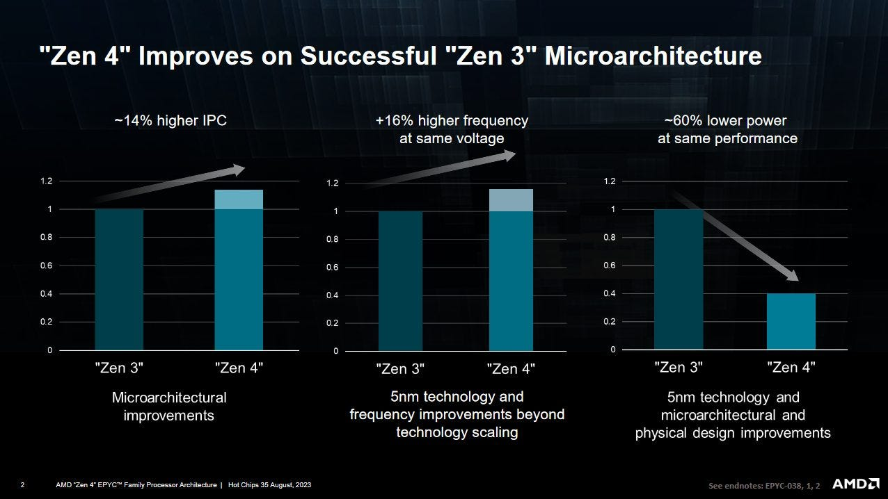

Zen 4 新 PMU 可按六宽 Rename 的每个 Slot 归因；此前 AMD 多只能按 Cycle，Intel 自 Sandy Bridge 起已有相近能力。

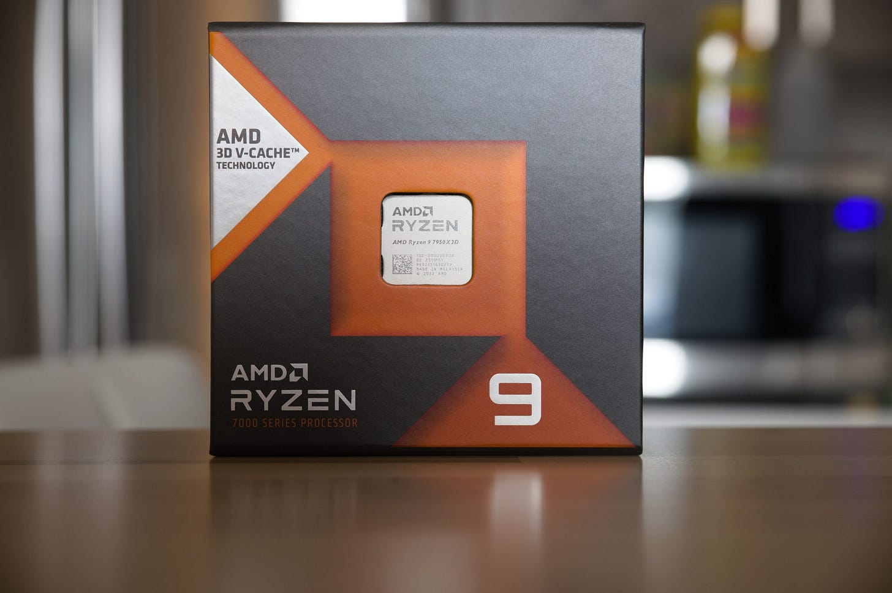

多人游戏不完全重复，且 Zen 4 只有六个 Programmable Counter，数据必须多 Pass 收集。因此目标是高层画像，不应比较到小数点差异。

## 高层：六宽机器只有少量 Useful Slot

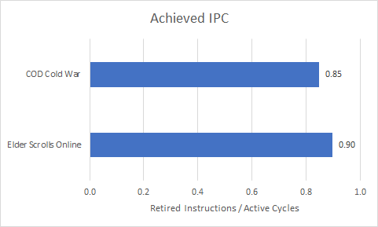

Zen 4 可持续六 Micro-op/cycle，多数指令一个 Micro-op，因此也近似六指令宽。

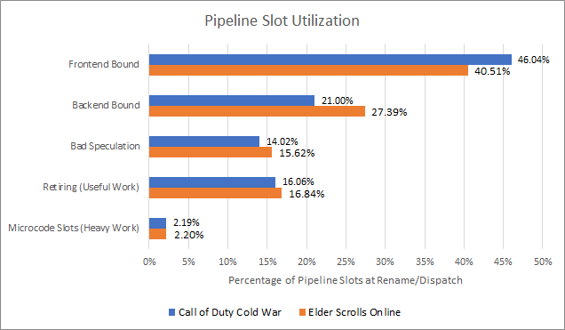

Rename 是持续吞吐上限，某拍空 Slot 无法靠下一拍超过六条补回。两款游戏主要 Frontend-bound，也明显 Backend-bound，并因 Bad Speculation 损失；真正 Useful Work 只占较小部分。

## Frontend：主要是 Latency，不是持续 Bandwidth

AMD 把 Rename 未用 Slot 分为：整拍没有 Micro-op 是 Frontend Latency-bound；有一些但不足六条，余下是 Bandwidth-bound。

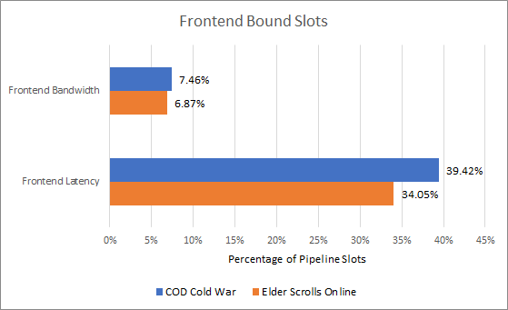

Latency 占绝对多数，来源包括 Instruction Cache Miss 与 Branch Predictor Delay。

Zen 4 有 144 项 Loop Buffer、6.75K Micro-op Cache 和 32 KB L1I。两款游戏几乎没有 Tiny Hot Loop，Loop Buffer 可忽略；Micro-op Cache Hit Rate 70%～81%，L1I 为 71%～77%。但换成每千指令 Miss，L1I 高达 17～20 MPKI；L2 接住多数，少量再落到 L3/DRAM，Core Counter 无法区分。

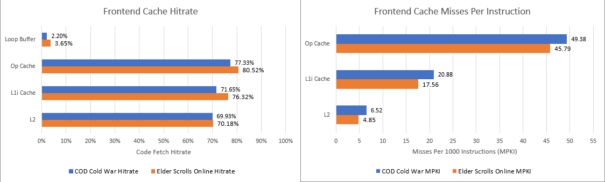

Microbenchmark 显示只要 BPU 提前生成 Target，Zen 4 即使从 L2/L3 跑 Code 也可接近 4 IPC；问题是游戏每四到五条指令就一个 Branch。

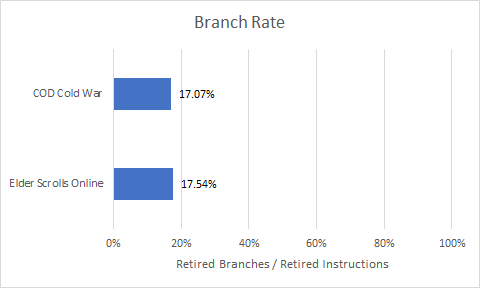

### 体系结构视角：大代码并不必然慢，无法提前知道下一块代码才慢

Instruction Cache Miss 可被解耦 BPU 当作精确 Prefetch，只要 BTB 命中且目标链足够早。Branch-rich 大 Footprint 同时消耗 BTB Capacity、Direction History 和 iTLB Reach，一次 Target Miss 会让 Fetch 退回 Decoder 后才知道去哪里，这才把 Cache Latency 完整暴露。

## BTB：大多数快，少数 Override 很贵

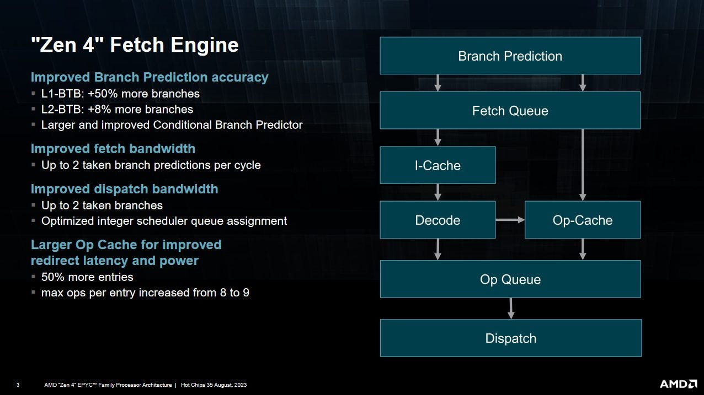

1536 项 L1 BTB 可连续返回 Taken Target；7680 项 L2 BTB 覆盖时产生三个 Predictor Bubble，Indirect Prediction 类似。

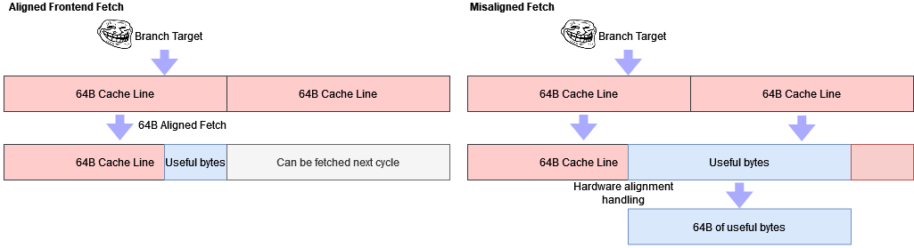

Op Cache 可 9 Micro-op/cycle，快于六宽 Rename，并先填 Queue；L1I 32 B/cycle 在 Integer Code 也可能超过八条。但 Taken Target 落在对齐块中部时，Branch 后多取的 Byte/Uop 无用，Branch Density 会消耗这种余量。

L1 BTB 覆盖绝大多数。计入 Indirect 后，约每 100 条指令有一次三周期 Taken Penalty，不是最大问题。

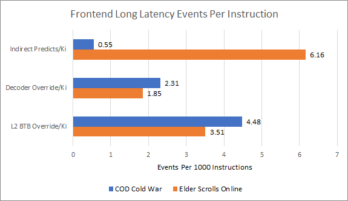

ESO 的 Indirect Branch 尤其多。固定 Target 的 Indirect 也可由普通 BTB 处理。

完全没有 Target 时，Decoder 看到 Branch Byte 后才计算并 Override。次数少却很贵，因为 BPU 无法 Run-ahead：Target 在 L2 可能丢十几拍，L3 则 40+ Cycle 无指令。少量 Override 可能比大量 L2 BTB Hit 产生更多 Frontend Loss。

## iTLB：64 项一级，512 项二级

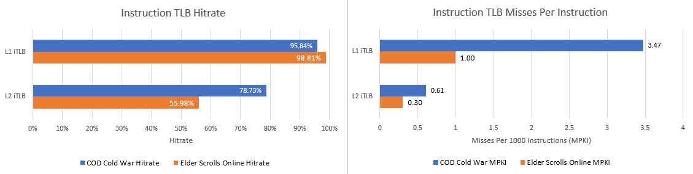

若把每次 L1I Fetch 当 iTLB Access，一级 Hit Rate 很高；但 CoD iTLB MPKI 显示 Code Footprint 超过 64×4 KB=256 KB。多个 Fetch 对同 Page Miss 只触发一次 L2 Lookup/Page Walk，一次事件可阻塞多次取指，因此 MPKI/Hit Rate 都可能低估影响。512 项 L2 iTLB 接住大多数，说明经常活跃的 Footprint 通常不超过约 2 MB。

## Bad Speculation：97% 也不够

Branch Mispredict 不只是 Fetch-to-Execute 的固定 Pipeline Depth。Branch 可能因依赖在 Scheduler 等几十拍，期间核心已抓入大量 Wrong-path Work。Checkpoint 可快速恢复 Rename State，并让 Branch 前的旧 Micro-op 与 Frontend Refill 重叠。

用“进入 Rename 但从未 Retire 的 Micro-op”估计浪费，主要来自 Mispredict。

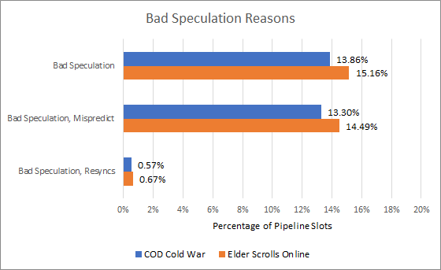

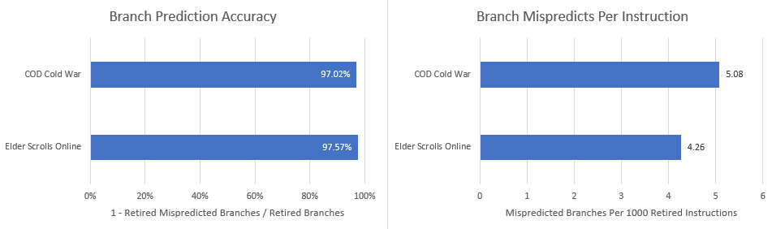

准确率超过 97%，但 Branch 每四五条一个，因此错误仍频繁。正确 Target 若在 L2/L3，还会在最低误预测代价上再加 Cache Latency。

## Backend：Retire 告诉我们在等什么

若前端供给正确，Rename 还可能因某个 Backend Resource 满而不能按程序顺序继续分配。

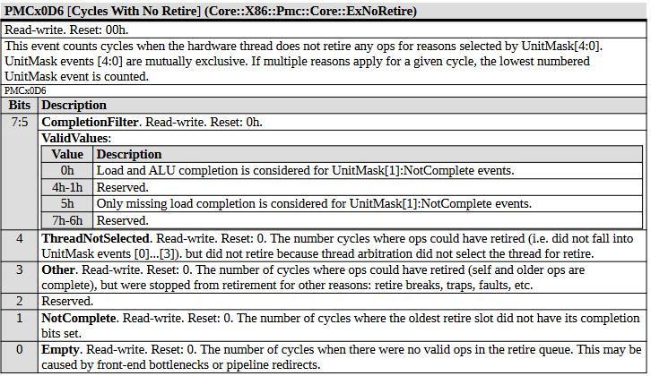

从 In-order Retire 的新事件可看最老指令为何不前进。

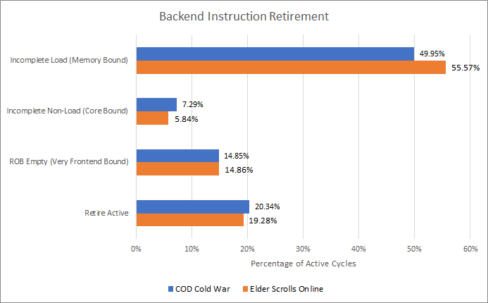

Load 是最大原因。多加 ALU 或缩短普通执行延迟帮助不大，核心缺的是数据。OoO 只能在 Scheduler、PRF、Queue 未满前越过等待指令。

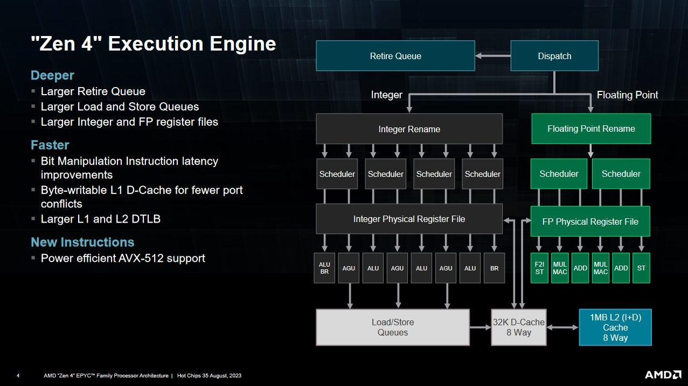

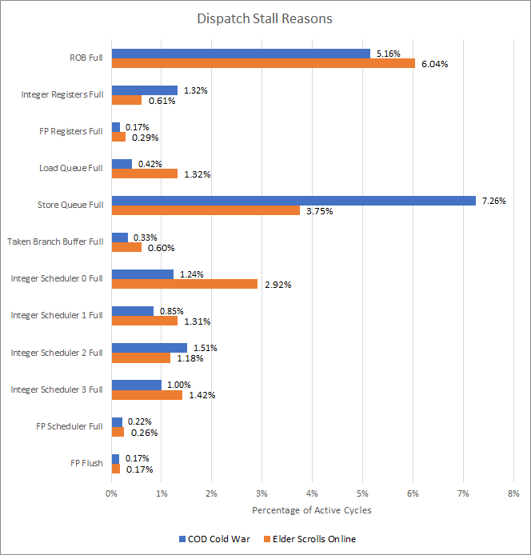

两款游戏常填满 ROB，说明 PRF/Queue 与 ROB 大致均衡；Integer/FP PRF 很少满。Store Queue 在 CoD 突出，排除 ROB 后也是 ESO 首要瓶颈。增大 STQ 很贵，因为每个 Load 都可能要与此前 Store Address 比较并做 Forwarding。

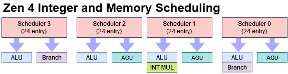

所有 Scheduler 合计只占 ESO/CoD Rename Stall Cycle 的 7.08%/4.82%。其中一条兼顾 Branch、Memory、ALU 的 Integer Queue 最突出；加 Entry 可缓解，但更好的 Cache 能直接减少要隐藏的 Latency。

## DTLB、Cache 与 V-Cache

72 项 L1 DTLB 在 ESO 尤其吃力；3072 项 L2 DTLB 接住多数，但加 7～8 Cycle。

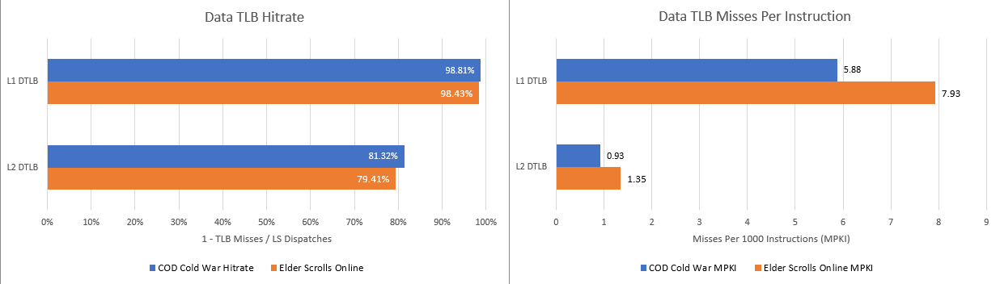

6～8 DTLB MPKI 已很高，而且同 Page 多条 Load 只排一个 Fill，影响指令数更多。L2 DTLB Miss 要多次依赖 Page-table Access，更昂贵。

32 KB L1D 小、Miss 多；1 MB L2 作为 Mid-level 做得不错；7950X3D 的 96 MB L3 接住几乎全部 Core 观察到的 L2 Miss，V-Cache 明显减少 Backend Stall。

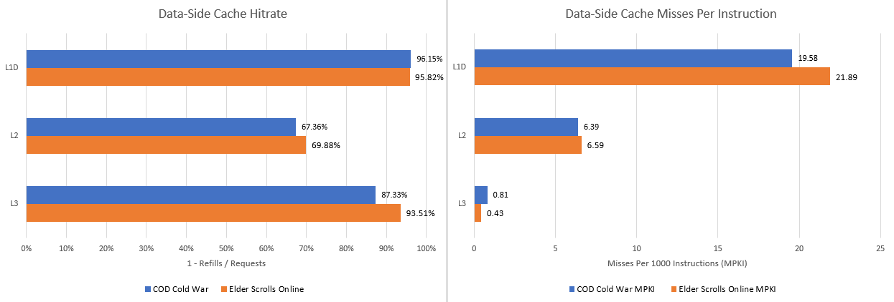

Counter 数的是 64 B Refill，多条指令访问同 Line 只计一次，实际受影响的 Load 更多。

L3 Controller 看到所有 Core Request，给出的 Hit Rate 低于 Core Fill 视角；一部分 Instruction Fetch 可能真的去 DRAM。

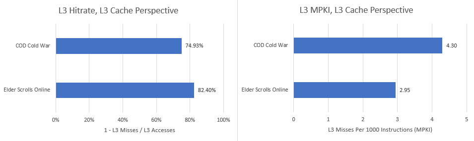

CoD 经多次 Patch，不能与此前文章直接比较。若 Code 从 L3 供应，Frontend Throughput 可能远低于 4 B/cycle，解释部分 Latency-bound。

## 是 Latency，不是 Bandwidth

Bandwidth 饱和会令 Request Queue 堆积、Latency 急升。Zen 4 用 Miss Address Buffer（MAB，通用称 MSHR）跟踪 L1D Miss，可用 Count Mask 统计每周期占用。

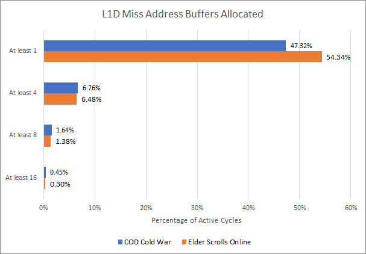

通常占用很低，很少超过四个 Outstanding。Core 2 有八个 Fill Buffer、Golden Cove 16 个，游戏并不需要如此高 Memory-level Parallelism，说明在等单条/少量依赖链，而不是榨满带宽。

Zen 4 还可随机 Sampling 送往 Infinity Fabric 的 Request Latency，使不同 Core Clock 下也能直接看 ns。

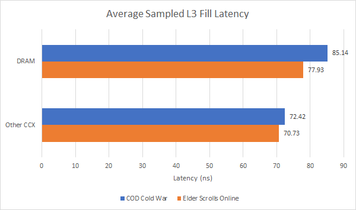

平均明显低于 100 ns，Memory Controller 未排队。该数字从 L3 Perspective 测，Software 还要先查 L1/L2/L3，看到的更高。

### 体系结构视角：游戏常由串行 Miss 链限制

低 MAB Occupancy 不代表 Memory 不重要，而是缺少可并行的 Miss。Pointer Chasing、对象树和 Branch-dependent Load 会让下一地址等上一数据，更多 DRAM Channel 无法缩短。更大 Cache、Data Prefetch、Value/Dependence Prediction 或更低单次 Latency，比单纯堆峰值 GB/s 更有效。

## 结语

两款游戏都有巨大的 Instruction Footprint 和高 Branch Density，In-order Frontend 最难处理；Data Footprint 也大，但 OoO Backend 至少能隐藏部分 Latency。

Zen 4 相对 Zen 3 的改进位置合理：更大 ROB/Supporting Structure、更快层级容纳更多 Branch、1 MB L2 与 96 MB V-Cache。仍可改进 12K 级 BTB、Direction Accuracy 和 Store Queue，但 STQ 每项要处理宽 Store Data/Forwarding，面积昂贵；Zen 4 为 AVX-512 也没有把 STQ Entry 做 512 bit，避免数据存储翻倍。

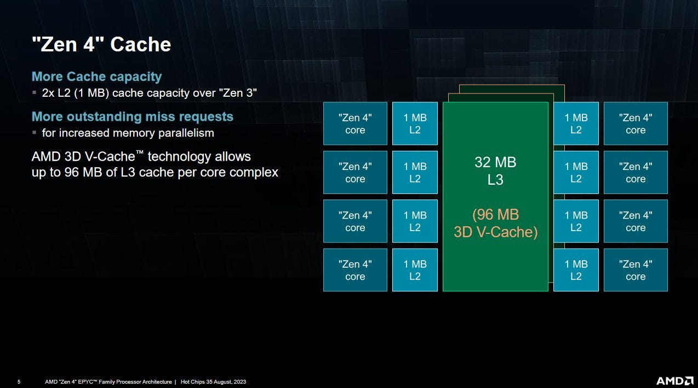

没有为“纸面宽度”浪费面积同样重要。Zen 3 Scheduler 已均衡，沿用合理；六宽 Decoder 或更宽全流水在这些游戏中几乎无益，因为核心首先缺正确指令和低延迟数据。

最后，这只有两款 Multiplayer Game、场景有波动、Counter 分多 Pass 收集，不能代表所有游戏或通用应用。它支持的结论是工作负载画像，而非产品总排名。

## 参考资料

- AMD Hot Chips 2023 Zen 4 演讲与 Processor Programming Reference
- Chips and Cheese：Hot Chips 2023: Characterizing Gaming Workloads on Zen 4
