# 兆芯 KX-7000：“世纪大道”走到了哪一步

> **文章来源**
>
> - 文章：*Zhaoxin’s KX-7000*
> - 撰文：Chester Lam
> - 首发：Chips and Cheese
> - 发布：2025 年 4 月 30 日
> - 链接：https://chipsandcheese.com/p/zhaoxins-kx-7000

兆芯是中国的 x86 处理器设计厂商。最新一代开先 KX-7000 换用了名为“世纪大道”的 CPU 微架构，延续了用上海地标命名架构的传统。兆芯由 VIA Technologies 与上海市政府相关方合资成立，既继承了 VIA 的 x86-64 授权，也拥有本土产业支持，因此能够直接利用成熟的 x86-64 软件生态。

但兼容只是起点，真正决定使用体验的仍是性能。上一代 KX-6640MA 所用的“陆家嘴”核心只有两宽，频率低于 3 GHz，乱序重排序能力也只比 1997 年的 Pentium II 稍强。世纪大道要解决的，正是这种难以应对现代应用的基础性能问题。

## 测试平台与结论边界

KX-7000 在测试中最高运行于 3.2 GHz；兆芯网页标称可达 3.5～3.7 GHz，但这颗样品没有达到该频率。处理器包含八颗世纪大道核心、32 MB 共享 L3，并以计算 Die 加 I/O Die 的方式连接内存与外设。兆芯没有公开制造工艺；TechPowerUp 与 Wccftech 的报道只把它写作未进一步说明的 16 nm，不能视为兆芯正式确认的具体工艺节点。

这批数据来自 Chips and Cheese 的第三方微基准与应用测试。网页没有完整披露主板、固件、操作系统、编译器及参数、锁频与温控、重复次数和误差范围；SPEC CPU2017 图给出的是单线程估算分数，也没有在本页重新列出全部构建与运行规则。因此，容量台阶和数量级适合用来认识微结构，几个百分点的小差距则不宜脱离平台条件作产品排名。

下文按网页中的 23 张正文图展开。框图中的问号、约数和内部结构主要来自测试反推，并非兆芯 RTL 或官方模块参数；兆芯公开规格、曲线直接显示的现象、据现象提出的解释以及补充的通用机制会分别表述。显式标为“体系结构视角”的段落用于讲清问题如何形成、如何阻塞流水线，以及可以用什么计数器或 RTL 信号验证，不代表 KX-7000 已确认采用某一种内部实现。

## 一、核心总览：从两宽低频走向四宽乱序

世纪大道是一颗四宽、支持 AVX2 的乱序执行核心。它把 KX-6640MA 的 2.6 GHz 提高到实测 3.2 GHz，并把重排序缓冲区（Reorder Buffer，ROB）扩展到与 Intel 2010 年代初期核心相近的量级。八颗核心位于同一计算 Die，共享 32 MB L3；独立 I/O Die 负责 DRAM 与其他 I/O，整体形态让人联想到只有一个 CCD 的 Ryzen 桌面处理器。

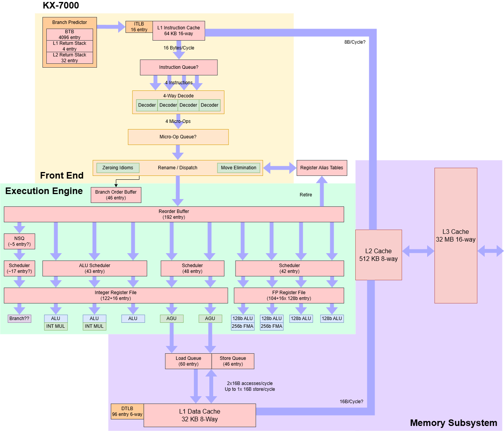

*图 1：Chips and Cheese 根据公开资料和微基准整理的框图。前端包括 64 KB、16 路 L1I、16 B/cycle 取指、四宽译码、4096 项分支目标缓冲器（BTB），以及约 4 项一级和约 32 项二级返回地址栈（RAS）；后端标出 192 项 ROB、约 122＋16 项整数物理寄存器、约 104＋16×128-bit 浮点/向量寄存器、60 项 Load Queue 和 46 项 Store Queue。执行侧有三个整数 ALU、两个整数乘法器、两个地址生成单元（AGU）和四条 128-bit 向量管线，其中两条可承担 256-bit 融合乘加（FMA）。带问号和近似符号的容量是端到端反推，不是 RTL 确认。*

与陆家嘴相比，这不是局部加宽，而是前端、重命名、调度、执行、Cache 和多核系统的整体重做。问题也由此发生变化：当 ROB、执行端口与向量峰值迅速增加后，取指、分支目标、寄存器容量、Cache 带宽和 DRAM 并发是否同步扩展，开始决定这些资源能否真正转化为每周期指令数（Instructions Per Cycle，IPC）。

### 体系结构视角：宽度只有形成闭环才有意义

四宽表示每周期最多能让更多指令进入流水线，却不保证持续得到四条可执行指令。前端缺目标、译码字节不足、重命名资源耗尽、调度队列局部拥塞、Load miss 或退休端阻塞，都会让某一级无法接受新工作，并沿 ready/valid 或 credit 链向前反压。

观察这条链时，应把 `fetch/decode uops`、分支重定向气泡、`ROB full`、物理寄存器不足、各调度队列 full、Load/Store Queue full、执行端口利用率和退休 IPC 放在同一时间线上。若执行端仍有空闲而取指持续不足，瓶颈在前端；若前端足量但 ROB 或队列长期满，则更可能是后端或存储层次无法及时排空。

## 二、前端：四宽译码，却被目标交付和代码工作集牵制

世纪大道从 64 KB、16 路组相联 L1 指令 Cache（L1I）中每周期最多取 16 字节，再送入四宽译码器。它采用常规的“取指—译码”组织，没有 Loop Buffer，也没有保存已译码微操作的 Op Cache。只要平均 x86 指令长度超过 4 字节，16 B/cycle 就可能先于四宽译码成为上限；带 VEX 前缀的 AVX2 代码尤其容易遇到这一条件。

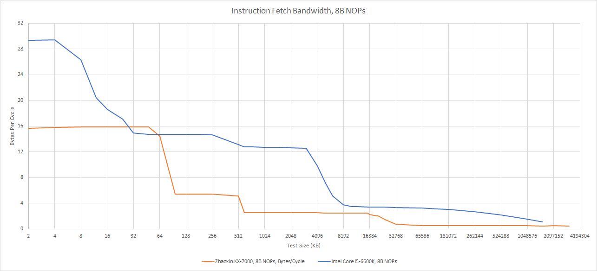

*图 2：使用 8 字节 NOP 改变代码工作集。KX-7000 在 L1I 内接近 16 B/cycle，超过约 64 KB 后明显降到约 5～6 B/cycle，越过约 512 KB 后进一步降到约 2～3 B/cycle，进入更大工作集时还会继续下降。Core i5-6600K 在 L2 范围仍可维持约 12 B/cycle 以上。图中测得的是端到端指令供给，不等于某一条内部总线的裸带宽。*

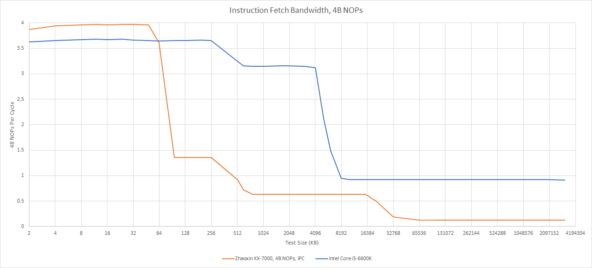

*图 3：使用 4 字节 NOP 时，KX-7000 在 64 KB L1I 内接近 4 IPC；代码超出 L1I 后约降至 1.3 IPC，进入更远层次后只有约 0.6 IPC，并随超大工作集继续下降。Skylake 级 i5-6600K 在更大的代码范围内仍能维持约 3 IPC。L1I 外指令供给不足，使大代码足迹直接转化为前端饥饿。*

AMD 早在 K10（10h）时期就把 L1I 带宽提升到 32 B/cycle；Intel 从 Core 2 的 Loop Buffer 逐步走向 Sandy Bridge 的微操作缓存，同时仍保留 16 B/cycle L1I 路径。两条路线都在减少重复译码或提高字节供给。世纪大道没有采用其中任何一种，而且也没有实现 AMD、Intel 已使用多年的分支融合。`add, add, cmp, jz` 序列只能做到不足 3 IPC，意味着比较与条件跳转仍占据独立的前后端资源。

### 分支目标：4096 项不等于零气泡

条件方向预测回答“跳不跳”，分支目标缓冲器（Branch Target Buffer，BTB）则回答“跳到哪里”。世纪大道的 BTB 可见容量约 4096 项，但 Taken 分支会制造两个流水线气泡，等效目标交付约为每三周期一次。随着代码超出 L1I，延迟还会在远少于 4096 条静态分支时上升，说明目标交付能力与指令 Cache 工作集紧密相关；若 BTB 只能随 L1I 快速路径工作，它也难以越过一次 L1I miss，提前为更远的控制流发起取指预取。

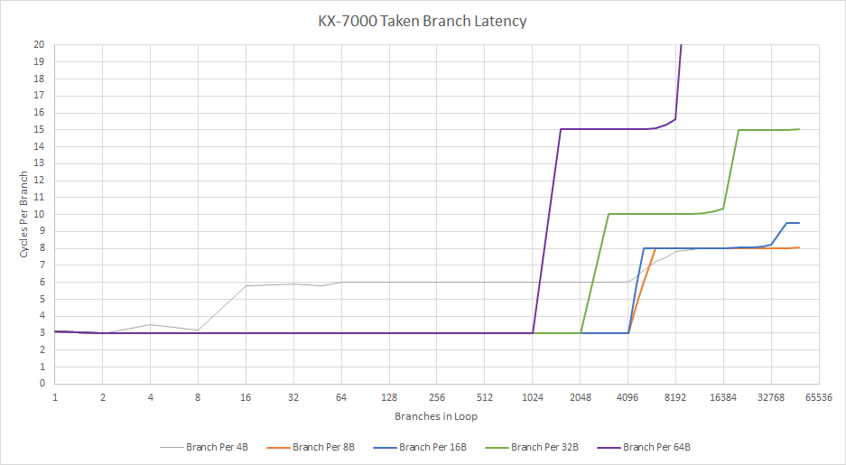

*图 4：横轴增加循环中的 Taken 分支数，多条曲线代表不同分支间距。小工作集下约为 3 cycles/branch；曲线的后续台阶随代码字节工作集移动，而不是只在固定分支条目数上发生。这个形状支持 BTB 与 L1I 紧密耦合的解释，但不足以确认索引、Tag、Bank 或预取路径。*

这种分支行为让人想起较早的 VIA Nano。上一代陆家嘴反而有一个 16 项 L0 BTB，可在很小分支工作集内做到零气泡。世纪大道放弃这种能力，也许与 3 GHz 以上的时序目标有关，但十多年前的 Intel 和 AMD 核心已经能在更高频率下提供更快目标交付。

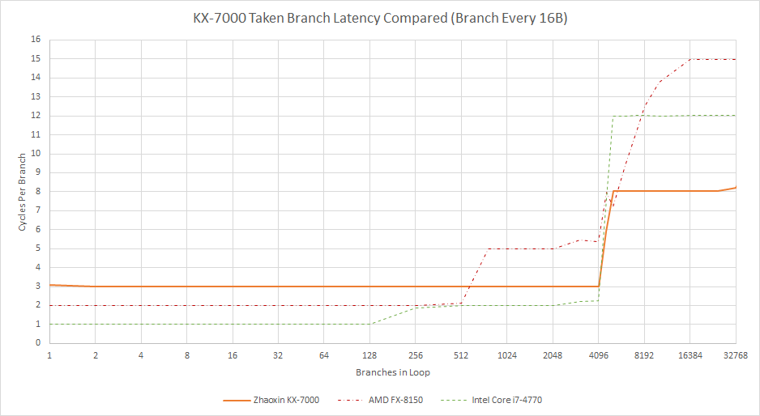

*图 5：固定 16 B 分支间距时，KX-7000 在约 4096 项以内大体维持 3 cycles/branch，随后升到约 8 cycle；FX-8150 与 Core i7-4770 展示多级目标结构的不同台阶。跨处理器比较同时混入频率、流水线和测试环境，重点是目标层级形状，而不是把一周期差值当作整机性能差。*

方向预测则进步明显。面对重复的 Taken/Not-Taken 模式，KX-7000 的识别范围远好于前代，表现形状接近 Intel Sunny Cove。

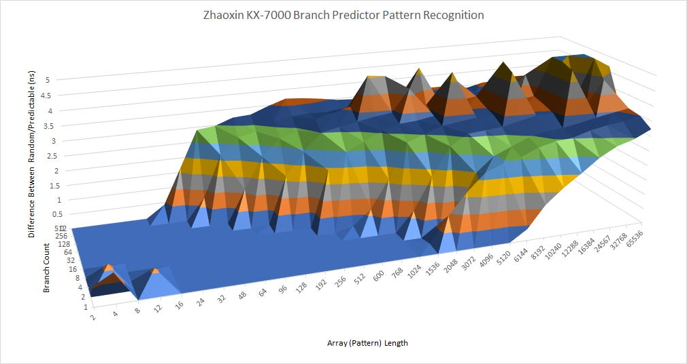

*图 6：横轴为模式长度，侧轴为静态分支数量，纵轴为随机模式相对可预测模式增加的时间。低而平坦的区域说明模式仍能被学习；曲面升高可能同时来自有效历史长度、预测表容量、索引冲突和别名干扰，无法反推出某一种确定算法。*

函数返回的表现更像陆家嘴。调用深度不超过四层时延迟尚可，超过后先出现一次明显变化，更深处约在 32 层附近再次拐折。这支持“约 4 项快速返回栈＋约 32 项较慢二级返回栈”的解释；若确有第二级，其代价约为每对 call/return 14 cycle。作为对照，Bulldozer 在约 24 项返回地址栈（Return Address Stack，RAS）溢出前能维持较低延迟。

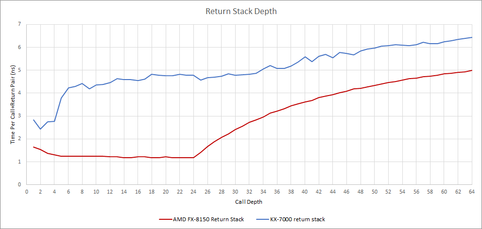

*图 7：KX-7000 在调用深度超过 4 后首先抬升，约 32 附近出现下一处变化；FX-8150 在约 24 层前保持更平坦。容量来自曲线拐点估计，不能直接视作已知的两张物理 RAS。异常、上下文切换和误预测恢复也可能影响可见结果。*

综合来看，这是一个以较低复杂度追求四条指令每周期的前端。常规取指和译码并非天然低效，关键在于是否调校均衡。Apple M1 的 BTB 似乎也与 L1I 耦合，却用 192 KB L1I 扩大快速覆盖范围；世纪大道的 64 KB 虽大于不少 x86 核心的 32 KB，却不足以用容量绕开大代码足迹。Bulldozer 同样采用 64 KB L1I 且 L2 指令带宽较弱，但这并不能改变评价：对一颗 2024 年以后、频率又低于 4 GHz 的核心来说，三周期 Taken 分支仍显得过慢。

### 体系结构视角：方向正确以后，目标还必须及时到达

方向、目标和返回预测是三条不同问题链。方向预测再准，目标晚两拍也会让顺序取指后的气泡进入译码；RAS 容量足够，如果误预测或异常时的投机栈指针不能恢复，也会把后续返回连续带偏。前端真正追求的是“下一取指地址持续可用”，而不只是较低的每千条指令误预测数（Mispredictions Per Kilo Instructions，MPKI）。

验证时可以把条件分支 MPKI、BTB miss、RAS miss、redirect 周期、I-Cache miss、前端空周期和取指字节数联合起来。RTL 中则要沿预测请求、命中、目标选择、投机历史/RAS 更新、分支解析和恢复 checkpoint 核对时序。若方向命中但 fetch PC 仍周期性断流，问题更可能落在目标交付或取指层次，而不是方向预测表本身。

## 三、重命名与乱序执行：窗口变大，供给仍需平衡

前端生成的微操作进入重命名与分配阶段。寄存器重命名为每次写入分配新的物理寄存器，从而消除写后写和读后写等假相关；同一阶段还要为 ROB、调度队列和 Load/Store Queue 分配位置。任一关键资源不足，都会阻止新微操作进入后端。

世纪大道能识别“寄存器与自身异或”这类清零惯用法，使结果不依赖旧值；但这类 XOR 每周期仍最多处理三条，像是仍需占用 ALU 端口，而且重命名器仍为恒为零的结果分配物理寄存器。寄存器 Move 消除也存在，但同样只有三条每周期。换言之，它做了依赖优化，却没有把这些操作完全从后端资源消耗中拿掉。

### 从 ROB 存值转向物理寄存器文件

世纪大道从陆家嘴的 ROB 存值方案转向物理寄存器文件（Physical Register File，PRF）。独立 PRF 能减少数据在核心内部的搬运，也允许 ROB 深度与寄存器容量分别扩展。192 项 ROB 使理论乱序窗口达到 Haswell、Zen 和 Centaur CNS 一带的量级，远大于陆家嘴的 48 项。

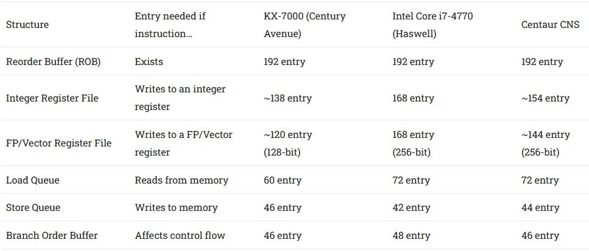

*图 8：框图标出 192 项 ROB、约 122＋16 项整数物理寄存器、约 104＋16×128-bit 浮点（Floating Point，FP）/向量寄存器、60 项 Load Queue、46 项 Store Queue，以及多个 40 项以上的调度器。ROB 只是窗口上限；若寄存器、队列或调度资源更早耗尽，可见乱序距离就会小于 192 条。*

世纪大道的寄存器文件小于 Haswell 或 Zen，但分支顺序资源与 Load/Store Queue 仍能容纳数量可观的在途操作。它还采用半统一调度结构，摆脱陆家嘴更分散的队列组织。整数 ALU、内存和 FP/向量操作各有一组超过 40 项的调度容量；分支看起来拥有自己的队列，但是否拥有独立执行端口仍不确定。测试未能让一条 Not-Taken jump 与三条整数加法在同周期执行，这个负面结果只说明组合吞吐受限，不能唯一判断是分支端口共享、发射限制还是测试序列的其他约束。

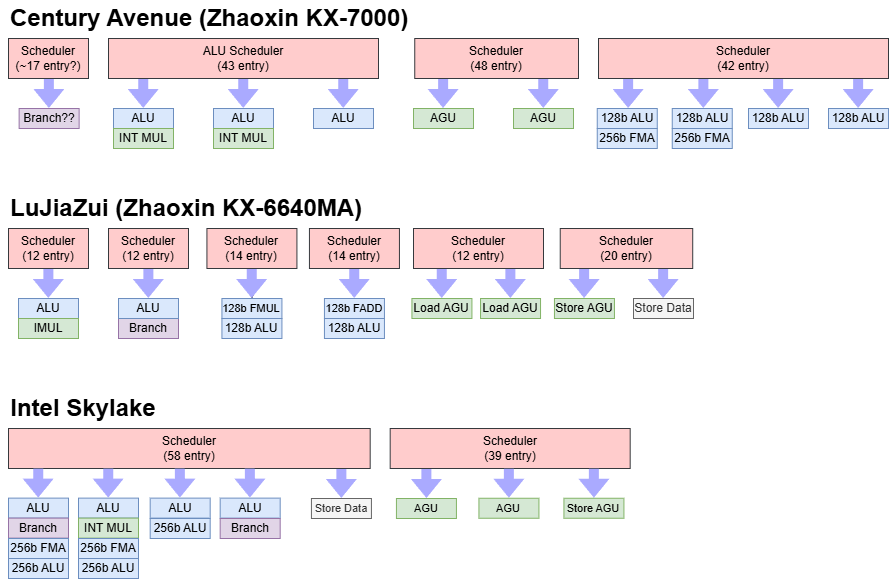

*图 9：世纪大道以约 43 项整数、48 项 AGU 和 42 项 FP/向量调度容量服务多条端口；陆家嘴把 ALU、分支、Load、Store 与 FP 分散到更多小队列；Skylake 则以统一 58 项调度器配合 39 项存储调度资源。统一程度提高后，空闲槽位可被更多操作类型共享，通常能用较少总条目获得相近的有效容量。*

半统一队列降低了某一个小队列先满、其他队列却仍空闲的概率，也减少了调度器容量组合的设计自由度，更容易做整体权衡。按图中的可见条目合计，世纪大道的调度容量超过 Haswell、Centaur CNS，甚至超过 Skylake；代价是队列需要更多读写端口、Wakeup/Select 比较和布线，容量扩大后会直接挑战频率和能耗。

### 执行单元：整数扎实，向量峰值亮眼

整数侧有三条标量 ALU 管线，整体形态与同为四宽的 Arm Neoverse N1、Intel Sandy Bridge 有相似之处。其中两条支持整数乘法，64-bit 整数乘法仅两周期延迟，表现出色。

FP/向量侧更激进：四条管线都能执行 128-bit 向量整数加法，浮点操作可达每周期两条，256-bit 向量 FMA 也能维持这一速率，因此理论每周期 FLOP 数可与 Haswell 匹配。浮点加法和乘法延迟均为 3 cycle，FMA 为 5 cycle，向量整数加法则为 1 cycle。

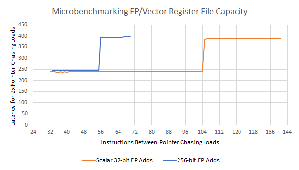

*图 10：在指针追踪 Load 之间插入独立 FP 加法，延迟台阶显示 256-bit 操作消耗资源的速度约为 128-bit/标量操作的两倍。结合其他微基准，常见 256-bit 指令会拆成两个 128-bit 微操作，并占用两项 ROB、两项调度和两项寄存器资源；图中约 120 个 128-bit 槽位仍是可见容量估计。*

问题在于，所有已测试的常见 256-bit 向量操作都被拆成两个 128-bit 微操作。一次 256-bit FP add 会占两项 ROB、两个调度槽和两项寄存器；256-bit Load/Store 也分别消耗两个 Load Queue 或 Store Queue 条目。它与 Zen 4 的 AVX-512 取向正好相反：Zen 4 没有相对前代成倍增加 512-bit 执行吞吐，却用 512-bit 寄存器条目保留更多在途工作；世纪大道先做出 2×256-bit FMA 峰值，再面对如何喂饱它们的问题。

### 体系结构视角：ROB、PRF 与调度器决定的是不同上限

ROB 约束能保留多少条尚未退休的微操作；PRF 约束有多少个活跃结果；调度器保存等待源操作数或端口的操作；Load/Store Queue 还要维护内存顺序。把“192 项 ROB”直接称作“192 条有效乱序窗口”会忽略资源最先耗尽效应。特别是 256-bit 指令拆成两条微操作后，窗口会按更快速度被消耗，峰值执行宽度和有效前瞻距离可能朝相反方向变化。

性能计数器若能区分 `ROB full`、rename stall、整数/FP PRF 空闲项、scheduler full、ready-but-not-issued 与端口占用，就能判断瓶颈来自容量还是执行吞吐。RTL 还应检查双微操作指令在分配、异常、退休和误预测清除时是否成组维护精确状态；一半已执行、另一半被阻塞时，不能破坏架构寄存器和异常顺序。

## 四、Load/Store：地址、顺序和未对齐慢路

两条地址生成单元（Address Generation Unit，AGU）负责形成虚拟地址，由总计约 48 项的内存调度容量供给；它可能是一张 48 项统一队列，也可能是两张 24 项队列，现有曲线无法区分。

世纪大道支持 48-bit 虚拟地址和 46-bit 物理地址。数据侧翻译后备缓冲器（Data Translation Lookaside Buffer，DTLB）为 96 项、6 路组相联，用于 4 KB 页；2 MB 页另有 32 项、4 路结构。CPUID 没有报告二级 TLB 容量，DTLB miss 会增加约 20 cycle，除 Bulldozer 外，这比常见的带二级 TLB 核心更高。

Load/Store 单元还必须判断内存相关。Load 与地址相差 4 KB 的 Store 会形成假相关，说明最初的依赖检查很可能使用虚拟地址的页内偏移。真正相关时，Store-to-Load Forwarding 约为 5 cycle；部分重叠会使快速转发失败并付出约 22 cycle。独立访问则支持类似 Core 2 的 Memory Disambiguation：即使更早的 Store 地址尚未算出，也允许推测执行更晚的 Load，从而提高内存管线利用率。

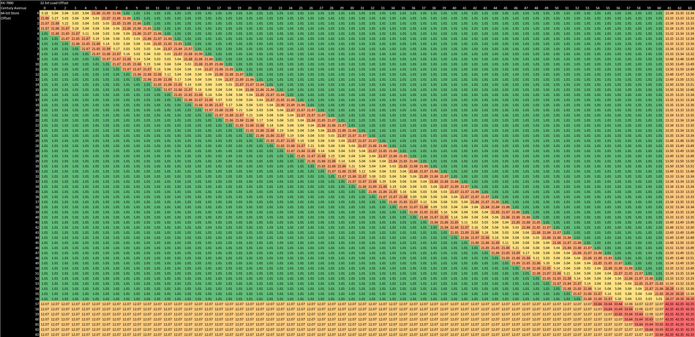

*图 11：行为矩阵以 64-bit Store 偏移为行、32-bit Load 偏移为列。完全独立访问约 1 cycle；能够直接转发的包含关系约 5 cycle；部分重叠约 22 cycle；跨越 Cache Line 的组合约 12～13 cycle，而 Load 依赖未对齐 Store 时最坏超过 42 cycle。矩阵描述端到端行为，不能仅凭颜色确定内部比较器级数或重放状态机。*

跨 Cache Line 的未对齐 Load/Store 需要 12～13 cycle，远重于现代核心。Skylake 的未对齐 Load 几乎没有额外代价，未对齐 Store 通常也只多约 1 cycle。世纪大道最困难的情况是 Load 依赖一条跨线 Store，延迟超过 42 cycle。

### 体系结构视角：内存相关预测是在正确性约束下换并行度

如果所有 Load 都等到更早 Store 地址确定，正确性简单，却会浪费大量并行度；若大胆越过未知 Store，又必须在地址最终冲突时检测违例、清除年轻指令并重放。4 KB 假相关说明早期比较可能只看页内偏移，它能提前工作，却会把不同虚拟页的相同 offset 当成潜在冲突。

可以构造“地址已知/未知、相同/不同 4 KB offset、完全重叠/部分重叠/跨 Cache Line/跨页”的组合，并统计 load replay、memory-order violation、store-forward success/fail、machine clear 和 TLB walk。RTL 中要核对 Store 地址与数据分别就绪时的 CAM 比较、Forwarding 选择、违例检测和精确异常恢复；吞吐快路与跨线慢路必须在异常和清除时保持架构可见状态一致。

## 五、核心私有 Cache：L1D 像 Sandy Bridge，L2 仍偏慢

L1 数据 Cache（L1D）为 32 KB、8 路组相联，Load-to-use 延迟 4 cycle。它有两个 128-bit 访问端口，但只有一个端口能处理 Store，因此 256-bit Store 需要两个周期。整体带宽接近 Sandy Bridge；而两条 256-bit FMA 若要持续满载，对数据供给的需求更高。Intel 在 Haswell 首次引入 2×256-bit FMA 时，也把 L1D 提升到每周期两次 256-bit Load 加一次 256-bit Store。

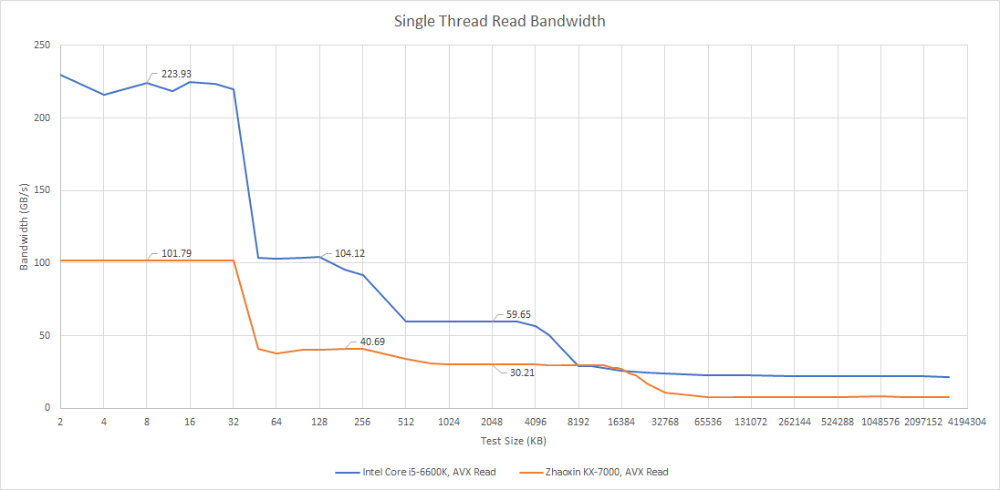

*图 12：KX-7000 在 L1D 内约 101.79 GB/s，随后在 L2、L3 区间约为 40.69 和 30.21 GB/s；Core i5-6600K 对应区间约为 223.93、104.12 和 59.65 GB/s。数值受频率和测试循环影响，图形更重要的含义是 KX-7000 各级向下都有明显带宽台阶。*

512 KB 私有 L2 的实测延迟约 15 cycle，不算理想。作为参照，Skylake-X 能以更高频率运行 2 MB、14 cycle 的 L2。下一张延迟图按纳秒标出 KX-7000 约 4.72 ns 的 L2 平台；以 3.2 GHz 换算约为 15.1 cycle，与正文测试一致。

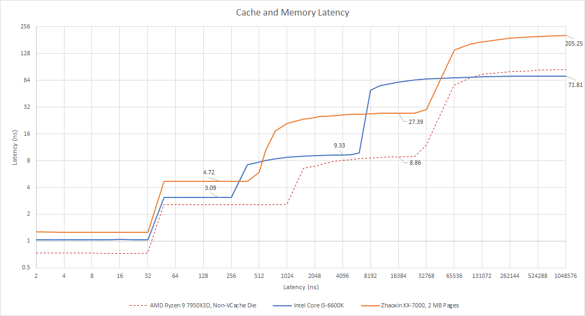

*图 13：2 MB 大页下，KX-7000 的 L1、L2、L3 和 DRAM 平台约为 1.3、4.72、27.39 和 205.25 ns；Core i5-6600K 的主要平台约为 1、3.09、9.33 和 71.81 ns。Ryzen 9 7950X3D 的非 V-Cache CCD 作为另一条参考曲线。横轴数值实际对应按 2 的幂增长的测试工作集，图中却误标为“Latency (ns)”；跨平台频率、内存和页表条件也不同，因此适合看层次与数量级，不适合把每个纳秒差都归因于核心。*

### 体系结构视角：向量执行宽度必须与数据通路一起设计

两条 256-bit FMA 每周期可能消费四个 256-bit 源并产生两个结果。寄存器端口、Bypass 网络、Load 带宽和调度唤醒任何一处不足，理论 FLOP/cycle 都只会出现在寄存器驻留、依赖经过精心展开的内核中。256-bit 操作拆成两个 128-bit 微操作，还会增加前端、ROB、队列和退休压力。

判断算力是否受供给限制，可以对纯寄存器 FMA、L1 驻留、L2 驻留以及不同 Load/Store 比例逐级测量，同时记录 FP issued、Load port、Store port、L1 refill、调度器等待和退休 IPC。若纯计算达到峰值而一加入 L1 Load 就快速下降，问题在数据端口；若寄存器版本也被 ROB/PRF 或发射阻塞，则峰值与窗口组织本身不匹配。

## 六、共享 L3：容量扩大了，延迟和带宽没有同步跟上

世纪大道重做了多核 Cache 层次。KX-7000 为每核配置 512 KB 私有 L2，再让八核共享 32 MB L3；KX-6640MA 则是四核共享 4 MB L2。L3 容量扩大八倍，私有 L2 能过滤部分 L1 miss，这种三级 Cache 加计算/I/O Die 的布局与单 CCD Zen 3 桌面处理器颇为相似。

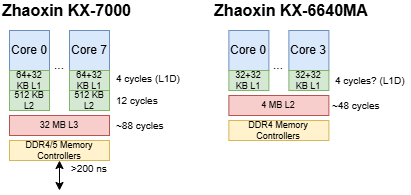

*图 14：KX-7000 八核各有 64 KB L1I、32 KB L1D 和 512 KB L2，共享 32 MB L3，并由独立 I/O 路径连接 DDR4/5 控制器；图中标出 L1D 4 cycle、L2 约 12 cycle、L3 约 88 cycle 和 DRAM 大于 200 ns。正文微基准把 L2 写作约 15 cycle，两种口径并不一致，应并列保留；框图是测试整理，不是兆芯官方 RTL。KX-6640MA 则为四核共享 4 MB L2，约 48 cycle。*

L3 延迟超过 27 ns，即 80 多个核心周期。只读带宽略高于 8 B/cycle，Read-Modify-Write 约为 11.5 B/cycle，都不突出。Skylake 的只读 L3 平均可达约 15 B/cycle，近期 AMD 设计还能达到世纪大道的约两倍。

八核并发时，KX-7000 的 L3 带宽扩展尚可：只读峰值约 215.76 GB/s，Read-Modify-Write 可超过 300 GB/s。但低频率与偏低的单核起点限制了总量，同线程数下仍远低于 Zen 2 单 CCD；图中 AMD Ryzen 9 3950X 单 CCD 读带宽约 633.72 GB/s。KX-7000 的结果倒是高于匹配线程数的 Skylake-X，不过后者有更大的 1 MB 私有 L2 来隔离较慢 L3，而且定位偏服务器。客户端 Bulldozer 的 L3 延迟相近，也用 2 MB 私有 L2 减少访问共享层的概率。

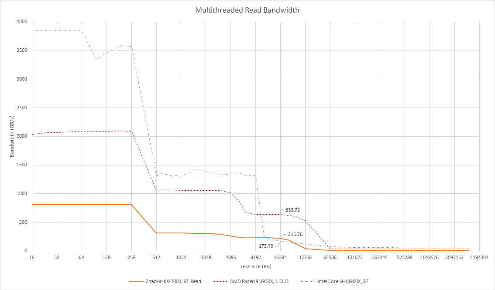

*图 15：八线程 KX-7000 在 L1/L2 区域分别约 800/300 GB/s，L3 区间最高标出约 215.76 GB/s，较大工作集一度约 175.70 GB/s；Ryzen 9 3950X 单 CCD 的 L3 标注约 633.72 GB/s，Core i9-10900X 也给出八线程对照。三者频率、Cache 容量和系统均不同；曲线用于说明层级供给与扩展，不是同平台 IPC 比赛。*

### 体系结构视角：私有 L2 是高延迟 L3 的缓冲层

大 L3 能降低容量 miss，却可能因更长物理距离、更复杂 Bank/目录和互连仲裁而提高命中延迟。私有 L2 的任务不只是提供更低延迟，也要吸收每核流量，避免共享 L3 被普通工作集持续冲击。若 L2 偏小或偏慢，80 多周期的 L3 就会更频繁暴露给核心。

可以把 L1/L2/L3 miss、L2 未完成缺失状态寄存器（Miss Status Holding Register，MSHR）满、L3 Bank conflict、片上网络（Network-on-Chip，NoC）请求/响应队列和 refill 带宽串起来看。工作集刚越过 512 KB 时，如果 ROB 占用升高、独立 miss 数不足而执行端空闲，IPC 下降更可能来自延迟隐藏能力；若多核下 L3 Bank 或互连饱和，则是吞吐与仲裁问题，两者不能只靠“L3 很慢”一句话合并。

## 七、DRAM：延迟、在途请求与公平性同时失衡

DRAM 是 KX-7000 最明显的系统瓶颈。即使使用 2 MB 页减少地址翻译开销，1 GB 数组的空载延迟仍超过 200 ns；换成 4 KB 页则超过 240 ns。测试所用 DIMM 支持 DDR4-2666 JEDEC 和 DDR4-4000 XMP，但内存控制器最终只训练到 1600 MT/s，理论双通道带宽因此只有 25.6 GB/s。

只读实测甚至难以超过 12 GB/s。加入写入后反而更好：Read-Modify-Write 达到 20.89 GB/s，Non-Temporal Write 为 23.35 GB/s，已接近理论上限。这说明跨 Die 通路至少有能力把写流量送满内存控制器；只读受限更像高延迟下无法维持足够多的在途请求，而不是链路绝对带宽只有 12 GB/s。

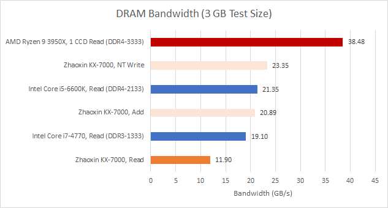

*图 16：KX-7000 的 Read、Add 和 NT Write 分别为 11.90、20.89 和 23.35 GB/s。对照项包括 DDR4-3333 的 Ryzen 9 3950X 单 CCD 读 38.48 GB/s、DDR4-2133 的 i5-6600K 读 21.35 GB/s，以及 DDR3-1333 的 i7-4770 读 19.10 GB/s。内存速率和访问模式不同，因此不能把横条直接当作内存控制器代际排名。*

通常，增加核心数会带来更多私有 L1/L2 miss 队列，使系统能够累计更多并行请求。但 KX-7000 的只读带宽在超过两个带宽线程后突然停止扩展，暗示八核共享路径上的某个队列容量不足，无法用 Memory-Level Parallelism（MLP）覆盖 200 ns 以上的往返延迟。

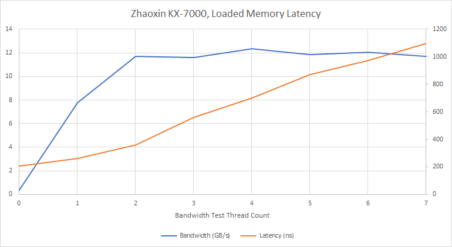

*图 17：蓝线按左轴读取带宽，橙线按右轴读取延迟。带宽从 0 到 2 个压力线程快速升至约 11.5 GB/s，之后基本不再扩展；指针追踪延迟则从约 200 ns 持续升高，七个带宽线程时超过 1 μs。吞吐停滞而尾部延迟继续恶化，是共享请求资源不足或仲裁失衡的重要迹象。*

更严重的是公平性。一个指针追踪线程与其他带宽线程同时运行时，其延迟会随负载急剧上升；“1 个延迟线程＋7 个带宽线程”的最坏组合超过 1 μs。一种合理怀疑是，高带宽线程占满了限制读请求的共享队列，延迟敏感请求得不到及时服务，但现有测试还不能定位具体队列。

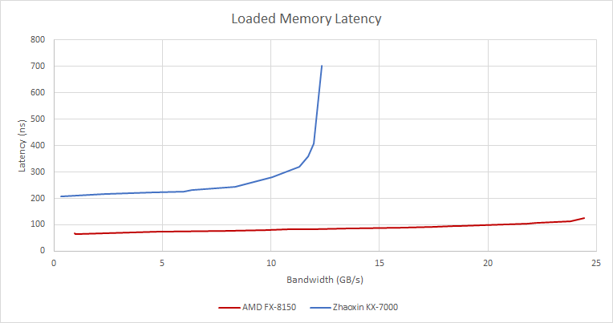

*图 18：网页正式图注为“取不同线程数下最佳的延迟/带宽组合”。KX-7000 的蓝线从空载约 205 ns 逐步升到 300～400 ns，并在约 12 GB/s 附近陡增至约 700 ns；FX-8150 红线从约 60 ns 缓慢升至约 120 ns。Bulldozer 即使在最坏负载下，也优于 KX-7000 的最佳延迟。*

FX-8150 的 Northbridge 有两级 Crossbar，结构并不简单，却能更好地控制受载延迟：随着带宽接近控制器上限，延迟增长仍不超过空载的大约两倍。对比说明，峰值带宽之外，请求仲裁、预留项和服务公平性同样决定多核体验。

少数情况下，内存请求需要从另一颗核心的 Cache 取回数据；这类路径在普通程序中不常出现，却能帮助观察系统拓扑。KX-7000 各核心对之间大约为 104～114，整体较高但相对均匀；少数核心对更低，可能与被测地址映射到哪个 L3 Slice 有关。网页没有披露这项自编微基准的同步协议、读写状态或单位换算过程，因此这里只保留矩阵现象和拓扑推测。

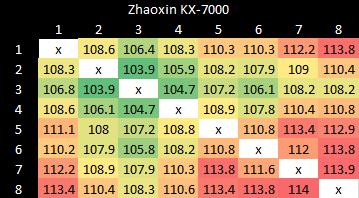

*图 19：八核非对角项约为 103.9～114.0，图内没有标注单位；颜色显示部分核心对略快，但没有形成清晰的四核或双核分组。它可能受 L3 Slice、地址映射、一致性状态和互连路径共同影响，不能只凭核心编号确定物理拓扑。*

### 体系结构视角：峰值带宽不能替代尾延迟与服务质量

200 ns 延迟下若要维持 12 GB/s、假设每次返回一条 64 B Cache Line，平均就需要约 37.5 条请求同时在途；要接近 25.6 GB/s，则需要约 80 条。这个估算只是 Little’s Law 的数量级说明，实际还会受 Bank 并行度、读写切换、页命中率和协议开销影响。它也解释了为什么队列深度不足会同时表现为读带宽低和延迟隐藏失败。

公平仲裁还要避免吞吐线程长期占满全局资源。验证时可固定一个依赖 Load 流，逐步增加独立流量线程和读写比例，记录每核 outstanding miss、内存控制器读写队列、队列占满周期、行命中、仲裁等待和延迟分位数。若平均带宽不再增加而 P99/P999 延迟继续恶化，就应优先检查共享队列、年龄优先级、每源限额与读写批处理，而不是继续增加峰值接口宽度。

## 八、单线程性能：相对前代飞跃，整体约到 Bulldozer

SPEC CPU2017 的估算结果显示，世纪大道相对陆家嘴进步很大：整数套件提高 48.8%，浮点套件超过两倍。对比 FX-8150，KX-7000 的整数分数低 13.6%，浮点则高 10.4%。

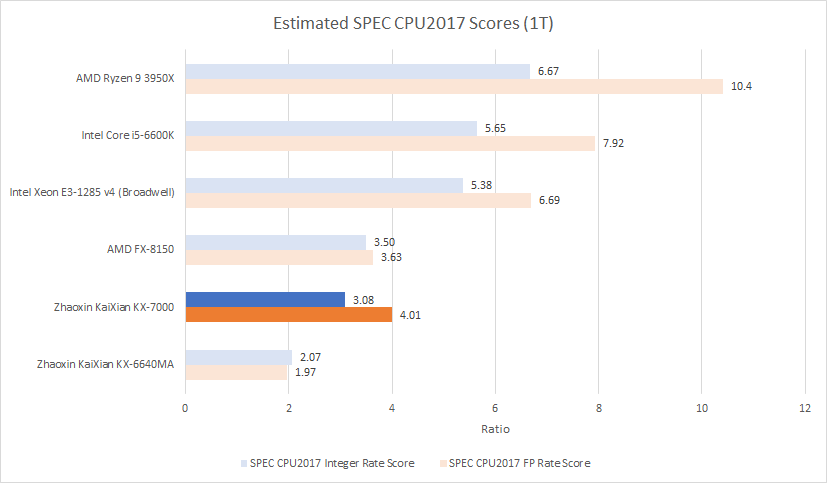

*图 20：单线程估算的 Integer/FP Rate Score 分别为：Ryzen 9 3950X 6.67/10.4，Core i5-6600K 5.65/7.92，Xeon E3-1285 v4 5.38/6.69，FX-8150 3.50/3.63，KX-7000 3.08/4.01，KX-6640MA 2.07/1.97。不同平台和编译环境没有在本页完整展开，分数适合看代际与数量级。*

Broadwell、Skylake 与世纪大道已经不在同一性能层次，因此 Bulldozer 是更贴近的参照。KX-7000 在较高 IPC 的 500.perlbench、525.x264 和 548.exchange2 中表现较好，更多执行资源可能发挥了作用；FX-8150 则在低 IPC 的 505.mcf 和 520.omnetpp 中明显领先。这类程序同时包含难预测分支和大内存工作集，Bulldozer 更强的存储系统与更快的目标交付更占优势。

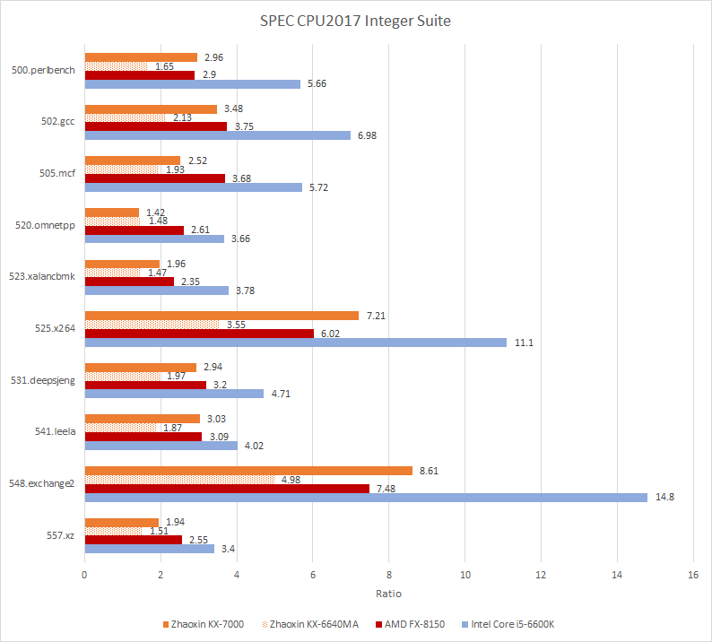

*图 21：KX-7000/KX-6640MA/FX-8150/i5-6600K 的子项分别为：perlbench 2.96/1.65/2.90/5.66，gcc 3.48/2.13/3.75/6.98，mcf 2.52/1.93/3.68/5.72，omnetpp 1.42/1.48/2.61/3.66，xalancbmk 1.96/1.47/2.35/3.78，x264 7.21/3.55/6.02/11.1，deepsjeng 2.94/1.97/3.20/4.71，leela 3.03/1.87/3.09/4.02，exchange2 8.61/4.98/7.48/14.8，xz 1.94/1.51/2.55/3.40。它清楚显示 KX-7000 的优势集中在部分高 IPC 工作负载，而非所有整数程序。*

浮点套件整体具有更高 IPC，因此 KX-7000 的宽执行侧更容易占优，但 FX-8150 仍会在少数子项取胜。549.fotonik3d 是被 Cache miss 严重限制的低 IPC 工作负载，Bulldozer 比 KX-7000 快 46.2%；另一端的 538.imagick 几乎没有 L2 miss，KX-7000 更能发挥执行资源。

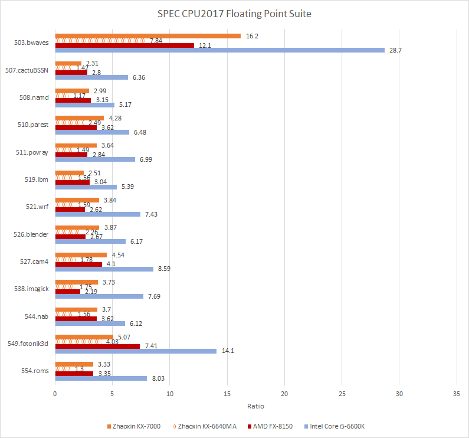

*图 22：KX-7000/KX-6640MA/FX-8150/i5-6600K 的主要分数包括 bwaves 16.2/7.84/12.1/28.7，cactuBSSN 2.31/1.42/2.80/6.36，namd 2.99/1.17/3.15/5.17，parest 4.28/2.49/3.62/6.48，povray 3.64/1.49/2.84/6.99，lbm 2.51/1.56/3.04/5.39，wrf 3.84/1.59/2.62/7.43，blender 3.87/2.26/2.67/6.17，cam4 4.54/1.78/4.10/8.59，imagick 3.73/1.75/2.19/7.69，nab 3.70/1.56/3.62/6.12，fotonik3d 5.07/4.03/7.41/14.1，roms 3.33/1.30/3.35/8.03。整体结果支持 KX-7000 单线程约处于 Bulldozer 量级，而不是追上 Broadwell/Skylake。*

### 体系结构视角：Benchmark 是瓶颈的投影，不是单一排名

高 IPC 子项更容易暴露执行宽度和端口数量，低 IPC、大工作集子项则放大分支、TLB、Cache 与 DRAM 延迟。KX-7000 在 x264、exchange2 与浮点套件的相对优势，和它的执行资源扩张相吻合；在 mcf、omnetpp、fotonik3d 的落后，则与前端目标延迟和存储层次短板相互印证。但这种对应仍是跨测试证据的一致性，不是用一个 SPEC 子项反向证明某个硬件模块。

更严谨的分析需要记录 benchmark 版本、二进制、编译器与 ISA 选项、输入、单副本/多副本、线程数、频率、内存和 NUMA 条件，再配合 branch MPKI、前端停顿、L1/L2/L3 MPKI、DTLB walk、MLP 和端口利用率。缺少这些条件时，可以讨论“结果与某种瓶颈相符”，不宜宣称单一机制已经被证明。

## 九、多线程：八核是优势，系统供给却限制兑现

八颗完整核心是 KX-7000 对 FX-8150 和四核 Core i5-6600K 的数量优势，但应用结果并不稳定。libx264 的 4K 转码采用 `veryslow` preset，能够使用 AVX2 且线程数超过四个，KX-7000 仍只有 1.67 FPS，低于 FX-8150 的 1.77 和 i5-6600K 的 1.96。7-Zip 压缩 2.67 GB 文件主要使用标量整数指令，KX-7000 为 21.00 MB/s，低于四线程 i5-6600K 的 23.15、FX-8150 的 30.88，以及开启 8 线程后的 i5-6600K 33.03 MB/s。

Y-Cruncher 0.8.6 计算 25 亿位时，KX-7000 用时 373.77 秒，明显快于 FX-8150 的 1533.04 秒，AVX2 很可能贡献很大；但四核 Skylake 仍只需 308.62 秒。OpenSSL RSA-2048 签名更偏纯整数核心计算，与 Web 服务器建立 SSL/TLS 连接时的身份验证有关。KX-7000 达到 6161.1 signs/s，高于 FX-8150 的 4196.2，仍低于 i5-6600K 的 7191.9。

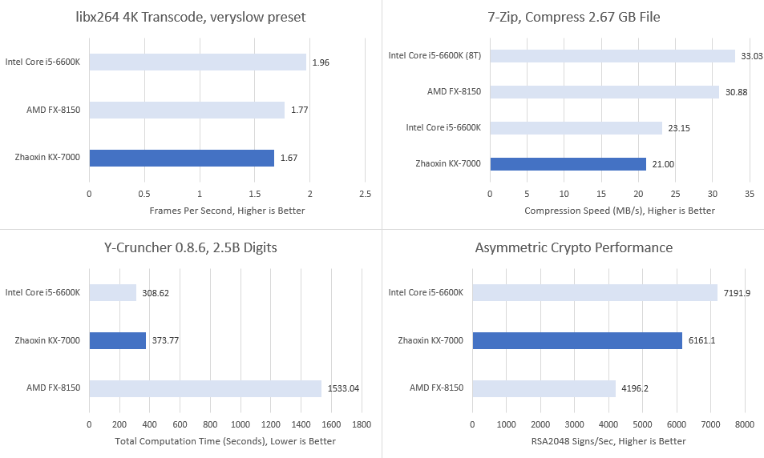

*图 23：左上为 libx264 4K/`veryslow` 帧率，右上为 7-Zip 压缩 2.67 GB 文件，左下为 Y-Cruncher 0.8.6 计算 25 亿位的总秒数，右下为 OpenSSL RSA-2048 签名吞吐。四项的版本、输入、单位和“越高/越低越好”不同，不能把柱长直接相加；它们共同说明八颗世纪大道核心并未在所有任务中稳定压过更老或核数更少的对照。*

### 体系结构视角：多核吞吐取决于最窄的共享层

核心数增加后，私有执行资源近似线性增加，共享 L3、互连、内存请求队列和 DRAM 通道却不会自动成倍扩张。KX-7000 的八核计算峰值、约 215 GB/s L3 只读峰值、约 12 GB/s DRAM Read 与超过 200 ns 的空载延迟放在一起看，说明应用能否扩展高度依赖工作集是否留在私有 Cache，以及线程间是否需要共享数据。

判断多线程效率时，应同时给出 1/2/4/8 线程加速比、频率和功耗变化，再把 LLC miss、内存带宽、每核 IPC、队列占满与核间通信纳入分析。如果增加线程后总 IPC 停止增长、DRAM 带宽不变而每核延迟上升，继续增加执行端口不会解决共享层瓶颈。

## 十、从“做得更大”走向“做得协调”

VIA 过去主要面向低功耗、低成本市场。Centaur CNS 虽然尝试过四宽和更高性能目标，但 VIA 并未像 AMD、Intel 那样进入覆盖浏览、游戏、视频编码和服务器的通用高性能市场。高频、高 IPC 与广泛负载适应性需要庞大的长期工程投入，对 VIA 来说选择细分市场更现实。

兆芯承担的目标不同。中国需要在外部供应受限时仍可使用的本土处理器，x86 软件兼容性让它具有现实价值。Chester Lam 的判断是，这类项目具有国家层面的重要性，能够获得很强的公共支持，即使短期盈利能力不足也可能继续推进。它不必在每一项指标上正面击败 AMD 或 Intel，但应用开发者的性能预期已经由这些平台塑造；替代处理器必须快到足以承接现有软件，而不能让使用体验出现破坏性倒退。

世纪大道正是朝这一方向迈出的一大步。从两宽、2.6 GHz、48 项 ROB 的陆家嘴，走到四宽、实测 3.2 GHz、192 项 ROB、AVX2 和八核，单线程达到 Bulldozer 量级，进展不容忽视。

它的短板也呈现出同一种模式：资源被显著放大，却没有始终形成平衡。两条 256-bit FMA 给出很高计算峰值，但低 Cache 带宽和“256-bit 拆成两个 128-bit 微操作”更接近以兼容为先、控制成本的 AVX2 实现；物理寄存器相对 ROB 偏小，也削弱了理论大窗口。系统侧，512 KB L2 很难完全遮蔽 80 多 cycle 的 L3，八核只读 DRAM 带宽不足，重载公平性又差。三周期 Taken 分支、与 L1I 紧耦合的目标交付和缺少分支融合，则让前端更像 2005 年前后的设计思路，而不是 2025 年成熟高性能核心。

最终仍要回到用户可见的性能。KX-7000 的多线程成绩有时落后于 2011 年的 FX-8150，而 Bulldozer 每两个硬件线程还共享前端与浮点单元；单线程大致追平 Bulldozer，也远非今天的高性能水平。不过，KX-7000 的目标并不是吸引西方消费级发烧友，而是减少对境外供应商的依赖。从“可用替代”角度看，Bulldozer 量级的单线程性能已经具备现实意义。世纪大道缺少当代 AMD、Arm 或 Intel 大核常见的平衡与精细度，但确实把兆芯带入了更高性能的起跑区。

结合这组测试与前面的机制分析，可以归纳出六点体系结构层面的认识：

1. **兼容向量 ISA 与高效执行向量 ISA 是两件事。** 256-bit 指令拆成两个 128-bit 微操作，可以较低风险获得 AVX2 兼容和峰值 FMA 吞吐，却会加速消耗 ROB、PRF、调度与 Load/Store Queue；要让宽向量持续工作，寄存器和 Cache 数据通路也必须同步扩展。

2. **分支预测准确率不能替代目标交付延迟。** 世纪大道的方向模式识别已有明显进步，但三周期 Taken 分支、与 L1I 紧密关联的 BTB 和较慢的深层返回路径仍会让四宽前端周期性断粮。前端设计必须同时处理 direction、target、return 和 code footprint。

3. **大 ROB 只是延迟隐藏能力的上界。** 192 项 ROB 提供了向前看的空间，但物理寄存器、分裂后的向量微操作、调度器和内存队列会决定实际窗口。评价乱序核心时，应问“什么资源最先满”，而不是只比较 ROB 数字。

4. **私有 Cache 与共享 Cache 是一套联合设计。** 32 MB L3 容量很可观，但超过 80 cycle 的命中代价要求 L2 足够快、足够大并拥有足够 MSHR；否则更大的共享容量并不能阻止核心频繁暴露在长延迟下。

5. **多核内存系统既要吞吐，也要公平。** 只读带宽在两个压力线程后停止扩展、单个依赖流在七个带宽线程下超过 1 μs，说明共享请求资源和仲裁策略会直接决定尾延迟。只公布峰值 GB/s 无法描述这种服务质量问题。

6. **代际跃迁首先要肯定方向，再检查闭环。** 世纪大道把频率、宽度、窗口、核心数和 ISA 能力同时推进，证明兆芯已经摆脱前代的低性能框架；下一步的关键不是继续孤立增大某一张表或某一组端口，而是让前端、窗口、执行、Cache、互连与 DRAM 围绕真实工作负载形成更协调的吞吐链。

## 参考资料与延伸阅读

- Chips and Cheese：[Zhaoxin’s KX-7000](https://chipsandcheese.com/p/zhaoxins-kx-7000)
- Chips and Cheese：[Running SPEC CPU2017 at Chips and Cheese](https://chipsandcheese.com/p/running-spec-cpu2017-at-chips-and-cheese)
- TechPowerUp：[Zhaoxin Launches KX-7000 Desktop 8-Core x86 Processor](https://www.techpowerup.com/316685/zhaoxin-launches-kx-7000-desktop-8-core-x86-processor-to-power-chinas-ambitions)
- Wccftech：[Zhaoxin Launches KX-7000 High-Performance Desktop CPUs](https://wccftech.com/zhaoxin-launches-kx-7000-high-performance-desktop-cpus-for-china-8-cores-3-7-ghz/)

如果希望支持 Chips and Cheese 的独立测试，也可以访问其 [Patreon](https://www.patreon.com/ChipsandCheese)、[PayPal](https://www.paypal.com/donate/?hosted_button_id=4EMPH66SBGVSQ) 或加入 [Discord](https://discord.gg/TwVnRhxgY2)。
