# 玄铁 910：2020 年 ISCA 论文与 Hot Chips 演讲中文全译

## 文档说明

本文把下列两份 PDF 的正文、图表、图注、表格、脚注、致谢和参考文献合并翻译为中文：

1. [《Xuantie-910: A Commercial Multi-Core 12-Stage Pipeline Out-of-Order 64-bit High Performance RISC-V Processor with Vector Extension》](<2020_Xuantie-910 - A Commercial Multi-Core 12-Stage Pipeline Out-of-Order 64-bit High Performance RISC-V_Chen, Chen et al_52-64_会议论文.pdf>)，ISCA 2020 工业产品论文，第 52–64 页。
2. [《Xuantie-910: Innovating Cloud and Edge Computing by RISC-V》](<2020_Xuantie-910 - Innovating Cloud and Edge Computing by RISC-V_Chen, Chen et al_1-19_会议论文.pdf>)，Hot Chips 32，2020 年，19 页演示稿。

翻译约定：

- XT-910、Xuantie-910 与玄铁 910 均指同一处理器；正文依原文多使用 XT-910。
- 原图以 PNG 保存并嵌入。图中英文标签之后均给出中文解释；可直接对照原始视觉信息。
- 论文中的性能比较、产品计划和市场判断均为作者在 2020 年发表时的陈述，不代表本文重新验证后的结论。
- 原文写作或命名存在不一致时忠实保留并加译注。例如 ISCA 正文写作 “MOSEI”，Hot Chips 演示写作 “MOESI”；通常的一致性协议名称是 MOESI。
- IEEE PDF 页脚中的许可访问提示在此统一记录：原文件由 IEEE Xplore 授权访问，ISCA PDF 显示下载于 2023-02-16，Hot Chips PDF 显示下载于 2023-05-19；原 PDF 的使用限制继续适用。

本文的普通正文是原文中文翻译；标题中带有“教学解读”的段落是为帮助理解而加入的体系结构说明，不属于论文或演示稿原话。

## 术语和缩写

### 处理器总体结构

| 英文或缩写 | 中文表述 | 本文中的准确含义 |
|---|---|---|
| ISA | 指令集体系结构 | 软件可见的指令、寄存器、异常和特权规则 |
| RISC-V | 第五代精简指令集体系结构 | XT-910 采用的开放 ISA |
| RV64GCV | 64 位通用指令集加压缩和向量扩展 | G 表示通用基础扩展集合，C 为压缩指令，V 为向量扩展 |
| OoO / Out-of-Order | 乱序执行 | 在不破坏程序语义的前提下，让就绪的年轻指令先执行 |
| superscalar | 超标量 | 一个周期内可以处理或发射多条指令 |
| pipeline | 流水线 | 将指令处理拆成多个可重叠执行的阶段 |
| SMP | 对称多处理 | 多个处理器核共享统一系统软件和一致内存视图 |
| cluster | 处理器簇 | 一组共享 L2 和一致性互连的核心 |
| frontend / backend | 前端 / 后端 | 前端取指、预测、译码和重命名；后端调度、执行、访存和退休 |

### 流水级和执行部件

| 英文或缩写 | 中文表述 | 主要职责 |
|---|---|---|
| IF / Instruction Fetch | 取指 | 生成 PC、访问 I-Cache、进行早期预测 |
| IP / Instruction Pack | 指令打包 | 预处理、边界识别、打包并进行第二级跳转处理 |
| IB / Instruction Buffer | 指令缓冲 | 缓存已取指令并向译码级供给 |
| ID / Instruction Decode | 指令译码 | 识别操作并拆分微操作 |
| IR / Instruction Rename | 指令重命名 | 把架构寄存器映射到物理寄存器 |
| IS / Instruction Issue | 指令发射 | 从队列选择已就绪指令送往执行单元 |
| RF / Register File | 寄存器文件读取 | 读取物理寄存器操作数 |
| EX | 执行 | ALU、分支、乘除法、浮点、向量和访存操作 |
| WB / Write Back | 写回 | 把结果写回物理寄存器或存储队列 |
| RT / Retire | 退休 | 按程序顺序提交结果并释放资源 |
| IFU | 取指单元 | PC、I-Cache、分支预测、打包和指令缓冲 |
| IDU | 指令译码单元 | 译码、重命名、调度和寄存器读取相关逻辑 |
| LSU | 访存单元 | load/store 地址生成、Cache、队列、转发和回放 |
| RTU | 退休单元 | 顺序提交、异常和流水线恢复 |
| ALU | 算术逻辑单元 | 整数加减、逻辑、比较和部分移位 |
| BJU | 分支跳转单元 | 计算分支条件和目标并发现误预测 |
| FPU | 浮点单元 | 标量浮点运算 |
| VEC / VFPU | 向量执行或向量浮点单元 | 向量整数、浮点和相关 load/store |

### 乱序执行资源

| 英文或缩写 | 中文表述 | 作用 |
|---|---|---|
| ROB / Reorder Buffer | 重排序缓冲 | 记录在途指令状态并保证按序退休 |
| IQ / Issue Queue | 发射队列 | 保存等待操作数或执行端口的指令 |
| GPR | 通用整数寄存器 | 软件可见的整数寄存器 |
| FGPR | 浮点寄存器 | 软件可见的浮点寄存器 |
| VGPR | 向量寄存器 | 软件可见的向量寄存器 |
| PRF | 物理寄存器文件 | 重命名后保存推测执行结果 |
| Age Vector | 年龄向量 | 表示队列项先后关系，帮助优先选择较老指令 |
| µOp | 微操作 | 一条 ISA 指令在处理器内部拆成的执行单位 |
| RAW | 写后读真依赖 | 消费者必须等待生产者产生数据 |
| WAR / WAW | 读后写 / 写后写伪依赖 | 可通过寄存器重命名消除 |
| flush | 清空流水线 | 丢弃错误路径或异常之后的推测状态 |

### 分支预测和取指

| 英文或缩写 | 中文表述 | 作用 |
|---|---|---|
| BTB | 分支目标缓冲 | 由分支 PC 查询预测目标地址 |
| BHT | 分支历史表 | 依据历史预测条件分支方向 |
| GHR | 全局历史寄存器 | 记录近期分支 taken/not-taken 序列 |
| RAS | 返回地址栈 | 为函数 return 预测调用点后的返回地址 |
| indirect predictor | 间接分支预测器 | 预测寄存器间接跳转的目标 |
| bi-mode predictor | 双模预测器 | 分离不同方向偏好的分支以减少别名干扰 |
| IBUF | 指令缓冲 | 在前端供给多于后端消耗时积累指令 |
| LBUF | 循环缓冲 | 保存短循环体，绕过重复取指和回跳气泡 |
| way prediction | Cache 路预测 | 提前猜测组相联 Cache 命中哪一路，降低访问能耗或延迟 |

### 存储层次和地址转换

| 英文或缩写 | 中文表述 | 作用 |
|---|---|---|
| I-Cache / D-Cache | 指令 Cache / 数据 Cache | 保存近期指令和数据 |
| L1 / L2 | 一级 / 二级 Cache | L1 更小更快且通常每核私有；L2 更大并可共享 |
| LQ / SQ | load 队列 / store 队列 | 保持内存指令顺序、检测依赖、转发和回放 |
| AG / AGU | 地址生成级 / 地址生成单元 | 计算基址、索引、偏移形成的有效地址 |
| DC / DA | 数据 Cache / 数据对齐级 | 访问 D-Cache，并按访问宽度对齐返回数据 |
| TLB | 地址转换后备缓冲 | 缓存虚拟页到物理页的页表转换 |
| uTLB / jTLB | 微型 TLB / 联合 TLB | 前者小而快，后者更大并统一回填 |
| MMU | 内存管理单元 | 执行地址转换、权限和内存属性检查 |
| VPN | 虚拟页号 | 虚拟地址中用于查询页表或 TLB 的高位 |
| ASID | 地址空间标识符 | 区分不同进程的同名虚拟地址，减少切换时清空 TLB |
| Sv39 | 39 位虚拟地址分页方案 | RISC-V 64 位系统常用的三级页表模式 |
| PMP | 物理内存保护 | 机器态配置的物理地址访问权限区域 |
| ECC / parity | 纠错码 / 奇偶校验 | 检测或纠正 Cache、SRAM 中的位错误 |
| prefetch | 预取 | 在正式 load 之前把可能需要的数据搬入 Cache |

### 多核一致性和系统控制

| 英文或缩写 | 中文表述 | 作用 |
|---|---|---|
| MOESI | 修改、拥有、独占、共享、无效协议 | 维护多个 Cache 副本的一致内存视图 |
| snoop | 侦听 | 观察其他核心的一致性请求 |
| snoop filter | 侦听过滤器 | 记录某条 Cache line 可能在哪些核心，减少无效广播 |
| directory | 目录 | 集中或分布记录共享者和所有者 |
| CLINT | 核心本地中断器 | 提供软件中断和定时器中断等本地功能 |
| PLIC | 平台级中断控制器 | 汇聚、仲裁并分发外部中断 |
| HAD | 硬件辅助调试 | 玄铁处理器的调试逻辑 |

### 向量、工艺和评测

| 英文或缩写 | 中文表述 | 含义 |
|---|---|---|
| VLEN | 向量寄存器位宽 | 向量架构或实现中的寄存器长度参数 |
| SLEN | 单次内部传输或执行位宽 | Vector 0.7.1 时代使用的实现参数 |
| VL | 当前向量长度 | 本次向量指令实际处理的元素数 |
| VLMAX | 当前配置可容纳的最大元素数 | 由寄存器宽度与元素宽度等共同决定 |
| widening / narrowing | 扩宽 / 收窄运算 | 结果元素宽度变大或变小 |
| permutation | 向量重排 | 跨 lane 或 slice 改变元素位置 |
| MAC / FMA | 乘加 / 融合乘加 | 一次完成乘法与加法；峰值 FLOPS 常把它计为两次浮点运算 |
| LVT / ULVT | 低阈值 / 超低阈值单元 | 速度更高但通常漏电更大的标准单元或 SRAM |
| VDD | 电源电压 | 升高电压通常有利于频率，但增加功耗和可靠性压力 |
| TT | 典型 NMOS、典型 PMOS 工艺角 | 工艺、电压、温度条件中的典型工艺样本 |
| CoreMark/MHz | 每 MHz 的 CoreMark 得分 | 归一化核心吞吐指标，不包含工作频率本身 |
| IPC / CPI | 每周期指令数 / 每指令周期数 | IPC 越高通常越好；单线程条件下 CPI 约为 IPC 的倒数 |

---

# 第一篇：带向量扩展的商用多核、12 级流水、乱序 64 位高性能 RISC-V 处理器

## 出版信息

- 英文题目：Xuantie-910: A Commercial Multi-Core 12-Stage Pipeline Out-of-Order 64-bit High Performance RISC-V Processor with Vector Extension
- 论文类型：工业产品论文
- 会议：2020 ACM/IEEE 第 47 届国际计算机体系结构年会（ISCA）
- 页码：52–64
- DOI：10.1109/ISCA45697.2020.00016
- 作者：Chen Chen、Xiaoyan Xiang、Chang Liu、Yunhai Shang、Ren Guo、Dongqi Liu、Yimin Lu、Ziyi Hao、Jiahui Luo、Zhijian Chen、Chunqiang Li、Yu Pu、Jianyi Meng、Xiaolang Yan、Yuan Xie、Xiaoning Qi
- 单位：阿里云平头哥事业部
- 通讯作者邮箱：jianyi.mjy@alibaba-inc.com
- 版权：© 2020 IEEE
- 说明：本文属于 ISCA 2020 工业赛道。

## 摘要

开源 RISC-V 指令集体系结构正迅速获得发展动力。本文介绍阿里巴巴平头哥事业部推出的玄铁 910，这是一款业界领先的 64 位高性能嵌入式 RISC-V 处理器。它完整建立在 RV64GCV 指令集之上，并针对算术运算、位操作、访存、TLB 和 Cache 操作提供定制扩展。它还实现了 RISC-V 向量扩展规范的 0.7.1 稳定版本，以实现高效率向量处理。

玄铁 910 支持带 Cache 一致性的多核、多簇 SMP。每个簇包含 1–4 个能够启动 Linux 操作系统的处理器核。每个单核采用先进的 12 级深流水、乱序、多发射超标量体系结构。在 TSMC 12 nm FinFET 工艺的典型工艺、电压和温度条件下，最高频率可达 2.5 GHz。带向量执行单元的单核面积为 0.8 mm²，不包括 L2 Cache。

配套工具链经过大幅增强，可支持向量扩展和定制扩展。通过硬件与工具链协同优化，截至论文发表时，与 RISC-V 家族中的前代处理器相比，玄铁 910 在多项工业控制流与数据计算 benchmark 上取得了最高的 IPC、速度和能效。玄铁 910 的 FPGA 实现已经部署到阿里云数据中心，用于区块链交易等专用加速。面向物联网端点和边缘计算等低成本 SoC 应用的 ASIC 部署也已列入计划，以支撑阿里巴巴端到端、云到边的计算基础设施。

**关键词：** RISC-V、多核、Cache、存储体系结构、乱序执行、向量、扩展。

## 一、引言

云计算与物联网应用推动了新一轮半导体研发浪潮，对低功耗、高性价比 CPU 的需求持续增长。RISC-V 在这一时期具有很强吸引力，原因包括：

1. 相比封闭且成本高昂的指令集，开放、免费的 RISC-V ISA 通过开放标准协作加速处理器创新。
2. RISC-V 具有可伸缩、可扩展和模块化特征，可针对机器学习加速器、网络处理、安全飞地、存储控制器和超级计算等领域专用负载定制处理器，从而提高处理效率并降低设计成本。
3. RISC-V 正逐渐成为 Unix/Linux 操作系统的主流平台，GNU、GCC、GDB 和 LLVM 等工具链日趋成熟，进一步改善软件体验并降低软件开发成本。

但与 x86、ARM、MIPS [16]–[18]、PowerPC、SPARC [11][20][21][23][30]、OpenRISC [14][24][26]，以及主流 GPU 和 DSP 背后的其他 ISA 相比，RISC-V 当时仍处于早期阶段。作者列举了以下进展。

### 学术界工作

- 加州大学伯克利分校发布了顺序执行的 Rocket 核、乱序执行的 BOOM 核以及开源设计生成器 [9][10]。Rocket 与 BOOM 都能够启动 Linux。
- 苏黎世联邦理工学院与博洛尼亚大学在 PULP 平台 [4] 中提供了三种 RISC-V 核：32 位四级流水 RI5CY、32 位两级流水 Zero-riscy，以及 64 位六级流水 Ariane [32]。
- 印度理工学院马德拉斯分校开发了 Shakti 系列 RISC-V 处理器，范围从三级流水顺序核到目标频率 1.5–2.5 GHz 的乱序多线程核 [5][13]。

### 工业界工作

- NVIDIA 多年来一直在 GPU 中使用 RISC-V 作为 Falcon 控制器 [8]。
- SiFive、Microsemi、阿里巴巴平头哥、Andes 与 Codasip 等芯片厂商提供了多种经过硅验证的 32 位和 64 位嵌入式 RISC-V IP。
- Western Digital 当时刚开源 SweRV Core [25]。它是一款工业级 32 位、双发射超标量、九级流水处理器，在 TSMC 28 nm CMOS 工艺下频率超过 1.0 GHz。其内部仿真性能最高达到 5.0 CoreMark/MHz，面积较小，适合存储控制器、工业物联网、监控实时分析和其他智能系统等数据密集型边缘设备。

在当时的 RISC-V 性能谱系中，大多数处理器核仍属于微控制器级 [12][15][19][33]；一些工作把 RISC-V 扩展到领域专用加速器或协处理器 [22][27]–[29]，但 64 位高性能端的选择很少。

阿里巴巴平头哥的玄铁产品系列是基于 RISC-V 的高性能嵌入式计算核。平头哥半导体是阿里巴巴集团面向集成电路设计的业务实体，目标是发展下一代云端一体芯片体系结构、数据中心和嵌入式物联网芯片。“玄铁”这一代号来自中国故事中的“玄铁重剑”。作者强调，这项工作的目的不是与市场上的非 RISC-V 处理器竞争，而是通过开源协作推动高端 64 位 RISC-V 体系结构。

论文发表时，只有 FPGA 版本利用定制扩展和向量扩展部署于阿里云数据中心进行专用加速，初始规模为数百套。Xilinx VU9P FPGA 实现在 Linux 下运行于 200 MHz。以区块链交易加速为例，作者称 FPGA 版本的单核性能仍比 Ubuntu 16.04 下运行于 2.5 GHz 的 x86-64 Intel Xeon Platinum 8163 高 20%。低成本 ASIC 版本已经流片，预计 2020 年 7 月获得芯片；作者预计其运行频率为 2.0–2.5 GHz，相应性能为该 Xeon 对照的 12–15 倍。

除内部使用外，阿里巴巴还推动玄铁核 IP 用于 AI、边缘服务器、工业控制和高级驾驶辅助系统等外部边缘计算应用，并准备开源玄铁。论文预计到 2022 年总出货量达到 1500 万颗，并给出当时的产品组合网站：https://www.t-head.cn/product 。

在此之前，SiFive U74 [6] 被作者视为当时性能最高的 RISC-V 应用处理器，最高达到 5.1 CoreMark/MHz，约与 ARM Cortex-A55 [1] 相当。XT-910 是一款采用 12 nm 工艺的 64 位 RISC-V 处理器，可扩展到 16 核，最高频率 2.5 GHz；支持乱序执行、三发射和 12 级流水；实现 RV64GCV，既支持 RV64G 基础 ISA、16 位压缩指令 C 和标准 32 位指令，也支持向量扩展；另含 50 多条非标准指令以加速不同任务。配套工具链也进行了大幅优化。作者报告 XT-910 达到 7.1 CoreMark/MHz，比 U74 高 40%。

本文后续结构如下：第二节概述 XT-910 架构；第三、四节分别介绍取指单元和执行核；第五节从硬件实现到 Linux 内存管理详细讨论存储子系统；第六节介绍多簇、多核 SMP；第七、八节介绍向量扩展与提高领域专用应用性能的非标准扩展；第九节说明优化编译工具链；第十节给出多项 benchmark 的实验结果；第十一节总结全文。

## 二、XT-910 架构总览

XT-910 完全遵循 RISC-V RV64GCV 指令集规范 [31]，支持标准用户态 U、监管者模式 S 和机器态 M 三种特权模式。RV64GCV 表示处理器实现：

1. 64 位 RISC-V 基础 ISA，即 RV64G；
2. 16 位紧凑压缩指令 C 与常规 32 位指令；
3. 当时仍在制定中的向量操作 V。

此外，XT-910 还提供 50 多条非标准指令以加速不同领域专用任务。

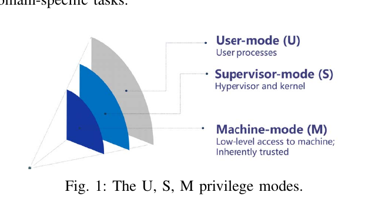

**图 1 中文说明：** 用户态 U 执行用户进程；监管者模式 S 运行 hypervisor 或内核；机器态 M 可访问机器级资源并被视为固有可信的最高特权层。

XT-910 采用同构多簇架构。每个簇最多由 4 个核组成；每核支持 32/64 KB L1 指令 Cache 与 32/64 KB L1 数据 Cache。每簇共享一个包含式、8/16 路组相联 L2 Cache，容量最高 8 MB，并支持 ECC 和奇偶校验。处理器还支持独占内存访问指令、8 或 16 个 PMP 物理内存保护区域以及符合 RISC-V Linux 规范的 Sv39 MMU。LSU 支持非对齐数据访问。系统还包含标准 CLINT 和 PLIC 多核中断控制器、定时器、调试器、性能监控器和 I/O 从接口。

**图 2 中文说明：** 每个核包括硬件辅助调试 HAD、分支预测、取指、译码、重命名、分派、发射队列、物理寄存器文件、写回、ALU、向量单元、FPU、分支跳转单元 BJU、LSU、MMU/TLB，以及私有 L1 I/D Cache。多个核经一致性总线连接并共享 L2。

### 表 I：XT-910 核配置

| 特性 | 可配置项 |
|---|---|
| 每簇核心数 | 1、2、4 |
| L1 数据 Cache | 32 KB、64 KB |
| L1 指令 Cache | 32 KB、64 KB |
| L2 Cache | 256 KB–8 MB |
| 向量扩展 | 有或无 |

为了提高性能，XT-910 提供 RISC-V 向量扩展以及算术、位操作、load/store、TLB 和 Cache 操作等非标准定制扩展；还扩展 MMU，以支持基于页的内存属性管理，并扩展中断控制器以支持权限控制。所有扩展均由配套编译工具链支持。通过硬件配置可以禁用非标准扩展，使 XT-910 以完全兼容标准 RISC-V 的模式运行。

**图 3 中文说明：** 上图为带向量执行单元与 512 KB L2 的单核版图，下图为双核版图。

版图后仿真结果汇总于表 II。在 TSMC 12 nm FinFET 工艺下，不计 L2，带向量单元和不带向量单元的单核面积分别为 0.8 mm² 与 0.6 mm²。在 0.8 V VDD 下，使用 LVT 标准单元库和 ULVT SRAM，核心频率超过 2.0 GHz；若使用 ULVT 标准单元并把 VDD 提升至 1.0 V，即升压模式，可达到 2.5 GHz。另一次 7 nm FinFET 实验中，单核频率达到 2.8 GHz。

### 表 II：12 nm FinFET 下的 XT-910 核结果

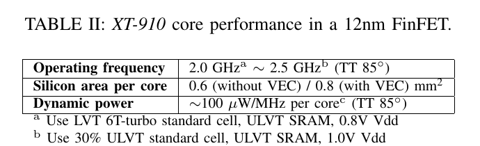

| 指标 | 结果 |
|---|---|
| 工作频率 | 2.0 GHzᵃ–2.5 GHzᵇ，TT、85 ℃ |
| 每核硅面积 | 不带 VEC 0.6 mm²；带 VEC 0.8 mm² |
| 动态功耗 | 约 100 μW/MHz/核ᶜ，TT、85 ℃ |

脚注：

- a：LVT 6T-turbo 标准单元、ULVT SRAM、0.8 V VDD。
- b：30% ULVT 标准单元、ULVT SRAM、1.0 V VDD。
- c：配置为 32/64 KB L1、256/512 KB L2，不含 VEC。

XT-910 流水线的前端包含 IF 到 RF 共 7 级。IFU 使用混合预测器，预测分支方向、分支地址、函数返回地址和间接跳转地址。IDU 每周期可同时译码 3 条指令，并借助物理寄存器最多重命名 4 条指令。乱序发射引擎最多可发射 8 条指令。

后端包含多个执行单元：两个单周期 ALU、一个单周期分支跳转单元、一个双发射乱序 load/store 单元、两个标量浮点单元和两个向量执行单元。多周期 ALU 与除法单元共享一条执行管线；整数乘法单元与两个单周期 ALU 共用一条管线。LSU 支持非对齐访问和多模式、多流预取，以提高数据访问带宽。

### 教学解读：流水级、宽度和乱序窗口应当怎样理解

“12 级流水”“每周期译码 3 条”“最多重命名 4 条”“最多发射 8 条”描述的是不同维度，不能把这些数字当成同一种吞吐宽度，也不能据此断言处理器每周期能完成 8 条程序指令。

首先，流水级数描述一条指令从取指到退休所经过的时序阶段。流水更深，组合逻辑可被切得更短，通常有利于提高频率；代价是旁路、控制和恢复更复杂，分支误预测或异常清空可能损失更多周期。图 4 把 IF、IP、IB、ID、IR、IS、RF、不同执行路径、WB 和 RT 画在同一张时序图中。各类指令的执行延迟并不相同，因此“12 级”是对主流水组织的概括，不能把图上所有方框机械相加，得出每一类指令都具有完全相同的 12 周期延迟。

其次，各宽度位于不同流水位置：

- 128 位取指是每周期从 I-Cache 读取的比特数。若全部是 16 位压缩指令，理论上最多容纳 8 条；若全部是常规 32 位指令，则最多容纳 4 条。跨取指边界、控制流改变、I-Cache miss 和有效指令不足都会进一步降低实际条数。
- 每周期打包 8 条表示 IP 级具备识别和整理最多 8 条短指令的能力，不等于下游能同时执行 8 条。
- 每周期译码 3 条是稳定进入后端的主要前端宽度，通常更接近标量程序的长期吞吐上限之一。
- 最多重命名 4 条可能来自译码后内部表示、缓冲或特定拆分/融合路径。论文没有公开足够细节，不能仅根据 3 译码和 4 重命名推断具体实现。
- 最多发射 8 条指的是多个发射队列可在同一周期向不同执行端口选择多个已就绪的内部操作。ISA 指令可能拆成多个微操作，而且 8 个执行端口并非对任意操作都通用，因此这不是“任意 8 条指令”的承诺。
- 退休宽度在这两份材料中没有明确给出。即使前面能够宽发射，最终持续 IPC 仍会受到退休带宽、ROB 头部阻塞和精确异常规则约束。

论文引言还把 XT-910 称为“triple-issue”，后面的架构章节和演示稿则写“最多发射 8 条”。原文没有给出足以统一两种口径的内部接口定义。较稳妥的理解是：三路描述前端稳定送入后端的宏观宽度，八路描述多个执行管线合计的峰值选择/发射能力；但这属于结合框图作出的解释，不能当成论文明确公布的接口规范。

192 项 ROB 的作用是扩大可观察的乱序窗口。当一条较老 load 等待较长访存延迟时，处理器可以继续观察后续指令，从中寻找与该 load 无关的工作。ROB 越大，隐藏长延迟的机会通常越多，但也会增加面积、功耗、查找与恢复复杂度。若后续指令都依赖这条 load，或者发射队列、物理寄存器、LQ/SQ 先耗尽，再大的 ROB 也无法继续推进。

因此，可把单线程性能粗略理解为下面这条受限链：

> 有效取指供给 → 译码与重命名 → 依赖唤醒和发射 → 执行端口 → Cache/TLB/内存 → 按序退休

长期 IPC 由链上最紧的环节以及错误推测造成的无效工作共同决定。判断瓶颈时，必须同时观察有效取指条数、分支误预测、队列占用、操作数未就绪、端口冲突、Cache/TLB miss、回放、ROB 头部等待和退休情况，而不能只看某一个峰值宽度。

## 三、取指单元

IFU 分为三个流水级：

1. **Instruction Fetch（IF，取指）：** 访问 L1 指令 Cache 获取指令，把虚拟地址转换为物理地址，并处理第一级分支跳转。单周期最多从 L1 Cache 取出 128 位指令行。
2. **Instruction Pack（IP，指令打包）：** 对指令打包和预处理，处理第二级分支跳转，并在 Cache miss 时回填 Cache line。每周期最多打包 8 条指令。后续 IDU 最多只译码 3 条，因此作者认为 IP 吞吐量不会成为性能瓶颈。
3. **Instruction Buffer（IB，指令缓冲）：** 缓存打包后的指令，每周期向 ID 级发送最多 3 条，并处理第三级跳转。

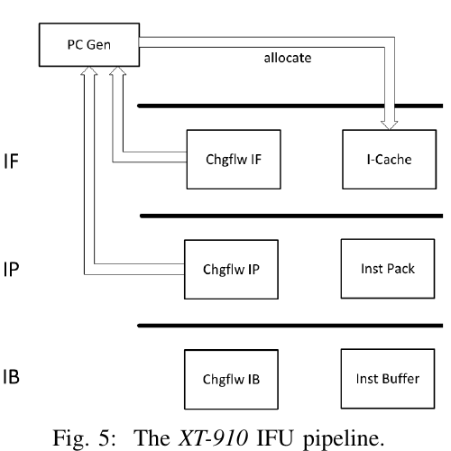

**图 5 中文说明：** IF 级包含 PC 生成、IF 级控制流改变和 I-Cache；IP 级包含 IP 控制流改变和指令打包；IB 级包含 IB 控制流改变和指令缓冲。PC 分配与各级纠错形成反馈路径。

XT-910 使用混合多模式分支预测，覆盖绝对跳转、条件分支、间接分支和函数调用返回，同时预测方向和目标地址，使程序跳转尽可能早地发起，降低控制流改变导致的流水气泡。通过预测预取的指令全部缓存在 IBUF 中；预测正确时 IBUF 可以积累指令，因此即使发生 Cache miss，IFU 仍可能向后续 IDU 提供足够指令。

### A. 分支方向预测

为提高取指效率，IFU 尽量在最早流水级预测条件分支方向。IF 级捕获少数分支并立即处理跳转，使这些分支的延迟惩罚降为零；大部分条件分支在 IP 级捕获。预测依据分支历史，预测结果存放于多个存储体中，由动态监控算法选择最终结果。为保存大量预测值，这些存储体由高密度 SRAM 实现。

IF 级一次处理 128 位、最多 8 条指令，因此每周期取出的指令中很可能含条件分支，而且当前分支方向可能受前一分支影响。SRAM 存储体访问延迟较大，读出预测值后必须先进入寄存器才能使用。若把当前分支的预测方向作为后一分支的历史信息，就会增加一个周期延迟，导致相邻周期的条件分支无法连续处理。

XT-910 使用多级缓冲预取预测值。系统以模糊匹配方式提前从条件分支预测存储体读出可能的预测结果，缓存在 BUF1 和 BUF2。检测到分支时使用 BUF1 的值进行预测，并把 BUF2 中相关值上移到 BUF1，供下一周期分支使用。

这一机制还能在单周期预测多条分支。如果 128 位取指内容中含多条分支，第一条的结果来自 BUF1；根据该结果，可从 BUF2 获得第二条分支结果。更高级预取缓冲可以并行支持更多分支。若误预测，只有当分支到达分支跳转执行单元时才纠正；与在 IP 级执行跳转相比，至少造成 7 个周期的性能惩罚。

### B. 分支目标预测

只预测是否跳转还不够，目标地址同样重要。即便在 IP 级正确发起跳转，流水中仍会出现一个气泡；跳转过于频繁时，IFU 带宽无法满足后端需求。

为消除气泡，IFU 使用级联 BTB。L1 BTB 是主 BTB，拥有 1K 以上条目，采用组相联结构；L0 BTB 为 16 条目的全相联结构。若 IF 级命中 L0 BTB，就立即使用表中预测地址发起跳转，从而消除流水气泡。

L0 BTB 的方向和目标预测在 IP 级确认：方向由分支预测器检查，目标由 L1 BTB 检查。若 L0 BTB 误预测，IP 级立即纠正目标。传统设计通常在流水后段纠正 L1 BTB，XT-910 则在 IB 级检查 L1 BTB 目标并立即纠错。

多数情况下，IP 级跳转的损失可被 IBUF 中的预取指令隐藏。L0 BTB 主要捕获无法被隐藏的连续跳转程序：这类程序频繁在 IP 级跳转，IBUF 指令逐渐减少，最终无法遮蔽气泡。把这些分支缓存到 L0 BTB 后，可在 IF 级发起跳转。IFU 还包含间接分支预测器；子程序调用使用返回地址栈预测返回地址。

### C. 循环缓冲

为加速小循环取指，IFU 还提供 LBUF。小循环中频繁发生回跳；若在 IP 级执行跳转会插入气泡，而且当前迭代最后一条指令不能与下一迭代第一条指令同时发射。

LBUF 将完整循环体缓存起来，使当前迭代末指令与下一迭代首指令可以同时送入后续流水，从而尽量保持 IDU 每周期 3 条指令的供给。循环体允许前向分支，因此含 if-else 的小循环也可被加速。执行循环时无需访问 L1 指令 Cache，也可以降低功耗。XT-910 的 LBUF 有 16 个条目；发生上下文切换时清空。

**图 7 中文说明：** 从 I-Cache 取指时，回跳会在相邻迭代间形成 bubble；从 LBUF 连续输出时，上一迭代尾部与下一迭代头部可连续打包，减少空槽。

### 教学解读：分支预测为什么决定前端有效带宽

取指前必须知道下一条 PC。顺序代码的下一地址容易计算，分支却同时提出两个问题：是否跳转，以及跳到哪里。条件分支方向预测器回答 taken/not-taken；BTB、间接跳转预测器和 RAS 分别帮助预测直接跳转目标、间接目标和函数返回地址。任何一个环节出错，都可能把错误路径指令送入后端。

L0 BTB 小而快，重点解决最早一级的低延迟目标供给；L1 BTB 容量更大，用来覆盖更多分支 PC。二者级联体现的是典型的容量与访问延迟权衡。方向预测表采用高密度 SRAM，可以保存更多历史，但读延迟不容易直接塞入最早预测级，所以设计又增加 BUF1/BUF2，把可能即将用到的预测值提前读出。这里的缓冲不是扩大指令 Cache，而是在时序压力下把预测信息提前送到关键路径。

IBUF 则解耦前端和后端的瞬时速度。前端供给充足时先积累指令；短暂 I-Cache miss 或一次较晚的跳转修正发生时，后端仍可能从 IBUF 取到已有指令。不过，缓冲只能吸收短期波动，不能弥补长期平均供给不足。若错误路径填满缓冲，或连续跳转反复打断取指，缓冲中的内容也可能失效。

LBUF 针对短循环采用另一种办法：把循环体留在专用缓冲中，避免每轮重新访问 I-Cache，并让上一轮末尾与下一轮开头连续供给。它主要改善“小而热、反复执行”的循环；对于超过 16 项容量、控制流复杂或频繁退出的循环，收益会下降。

评价这套前端不能只看总分支准确率。至少应区分条件分支、直接跳转、间接跳转和 return，并同时统计：每千条指令误预测数、误预测恢复周期、BTB miss、RAS 错误、I-Cache/TLB miss、IBUF 空周期、每周期有效取指/译码条数，以及错误路径上被清除的指令数。总准确率可能很高，但一个低频、惩罚很大的间接分支仍可能主导性能。

## 四、执行核

执行核包括 ID、IR、IS、RF、EX1–EX4 与 RT1–RT2。IDU 覆盖 ID 到 RF：

- ID 级分解和译码指令，根据指令类型、操作数数量和写回数量等属性拆成微指令，并支持标量与向量指令的零延迟解耦。
- IR 级用物理寄存器重命名 GPR、FGPR 和 VGPR 操作数，对标量整数、浮点和向量寄存器都进行重命名。重命名既处理数据依赖，也消除高成本 move 指令。XT-910 推测性分配物理寄存器；指令写回完成并退休后释放物理寄存器。
- IS 级执行乱序调度。处理器有 8 个由全部已发射指令共享的指令槽。多个独立乱序发射队列依据执行单元资源和负载装入指令；发射队列使用基于年龄向量的调度算法，并通过监控流水负载实时调整优先级，实现动态负载平衡。

EX 级包含 8 条执行管线，可并行处理 2 条算术指令、1 条分支、1 条 load、2 条 store（原文称“伪双 store”，第五节详述），以及 2 条标量浮点或向量指令。

RT 级负责写回与退休。RTU 按程序顺序退休指令并释放物理寄存器。虽然执行是乱序的，为保证正确性仍必须顺序退休，这由最多容纳 192 条指令的 ROB 实现。若一条指令发生异常，它必须到达退休点，且后续推测执行指令会从流水中清除。

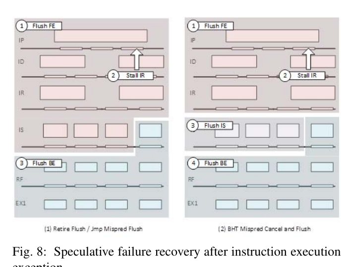

**图 8 中文说明：** 左侧表示退休级事件或跳转误预测触发前端与后端清空；右侧表示 BHT 误预测被取消，并依次清空前端、发射级和后端。两者都展示了异常或错误推测后恢复按序状态的控制过程。

### 教学解读：乱序执行真正解决的是“等待期间还能做什么”

乱序执行不会改变程序可见的结果。它把“执行顺序”和“提交顺序”分开：只要操作数和执行端口已经就绪，年轻指令可以先执行；但所有指令仍通过 ROB 按程序顺序退休。这样既能利用不同指令之间的并行性，又能在异常、分支误预测或访存次序推测失败时恢复精确状态。

寄存器重命名把同一个架构寄存器的不同逻辑版本映射到不同物理寄存器，从而消除 WAR 和 WAW 伪依赖。例如两条互不相关的指令都写 a0 时，重命名后可以写入不同物理寄存器。RAW 真依赖不能被重命名消除：消费者仍必须等待生产者的结果。发射队列中的 not-ready 指令，本质上可能在等待整数、乘除法、浮点、向量或 load 的结果；只有进一步按生产者类型和等待时长分类，才能判断问题来自长依赖链、Cache miss，还是唤醒/旁路时序。

年龄向量帮助调度器在多个就绪候选中优先选择较老指令，减少 ROB 头部长期得不到执行的风险。但调度还必须服从端口约束。例如两条指令都只能进入同一乘法管线，即使它们都已就绪，也不能凭借“8 发射”在一个周期同时执行。由此要区分三类等待：操作数未就绪、目标执行端口忙、后端结构资源已满。

恢复机制是乱序核正确性的核心。分支执行后发现方向或目标错误，必须撤销更年轻的错误路径状态，并从正确 PC 重新取指；异常通常等到相关指令到达 ROB 头部再精确处理。图 8 展示的是恢复控制路径，不表示所有异常都具有完全相同的固定惩罚。实际代价取决于错误被哪一级发现、错误路径已经深入多少、前端重新供给需要多久，以及 Cache/TLB 状态是否可复用。

## 五、存储子系统

### A. 双发射乱序 LSU

作者称 XT-910 是当时唯一支持双发射乱序 LSU 的 RISC-V 处理器。LSU 可并行处理一条 load 与一条 store，因此设置独立 load 管线和 store 管线。每条管线都含地址生成 AG、数据 Cache DC、数据对齐 DA 和写回 WB 四级：

- AG：生成 load/store 地址，访问 uTLB，把虚拟地址转换为物理地址。
- DC：访问数据 Cache。
- DA：完成数据对齐。
- WB：把数据写回物理寄存器文件。

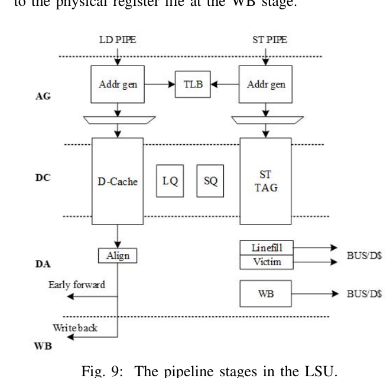

数据 Cache 系统包含 load 管线使用的 DATA RAM 和 LD TAG RAM，并为 store 管线增加独立 ST TAG RAM；load 与 store 分别访问各自 RAM。为了正确乱序执行，LQ 和 SQ 维护内存指令顺序并检查地址依赖。

执行 load 时，检查 SQ 中所有更早 store；地址相同的 store 数据会转发给 load。执行 store 时检查 LQ；若发现同地址、更年轻的 load 已提前执行，则内存推测失败并产生全局 flush。为减少推测失败损失，XT-910 预测并标记可能冲突的 load/store，在执行单元中阻塞相应 load，保证它不会越过相关 store。

### B. 伪双 store 指令

为了加速 store，指令进入队列前拆成两个微操作：

- st.addr：保存 store 的地址部分，用于地址生成和 Cache 查询；从共享 load/store 发射队列进入 store 地址管线。
- st.data：保存 store 的数据部分，用于读取操作数；从专用 store-data 发射队列进入 store-data 管线，访问物理寄存器文件并接收执行单元转发。

两者经过各自管线后，在 SQ 的写缓冲中合并，再写入数据 Cache 或片外存储。地址与数据分离后，地址生成和 Cache 访问可以更早开始。

### 教学解读：内存乱序、转发与地址/数据拆分

存储指令的困难在于，寄存器依赖在重命名时就能看见，而两次访存是否指向同一地址，往往要等地址生成后才知道。处理器希望让年轻 load 越过尚未完成的旧 store，以便尽早获得数据；但若二者后来被证明访问同一地址，就必须保证 load 读到正确的 store 数据。

SQ 保存较老 store 的地址和数据。load 地址产生后，会查询更老的 SQ 项：若地址匹配且 store 数据已经就绪，可直接进行 store-to-load forwarding；若地址尚未知或数据未就绪，处理器需要等待、预测无冲突后继续，或者在稍后发现冲突时回放/清空。论文所说的“推测失败预测”就是试图提前识别高风险 load/store 对，减少先执行后撤销的代价。

把 store 拆为 st.addr 和 st.data，是因为地址依赖链与数据依赖链常常不同。地址可能很早就由基址加偏移得到，而待写数据仍在等待前序计算；也可能相反。拆开后，地址侧可以先完成 TLB、Cache tag 和冲突检查，数据侧独立等待真实数据，最终在 SQ 中合并。这会增加内部微操作和队列管理复杂度，却能提高调度自由度。因此，“伪双 store”不是每周期向 Cache 独立提交两个完整 store，而是地址微操作与数据微操作可占用两条不同路径。

Hot Chips 所称 3 周期 load-to-use，是在命中和旁路条件满足时，从 load 发起到消费者可使用结果的核心延迟；它不包含 D-Cache miss、TLB miss、Bank 冲突或回放。“store 执行为 1 周期”同样主要描述地址/数据处理路径的局部能力，不代表数据在 1 周期后已经对其他核心或外部内存全局可见。

### C. 多模式、多流数据预取

高性能应用中，存储带宽和延迟与处理器速度之间存在巨大差距。多级 Cache 虽能减轻 memory wall，但数据复用次数很少或 Cache 容量不足时仍会受限。

XT-910 使用多模式、多流数据预取。它对数据流做模式匹配，把数据提前填入 L1 或 L2，降低长存储延迟导致处理器停顿的概率。支持两种模式：

1. **全局预取模式：** 适合简单、连续的数据流，支持任意 stride，最大预取深度 64 条 Cache line。
2. **多流预取模式：** 适合复杂场景，最多支持 8 条不同 stride 的数据流，最大预取深度 32 条 Cache line。

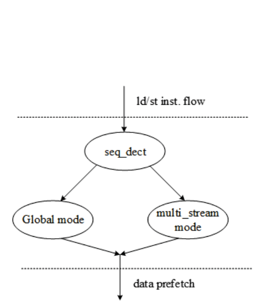

预取分三步：

1. **计算 stride：** 从 load 地址中发现正确访问模式。
2. **预取控制：** 决定策略并评估置信度。策略设置预取深度并动态启停，避免过度预取污染 Cache，也避免预取过慢。置信度判断当前策略是否准确，以及是否需要修改或放弃。
3. **实际执行：** 发起多流数据预取，并支持虚拟地址跨页预取。到达页边界时自动请求下一虚拟页转换，获得物理页地址后继续预取。

### 教学解读：预取器应从四个维度评价

预取不是“开得越深越好”。一个预取器至少需要同时评价四个维度：

1. **覆盖率：** 原本会发生的 demand miss 中，有多少被预取消除。覆盖率低说明仍有大量真实 miss 未被识别。
2. **准确率：** 发出的预取中，有多少数据后来确实被程序使用。准确率低会浪费带宽和 MSHR，并污染 Cache。
3. **及时性：** 有用数据是否在 demand load 到来前已经进入合适层级。预取正确但到得太晚，仍然无法隐藏延迟；到得过早，又可能在使用前被替换。
4. **污染与带宽代价：** 预取是否挤掉更有用的 Cache line，是否阻塞真正的 demand 请求，是否增加片上互连和 DDR 流量。

全局模式适合一条或少数规则 stride；多流模式允许同时跟踪多个访问序列，更适合交错数组或多个循环流。所谓预取深度是向当前需求地址前方探索的 Cache line 数量，不等于同时一定存在相同数量的未完成请求。最佳距离取决于处理器频率、内存延迟、循环每次迭代的计算量和可用带宽。

### D. 多页大小、多级 TLB

XT-910 在各级 TLB 中都支持 4 KB、2 MB 和 1 GB 页。uTLB 与 jTLB 的每个条目都包含页大小属性。访问全相联 uTLB 时，请求虚拟地址与所有条目的 VPN 比较；uTLB miss 后把虚拟地址送到 jTLB。

jTLB 为四路组相联，同一时刻只能使用一种页大小对应的索引。它依次尝试 4 KB、2 MB、1 GB 索引；命中后把对应条目回填 uTLB，三种页大小均 miss 时触发页表遍历。

### E. Linux 操作系统中的内存管理

为满足 Linux 内存管理要求，XT-910 增加了多条指令来提高 MMU 与 Cache 一致性：

1. 可指定 ASID、页表基址或虚拟地址，并通过互连总线广播 TLB 维护信息。CPU 核和总线上的其他外设 IP 可解析这些信息并维护各自 MMU。相比 IPI 方案，维护由硬件完成，无需软件干预。
2. 支持 Linux 降低 TLB miss 所需的 huge page [3]。MMU 提供三级页表，每一级都可作为叶子条目，同时覆盖 4 KB、2 MB、1 GB 页。
3. ASID 扩展到 16 位。ASID 溢出时才需要清空 TLB；测试显示，16 位 ASID 显著延长溢出时间，使上下文切换引起的 TLB flush 次数降低近 10 倍。

### 教学解读：TLB 为什么是 Cache 之外的第二条访存关键路径

L1 D-Cache 通常使用虚拟地址的页内偏移进行快速索引，但权限检查、tag 比较或继续访问更低层级仍需要物理地址。TLB miss 即使最终数据命中 Cache，也可能因页表遍历而产生很长延迟。因此分析访存瓶颈时，D-Cache miss 和 TLB miss 必须分开统计。

uTLB 小而全相联，目标是用低延迟覆盖最常用的转换；jTLB 更大、四路组相联，承担容量后备。4 KB、2 MB 和 1 GB 页的页内偏移位数不同，所以 jTLB 对三种页大小使用不同索引并依次尝试。大页可用一个 TLB 项覆盖更多地址，减少大工作集的 TLB miss，但会增加内存分配粒度、碎片和系统管理约束。

ASID 让不同进程的地址转换可以同时保留在 TLB 中。16 位 ASID 降低了标识符重复使用的频率，进而减少全量 TLB flush。论文中“降低近 10 倍”描述的是作者测试环境下的 flush 次数，不等于所有程序的执行时间都会提高 10 倍；实际收益取决于上下文切换频率、工作集、TLB 容量与页表遍历代价。

## 六、多核体系结构

XT-910 采用 SMP 多核架构。最多 4 个核组成一个 CPU 簇，最多 4 个 CPU 簇通过 Ncore 互连。簇内核心通过带一致性协议的内部总线连接，共享最大可配置到 8 MB 的包含式 L2 Cache。

原文称 L2 支持 “MOSEI” 一致性协议；这很可能是 MOESI 的字母顺序笔误，Hot Chips 演示稿明确写作 MOESI。系统还包含 snoop filter，监控各核对共享 L2 的访问，以减少核间通信。

**图 13 中文说明：** 图中给出最多四簇的连接方式。簇内四核连接一致性代理和共享 L2 slice；多个 CPU 簇通过 Ncore 与外部 NPU、DDR 等模块互连。

### 教学解读：共享包含式 L2 与目录一致性的权衡

包含式 L2 意味着私有 L1 中存在的 Cache line，通常也必须在共享 L2 中保留对应记录。这样做便于把 L2 tag 当作侦听过滤信息：若 L2 表明某地址不在任何上层 Cache，就可避免向所有核心广播无效查询。代价是 L2 的有效容量不仅服务数据复用，还要容纳 L1 内容；当 L2 驱逐某条 line 时，可能需要同步使上层副本失效。

MOESI 状态用于描述一个 Cache line 在多个核心中的所有权和共享关系。目录记录哪些核心可能持有副本，snoop filter 据此缩小侦听范围。二者的目标不是消除一致性通信，而是减少不必要的广播和能耗。随着核心与簇数量增加，一致性目录容量、跨簇延迟、共享数据乒乓、L2 bank 冲突和内存带宽都会成为扩展瓶颈。

因此，多核性能不能用单核 IPC 乘以核心数直接估算。应分别观察单线程延迟、私有 Cache miss、共享 L2 命中、目录/侦听流量、互连拥塞、内存带宽、锁竞争和跨簇访问距离。论文主要给出结构能力，没有提供完整的多核扩展曲线。

## 七、向量指令扩展

XT-910 是最早采用 RISC-V Vector Extension 提案的商用处理器之一。向量引擎显著提高向量处理性能，尤其面向 AI 和机器学习应用。

与 ARM NEON、Intel SSE/AVX 等定长 SIMD 相比，ARM SVE 和 RISC-V Vector Extension 等变长向量指令集既允许硬件灵活选择参数，也提高上层软件跨不同硬件平台的可移植性。基于 RISC-V Vector 0.7.1 稳定版本，XT-910 支持双发射乱序向量指令执行。

XT-910 使用 64 位标量流水线。按规范，向量流水线支持 8–64 位整数元素，以及 FP16、FP32、FP64 向量浮点运算。向量流水由多个相同 slice 组成，每个 slice 具有完整 64 位数据通路，包括多端口 64 位向量物理寄存器文件和两条乱序向量浮点/整数执行管线。每条管线可执行：

- 一路 64 位整数或双精度浮点运算；
- 两路 32 位整数或单精度浮点运算。

每个 slice 拥有独立寄存器、旁路和执行数据通路，只有 widening、narrowing、permutation 等少数操作需要跨 slice 交换数据。

以 slice 为基础的架构可降低位宽增大造成的布局布线代价。XT-910 可支持 64–1024 位运算宽度，但深流水、乱序、多核处理器的最大 load/store 位宽会受到总线和 Cache 架构限制；更大位宽也会增加访存成本并加剧 Cache 一致性问题。

为了平衡算术逻辑位宽与 load/store 位宽，论文建议配置两个 VLEN=128、SLEN=128 的向量 slice。此配置下，XT-910 每周期产生共 256 位运算结果，并完成 128 位向量 load/store。

向量运算指令本身不指定元素格式和运算位宽，而由 vsetvl/vsetvli 配置。配置指令只需指定待处理元素数，硬件结合 VLMAX 决定实际运算宽度和元素数，使软件无需了解底层硬件参数，也能运行于不同计算位宽的平台。

这一机制对深流水不够友好：每条向量运算必须与前面的参数配置指令建立关联，拖慢执行。XT-910 因此预测向量参数并推测执行向量运算；只有 vl 变化时才产生推测失败。

多数向量操作在 3–4 周期完成；单精度与双精度向量乘法为 5 周期；整数除法和浮点除法为 6–25 周期。

### 教学解读：256 位计算宽度不等于每周期搬运 256 位数据

两个 128 位 slice 合起来可形成每周期 256 位的计算吞吐，但论文同时给出每周期 128 位向量 load/store。这里要区分计算带宽和访存带宽：若数据已在向量寄存器中并能被反复使用，两个 slice 可以持续并行计算；若每次计算都必须装入新数据，128 位访存路径可能先成为限制。实际性能还受到元素宽度、指令组合、数据重用、Cache 命中率、跨 slice 重排和依赖链影响。

以 Hot Chips 给出的每簇 FP16 峰值为例，每核每周期 32 FLOP、2.5 GHz、4 核相乘得到 320 GFLOPS，因而写作“超过 300 GFLOPS”。这里把一次 FMA 计为一次乘法加一次加法，即 2 FLOP；它是理论峰值，不包含 load/store、分支、配置指令和利用率损失。

变长向量 ISA 的核心价值是同一程序不把硬件向量寄存器长度写死。软件通过 vsetvl/vsetvli 表达剩余元素数和元素类型，硬件返回本轮实际处理长度，循环继续处理余数。XT-910 实现的是 Vector 0.7.1，而今天常见的软件工具链主要面向后来定稿的 Vector 1.0；二者在指令编码和部分语义上存在差异，不能把现代 V 扩展二进制直接当成该实现可执行程序。

## 八、非标准指令集扩展

为面向不同工业应用，XT-910 在标准 RISC-V 之外提供一组定制非标准指令，可按目的分为访存增强和基础算术增强。

### A. 访存增强

访存指令通常占动态指令的较高比例，增强它们可直接改善整体性能。作者分析主流 RISC-V 应用后认为，基础 RISC-V 访存相关指令仍有较大改进空间：

1. 支持“寄存器 + 寄存器”寻址，以及 indexed load/store，减少地址计算使用的寄存器和指令数量，从而加速循环体数据访问。
2. 支持地址生成时的无符号扩展。基础指令集不能直接把 32 位数据零扩展到 64 位，会产生较多移位指令。

### B. 算术运算增强

安全加密、音视频编解码等领域负载具有不同算术需求。例如加密算法频繁对数据中的特定字节或字段执行 shift、and、or 等操作。XT-910 因此扩展了一系列位操作、乘法和乘加指令。

### 教学解读：定制指令的收益必须拆成三部分

一条定制指令可能从三个方向带来收益：减少动态指令数，缩短关键依赖链，或把原本需要多个通用执行步骤的操作映射到专用硬件。收益是否能实现，还取决于编译器能否识别模式、寄存器和立即数字段是否合适、执行端口是否足够，以及新指令是否增加关键路径。

定制扩展也有成本。软件需要特定编译器和运行库，二进制可移植性下降；硬件要增加译码、验证、异常、调试和性能监控支持。公平评价时应至少给出“标准 ISA + 标准编译器”“标准 ISA + 优化编译器”“扩展 ISA + 优化编译器”三组结果，才能把编译优化收益和新硬件指令收益分开。论文图 20 把指令扩展与优化编译器合并比较，因此约 20% 不能全部归因于某一条或某一类定制指令。

## 九、优化工具链

平头哥发布面向 XT-910 的综合集成开发环境 CDS，提供 RISC-V 图形化 trace、profiling、指令精确模拟器和 JTAG 在线调试，并完整支持 GNU 官方编译工具集。

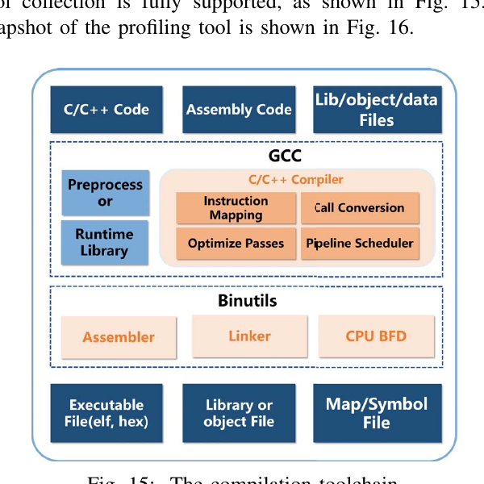

**图 15 中文说明：** 输入可为 C/C++、汇编以及库、目标或数据文件。GCC 前端包含预处理器、运行时库、指令映射、优化 pass、调用约定和流水调度；Binutils 包含汇编器、链接器和 CPU BFD；输出为 ELF/HEX、库/目标文件与 map/symbol 文件。

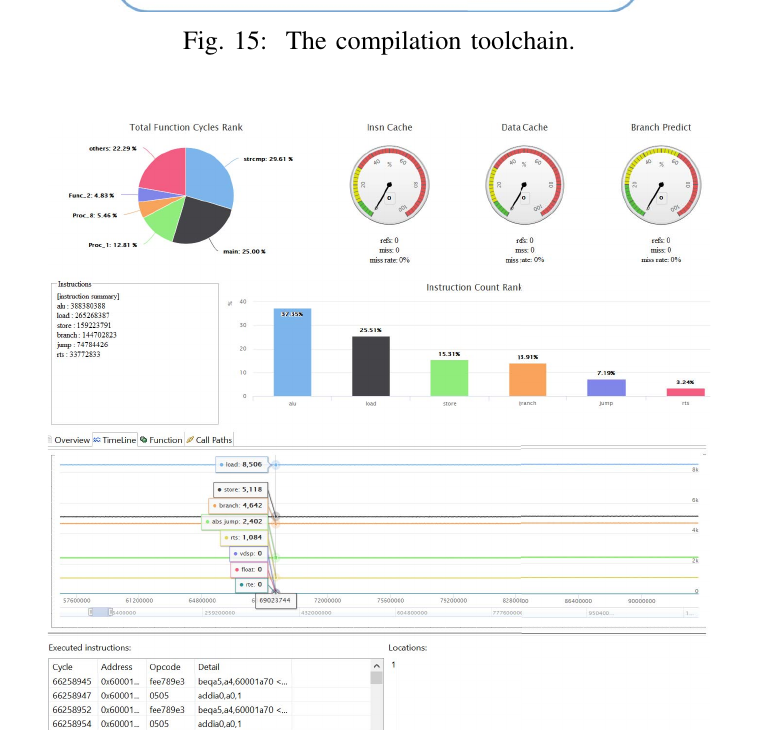

**图 16 中文说明：** 工具界面同时展示函数占比、IPC/Cache/分支预测仪表、指令计数、时间线和逐条执行信息，用于定位热点和微结构事件。

编译器与硬件协同优化包括：

1. RISC-V 在 32 位到 64 位转换时使用符号扩展。当时的现有编译器不支持 induction variable 优化，循环展开后仍包含索引自增和分支，显著降低效率。XT-910 编译器提取循环变量，把自增变量和控制代码移出循环，减少总动态指令数。
2. RISC-V 规定 global pointer 指向固定内存地址，一些变量可通过“全局指针 + 偏移”直接 load/store。编译器一般把较小变量放在 GP 可达区域，但若连续访问一个小变量和一个大变量，两者地址可能相距很远，破坏数据局部性。XT-910 编译器采用 anchor 方案，把同一函数的变量连续分配，将区域起始地址保存在寄存器中，再以偏移访问。
3. 原文称当时已有 RISC-V 编译器不支持 Dead Store Elimination，XT-910 编译器则支持 DSE。

### 教学解读：编译器也是微结构供给链的一部分

硬件峰值只有在编译器生成合适指令序列时才能转化为应用性能。循环变量提取和 DSE 主要减少动态指令；anchor 布局改善地址生成和局部性；指令选择利用定制操作；调度则尽量把相互独立的操作拉开，隐藏执行与 load-to-use 延迟。这些优化会同时改变前端压力、寄存器需求、分支频率、Cache 行为和后端依赖。

因此比较两个处理器时，只写 -O2 并不足以证明软件条件完全相同。编译器版本、目标架构参数、调优参数、链接库、是否使用 PGO/LTO、ISA 扩展、代码模型和 benchmark 规则都会影响结果。论文中的 A73 使用 GCC 6.3，XT-910 使用 GCC 8.1；作者对齐了 Cache 容量和 -O2，但编译器代际与 ISA 后端仍不同，这是阅读横向比较时必须保留的变量。

## 十、实验结果

作者使用一系列面向嵌入式 CPU 的工业 benchmark 评估性能。

### A. CoreMark

CoreMark 包含链表处理（查找与排序）、矩阵操作、状态机（判断输入流是否包含有效数字）和 CRC。作者认为它基本全部命中 Cache，几乎不受 DDR 延迟影响，主要评估核心本身。

XT-910 达到 7.1 CoreMark/MHz，比作者当时认为市场上性能最高的 RISC-V 处理器 SiFive U74 高 40%。作者提到即将发布的 SiFive U84，但投稿时没有官方产品数据，无法在不知道评测条件、硬件配置和编译细节的情况下比较。

论文以 ARM Cortex-A73 [2] 为参考，因为当时缺少同类高性能 RISC-V 的公开 benchmark。作者认为 Cortex-A73 与 XT-910 在流水级数、发射宽度等方面有许多相似性，便于从 ISA 层面分析 ARM 与 RISC-V 的差异。

实验中的 Cortex-A73 来自华为 Kirin 970，使用 Linaro GCC 6.3-2017.02，配置 64 KB L1 I-Cache、64 KB L1 D-Cache和指令/数据共享 2 MB L2。为公平比较，XT-910 使用相同 L1/L2 容量，编译器为 GCC 8.1，优化选项为 -O2。

作者特别声明，这些 benchmark 结果并不意味着 XT-910 已经达到旗舰 Cortex-A73 的完善程度；XT-910 当时刚推出，仍需要多年开放协作来覆盖大量边界情况。

### B. EEMBC

论文将 EEMBC 描述为面向自动驾驶、物联网、移动设备等硬件与软件的 benchmark，并把结果归一化到 ARM Cortex-A73。

图中四类为 automotive、consumer、networking 和 telecom。XT-910 在四组中均高于或接近 A73，其中 telecom 的相对提升最明显。

### C. NBench

原文称 NBench 是面向 .NET 应用的性能测试框架。图 19 给出 Assignment、Bitfield、Fourier、FP Emulation、Huffman、IDEA、LU Decomposition、Neural Net、Numeric Sort 和 String Sort 十个子项，并归一化到 Cortex-A73。作者结论是 XT-910 整体与 Cortex-A73 相当。

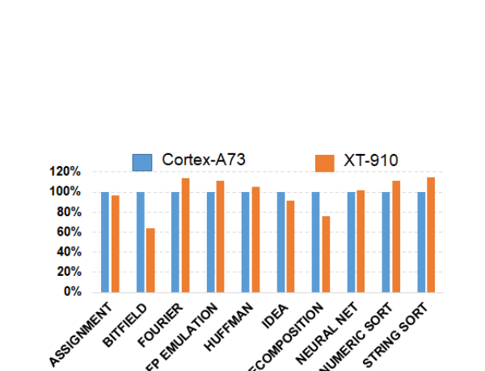

### D. SPECInt2006

作者运行了 SPECInt2006。该套件使用大型程序，频繁产生 L2 miss，综合反映核心性能、Cache 容量、Cache miss 和 DDR 延迟。XT-910 为 6.11 SPECInt/GHz，比 Cortex-A73 的 6.75 SPECInt/GHz 低 10%。

### E. 指令扩展与编译器优化收益

与原生 RISC-V ISA 和标准编译器相比，开启指令扩展与优化编译器后，XT-910 性能约提高 20%。

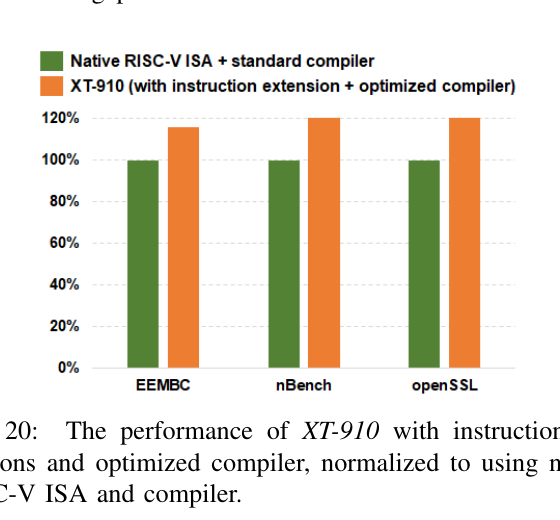

**图 20 中文说明：** EEMBC、NBench 和 OpenSSL 都以原生 RISC-V ISA 与标准编译器的 100% 为基线，扩展指令和优化编译器约达到 120%。

论文未给出 AI 实例加速数据，但指出 XT-910 支持 RISC-V Vector 0.7.1，而 Cortex-A73 使用 NEON。以 16 位乘加为例，作者称 Cortex-A73 支持 8 路 16 位 MAC，XT-910 支持 16 路 16 位 MAC，理论算力提高 1 倍；XT-910 还支持 A73 不支持的半精度运算，因此作者预计 AI 场景差距更大。

### F. 预取对存储子系统的影响

作者用 stream 测试内存访问与预取性能，以所有预取关闭的场景 a 为 1：

- a：L1、L2、TLB 预取全部关闭。
- b：只开 L1 预取，关闭 L2/TLB，配置较短预取距离；性能提高到 3.8 倍。
- c：打开 L1、L2、TLB，仍使用较短距离；提高到 4.9 倍。
- d：L1、L2、TLB 全开，预取距离从短调到长；最高达到 5.4 倍。
- e：保持 d 的其他配置，只关闭 TLB 预取；性能下降约 2.4%。

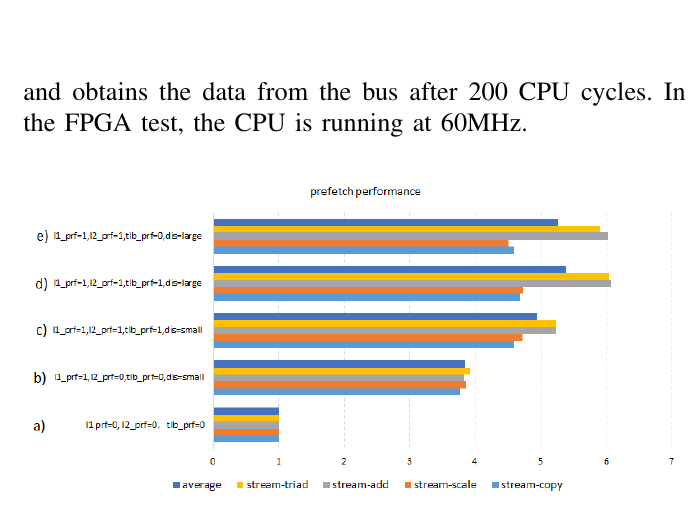

实验来自 HAPS80-S26 FPGA。由于内存访问延迟直接影响结果，作者通过总线与 DDR 延迟把一次内存访问调到约 200 个 CPU 周期，即 CPU 发出读请求后约 200 周期从总线获得数据。FPGA 测试中的 CPU 频率为 60 MHz。

### 教学解读：如何正确阅读论文中的性能图

这些结果回答的问题不同，不能混成一个“处理器快多少”的结论：

- CoreMark/MHz 主要观察小工作集下的核心与编译代码效率。按 MHz 归一化消除了频率，却没有消除编译器、ISA 扩展、Cache 配置和内存系统差异。
- EEMBC 和 NBench 展示的是相对 A73 的归一化柱状图。归一化适合看各子项相对趋势，但没有原始执行时间和误差时，无法从图中恢复绝对性能，也不能把多个柱简单做算术平均。
- SPECInt2006 更接近大程序综合性能，论文只报告 6.11 与 6.75 SPECInt/GHz，没有在正文完整披露每个子项、base/peak、迭代、编译 flags、内存时序和合法运行记录。因此它可以说明作者报告的总体差距，不能替代可复现实验档案。
- Stream 预取实验有意把存储访问设置为约 200 个 CPU 周期，形成强存储延迟压力。5.4 倍说明预取在这个特定条件下能隐藏大量延迟，不代表普通应用、ASIC 频率或不同 DDR 系统都会获得同样倍数。
- 0.6/0.8 mm²、2.0–2.5 GHz 和约 100 μW/MHz 来自指定 12 nm 工艺、标准单元/SRAM 阈值、电压、温度与配置。PPA 比较必须同时控制工艺节点、宏单元、Cache 是否计入、目标频率和活动率。

从体系结构实验方法看，最可靠的做法是先固定软件与平台，取得全套基线，再进行单变量对照。例如关闭/开启某一级预取器，同时记录 IPC、L1/L2 miss、TLB miss、预取准确率、带宽和污染；或者固定二进制，只改变分支预测配置，同时记录 MPKI、恢复周期和错误路径指令。这样才能建立“机制变化 → 微结构事件变化 → 周期变化 → 总性能变化”的因果链。

## 十一、结论

论文介绍了 XT-910：一款深流水、乱序、高性能、64 位、嵌入式、多簇多核 RISC-V 处理器。它基于 RV64GCV，并通过定制扩展增强向量与算术运算、位操作、load/store、TLB 和 Cache。每簇包含 1–4 个可启动 Linux 的核，并支持带 Cache 一致性的多核多簇系统。

单核采用 12 级流水、乱序、多发射超标量架构，在 TSMC 12 nm FinFET 的典型工艺与温度条件下最高达到 2.5 GHz。不含 L2，带/不带向量单元的单核面积分别为 0.8/0.6 mm²。工具链经过大幅优化以支持定制扩展。作者认为通过软硬件协同设计，XT-910 在当时多项工业控制流与数据计算 benchmark 上取得了 RISC-V 家族前代中最高的 IPC、速度和能效。

自 2019 年 7 月正式发布后，XT-910 FPGA 已部署到阿里云数据中心，通过把服务器任务卸载到 FPGA 并利用定制和向量扩展实现专用加速。ASIC 已经流片，计划在芯片 bring-up 后部署；IP 也被数十家外部客户用于边缘和物联网端点。团队当时正增强多核扩展、并行计算和功能安全。

作者认为，相比 ARM，RISC-V ISA 在体系结构上更简洁，可降低译码、执行和工具链复杂度；其模块化允许通过不同子集组合，在不同应用中灵活权衡功耗、面积和性能。但 RISC-V 中的位操作、trace、虚拟化等提案当时尚未完全定型，而 ARM 已有成熟功能。

XT-910 的研发使作者形成以下判断：

1. RISC-V 不仅适合低功耗、低成本嵌入式 MCU，也适合高性能计算；基于 RV64GC 的 XT-910 在多种通用应用上已达到主流架构商用核心的性能。
2. RISC-V 向量扩展适合 AI 和机器学习。
3. RISC-V 的潜力不限于边缘计算；其灵活性和可定制性也适合数据中心，尤其适合后摩尔时代可伸缩的领域专用加速器。

作者引用一句归于达尔文的话：“生存下来的不是最强壮、也不是最聪明的物种，而是最能适应变化的物种。”作者认为这一理念同样适用于计算体系结构。不过，演进中的 RISC-V 在技术和生态方面仍不成熟。团队积极参加 RISC-V 基金会标准化，并与技术组讨论 XT-910 的有效定制扩展；Cache 操作等扩展已受到关注，并被考虑纳入未来标准 ISA。

为了与其他主流高性能架构竞争，RISC-V 社区需要保持 ISA 一致性，并通过软硬件协同设计共同创新。

## 致谢

作者感谢阿里巴巴平头哥事业部 CPU 硬件和软件工程团队付出的巨大努力，也感谢阿里云基础设施与服务事业部的大力支持。

## 参考文献

以下保留原论文的编号、作者、出处和链接，并将题目译为中文。

1. ARM，《Cortex-A55 CPU》，https://www.arm.com/products/silicon-ip-cpu/cortex-a/cortex-a55 。
2. ARM，《Cortex-A73 CPU》，https://www.arm.com/products/silicon-ip-cpu/cortex-a/cortex-a73 。
3. Red Hat，《Red Hat Enterprise Linux 性能调优指南》，https://access.redhat.com/documentation/en-us/red_hat_enterprise_linux/6/html/performance_tuning_guide/ch-intro#idm140449023557936 。
4. 《PULP 平台》，https://pulp-platform.org/ 。
5. 《Shakti 处理器计划》，https://shakti.org.in/ 。
6. SiFive，《U74 标准核》，https://www.sifive.com/cores/u74 。
7. Intel Corporation，《Intel 64 与 IA-32 架构优化参考手册》，技术报告，2011 年 6 月，http://www.cs.princeton.edu/courses/archive/spr15/cos217/reading/ia32opt.pdf 。
8. 《NVIDIA 中的 RISC-V》，第六届 RISC-V Workshop，上海，2017。
9. K. Asanović、R. Avizienis、J. Bachrach、S. Beamer、D. Biancolin、C. Celio、H. Cook、D. Dabbelt、J. Hauser、A. Izraelevitz、S. Karandikar、B. Keller、D. Kim、J. Koenig、Y. Lee、E. Love、M. Maas、A. Magyar、H. Mao、M. Moreto、A. Ou、D. A. Patterson、B. Richards、C. Schmidt、S. Twigg、H. Vo、A. Waterman，《Rocket Chip 生成器》，加州大学伯克利分校 EECS 系技术报告 UCB/EECS-2016-17，2016 年 4 月，http://www2.eecs.berkeley.edu/Pubs/TechRpts/2016/EECS-2016-17.html 。
10. C. Celio、D. A. Patterson、K. Asanović，《Berkeley 乱序机器 BOOM：具有产业竞争力、可综合、可参数化的 RISC-V 处理器》，加州大学伯克利分校 EECS 系技术报告 UCB/EECS-2015-167，2015 年 6 月，http://www2.eecs.berkeley.edu/Pubs/TechRpts/2015/EECS-2015-167.html 。
11. J. Feehrer、S. Jairath、P. Loewenstein、R. Sivaramakrishnan、D. Smentek、S. Turullols、A. Vahidsafa，《Oracle SPARC T5 16 核处理器扩展到八路插槽》，IEEE Micro，33(2)，48–57，2013 年 3 月，http://ieeexplore.ieee.org/document/6493301/ 。
12. E. Flamand、D. Rossi、F. Conti、I. Loi、A. Pullini、F. Rotenberg、L. Benini，《GAP-8：面向 IoT 边缘 AI 的 RISC-V SoC》，第 29 届 IEEE 专用系统、体系结构与处理器国际会议（ASAP 2018），意大利米兰，2018 年 7 月 10–12 日，1–4，https://doi.org/10.1109/ASAP.2018.8445101 。
13. N. Gala、A. Menon、R. Bodduna、G. S. Madhusudan、V. Kamakoti，《SHAKTI 处理器：一项开源硬件计划》，第 29 届 VLSI Design 国际会议暨第 15 届 Embedded Systems 国际会议（VLSID 2016），印度加尔各答，2016 年 1 月 4–8 日，7–8，https://doi.org/10.1109/VLSID.2016.130 。
14. M. Gautschi、M. Muehlberghuber、A. Traber、S. Stucki、M. Baer、R. Andri、L. Benini、B. Muheim、H. Kaeslin，《SIR10us：紧耦合 OpenRISC 椭圆曲线密码协处理器》，第 25 届 IEEE 专用系统、体系结构与处理器国际会议，瑞士苏黎世，2014 年 6 月，25–29，http://ieeexplore.ieee.org/document/6868626/ 。
15. M. Gautschi、P. Schiavone、A. Traber、I. Loi、A. Pullini、D. Rossi、E. Flamand、F. K. Gurkaynak、L. Benini，《带 DSP 扩展、面向可伸缩 IoT 端点设备的近阈值 RISC-V 核》，IEEE Transactions on Very Large Scale Integration (VLSI) Systems，卷 PP，2016 年 8 月。
16. T. R. Gross、N. P. Jouppi、J. L. Hennessy、S. Przybylski、C. Rowen，《回顾“MIPS：一种微处理器体系结构”》，2016。
17. J. Hennessy、N. Jouppi、F. Baskett、J. Gill，《MIPS：一种 VLSI 处理器体系结构》，VLSI Systems and Computations，337–346，Springer，1981。
18. J. Hennessy、N. Jouppi、S. Przybylski、C. Rowen、T. Gross、F. Baskett、J. Gill，《MIPS：一种微处理器体系结构》，ACM SIGMICRO Newsletter，13(4)，17–22，1982。
19. B. Keller、M. Cochet、B. Zimmer、J. Kwak、A. Puggelli、Y. Lee、M. Blagojevic、S. Bailey、P. Chiu、P. Dabbelt、C. Schmidt、E. Alon、K. Asanović、B. Nikolić，《采用 28 nm FD-SOI、集成亚微秒级电源管理的 RISC-V 处理器 SoC》，IEEE JSSC，52(7)，1863–1875，2017，https://doi.org/10.1109/JSSC.2017.2690859 。
20. P. Kongetira、K. Aingaran、K. Olukotun，《Niagara：32 路多线程 SPARC 处理器》，IEEE Micro，25(2)，21–29，2005 年 3 月，http://ieeexplore.ieee.org/document/1453485/ 。
21. G. Konstadinidis、M. Tremblay、S. Chaudhry、M. Rashid、P. Lai、Y. Otaguro、Y. Orginos、S. Parampalli、M. Steigerwald、S. Gundala、R. Pyapali、L. Rarick、I. Elkin、Y. Ge、I. Parulkar，《第三代 65 nm、16 核、32 线程芯片多线程 SPARC 处理器的体系结构与物理实现》，IEEE Journal of Solid-State Circuits，44(1)，7–17，2009 年 1 月，http://ieeexplore.ieee.org/document/4735553/ 。
22. Y. Lee、A. Waterman、R. Avizienis、H. Cook、C. Sun、V. Stojanović、K. Asanović，《带向量加速器的 45 nm、1.3 GHz、16.7 双精度 GFLOPS/W RISC-V 处理器》，第 40 届欧洲固态电路会议（ESSCIRC 2014），意大利 Venice Lido，2014 年 9 月 22–26 日，199–202，https://doi.org/10.1109/ESSCIRC.2014.6942056 。
23. A. S. Leon、K. W. Tam、J. L. Shin、D. Weisner、F. Schumacher，《高能效、高吞吐 32 线程 SPARC 处理器》，IEEE Journal of Solid-State Circuits，42(1)，7–16，2007 年 1 月，http://ieeexplore.ieee.org/document/4039591/ 。
24. A. Lopez-Parrado、J.-C. Valderrama-Cuervo，《用于数字信号处理的 OpenRISC SoC》，第 19 届图像、信号处理与人工视觉研讨会，哥伦比亚 Armenia，2014 年 9 月，1–5，http://ieeexplore.ieee.org/document/7010123/ 。
25. T. Marena，《RISC-V：高性能嵌入式 SweRV Core 微体系结构、性能与 CHIPS Alliance》，Western Digital 技术报告，2019 年 4 月，https://content.riscv.org/wp-content/uploads/2019/04/RISC-V_SweRV_Roadshow-.pdf 。
26. N. Mehdizadeh、M. Shokrolah-Shirazi、S. G. Miremadi，《分析 32 位 OpenRISC 1200 微处理器中的故障效应》，第三届可用性、可靠性与安全国际会议（ARES 2008），2008 年 3 月，648–652，http://ieeexplore.ieee.org/document/4529404/ 。
27. A. Menon、S. Murugan、C. Rebeiro、N. Gala、K. Veezhinathan，《Shakti-T：带轻量级安全扩展的 RISC-V 处理器》，Hardware and Architectural Support for Security and Privacy 会议论文集（HASP@ISCA 2017），加拿大 Toronto，2017 年 6 月 25 日，2:1–2:8，https://doi.org/10.1145/3092627.3092629 。
28. V. Patil、A. Raveendran、P. M. Sobha、A. D. Selvakumar、D. Vivian，《面向 RISC-V ISA 的乱序浮点协处理器》，第 19 届 VLSI Design and Test 国际研讨会（VDAT 2015），印度 Ahmedabad，2015 年 6 月 26–29 日，1–7，https://doi.org/10.1109/ISVDAT.2015.7208116 。
29. G. Tagliavini、S. Mach、D. Rossi、A. Marongiu、L. Benini，《面向 RISC-V ISA 的 SmallFloat SIMD 扩展设计与评估》，Design, Automation & Test in Europe（DATE 2019），意大利 Florence，2019 年 3 月 25–29 日，654–657，https://doi.org/10.23919/DATE.2019.8714897 。
30. M. Tremblay、S. Chaudhry，《第三代 65 nm、16 核、32 线程加 32 个 Scout Thread 的 CMT SPARC 处理器》，IEEE 国际固态电路会议（ISSCC 2008），美国 San Francisco，2008 年 2 月，82–83，http://ieeexplore.ieee.org/document/4523067/ 。
31. A. Waterman、K. Asanović，《RISC-V 指令集手册》，RISC-V Foundation 技术报告，2017 年 5 月，https://content.riscv.org/wp-content/uploads/2017/05/riscv-spec-v2.2.pdf 。
32. F. Zaruba、L. Benini，《应用级处理的代价：22 nm FDSOI 中可运行 Linux 的 1.7 GHz 64 位 RISC-V 核能效与性能分析》，2019 年 4 月。
33. B. Zimmer、Y. Lee、A. Puggelli、J. Kwak、R. Jevtić、B. Keller、S. Bailey、M. Blagojevic、P. Chiu、H. Le、P. Chen、N. Sutardja、R. Avizienis、A. Waterman、B. C. Richards、P. Flatresse、E. Alon、K. Asanović、B. Nikolić，《集成 28 nm FDSOI 同步开关电容 DC-DC 转换器的 RISC-V 向量处理器》，IEEE JSSC，51(4)，930–942，2016，https://doi.org/10.1109/JSSC.2016.2519386 。

---

# 第二篇：玄铁 910——以 RISC-V 创新云计算与边缘计算

## 出版信息

- 英文题目：Xuantie-910: Innovating Cloud and Edge Computing by RISC-V
- 会议：IEEE Hot Chips 32 Symposium，2020
- 形式：19 页演示稿
- 演讲人：Yu Pu
- 联合作者：Chen Chen、Xiaoyan Xiang、Chang Liu、Yunhai Shang、Ren Guo、Dongqi Liu、Yimin Lu、Ziyi Hao、Jiahui Luo、Zhijian Chen、Chunqiang Li、Yu Pu、Jianyi Meng、Xiaolang Yan、Yuan Xie、Xiaoning Qi
- 单位/品牌：T-HEAD，平头哥

这份演示稿与前述 ISCA 论文介绍同一处理器，但表达更偏产品架构、实现数据和平台生态。以下按原 19 页顺序逐页翻译，并嵌入每一页原图。

## 第 1 页：标题

**玄铁 910：以 RISC-V 创新云计算与边缘计算**

演讲人：Yu Pu；品牌：T-HEAD。

## 第 2 页：平头哥与作者

**T-HEAD：开源，共建新 AIoT 时代的芯片生态。**

作者：

Chen Chen、Xiaoyan Xiang、Chang Liu、Yunhai Shang、Ren Guo、Dongqi Liu、Yimin Lu、Ziyi Hao、Jiahui Luo、Zhijian Chen、Chunqiang Li、Yu Pu、Jianyi Meng、Xiaolang Yan、Yuan Xie、Xiaoning Qi。

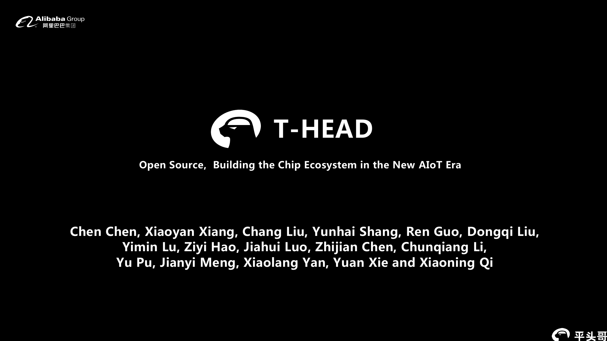

## 第 3 页：构建 AIoT 时代的芯片基础设施

平头哥将自身定位为 **AIoT 时代的基础设施提供者**。图中体系由下到上为：

1. 底层基础计算：RISC-V 兼容处理器与领域专用体系结构。
2. 领域专用 SoC 平台：整合合作伙伴 IP。
3. 操作系统：AliOS。
4. 上层应用与控制领域：MCU、安全、智能计算、工业控制、存储控制及其他方向。
5. 云端位于顶层，为 AIoT 设备和应用提供连接与计算支撑。

## 第 4 页：持续演进的玄铁处理器架构

演示稿展示玄铁产品从 902，经正在开发的 9xx 系列，演进到 910：

- 902：首款带硬件可信执行环境 TEE 的 RISC-V 处理器。
- 9xx：演进中的中间产品系列。
- 910：带 AI 加速引擎的超高性能处理器。

## 第 5 页：玄铁 910 超高性能架构

主要特性：

- RISC-V RV64GCV。
- 基于 cluster 的多核架构。
- 每簇可配置 1、2 或 4 核。
- 每核 32/64 KB L1 D-Cache 与 32/64 KB L1 I-Cache。
- 64 位、12 级流水、乱序执行。
- 每周期译码 3 条，最多发射 8 条。
- 双发射乱序访存。
- 高性能混合分支处理。
- 多模式动态数据预取。
- 面向 AI 加速的向量引擎。
- 目标应用包括 AI、边缘服务器、工业控制与 ADAS。

框图中的 910 Core 配有 I-Cache、D-Cache、FPU 和向量计算单元，经一致性互连总线连接 L2 Cache；外围包括 PLIC、Timer、Debug Unit、Trace Unit 和 Master Interface。

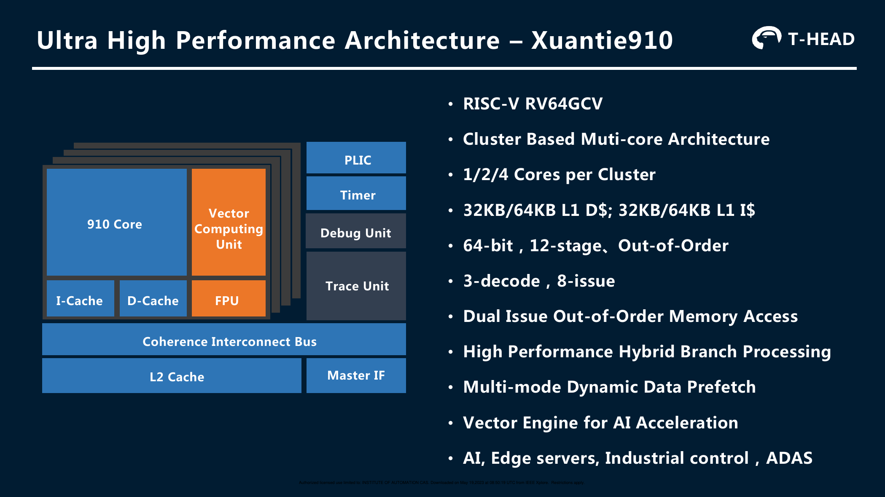

## 第 6 页：显著的 CoreMark 性能

图中按 CoreMark/MHz 比较多个 RISC-V 处理器：

| 处理器 | CoreMark/MHz |
|---|---:|
| Rocket | 2.32 |
| NXF | 3.22 |
| BOOM-2w | 3.91 |
| BOOM-4w | 4.7 |
| SweRV | 4.9 |
| SCR7 | 5.0 |
| U74 | 5.1 |
| 玄铁 910 | 7.1 |

演示稿突出玄铁 910 相对 U74 约提高 40%。图中给出的数据来源为：

- http://www2.eecs.berkeley.edu/Pubs/TechRpts/2018/EECS-2018-151.pdf
- https://content.riscv.org/wp-content/uploads/2019/04/RISC-V_SweRV_Roadshow-.pdf
- https://content.riscv.org/wp-content/uploads/2019/06/17.00-syntacore_zurich_ws.pdf
- https://www.sifive.com/cores/u74-mc

## 第 7 页：兼容 RISC-V 规范

| 类别 | 支持内容 |
|---|---|
| ISA | RV64GCV |
| 向量 | RISC-V Vector 0.7.1；FP16/32/64，INT8/16/32/64 |
| 特权模式 | Machine、Supervisor、User |
| 内存管理 | Sv39 MMU；8/16 个 PMP 区域 |
| 中断控制 | CLINT + PLIC |

## 第 8 页：RISC-V Turbo 扩展增强

RISC-V Turbo 包含：

- 计算增强；
- 位操作；
- 内存访问；
- 多核同步；
- 内存管理；
- Cache 与 TLB 操作。

右侧柱状图以 Native RV 为基线，对 EEMBC、NBench 和 OpenSSL 展示 XT-910 扩展后的归一化性能。三组中 XT-910 柱均高于原生 RISC-V，提升约在 20% 左右，与 ISCA 论文图 20 的表述一致。原图未在柱顶标出精确数值，因此不从像素高度伪造额外小数。

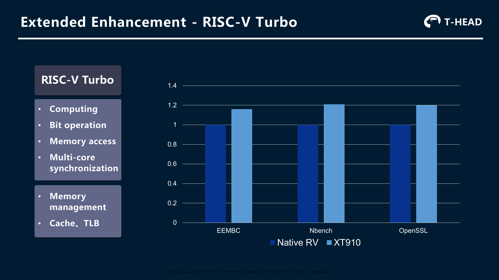

## 第 9 页：深度超标量乱序流水线

前端能力：

- 每周期取 8 条指令；
- 每周期译码 3 条指令；
- 每周期最多发射 8 条指令。

后端能力：

- 乱序内存访问；
- 专用分支处理；
- 乱序向量计算。

流水图从 IF、IP、IB 进入 ID、IR、IS、RF，后端包括：

- Load/Store 管线：AG、DC、DA；
- Branch 管线：BR；
- ALU/DIV 管线：ALU；
- ALU/MUL 管线：ALU、MUL2、MUL3；
- 两组 Vector 管线：VEC1–VEC4；
- 最终 WB 写回。

## 第 10 页：采用混合预测的取指单元

混合多模式分支预测覆盖：

- 分支方向预测；
- 分支目标预测；
- 返回地址预测；
- 间接分支预测。

高带宽并行取指包括：

- 128 位取指；
- 每周期最多并行打包 8 条指令；
- I-Cache way prediction；
- 循环加速。

框图由多个方向预测器、GHR、双模预测器、BTB、返回地址栈 RAS、间接分支预测器和分支地址总线组成。

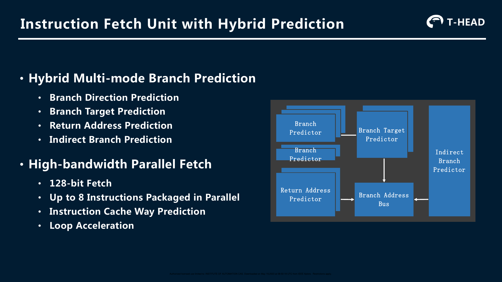

## 第 11 页：双发射乱序 Load/Store 单元

乱序双发射能力：

- load/store 地址管线；
- 独立 store data 管线；
- 推测失败预测。

快速完成能力：

- load-to-use 为 3 周期；
- store 执行为 1 周期。

预取能力：

- 多模式、多流；
- 同时支持虚拟地址与物理地址预取；
- 预取容量可配置。

框图显示发射队列分别向 LD、ST、ST_DATA 路径发射。LD 经 AGU 访问 D-Cache；ST 经 AGU 进入 write buffer；独立 ST_DATA 路径向写缓冲提供数据。

## 第 12 页：高效率多核互连

主要特性：

- 解耦的处理器接口单元 PIUx；
- MOESI 一致性协议；
- 基于目录的一致性架构；
- 支持 snoop filter；
- 可配置 L2 Cache，最大 8 MB；
- 支持 ECC。

框图中多个 PIUx 接入 snoop filter 与 snoop control，共享 L2，并通过 Master Interface 与 Slave Interface 连接外部系统。

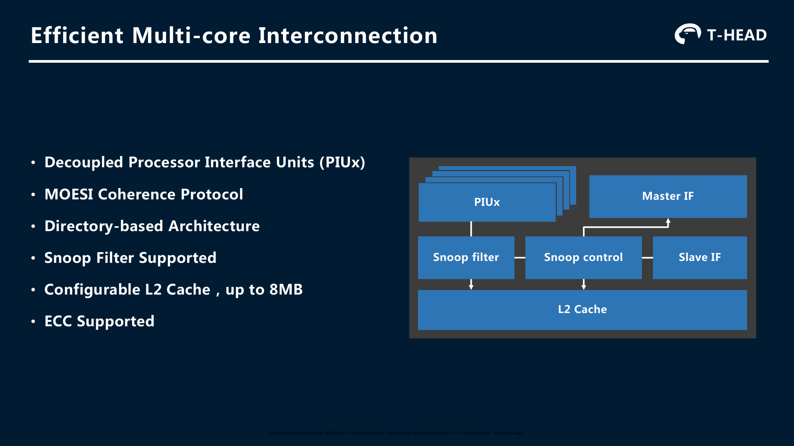

## 第 13 页：面向 AI 优化的向量计算引擎

主要特性：

- 兼容 RISC-V Vector 0.7.1；
- 支持 FP16/32/64 与 INT8/16/32/64；
- 256 位运算宽度，由 VL=128 的两条管线组成；
- 每周期执行两个 128 位向量 ALU 操作；
- 每周期执行一个 128 位向量 load 和一个 128 位向量 store；
- 向量 load/store 直接访问 L1 Cache；
- 双发射乱序向量执行流水线；
- 每簇 FP16 算力超过 300 GFLOPS，计算式为 32 FLOPS/核/周期 × 2.5 GHz × 4 核；
- 扩宽到 FP32 时算力为 FP16 的一半。

框图由向量寄存器文件和多组向量执行单元组成。

**译注：** 本页原文写作“VL = 128 and 2 pipelines”，而 ISCA 论文在同一配置处明确写两个 VLEN=128、SLEN=128 的 slice。VL 通常表示运行时当前向量长度，VLEN 才表示实现的向量寄存器长度参数；因此演示稿这里很可能是在用非严格缩写描述 128 位管线。本文保留原页写法，并以论文术语为准解释硬件配置。

## 第 14 页：高效率性能分析引擎

本页用多张工具截图展示性能分析环境，包括：

- 函数耗时或指令占比；
- IPC、I-Cache、D-Cache、分支预测等仪表；
- 指令计数柱状图；
- 带函数调用、事件和时间区间的 trace 时间线；
- 执行指令、地址和反汇编信息；
- 表格化热点与定位信息。

页面没有额外正文，核心信息是 XT-910 提供集成式、图形化的 profiling 能力。截图中可辨认的英文界面文字对应如下：

| 英文界面项 | 中文含义 |
|---|---|
| Running / Overview / Finish Profiling | 正在运行 / 总览 / 结束性能采集 |
| CPU Type / Elapsed Insns / Elapsed Cycles | CPU 类型 / 已执行指令数 / 已运行周期数 |
| Memory Accesses / Write / Read | 内存访问 / 写 / 读 |
| IRQ & FRQ | 中断请求与频率 |
| Function Rank - Accumulated Elapsed Cycles | 函数累计耗时周期排名 |
| Total Function Cycles Rank | 函数总周期占比排名 |
| Insn Cache / Data Cache / Branch Predict | 指令 Cache / 数据 Cache / 分支预测 |
| refs / miss / miss rate | 访问次数 / 未命中次数 / 未命中率 |
| Instructions / Instruction Summary | 指令 / 指令分类汇总 |
| alu / load / store / branch / jump / rts / rte | 算术逻辑 / 载入 / 存储 / 条件分支 / 跳转 / 子程序返回 / 异常返回 |
| Instruction Count Rank | 指令数量排名 |
| Timeline / Function / Call Paths | 时间线 / 函数 / 调用路径 |
| name / cycle% / insn / cycle | 名称 / 周期占比 / 指令数 / 周期数 |
| total_insn / total_cycle / calls / address | 累计指令数 / 累计周期数 / 调用次数 / 地址 |
| Export CSV | 导出 CSV |

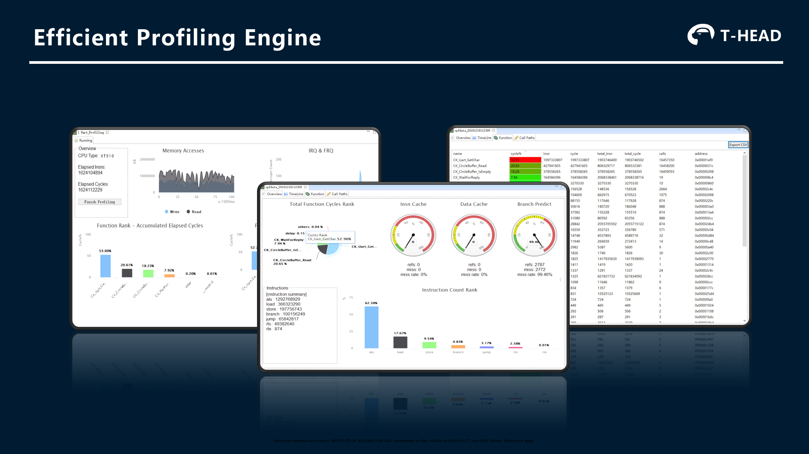

## 第 15 页：实验结果

左图为 EEMBC，右图为 NBench，均以 Cortex-A73 为 1.0 左右的归一化对照，图例为 A73 与 XT910。

EEMBC 类别：

- automotive（汽车电子）；
- consumer（消费电子）；
- networking（网络处理）；
- telecom（电信处理）。

NBench 子项：

- Assignment（赋值运算）；
- Bitfield（位域操作）；
- Fourier（傅里叶计算）；
- FP Emulation（浮点模拟）；
- Huffman（霍夫曼编码）；
- IDEA（IDEA 加密算法）；
- LU Decomposition（LU 分解）；
- Neural Net（神经网络）；
- Numeric Sort（数值排序）；
- String Sort（字符串排序）。

从柱状图可见，XT-910 在不同子项上有赢有输；EEMBC 四组整体不低于 A73，NBench 整体与 A73 接近。原页没有给柱顶精确数值，应结合第一篇论文图 18、图 19 和正文结论阅读。

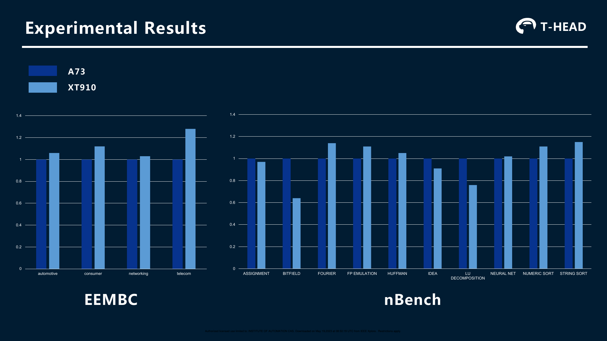

## 第 16 页：FPGA 演示

页面由现场实物与屏幕截图组成，标题为 “FPGA DEMO”。图中展示：

- FPGA 开发硬件和连接线缆；
- 终端/调试窗口；
- 图像或视频演示画面；
- 实物场景中的猫。

原页没有进一步文字参数，因此不对演示负载、帧率或 FPGA 型号作超出图片的推断。

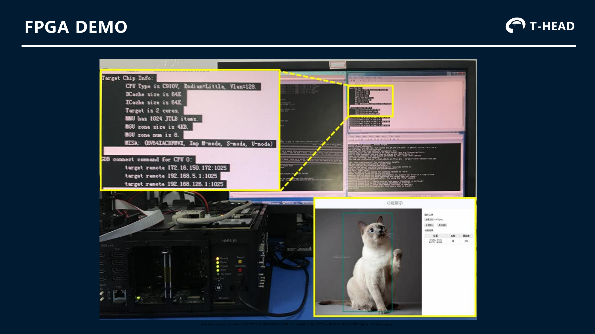

## 第 17 页：ASIC 实现

| 指标 | 数据 |
|---|---|
| 工艺 | TSMC 12 nm FinFET |
| 工作频率 | 2.0 GHzᵃ–2.5 GHzᵇ |
| 每核面积，不含 L2 | 不带 VEC 0.6 mm²；带 VEC 0.8 mm² |

脚注：

- a：LVT 6T-turbo 标准单元，0.8 V VDD，TT、85 ℃。
- b：30% ULVT 标准单元，1.0 V VDD，TT、85 ℃。

左侧为单核版图，与 ISCA 论文图 3 相同。

## 第 18 页：搭载玄铁的无剑 SoC 平台

页面主题为 **推动芯片差异化竞争**。演示稿宣称无剑 SoC 平台可以：

- 将芯片设计时间缩短 50%；
- 将设计成本最多节省 50%。

这些数字是演示稿中的平台宣传口径，原页未提供测量方法、样本或误差范围。

## 第 19 页：总结

玄铁 910 被总结为：

- 超高性能超标量处理器；
- RISC-V 兼容，并采用 RISC-V Turbo 技术；
- 双发射乱序存储子系统；
- AI 向量加速引擎。

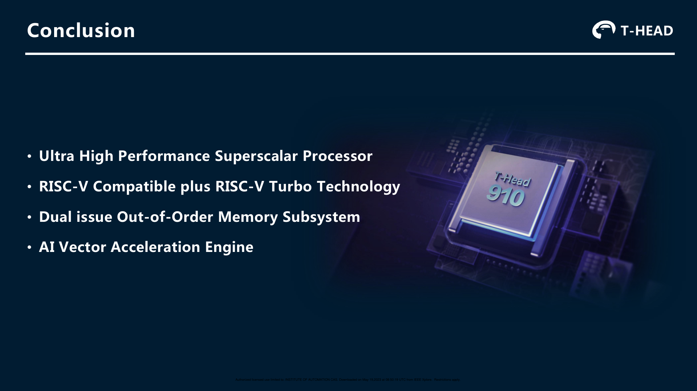

---

# 图表完整性与图内英文对照

本节用于核对图表是否遗漏，并集中解释原图中因保持原始视觉内容而仍然显示为英文的标签。第一篇论文共 21 幅编号图和 2 张编号表，已全部嵌入；第二篇演示稿共 19 页，已逐页完整嵌入。图中的模块缩写保留原样，是为了能够与论文、演示稿和 RTL 模块名对应；其中文含义如下。

## ISCA 论文的 21 幅图

| 图号 | 原图主题 | 图内英文标签的中文对应 |
|---|---|---|
| 图 1 | U、S、M 特权模式 | User-mode / User processes：用户态 / 用户进程；Supervisor-mode / Hypervisor and kernel：监管者模式 / hypervisor 与内核；Machine-mode / Low-level access to machine; Inherently trusted：机器态 / 机器级底层访问、固有可信 |
| 图 2 | 四核簇 | Branch Prediction：分支预测；Instruction Fetch：取指；I-Cache / D-Cache：指令 / 数据 Cache；Decoder：译码器；Rename：重命名；Dispatch：分派；Issue Queue：发射队列；Physical Register File：物理寄存器文件；Write Back：写回；Coherence Bus：一致性总线；ALU/VEC/FPU/BJU/LSU/MMU TLB/HAD 分别为算术逻辑、向量、浮点、分支跳转、访存、内存管理与地址转换、硬件辅助调试单元 |
| 图 3 | 单核与双核版图 | Layout of a single-core, with vector execution unit and 512KB L2 cache：带向量执行单元和 512 KB L2 的单核版图；ciu/lsu/rtu/idu/vfpu/ifu/iu/mmu：一致性互联、访存、退休、译码、向量浮点、取指、整数执行和内存管理模块；L2 cache：二级 Cache |
| 图 4 | 12 级流水线 | instruction fetch：取指；instruction decode & issue：指令译码与发射；Load/Store pipe：访存管线；Branch pipe：分支管线；ALU/DIV pipe：ALU/除法管线；ALU/MUL pipe：ALU/乘法管线；Vector (VFPU) pipe：向量/向量浮点管线；AG/DC/DA：地址生成/数据 Cache/数据对齐；BR：分支执行；WB：写回 |
| 图 5 | IFU 三级流水 | PC Gen：PC 生成；allocate：分配；Chgflw IF/IP/IB：IF、IP、IB 级控制流改变；I-Cache：指令 Cache；Inst Pack：指令打包；Inst Buffer：指令缓冲 |
| 图 6 | 两级预测缓冲 | BUF1/BUF2：一级/二级预测值缓冲；Branch prediction result：分支预测结果；上方重复小格表示多个预测 SRAM 存储体 |
| 图 7 | 循环缓冲 | cycle0–cycle4：第 0–4 周期；inst0 等：第 0 条等指令；Bubble：流水空泡；inst from I-Cache / inst from LBUF：来自 I-Cache / LBUF 的指令 |
| 图 8 | 推测失败恢复 | Flush FE/IR/IS/BE：清空前端/重命名级/发射级/后端；Stall IR：阻塞重命名级；Retire Flush / Jmp Mispred Flush：退休级发起清空 / 跳转误预测清空；BHT Mispred Cancel and Flush：取消分支历史表误预测并清空流水 |
| 图 9 | LSU 流水 | LD PIPE / ST PIPE：load / store 管线；Addr gen：地址生成；TLB：地址转换缓冲；D-Cache：数据 Cache；LQ/SQ：load/store 队列；ST TAG：store tag 阵列；Align：数据对齐；Early forward：提前转发；Writeback/WB：写回；Linefill/Victim：Cache line 填充/被替换行；BUS/DS：总线/DS 接口，原文未展开 DS 缩写 |
| 图 10 | store 地址与数据分离 | Load/Store Issue Queue：load/store 发射队列；Store Issue Queue：store-data 发射队列；ld/st.addr/st.data：load、store 地址、store 数据微操作；AGU：地址生成单元；DATA Cache：数据 Cache；Store Queue：store 队列 |
| 图 11 | 多模式预取 | ld/st inst. flow：load/store 指令流；seq_dect：访问序列检测；Global mode：全局模式；multi_stream mode：多流模式；data prefetch：数据预取 |
| 图 12 | 多页 TLB | uTLB full-associated：全相联 uTLB；jTLB Tag Array Way-associated：组相联 jTLB tag 阵列；Valid：有效位；VPN A/B/C/D/X：示例虚拟页号；4K/2M/1G：条目页大小；G：全局映射位；Index_4K/2M/1G：按 4 KB/2 MB/1 GB 页索引；refill when hit：命中后回填；miss va[38:0]：未命中的虚拟地址 |
| 图 13 | 多核框图 | Core0–Core3：一个簇内的四个处理器核；L2 SLICE0/1：两个 L2 分片；Snoop Filter：侦听过滤器；CPU0–CPU3：连接到 Ncore 的四个 CPU 簇节点，其中 CPU0 在左侧展开；Ncore：多簇互连；NPU0/1：NPU 节点；DDR0/1：外部内存通道；CAI/NCB/CMI 为 Ncore 接口模块缩写，原文未展开全称 |
| 图 14 | 向量流水 | VIQ0/VIQ1：向量发射队列 0/1；Flag Physical Register File：标志物理寄存器文件；Vector Physical Register File：向量物理寄存器文件；VFPU：向量浮点/整数执行单元；VDSP：向量 DSP 执行单元；EX1–EX5：执行第 1–5 级 |
| 图 15 | 编译工具链 | C/C++ Code / Assembly Code / Lib/object/data Files：C/C++ 代码 / 汇编代码 / 库、目标和数据文件；Preprocessor / Runtime Library：预处理器 / 运行库；Instruction Mapping / Call Conversion / Optimize Passes / Pipeline Scheduler：指令映射 / 调用转换 / 优化过程 / 流水调度器；Assembler / Linker / CPU BFD：汇编器 / 链接器 / CPU 二进制文件描述后端；Executable File / Library or object File / Map-Symbol File：可执行文件 / 库或目标文件 / 映射与符号文件 |
| 图 16 | 性能分析工具 | Total Function Cycles Rank：函数总周期排名；Insn Cache / Data Cache / Branch Predict：指令 Cache / 数据 Cache / 分支预测；refs/miss/miss rate：访问/未命中/未命中率；Instruction Count Rank：指令数量排名；Timeline / Function / Call Paths：时间线 / 函数 / 调用路径；Executed Instructions / Locations：已执行指令 / 代码位置。更完整的界面对照见 Hot Chips 第 14 页 |
| 图 17 | CoreMark | CoreMark/MHz：每 MHz 的 CoreMark；In-order processor / Out-of-order processor：顺序执行 / 乱序执行处理器；各柱名称为被比较的处理器型号 |
| 图 18 | EEMBC | Cortex-A73 / XT-910：两种处理器；automotive / consumer / networking / telecom：汽车电子 / 消费电子 / 网络处理 / 电信处理；纵轴百分比表示以 A73 为 100% 的归一化性能 |
| 图 19 | NBench | Assignment / Bitfield / Fourier / FP Emulation / Huffman / IDEA / LU Decomposition / Neural Net / Numeric Sort / String Sort：赋值 / 位域 / 傅里叶 / 浮点模拟 / 霍夫曼编码 / IDEA 加密 / LU 分解 / 神经网络 / 数值排序 / 字符串排序；纵轴为归一化性能 |
| 图 20 | 扩展与编译优化 | Native RISC-V ISA + standard compiler：原生 RISC-V ISA 与标准编译器；XT-910 with instruction extension + optimized compiler：XT-910 指令扩展与优化编译器；EEMBC/NBench/OpenSSL 为三个测试组；纵轴为相对性能百分比 |
| 图 21 | 预取结果 | prefetch performance：预取性能；average：平均值；stream-triad/add/scale/copy：Stream 三元组/加法/缩放/复制；a–e 对应正文列出的五种 L1、L2、TLB 预取配置；横轴为相对关闭预取基线的性能倍数 |

## ISCA 论文的 2 张表

| 表号 | 完整性 | 中文对应位置 |
|---|---|---|
| 表 I，XT-910 Core Configurations | 原表图已嵌入，5 个配置项全部转录 | “表 I：XT-910 核配置”，包括每簇核心数、L1 D/I Cache、L2 Cache 和向量扩展 |
| 表 II，Results of XT-910 Core in 12 nm FinFET | 原表图已嵌入，3 个指标和 a/b/c 三条脚注全部转录 | “表 II：12 nm FinFET 下的 XT-910 核结果”，包括频率、面积、动态功耗及工艺、电压、温度条件 |

## Hot Chips 演示稿的 19 页

| 页码 | 原页标题的中文对应 | 页面内容覆盖情况 |
|---:|---|---|
| 1 | 玄铁 910：以 RISC-V 创新云计算与边缘计算 | 标题、演讲人和品牌已译，整页原图已嵌入 |
| 2 | 开源，共建新 AIoT 时代的芯片生态 | 标语和全部作者姓名已保留，整页原图已嵌入 |
| 3 | 构建 AIoT 时代的芯片基础设施 | 云、应用领域、AliOS、领域专用 SoC、RISC-V 处理器和领域专用架构各层已译 |
| 4 | 持续演进的玄铁处理器架构 | 902、在研 9xx 和 910 的三段说明已译 |
| 5 | 玄铁 910 超高性能架构 | 12 条主要能力、框图模块和目标场景已译 |
| 6 | 显著的性能 | 8 个处理器的 CoreMark/MHz 数值、40% 对比和 4 条数据来源已保留 |
| 7 | 兼容 RISC-V 规范 | ISA、向量、特权模式、内存管理和中断控制已逐项译成表格 |
| 8 | 扩展增强：RISC-V Turbo | 6 类扩展和 3 组归一化 benchmark 已译，并说明图中没有柱顶精确值 |
| 9 | 深度超标量乱序流水线 | 前后端要点以及 IF 到 WB 的各条执行管线已译 |
| 10 | 采用混合预测的取指单元 | 4 类预测、4 项高带宽取指能力及预测器框图已译 |
| 11 | 双发射乱序 Load/Store 单元 | 乱序发射、快速完成、预取能力和 LD/ST/ST_DATA 路径已译 |
| 12 | 高效率多核互连 | PIUx、MOESI、目录、snoop filter、L2、ECC 及接口模块已译 |
| 13 | 面向 AI 优化的向量计算引擎 | 数据类型、256 位计算、128 位访存、乱序执行和峰值公式已译 |
| 14 | 高效率性能分析引擎 | 截图内可辨认的仪表、图、表、菜单、字段和指令分类已逐项对照 |
| 15 | 实验结果 | EEMBC 与 NBench 的图例和所有子项均已给出中英文对应 |
| 16 | FPGA 演示 | 原页所有视觉内容已保存；原页无负载、帧率或型号说明，因此未作推测 |
| 17 | ASIC 实现 | 工艺、频率、面积和 a/b 工艺条件已完整转录 |
| 18 | 搭载玄铁的无剑 SoC 平台 | “设计时间降低 50%”与“设计成本最多降低 50%”已译并注明宣传数据边界 |
| 19 | 总结 | 超标量、RISC-V Turbo、乱序存储子系统和向量引擎四项结论已译 |

此完整性清单中的“全部”指两份 PDF 的技术正文、标题、项目符号、图、图注、表、表注、致谢和参考文献。IEEE 授权下载页脚不在每页重复翻译，已在本文“文档说明”统一记录；品牌标识、处理器型号、人名、URL、代码缩写和标准专名保留原文，以免翻译后失去唯一对应关系。

---

# 两份材料的信息对应关系

| 主题 | ISCA 论文 | Hot Chips 演示 |
|---|---|---|
| 定位 | 完整工业论文，解释设计动机和实现 | 产品化架构与生态展示 |
| 核心参数 | 12 级流水、3 译码、最多 8 发射、192 项 ROB | 12 级流水、3 译码、8 发射 |
| IFU | 三级 IF/IP/IB、混合预测、L0/L1 BTB、16 项 LBUF | 混合多模式预测、128 位取指、最多打包 8 条 |
| LSU | load/store 双发射、LQ/SQ、地址/数据拆分、推测失败预测 | 3 周期 load-to-use、1 周期 store、独立 ST_DATA |
| 存储层次 | 32/64 KB L1、最高 8 MB 包含式 L2、多尺寸 TLB | 32/64 KB L1、最高 8 MB L2、ECC |
| 一致性 | 原文写 MOSEI，含 snoop filter | 明确写 MOESI、目录式架构、snoop filter |
| 向量 | Vector 0.7.1、双发射乱序、64 位 slice、建议 2×128 位 | 256 位运算、2×128 位管线、每簇 FP16 超过 300 GFLOPS |
| 工艺 | TSMC 12 nm；0.6/0.8 mm²；2.0–2.5 GHz | 同一组 ASIC 数据 |
| 性能 | CoreMark、EEMBC、NBench、SPECInt2006、Stream | CoreMark、EEMBC、NBench |
| 软件 | CDS、GCC/Binutils、编译器协同优化 | 图形化 profiling engine |
| 生态 | 云端 FPGA、边缘/IoT、未来开源计划 | AIoT 基础设施、无剑 SoC 平台 |

# 从体系结构角度串联全文

## 一、先区分 ISA、微结构与实现

ISA 规定软件可以看见什么，例如 RV64GCV 指令、寄存器、特权模式、异常和地址转换规则。微结构规定处理器如何实现这些语义，例如采用几级流水、多少项 ROB、怎样预测分支、如何调度 load/store。物理实现则回答微结构在特定工艺上能跑多快、多大、多耗电，例如 12 nm、0.8 V/1.0 V、LVT/ULVT、面积和频率。

同一 ISA 可以有完全不同的微结构；同一微结构移到不同工艺、标准单元和 Cache 宏后，也会得到不同频率与功耗。因此，“RISC-V 性能”和“12 nm 下 XT-910 的性能”不是同一层结论。论文中的定制指令属于 ISA 扩展，乱序执行和混合预测属于微结构，2.5 GHz 与 0.8 mm² 属于物理实现结果。

## 二、性能由指令数、CPI 和频率共同决定

单线程执行时间可以写成：

> 执行时间 = 动态指令数 × CPI ÷ 时钟频率

这个式子给出了三条优化路径：编译器或定制指令减少动态指令数；微结构提高 IPC、降低 CPI；电路与流水划分提高频率。三者会相互影响。更深的流水可能提高频率，却增加误预测恢复代价；复杂定制指令可能减少指令数，却增加译码或执行关键路径；更激进的预取可能降低等待 CPI，却提高带宽和功耗。

为理解 CPI，可将额外周期按原因分类为前端供给不足、后端依赖/端口/容量阻塞、存储层次等待和错误推测恢复。但这些事件可能在同一周期重叠，不能把所有 stall 百分比直接相加。更可靠的分析要从退休端出发：先找出没有达到退休宽度的周期，再判断当时 ROB 头部在等什么，以及更前面的队列为什么没有准备好可退休工作。

分支误预测对 CPI 的粗略贡献可用“每条指令的误预测次数 × 平均恢复代价”估计；Cache miss 的贡献还要考虑多个 miss 是否并行、乱序窗口是否有独立工作以及预取是否及时。若多个 miss 可以重叠，简单使用“miss 数 × 单次内存延迟”会严重高估停顿。

## 三、前端要评价的是有效供给，不是标称取指宽度

128 位取指、最多 8 条打包和 3 条译码构成由宽到窄的前端。压缩指令比例、跨边界取指、I-Cache 与 ITLB miss、BTB 命中、方向预测和 IBUF 水位共同决定每周期真正送入后端的有效指令数。错误路径上的取指和译码虽然消耗带宽，却不会形成退休指令。

若前端是瓶颈，常见证据链是：译码入口长期缺少有效指令，同时 IBUF 经常为空；再向前追踪，可看到 I-Cache/ITLB miss、BTB miss、分支误预测或重定向占用较高。若 IBUF 中一直有指令但译码后端不接收，则问题通常不是取指本身，而是重命名资源、ROB、发射队列或 load/store 队列反压。

## 四、乱序窗口要评价的是可利用的指令级并行性

ROB 提供“向前看”的范围，发射队列负责从范围内选择已就绪操作，物理寄存器保存不同推测版本。它们共同把程序中潜在的指令级并行性转化为执行端口利用率。窗口大并不自动带来高 IPC：

1. 长 RAW 依赖链会使大量年轻指令等待同一个生产者。
2. 某类端口过少会使已就绪指令排队，例如乘除法、分支或 AGU 冲突。
3. ROB、IQ、物理寄存器、LQ 或 SQ 任一资源先满，前端都会被迫停止。
4. ROB 头部若等待长延迟 load 或异常处理，后续已完成指令也不能越过它退休。
5. 分支或内存次序误推测会清除已经完成的错误工作，降低有效 IPC。

因此应把“未发射”继续拆成操作数未就绪、端口不可用和结构资源阻塞；把操作数未就绪继续按生产者分成整数、乘除法、分支、浮点、向量和 load 返回。这样才能回答“not-ready 指令到底在等谁”。

## 五、LSU 是乱序正确性与大工作集性能的交汇点

load/store 同时涉及地址转换、Cache、内存次序和外部带宽。小工作集命中 L1 时，3 周期 load-to-use、AGU 数量、store-to-load forwarding 和 Bank 冲突更重要；大工作集下，L2/内存延迟、TLB、未完成 miss 容量、预取与带宽开始主导。

分析存储瓶颈可以按以下因果顺序进行：

1. 先看 load/store 动态占比和每千条指令的各级 Cache/TLB miss。
2. 再看 miss 的平均与尾部延迟、并行未完成请求数，以及 ROB 头部因 load 等待的周期。
3. 检查 LQ/SQ 满、AGU/Cache 端口冲突、store-forward 失败和内存次序回放。
4. 对预取分别测覆盖率、准确率、及时性、污染和额外带宽。
5. 用关闭/开启单个机制的对照实验确认周期变化，而不是仅凭相关性下结论。

论文的 Stream 实验属于规则流、高延迟环境，适合证明多级预取的潜在上限；SPECInt2006 更能暴露不规则访问、大工作集和完整内存系统的综合限制。两者用途互补，不能互相替代。

## 六、多核与向量性能都受数据供给约束

多核增加并行线程，向量增加单条指令处理的数据元素数，但两者最终都要从 Cache 和内存取得数据。多核还增加一致性与共享资源竞争；向量则可能产生更高的瞬时 load/store 带宽需求。理论峰值只有在数据布局、局部性、并行度和软件向量化都合适时才能接近。

对多核，应报告 1/2/4/更多核心的加速比、每核 IPC、共享 L2 miss、互连流量和内存带宽；对向量，应报告向量化比例、平均 VL、执行单元利用率、向量 load/store 带宽、重排开销和标量剩余部分。只报告核心数、位宽或 GFLOPS 峰值，无法说明真实应用效率。

## 七、把论文机制转化为可验证的实验

| 论文机制 | 主要目标 | 最直接的观测量 | 建议的对照实验 |
|---|---|---|---|
| L0/L1 BTB、方向预测、RAS | 减少错误路径和重定向气泡 | 各类分支 MPKI、BTB miss、恢复周期、错误路径指令 | 固定二进制，对比预测器组件或容量 |
| IBUF、LBUF | 平滑前端供给、加速短循环 | 缓冲空/满周期、译码有效条数、LBUF 命中与覆盖 | 启停 LBUF；按循环体大小分组 |
| 192 项 ROB 与多队列发射 | 隐藏长延迟、利用指令级并行 | ROB/IQ 占用、not-ready 来源、端口冲突、零退休周期 | 改窗口或队列容量；按依赖链 benchmark 对比 |
| 双发射 LSU 与 store 拆分 | 增加访存并行、提前解析地址 | LD/ST 发射率、AGU 冲突、SQ/LQ 满、转发和回放 | load-only、store-only、混合读写及别名压力测试 |
| 多级 TLB 与大页 | 降低地址转换等待 | 各级 TLB MPKI、页表遍历、TLB stall | 4 KB 与大页；不同地址空间工作集 |
| 多模式预取 | 隐藏 Cache/内存延迟 | 覆盖率、准确率、及时性、污染、带宽 | 分别启停 L1/L2/TLB 预取并扫描距离 |
| 定制指令和编译优化 | 减少指令数与关键链 | 动态指令数、代码大小、IPC、端口利用率 | 三组 ISA/编译器配置分离软硬件收益 |
| 向量双发射 | 提高数据并行吞吐 | 向量化比例、VL、VFPU 利用率、访存带宽 | 计算密集与带宽密集 kernel 分开测试 |
| 共享 L2、MOESI、目录 | 扩展多核并保持一致性 | L2 命中、snoop、目录命中、共享 line 迁移、带宽 | 私有数据、只读共享、写共享三种模式 |

一项可信的优化结论应至少闭合四层证据：程序动态特征说明为什么会触发该机制；微结构计数器证明原瓶颈确实存在；单变量实验证明修改改变了目标事件；最终的 IPC、执行周期、频率、面积和功耗说明收益是否值得。若只看到总周期变快，却没有事件归因和 PPA 代价，就还不能说明改进来自预期机制。

# 阅读这些数据时必须保留的边界

1. **CoreMark/MHz 不等于综合 CPU 性能。** 论文自己也指出 CoreMark 基本命中 Cache，不能代表大工作集、DDR 和完整存储层次。
2. **SPECInt2006 的 6.11/GHz 是系统配置相关数据。** 它受编译器、Cache、内存和运行规则影响，不能脱离论文配置直接与当前 RTL 仿真相除。
3. **EEMBC/NBench 图是归一化结果。** 原图没有完整公开每个绝对分数，不能从柱高推导过度精确的小数。
4. **向量版本是 0.7.1。** 它早于后来定稿的 RISC-V V 1.0，软件和编码不能直接按现代 V 1.0 假定。
5. **性能主张属于 2020 年时间点。** “当时最高性能”“未来产品计划”和市场预测应按原始发表语境理解。
6. **C910 开源 RTL 与论文商用配置不必完全等价。** Cache 容量、向量单元、核数、工艺库、编译器和 SoC 环境都可能不同，使用论文参数分析当前仓库时必须逐项回到 RTL 与配置核实。
